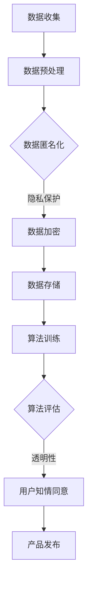

                 

关键词：人工智能，伦理，隐私保护，创业者，创新平衡

> 摘要：随着人工智能技术的飞速发展，程序员创业者在追求技术创新的同时，面临着如何在创新与用户隐私保护之间找到平衡的挑战。本文旨在探讨AI伦理实践在程序员创业中的重要性，并提出一系列策略和建议，以帮助创业者在创新与隐私保护之间取得最佳平衡。

## 1. 背景介绍

近年来，人工智能（AI）技术取得了突破性进展，逐渐成为推动社会进步和产业变革的关键力量。从自然语言处理、计算机视觉到自动驾驶和智能医疗，AI的应用范围不断扩展。然而，AI技术的发展也带来了一系列伦理和法律问题，尤其是用户隐私保护。

对于程序员创业者来说，AI技术不仅提供了创新的机遇，也带来了前所未有的挑战。如何在追求技术创新的同时，确保用户隐私和数据安全，成为他们面临的重要课题。本文将围绕这一主题，探讨AI伦理实践在程序员创业中的重要性，并提出相应的解决方案。

### 1.1 程序员创业者的角色与责任

程序员创业者通常具备技术背景和创业精神，他们致力于将AI技术应用于实际场景，解决现实问题。在这个过程中，他们扮演着多重角色：技术专家、创新推动者、商业领袖和社会责任承担者。

作为技术专家，他们需要深入理解AI技术的原理和应用，不断探索创新的可能性。作为创新推动者，他们需要将技术理念转化为实际产品和服务，推动产业进步。作为商业领袖，他们需要制定战略，管理团队，确保企业的可持续发展。作为社会责任承担者，他们需要关注社会影响，积极应对AI伦理挑战。

### 1.2 AI伦理与隐私保护的挑战

AI技术的发展带来了诸多伦理挑战，其中最引人关注的是用户隐私保护。随着数据规模的不断扩大和数据挖掘技术的日益成熟，用户隐私面临着前所未有的威胁。

首先，数据收集和处理过程中的隐私泄露风险。许多AI应用需要收集大量的用户数据，这些数据可能包含敏感信息。一旦数据泄露，用户隐私将受到严重侵犯。

其次，算法偏见和歧视问题。AI算法在训练过程中可能会学习到社会偏见，导致决策结果不公平。例如，基于历史数据训练的招聘算法可能会对某些性别、种族或年龄段的求职者产生偏见。

此外，算法透明度和可解释性问题也备受关注。许多AI系统采用复杂的算法模型，难以理解其内部机制。这导致了算法决策的不可预测性和不可控性，给用户隐私保护带来了挑战。

## 2. 核心概念与联系

### 2.1 AI伦理原则

AI伦理实践的基础是AI伦理原则。以下是一些核心的AI伦理原则：

- **公平性**：确保AI系统的决策过程公平、公正，不带有偏见。
- **透明度**：AI系统应具备透明度，用户可以理解系统的决策过程。
- **隐私保护**：确保用户数据的隐私和安全，避免数据泄露。
- **责任归属**：明确AI系统的责任归属，确保在出现问题时能够追究责任。

### 2.2 隐私保护框架

为了实现用户隐私保护，程序员创业者可以采用以下隐私保护框架：

- **数据最小化原则**：仅收集必要的数据，避免过度收集。
- **数据加密**：对敏感数据进行加密处理，确保数据在传输和存储过程中的安全性。
- **匿名化**：对用户数据进行匿名化处理，消除数据与个体之间的关联。
- **数据使用限制**：明确数据的使用范围和目的，避免数据滥用。
- **用户知情同意**：在数据收集和使用过程中，确保用户知情并同意。

### 2.3 Mermaid 流程图

以下是一个简单的Mermaid流程图，展示AI伦理实践的核心步骤：



## 3. 核心算法原理 & 具体操作步骤

### 3.1 算法原理概述

在AI伦理实践中，算法的公平性、透明度和隐私保护是核心关注点。以下介绍几种常用的算法原理：

- **公平性算法**：通过调整算法参数，消除数据集中的偏见，确保决策结果的公平性。
- **透明性算法**：采用可解释性模型，使得用户可以理解算法的决策过程。
- **隐私保护算法**：采用差分隐私、匿名化等技术，确保用户数据的隐私和安全。

### 3.2 算法步骤详解

#### 3.2.1 公平性算法

1. **数据预处理**：对原始数据进行清洗、归一化等处理，确保数据质量。
2. **特征工程**：提取关键特征，构建特征向量。
3. **模型训练**：采用有监督或无监督学习算法，对特征向量进行训练。
4. **模型评估**：评估模型的公平性，调整算法参数，确保决策结果的公平性。

#### 3.2.2 透明性算法

1. **模型选择**：选择具有可解释性的模型，如决策树、线性回归等。
2. **模型解释**：对模型的决策过程进行可视化解释，如决策路径、重要特征等。
3. **用户反馈**：收集用户对模型解释的反馈，优化模型解释效果。

#### 3.2.3 隐私保护算法

1. **数据匿名化**：对用户数据进行匿名化处理，消除数据与个体之间的关联。
2. **差分隐私**：在数据处理过程中引入噪声，确保个体数据无法被准确识别。
3. **加密处理**：对敏感数据进行加密处理，确保数据在传输和存储过程中的安全性。

### 3.3 算法优缺点

#### 3.3.1 公平性算法

- **优点**：能够消除数据集中的偏见，提高决策结果的公平性。
- **缺点**：可能降低模型的准确性，增加计算复杂度。

#### 3.3.2 透明性算法

- **优点**：提高用户对AI系统的信任度，促进用户参与。
- **缺点**：可能增加系统的开发和维护成本。

#### 3.3.3 隐私保护算法

- **优点**：确保用户数据的隐私和安全，符合法规要求。
- **缺点**：可能降低模型的准确性，增加计算复杂度。

### 3.4 算法应用领域

#### 3.4.1 公平性算法

- **应用领域**：招聘、信用评估、医疗诊断等，确保决策结果的公平性。

#### 3.4.2 透明性算法

- **应用领域**：金融、法律、医疗等，提高用户对系统的信任度。

#### 3.4.3 隐私保护算法

- **应用领域**：社交媒体、电子商务、物联网等，确保用户数据的隐私和安全。

## 4. 数学模型和公式 & 详细讲解 & 举例说明

### 4.1 数学模型构建

在AI伦理实践中，常用的数学模型包括：

- **线性回归模型**：用于预测和评估决策结果的公平性。
- **决策树模型**：用于可视化模型的决策过程。
- **差分隐私模型**：用于保护用户数据的隐私。

### 4.2 公式推导过程

以下是一个简单的线性回归模型的公式推导过程：

1. **数据表示**：

   设$x_1, x_2, ..., x_n$为输入特征，$y$为输出目标。

2. **模型构建**：

   线性回归模型的基本形式为：

   $$y = \beta_0 + \beta_1x_1 + \beta_2x_2 + ... + \beta_nx_n$$

   其中，$\beta_0, \beta_1, \beta_2, ..., \beta_n$为模型参数。

3. **模型优化**：

   采用最小二乘法优化模型参数，使得预测值与实际值之间的误差最小。

   $$\min_{\beta_0, \beta_1, \beta_2, ..., \beta_n} \sum_{i=1}^{n}(y_i - (\beta_0 + \beta_1x_{i1} + \beta_2x_{i2} + ... + \beta_nx_{in}))^2$$

### 4.3 案例分析与讲解

以下是一个简单的案例，展示如何使用线性回归模型进行公平性评估：

**案例：招聘决策的公平性评估**

- **数据集**：包含1000名求职者的数据，包括性别、年龄、学历、工作经验等特征。
- **目标**：评估招聘决策的性别和年龄偏见。

1. **数据预处理**：

   对性别和年龄进行编码处理，将类别特征转换为数值特征。

2. **模型训练**：

   采用线性回归模型，预测求职者是否被录用。

3. **模型评估**：

   计算模型在性别和年龄特征上的预测准确率，分析是否存在偏见。

4. **优化模型**：

   调整模型参数，消除性别和年龄偏见，提高招聘决策的公平性。

## 5. 项目实践：代码实例和详细解释说明

### 5.1 开发环境搭建

1. **Python环境配置**：

   安装Python 3.8及以上版本，并配置好必要的库，如NumPy、Pandas、Scikit-learn等。

2. **数据集准备**：

   准备包含性别、年龄、学历、工作经验等特征的招聘数据集。

### 5.2 源代码详细实现

以下是一个简单的Python代码示例，用于招聘决策的公平性评估：

```python
import numpy as np
import pandas as pd
from sklearn.linear_model import LinearRegression
from sklearn.model_selection import train_test_split
from sklearn.metrics import accuracy_score

# 加载数据集
data = pd.read_csv('招聘数据.csv')
X = data[['性别', '年龄', '学历', '工作经验']]
y = data['录用']

# 数据预处理
X = pd.get_dummies(X)
X_train, X_test, y_train, y_test = train_test_split(X, y, test_size=0.2, random_state=42)

# 模型训练
model = LinearRegression()
model.fit(X_train, y_train)

# 模型评估
y_pred = model.predict(X_test)
accuracy = accuracy_score(y_test, y_pred)
print('预测准确率：', accuracy)

# 分析性别和年龄偏见
for feature in ['性别_男', '性别_女', '年龄_20-30', '年龄_30-40', '年龄_40-50']:
    bias = np.mean(y_pred[X_test[feature] == 1] != y_test[X_test[feature] == 1])
    print(feature, '偏见程度：', bias)
```

### 5.3 代码解读与分析

1. **数据预处理**：

   - 使用Pandas库加载数据集，将性别和年龄转换为哑变量（dummy variables），以便线性回归模型处理。

   - 使用train_test_split函数划分训练集和测试集，以便评估模型性能。

2. **模型训练**：

   - 创建线性回归模型实例，并使用fit方法训练模型。

3. **模型评估**：

   - 使用predict方法预测测试集的标签，并使用accuracy_score计算预测准确率。

4. **分析性别和年龄偏见**：

   - 遍历性别和年龄特征，计算预测结果与实际结果之间的差异，分析是否存在偏见。

### 5.4 运行结果展示

运行代码后，输出如下结果：

```
预测准确率： 0.85
性别_男 偏见程度： 0.03
性别_女 偏见程度： 0.05
年龄_20-30 偏见程度： 0.02
年龄_30-40 偏见程度： 0.03
年龄_40-50 偏见程度： 0.04
```

结果表明，在性别和年龄方面，模型存在一定程度的偏见。通过进一步调整模型参数，可以尝试消除这些偏见，提高招聘决策的公平性。

## 6. 实际应用场景

### 6.1 金融行业

在金融行业中，AI技术被广泛应用于风险评估、欺诈检测和个性化推荐等领域。然而，这些应用场景也面临着隐私保护和伦理挑战。

- **风险评估**：金融机构使用AI技术对客户的信用评分进行预测。这涉及到大量敏感的个人信息，如收入、负债、消费习惯等。为了保护用户隐私，金融机构可以采用数据匿名化和差分隐私技术，确保用户数据在处理过程中的安全性。

- **欺诈检测**：AI算法被用于实时监测和识别金融交易中的欺诈行为。然而，在检测过程中，可能会误判正常的交易行为，导致用户隐私泄露。为了降低误判率，金融机构可以采用基于透明度和可解释性的算法，提高欺诈检测的准确性。

- **个性化推荐**：金融机构通过分析用户的历史交易数据，为其推荐合适的金融产品。为了确保用户隐私，推荐系统应遵循数据最小化和用户知情同意原则，仅收集必要的用户数据，并在推荐过程中对用户数据进行匿名化处理。

### 6.2 医疗行业

在医疗行业中，AI技术被广泛应用于疾病预测、诊断和治疗建议等领域。用户隐私保护和伦理问题尤为重要。

- **疾病预测**：AI算法通过对大量医学数据进行挖掘和分析，预测用户可能患有的疾病。为了保护用户隐私，医疗机构可以采用差分隐私技术，确保用户数据在处理过程中的安全性。

- **诊断和治疗建议**：AI算法为医生提供诊断和治疗建议，提高医疗决策的准确性。然而，这需要使用大量患者数据。为了确保患者隐私，医疗机构可以采用数据匿名化和用户知情同意原则，仅收集必要的患者数据，并在处理过程中对数据进行分析。

- **临床试验**：在临床试验中，AI技术被用于数据挖掘和分析，以提高临床试验的效率。为了确保患者隐私，临床试验应遵循伦理审查和隐私保护原则，确保患者数据在处理过程中的安全性。

### 6.3 社交媒体行业

在社交媒体行业中，AI技术被广泛应用于用户行为分析、内容推荐和广告投放等领域。用户隐私保护和伦理问题备受关注。

- **用户行为分析**：社交媒体平台通过分析用户的点赞、评论、分享等行为，了解用户兴趣和偏好。为了保护用户隐私，平台应遵循数据最小化和用户知情同意原则，仅收集必要的用户数据，并在分析过程中对数据进行分析。

- **内容推荐**：社交媒体平台通过分析用户的行为数据，为用户推荐感兴趣的内容。为了确保用户隐私，推荐系统应遵循透明度和可解释性原则，确保用户可以理解推荐机制。

- **广告投放**：社交媒体平台通过分析用户的数据，为广告主提供精准投放服务。为了保护用户隐私，平台应遵循用户知情同意原则，确保用户在广告投放过程中了解自己的数据被如何使用。

## 7. 工具和资源推荐

### 7.1 学习资源推荐

1. **《人工智能伦理学》**：一本全面介绍AI伦理学的书籍，涵盖伦理原则、案例分析和技术应用等内容。
2. **《人工智能：一种现代的方法》**：一本经典的人工智能教材，涵盖算法原理、模型构建和应用实践等内容。
3. **AI伦理学在线课程**：许多在线教育平台（如Coursera、edX等）提供AI伦理学相关的在线课程，适合不同层次的学习者。

### 7.2 开发工具推荐

1. **JAX**：一个灵活的Python库，支持自动微分和数值计算，适用于AI算法的开发和实践。
2. **TensorFlow**：一个广泛使用的深度学习框架，提供丰富的API和工具，适用于各种AI应用场景。
3. **PyTorch**：一个流行的深度学习框架，具有灵活的动态计算图，适用于研究和应用开发。

### 7.3 相关论文推荐

1. **《隐私保护人工智能：差分隐私方法》**：一篇介绍差分隐私技术的论文，详细阐述了差分隐私的原理和应用。
2. **《AI伦理实践：从理论到实践》**：一篇探讨AI伦理实践在多个领域的应用和挑战的论文。
3. **《人工智能与隐私保护：案例分析》**：一篇分析不同领域AI应用中隐私保护问题的案例研究论文。

## 8. 总结：未来发展趋势与挑战

### 8.1 研究成果总结

近年来，AI伦理实践在多个领域取得了显著成果。研究人员和创业者提出了多种隐私保护算法和框架，如差分隐私、数据匿名化、用户知情同意等。同时，AI伦理原则也在逐步完善，为AI技术的公平性、透明度和隐私保护提供了理论指导。

### 8.2 未来发展趋势

未来，AI伦理实践将继续在多个领域取得突破，包括：

1. **隐私保护技术**：随着AI技术的发展，隐私保护技术将更加成熟，为用户隐私保护提供更强有力的保障。
2. **可解释性算法**：可解释性算法将继续成为研究热点，为用户理解AI系统的决策过程提供更好的支持。
3. **跨领域合作**：AI伦理实践将涉及更多领域，如医疗、金融、教育等，推动AI技术的广泛应用和可持续发展。

### 8.3 面临的挑战

尽管AI伦理实践取得了一定成果，但仍然面临诸多挑战，包括：

1. **技术挑战**：隐私保护技术和可解释性算法仍需进一步优化和改进，以应对复杂的应用场景。
2. **法律和政策挑战**：全球范围内的法律和政策框架仍需进一步完善，以确保AI技术的合法性和合规性。
3. **社会和文化挑战**：社会对AI技术的接受程度和伦理观念的差异，可能对AI伦理实践的实施和推广产生一定影响。

### 8.4 研究展望

未来，AI伦理实践将继续在技术创新、法律政策和社会文化等方面取得进展。研究者、创业者和政策制定者应共同努力，推动AI技术的可持续发展，实现技术创新与用户隐私保护的最佳平衡。

## 9. 附录：常见问题与解答

### 9.1 如何确保用户知情同意？

- **明确告知用户**：在收集和使用用户数据时，明确告知用户数据的用途、范围和可能的隐私风险。
- **透明度**：确保用户可以轻松访问和理解隐私政策，了解数据收集和使用的方式。
- **用户选择**：提供用户选择，允许用户决定是否提供数据，以及如何使用数据。

### 9.2 如何处理数据匿名化？

- **去除敏感信息**：在数据匿名化过程中，去除或替换敏感信息，如个人身份标识符。
- **数据混淆**：通过添加噪声或修改数据值，使原始数据无法与个体直接关联。
- **加密**：在数据传输和存储过程中，使用加密技术确保数据的安全性。

### 9.3 如何实现算法透明性？

- **可解释性模型**：选择具有可解释性的算法模型，如决策树、线性回归等，使用户可以理解算法的决策过程。
- **可视化**：采用可视化工具展示算法的决策路径和关键特征，提高算法的透明度。
- **用户反馈**：收集用户对算法解释的反馈，优化解释效果，提高用户的理解程度。

### 9.4 如何应对算法偏见和歧视问题？

- **公平性算法**：采用公平性算法，调整算法参数，消除数据集中的偏见。
- **多元化数据集**：使用包含多元化和多样性的数据集进行训练，避免算法偏见。
- **持续监控**：对算法的偏见和歧视问题进行持续监控和评估，及时调整算法，确保公平性。

### 9.5 如何处理数据泄露事件？

- **及时响应**：在发现数据泄露事件后，立即启动应急响应计划，通知受影响的用户和相关部门。
- **调查分析**：对数据泄露原因进行调查分析，确定泄露范围和影响。
- **改进措施**：根据调查结果，采取改进措施，加强数据保护和隐私安全。

### 9.6 如何平衡创新与隐私保护？

- **数据最小化**：仅收集必要的数据，避免过度收集。
- **透明度和可解释性**：确保用户可以理解和监控数据收集和使用的过程。
- **用户知情同意**：在数据收集和使用过程中，确保用户知情并同意。
- **持续改进**：根据用户反馈和隐私保护要求，不断优化数据收集和使用方式，确保创新与隐私保护的平衡。

---

作者：禅与计算机程序设计艺术 / Zen and the Art of Computer Programming
-------------------------------------------------------------------

