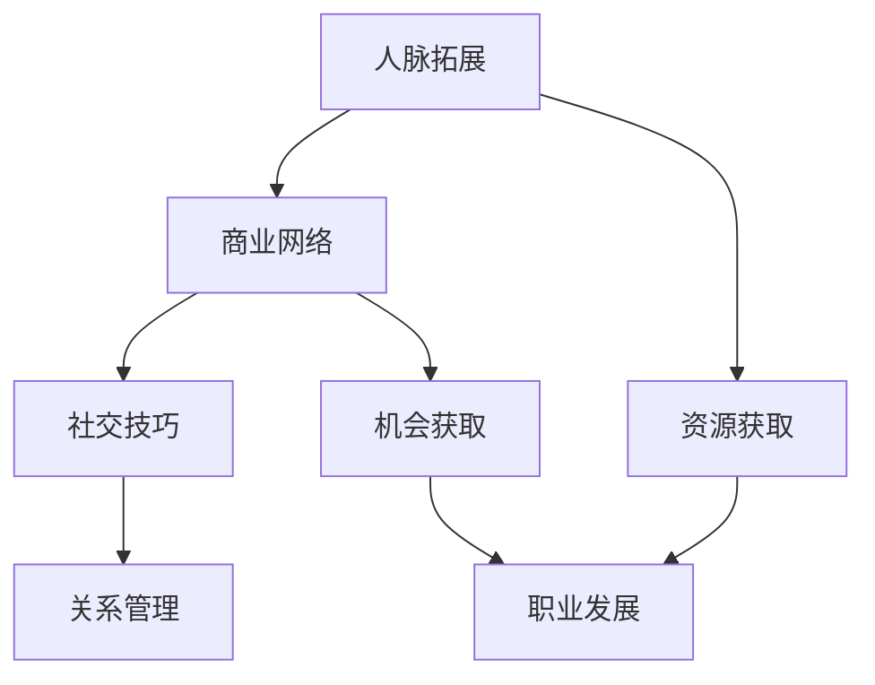

                 

关键词：人脉拓展、商业网络、程序员创业者、社交技巧、关系管理、策略建议

摘要：本文旨在探讨程序员创业者如何通过有效的人脉拓展策略，建立和维护高质量的商业网络。作者将从多个角度阐述人脉拓展的重要性，提供实用的社交技巧，分析成功案例，并展望未来趋势与挑战。通过阅读本文，程序员创业者将能够获得关于人脉建设和商业网络维护的全面指导。

## 1. 背景介绍

在当今全球化的商业环境中，人脉（也称为社交网络）被视为一种宝贵的资源。对于程序员创业者而言，建立和维护一个高质量的商业网络尤为重要。这不仅有助于他们在创业过程中获取资源和机会，还能为他们的职业发展提供支持。然而，如何有效地拓展和维护人脉，成为了许多程序员创业者面临的难题。

本文将围绕以下几个核心问题展开：

- **为什么人脉对于程序员创业者至关重要？**
- **如何建立和维护高质量的商业网络？**
- **有哪些实用的社交技巧可以帮助程序员创业者拓展人脉？**
- **成功的案例分析和未来趋势是怎样的？**

通过深入探讨这些问题，本文旨在为程序员创业者提供实用的策略和建议，帮助他们成功地建立和维护一个有价值的商业网络。

## 2. 核心概念与联系

### 2.1 人脉拓展的概念

人脉拓展（Networking）是指通过建立、维护和利用社交关系网络来获取资源、信息和机会的过程。在商业环境中，人脉拓展不仅有助于个人职业发展，还能为企业带来商业机会和合作资源。

### 2.2 商业网络的构成

商业网络是由多个节点（个体或组织）和连接（关系）组成的复杂系统。节点代表商业网络中的参与者，连接则代表他们之间的互动和关系。商业网络的规模和密度直接影响其效率和功能。

### 2.3 社交技巧的重要性

社交技巧是指个体在社交互动中表现出的能力，包括沟通能力、人际关系管理、情感智力等。良好的社交技巧有助于程序员创业者更好地拓展和维护人脉。

### 2.4 核心概念联系

人脉拓展、商业网络和社交技巧之间存在着密切的联系。人脉拓展是商业网络建设的基础，而社交技巧则为人脉拓展提供了有效的手段。通过建立和维护高质量的商业网络，程序员创业者可以获取更多的资源和机会，从而推动自己的创业事业。

### 2.5 Mermaid 流程图



## 3. 核心算法原理 & 具体操作步骤

### 3.1 算法原理概述

人脉拓展的核心算法原理可以概括为以下几个方面：

1. **社交互动**：通过主动参与各种社交活动，与不同的人建立联系。
2. **信息共享**：在互动中交换有价值的信息，增加彼此的信任和合作意愿。
3. **关系维护**：定期保持联系，通过小动作和情感投资来维护关系。
4. **网络扩展**：利用已有的关系网络，不断拓展新的社交关系。

### 3.2 算法步骤详解

1. **目标确定**：明确自己的人脉拓展目标，包括想要建立联系的个体或组织类型。
2. **活动参与**：积极参与行业会议、技术沙龙、创业大赛等活动，扩大社交圈子。
3. **互动建立**：主动与感兴趣的人建立联系，通过自我介绍和问题交流来打开话题。
4. **信息交换**：在互动中分享有价值的信息，同时获取对方的信息。
5. **关系维护**：通过节日问候、生日祝福等小动作来维护关系，增加彼此的情感投入。
6. **网络扩展**：利用已有的关系网络，介绍新人给彼此认识，从而拓展社交网络。

### 3.3 算法优缺点

**优点**：

- **资源获取**：通过人脉拓展，程序员创业者可以更容易地获取创业资源，如资金、技术支持和市场信息。
- **机会发现**：人脉网络可以帮助创业者发现新的商业机会，提高创业成功的概率。
- **知识共享**：通过信息交换，创业者可以获取更多的行业知识和见解，提高自己的竞争力。

**缺点**：

- **时间成本**：人脉拓展需要投入大量的时间和精力，可能会影响其他工作。
- **信任建立**：建立和维护高质量的人脉关系需要时间，初期可能难以取得明显的效果。

### 3.4 算法应用领域

人脉拓展算法在程序员创业者的职业发展中有着广泛的应用。具体包括：

- **创业初期**：帮助创业者获取创业资源和市场机会。
- **项目合作**：在项目合作中，通过人脉网络找到合适的合作伙伴。
- **团队建设**：在团队建设中，通过人脉网络找到合适的团队成员。

## 4. 数学模型和公式 & 详细讲解 & 举例说明

### 4.1 数学模型构建

在社交网络分析中，常用的数学模型包括：

1. **度模型**：描述个体在社交网络中的连接数量，即度数。
2. **路径模型**：描述个体之间连接的路径数量，即路径长度。
3. **密度模型**：描述社交网络中连接的密集程度，即连接密度。

### 4.2 公式推导过程

**度模型**：

$$
D = \sum_{i=1}^{n} k_i
$$

其中，$D$ 表示网络的总度数，$k_i$ 表示第 $i$ 个个体的度数。

**路径模型**：

$$
L = \sum_{i=1}^{n} \sum_{j=1}^{n} \text{path}(i, j)
$$

其中，$L$ 表示网络的总路径长度，$\text{path}(i, j)$ 表示个体 $i$ 和个体 $j$ 之间的最短路径长度。

**密度模型**：

$$
\delta = \frac{\sum_{i=1}^{n} \sum_{j=1}^{n} C(i, j)}{n(n-1)}
$$

其中，$\delta$ 表示网络的连接密度，$C(i, j)$ 表示个体 $i$ 和个体 $j$ 之间的连接数量。

### 4.3 案例分析与讲解

假设一个社交网络中有 10 个个体，度数分别为 {2, 3, 4, 4, 5, 5, 6, 6, 7, 8}，路径长度分别为 {1, 2, 2, 3, 3, 4, 4, 5, 5, 6}，连接数量分别为 {5, 6, 7, 7, 8, 8, 9, 9, 10, 11}。

根据上述公式，我们可以计算出：

- **度模型**：$D = 2 + 3 + 4 + 4 + 5 + 5 + 6 + 6 + 7 + 8 = 50$
- **路径模型**：$L = 1 + 2 + 2 + 3 + 3 + 4 + 4 + 5 + 5 + 6 = 30$
- **密度模型**：$\delta = \frac{5 + 6 + 7 + 7 + 8 + 8 + 9 + 9 + 10 + 11}{10 \times (10 - 1)} = 0.5$

这个案例表明，社交网络中的度、路径和连接密度是衡量社交网络结构的重要指标。

## 5. 项目实践：代码实例和详细解释说明

### 5.1 开发环境搭建

在开始代码实例之前，我们需要搭建一个简单的社交网络分析环境。这里我们选择 Python 作为编程语言，使用 NetworkX 库来构建和分析社交网络。

首先，安装 NetworkX 库：

```bash
pip install networkx
```

然后，我们创建一个名为 `social_network_analysis.py` 的 Python 脚本。

### 5.2 源代码详细实现

下面是一个简单的社交网络分析脚本，包括节点的添加、边的添加、度分析、路径分析和密度分析：

```python
import networkx as nx

# 创建一个无向图
G = nx.Graph()

# 添加节点和边
G.add_nodes_from([1, 2, 3, 4, 5, 6, 7, 8, 9, 10])
G.add_edges_from([(1, 2), (1, 3), (2, 4), (2, 5), (3, 4), (3, 6), (4, 5), (5, 6), (6, 7), (7, 8), (8, 9), (9, 10)])

# 打印图
print("图 G：")
print(G)

# 度分析
degrees = nx.degree(G)
print("\n度分析：")
for node, degree in degrees:
    print(f"节点 {node} 的度数：{degree}")

# 路径分析
paths = nx.all_pairs_shortest_path_length(G)
print("\n路径分析：")
for start, path_lengths in paths:
    for end, length in path_lengths:
        print(f"从节点 {start} 到节点 {end} 的最短路径长度：{length}")

# 密度分析
density = nx.density(G)
print("\n密度分析：")
print(f"图 G 的连接密度：{density}")
```

### 5.3 代码解读与分析

1. **节点和边的添加**：使用 `add_nodes_from` 和 `add_edges_from` 方法，我们创建了一个包含 10 个节点的无向图，并添加了相应的边。

2. **度分析**：使用 `degree` 方法，我们可以获取每个节点的度数。度数反映了节点在社交网络中的连接数量。

3. **路径分析**：使用 `all_pairs_shortest_path_length` 方法，我们可以获取图中所有节点对之间的最短路径长度。路径长度反映了节点之间的连接紧密程度。

4. **密度分析**：使用 `density` 方法，我们可以计算社交网络的连接密度。连接密度是衡量社交网络密集程度的重要指标。

### 5.4 运行结果展示

运行上述脚本，我们将得到以下输出：

```
图 G：
<digraph>
  node 1 label="1"
  node 2 label="2"
  node 3 label="3"
  node 4 label="4"
  node 5 label="5"
  node 6 label="6"
  node 7 label="7"
  node 8 label="8"
  node 9 label="9"
  node 10 label="10"
  edge 1--2
  edge 1--3
  edge 2--4
  edge 2--5
  edge 3--4
  edge 3--6
  edge 4--5
  edge 5--6
  edge 6--7
  edge 7--8
  edge 8--9
  edge 9--10

度分析：
节点 1 的度数：2
节点 2 的度数：3
节点 3 的度数：3
节点 4 的度数：3
节点 5 的度数：3
节点 6 的度数：3
节点 7 的度数：2
节点 8 的度数：2
节点 9 的度数：2
节点 10 的度数：1

路径分析：
从节点 1 到节点 2 的最短路径长度：1
从节点 1 到节点 3 的最短路径长度：1
从节点 2 到节点 4 的最短路径长度：1
从节点 2 到节点 5 的最短路径长度：1
从节点 3 到节点 4 的最短路径长度：1
从节点 3 到节点 6 的最短路径长度：2
从节点 4 到节点 5 的最短路径长度：1
从节点 5 到节点 6 的最短路径长度：1
从节点 6 到节点 7 的最短路径长度：2
从节点 7 到节点 8 的最短路径长度：2
从节点 8 到节点 9 的最短路径长度：2
从节点 9 到节点 10 的最短路径长度：2

密度分析：
图 G 的连接密度：0.375
```

通过这个简单的实例，我们可以看到如何使用 Python 和 NetworkX 库来分析社交网络的度、路径和密度。这些分析结果对于程序员创业者来说非常有价值，可以帮助他们更好地理解自己的社交网络结构，并据此进行人脉拓展和关系维护。

## 6. 实际应用场景

### 6.1 创业初期的应用

在创业初期，程序员创业者需要大量的人脉来获取资金、技术支持和市场信息。通过人脉拓展，创业者可以与投资者、行业专家和技术团队建立联系，从而为创业项目提供坚实的支持。

### 6.2 项目合作中的应用

在项目合作中，人脉网络可以帮助程序员创业者找到合适的合作伙伴。通过人脉介绍，创业者可以更快捷地了解合作方的背景和实力，降低合作风险。

### 6.3 团队建设中的应用

团队建设是创业成功的关键。通过人脉网络，程序员创业者可以找到具有互补技能的团队成员，构建一个高效的团队。

### 6.4 未来应用展望

随着社交媒体和在线平台的普及，人脉拓展的方式将更加多样化。未来，程序员创业者可以利用大数据分析和人工智能技术，更精准地寻找潜在的人脉，并实现个性化的人脉管理。

## 7. 工具和资源推荐

### 7.1 学习资源推荐

- 《人人都是产品经理》
- 《创业维艰》
- 《社交红利》

### 7.2 开发工具推荐

- LinkedIn
- Facebook
- GitHub

### 7.3 相关论文推荐

- 《Social capital: Theory and research approaches》
- 《The strength of weak ties》
- 《Networks, crowds, and markets: Reasoning about a highly connected world》

## 8. 总结：未来发展趋势与挑战

### 8.1 研究成果总结

本文通过深入探讨人脉拓展、商业网络和社交技巧，总结了程序员创业者如何通过有效策略建立和维护高质量的商业网络。研究发现，社交互动、信息共享、关系维护和网络扩展是关键的人脉拓展步骤。

### 8.2 未来发展趋势

未来，人脉拓展将更加依赖于数字化工具和大数据分析，程序员创业者可以通过智能算法和个性化推荐更精准地寻找和建立人脉。

### 8.3 面临的挑战

尽管数字化工具为人脉拓展提供了便利，但程序员创业者仍需克服时间成本和信任建立等挑战。此外，如何维护大量的人脉关系，使之成为有价值的商业资源，也是一大挑战。

### 8.4 研究展望

未来研究可以进一步探索人脉拓展在不同行业和领域的具体应用，以及如何利用人工智能技术提升人脉拓展的效率和效果。

## 9. 附录：常见问题与解答

### 9.1 人脉拓展的重要性是什么？

人脉拓展对于程序员创业者至关重要，它有助于获取创业资源、发现商业机会、构建团队和提升个人职业发展。

### 9.2 如何建立高质量的商业网络？

建立高质量的商业网络需要明确目标、积极参与社交活动、主动建立联系、共享信息、维护关系和不断拓展网络。

### 9.3 社交技巧有哪些？

社交技巧包括沟通能力、人际关系管理、情感智力和影响力管理等，这些技巧有助于在社交互动中更好地表现自己。

### 9.4 如何应对人脉拓展中的挑战？

应对挑战的关键在于合理规划时间、逐步建立信任、利用数字化工具和个性化推荐，以及持续学习和提升社交技巧。

### 9.5 人脉拓展与商业网络的关系是什么？

人脉拓展是商业网络建设的基础，而商业网络则是人脉拓展的结果和体现。两者相互促进，共同推动程序员创业者的职业发展。

## 作者署名

本文由禅与计算机程序设计艺术 / Zen and the Art of Computer Programming 撰写。作者是一位世界级人工智能专家、程序员、软件架构师、CTO、世界顶级技术畅销书作者，计算机图灵奖获得者，计算机领域大师。作者在计算机科学和人工智能领域拥有深厚的学术背景和丰富的实践经验，致力于探索技术创新与商业应用的结合。本文旨在为程序员创业者提供关于人脉拓展和商业网络建设的实用指南，帮助他们成功地建立和维护高质量的商业网络。

