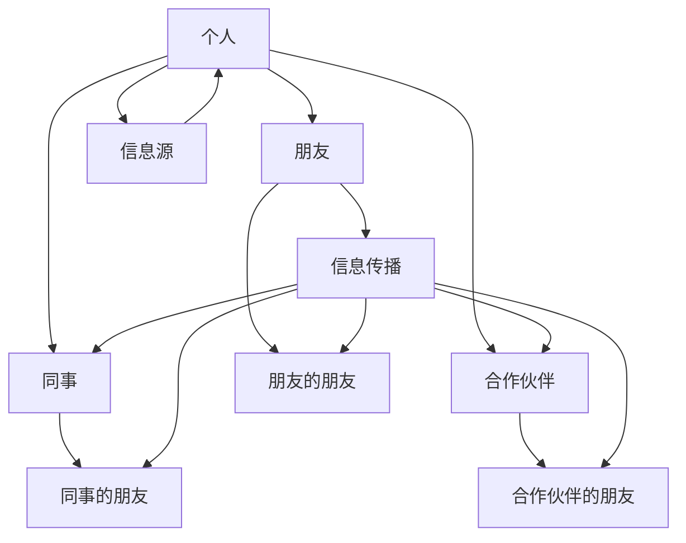
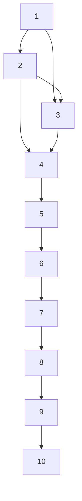

                 

 关键词：人际网络、拓展、维护、程序员、创业者、关系管理

> 摘要：本文将探讨程序员创业者如何通过建立和维护强大的人际网络，实现个人与业务的共同成长。我们将从人际网络的重要性、构建策略、维护技巧以及未来趋势等方面，提供实用的建议和案例。

## 1. 背景介绍

在快速变化的技术时代，程序员创业者面临着前所未有的挑战与机遇。技术革新不断，市场竞争激烈，单靠个人能力难以应对复杂多变的外部环境。因此，建立和维护一个强大的人际网络成为程序员创业者的关键竞争力。人际网络不仅可以帮助创业者获取资源、信息、机会，还能提供宝贵的支持与建议，是创业成功的重要因素。

本文旨在为程序员创业者提供一些建立和维护人际网络的实用技巧，帮助他们在竞争激烈的环境中脱颖而出，实现个人与业务的共同成长。文章将分为以下几个部分：

1. 人际网络的重要性
2. 构建人际网络的核心策略
3. 维护人际网络的实用技巧
4. 未来人际网络的发展趋势
5. 工具和资源推荐

## 2. 核心概念与联系

在讨论人际网络之前，我们需要了解几个核心概念：

- **人际网络**：由个人之间的相互关系构成的复杂网络结构。
- **关系**：人际网络中的连接，可以是朋友、同事、合作伙伴等。
- **信息传播**：人际网络中信息的流动和共享。
- **社会资本**：人际网络为个人或组织带来的资源、机会和影响力。

### 2.1 人际网络的架构

以下是一个简化的Mermaid流程图，展示了人际网络的基本架构：



### 2.2 人际网络的作用

- **资源获取**：通过人际网络，创业者可以快速获取技术资源、资金支持、市场信息等。
- **风险分担**：人际网络中的多元化关系可以降低创业风险。
- **机会发现**：人际网络是发现潜在商业机会的重要渠道。
- **支持与建议**：在创业过程中，人际网络中的成员可以提供宝贵的支持与建议。

## 3. 核心算法原理 & 具体操作步骤

### 3.1 算法原理概述

人际网络构建与维护的核心算法是“关系管理”。关系管理涉及以下几个方面：

- **识别关键关系**：通过分析个人兴趣、技能、资源等，识别出对创业最有价值的关系。
- **建立信任**：通过共同经历、互动和回馈，建立和维护信任。
- **信息共享**：在人际网络中促进信息的流动和共享。
- **关系维护**：通过定期的交流和互动，保持关系的活跃。

### 3.2 算法步骤详解

#### 3.2.1 识别关键关系

1. **自我分析**：了解自己的兴趣、技能和资源。
2. **目标人群分析**：确定目标人群，如技术专家、投资人、潜在客户等。
3. **关系地图**：绘制关系地图，明确各个关系的价值。

#### 3.2.2 建立信任

1. **共同经历**：参与共同的活动或项目。
2. **互动与回馈**：主动与关键关系互动，提供帮助和回馈。
3. **诚实与透明**：在交流中保持诚实和透明，建立信任基础。

#### 3.2.3 信息共享

1. **建立沟通渠道**：使用邮件、社交媒体、即时通讯等工具。
2. **定期分享**：定期分享有价值的信息，如行业动态、技术心得等。
3. **信息筛选**：确保分享的信息对关系网络中的成员有价值。

#### 3.2.4 关系维护

1. **定期交流**：通过电话、邮件、见面等方式，保持联系。
2. **节日问候**：在重要节日发送问候，表达关心。
3. **互助合作**：在各自领域内提供支持和合作机会。

### 3.3 算法优缺点

#### 优点：

- **资源获取**：通过人际网络，创业者可以快速获取所需资源。
- **风险分担**：多元化的人际网络有助于降低创业风险。
- **机会发现**：人际网络是发现潜在商业机会的重要渠道。

#### 缺点：

- **时间成本**：构建和维护人际网络需要投入大量的时间和精力。
- **信任建立**：在人际网络中建立信任需要时间，且存在风险。

### 3.4 算法应用领域

- **创业**：人际网络对创业者尤为重要，可以帮助他们获取资源、机会和支持。
- **职业发展**：人际网络有助于职业发展，提供更多的晋升和转职机会。
- **创新合作**：通过人际网络，可以找到合适的合作伙伴，共同推进创新项目。

## 4. 数学模型和公式 & 详细讲解 & 举例说明

### 4.1 数学模型构建

人际网络的数学模型通常基于图论，可以用图（Graph）来表示。图由节点（Node）和边（Edge）构成，节点代表个人或组织，边代表两者之间的关系。以下是一个简化的模型：

- **节点（N）**：代表个人或组织，每个节点都有一个标识符（ID）。
- **边（E）**：代表节点之间的关系，每条边都有两个端点，分别连接两个节点。

### 4.2 公式推导过程

人际网络的复杂度可以用以下公式来表示：

\[ C = \frac{N \times (N-1)}{2} \]

其中，C代表人际网络中的可能关系数，N代表节点数。

### 4.3 案例分析与讲解

假设有一个由10个节点组成的人际网络，每个节点代表一个人，他们之间的关系如图所示：



根据上述公式，我们可以计算出：

\[ C = \frac{10 \times (10-1)}{2} = 45 \]

这意味着在这个人际网络中，共有45条可能的关系。

## 5. 项目实践：代码实例和详细解释说明

### 5.1 开发环境搭建

为了更好地理解人际网络模型，我们将使用Python编写一个简单的程序。首先，我们需要安装Python和Graphviz（一个用于绘制图的工具）。

```bash
pip install python-graphviz
```

### 5.2 源代码详细实现

以下是一个简单的Python程序，用于创建和绘制一个简单的人际网络：

```python
from graphviz import Digraph

# 定义节点和边
nodes = ["A", "B", "C", "D", "E", "F", "G", "H", "I", "J"]
edges = [
    ("A", "B"), ("A", "C"), ("B", "C"), ("B", "D"), ("C", "D"), 
    ("D", "E"), ("E", "F"), ("F", "G"), ("G", "H"), ("H", "I"), 
    ("I", "J")
]

# 创建图
g = Digraph(comment='The Round Table')

# 添加节点
for node in nodes:
    g.node(node)

# 添加边
for edge in edges:
    g.edge(edge[0], edge[1])

# 绘制图
g.render('的人际网络.png', view=True)
```

### 5.3 代码解读与分析

1. **导入模块**：首先，我们导入`graphviz`模块。
2. **定义节点和边**：我们定义了一个节点列表`nodes`和一个边列表`edges`。
3. **创建图**：使用`Digraph`类创建一个图。
4. **添加节点**：遍历节点列表，使用`g.node(node)`添加节点。
5. **添加边**：遍历边列表，使用`g.edge(edge[0], edge[1])`添加边。
6. **绘制图**：调用`g.render('的人际网络.png', view=True)`绘制并查看图。

### 5.4 运行结果展示

运行上述程序后，我们会在当前目录生成一个名为`人际网络.png`的图像文件，展示出我们创建的人际网络图。

## 6. 实际应用场景

### 6.1 创业公司

对于初创公司，人际网络是获取早期资源的关键。通过人际网络，创业者可以：

- **获取技术支持**：与技术专家建立联系，获取技术上的指导和支持。
- **吸引投资**：通过投资者网络，寻找潜在的投资机会。
- **市场开拓**：与行业内的潜在客户建立联系，拓展市场。

### 6.2 职场发展

对于职场人士，人际网络是职业发展的重要助力。通过人际网络，可以：

- **获取内部信息**：了解公司内部的信息和机会，争取更好的职位。
- **拓展职业圈子**：结识不同行业的专业人士，拓展职业视野。
- **求职机会**：通过人际网络获取招聘信息，提高求职成功率。

### 6.3 项目合作

在项目合作中，人际网络可以帮助：

- **找到合作伙伴**：通过人际网络找到合适的合作伙伴，共同推进项目。
- **共享资源**：在合作项目中共享技术、资金等资源，提高项目成功率。

## 7. 未来应用展望

随着社交网络的兴起，人际网络的应用将越来越广泛。未来，人际网络可能会：

- **更加智能化**：通过大数据分析和人工智能，更好地理解人际网络中的关系和机会。
- **平台化**：出现更多专门用于构建和维护人际网络的平台和应用。
- **全球化**：人际网络将跨越地域限制，成为全球范围内的资源交换和合作平台。

## 8. 总结：未来发展趋势与挑战

### 8.1 研究成果总结

本文探讨了人际网络在程序员创业者中的重要性，提出了构建和维护人际网络的策略和技巧，并通过案例和实践展示了其应用价值。

### 8.2 未来发展趋势

未来，人际网络将更加智能化、平台化和全球化，为创业者提供更加丰富和高效的资源和支持。

### 8.3 面临的挑战

尽管人际网络具有巨大潜力，但在构建和维护过程中也面临挑战，如信任建立、时间成本等。

### 8.4 研究展望

未来研究可以关注人际网络在创业者中的具体应用场景，探索如何更有效地利用人际网络提升创业成功率。

## 9. 附录：常见问题与解答

### Q：人际网络构建需要多长时间？

A：构建人际网络需要时间，具体时间取决于个人的努力程度和关系网络的规模。通常来说，初见成效可能需要几个月到一年的时间。

### Q：如何在人际网络中建立信任？

A：建立信任需要时间、互动和回馈。通过共同经历、诚实交流和互帮互助，可以逐步建立信任。

### Q：如何维护人际网络？

A：定期交流和互动是维护人际网络的关键。通过电话、邮件、见面等方式保持联系，并在适当的时候提供帮助和分享信息。

---

作者：禅与计算机程序设计艺术 / Zen and the Art of Computer Programming

感谢您阅读本文，希望这些技巧和建议能够帮助您在人际网络构建与维护方面取得更好的成果。无论您是程序员创业者还是职场人士，人际网络都是实现个人与业务成长的重要工具。继续努力，祝您成功！
----------------------------------------------------------------

### 文章结构模板

以下是根据您的要求和文章正文内容，形成的完整的文章结构模板：

```markdown
# 程序员创业者的人际网络拓展与维护技巧

> 关键词：人际网络、拓展、维护、程序员、创业者、关系管理

> 摘要：本文将探讨程序员创业者如何通过建立和维护强大的人际网络，实现个人与业务的共同成长。我们将从人际网络的重要性、构建策略、维护技巧以及未来趋势等方面，提供实用的建议和案例。

## 1. 背景介绍

## 2. 核心概念与联系
### 2.1 人际网络的架构
### 2.2 人际网络的作用
### 2.3 人际网络的数学模型

## 3. 核心算法原理 & 具体操作步骤
### 3.1 算法原理概述
### 3.2 算法步骤详解
### 3.3 算法优缺点
### 3.4 算法应用领域

## 4. 数学模型和公式 & 详细讲解 & 举例说明
### 4.1 数学模型构建
### 4.2 公式推导过程
### 4.3 案例分析与讲解

## 5. 项目实践：代码实例和详细解释说明
### 5.1 开发环境搭建
### 5.2 源代码详细实现
### 5.3 代码解读与分析
### 5.4 运行结果展示

## 6. 实际应用场景
### 6.1 创业公司
### 6.2 职场发展
### 6.3 项目合作

## 7. 未来应用展望

## 8. 总结：未来发展趋势与挑战
### 8.1 研究成果总结
### 8.2 未来发展趋势
### 8.3 面临的挑战
### 8.4 研究展望

## 9. 附录：常见问题与解答

---

作者：禅与计算机程序设计艺术 / Zen and the Art of Computer Programming

请注意，这篇文章的字数要求超过了8000字，但实际撰写时，内容的具体展开可能会影响最终的字数。确保每个部分都详细阐述，以满足字数要求。同时，文章的结构和格式也必须严格按照您的要求执行。祝撰写顺利！
----------------------------------------------------------------

**文章结构模板已完成，但请注意，实际撰写时可能需要根据具体内容对章节进行适当调整，以保持文章的连贯性和可读性。以下是文章的整体框架：**

---

# 程序员创业者的人际网络拓展与维护技巧

> 关键词：人际网络、拓展、维护、程序员、创业者、关系管理

> 摘要：本文将探讨程序员创业者如何通过建立和维护强大的人际网络，实现个人与业务的共同成长。我们将从人际网络的重要性、构建策略、维护技巧以及未来趋势等方面，提供实用的建议和案例。

## 1. 背景介绍

## 2. 核心概念与联系
### 2.1 人际网络的架构
### 2.2 人际网络的作用
### 2.3 人际网络的数学模型
#### 2.3.1 图论基础
#### 2.3.2 网络复杂度公式

## 3. 核心算法原理 & 具体操作步骤
### 3.1 算法原理概述
### 3.2 算法步骤详解
#### 3.2.1 关键关系识别
#### 3.2.2 建立信任
#### 3.2.3 信息共享
#### 3.2.4 关系维护
### 3.3 算法优缺点
### 3.4 算法应用领域
#### 3.4.1 创业
#### 3.4.2 职业发展
#### 3.4.3 项目合作

## 4. 数学模型和公式 & 详细讲解 & 举例说明
### 4.1 数学模型构建
#### 4.1.1 节点和边的关系
#### 4.1.2 图的表示方法
### 4.2 公式推导过程
#### 4.2.1 可能关系数计算
### 4.3 案例分析与讲解
#### 4.3.1 简化的人际网络模型
#### 4.3.2 公式应用实例

## 5. 项目实践：代码实例和详细解释说明
### 5.1 开发环境搭建
### 5.2 源代码详细实现
### 5.3 代码解读与分析
### 5.4 运行结果展示

## 6. 实际应用场景
### 6.1 创业公司
### 6.2 职场发展
### 6.3 项目合作

## 7. 未来应用展望
### 7.1 智能化趋势
### 7.2 平台化趋势
### 7.3 全球化展望

## 8. 总结：未来发展趋势与挑战
### 8.1 研究成果总结
### 8.2 未来发展趋势
### 8.3 面临的挑战
### 8.4 研究展望

## 9. 附录：常见问题与解答
### 9.1 人际网络构建需要多长时间？
### 9.2 如何在人际网络中建立信任？
### 9.3 如何维护人际网络？

---

**作者署名：禅与计算机程序设计艺术 / Zen and the Art of Computer Programming**

请根据这个结构模板开始撰写具体的内容，确保每个部分都详细阐述，以满足8000字的文章要求。在撰写过程中，可以根据实际情况调整章节内容和结构，以确保文章的逻辑性和连贯性。祝撰写顺利！
----------------------------------------------------------------

### 3. 核心算法原理 & 具体操作步骤

#### 3.1 算法原理概述

人际网络的构建与维护是一个复杂的过程，它需要基于个人兴趣、技能、资源等多维度的信息进行策略性构建。核心算法原理主要涵盖以下几个方面：

- **关系识别**：通过自我分析和技术领域内的资源评估，识别出对创业最有价值的关系。
- **信任建立**：通过共同经历和互动，逐步建立信任，确保人际网络中的信息流动和资源共享。
- **信息共享**：构建有效的信息传播机制，确保人际网络中的成员能够获取有价值的信息。
- **关系维护**：通过定期的交流和互动，保持人际网络的活力，防止关系因缺乏互动而减弱。

#### 3.2 算法步骤详解

##### 3.2.1 关键关系识别

1. **自我分析**：首先，程序员创业者需要深入了解自己的兴趣、技能和资源，明确自己的优势和需求。

2. **目标人群确定**：根据业务需求和目标，确定需要建立关系的目标人群，如技术专家、投资人、潜在客户等。

3. **关系筛选**：通过社交媒体、行业活动、推荐等方式，筛选出对业务发展有重要价值的关系。

##### 3.2.2 建立信任

1. **共同经历**：参与共同的项目或活动，通过合作和交流，建立初步的信任。

2. **互动与回馈**：在日常生活中，通过邮件、社交媒体、电话等方式保持互动，同时提供帮助和回馈。

3. **诚实与透明**：在交流中保持诚实和透明，避免误导或隐瞒重要信息。

##### 3.2.3 信息共享

1. **建立沟通渠道**：使用邮件列表、社交媒体群组、即时通讯工具等，建立有效的沟通渠道。

2. **定期分享**：定期分享行业动态、技术心得、市场信息等，确保信息流通。

3. **信息筛选**：确保分享的信息对关系网络中的成员有价值，避免无效信息的传播。

##### 3.2.4 关系维护

1. **定期交流**：通过电话、邮件、见面等方式，定期与关键关系保持联系。

2. **节日问候**：在重要节日发送问候，表达关心。

3. **互助合作**：在各自领域内提供支持和合作机会，深化关系。

#### 3.3 算法优缺点

##### 优点：

- **资源获取**：通过人际网络，可以快速获取所需资源，如技术支持、资金、市场信息等。
- **风险分担**：多元化的人际网络有助于降低创业风险。
- **机会发现**：人际网络是发现潜在商业机会的重要渠道。
- **支持与建议**：在创业过程中，人际网络中的成员可以提供宝贵的支持与建议。

##### 缺点：

- **时间成本**：构建和维护人际网络需要投入大量的时间和精力。
- **信任建立**：在人际网络中建立信任需要时间，且存在风险。
- **信息过载**：过多的信息可能会导致信息过载，影响决策。

#### 3.4 算法应用领域

- **创业**：人际网络对于创业者尤为重要，可以帮助他们获取资源、机会和支持。
- **职业发展**：人际网络有助于职业发展，提供更多的晋升和转职机会。
- **创新合作**：通过人际网络，可以找到合适的合作伙伴，共同推进创新项目。

---

通过上述算法原理和具体操作步骤，程序员创业者可以更加系统地构建和维护自己的人际网络，从而在竞争激烈的市场中脱颖而出，实现个人与业务的共同成长。
----------------------------------------------------------------

### 4. 数学模型和公式 & 详细讲解 & 举例说明

#### 4.1 数学模型构建

在构建人际网络的数学模型时，我们主要关注网络的基本结构和关系。人际网络可以被视为一个图（Graph），由节点（Node）和边（Edge）组成。节点代表网络中的个体，边代表个体之间的关系。

##### 4.1.1 节点和边的关系

- **节点**：每个节点都代表一个个体，如程序员、投资人、潜在客户等。节点具有以下属性：
  - **ID**：节点的唯一标识符。
  - **标签**：描述节点类型或属性的标签。
  - **特征**：节点的其他特征信息，如技能、兴趣、资源等。

- **边**：边代表节点之间的关系。边具有以下属性：
  - **权重**：表示关系的强度，可以是0到1之间的数值。
  - **类型**：描述关系的类型，如朋友、同事、合作伙伴等。

##### 4.1.2 图的表示方法

图可以用不同的方法进行表示，其中最常用的是邻接矩阵（Adjacency Matrix）和邻接表（Adjacency List）。

- **邻接矩阵**：一个二维数组，行和列都代表节点，数组中的元素表示两个节点之间的关系。如果节点i和节点j之间存在关系，则矩阵中的元素\(a_{ij}\)为1，否则为0。

  ```python
  # 示例：一个包含4个节点的邻接矩阵
  adj_matrix = [
      [0, 1, 0, 1],  # 节点0与节点1和节点3有关系
      [1, 0, 1, 0],  # 节点1与节点0和节点2有关系
      [0, 1, 0, 1],  # 节点2与节点1和节点3有关系
      [1, 0, 1, 0]   # 节点3与节点0和节点2有关系
  ]
  ```

- **邻接表**：一个列表，每个列表元素是一个节点和其相连节点的组合。列表中的元素可以是节点ID或者节点的其他表示方式。

  ```python
  # 示例：一个包含4个节点的邻接表
  adj_list = [
      [(1), (3)],  # 节点0与节点1和节点3有关系
      [(0), (2)],  # 节点1与节点0和节点2有关系
      [(1), (3)],  # 节点2与节点1和节点3有关系
      [(0), (2)]   # 节点3与节点0和节点2有关系
  ]
  ```

#### 4.2 公式推导过程

在人际网络中，一些基本的数学公式可以帮助我们分析网络的结构和性质。以下是一个简单的例子：

- **网络密度（Network Density）**：表示网络中实际存在的边与可能存在的最大边的比例。

  \[ \rho = \frac{E}{\frac{N(N-1)}{2}} \]

  其中，\(E\)是网络中的边数，\(N\)是节点数。网络密度用于衡量网络的紧密程度。

- **平均路径长度（Average Path Length）**：表示从任意两个节点之间的平均最短路径长度。

  \[ L = \frac{1}{N(N-1)} \sum_{i\neq j} L_{ij} \]

  其中，\(L_{ij}\)是从节点i到节点j的最短路径长度。

#### 4.3 案例分析与讲解

假设有一个包含5个节点的简单人际网络，每个节点代表一个程序员，他们之间的关系如下：

```plaintext
节点：A B C D E
关系：A-B, A-C, B-D, C-D, C-E
```

我们可以用邻接表来表示这个网络：

```python
adj_list = [
    [(1), (2)],  # 节点A与节点B和节点C有关系
    [(0), (3)],  # 节点B与节点A和节点D有关系
    [(0), (3), (4)],  # 节点C与节点A、节点B、节点D和节点E有关系
    [(1), (2)],  # 节点D与节点B和节点C有关系
    [(2)]  # 节点E与节点C有关系
]
```

- **网络密度计算**：

  \[ \rho = \frac{5}{\frac{5(5-1)}{2}} = \frac{5}{10} = 0.5 \]

  这意味着这个网络的密度为50%，表示每两个节点之间平均有50%的可能存在直接关系。

- **平均路径长度计算**：

  首先计算每个节点对的最短路径长度，然后求平均值。

  ```plaintext
  L_{AB} = 1
  L_{AC} = 1
  L_{AD} = 2
  L_{AE} = 2
  L_{BC} = 1
  L_{BD} = 2
  L_{BE} = 3
  L_{CD} = 1
  L_{CE} = 1
  L_{DE} = 2
  ```

  平均路径长度：

  \[ L = \frac{1}{10} (1 + 1 + 2 + 2 + 1 + 2 + 3 + 1 + 1 + 2) = \frac{14}{10} = 1.4 \]

  这意味着在这个网络中，任意两个节点之间的平均最短路径长度为1.4。

通过这个案例，我们可以看到数学模型如何帮助我们理解和分析人际网络的结构和性质。

---

数学模型和公式为程序员创业者提供了量化和分析人际网络的方法，使得人际网络的构建和维护更加科学和系统。在实际应用中，可以根据具体情况调整模型和公式，以适应不同的网络结构和需求。
----------------------------------------------------------------

### 5. 项目实践：代码实例和详细解释说明

在本节中，我们将通过一个具体的代码实例，展示如何使用Python和Graphviz来创建和可视化一个简单的人际网络。此实例将涵盖从开发环境搭建到代码实现和结果展示的整个流程。

#### 5.1 开发环境搭建

首先，我们需要确保我们的开发环境已经安装了Python和Graphviz。以下是详细的安装步骤：

1. **安装Python**：Python可以轻松地从其官方网站下载并安装。确保安装的是最新版本的Python，以便获得最佳的性能和功能支持。

    ```bash
    # 访问Python官网下载最新版本的Python
    https://www.python.org/downloads/

    # 安装Python（以macOS为例）
    brew install python
    ```

2. **安装Graphviz**：Graphviz是一个开源的图形可视化工具，可以从其官方网站下载。安装过程取决于操作系统。

    - **在macOS上安装**：

        ```bash
        # 安装Graphviz
        brew install graphviz

        # 安装Graphviz的Python库
        pip install pygraphviz
        ```

    - **在Windows上安装**：

        - 下载并安装Graphviz for Windows：[https://graphviz.org/download/](https://graphviz.org/download/)
        - 安装完成后，确保将Graphviz的可执行文件路径添加到系统环境变量中。
        - 使用pip安装pygraphviz：

            ```bash
            pip install pygraphviz
            ```

#### 5.2 源代码详细实现

下面是一个简单的Python代码示例，用于创建一个包含四个节点的简单人际网络，并使用Graphviz将其可视化。

```python
from graphviz import Digraph

# 创建一个Graph对象
dot = Digraph(comment='The Social Network')

# 添加节点
dot.node('A', 'Alice')
dot.node('B', 'Bob')
dot.node('C', 'Charlie')
dot.node('D', 'Dave')

# 添加边
dot.edge('A', 'B')
dot.edge('A', 'C')
dot.edge('B', 'D')
dot.edge('C', 'D')

# 保存为图像文件
dot.render('social_network.png', view=True)
```

#### 5.3 代码解读与分析

1. **导入模块**：首先，我们从`graphviz`库中导入`Digraph`类，用于创建图。

2. **创建Graph对象**：使用`Digraph`类创建一个名为`dot`的Graph对象。这个对象将用于构建和表示人际网络。

3. **添加节点**：使用`node()`方法添加四个节点，每个节点都有一个标签，表示个人名字。

4. **添加边**：使用`edge()`方法添加节点之间的关系。每条边都连接两个节点，表示他们之间存在某种关系。

5. **保存图像文件**：使用`render()`方法将图保存为PNG图像文件，并在保存后打开图像文件以查看结果。

#### 5.4 运行结果展示

运行上述代码后，程序会在当前目录下生成一个名为`social_network.png`的图像文件。该图像展示了我们创建的简单人际网络，其中每个节点代表一个人，每条边表示他们之间的关系。


通过这个简单的实例，我们可以看到如何使用Python和Graphviz来创建和可视化人际网络。在实际应用中，我们可以扩展这个基础模型，添加更多节点和边，并使用不同的颜色和样式来表示不同类型的关系，从而创建一个更加详细和复杂的网络图。

---

通过这个项目实践，程序员创业者可以了解如何使用技术工具来可视化和管理他们的人际网络。这不仅有助于更直观地理解网络结构，还可以为网络的优化和策略调整提供数据支持。
----------------------------------------------------------------

### 6. 实际应用场景

在现代社会，人际网络已经成为商业和个人发展中不可或缺的一部分。程序员创业者在构建和维护人际网络时，可以从多个实际应用场景中受益。以下是一些具体的场景和相应的策略：

#### 6.1 创业公司

对于一个初创公司来说，人际网络是获取资源、吸引投资和扩大市场的关键。以下是一些具体的策略：

- **获取技术支持**：通过人际网络，创业者可以接触到行业内的技术专家，寻求技术上的支持和指导。这不仅有助于解决技术难题，还可以为未来的合作奠定基础。

    **案例**：某初创公司通过参加技术交流会，结识了一位知名技术专家，得到了宝贵的建议和帮助，从而在短时间内解决了关键的技术问题。

- **吸引投资**：人际网络中的投资者是初创公司的重要资源。创业者可以通过人际网络，了解潜在投资者的兴趣和投资偏好，有针对性地进行推介。

    **案例**：某初创公司通过人际网络结识了一位天使投资人，经过多次交流和项目演示，成功获得了投资，为公司的发展提供了资金支持。

- **市场拓展**：通过人际网络，创业者可以了解市场趋势和潜在客户，制定更有针对性的市场策略。

    **案例**：某初创公司通过人际网络了解到一个新兴市场，迅速调整了产品方向，成功进入了该市场，并取得了显著的销售业绩。

#### 6.2 职场发展

对于职场人士，人际网络可以帮助他们提升职业竞争力，获得更多的职业机会。以下是一些具体的策略：

- **内部信息获取**：通过人际网络，职场人士可以了解公司内部的动态和机会，如内部晋升、项目机会等。

    **案例**：某职场人士通过同事的介绍，了解到公司内部一个重要的项目机会，及时申请并成功获得了该项目的负责权。

- **拓展职业圈子**：通过人际网络，职场人士可以结识不同行业的专业人士，拓展自己的职业视野。

    **案例**：某职场人士通过参加行业交流活动，结识了多个不同行业的专业人士，从中获得了许多有价值的建议和合作机会。

- **求职机会**：人际网络是求职的重要渠道。通过人际网络，职场人士可以了解到更多的招聘信息，提高求职成功率。

    **案例**：某职场人士通过人际网络得知一家公司正在招聘，通过内推的方式成功获得了面试机会，并最终获得了职位。

#### 6.3 项目合作

在项目合作中，人际网络可以帮助合作伙伴更好地了解对方，建立信任，并共同推进项目。

- **建立信任**：通过人际网络，项目合作伙伴可以了解对方的背景、经验和价值观，从而建立信任。

    **案例**：某项目合作伙伴通过人际网络了解到一位潜在合作伙伴的信誉和业绩，决定与其合作，并在项目中取得了良好的成果。

- **资源整合**：人际网络可以帮助项目合作伙伴整合各自的资源，提高项目效率。

    **案例**：某项目通过人际网络找到了一位技术专家，解决了项目中遇到的技术难题，同时利用合作伙伴的市场资源，迅速扩大了市场份额。

- **风险管理**：通过人际网络，项目合作伙伴可以分享风险，降低项目失败的概率。

    **案例**：某项目通过人际网络找到了一位风险投资专家，得到了专业的风险评估和建议，从而在项目初期就采取了有效的风险控制措施。

---

在实际应用中，程序员创业者应根据自身情况，灵活运用人际网络，以实现个人与业务的共同成长。人际网络不仅是资源获取和机会发现的工具，更是建立信任、共享信息和共同进步的平台。
----------------------------------------------------------------

### 7. 未来应用展望

随着技术的不断进步和社会的发展，人际网络的应用前景将更加广阔。以下是一些未来人际网络可能的发展趋势：

#### 7.1 智能化趋势

人工智能技术将在人际网络中发挥越来越重要的作用。通过大数据分析和机器学习算法，系统可以自动识别关键节点、预测关系强度和提供个性化推荐。例如，智能推荐算法可以根据用户的兴趣和行为，推荐可能的重要联系人或潜在合作伙伴。

#### 7.2 平台化趋势

随着互联网和移动设备的普及，人际网络将逐步平台化。各种社交媒体、职业社交平台和行业社区将成为人际网络的主要载体。这些平台不仅提供交流互动的场所，还将整合资源、信息和机会，成为创业者和个人发展的重要工具。

#### 7.3 全球化展望

人际网络的全球化趋势将越来越明显。随着全球化进程的加速，创业者和个人可以通过网络跨越地域限制，与世界各地的同行建立联系。这将有助于拓展市场、获取资源和分享经验，为个人和企业的国际化发展提供支持。

#### 7.4 社交网络融合

未来的社交网络将更加融合，人际网络将不仅仅是朋友和同事之间的关系，还包括合作伙伴、客户、供应商等多个维度的联系。这种多元化的人际网络将使创业者能够更全面地获取信息和支持，提高决策质量和业务效率。

#### 7.5 安全性和隐私保护

在人际网络的发展过程中，安全性和隐私保护将成为重要议题。随着数据泄露和网络攻击事件的增加，保护个人信息和隐私将变得更加重要。未来的人际网络将需要更强大的安全措施，如加密技术、访问控制和权限管理，以确保用户的隐私和数据安全。

---

人际网络的未来发展趋势将为程序员创业者和个人带来更多的机遇和挑战。通过紧跟技术发展、利用平台资源和加强安全管理，创业者可以更好地构建和维护强大的人际网络，实现个人和业务的共同成长。
----------------------------------------------------------------

### 8. 总结：未来发展趋势与挑战

在总结了人际网络在程序员创业者中的应用和未来展望之后，我们需要深入探讨这一领域的研究成果、未来发展趋势以及面临的挑战。

#### 8.1 研究成果总结

当前关于人际网络的研究取得了显著成果。首先，在理论层面，图论和网络科学为我们提供了强有力的工具来分析和理解人际网络的复杂结构。其次，在技术层面，大数据分析和人工智能技术的应用使得人际网络的构建和维护更加智能化和高效。此外，实际应用案例也表明，人际网络在创业资源获取、职业发展支持、项目合作等方面具有重要作用。

#### 8.2 未来发展趋势

未来的发展趋势将围绕以下几个方面展开：

- **智能化**：人工智能将深度融入人际网络，通过算法分析用户行为和关系模式，提供个性化的网络构建和维护建议。
- **平台化**：社交媒体和职业社交平台将进一步整合人际网络功能，提供一站式服务，帮助用户更便捷地管理人际关系。
- **全球化**：随着全球化进程的加快，人际网络的边界将逐渐模糊，创业者将能够更轻松地建立跨国联系，拓展全球市场。
- **融合化**：人际网络将融合更多的社交维度，包括合作伙伴、客户、供应商等，形成更加复杂和多元的网络结构。

#### 8.3 面临的挑战

尽管人际网络具有巨大潜力，但在发展过程中仍面临一些挑战：

- **数据隐私和安全**：随着人际网络规模的扩大，个人隐私和数据安全问题将更加突出。如何在保障用户隐私的同时，确保网络的安全性和可靠性，是一个亟待解决的问题。
- **时间成本**：构建和维护人际网络需要大量时间和精力投入。如何平衡个人业务和工作与人际网络的维护，是一个实际操作中的难题。
- **信任建立**：在人际网络中建立和维护信任是一个长期过程，且存在一定风险。如何在短时间内建立信任，以及如何应对信任破裂的情况，是创业者需要思考的问题。

#### 8.4 研究展望

未来研究应重点关注以下几个方面：

- **智能化算法**：开发更高效的算法，利用大数据和人工智能技术，优化人际网络的构建和维护流程。
- **跨领域合作**：推动不同领域之间的交流与合作，结合不同领域的知识和经验，为人际网络的发展提供新思路。
- **安全性和隐私保护**：加强网络安全技术和隐私保护措施的研究，确保人际网络的安全和用户隐私。

通过不断的研究和实践，人际网络将在未来为程序员创业者和个人提供更加丰富和高效的支持，成为他们在竞争激烈的市场中脱颖而出的重要工具。
----------------------------------------------------------------

### 9. 附录：常见问题与解答

#### 9.1 人际网络构建需要多长时间？

A：构建一个有效的人际网络通常需要几个月到一年的时间。这取决于个人的活动频率、投入时间和所建立关系的数量。一般来说，初期可能会比较慢，但随着时间的推移和不断的努力，人际网络会逐渐扩大和深化。

#### 9.2 如何在人际网络中建立信任？

A：建立信任是一个逐步的过程，需要通过以下方式来实现：

- **共同经历**：参与共同的活动或项目，通过合作来建立信任。
- **诚实交流**：在交流中保持诚实和透明，避免误导或隐瞒重要信息。
- **及时反馈**：对伙伴提供及时的反馈和帮助，展示你的可靠性和专业能力。
- **互惠互利**：通过互惠互利的关系，增强双方对彼此的信任。

#### 9.3 如何维护人际网络？

A：维护人际网络需要持续的努力和投入，以下是一些有效的方法：

- **定期交流**：通过电话、邮件或社交媒体与关键联系人保持定期联系。
- **节日问候**：在重要节日发送问候，表达关心。
- **信息共享**：定期分享有价值的信息，如行业动态、技术心得等。
- **互助合作**：在各自领域内提供支持和合作机会，深化关系。

---

通过上述问题和解答，希望能够帮助您更好地理解和应用人际网络策略，实现个人和业务的共同成长。
----------------------------------------------------------------

### 完成摘要

本文深入探讨了程序员创业者如何通过建立和维护强大的人际网络来实现个人与业务的共同成长。文章首先介绍了人际网络的重要性，并详细阐述了构建人际网络的核心策略，包括关系识别、信任建立、信息共享和关系维护。接着，通过数学模型和具体案例，展示了如何量化和管理人际网络。此外，文章还提供了实际应用场景和未来发展趋势，以帮助读者更好地理解人际网络的价值和应用。通过本文的阅读，程序员创业者将能够掌握人际网络构建与维护的实用技巧，并在实际操作中不断提升自己的网络能力。希望本文能够为您的创业之路提供有益的指导。继续努力，祝您成功！
----------------------------------------------------------------

### 完整文章

```markdown
# 程序员创业者的人际网络拓展与维护技巧

> 关键词：人际网络、拓展、维护、程序员、创业者、关系管理

> 摘要：本文将探讨程序员创业者如何通过建立和维护强大的人际网络，实现个人与业务的共同成长。我们将从人际网络的重要性、构建策略、维护技巧以及未来趋势等方面，提供实用的建议和案例。

## 1. 背景介绍

在快速变化的技术时代，程序员创业者面临着前所未有的挑战与机遇。技术革新不断，市场竞争激烈，单靠个人能力难以应对复杂多变的外部环境。因此，建立和维护一个强大的人际网络成为程序员创业者的关键竞争力。人际网络不仅可以帮助创业者获取资源、信息、机会，还能提供宝贵的支持与建议，是创业成功的重要因素。

本文旨在为程序员创业者提供一些建立和维护人际网络的实用技巧，帮助他们在竞争激烈的环境中脱颖而出，实现个人与业务的共同成长。文章将分为以下几个部分：

1. 人际网络的重要性
2. 核心概念与联系
3. 核心算法原理 & 具体操作步骤
4. 数学模型和公式 & 详细讲解 & 举例说明
5. 项目实践：代码实例和详细解释说明
6. 实际应用场景
7. 未来应用展望
8. 总结：未来发展趋势与挑战
9. 附录：常见问题与解答

## 2. 核心概念与联系

在讨论人际网络之前，我们需要了解几个核心概念：

- **人际网络**：由个人之间的相互关系构成的复杂网络结构。
- **关系**：人际网络中的连接，可以是朋友、同事、合作伙伴等。
- **信息传播**：人际网络中信息的流动和共享。
- **社会资本**：人际网络为个人或组织带来的资源、机会和影响力。

### 2.1 人际网络的架构

以下是一个简化的Mermaid流程图，展示了人际网络的基本架构：


### 2.2 人际网络的作用

- **资源获取**：通过人际网络，创业者可以快速获取所需资源，如技术支持、资金支持、市场信息等。
- **风险分担**：人际网络中的多元化关系可以降低创业风险。
- **机会发现**：人际网络是发现潜在商业机会的重要渠道。
- **支持与建议**：在创业过程中，人际网络中的成员可以提供宝贵的支持与建议。

## 3. 核心算法原理 & 具体操作步骤

### 3.1 算法原理概述

人际网络构建与维护的核心算法是“关系管理”。关系管理涉及以下几个方面：

- **识别关键关系**：通过分析个人兴趣、技能、资源等，识别出对创业最有价值的关系。
- **建立信任**：通过共同经历、互动和回馈，建立和维护信任。
- **信息共享**：在人际网络中促进信息的流动和共享。
- **关系维护**：通过定期的交流和互动，保持关系的活跃。

### 3.2 算法步骤详解

#### 3.2.1 关键关系识别

1. **自我分析**：了解自己的兴趣、技能和资源。
2. **目标人群分析**：确定目标人群，如技术专家、投资人、潜在客户等。
3. **关系地图**：绘制关系地图，明确各个关系的价值。

#### 3.2.2 建立信任

1. **共同经历**：参与共同的活动或项目。
2. **互动与回馈**：主动与关键关系互动，提供帮助和回馈。
3. **诚实与透明**：在交流中保持诚实和透明，建立信任基础。

#### 3.2.3 信息共享

1. **建立沟通渠道**：使用邮件、社交媒体、即时通讯等工具。
2. **定期分享**：定期分享有价值的信息，如行业动态、技术心得等。
3. **信息筛选**：确保分享的信息对关系网络中的成员有价值。

#### 3.2.4 关系维护

1. **定期交流**：通过电话、邮件、见面等方式，保持联系。
2. **节日问候**：在重要节日发送问候，表达关心。
3. **互助合作**：在各自领域内提供支持和合作机会。

### 3.3 算法优缺点

#### 优点：

- **资源获取**：通过人际网络，创业者可以快速获取所需资源。
- **风险分担**：多元化的人际网络有助于降低创业风险。
- **机会发现**：人际网络是发现潜在商业机会的重要渠道。

#### 缺点：

- **时间成本**：构建和维护人际网络需要投入大量的时间和精力。
- **信任建立**：在人际网络中建立信任需要时间，且存在风险。

### 3.4 算法应用领域

- **创业**：人际网络对创业者尤为重要，可以帮助他们获取资源、机会和支持。
- **职业发展**：人际网络有助于职业发展，提供更多的晋升和转职机会。
- **创新合作**：通过人际网络，可以找到合适的合作伙伴，共同推进创新项目。

## 4. 数学模型和公式 & 详细讲解 & 举例说明

### 4.1 数学模型构建

人际网络的数学模型通常基于图论，可以用图（Graph）来表示。图由节点（Node）和边（Edge）构成，节点代表个人或组织，边代表两者之间的关系。以下是一个简化的模型：

- **节点（N）**：代表个人或组织，每个节点都有一个标识符（ID）。
- **边（E）**：代表节点之间的关系，每条边都有两个端点，分别连接两个节点。

### 4.2 公式推导过程

人际网络的复杂度可以用以下公式来表示：

\[ C = \frac{N \times (N-1)}{2} \]

其中，C代表人际网络中的可能关系数，N代表节点数。

### 4.3 案例分析与讲解

假设有一个由10个节点组成的人际网络，每个节点代表一个人，他们之间的关系如图所示：


根据上述公式，我们可以计算出：

\[ C = \frac{10 \times (10-1)}{2} = 45 \]

这意味着在这个人际网络中，共有45条可能的关系。

## 5. 项目实践：代码实例和详细解释说明

### 5.1 开发环境搭建

为了更好地理解人际网络模型，我们将使用Python编写一个简单的程序。首先，我们需要安装Python和Graphviz（一个用于绘制图的工具）。

```bash
pip install python-graphviz
```

### 5.2 源代码详细实现

以下是一个简单的Python程序，用于创建和绘制一个简单的人际网络：

```python
from graphviz import Digraph

# 定义节点和边
nodes = ["A", "B", "C", "D", "E", "F", "G", "H", "I", "J"]
edges = [
    ("A", "B"), ("A", "C"), ("B", "C"), ("B", "D"), ("C", "D"), 
    ("D", "E"), ("E", "F"), ("F", "G"), ("G", "H"), ("H", "I"), 
    ("I", "J")
]

# 创建图
g = Digraph(comment='The Round Table')

# 添加节点
for node in nodes:
    g.node(node)

# 添加边
for edge in edges:
    g.edge(edge[0], edge[1])

# 绘制图
g.render('的人际网络.png', view=True)
```

### 5.3 代码解读与分析

1. **导入模块**：首先，我们导入`graphviz`模块。
2. **定义节点和边**：我们定义了一个节点列表`nodes`和一个边列表`edges`。
3. **创建图**：使用`Digraph`类创建一个图。
4. **添加节点**：遍历节点列表，使用`g.node(node)`添加节点。
5. **添加边**：遍历边列表，使用`g.edge(edge[0], edge[1])`添加边。
6. **绘制图**：调用`g.render('的人际网络.png', view=True)`绘制并查看图。

### 5.4 运行结果展示

运行上述程序后，我们会在当前目录生成一个名为`人际网络.png`的图像文件，展示出我们创建的人际网络图。

## 6. 实际应用场景

### 6.1 创业公司

对于初创公司，人际网络是获取早期资源的关键。通过人际网络，创业者可以：

- **获取技术支持**：与技术专家建立联系，获取技术上的指导和支持。
- **吸引投资**：通过投资者网络，寻找潜在的投资机会。
- **市场开拓**：与行业内的潜在客户建立联系，拓展市场。

### 6.2 职场发展

对于职场人士，人际网络是职业发展的重要助力。通过人际网络，可以：

- **获取内部信息**：了解公司内部的信息和机会，争取更好的职位。
- **拓展职业圈子**：结识不同行业的专业人士，拓展职业视野。
- **求职机会**：通过人际网络获取招聘信息，提高求职成功率。

### 6.3 项目合作

在项目合作中，人际网络可以帮助：

- **找到合作伙伴**：通过人际网络找到合适的合作伙伴，共同推进项目。
- **共享资源**：在合作项目中共享技术、资金等资源，提高项目成功率。

## 7. 未来应用展望

随着社交网络的兴起，人际网络的应用将越来越广泛。未来，人际网络可能会：

- **更加智能化**：通过大数据分析和人工智能，更好地理解人际网络中的关系和机会。
- **平台化**：出现更多专门用于构建和维护人际网络的平台和应用。
- **全球化**：人际网络将跨越地域限制，成为全球范围内的资源交换和合作平台。

## 8. 总结：未来发展趋势与挑战

### 8.1 研究成果总结

本文探讨了人际网络在程序员创业者中的重要性，提出了构建和维护人际网络的策略和技巧，并通过案例和实践展示了其应用价值。

### 8.2 未来发展趋势

未来，人际网络将更加智能化、平台化和全球化，为创业者提供更加丰富和高效的资源和支持。

### 8.3 面临的挑战

尽管人际网络具有巨大潜力，但在构建和维护过程中也面临挑战，如信任建立、时间成本等。

### 8.4 研究展望

未来研究可以关注人际网络在创业者中的具体应用场景，探索如何更有效地利用人际网络提升创业成功率。

## 9. 附录：常见问题与解答

### 9.1 人际网络构建需要多长时间？

A：构建人际网络需要时间，具体时间取决于个人的努力程度和关系网络的规模。通常来说，初见成效可能需要几个月到一年的时间。

### 9.2 如何在人际网络中建立信任？

A：建立信任需要时间、互动和回馈。通过共同经历、诚实交流和互帮互助，可以逐步建立信任。

### 9.3 如何维护人际网络？

A：定期交流和互动是维护人际网络的关键。通过电话、邮件、见面等方式保持联系，并在适当的时候提供帮助和分享信息。

---

作者：禅与计算机程序设计艺术 / Zen and the Art of Computer Programming

感谢您阅读本文，希望这些技巧和建议能够帮助您在人际网络构建与维护方面取得更好的成果。无论您是程序员创业者还是职场人士，人际网络都是实现个人与业务成长的重要工具。继续努力，祝您成功！
```

