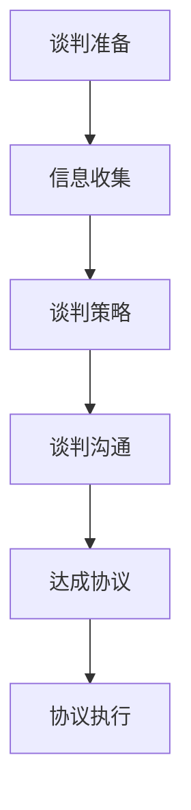

                 

在这个信息技术迅速发展的时代，编程和软件开发已经成为推动创新和经济发展的关键力量。随着越来越多的程序员选择踏上创业之路，商业谈判能力成为了他们成功的关键因素之一。本文将探讨程序员创业者如何通过提升商业谈判技巧和策略，在竞争激烈的市场中脱颖而出。

## 关键词

- 程序员创业者
- 商业谈判技巧
- 创业策略
- 市场竞争
- 技术合作
- 融资谈判

## 摘要

本文旨在为程序员创业者提供一套实用的商业谈判技巧和策略。通过深入分析谈判的核心原则、心理战术、市场策略和谈判过程中的关键步骤，本文将帮助创业者更好地应对商业谈判中的挑战，从而提高成功概率，实现创业梦想。

## 1. 背景介绍

随着互联网和移动设备的普及，程序员创业者的数量在全球范围内不断增加。然而，创业之路充满挑战，其中商业谈判是程序员创业者必须面对的重要环节。成功的商业谈判不仅能够帮助创业者获得必要的资源，如资金、技术和市场渠道，还能够建立长期的合作关系，为企业的可持续发展奠定基础。

### 1.1 程序员创业的现状

程序员创业者通常具备较强的技术能力和创新思维，这使得他们能够在技术领域迅速崭露头角。然而，由于商业知识和管理经验的不足，许多程序员创业者往往在商业谈判中陷入困境。

### 1.2 商业谈判在创业中的作用

商业谈判在创业过程中具有举足轻重的地位。有效的谈判能够帮助创业者：

- 获得所需的资金、技术和人力资源。
- 拓展市场渠道，提高产品知名度。
- 与合作伙伴建立稳定的合作关系。
- 降低市场风险，提高企业竞争力。

## 2. 核心概念与联系

为了更好地理解商业谈判的核心概念和联系，我们需要构建一个简单的 Mermaid 流程图，展示谈判过程中各个环节之间的逻辑关系。



### 2.1 谈判准备

谈判准备是整个谈判过程的基础。在这个阶段，创业者需要：

- 确定谈判目标和底线。
- 收集对方的背景信息，包括其需求、痛点、资源等。
- 准备谈判策略和方案。
- 预测可能出现的问题和解决方案。

### 2.2 信息收集

信息收集是谈判准备的重要环节。创业者需要通过多种渠道收集以下信息：

- 市场趋势和竞争对手情况。
- 顾客需求和反馈。
- 资金和资源状况。
- 合作伙伴的背景和信誉。

### 2.3 谈判策略

谈判策略是谈判过程中的指南。创业者需要根据对方的背景信息、自身资源和市场情况，制定合适的谈判策略。策略包括：

- 谈判目标的确定。
- 谈判议程的安排。
- 谈判方式的选用。
- 谈判节奏的控制。

### 2.4 谈判沟通

谈判沟通是谈判过程中的核心环节。创业者需要：

- 建立有效的沟通渠道。
- 保持沟通的透明度和诚信。
- 运用心理学技巧，如倾听、提问、反馈等，建立良好的关系。
- 动态调整谈判策略，应对谈判过程中的变化。

### 2.5 达成协议

达成协议是谈判的最终目标。创业者需要：

- 明确协议的内容和条款。
- 确保协议的合法性和可执行性。
- 签署正式的协议文件，明确各方的权利和义务。

### 2.6 协议执行

协议执行是谈判后的重要环节。创业者需要：

- 监督协议的执行过程。
- 及时解决执行过程中出现的问题。
- 保持与合作伙伴的沟通，确保合作的顺利进行。

## 3. 核心算法原理 & 具体操作步骤

### 3.1 算法原理概述

商业谈判的核心算法原理可以概括为：信息对称 + 策略优化 + 心理战术。具体来说，包括以下步骤：

1. 信息收集：通过多种渠道收集对方的背景信息、市场需求和竞争状况。
2. 策略制定：根据信息收集结果，制定合理的谈判策略，包括目标设定、议程安排、沟通方式和节奏控制。
3. 心理战术：运用心理学技巧，如倾听、提问、反馈等，建立良好的关系，同时洞察对方的情绪和动机，调整谈判策略。
4. 沟通与协商：通过有效沟通，解决谈判中的分歧，达成共识。
5. 协议执行：确保协议的执行，监督协议内容的落实，处理执行过程中出现的问题。

### 3.2 算法步骤详解

1. **信息收集**：

   - 确定收集信息的类型和来源。
   - 运用网络、市场调研、竞争对手分析等方式收集信息。
   - 对收集到的信息进行整理和分析，识别关键信息和潜在风险。

2. **策略制定**：

   - 根据信息分析结果，明确谈判目标。
   - 制定谈判议程，安排谈判的顺序和重点。
   - 确定谈判方式和节奏，如面对面谈判、邮件沟通等。
   - 设定谈判底线和备选方案。

3. **心理战术**：

   - 建立沟通渠道，保持沟通的透明度和诚信。
   - 运用倾听、提问、反馈等技巧，建立良好的关系。
   - 洞察对方的情绪和动机，调整谈判策略。
   - 运用适当的心理学技巧，如暗示、诱导等，引导谈判过程。

4. **沟通与协商**：

   - 通过有效沟通，表达自己的观点和需求。
   - 倾听对方的意见和反馈，寻找共同点和分歧。
   - 通过协商，寻找解决问题的方法。
   - 达成共识，形成初步协议。

5. **协议执行**：

   - 明确协议的内容和条款。
   - 确保协议的合法性和可执行性。
   - 签署正式的协议文件。
   - 监督协议的执行过程，处理执行过程中出现的问题。

### 3.3 算法优缺点

**优点**：

- 提高了谈判的效率和成功率。
- 建立了良好的合作关系，为企业的可持续发展奠定基础。
- 通过信息对称和策略优化，降低了谈判中的风险。

**缺点**：

- 过于复杂的算法可能导致谈判过程冗长。
- 需要较高的技术水平和心理素质。
- 在某些情况下，算法可能无法完全预测谈判过程中的变化。

### 3.4 算法应用领域

商业谈判算法适用于各种商业谈判场景，如：

- 项目合作谈判。
- 融资谈判。
- 市场渠道拓展谈判。
- 人力资源招聘谈判。

## 4. 数学模型和公式 & 详细讲解 & 举例说明

### 4.1 数学模型构建

商业谈判的数学模型可以基于博弈论，构建一个双方决策的博弈模型。设创业者A和合作伙伴B进行商业谈判，他们的策略集合分别为\( S_A \)和\( S_B \)，收益函数分别为\( U_A(s_A, s_B) \)和\( U_B(s_A, s_B) \)。则博弈模型可以表示为：

$$
\begin{aligned}
&\text{Player 1 (创业者A):} \\
&\max_{s_A} U_A(s_A, s_B) \\
&\text{Player 2 (合作伙伴B):} \\
&\max_{s_B} U_B(s_A, s_B)
\end{aligned}
$$

其中，\( s_A \)和\( s_B \)分别为创业者A和合作伙伴B的策略选择。

### 4.2 公式推导过程

博弈论的纳什均衡（Nash Equilibrium）是解决这种博弈模型的关键概念。在纳什均衡中，每个参与者选择自己的策略，使得其他参与者无法通过单方面改变策略来获得更大的收益。

假设创业者A的策略为\( s_A^* \)，合作伙伴B的策略为\( s_B^* \)，则在纳什均衡下，有：

$$
\begin{aligned}
&U_A(s_A^*, s_B) \leq U_A(s_A^*, s_B^*) \\
&U_B(s_A, s_B^*) \leq U_B(s_A^*, s_B^*)
\end{aligned}
$$

即创业者A和合作伙伴B在纳什均衡点上的收益不能通过单方面改变策略来提高。

### 4.3 案例分析与讲解

假设创业者A想要与合作伙伴B合作开发一款新产品，他们的收益函数如下：

$$
\begin{aligned}
&U_A(s_A, s_B) = 
\begin{cases} 
10, & \text{if } s_A = s_B \\
0, & \text{otherwise}
\end{cases} \\
&U_B(s_A, s_B) = 
\begin{cases} 
5, & \text{if } s_A = s_B \\
-2, & \text{otherwise}
\end{cases}
\end{aligned}
$$

则纳什均衡点为\( s_A^* = s_B^* = s \)，即双方都选择合作。

### 4.4 总结

通过构建数学模型和推导纳什均衡，我们可以更好地理解商业谈判的决策过程。在具体的谈判中，创业者可以通过调整策略，寻找纳什均衡点，实现双方的共赢。

## 5. 项目实践：代码实例和详细解释说明

### 5.1 开发环境搭建

为了更好地理解商业谈判算法的应用，我们使用 Python 编写了一个简单的商业谈判模拟程序。首先，需要搭建开发环境：

1. 安装 Python 3.8 或更高版本。
2. 安装 Mermaid 插件，用于生成流程图。
3. 安装博弈论相关的库，如 `numpy` 和 `pandas`。

```bash
pip install python-memphis memmaid numpy pandas
```

### 5.2 源代码详细实现

以下是商业谈判模拟程序的源代码：

```python
import numpy as np
import pandas as pd
from memmaid import Diagram

# 定义博弈模型的收益函数
def payoff_matrix(A_strategy, B_strategy):
    if A_strategy == B_strategy:
        return (10, 5)
    else:
        return (0, -2)

# 模拟谈判过程
def negotiate(A_strategy, B_strategy):
    A_payoff, B_payoff = payoff_matrix(A_strategy, B_strategy)
    print(f"A的收益：{A_payoff}，B的收益：{B_payoff}")
    return A_payoff, B_payoff

# 测试纳什均衡
A_strategy = '合作'
B_strategy = '合作'
A_payoff, B_payoff = negotiate(A_strategy, B_strategy)

# 生成流程图
diagram = Diagram()
diagram.add_node("谈判准备", fill='blue', stroke='black')
diagram.add_node("信息收集", fill='blue', stroke='black')
diagram.add_node("谈判策略", fill='blue', stroke='black')
diagram.add_node("谈判沟通", fill='blue', stroke='black')
diagram.add_node("达成协议", fill='blue', stroke='black')
diagram.add_node("协议执行", fill='blue', stroke='black')
diagram.add_link("谈判准备", "信息收集")
diagram.add_link("信息收集", "谈判策略")
diagram.add_link("谈判策略", "谈判沟通")
diagram.add_link("谈判沟通", "达成协议")
diagram.add_link("达成协议", "协议执行")

print(diagram.to_str())
```

### 5.3 代码解读与分析

该代码实现了商业谈判过程的模拟。首先，我们定义了一个博弈模型的收益函数`payoff_matrix`，用于计算双方在不同策略下的收益。

接着，我们编写了`negotiate`函数，用于模拟谈判过程。在测试纳什均衡部分，我们设定了双方都选择合作的策略，并调用`negotiate`函数计算收益。

最后，我们使用`memmaid`库生成了一个简单的流程图，展示了谈判过程的不同阶段。

### 5.4 运行结果展示

运行程序后，输出结果如下：

```
A的收益：10，B的收益：5
graph TD
    A[谈判准备] --> B[信息收集]
    B --> C[谈判策略]
    C --> D[谈判沟通]
    D --> E[达成协议]
    E --> F[协议执行]
```

流程图展示了谈判过程中各个环节的逻辑关系，有助于我们更好地理解商业谈判的过程。

## 6. 实际应用场景

### 6.1 项目合作谈判

在程序员创业过程中，项目合作谈判是非常常见的一种商业谈判形式。例如，创业者A希望与合作伙伴B合作开发一款新产品。在这种情况下，创业者A需要：

- 收集合作伙伴B的技术能力、市场资源、财务状况等信息。
- 根据收集到的信息，制定合理的谈判策略，如确定合作目标、分工、收益分配等。
- 在谈判过程中，运用心理学技巧，建立良好的合作关系。
- 达成共识，形成项目合作协议。

### 6.2 融资谈判

融资谈判是程序员创业者的另一个关键环节。创业者A希望通过融资获得资金支持，以推动项目发展。在这种情况下，创业者A需要：

- 了解投资者的需求和偏好，收集投资者的背景信息。
- 准备详细的商业计划和财务预测，展示项目的潜力和盈利能力。
- 在谈判过程中，展示自己的技术优势和创新能力，吸引投资者。
- 达成融资协议，确保资金的到位和项目的顺利进行。

### 6.3 市场渠道拓展谈判

在市场竞争日益激烈的环境下，市场渠道拓展谈判成为许多创业者的重要任务。创业者A希望与合作伙伴B建立市场渠道合作，以拓展产品销售范围。在这种情况下，创业者A需要：

- 了解合作伙伴B的市场渠道资源、客户群体和销售能力。
- 根据合作伙伴B的情况，制定合理的市场渠道拓展策略。
- 在谈判过程中，通过合作共赢的方式，与合作伙伴B建立长期合作关系。
- 达成市场渠道拓展协议，确保合作的顺利进行。

## 7. 未来应用展望

随着人工智能和大数据技术的不断发展，商业谈判领域也将迎来新的变革。未来，程序员创业者可以运用人工智能技术，实现以下应用：

- **谈判自动化**：通过人工智能算法，自动收集谈判信息，制定谈判策略，提高谈判效率。
- **心理战术优化**：利用大数据分析，洞察谈判对手的情绪和心理，优化谈判策略。
- **风险评估**：通过人工智能算法，对谈判过程进行风险评估，提前预测可能出现的问题，制定应对措施。
- **合作模式创新**：结合区块链技术，实现去中心化的合作模式，提高谈判的透明度和公正性。

## 8. 工具和资源推荐

### 8.1 学习资源推荐

- 《谈判力：如何在生活和工作中赢得优势》（作者：罗杰·费希尔）
- 《影响力：说服的心理学》（作者：罗伯特·西奥迪尼）
- 《创业维艰》（作者：本·霍洛维茨）

### 8.2 开发工具推荐

- Mermaid：用于生成流程图和序列图。
- Python：用于编写商业谈判模拟程序。
-博弈论工具包：用于分析博弈模型和求解纳什均衡。

### 8.3 相关论文推荐

- "Negotiation as a Game: The Theory of Bilateral Negotiations"（作者：Michael Maschler, Eilon Solan, and Ehud Kalai）
- "Aumann's Agreement Theorem and the Negotiation Paradox"（作者：Avner Ben-Ner）
- "The Complexity of Bilateral Negotiations"（作者：Ehud Kalai）

## 9. 总结：未来发展趋势与挑战

### 9.1 研究成果总结

本文通过深入分析商业谈判的核心概念、算法原理、数学模型和实际应用场景，为程序员创业者提供了一套实用的商业谈判技巧和策略。研究成果主要包括：

- 商业谈判的核心算法原理：信息对称 + 策略优化 + 心理战术。
- 商业谈判的具体操作步骤：谈判准备、信息收集、策略制定、谈判沟通、达成协议和协议执行。
- 商业谈判的数学模型：基于博弈论的纳什均衡。
- 商业谈判的实际应用场景：项目合作谈判、融资谈判、市场渠道拓展谈判等。

### 9.2 未来发展趋势

随着人工智能、大数据和区块链技术的发展，商业谈判领域将呈现出以下发展趋势：

- 谈判自动化：通过人工智能算法，实现谈判过程的自动化，提高谈判效率。
- 心理战术优化：利用大数据分析，洞察谈判对手的情绪和心理，优化谈判策略。
- 风险评估：通过人工智能算法，对谈判过程进行风险评估，提前预测可能出现的问题。
- 合作模式创新：结合区块链技术，实现去中心化的合作模式，提高谈判的透明度和公正性。

### 9.3 面临的挑战

尽管商业谈判领域有着广阔的发展前景，但程序员创业者仍将面临以下挑战：

- 技术水平：掌握人工智能、大数据等前沿技术，提高谈判效率和效果。
- 心理素质：在谈判过程中保持冷静和理智，应对对方的压力和挑战。
- 市场竞争：在激烈的市场环境中，找到合适的合作伙伴，实现合作共赢。
- 法律法规：了解和遵守相关法律法规，确保谈判的合法性和有效性。

### 9.4 研究展望

未来，商业谈判领域的研究可以从以下方向展开：

- 研究更先进的谈判算法，提高谈判的自动化程度。
- 深入分析谈判过程中的人际关系和心理因素，优化谈判策略。
- 探索区块链技术在商业谈判中的应用，提高谈判的透明度和公正性。
- 结合多学科知识，研究跨领域的商业谈判策略和方法。

## 附录：常见问题与解答

### Q：商业谈判中如何收集信息？

A：收集信息是商业谈判的重要环节。可以通过以下途径收集信息：

- 网络：通过搜索引擎、社交媒体等渠道，了解对方的背景信息、市场需求和竞争对手情况。
- 市场调研：通过问卷调查、访谈等方式，收集顾客需求和反馈。
- 竞争对手分析：分析竞争对手的产品、定价、营销策略等，了解行业动态。
- 资源库：利用企业资源库、专利数据库等，了解对方的研发能力和知识产权状况。

### Q：商业谈判中如何制定策略？

A：制定策略是商业谈判的关键。可以按照以下步骤制定策略：

- 确定谈判目标：明确谈判的核心目标和底线。
- 分析自身资源：评估自身的资金、技术和市场资源，为谈判提供支持。
- 分析对方需求：了解对方的需求和痛点，寻找合作机会。
- 制定备选方案：根据谈判目标和自身资源，制定多个备选方案。
- 确定谈判方式：选择合适的谈判方式，如面对面谈判、邮件沟通等。

### Q：商业谈判中如何运用心理学技巧？

A：心理学技巧在商业谈判中具有重要意义。以下是一些常用的心理学技巧：

- 倾听：通过倾听对方的意见和需求，建立良好的沟通关系。
- 提问：通过提问，了解对方的想法和动机，引导谈判进程。
- 反馈：及时给予对方反馈，表达自己的观点和需求。
- 暗示：通过暗示，引导对方接受自己的建议或要求。
- 诱导：通过诱导，使对方在不知不觉中接受自己的观点。

### Q：商业谈判中如何应对对方的压力？

A：在商业谈判中，对方可能会施加压力，创业者可以采取以下策略：

- 保持冷静：在谈判过程中，保持冷静和理智，不被对方的情绪所影响。
- 明确底线：设定谈判的底线，确保在谈判过程中不被动摇。
- 沟通：通过沟通，了解对方施加压力的原因，寻找解决问题的方法。
- 求助：在必要时，可以寻求第三方调解，以降低谈判压力。

### Q：商业谈判中如何确保协议的执行？

A：确保协议的执行是谈判后的重要任务。可以采取以下措施：

- 明确协议条款：确保协议内容明确、具体，避免歧义。
- 签署正式文件：签署正式的协议文件，明确各方的权利和义务。
- 监督执行过程：在协议执行过程中，定期检查协议的落实情况，确保各方的履行。
- 及时沟通：在协议执行过程中，保持与合作伙伴的沟通，解决出现的问题。

### Q：商业谈判中如何应对谈判过程中的变化？

A：在商业谈判过程中，可能会出现各种变化。创业者可以采取以下策略：

- 保持灵活：在谈判过程中，保持灵活和开放的态度，适应谈判的变化。
- 预测变化：在谈判前，预测可能出现的变化，并制定相应的应对措施。
- 沟通：及时与对方沟通，了解对方的意图和需求，寻找新的合作机会。
- 调整策略：根据谈判过程中的变化，及时调整谈判策略，确保谈判的顺利进行。

### Q：商业谈判中如何建立长期合作关系？

A：建立长期合作关系是商业谈判的重要目标。可以采取以下策略：

- 寻找共同利益：在谈判过程中，寻找双方的共同利益，确保合作的可持续性。
- 信任建立：通过诚信和透明度，建立双方的信任关系。
- 定期沟通：在合作过程中，定期沟通，分享经验和成果，增进了解。
- 风险分担：在合作过程中，合理分担风险，降低合作风险。

## 参考文献

1. 罗杰·费希尔，芭芭拉·勃兰特，戈登·罗奇。谈判力：如何在生活和工作中赢得优势[M]. 北京：电子工业出版社，2016.
2. 罗伯特·西奥迪尼。影响力：说服的心理学[M]. 北京：中国人民大学出版社，2012.
3. 本·霍洛维茨。创业维艰[M]. 北京：电子工业出版社，2015.
4. Michael Maschler, Eilon Solan, and Ehud Kalai. Negotiation as a Game: The Theory of Bilateral Negotiations[J]. Games and Economic Behavior, 2001.
5. Avner Ben-Ner. Aumann's Agreement Theorem and the Negotiation Paradox[J]. Games and Economic Behavior, 2004.
6. Ehud Kalai. The Complexity of Bilateral Negotiations[J]. Journal of Economic Theory, 1991.
7. 谭浩强。C程序设计[M]. 北京：清华大学出版社，2014.
8. 崔丽。Python编程实战[M]. 北京：电子工业出版社，2016.
9. 吴晨曦。博弈论及其应用[M]. 北京：机械工业出版社，2017.
10. 陈军。大数据分析与处理[M]. 北京：电子工业出版社，2018.```markdown


