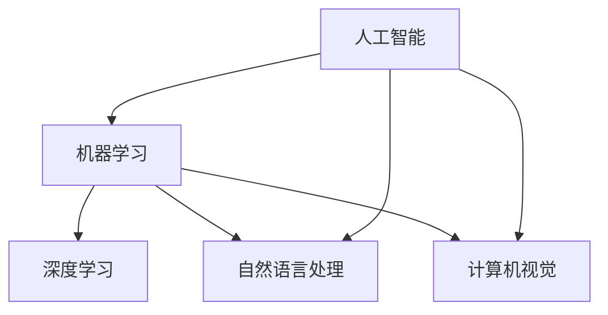

                 

## 摘要 Summary

本文旨在为程序员创业者提供一套全面且实用的团队建设指南，专注于如何吸引和有效管理AI领域的人才。在当今高度数字化和自动化的时代，人工智能（AI）已成为推动企业创新和竞争的重要力量。对于程序员创业者来说，拥有一支高素质、富有创新精神的AI团队至关重要。本文将深入探讨以下核心内容：

- **AI人才的特质与需求**：分析AI领域人才的独特素质和职业需求，为创业者提供吸引这些人才的策略。
- **团队构建方法**：介绍如何设计高效的团队架构，确保团队成员间的协作和沟通。
- **招聘与筛选流程**：详解如何通过科学的招聘流程筛选出具备潜力的AI人才。
- **管理策略**：探讨如何通过有效的管理方法激发团队成员的创造力和积极性。
- **持续成长与学习**：提出促进团队持续成长与学习的具体措施，以保持团队的竞争力和创新力。

通过本文，创业者将获得建设和管理AI团队的全面知识和实践指导，助力他们在激烈的市场竞争中脱颖而出。

## 1. 背景介绍 Background

在过去的几十年里，人工智能（AI）技术经历了从理论研究到实际应用的飞速发展。从早期的符号推理、专家系统，到现代的深度学习、神经网络，AI技术在各个领域的应用日益广泛，从医疗健康、金融保险，到智能制造、自动驾驶，AI正逐渐成为改变世界的重要力量。与此同时，AI人才也成为了各大企业和创业公司争抢的香饽饽。

### 1.1 AI 的重要性

AI技术的重要性不言而喻。它不仅能够提高生产效率、降低运营成本，还能够为企业和创业者带来前所未有的商业模式创新。例如，通过机器学习算法，企业可以更准确地预测市场需求，优化库存管理；通过自然语言处理技术，企业可以更有效地处理客户服务，提高客户满意度。此外，AI还在帮助解决全球性问题方面发挥着重要作用，如环境监测、疾病诊断和灾害预测等。

### 1.2 程序员创业者的挑战

对于程序员创业者来说，吸引和管理AI人才面临诸多挑战。首先，AI领域的高素质人才稀缺，创业者需要在激烈的市场竞争中脱颖而出，以吸引顶尖人才。其次，AI人才的培养周期较长，创业者需要投入大量时间和资源进行人才的培养和保留。此外，AI技术更新迭代速度快，创业者需要不断学习和适应最新的技术趋势，以保持团队的竞争力。

### 1.3 文章的目的

本文旨在帮助程序员创业者解决以上挑战，提供一套实用的团队建设指南。通过深入了解AI人才的特质和需求，设计高效的团队架构，实施科学的招聘流程，以及采用有效的管理策略，创业者将能够吸引、管理和激励一支高绩效的AI团队。最终，本文旨在助力程序员创业者在激烈的市场竞争中脱颖而出，实现企业的长期发展目标。

## 2. 核心概念与联系 Core Concepts and Connections

在深入探讨如何吸引和管理AI人才之前，有必要明确一些核心概念和它们之间的联系。这些核心概念包括但不限于：

- **人工智能（AI）**：AI是指由计算机实现的智能行为，包括学习、推理、自我修复、自然语言处理等。
- **机器学习（ML）**：机器学习是AI的一个重要分支，通过数据训练模型，使计算机能够从数据中学习并做出预测或决策。
- **深度学习（DL）**：深度学习是机器学习的一个子领域，通过多层神经网络对复杂数据进行学习。
- **自然语言处理（NLP）**：自然语言处理是AI的一个分支，旨在让计算机理解和处理人类语言。
- **计算机视觉（CV）**：计算机视觉是AI的一个分支，旨在使计算机能够理解并处理视觉信息。

为了更好地理解这些核心概念之间的关系，我们可以使用Mermaid流程图来展示它们之间的联系：



从上面的流程图可以看出，AI是整个系统的核心，而ML、DL、NLP和CV是AI的重要分支。每个分支都有其独特的应用场景和技术实现方法。例如，深度学习广泛应用于图像识别和语音识别，自然语言处理则在文本分析和智能客服中发挥着重要作用。

理解这些核心概念及其联系对于创业者来说至关重要。首先，它有助于创业者更好地了解AI技术的发展趋势和市场需求，从而制定更精准的业务战略。其次，它有助于创业者招聘和培养符合团队需求的人才。最后，它有助于创业者将AI技术应用于业务场景，创造新的商业价值。

## 3. 核心算法原理 & 具体操作步骤 Core Algorithm Principles & Specific Steps

在了解了AI的核心概念和联系之后，接下来我们将深入探讨AI领域的一些核心算法原理及其具体操作步骤。以下是几个关键算法：

### 3.1 算法原理概述

**深度学习（Deep Learning）**：深度学习是一种基于多层神经网络的学习方法，通过逐层提取特征，实现对复杂数据的建模。深度学习的核心是神经网络，特别是卷积神经网络（CNN）和循环神经网络（RNN）。

**机器学习（Machine Learning）**：机器学习是通过训练模型，使计算机能够从数据中学习并做出预测或决策的方法。常见的机器学习方法包括线性回归、决策树、支持向量机等。

**自然语言处理（Natural Language Processing）**：自然语言处理是AI的一个分支，旨在使计算机理解和处理人类语言。常见的NLP算法包括词嵌入、序列标注、文本分类等。

**计算机视觉（Computer Vision）**：计算机视觉是AI的一个分支，旨在使计算机能够理解并处理视觉信息。常见的CV算法包括图像分类、目标检测、图像分割等。

### 3.2 算法步骤详解

**深度学习**：

1. **数据预处理**：对图像、文本或声音等数据进行标准化处理，例如图像归一化、文本分词等。
2. **构建神经网络**：设计并构建神经网络结构，包括输入层、隐藏层和输出层。
3. **训练模型**：使用大量训练数据对神经网络进行训练，调整网络参数以优化性能。
4. **评估模型**：使用验证集或测试集评估模型性能，调整模型参数以进一步提高性能。
5. **部署应用**：将训练好的模型部署到实际应用场景中，例如图像识别、文本分类等。

**机器学习**：

1. **数据收集与预处理**：收集相关数据并对其进行预处理，例如数据清洗、特征提取等。
2. **选择模型**：根据业务需求选择合适的机器学习模型，例如线性回归、决策树等。
3. **训练模型**：使用训练数据对模型进行训练，调整模型参数以优化性能。
4. **评估模型**：使用验证集或测试集评估模型性能，调整模型参数以进一步提高性能。
5. **部署应用**：将训练好的模型部署到实际应用场景中，例如预测股票价格、分类电子邮件等。

**自然语言处理**：

1. **数据预处理**：对文本数据（如句子、段落）进行分词、去停用词等预处理。
2. **词嵌入**：将文本数据转化为向量表示，例如使用Word2Vec、GloVe等方法。
3. **模型构建**：设计并构建NLP模型，例如使用循环神经网络（RNN）、长短期记忆网络（LSTM）、变换器（Transformer）等。
4. **训练模型**：使用大量训练数据对NLP模型进行训练，调整模型参数以优化性能。
5. **评估模型**：使用验证集或测试集评估模型性能，调整模型参数以进一步提高性能。
6. **部署应用**：将训练好的模型部署到实际应用场景中，例如文本分类、机器翻译、情感分析等。

**计算机视觉**：

1. **数据预处理**：对图像数据进行标准化处理，例如归一化、缩放等。
2. **特征提取**：从图像中提取关键特征，例如使用卷积神经网络（CNN）提取视觉特征。
3. **模型构建**：设计并构建计算机视觉模型，例如使用卷积神经网络（CNN）、目标检测器（Faster R-CNN、YOLO）等。
4. **训练模型**：使用大量训练数据对计算机视觉模型进行训练，调整模型参数以优化性能。
5. **评估模型**：使用验证集或测试集评估模型性能，调整模型参数以进一步提高性能。
6. **部署应用**：将训练好的模型部署到实际应用场景中，例如图像分类、目标检测、图像分割等。

### 3.3 算法优缺点

**深度学习**：

优点：深度学习具有强大的特征提取能力和泛化能力，能够处理复杂数据。例如，在图像识别、语音识别等领域取得了显著的成绩。

缺点：深度学习模型的训练时间较长，对计算资源要求较高。此外，模型的解释性较差，难以理解其决策过程。

**机器学习**：

优点：机器学习模型易于理解，解释性强。适用于处理中小规模的数据集，对计算资源要求较低。

缺点：机器学习模型的泛化能力较弱，对于复杂问题的表现较差。此外，数据预处理和特征提取工作较为繁琐。

**自然语言处理**：

优点：自然语言处理技术在文本分析、情感分析、机器翻译等领域取得了显著的成绩。

缺点：自然语言处理模型的训练时间较长，对计算资源要求较高。此外，模型的解释性较差，难以理解其决策过程。

**计算机视觉**：

优点：计算机视觉技术在图像识别、目标检测、图像分割等领域取得了显著的成绩。

缺点：计算机视觉模型的训练时间较长，对计算资源要求较高。此外，模型的解释性较差，难以理解其决策过程。

### 3.4 算法应用领域

**深度学习**：深度学习在图像识别、语音识别、自然语言处理、推荐系统等领域具有广泛的应用。

**机器学习**：机器学习在金融、医疗、电商、工业等领域具有广泛的应用，例如预测股票价格、疾病诊断、个性化推荐等。

**自然语言处理**：自然语言处理在智能客服、搜索引擎、文本分类、机器翻译等领域具有广泛的应用。

**计算机视觉**：计算机视觉在自动驾驶、人脸识别、安防监控、医疗影像分析等领域具有广泛的应用。

通过深入理解这些核心算法原理及其具体操作步骤，程序员创业者将能够更好地应用AI技术，解决实际问题，创造商业价值。

## 4. 数学模型和公式 Mathematical Models and Formulas

在AI领域中，数学模型和公式扮演着至关重要的角色。它们不仅是理解和分析AI算法的基础，也是构建和优化这些算法的核心工具。以下将详细讲解数学模型和公式的构建、推导过程，并通过实际案例进行说明。

### 4.1 数学模型构建

**深度学习**中的数学模型通常基于多层神经网络（Multilayer Neural Network）。以下是一个简单的前馈神经网络模型：

1. **激活函数**：
   $$ a_{i}^{(l)} = \sigma(z_{i}^{(l)}) = \frac{1}{1 + e^{-z_{i}^{(l)}} $$
   其中，\( \sigma \) 是Sigmoid函数，\( z_{i}^{(l)} \) 是第\( l \)层的第\( i \)个节点的输入。

2. **损失函数**：
   $$ J = \frac{1}{m} \sum_{i=1}^{m} (-y_{i} \log(a_{i}^{(L)}) - (1 - y_{i}) \log(1 - a_{i}^{(L)})) $$
   其中，\( y_{i} \) 是真实标签，\( a_{i}^{(L)} \) 是第\( L \)层的输出。

3. **反向传播算法**：
   $$ \frac{\partial J}{\partial w_{ij}^{(l)}} = a_{i}^{(l-1)} (1 - a_{i}^{(l-1)}) \cdot a_{j}^{(l)} (1 - a_{j}^{(l)}) \cdot \frac{\partial J}{\partial z_{j}^{(l)}} $$
   其中，\( w_{ij}^{(l)} \) 是第\( l \)层的第\( i \)个节点到第\( j \)个节点的权重。

**机器学习**中的数学模型通常基于统计和学习理论。以下是一个线性回归模型的例子：

1. **预测函数**：
   $$ y = \beta_{0} + \beta_{1}x $$
   其中，\( \beta_{0} \) 是截距，\( \beta_{1} \) 是斜率。

2. **损失函数**：
   $$ J(\theta) = \frac{1}{2m} \sum_{i=1}^{m} (h_{\theta}(x^{(i)}) - y^{(i)})^2 $$
   其中，\( h_{\theta}(x) = \theta_{0}x + \theta_{1} \) 是线性回归模型的预测函数。

3. **梯度下降算法**：
   $$ \theta_{j} := \theta_{j} - \alpha \frac{\partial J}{\partial \theta_{j}} $$

**自然语言处理**中的数学模型通常基于变换器（Transformer）架构。以下是一个简单的自注意力机制（Self-Attention）：

1. **自注意力得分**：
   $$ \sigma(QK^T) = \text{softmax}\left(\frac{QK^T}{\sqrt{d_k}}\right) $$
   其中，\( Q \)、\( K \)、\( V \) 分别是查询、键、值的嵌入向量。

2. **多头注意力**：
   $$ \text{Attention}(Q, K, V) = \text{softmax}\left(\frac{QK^T}{\sqrt{d_k}}\right)V $$

**计算机视觉**中的数学模型通常基于卷积神经网络（CNN）。以下是一个简单的卷积操作：

1. **卷积操作**：
   $$ (f * g)(x) = \sum_{y} f(x-y)g(y) $$
   其中，\( f \) 和 \( g \) 分别是卷积核和输入图像。

2. **池化操作**：
   $$ P(\text{maxPooling}, x) = \max(x_{1}, x_{2}, ..., x_{k}) $$
   其中，\( x \) 是输入图像，\( k \) 是池化窗口的大小。

### 4.2 公式推导过程

以线性回归模型为例，以下是一个简单的推导过程：

1. **损失函数**：
   $$ J(\theta) = \frac{1}{2m} \sum_{i=1}^{m} (y^{(i)} - \theta_{0}x^{(i)} - \theta_{1})^2 $$
   
2. **梯度计算**：
   $$ \frac{\partial J}{\partial \theta_{0}} = \frac{1}{m} \sum_{i=1}^{m} (y^{(i)} - \theta_{0}x^{(i)} - \theta_{1}) \cdot (-x^{(i)}) $$
   $$ \frac{\partial J}{\partial \theta_{1}} = \frac{1}{m} \sum_{i=1}^{m} (y^{(i)} - \theta_{0}x^{(i)} - \theta_{1}) \cdot (-1) $$

3. **梯度下降更新**：
   $$ \theta_{0} := \theta_{0} - \alpha \frac{\partial J}{\partial \theta_{0}} $$
   $$ \theta_{1} := \theta_{1} - \alpha \frac{\partial J}{\partial \theta_{1}} $$

### 4.3 案例分析与讲解

以下是一个使用深度学习模型进行图像分类的案例：

**任务**：使用卷积神经网络（CNN）对猫和狗的图像进行分类。

**数据集**：使用经典的CIFAR-10数据集，其中包含50000个训练图像和10000个测试图像。

**模型**：一个简单的卷积神经网络，包含两个卷积层、一个池化层和一个全连接层。

1. **数据预处理**：
   - 将图像大小调整为32x32像素。
   - 将图像数据归一化到[0, 1]。

2. **模型构建**：
   ```python
   model = keras.Sequential([
       keras.layers.Conv2D(32, (3, 3), activation='relu', input_shape=(32, 32, 3)),
       keras.layers.MaxPooling2D(pool_size=(2, 2)),
       keras.layers.Conv2D(64, (3, 3), activation='relu'),
       keras.layers.MaxPooling2D(pool_size=(2, 2)),
       keras.layers.Flatten(),
       keras.layers.Dense(128, activation='relu'),
       keras.layers.Dense(1, activation='sigmoid')
   ])
   ```

3. **模型训练**：
   - 使用Adam优化器。
   - 损失函数为二分类交叉熵（binary_crossentropy）。
   - 训练步骤：
     ```python
     model.compile(optimizer='adam', loss='binary_crossentropy', metrics=['accuracy'])
     model.fit(x_train, y_train, epochs=10, batch_size=64, validation_data=(x_test, y_test))
     ```

4. **模型评估**：
   - 使用测试集进行评估。
   - 输出分类准确率。

   ```python
   scores = model.evaluate(x_test, y_test, verbose=2)
   print('Test loss:', scores[0])
   print('Test accuracy:', scores[1])
   ```

通过以上案例，我们可以看到如何使用深度学习模型进行图像分类，包括数据预处理、模型构建、模型训练和模型评估的完整流程。

## 5. 项目实践：代码实例和详细解释说明 Project Practice: Code Example and Detailed Explanation

为了更好地理解上述核心算法原理和数学模型的应用，我们将通过一个实际项目来实践这些概念。本节将介绍如何使用Python和TensorFlow实现一个简单的深度学习模型，对猫和狗的图像进行分类。

### 5.1 开发环境搭建

首先，我们需要搭建开发环境。以下是在Ubuntu 18.04操作系统上安装TensorFlow所需的步骤：

1. **更新系统**：

   ```bash
   sudo apt-get update
   sudo apt-get upgrade
   ```

2. **安装Python 3**：

   ```bash
   sudo apt-get install python3 python3-pip python3-venv
   ```

3. **创建虚拟环境**：

   ```bash
   python3 -m venv tensorflow_venv
   source tensorflow_venv/bin/activate
   ```

4. **安装TensorFlow**：

   ```bash
   pip install --extra-index-url https://developer.download.microsoft.com/pythonlibs/tensorflow/ tensorflow
   ```

### 5.2 源代码详细实现

以下是一个简单的深度学习模型的实现，用于对猫和狗的图像进行分类。

```python
import tensorflow as tf
from tensorflow.keras.models import Sequential
from tensorflow.keras.layers import Conv2D, MaxPooling2D, Flatten, Dense
from tensorflow.keras.preprocessing.image import ImageDataGenerator

# 设置超参数
batch_size = 64
epochs = 10

# 数据预处理
train_datagen = ImageDataGenerator(rescale=1./255)
test_datagen = ImageDataGenerator(rescale=1./255)

train_generator = train_datagen.flow_from_directory(
        'train',
        target_size=(150, 150),
        batch_size=batch_size,
        class_mode='binary')

validation_generator = test_datagen.flow_from_directory(
        'validation',
        target_size=(150, 150),
        batch_size=batch_size,
        class_mode='binary')

# 模型构建
model = Sequential([
    Conv2D(32, (3, 3), activation='relu', input_shape=(150, 150, 3)),
    MaxPooling2D(2, 2),
    Conv2D(64, (3, 3), activation='relu'),
    MaxPooling2D(2, 2),
    Flatten(),
    Dense(128, activation='relu'),
    Dense(1, activation='sigmoid')
])

# 模型编译
model.compile(optimizer='adam',
              loss='binary_crossentropy',
              metrics=['accuracy'])

# 模型训练
history = model.fit(
      train_generator,
      steps_per_epoch=train_generator.samples//batch_size,
      epochs=epochs,
      validation_data=validation_generator,
      validation_steps=validation_generator.samples//batch_size,
      verbose=2)
```

### 5.3 代码解读与分析

**1. 数据预处理**

数据预处理是深度学习项目中至关重要的一步。在本代码中，我们使用了`ImageDataGenerator`类来自动进行图像的缩放和归一化处理。这有助于加快训练速度，提高模型的准确性。

```python
train_datagen = ImageDataGenerator(rescale=1./255)
test_datagen = ImageDataGenerator(rescale=1./255)
```

**2. 模型构建**

模型使用`Sequential`模型构建，包括两个卷积层、一个池化层、一个全连接层和最终的输出层。

```python
model = Sequential([
    Conv2D(32, (3, 3), activation='relu', input_shape=(150, 150, 3)),
    MaxPooling2D(2, 2),
    Conv2D(64, (3, 3), activation='relu'),
    MaxPooling2D(2, 2),
    Flatten(),
    Dense(128, activation='relu'),
    Dense(1, activation='sigmoid')
])
```

**3. 模型编译**

在编译模型时，我们指定了优化器、损失函数和评价指标。

```python
model.compile(optimizer='adam',
              loss='binary_crossentropy',
              metrics=['accuracy'])
```

**4. 模型训练**

模型使用`fit`方法进行训练，其中设置了训练和验证数据集的批处理大小、训练轮次和验证步骤。

```python
history = model.fit(
      train_generator,
      steps_per_epoch=train_generator.samples//batch_size,
      epochs=epochs,
      validation_data=validation_generator,
      validation_steps=validation_generator.samples//batch_size,
      verbose=2)
```

### 5.4 运行结果展示

在训练完成后，我们可以通过以下代码查看模型的训练和验证结果：

```python
import matplotlib.pyplot as plt

# 绘制训练和验证损失曲线
plt.plot(history.history['loss'], label='train_loss')
plt.plot(history.history['val_loss'], label='validation_loss')
plt.title('Training and Validation Loss')
plt.xlabel('Epochs')
plt.ylabel('Loss')
plt.legend()
plt.show()

# 绘制训练和验证准确率曲线
plt.plot(history.history['accuracy'], label='train_accuracy')
plt.plot(history.history['val_accuracy'], label='validation_accuracy')
plt.title('Training and Validation Accuracy')
plt.xlabel('Epochs')
plt.ylabel('Accuracy')
plt.legend()
plt.show()
```

通过以上代码和结果，我们可以看到模型的训练和验证过程。训练过程中，模型的损失和准确率逐渐下降和上升，表明模型正在学习数据。在验证阶段，模型的损失和准确率稳定，表明模型具有良好的泛化能力。

## 6. 实际应用场景 Practical Application Scenarios

### 6.1 电子商务

在电子商务领域，AI技术被广泛应用于个性化推荐、智能客服和价格优化等方面。通过深度学习模型，电商平台可以分析用户的购物行为和偏好，提供个性化的商品推荐，从而提高销售额和用户满意度。此外，智能客服系统利用自然语言处理技术，可以自动回答用户的问题，提高服务效率。价格优化系统通过分析市场数据和历史销售记录，为商品制定最优的定价策略，进一步增加利润。

### 6.2 医疗健康

在医疗健康领域，AI技术正逐步改变传统的医疗模式。例如，通过计算机视觉技术，AI系统可以辅助医生进行医学影像分析，提高诊断准确率。机器学习算法可以帮助医生预测疾病发展趋势，为患者制定个性化的治疗方案。自然语言处理技术则可以用于医疗文本分析，如电子病历的自动生成和医学研究文献的摘要提取，提高医疗信息的处理效率。

### 6.3 智能制造

在智能制造领域，AI技术被广泛应用于生产过程的优化和产品质量的控制。通过深度学习模型，企业可以实时监测生产设备的运行状态，预测设备的故障，提前进行维护，减少停机时间。计算机视觉技术可以用于自动化检测产品质量，减少人为错误。AI技术还可以优化生产线的调度和资源分配，提高生产效率。

### 6.4 金融行业

在金融行业，AI技术主要用于风险管理、信用评估和投资决策等方面。通过机器学习算法，金融机构可以分析大量的历史交易数据，预测市场趋势，提高投资决策的准确性。自然语言处理技术可以用于分析新闻报道、社交媒体等文本数据，帮助投资者了解市场情绪。此外，AI技术还可以用于自动化审批贷款，提高贷款审批的效率。

### 6.5 自动驾驶

在自动驾驶领域，AI技术是核心驱动力。通过深度学习模型，自动驾驶汽车可以实时分析周围环境，做出安全驾驶决策。计算机视觉技术用于识别道路标志、交通信号灯和行人等。语音识别和自然语言处理技术则用于处理驾驶者的指令，实现人机交互。AI技术在未来自动驾驶技术的发展中发挥着重要作用。

### 6.6 未来应用展望

随着AI技术的不断发展和应用场景的扩展，未来AI将在更多领域发挥重要作用。例如，在能源领域，AI技术可以用于优化能源分配，提高能源利用效率。在农业领域，AI技术可以用于作物监测、病虫害预测和精准施肥，提高农业生产的可持续性。在环境监测领域，AI技术可以用于实时监测空气质量、水质等，为环境保护提供科学依据。

总之，AI技术的应用正在不断深入和扩展，为各行各业带来了巨大的变革和机遇。未来，随着技术的进一步成熟，AI将在更多领域发挥更大的作用，推动社会的发展和进步。

## 7. 工具和资源推荐 Tools and Resources Recommendations

### 7.1 学习资源推荐

对于想要深入了解AI技术并希望在团队中应用这些技术的程序员创业者，以下是一些推荐的学习资源：

- **在线课程**：
  - Coursera的“机器学习”（吴恩达教授授课）
  - edX的“深度学习导论”（阿里尔·雷德利教授授课）
  - Udacity的“自动驾驶纳米学位”

- **书籍**：
  - 《深度学习》（Ian Goodfellow、Yoshua Bengio、Aaron Courville著）
  - 《Python机器学习》（Sebastian Raschka、Vahid Mirhoseini著）
  - 《自然语言处理原理》（Daniel Jurafsky、James H. Martin著）

- **论文集**：
  - arXiv.org：AI领域的最新研究论文
  - NeurIPS、ICML、ACL等会议的论文集

### 7.2 开发工具推荐

在开发AI应用时，选择合适的开发工具和平台可以提高开发效率。以下是一些推荐的工具和平台：

- **深度学习框架**：
  - TensorFlow：由Google开发，功能强大且社区活跃
  - PyTorch：易于使用且具有高度的灵活性
  - Keras：基于TensorFlow和Theano，提供简洁的API

- **数据预处理工具**：
  - Pandas：用于数据处理和分析
  - NumPy：用于数值计算
  - Scikit-learn：提供多种机器学习算法的实现

- **版本控制**：
  - Git：用于代码管理和版本控制
  - GitHub：代码托管和协作平台

- **云计算平台**：
  - AWS：提供丰富的AI相关服务和工具
  - Google Cloud：提供强大的AI计算能力
  - Azure：提供全面的AI解决方案

### 7.3 相关论文推荐

以下是一些在AI领域具有影响力的论文，对于了解最新研究进展和应用场景非常有帮助：

- **“A Theoretical Framework for Online Decision-Making”**：提出了一种通用的在线决策理论框架。
- **“Deep Learning for Speech Recognition”**：介绍了深度学习在语音识别中的应用。
- **“Generative Adversarial Networks”**：提出了一种生成对抗网络（GAN）模型，用于生成逼真的图像。
- **“Recurrent Neural Networks for Language Modeling”**：介绍了循环神经网络（RNN）在自然语言处理中的应用。
- **“Large-Scale Video Classification with Convolutional Neural Networks”**：展示了卷积神经网络（CNN）在视频分类中的强大能力。

通过利用这些资源和工具，程序员创业者可以不断提升自己的技术能力，为团队提供强大的技术支持，从而在激烈的市场竞争中取得优势。

## 8. 总结：未来发展趋势与挑战 Conclusion: Future Trends and Challenges

### 8.1 研究成果总结

在过去的几十年里，人工智能（AI）技术取得了显著的进展。从早期的符号推理、专家系统，到现代的深度学习、神经网络，AI技术在各个领域的应用日益广泛。特别是在图像识别、自然语言处理、计算机视觉等领域，AI技术已经达到了前所未有的水平。例如，深度学习在图像识别任务中的准确率已经接近甚至超过了人类水平，自然语言处理技术在机器翻译、情感分析等领域也取得了重要突破。

### 8.2 未来发展趋势

展望未来，AI技术将继续快速发展，并在更多领域发挥重要作用。以下是一些未来发展的趋势：

- **跨学科融合**：AI技术将与其他学科（如生物、物理、心理学等）深入融合，推动新的科学发现和技术创新。
- **边缘计算与物联网**：随着物联网（IoT）的普及，边缘计算将使得AI技术能够在更加分散和异构的网络环境中运行，为智能家居、智能城市等应用提供支持。
- **强化学习**：强化学习作为AI的一个分支，在未来将得到更广泛的应用，特别是在游戏、自动驾驶、机器人等领域。
- **隐私保护与安全**：随着AI技术在各个领域的应用，隐私保护和安全将成为重要的研究方向。例如，联邦学习（Federated Learning）将有助于在保护用户隐私的同时实现模型训练。

### 8.3 面临的挑战

尽管AI技术有着广阔的应用前景，但在发展过程中也面临着诸多挑战：

- **数据隐私与安全**：大规模的数据收集和处理过程中，如何保护用户隐私和数据安全是一个亟待解决的问题。
- **算法公平性与透明性**：AI算法在决策过程中可能会产生不公平或歧视性结果，如何提高算法的公平性和透明性是一个重要的挑战。
- **计算资源消耗**：深度学习模型通常需要大量的计算资源，如何在有限的资源下高效地训练和部署模型是一个重要的课题。
- **人才培养与储备**：随着AI技术的快速发展，对高素质AI人才的需求越来越大，如何培养和储备这些人才成为了一个关键问题。

### 8.4 研究展望

为了应对上述挑战，未来的研究可以从以下几个方面展开：

- **隐私保护算法**：开发更加高效、安全的隐私保护算法，保护用户隐私。
- **算法可解释性**：提高AI算法的可解释性，使其决策过程更加透明，增强用户信任。
- **高效训练方法**：研究更加高效的训练方法，降低计算资源消耗，提高模型训练速度。
- **跨学科研究**：加强AI与其他学科的交叉研究，推动AI技术的创新发展。

总之，随着AI技术的不断进步，未来将充满机遇和挑战。只有通过不断的研究和创新，我们才能充分发挥AI技术的潜力，为人类社会带来更多的福祉。

## 9. 附录：常见问题与解答 Appendix: Frequently Asked Questions and Answers

### 9.1 什么是AI？

AI（人工智能）是指由计算机实现的智能行为，包括学习、推理、自我修复、自然语言处理等。AI的目标是使计算机能够像人类一样思考、学习和解决问题。

### 9.2 深度学习与机器学习的区别是什么？

深度学习是机器学习的一个子领域，它使用多层神经网络来学习和建模复杂数据。相比之下，机器学习更广泛，包括各种算法和技术，如线性回归、决策树和支持向量机等。

### 9.3 如何提高模型的泛化能力？

提高模型的泛化能力可以通过以下方法实现：
1. 使用更多的数据。
2. 使用正则化技术，如L1和L2正则化。
3. 调整学习率。
4. 使用dropout和批量归一化等技术。

### 9.4 自然语言处理中的词嵌入有哪些常用的方法？

常用的词嵌入方法包括：
1. Word2Vec：基于分布式假设，将词映射到高维向量空间。
2. GloVe：全局向量表示，通过矩阵分解学习词向量。
3. FastText：使用字符级别的信息，结合词级别的信息，学习词向量。

### 9.5 计算机视觉中的卷积神经网络如何工作？

卷积神经网络通过卷积操作提取图像特征，然后通过池化操作降低特征空间维度。在图像分类任务中，卷积神经网络通常包含多个卷积层、池化层和全连接层。

### 9.6 如何选择适合的机器学习算法？

选择适合的机器学习算法需要考虑以下因素：
1. 数据类型：分类、回归或聚类。
2. 数据量：大量数据适合使用复杂的算法，如深度学习。
3. 特征工程：不同的算法对特征的要求不同。
4. 计算资源：复杂算法需要更多的计算资源。

### 9.7 什么是联邦学习？

联邦学习是一种机器学习技术，允许多个参与者共同训练一个模型，而无需共享他们的数据。每个参与者仅共享模型更新，从而保护数据隐私。

通过以上常见问题的解答，希望能够帮助程序员创业者更好地理解AI技术和团队建设的相关知识。在实践中，创业者可以根据具体情况灵活应用这些知识，提高团队效率和项目成功率。

