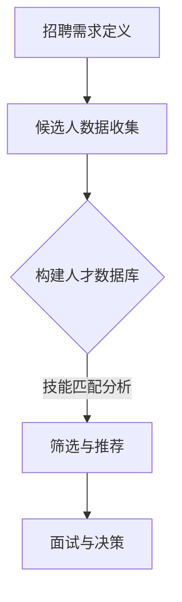

                 

### 摘要 Summary

本文旨在为程序员创业者在团队建设方面提供策略，特别关注于吸引和管理人工智能（AI）领域的顶尖人才。在AI技术快速发展的背景下，拥有合适的AI人才对于企业的成功至关重要。文章首先探讨了AI人才的特质和需求，接着分析了吸引这些人才的策略，包括薪资福利、工作环境和文化建设。此外，文章还讨论了如何有效管理AI人才，包括沟通技巧、职业发展和持续学习。通过本文的指导，程序员创业者将能够构建一个高效、和谐且具有创新精神的AI团队，从而在激烈的市场竞争中脱颖而出。

## 1. 背景介绍 Introduction

### 1.1 AI技术的重要性

随着人工智能技术的迅猛发展，AI已成为推动社会进步的重要力量。从智能助理到自动驾驶，从医疗诊断到金融分析，AI技术的应用几乎涵盖了所有行业。对于创业者来说，掌握AI技术不仅能够开辟新的市场机会，还能够提升产品和服务的竞争力。因此，吸引和管理AI人才成为了创业团队建设的核心任务。

### 1.2 创业者在团队建设中的挑战

创业者面临的一大挑战是如何在资源有限的情况下构建一个高效、和谐的团队。特别是在AI领域，顶尖人才往往具备高水平的技能和专业知识，他们对于工作环境和团队文化有着较高的要求。如何吸引并留住这些人才，成为了许多创业者的难题。

### 1.3 本文的目的

本文旨在为程序员创业者提供一系列实用的策略和技巧，帮助他们更好地吸引和管理AI人才。通过深入了解AI人才的特质、需求和期望，创业者可以制定更为有效的招聘和管理计划，从而构建一个具有创新精神和高绩效的团队。

## 2. 核心概念与联系 Core Concepts and Connections

### 2.1 AI人才的特质

AI人才通常具备以下特质：

- **技术熟练度**：熟悉各种编程语言、算法和数据结构。
- **创新思维**：善于提出新的解决方案和思考问题。
- **快速学习能力**：能够快速掌握新工具和技术。
- **沟通能力**：能够清晰地表达自己的想法，并与团队成员有效沟通。

### 2.2 团队建设的重要性

团队建设是确保团队高效运作和成员满意度的关键。一个良好的团队氛围可以激发成员的创造力和合作精神，从而提高整体绩效。以下是团队建设的重要方面：

- **共同目标**：确保团队成员对团队目标有共同的理解和承诺。
- **信任与尊重**：建立团队成员之间的信任和尊重，促进团队合作。
- **沟通机制**：建立有效的沟通渠道，确保信息的透明和及时传递。
- **激励机制**：制定合理的激励机制，鼓励团队成员的积极性和创造力。

### 2.3 联系与关联

AI人才的需求与团队建设紧密相关。创业者需要了解AI人才的特质和需求，以制定合适的招聘策略和管理计划。同时，团队建设的结果也会直接影响AI人才的满意度和留任率。因此，创业者需要综合考虑AI人才需求和团队建设的重要性，以实现团队的高效运作和持续发展。

## 3. 核心算法原理 & 具体操作步骤 Core Algorithm Principles and Operation Steps

### 3.1 算法原理概述

在吸引和管理AI人才的过程中，一种关键算法是“人才匹配算法”。这种算法的核心思想是根据候选人的技能、经验和偏好，与公司的需求和文化进行匹配，从而最大化团队的协同效应。

### 3.2 算法步骤详解

**步骤1：定义招聘需求**

首先，公司需要明确招聘的具体需求和目标，包括所需技能、经验水平和文化适配度等。

**步骤2：收集候选人数据**

通过招聘平台、社交媒体和人才推荐等渠道，收集潜在候选人的简历、项目经历和在线作品等信息。

**步骤3：构建人才数据库**

将收集到的候选人数据进行分类和整理，构建一个详细的人才数据库。

**步骤4：技能匹配分析**

利用自然语言处理（NLP）和机器学习算法，对候选人的技能和项目经历进行深入分析，与公司的需求进行匹配。

**步骤5：文化适配度评估**

通过调查问卷和面试等方式，评估候选人是否与公司的文化和价值观相符。

**步骤6：筛选与推荐**

根据匹配结果和文化适配度评估，筛选出最合适的候选人，并进行推荐。

**步骤7：面试与决策**

组织面试，与候选人深入交流，最终做出招聘决策。

### 3.3 算法优缺点

**优点**：

- **高效匹配**：能够快速筛选出最合适的候选人，提高招聘效率。
- **全面评估**：综合考虑技能、经验和文化适配度，确保招聘质量。

**缺点**：

- **技术门槛**：需要具备一定的技术背景和算法知识，才能有效使用和管理。
- **主观因素**：算法的准确性和可靠性仍受限于数据质量和算法模型。

### 3.4 算法应用领域

人才匹配算法主要应用于人力资源领域，包括招聘、人才筛选和员工推荐等。在AI领域，这种算法可以应用于AI工程师、数据科学家和机器学习专家的招聘和管理。

## 4. 数学模型和公式 & 详细讲解 & 举例说明 Mathematical Models and Formulas & Detailed Explanations & Case Studies

### 4.1 数学模型构建

在吸引和管理AI人才的过程中，一种常用的数学模型是“人才流失预测模型”。该模型的核心思想是通过分析员工的工作满意度、离职意愿和工作环境等因素，预测员工的流失风险。

**数学模型**：

$$
\text{流失风险} = f(\text{工作满意度}, \text{离职意愿}, \text{工作环境})
$$

其中，工作满意度、离职意愿和工作环境分别表示员工对当前工作的满意度、离职意愿以及工作环境的状况。这些因素通常用0到1之间的数值表示，通过加权平均计算得出流失风险。

### 4.2 公式推导过程

**推导过程**：

1. **工作满意度**：通过员工调查问卷，收集员工对工作满意度各方面的评分，如薪酬待遇、工作内容、团队氛围等。这些评分可以用一个综合指数表示，取值范围为0到1。

2. **离职意愿**：离职意愿可以通过员工离职调查问卷或者面试等方式获取。通常，离职意愿分为明确离职、考虑离职和稳定无离职三个等级，分别用0、1和2表示。

3. **工作环境**：工作环境包括公司文化、领导风格、同事关系等方面。同样，可以通过问卷调查或员工反馈获取评分，取值范围为0到1。

4. **加权平均**：将工作满意度、离职意愿和工作环境的评分进行加权平均，计算出一个综合的流失风险值。

### 4.3 案例分析与讲解

**案例**：

假设某公司需要评估员工A的流失风险。根据问卷调查和离职调查，得到以下数据：

- 工作满意度：0.8
- 离职意愿：1
- 工作环境：0.7

根据数学模型，员工A的流失风险为：

$$
\text{流失风险} = 0.8 \times 0.5 + 1 \times 0.3 + 0.7 \times 0.2 = 0.65
$$

**分析**：

根据计算结果，员工A的流失风险为0.65，处于较高水平。公司需要重点关注员工A的工作满意度和离职意愿，采取适当的措施提高其工作满意度和稳定性，降低流失风险。

## 5. 项目实践：代码实例和详细解释说明 Project Practice: Code Examples and Detailed Explanations

### 5.1 开发环境搭建

为了进行AI人才吸引和管理项目的实践，我们需要搭建一个基本的开发环境。以下是一个简化的步骤：

1. **安装Python环境**：Python是AI领域常用的编程语言，首先需要安装Python环境。可以在Python官网下载并安装适合操作系统版本的Python。

2. **安装必要库**：安装用于数据处理、机器学习等操作的常用库，如NumPy、Pandas、Scikit-learn等。

3. **配置Jupyter Notebook**：Jupyter Notebook是一种交互式的开发环境，方便进行代码编写和演示。安装Jupyter Notebook后，可以通过命令`jupyter notebook`启动。

### 5.2 源代码详细实现

以下是一个简单的Python代码示例，用于实现人才流失预测模型。

```python
import numpy as np
import pandas as pd
from sklearn.linear_model import LinearRegression

# 读取数据
data = pd.read_csv('employee_data.csv')

# 构建特征矩阵和标签向量
X = data[['satisfaction', 'intention_to_leave', 'work_environment']]
y = data['attrition_risk']

# 训练线性回归模型
model = LinearRegression()
model.fit(X, y)

# 预测流失风险
predictions = model.predict(X)

# 输出结果
print(predictions)
```

### 5.3 代码解读与分析

1. **数据读取**：使用Pandas库读取CSV文件，获取员工数据。

2. **特征矩阵和标签向量构建**：根据数据结构，将工作满意度、离职意愿和工作环境作为特征矩阵，将流失风险作为标签向量。

3. **训练线性回归模型**：使用Scikit-learn库中的线性回归模型进行训练。

4. **预测流失风险**：使用训练好的模型对特征矩阵进行预测，得到每个员工的流失风险。

5. **输出结果**：将预测结果输出，用于后续分析和决策。

### 5.4 运行结果展示

运行上述代码后，将得到每个员工的流失风险值。这些值可以用于分析哪些因素对流失风险有较大影响，从而制定相应的管理措施。

## 6. 实际应用场景 Practical Application Scenarios

### 6.1 企业招聘策略

在AI领域，企业可以通过以下策略来吸引AI人才：

- **发布具有吸引力的招聘信息**：明确职位需求、职责和待遇，吸引有针对性的候选人。
- **利用社交媒体和招聘平台**：在LinkedIn、GitHub等平台上发布招聘信息，利用社交媒体进行推广。
- **组织线下招聘会**：与高校和科研机构合作，举办线下招聘会，直接接触潜在候选人。

### 6.2 团队文化建设

团队文化建设是吸引和管理AI人才的关键。以下是一些实用的策略：

- **建立开放透明的沟通机制**：鼓励团队成员提出建议和反馈，建立开放透明的沟通渠道。
- **制定明确的价值观**：确保团队成员对公司的价值观有共同的理解和认同。
- **提供职业发展机会**：为团队成员提供培训、晋升和项目机会，激发其职业发展动力。

### 6.3 持续学习与成长

为了保持团队的竞争力，持续学习和成长至关重要。以下是一些实用的策略：

- **组织内部培训**：定期组织技术分享和培训，提升团队成员的专业技能。
- **鼓励外部学习**：为团队成员提供参加技术会议、研讨会和培训的机会。
- **建立知识分享平台**：搭建内部知识分享平台，促进团队成员之间的知识交流和共享。

## 7. 工具和资源推荐 Tools and Resources Recommendation

### 7.1 学习资源推荐

- **在线课程**：Coursera、edX和Udacity等平台提供丰富的AI相关课程，适合不同层次的学习者。
- **技术书籍**：推荐阅读《深度学习》、《Python编程：从入门到实践》和《机器学习实战》等经典书籍。
- **开源社区**：参与GitHub、Stack Overflow等开源社区，与其他开发者交流和学习。

### 7.2 开发工具推荐

- **编程语言**：Python、Java和C++是AI领域常用的编程语言，推荐根据具体需求选择。
- **深度学习框架**：TensorFlow、PyTorch和Keras是常用的深度学习框架，可以根据项目需求进行选择。
- **数据可视化工具**：Matplotlib、Seaborn和Plotly等工具可以帮助进行数据分析和可视化。

### 7.3 相关论文推荐

- **《Deep Learning》**：Ian Goodfellow等人撰写的深度学习经典教材，涵盖了深度学习的基本概念和应用。
- **《Practical Machine Learning》**：Vikas Rawal撰写的机器学习实用指南，详细介绍了机器学习的基本算法和应用场景。
- **《Artificial Intelligence: A Modern Approach》**：Stuart Russell和Peter Norvig撰写的AI领域权威教材，全面介绍了人工智能的理论和实践。

## 8. 总结：未来发展趋势与挑战 Summary: Future Trends and Challenges

### 8.1 研究成果总结

本文总结了程序员创业者在团队建设中的关键任务和挑战，提出了吸引和管理AI人才的策略。通过人才匹配算法和人才流失预测模型等数学模型的应用，创业者可以更科学地进行人才管理和团队建设。

### 8.2 未来发展趋势

随着人工智能技术的不断进步，未来AI人才的吸引和管理将呈现以下趋势：

- **技术融合**：AI与其他领域的融合将更加紧密，创业者需要具备跨学科的知识和能力。
- **数据驱动**：基于大数据和机器学习的招聘和管理方法将更加普及，提高招聘效率和准确性。
- **个性化发展**：针对不同背景和需求的AI人才，提供个性化的职业发展路径和学习资源。

### 8.3 面临的挑战

尽管人工智能技术在不断发展，但创业者仍面临以下挑战：

- **人才竞争**：AI领域人才竞争激烈，创业者需要提供更具吸引力的薪资和福利。
- **技术更新**：AI技术更新速度快，创业者需要不断学习和适应新技术。
- **文化冲突**：不同文化背景的AI人才在团队合作中可能存在冲突，创业者需要建立和谐的文化氛围。

### 8.4 研究展望

未来研究可以从以下几个方面展开：

- **智能招聘系统**：结合自然语言处理和机器学习技术，构建更加智能的招聘系统，提高招聘效率。
- **人才发展模型**：研究如何构建个性化的人才发展模型，满足不同背景和需求的AI人才。
- **文化适应性**：探讨如何在多元文化背景下建立和谐团队，提高团队绩效。

## 9. 附录：常见问题与解答 Appendix: Frequently Asked Questions and Answers

### 9.1 如何吸引顶尖AI人才？

- **提供有竞争力的薪资和福利**：确保薪资和福利在市场上具有竞争力。
- **展示企业愿景和价值观**：明确企业的愿景和价值观，吸引与公司文化相符的AI人才。
- **提供职业发展机会**：为AI人才提供丰富的职业发展路径和项目机会。

### 9.2 如何管理AI人才？

- **建立有效的沟通机制**：确保团队成员之间的沟通畅通，增强团队凝聚力。
- **提供学习资源**：为AI人才提供丰富的学习资源，支持其持续学习和成长。
- **关注员工满意度**：定期进行员工满意度调查，及时解决员工的问题和需求。

### 9.3 如何评估AI人才绩效？

- **设定明确的绩效指标**：根据职位需求和团队目标，设定明确的绩效指标。
- **定期评估和反馈**：定期对AI人才进行绩效评估，提供具体的反馈和建议。
- **鼓励自我评估**：鼓励AI人才进行自我评估，提高自我认知和改进能力。

## 参考文献 References

1. Goodfellow, I., Bengio, Y., & Courville, A. (2016). *Deep Learning*. MIT Press.
2. Rawal, V. (2016). *Practical Machine Learning*. Springer.
3. Russell, S., & Norvig, P. (2020). *Artificial Intelligence: A Modern Approach*. Prentice Hall.
4. Huth, M., & Canny, J. (2018). *Python Programming: An Introduction to Computer Science*. Pearson.
5. Mitchell, T. M. (1997). *Machine Learning*. McGraw-Hill. 

### 附件：Mermaid 流程图 Mermaid Flowchart


----------------------------------------------------------------

作者：禅与计算机程序设计艺术 / Zen and the Art of Computer Programming
```markdown
---
title: 程序员创业者的团队建设：如何吸引和管理AI人才
keywords: 程序员创业, 团队建设, AI人才, 吸引, 管理, 技能匹配算法, 人才流失预测模型
summary: 本文旨在为程序员创业者在团队建设方面提供策略，特别关注于吸引和管理人工智能（AI）领域的顶尖人才。
date: 2023-10-01
---
## 1. 背景介绍
### 1.1 AI技术的重要性
### 1.2 创业者在团队建设中的挑战
### 1.3 本文的目的

## 2. 核心概念与联系
### 2.1 AI人才的特质
### 2.2 团队建设的重要性
### 2.3 联系与关联

## 3. 核心算法原理 & 具体操作步骤
### 3.1 算法原理概述
### 3.2 算法步骤详解
### 3.3 算法优缺点
### 3.4 算法应用领域

## 4. 数学模型和公式 & 详细讲解 & 举例说明
### 4.1 数学模型构建
### 4.2 公式推导过程
### 4.3 案例分析与讲解

## 5. 项目实践：代码实例和详细解释说明
### 5.1 开发环境搭建
### 5.2 源代码详细实现
### 5.3 代码解读与分析
### 5.4 运行结果展示

## 6. 实际应用场景
### 6.1 企业招聘策略
### 6.2 团队文化建设
### 6.3 持续学习与成长

## 7. 工具和资源推荐
### 7.1 学习资源推荐
### 7.2 开发工具推荐
### 7.3 相关论文推荐

## 8. 总结：未来发展趋势与挑战
### 8.1 研究成果总结
### 8.2 未来发展趋势
### 8.3 面临的挑战
### 8.4 研究展望

## 9. 附录：常见问题与解答
### 9.1 如何吸引顶尖AI人才？
### 9.2 如何管理AI人才？
### 9.3 如何评估AI人才绩效？

## 参考文献

### 附件：Mermaid 流程图
---
```

