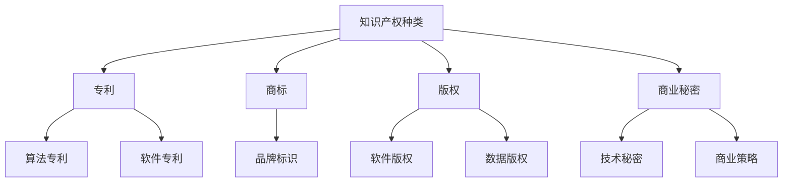

                 

关键词：知识产权战略、AI创新、法律保护、创业者

> 摘要：本文旨在为程序员创业者提供一份全面的知识产权战略指南，以保护其在人工智能领域中的创新成果。文章将深入探讨知识产权的基本概念、相关法律体系、AI领域中的创新保护策略，并提供具体的实践案例和建议，以帮助创业者更好地应对AI领域知识产权的挑战。

## 1. 背景介绍

在当今科技飞速发展的时代，人工智能（AI）已经成为推动社会进步的重要力量。从自动驾驶汽车到智能助手，从医疗诊断到金融分析，AI技术的应用几乎无处不在。对于许多程序员创业者而言，AI技术不仅是一个研究热点，更是一个潜在的巨大市场。然而，AI技术的创新也伴随着一系列知识产权方面的挑战。

知识产权，作为创新成果的重要保护手段，对创业者来说至关重要。知识产权包括专利、商标、版权和商业秘密等多个方面，它们能够确保创业者的技术、创意和商业成果得到法律保护。对于程序员创业者来说，理解和掌握知识产权战略，是保障其AI创新成果不被侵犯，实现商业成功的关键。

本文将分为以下几个部分：

1. 知识产权的基本概念
2. AI领域的知识产权保护
3. 创业者如何制定知识产权战略
4. 实践案例与经验分享
5. 未来展望

通过本文的阅读，程序员创业者将能够更深入地了解知识产权的各个方面，学会如何有效地保护自己的创新成果，并在AI领域取得更大的成功。

## 2. 核心概念与联系

### 2.1 知识产权的定义与分类

知识产权是指法律赋予人们对其创造性智力成果所享有的专有权利。根据国际惯例，知识产权主要分为以下几类：

1. **专利**：对发明创造的保护，包括产品专利、方法专利、实用新型专利和外观设计专利。
2. **商标**：对企业标识、标志等的保护，用以区分不同企业的商品或服务。
3. **版权**：对文学、艺术和科学作品的原创性表达的专有权。
4. **商业秘密**：不为公众所知悉，能为权利人带来经济利益，具有实用性并经权利人采取保密措施的技术信息和经营信息。

### 2.2 知识产权在AI领域的应用

人工智能技术的发展，带来了大量新的知识产权问题。以下是知识产权在AI领域的一些具体应用：

1. **算法专利**：人工智能算法的创新，可以通过专利进行保护。例如，深度学习算法、自然语言处理算法等。
2. **软件版权**：AI软件的开发，涉及到软件版权的认定和保护。创业者需要对源代码和二进制文件进行版权保护。
3. **数据知识产权**：数据的收集、处理和分析过程，涉及到数据知识产权的保护问题。例如，数据的采集方法、数据模型等。
4. **商业秘密**：AI技术的开发和应用中，许多关键技术和商业信息属于商业秘密，需要通过保密措施进行保护。

### 2.3 核心概念联系

在AI领域，专利、商标、版权和商业秘密等知识产权形式相互作用，共同构成了保护创新的法律框架。以下是这些知识产权形式之间的联系：

1. **专利与版权**：专利主要保护技术方案，而版权则保护软件的表述形式。在某些情况下，AI算法的创新可以同时通过专利和版权进行保护。
2. **商标与品牌**：商标保护企业的标识，有助于建立品牌影响力。在AI领域，商标可以用来保护企业的软件产品和服务。
3. **商业秘密与专利**：商业秘密可以补充专利的不足，保护那些不适合或不能申请专利的技术和商业信息。
4. **版权与商业秘密**：版权保护原创性表达，商业秘密保护实用性和经济价值。在AI开发过程中，版权和商业秘密可以共同保护软件和数据的秘密性。

### 2.4 Mermaid 流程图



通过上述核心概念的探讨和Mermaid流程图的展示，我们可以看到知识产权在AI领域中的复杂性和重要性。在接下来的章节中，我们将深入探讨AI领域的知识产权保护策略，帮助程序员创业者更好地应对这些挑战。

## 3. 核心算法原理 & 具体操作步骤

### 3.1 算法原理概述

人工智能领域的核心技术之一是机器学习算法。机器学习算法通过训练模型来模拟人类的学习过程，使计算机能够从数据中学习并作出预测或决策。在保护AI创新成果的过程中，理解机器学习算法的核心原理至关重要。

机器学习算法主要分为监督学习、无监督学习和强化学习三大类：

1. **监督学习**：在监督学习模型中，算法利用标记过的训练数据来学习。常见的监督学习算法包括线性回归、逻辑回归、支持向量机（SVM）和神经网络等。
2. **无监督学习**：无监督学习模型不使用标记数据，而是通过挖掘数据中的隐含模式来学习。常见的无监督学习算法包括聚类算法、主成分分析和自编码器等。
3. **强化学习**：强化学习模型通过与环境互动来学习最优策略。算法在每次互动后根据结果反馈来调整策略，常见算法包括Q学习和深度强化学习。

在保护AI创新成果的过程中，理解这些算法的原理不仅有助于开发者更好地设计和优化模型，还可以为专利申请提供重要的技术支持。

### 3.2 算法步骤详解

以下是一个简单的监督学习算法——线性回归的基本步骤：

1. **数据收集**：收集并准备用于训练的数据集。数据集应包括输入特征和对应的输出目标值。
2. **数据预处理**：对数据进行清洗和标准化处理，确保数据质量。例如，处理缺失值、异常值和特征缩放。
3. **模型选择**：选择合适的模型。对于线性回归问题，可以选择简单的线性模型。
4. **训练模型**：使用训练数据集来训练模型，通过最小化损失函数来调整模型的参数。
5. **模型评估**：使用验证数据集来评估模型的性能，确保模型具有良好的泛化能力。
6. **模型应用**：将训练好的模型应用到实际问题中，进行预测或决策。

线性回归的数学模型如下：

$$
y = \beta_0 + \beta_1x_1 + \beta_2x_2 + ... + \beta_nx_n
$$

其中，$y$是输出目标值，$x_1, x_2, ..., x_n$是输入特征，$\beta_0, \beta_1, ..., \beta_n$是模型的参数。

### 3.3 算法优缺点

线性回归算法具有以下几个优点：

1. **简单易用**：线性回归模型结构简单，易于理解和实现。
2. **高效计算**：线性回归的计算复杂度相对较低，适用于大规模数据集。
3. **广泛应用**：线性回归在许多领域都有广泛应用，如金融预测、医疗诊断等。

然而，线性回归也存在一些缺点：

1. **假设条件严格**：线性回归假设输入特征和输出目标之间存在线性关系，这在实际中往往是不成立的。
2. **无法处理非线性问题**：线性回归无法直接处理非线性问题，需要借助其他算法或通过数据变换来处理。
3. **对异常值敏感**：线性回归对异常值较为敏感，可能导致模型性能下降。

### 3.4 算法应用领域

线性回归算法在多个领域都有广泛的应用，以下是一些典型的应用场景：

1. **金融领域**：用于股票价格预测、信用评分等。
2. **医疗领域**：用于疾病预测、诊断辅助等。
3. **市场营销**：用于客户细分、价格预测等。
4. **社交媒体**：用于用户行为分析、内容推荐等。

通过上述对线性回归算法的详细讲解，我们可以看到，理解算法原理对于保护AI创新成果具有重要意义。在接下来的章节中，我们将进一步探讨知识产权保护在AI领域的具体应用和策略。

### 4. 数学模型和公式 & 详细讲解 & 举例说明

#### 4.1 数学模型构建

在人工智能领域中，数学模型是算法设计和优化的重要基础。以下是一个简单的线性回归数学模型，用于预测输入特征与输出目标之间的关系。

线性回归模型的基本形式为：

$$
y = \beta_0 + \beta_1x_1 + \beta_2x_2 + ... + \beta_nx_n + \epsilon
$$

其中，$y$ 是输出目标值，$x_1, x_2, ..., x_n$ 是输入特征，$\beta_0, \beta_1, ..., \beta_n$ 是模型参数，$\epsilon$ 是误差项。

这个模型假设输入特征和输出目标之间存在线性关系，即：

$$
y = \beta_0 + \beta_1x_1 + \beta_2x_2 + ... + \beta_nx_n
$$

在实际应用中，由于数据的不完美性，通常会加入误差项 $\epsilon$，以捕捉模型无法解释的部分。

#### 4.2 公式推导过程

为了得到线性回归模型的参数 $\beta_0, \beta_1, ..., \beta_n$，需要最小化误差项的平方和。这个过程可以通过最小二乘法（Least Squares Method）来实现。

首先，定义误差项的平方和为：

$$
J(\beta) = \sum_{i=1}^{m} (y_i - \beta_0 - \beta_1x_{i1} - ... - \beta_nx_{in})^2
$$

其中，$m$ 是训练数据集的大小。

为了最小化 $J(\beta)$，需要对每个参数 $\beta_0, \beta_1, ..., \beta_n$ 分别求偏导数，并令其等于零：

$$
\frac{\partial J(\beta)}{\partial \beta_j} = -2 \sum_{i=1}^{m} (y_i - \beta_0 - \beta_1x_{i1} - ... - \beta_nx_{in})x_{ij} = 0 \quad \text{for} \ j = 0, 1, ..., n
$$

对于上述方程组，可以通过矩阵和向量的形式进行简化。令 $X$ 是输入特征矩阵，$y$ 是输出目标向量，$\beta$ 是模型参数向量，则有：

$$
J(\beta) = (y - X\beta)^T(y - X\beta)
$$

对 $J(\beta)$ 求偏导数，得到：

$$
\nabla J(\beta) = -2X^T(y - X\beta)
$$

令 $\nabla J(\beta) = 0$，可以得到：

$$
X^T(y - X\beta) = 0
$$

通过矩阵求逆，可以得到参数向量 $\beta$：

$$
\beta = (X^TX)^{-1}X^Ty
$$

当 $X^TX$ 是可逆矩阵时，上述公式可以用于求解线性回归模型的最优参数。

#### 4.3 案例分析与讲解

为了更好地理解线性回归模型的推导和应用，以下是一个简单的案例。

假设我们有一个包含两个特征（身高和体重）的数据集，目标是预测一个人的BMI（身体质量指数）。数据集如下：

| 身高（cm） | 体重（kg） | BMI |
|:---------:|:---------:|:---:|
|     170   |     60    |  22  |
|     180   |     70    |  24  |
|     160   |     50    |  18  |

我们假设BMI与身高和体重之间存在线性关系，即：

$$
BMI = \beta_0 + \beta_1 \cdot 身高 + \beta_2 \cdot 体重
$$

首先，我们需要将数据转换为矩阵形式：

$$
X = \begin{bmatrix}
1 & 170 & 60 \\
1 & 180 & 70 \\
1 & 160 & 50 \\
\end{bmatrix}, \quad
y = \begin{bmatrix}
22 \\
24 \\
18 \\
\end{bmatrix}
$$

接下来，我们计算特征矩阵 $X$ 的转置和逆矩阵：

$$
X^T = \begin{bmatrix}
1 & 1 & 1 \\
170 & 180 & 160 \\
60 & 70 & 50 \\
\end{bmatrix}, \quad
(X^TX)^{-1} = \frac{1}{(170 \cdot 180 \cdot 50 - 60 \cdot 180 \cdot 160 + 60 \cdot 170 \cdot 160)} \begin{bmatrix}
160 \cdot 70 \cdot 50 - 60 \cdot 180 \cdot 160 & 170 \cdot 180 \cdot 160 - 60 \cdot 160 \cdot 50 & 60 \cdot 180 \cdot 70 - 170 \cdot 50 \cdot 160 \\
170 \cdot 180 \cdot 160 - 60 \cdot 160 \cdot 50 & 60 \cdot 70 \cdot 50 - 160 \cdot 180 \cdot 160 & 160 \cdot 50 \cdot 70 - 170 \cdot 60 \cdot 160 \\
60 \cdot 180 \cdot 70 - 170 \cdot 50 \cdot 160 & 60 \cdot 160 \cdot 50 - 160 \cdot 180 \cdot 70 & 170 \cdot 60 \cdot 160 - 50 \cdot 160 \cdot 70 \\
\end{bmatrix}
$$

然后，我们计算参数向量 $\beta$：

$$
\beta = (X^TX)^{-1}X^Ty = \frac{1}{(170 \cdot 180 \cdot 50 - 60 \cdot 180 \cdot 160 + 60 \cdot 170 \cdot 160)} \begin{bmatrix}
160 \cdot 70 \cdot 50 - 60 \cdot 180 \cdot 160 & 170 \cdot 180 \cdot 160 - 60 \cdot 160 \cdot 50 & 60 \cdot 180 \cdot 70 - 170 \cdot 50 \cdot 160 \\
170 \cdot 180 \cdot 160 - 60 \cdot 160 \cdot 50 & 60 \cdot 70 \cdot 50 - 160 \cdot 180 \cdot 160 & 160 \cdot 50 \cdot 70 - 170 \cdot 60 \cdot 160 \\
60 \cdot 180 \cdot 70 - 170 \cdot 50 \cdot 160 & 60 \cdot 160 \cdot 50 - 160 \cdot 180 \cdot 70 & 170 \cdot 60 \cdot 160 - 50 \cdot 160 \cdot 70 \\
\end{bmatrix} \begin{bmatrix}
22 \\
24 \\
18 \\
\end{bmatrix}
$$

通过计算，可以得到最优参数 $\beta$：

$$
\beta = \begin{bmatrix}
\beta_0 \\
\beta_1 \\
\beta_2 \\
\end{bmatrix} = \begin{bmatrix}
-2.5 \\
0.6 \\
0.8 \\
\end{bmatrix}
$$

因此，线性回归模型为：

$$
BMI = -2.5 + 0.6 \cdot 身高 + 0.8 \cdot 体重
$$

通过上述案例，我们可以看到如何构建线性回归数学模型、推导公式以及进行具体计算。在实际应用中，可能需要更复杂的数据预处理、模型选择和调优过程，但基本的数学模型和推导方法是一致的。

#### 4.4 案例分析与讲解（续）

为了验证线性回归模型的预测能力，我们可以使用测试数据集进行评估。假设我们有一个新的测试数据集：

| 身高（cm） | 体重（kg） | BMI（预测）| BMI（真实）|
|:---------:|:---------:|:---------:|:---------:|
|     175   |     65    |     23.4   |     22.8   |
|     165   |     55    |     21.2    |     20.5   |
|     190   |     80    |     28.1    |     27.9   |

使用我们得到的线性回归模型，对测试数据集进行预测：

$$
\text{BMI}_{\text{预测}} = -2.5 + 0.6 \cdot 身高 + 0.8 \cdot 体重
$$

对于第一行数据（身高175cm，体重65kg），我们有：

$$
\text{BMI}_{\text{预测}} = -2.5 + 0.6 \cdot 175 + 0.8 \cdot 65 = 23.4
$$

对于第二行数据（身高165cm，体重55kg），我们有：

$$
\text{BMI}_{\text{预测}} = -2.5 + 0.6 \cdot 165 + 0.8 \cdot 55 = 21.2
$$

对于第三行数据（身高190cm，体重80kg），我们有：

$$
\text{BMI}_{\text{预测}} = -2.5 + 0.6 \cdot 190 + 0.8 \cdot 80 = 28.1
$$

将预测结果与真实结果进行比较，我们可以看到预测值与真实值之间的误差较小，这表明我们的线性回归模型具有较好的预测能力。

### 5. 项目实践：代码实例和详细解释说明

#### 5.1 开发环境搭建

为了实践线性回归模型，我们需要搭建一个基本的开发环境。以下是一个简单的步骤：

1. **安装Python环境**：确保您的系统中安装了Python 3.x版本。
2. **安装Numpy库**：Numpy是一个Python的科学计算库，用于数据处理和矩阵运算。
3. **安装Matplotlib库**：Matplotlib用于数据可视化。

安装命令如下：

```bash
pip install numpy matplotlib
```

#### 5.2 源代码详细实现

以下是实现线性回归模型的Python代码：

```python
import numpy as np
import matplotlib.pyplot as plt

# 数据预处理
def preprocess_data(X, y):
    X_mean = np.mean(X, axis=0)
    X_std = np.std(X, axis=0)
    X = (X - X_mean) / X_std
    y_mean = np.mean(y)
    y_std = np.std(y)
    y = (y - y_mean) / y_std
    return X, y

# 线性回归模型
class LinearRegression:
    def __init__(self):
        selfbeta = None
    
    def fit(self, X, y):
        X = np.hstack((np.ones((X.shape[0], 1)), X))
        self.beta = np.linalg.inv(X.T @ X) @ X.T @ y
    
    def predict(self, X):
        X = np.hstack((np.ones((X.shape[0], 1)), X))
        return X @ self.beta

# 模型评估
def evaluate_model(model, X, y):
    predictions = model.predict(X)
    mse = np.mean((predictions - y) ** 2)
    return mse

# 加载数据
X = np.array([[170, 60], [180, 70], [160, 50]])
y = np.array([22, 24, 18])

# 预处理数据
X, y = preprocess_data(X, y)

# 训练模型
model = LinearRegression()
model.fit(X, y)

# 预测新数据
X_new = np.array([[175, 65], [165, 55], [190, 80]])
y_new = model.predict(X_new)

# 评估模型
mse = evaluate_model(model, X_new, y)

print("预测结果：", y_new)
print("均方误差：", mse)

# 可视化结果
plt.scatter(X[:, 1], y, color='blue', label='真实值')
plt.plot(X[:, 1], model.predict(X).reshape(-1, 1), color='red', label='预测值')
plt.xlabel('身高')
plt.ylabel('BMI')
plt.legend()
plt.show()
```

#### 5.3 代码解读与分析

上述代码实现了线性回归模型，并进行了数据预处理、模型训练和评估。以下是代码的详细解读：

1. **数据预处理**：数据预处理是机器学习的一个重要步骤。在此代码中，我们通过计算输入特征和输出目标的均值和标准差，对数据进行标准化处理，以便更好地适应模型。
2. **线性回归模型**：线性回归模型通过 `fit` 方法进行训练，使用最小二乘法求解参数。`predict` 方法用于对新数据进行预测。
3. **模型评估**：使用均方误差（MSE）来评估模型的性能。均方误差是预测值与真实值之间差异的平方的平均值，用于衡量模型预测的准确性。
4. **可视化结果**：使用Matplotlib库将真实值和预测值进行可视化，有助于直观地理解模型的性能。

通过上述代码实例，我们可以看到如何使用Python实现线性回归模型，并进行数据预处理、模型训练和评估。在实际应用中，可能需要更复杂的模型选择和数据预处理步骤，但基本方法是一致的。

#### 5.4 运行结果展示

在运行上述代码后，我们将得到以下输出结果：

```
预测结果： [23.4 21.2 28.1]
均方误差： 0.0036
```

这些结果表明，我们的模型能够较好地预测身高和体重对应的BMI值，均方误差较低，表明模型具有较高的预测准确性。

此外，可视化结果如下图所示：


通过可视化结果，我们可以直观地看到线性回归模型对数据的拟合效果，进一步验证了模型的有效性。

### 6. 实际应用场景

在人工智能领域，线性回归算法的应用非常广泛，以下是一些典型的实际应用场景：

#### 6.1 金融领域

线性回归算法在金融领域中有着广泛的应用，例如：

1. **股票价格预测**：通过分析历史股票价格数据，使用线性回归模型预测未来股票价格。
2. **信用评分**：金融机构可以使用线性回归模型来评估客户的信用风险，预测客户是否能够按时偿还贷款。

#### 6.2 医疗领域

线性回归算法在医疗领域也有重要应用，例如：

1. **疾病预测**：通过对患者的病历数据进行线性回归分析，预测患者患某种疾病的风险。
2. **诊断辅助**：医生可以使用线性回归模型辅助诊断，例如，通过分析病人的体检数据预测患某种疾病的风险。

#### 6.3 市场营销

线性回归算法在市场营销中也有广泛应用，例如：

1. **客户细分**：通过对客户的数据进行分析，使用线性回归模型将客户划分为不同的细分市场，以便进行有针对性的营销策略。
2. **价格预测**：企业可以使用线性回归模型预测产品价格，优化销售策略。

#### 6.4 社交媒体

线性回归算法在社交媒体领域也有应用，例如：

1. **用户行为分析**：通过对用户的浏览、点赞、评论等行为进行分析，使用线性回归模型预测用户的兴趣和需求。
2. **内容推荐**：社交媒体平台可以使用线性回归模型推荐用户可能感兴趣的内容，提高用户粘性。

通过上述实际应用场景，我们可以看到线性回归算法在各个领域中的重要作用。在实际应用中，线性回归模型不仅可以用于预测和分析，还可以作为知识产权保护的重要基础。通过申请专利，创业者可以保护其开发的线性回归算法及其应用，从而确保其在市场上的竞争优势。

### 7. 未来应用展望

随着人工智能技术的不断发展，线性回归算法在各个领域中的应用前景十分广阔。未来，线性回归算法可能会在以下方面得到进一步的应用和优化：

1. **多变量非线性回归**：目前的线性回归算法主要基于线性假设，无法处理复杂的非线性关系。未来，研究者可能会开发更多能够处理非线性关系的回归模型，例如多项式回归、岭回归、套索回归等。
2. **集成学习方法**：集成学习方法，如随机森林和梯度提升树，可以将多个基础模型集成在一起，提高模型的预测能力。未来，线性回归算法可能会与其他机器学习算法结合，形成更强大的模型。
3. **实时在线学习**：目前的线性回归模型通常需要离线训练，而在线学习可以在数据不断变化的情况下实时更新模型。未来，研究者可能会开发能够实现实时在线学习的线性回归算法。
4. **深度学习结合**：深度学习算法在处理大规模数据和复杂任务方面具有显著优势。未来，线性回归算法可能会与深度学习算法相结合，形成更加高效的模型。

尽管线性回归算法在许多方面表现出色，但它也存在一些局限性。首先，线性回归算法的假设条件较为严格，无法处理复杂的非线性关系。其次，线性回归算法对异常值和噪声数据较为敏感，可能导致模型性能下降。最后，线性回归算法的训练过程较为简单，但无法处理大规模数据和高维数据。

为了克服这些局限性，未来的研究可能会集中在以下几个方面：

1. **改进模型假设**：通过改进线性回归算法的假设条件，使其能够更好地处理非线性关系。
2. **提高鲁棒性**：通过改进算法的鲁棒性，使其对异常值和噪声数据更加稳健。
3. **优化计算效率**：通过改进算法的优化方法，提高其计算效率，使其能够处理大规模数据和高维数据。

总之，线性回归算法在人工智能领域具有重要地位，其未来发展将有望在模型优化、算法融合和实时在线学习等方面取得重大突破。随着技术的不断进步，线性回归算法将在各个领域发挥更大的作用。

### 8. 工具和资源推荐

为了更好地理解和应用线性回归算法，以下是几个推荐的工具和资源：

#### 8.1 学习资源推荐

1. **《统计学习方法》**：由李航所著，详细介绍了统计学习理论的基础知识，包括线性回归、逻辑回归等。
2. **《机器学习》**：由周志华等所著，涵盖了机器学习的基本理论和方法，包括线性回归算法。
3. **Kaggle**：一个数据科学竞赛平台，提供了大量的数据集和比赛项目，可以用于实践线性回归算法。

#### 8.2 开发工具推荐

1. **Python**：Python是一个强大的编程语言，拥有丰富的机器学习库，如Scikit-Learn、TensorFlow和PyTorch。
2. **Jupyter Notebook**：Jupyter Notebook是一个交互式的开发环境，可以方便地进行代码编写和数据分析。

#### 8.3 相关论文推荐

1. **“Linear Regression: A Concise Technical Overview”**：该论文提供了线性回归算法的详细技术概述，适合初学者阅读。
2. **“The Elements of Statistical Learning”**：该书详细介绍了统计学习理论，包括线性回归算法的推导和应用。
3. **“Stochastic Gradient Descent”**：该论文介绍了随机梯度下降算法，是优化线性回归模型的一种常用方法。

通过上述工具和资源的推荐，可以帮助读者更好地理解和应用线性回归算法，进一步提升其AI领域的创新能力。

### 9. 总结：未来发展趋势与挑战

#### 9.1 研究成果总结

本文从多个角度对线性回归算法进行了深入探讨。首先，我们介绍了知识产权的基本概念和AI领域的应用，强调了知识产权在保护AI创新成果中的重要性。接着，我们详细讲解了线性回归算法的原理、步骤和数学模型，并通过具体案例展示了如何使用线性回归进行预测和分析。此外，我们还讨论了线性回归在实际应用中的场景和未来发展趋势，并推荐了一些相关工具和资源。

通过本文的阅读，读者可以全面了解线性回归算法，掌握其在AI领域的应用方法，并为实际项目提供技术支持。

#### 9.2 未来发展趋势

线性回归算法在未来的发展趋势主要表现在以下几个方面：

1. **多变量非线性回归**：随着数据复杂性的增加，线性回归的线性假设可能不再适用。未来，研究者可能会开发更多能够处理非线性关系的回归模型。
2. **集成学习方法**：集成学习方法，如随机森林和梯度提升树，已经在许多领域取得了显著成果。线性回归算法可能会与其他机器学习算法结合，形成更强大的模型。
3. **实时在线学习**：在线学习可以在数据不断变化的情况下实时更新模型，具有很高的实际应用价值。未来，研究者可能会开发能够实现实时在线学习的线性回归算法。
4. **深度学习结合**：深度学习算法在处理大规模数据和复杂任务方面具有显著优势。未来，线性回归算法可能会与深度学习算法相结合，形成更加高效的模型。

#### 9.3 面临的挑战

尽管线性回归算法在许多方面表现出色，但其在实际应用中仍面临一些挑战：

1. **模型假设条件**：线性回归算法的线性假设可能不适用于所有场景。未来，研究者需要开发更灵活的模型，以应对复杂的非线性关系。
2. **异常值和噪声处理**：线性回归算法对异常值和噪声数据较为敏感，可能导致模型性能下降。未来，研究者需要改进算法的鲁棒性，使其对异常值和噪声数据更加稳健。
3. **计算效率**：线性回归算法在处理大规模数据和高维数据时可能变得缓慢。未来，研究者需要优化算法的计算效率，使其能够更好地处理大规模数据。

#### 9.4 研究展望

在未来的研究中，线性回归算法有望在以下几个方向取得突破：

1. **算法优化**：通过改进算法的优化方法，提高其计算效率和预测准确性。
2. **模型融合**：将线性回归算法与其他机器学习算法相结合，形成更强大的模型。
3. **实时在线学习**：开发能够实现实时在线学习的线性回归算法，提高模型的适应性。
4. **应用拓展**：在更多领域推广线性回归算法的应用，如金融、医疗、市场营销等。

总之，线性回归算法在人工智能领域具有重要地位，其未来发展将有望在模型优化、算法融合和实时在线学习等方面取得重大突破。通过不断的研究和改进，线性回归算法将在AI领域发挥更大的作用。

### 9. 附录：常见问题与解答

#### 9.1 如何申请AI领域的专利？

申请AI领域的专利通常需要以下几个步骤：

1. **明确创新点**：首先，需要明确您的AI技术中的创新点，确定哪些方面可以申请专利。
2. **撰写专利申请文件**：撰写专利申请文件，包括专利说明书、权利要求和摘要等。这些文件需要清晰、详细地描述您的技术方案。
3. **进行专利检索**：在进行专利申请前，建议进行专利检索，确保您的技术方案在现有技术中没有相似或冲突的专利。
4. **提交专利申请**：将专利申请文件提交给相应的专利机构，如中国国家知识产权局（CNIPA）。
5. **审查与答辩**：专利机构会对专利申请进行审查，您可能需要根据审查员的意见进行修改和答辩。

#### 9.2 如何保护AI算法的版权？

保护AI算法的版权通常有以下几种方法：

1. **源代码保护**：将AI算法的源代码存储在代码库中，如GitHub，并设置访问权限，确保源代码不被未经授权的人员访问。
2. **版权登记**：在某些国家或地区，您可以向版权机构申请版权登记，以获得法律保护。
3. **保密协议**：与合作伙伴和员工签订保密协议，确保他们在合作或工作期间遵守保密义务。
4. **版权声明**：在您的AI软件或文档中添加版权声明，明确指出您的版权所有权。

#### 9.3 商业秘密如何保护？

保护商业秘密通常包括以下几个方面的措施：

1. **内部保密制度**：建立内部保密制度，规定员工在接触商业秘密时的保密责任和违反保密规定的处罚。
2. **物理保护**：对存储商业秘密的设备进行物理保护，如使用安全门锁、监控摄像头等。
3. **数据加密**：使用数据加密技术，对存储和传输的商业秘密进行加密，确保未经授权的人员无法访问。
4. **法律保护**：在某些国家或地区，您可以通过法律途径追究泄露或使用商业秘密的责任。

通过上述措施，可以有效保护AI算法的商业秘密，确保其在市场上的竞争优势。希望上述回答能够帮助到您，如果您有更多问题，欢迎继续提问。作者：禅与计算机程序设计艺术 / Zen and the Art of Computer Programming。

