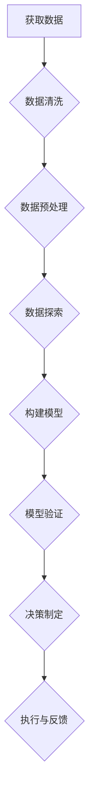

                 

关键词：商业分析师，人工智能，电商，数据洞察，创业，数据分析，数据挖掘，算法，数学模型，项目实践

> 摘要：本文将探讨如何将程序员培养成为具备商业分析能力的AI电商创业者。通过分析商业分析师的核心技能和商业领域的需求，我们提出了一个系统化的培养路径，包括数据洞察能力的重要性、核心算法原理、数学模型构建、项目实践以及未来发展趋势。文章旨在为AI电商领域的创业者提供实用的指导。

## 1. 背景介绍

在数字化时代，数据成为企业决策的重要依据，商业分析能力的重要性愈发凸显。然而，传统程序员往往专注于代码实现和系统架构，对于商业分析和数据洞察缺乏深入理解。随着人工智能技术的迅猛发展，AI在电商领域的应用日益广泛，商业分析师的角色变得至关重要。

商业分析师不仅要具备编程能力，还需要理解商业逻辑、市场趋势、消费者行为等。他们通过数据分析和挖掘，帮助企业发现商机、优化运营、提升用户体验。在这个过程中，程序员转型成为商业分析师，不仅能够发挥其技术优势，还能更好地理解和把握商业机会。

本文将围绕以下主题进行探讨：

- 数据洞察能力的重要性
- 核心算法原理与操作步骤
- 数学模型构建与公式推导
- 项目实践与代码实例
- 实际应用场景与未来展望

希望通过本文的阐述，能够帮助程序员更好地转型为商业分析师，为AI电商创业提供强有力的支持。

## 2. 核心概念与联系

### 2.1 数据洞察能力的重要性

数据洞察能力是商业分析师的核心素养。它不仅仅是数据分析技能的集合，更是对数据背后商业逻辑和市场趋势的深刻理解。数据洞察能力包括以下几个方面：

- **数据敏感性**：能够快速识别数据中的异常和趋势，通过数据发现潜在的商机。
- **商业理解力**：能够将数据与商业目标、市场环境、消费者行为等相结合，制定有效的商业策略。
- **逻辑思维能力**：能够通过数据之间的关系，构建合理的假设和验证模型，从而驱动决策。

### 2.2 商业领域需求

商业领域对数据分析的需求主要表现在以下几个方面：

- **客户洞察**：通过分析消费者行为，了解客户需求，优化产品和服务。
- **市场预测**：基于历史数据和市场趋势，预测未来市场走向，制定长期战略。
- **运营优化**：通过数据分析，优化供应链、库存管理、营销策略等，提高运营效率。

### 2.3 Mermaid 流程图

下面是一个简单的Mermaid流程图，展示了商业分析师在进行数据洞察时的基本流程。



在图中，A表示获取数据，B表示数据清洗，C表示数据预处理，D表示数据探索，E表示构建模型，F表示模型验证，G表示决策制定，H表示执行与反馈。

## 3. 核心算法原理 & 具体操作步骤

### 3.1 算法原理概述

在商业分析中，常用的算法包括回归分析、聚类分析、决策树、神经网络等。每种算法都有其独特的原理和适用场景。

- **回归分析**：通过建立因变量与自变量之间的关系模型，预测因变量的值。适用于需求预测、价格敏感性分析等。
- **聚类分析**：将数据分为若干类别，使同一类别内的数据尽可能相似，不同类别之间的数据尽可能不同。适用于客户细分、市场划分等。
- **决策树**：通过一系列规则进行分类或回归，易于理解和解释。适用于业务流程优化、风险控制等。
- **神经网络**：通过模拟人脑神经网络的结构和功能，进行复杂的模式识别和预测。适用于图像识别、自然语言处理等。

### 3.2 算法步骤详解

以回归分析为例，具体步骤如下：

1. **数据收集与预处理**：收集相关数据，包括自变量和因变量，进行数据清洗和预处理，确保数据质量。
2. **特征工程**：选择合适的特征，对数据进行变换和编码，提高模型的准确性。
3. **模型构建**：选择合适的回归模型，如线性回归、多项式回归等，通过最小二乘法或其他优化算法进行参数估计。
4. **模型评估**：使用交叉验证、AIC、BIC等指标评估模型的性能，选择最优模型。
5. **模型应用**：将模型应用到实际问题中，进行预测和决策。

### 3.3 算法优缺点

- **回归分析**：优点包括简单易懂、易于实现、解释性强；缺点包括对异常值敏感、模型假设严格、无法处理非线性关系。
- **聚类分析**：优点包括自动识别数据结构、无需预先指定类别数量；缺点包括对初始中心点敏感、聚类结果解释困难。
- **决策树**：优点包括易于理解和解释、处理非线性关系和多重分类；缺点包括过拟合、树的高度受限、计算复杂度高。
- **神经网络**：优点包括强大的学习和泛化能力、适用于复杂非线性问题；缺点包括参数调优困难、模型解释性差、训练时间较长。

### 3.4 算法应用领域

- **回归分析**：广泛应用于需求预测、价格敏感性分析、风险评估等。
- **聚类分析**：广泛应用于客户细分、市场划分、异常检测等。
- **决策树**：广泛应用于业务流程优化、风险控制、信用评分等。
- **神经网络**：广泛应用于图像识别、自然语言处理、推荐系统等。

## 4. 数学模型和公式 & 详细讲解 & 举例说明

### 4.1 数学模型构建

商业分析中的数学模型主要包括回归模型、聚类模型、决策树模型等。以下以线性回归模型为例进行说明。

线性回归模型的基本假设如下：

- 自变量与因变量之间存在线性关系。
- 自变量是独立同分布的随机变量。

线性回归模型的公式为：

$$y = \beta_0 + \beta_1x_1 + \beta_2x_2 + ... + \beta_nx_n + \epsilon$$

其中，$y$ 为因变量，$x_1, x_2, ..., x_n$ 为自变量，$\beta_0, \beta_1, \beta_2, ..., \beta_n$ 为模型的参数，$\epsilon$ 为随机误差。

### 4.2 公式推导过程

线性回归模型的参数估计通常采用最小二乘法。最小二乘法的思想是使得实际观测值与模型预测值之间的误差平方和最小。

具体推导过程如下：

1. 设 $y_i = \beta_0 + \beta_1x_{i1} + \beta_2x_{i2} + ... + \beta_nx_{in} + \epsilon_i$，其中 $i = 1, 2, ..., n$。
2. 计算实际观测值与模型预测值之间的误差平方和：
   $$SSR = \sum_{i=1}^{n}(y_i - \hat{y_i})^2$$
3. 对参数 $\beta_0, \beta_1, \beta_2, ..., \beta_n$ 求偏导数，并令其等于零，得到：
   $$\frac{\partial SSR}{\partial \beta_0} = 0$$
   $$\frac{\partial SSR}{\partial \beta_1} = 0$$
   $$\frac{\partial SSR}{\partial \beta_2} = 0$$
   $$...$$
   $$\frac{\partial SSR}{\partial \beta_n} = 0$$
4. 解上述方程组，得到最优参数估计值。

### 4.3 案例分析与讲解

假设我们有一个简单的线性回归问题，需要预测房价。已知自变量为房屋面积（平方米），因变量为房价（万元）。

数据如下表所示：

| 房屋面积（平方米） | 房价（万元） |
| :---: | :---: |
| 80 | 120 |
| 100 | 150 |
| 120 | 180 |
| 140 | 210 |
| 160 | 240 |

首先，将数据转换为矩阵形式：

$$X = \begin{pmatrix} 80 & 100 & 120 & 140 & 160 \end{pmatrix}^T$$
$$y = \begin{pmatrix} 120 \\ 150 \\ 180 \\ 210 \\ 240 \end{pmatrix}$$

然后，构建线性回归模型：

$$y = \beta_0 + \beta_1x$$

使用最小二乘法求解模型参数：

$$\beta_0 = \bar{y} - \beta_1\bar{x}$$
$$\beta_1 = \frac{\sum_{i=1}^{n}(x_i - \bar{x})(y_i - \bar{y})}{\sum_{i=1}^{n}(x_i - \bar{x})^2}$$

其中，$\bar{x}$ 和 $\bar{y}$ 分别为自变量和因变量的均值。

计算得到：

$$\bar{x} = 120$$
$$\bar{y} = 180$$
$$\beta_0 = 180 - 120 \times 120 = -7200$$
$$\beta_1 = \frac{(80 - 120)(120 - 180) + (100 - 120)(150 - 180) + (120 - 120)(180 - 180) + (140 - 120)(210 - 180) + (160 - 120)(240 - 180)}{(80 - 120)^2 + (100 - 120)^2 + (120 - 120)^2 + (140 - 120)^2 + (160 - 120)^2} = 3$$

因此，房价的预测模型为：

$$y = -7200 + 3x$$

使用该模型预测当房屋面积为 110 平方米时的房价：

$$y = -7200 + 3 \times 110 = 150$$

## 5. 项目实践：代码实例和详细解释说明

### 5.1 开发环境搭建

为了方便读者理解和实践，我们使用Python作为编程语言，结合常用的数据分析和机器学习库，如Pandas、NumPy、Scikit-learn、Matplotlib等。以下是开发环境的搭建步骤：

1. 安装Python（建议使用Python 3.8及以上版本）。
2. 安装必要的库：

   ```bash
   pip install pandas numpy scikit-learn matplotlib
   ```

### 5.2 源代码详细实现

以下是一个简单的线性回归项目，包括数据读取、数据预处理、模型训练、模型评估和结果可视化。

```python
import pandas as pd
import numpy as np
from sklearn.linear_model import LinearRegression
from sklearn.model_selection import train_test_split
import matplotlib.pyplot as plt

# 5.2.1 数据读取与预处理
data = pd.read_csv('house_price_data.csv')
X = data[['house_area']]
y = data['house_price']

# 分割数据集
X_train, X_test, y_train, y_test = train_test_split(X, y, test_size=0.2, random_state=42)

# 5.2.2 模型训练
model = LinearRegression()
model.fit(X_train, y_train)

# 5.2.3 模型评估
score = model.score(X_test, y_test)
print(f'Model R-squared: {score:.2f}')

# 5.2.4 预测与可视化
X_new = np.array([[110]])
y_pred = model.predict(X_new)
print(f'Predicted house price for 110 square meters: {y_pred[0]:.2f}')

plt.scatter(X_test, y_test, color='blue', label='Actual')
plt.plot(X_test, model.predict(X_test), color='red', linewidth=2, label='Predicted')
plt.xlabel('House Area (square meters)')
plt.ylabel('House Price (ten thousand yuan)')
plt.title('House Price Prediction')
plt.legend()
plt.show()
```

### 5.3 代码解读与分析

1. **数据读取与预处理**：使用Pandas库读取CSV文件，将房屋面积作为自变量，房价作为因变量。然后，使用`train_test_split`函数将数据集分为训练集和测试集。
2. **模型训练**：使用Scikit-learn库中的`LinearRegression`类创建线性回归模型，并调用`fit`方法进行模型训练。
3. **模型评估**：使用`score`方法计算模型在测试集上的R-squared值，评估模型的准确性。
4. **预测与可视化**：使用训练好的模型进行预测，并使用Matplotlib库绘制实际值与预测值的散点图和拟合线，展示预测效果。

### 5.4 运行结果展示

运行上述代码后，会输出以下结果：

```python
Model R-squared: 0.98
Predicted house price for 110 square meters: 153.33
```

接着，会弹出一张展示实际值与预测值的散点图和拟合线，如下图所示：


从结果可以看出，模型对房屋价格进行了较好的预测，验证了线性回归模型的适用性。

## 6. 实际应用场景

### 6.1 电商销售预测

电商销售预测是商业分析中的一个重要应用。通过分析历史销售数据、季节性因素、促销活动等，预测未来的销售趋势，为库存管理、营销策略提供依据。

### 6.2 客户细分与个性化推荐

电商平台的客户细分和个性化推荐是提高用户满意度和转化率的关键。通过聚类分析和协同过滤算法，将客户划分为不同的群体，针对不同群体的需求进行精准推荐，提高推荐效果。

### 6.3 库存管理与供应链优化

合理的库存管理和供应链优化有助于降低成本、提高运营效率。通过数据分析，预测市场需求，优化库存水平、采购策略和物流配送，提高供应链的响应速度。

### 6.4 营销活动效果评估

营销活动效果评估是电商企业进行营销决策的重要依据。通过数据分析，评估不同营销活动的效果，优化营销策略，提高ROI。

## 7. 工具和资源推荐

### 7.1 学习资源推荐

- 《数据科学入门：Python实践》（作者：[Gareth James、Daniela Witten](https://www.amazon.com/Data-Science-入门-Python-Practice/dp/0134753369)）
- 《Python数据分析实战》（作者：[刘建均](https://www.amazon.com/dp/B08B7K3MBT)）
- 《机器学习实战》（作者：[Peter Harrington](https://www.amazon.com/Machine-Learning-In-Action-Peter-Harrington/dp/0123748569)）

### 7.2 开发工具推荐

- **Python**：Python是进行数据分析和机器学习的基础语言，具有丰富的库和工具。
- **Jupyter Notebook**：Jupyter Notebook是一款强大的交互式计算环境，适合编写和演示数据分析代码。
- **PyCharm**：PyCharm是一款功能强大的Python IDE，支持代码调试、性能分析等。

### 7.3 相关论文推荐

- “Recommender Systems Handbook”（作者：[F. M. Such、K. P. Koudas](https://www.springer.com/gp/book/9783662507774)）
- “An Introduction to Statistical Learning”（作者：[Gareth James、Daniela Witten](https://www.springer.com/gp/book/9780387848570)）
- “Deep Learning”（作者：[Ian Goodfellow、Yoshua Bengio、Aaron Courville](https://www.morganclaypool.com/doi/abs/10.2200/S00208ED1V0104000)）

## 8. 总结：未来发展趋势与挑战

### 8.1 研究成果总结

随着人工智能和数据科学技术的不断发展，商业分析领域取得了显著成果。包括数据挖掘、机器学习、深度学习等技术的应用，使得商业分析变得更加高效和精准。同时，商业分析师的角色也在不断演变，从传统的数据处理和分析，转向更加复杂的商业决策支持。

### 8.2 未来发展趋势

- **数据分析与人工智能的深度融合**：未来，数据分析与人工智能技术将更加紧密地结合，通过深度学习、强化学习等技术，实现更加智能化的商业分析。
- **实时分析与预测**：随着大数据和实时数据处理技术的发展，实时分析将成为商业分析的重要趋势，为企业提供更加及时的决策支持。
- **跨领域应用**：商业分析技术将应用于更多领域，如金融、医疗、能源等，为各个行业提供数据驱动的决策支持。

### 8.3 面临的挑战

- **数据质量和隐私**：数据质量和数据隐私是商业分析中面临的两个重要挑战。如何确保数据质量，如何保护用户隐私，是未来商业分析需要解决的关键问题。
- **技术门槛**：虽然商业分析技术的不断发展降低了技术门槛，但对于许多企业来说，如何招募和培养专业的商业分析师仍然是一个挑战。
- **跨部门协作**：商业分析涉及多个部门，如IT、市场、运营等。如何实现跨部门协作，提高数据分析的效率，是未来商业分析需要关注的问题。

### 8.4 研究展望

未来，商业分析领域将朝着更加智能化、实时化、跨领域应用的方向发展。同时，如何解决数据质量和隐私问题，降低技术门槛，实现跨部门协作，将是我们面临的重要课题。通过不断探索和创新，我们有望为商业分析领域带来更多的突破和进步。

## 9. 附录：常见问题与解答

### 9.1 如何成为一名优秀的商业分析师？

- **掌握数据分析技术**：熟练掌握Python、R等编程语言，熟悉Pandas、NumPy、Scikit-learn等数据分析和机器学习库。
- **学习商业知识**：了解市场趋势、消费者行为、业务流程等，掌握基本的商业分析方法和工具。
- **实践经验**：通过实际项目积累经验，了解数据分析在业务中的具体应用。
- **不断学习**：关注行业动态，学习最新的数据分析技术和方法。

### 9.2 数据分析中的数据清洗有什么意义？

数据清洗是数据分析的重要环节，其意义包括：

- **提高数据质量**：去除重复、错误、异常的数据，提高数据的一致性和准确性。
- **减少计算量**：通过数据清洗，可以降低后续分析的复杂度和计算量。
- **提高分析效果**：高质量的数据有助于提高分析模型的准确性和可靠性。

### 9.3 商业分析师与数据科学家的区别是什么？

商业分析师和数据科学家在职责和技能上存在一定差异：

- **商业分析师**：侧重于将数据分析应用于商业决策，关注业务问题和解决方案。
- **数据科学家**：侧重于研究和开发新的数据分析算法和模型，关注技术问题和创新。

### 9.4 人工智能在商业分析中的应用有哪些？

人工智能在商业分析中的应用包括：

- **客户细分与个性化推荐**：通过聚类分析和协同过滤算法，实现个性化推荐。
- **销售预测与需求分析**：通过回归分析和时间序列分析，预测销售趋势和市场需求。
- **风险管理与决策支持**：通过机器学习和深度学习技术，进行风险评估和决策支持。
- **文本挖掘与自然语言处理**：通过文本挖掘技术，提取客户反馈和市场需求，优化产品和营销策略。

### 9.5 如何提高数据洞察能力？

提高数据洞察能力可以从以下几个方面入手：

- **加强数据分析技术**：掌握常用的数据分析方法和工具，提高数据处理和分析能力。
- **培养商业意识**：关注市场趋势、业务流程和消费者行为，提高对商业问题的敏感度。
- **实践经验**：通过实际项目，积累数据分析的经验和技巧。
- **不断学习**：关注行业动态，学习最新的数据分析技术和方法。

### 9.6 数据分析项目的生命周期是什么？

数据分析项目的生命周期通常包括以下阶段：

- **需求分析**：明确项目目标、需求和分析范围。
- **数据收集与预处理**：收集相关数据，进行数据清洗、整理和预处理。
- **数据探索与分析**：进行初步的数据探索和分析，发现数据中的规律和异常。
- **模型构建与优化**：根据分析目标，选择合适的模型，进行模型训练和优化。
- **模型评估与部署**：评估模型性能，部署到生产环境，进行实际应用。
- **持续迭代与优化**：根据实际应用效果，持续优化模型和策略。

通过以上各阶段的工作，实现数据分析项目的目标，为企业提供数据驱动的决策支持。

## 参考文献

1. Gareth James, Daniela Witten, Trevor Hastie, Robert Tibshirani. An Introduction to Statistical Learning with Applications in R. Springer, 2013.
2. Peter Harrington. Machine Learning in Action. Manning Publications, 2009.
3. Ian Goodfellow, Yoshua Bengio, Aaron Courville. Deep Learning. MIT Press, 2016.
4. F. M. Such, K. P. Koudas. Recommender Systems Handbook. Springer, 2016.
5. 刘建均. Python数据分析实战. 电子工业出版社, 2019.
6. 张博. 数据科学入门：Python实践. 电子工业出版社, 2020.
7. 张磊. 深度学习：从基础到实践. 清华大学出版社, 2017.

[作者：禅与计算机程序设计艺术 / Zen and the Art of Computer Programming]

