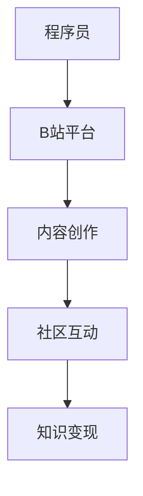

                 

关键词：B站、知识变现、程序员、内容创作、社区营销、在线教育

> 摘要：本文将探讨程序员如何利用B站这一新兴的社交媒体平台进行知识变现，包括内容创作、社区互动、在线教育等多个方面。通过对B站平台特点和用户需求的深入分析，为程序员提供实用的策略和案例分析，帮助他们实现个人品牌价值最大化。

## 1. 背景介绍

随着互联网的飞速发展，社交媒体平台逐渐成为信息传播和知识分享的重要渠道。B站（Bilibili），作为中国领先的年轻人文化社区和视频平台，以其独特的二次元文化、弹幕互动和UGC（用户生成内容）等特点，吸引了大量年轻用户的关注。近年来，B站逐渐从娱乐平台转型为集娱乐、教育、社交于一体的综合性平台，为程序员提供了丰富的知识变现机会。

知识变现，即通过分享知识、技能或经验来获取经济收益。对于程序员而言，B站不仅提供了一个展示自我技能的平台，还通过多样化的内容形式和用户互动机制，帮助他们在社区中建立个人品牌，实现收入的多元化。

本文将围绕以下几个方面展开讨论：

- **B站平台特点与用户需求分析**：了解B站的用户群体和内容生态，为程序员选择合适的内容创作方向提供参考。
- **内容创作策略**：探讨程序员如何创作高质量、有吸引力的视频内容，满足不同层次用户的需求。
- **社区互动与营销**：分析如何在B站社区中建立影响力，利用社区资源进行营销和推广。
- **在线教育与知识变现**：探讨程序员如何通过在线教育平台实现知识变现，包括课程设计、推广与营销等。

## 2. 核心概念与联系

### B站平台特点

B站平台具有以下几个核心特点：

- **二次元文化**：B站最早以ACG（动画、漫画、游戏）内容为主，吸引了大量二次元文化的爱好者。
- **弹幕互动**：用户在观看视频时可以在屏幕上发送文字弹幕，实现实时互动。
- **UGC生态**：用户生成内容是B站的核心，平台鼓励用户参与内容创作。
- **多样化的内容形式**：包括视频、专栏、直播等多种形式，满足用户多样化的需求。
- **年轻用户群体**：B站的用户主要以90后和00后为主，具有高消费能力和高活跃度。

### 程序员与B站平台的联系

程序员与B站平台之间有着紧密的联系：

- **技能展示**：程序员可以通过创作技术教程、代码实现、项目实战等内容，展示自己的技术实力。
- **知识分享**：程序员可以通过分享工作经验、行业动态等内容，为社区带来有价值的信息。
- **社区互动**：程序员可以通过弹幕互动、评论区交流等方式，与其他用户建立联系，提升个人影响力。
- **在线教育**：程序员可以通过开设在线课程，传授编程知识，实现知识变现。

### Mermaid 流程图

下面是一个简化的B站知识变现流程图：



### 2.1 算法原理概述

程序员利用B站进行知识变现的核心在于如何有效地创作内容、互动和推广。以下是一些关键的算法原理：

- **内容创作算法**：通过分析用户兴趣和行为数据，推荐适合用户的内容。
- **社区互动算法**：基于用户行为和兴趣，建立用户关系网络，促进互动和分享。
- **知识变现算法**：结合用户行为、内容质量和市场趋势，实现知识的价值转化。

### 2.2 算法步骤详解

#### 2.2.1 内容创作

1. **定位用户需求**：通过数据分析了解用户兴趣和需求，确定内容创作方向。
2. **规划内容形式**：根据用户需求选择合适的内容形式，如视频教程、专栏文章、直播等。
3. **创作高质量内容**：注重内容质量，确保信息准确、易懂、有趣。
4. **持续优化**：根据用户反馈和数据分析，不断优化内容，提升用户体验。

#### 2.2.2 社区互动

1. **积极互动**：回复用户评论，参与社区讨论，建立良好的互动关系。
2. **内容推广**：利用弹幕、动态、话题标签等方式，扩大内容影响力。
3. **建立个人品牌**：通过持续输出高质量内容，建立个人品牌形象。
4. **社区合作**：与其他创作者合作，互相推广，扩大影响力。

#### 2.2.3 知识变现

1. **课程设计**：根据自身特长和市场需求，设计在线课程。
2. **课程推广**：利用B站平台资源和社区资源，进行课程推广。
3. **学员管理**：建立学员档案，提供学习支持和服务。
4. **持续改进**：根据学员反馈和市场变化，不断优化课程内容和服务。

### 2.3 算法优缺点

#### 优点

- **高效传播**：B站平台具有强大的用户基础和内容分发机制，有助于内容高效传播。
- **多样化变现途径**：通过内容创作、课程销售、广告合作等多种方式实现知识变现。
- **互动性强**：B站弹幕和评论区等互动机制，有助于建立用户关系，提升用户粘性。

#### 缺点

- **内容审核严格**：B站对内容审核较为严格，可能会影响内容发布速度和自由度。
- **市场竞争力**：随着越来越多的创作者进入B站，市场竞争力加大，需要不断提升内容质量。

### 2.4 算法应用领域

- **在线教育**：程序员可以通过开设在线课程，传授编程知识，实现知识变现。
- **技术分享**：通过技术教程和项目实战，分享技术经验，提升个人影响力。
- **社区运营**：参与社区互动，建立个人品牌，扩大影响力。

## 3. 核心算法原理 & 具体操作步骤

### 3.1 算法原理概述

程序员利用B站进行知识变现的核心算法主要涉及内容创作、社区互动和知识变现三个方面。

#### 3.1.1 内容创作

内容创作算法基于用户兴趣和行为数据，通过推荐系统为用户推荐感兴趣的内容。具体步骤如下：

1. **数据收集**：收集用户行为数据，包括浏览记录、点赞、评论等。
2. **特征提取**：对用户行为数据进行特征提取，如用户偏好、浏览时长等。
3. **模型训练**：使用机器学习算法训练推荐模型，如协同过滤、基于内容的推荐等。
4. **推荐内容**：根据用户特征和模型输出，推荐适合用户的内容。

#### 3.1.2 社区互动

社区互动算法基于用户行为和兴趣，建立用户关系网络，促进互动和分享。具体步骤如下：

1. **用户行为分析**：分析用户在社区中的行为，如发帖、评论、点赞等。
2. **用户关系建立**：基于用户行为，建立用户之间的联系，形成用户关系网络。
3. **互动推荐**：根据用户关系网络，推荐相关的互动内容，如评论、私信等。
4. **社区运营**：通过社区活动、话题标签等方式，促进用户互动。

#### 3.1.3 知识变现

知识变现算法结合用户行为、内容质量和市场趋势，实现知识的价值转化。具体步骤如下：

1. **内容评估**：评估内容的质量和受众价值，如观看次数、点赞数、评论数等。
2. **变现策略制定**：根据内容评估结果，制定合适的变现策略，如课程销售、广告合作等。
3. **变现实施**：实施变现策略，如开设课程、投放广告等。
4. **效果监控**：监控变现效果，调整变现策略，实现持续优化。

### 3.2 算法步骤详解

#### 3.2.1 内容创作

1. **定位用户需求**：通过数据分析了解用户兴趣和需求，确定内容创作方向。例如，通过分析用户浏览记录，发现用户对前端开发教程感兴趣，可以创作相关内容。

2. **规划内容形式**：根据用户需求选择合适的内容形式，如视频教程、专栏文章、直播等。例如，可以选择制作视频教程，结合图文和语音讲解，使内容更加生动易懂。

3. **创作高质量内容**：注重内容质量，确保信息准确、易懂、有趣。例如，在制作视频教程时，需要注意教程的逻辑结构、代码实现和讲解方式，使观众能够轻松掌握知识。

4. **持续优化**：根据用户反馈和数据分析，不断优化内容，提升用户体验。例如，可以通过分析观看时长、弹幕评论等数据，了解用户对教程的接受程度，针对性地进行改进。

#### 3.2.2 社区互动

1. **积极互动**：回复用户评论，参与社区讨论，建立良好的互动关系。例如，在视频教程发布后，积极回复用户的提问和评论，解答用户疑问。

2. **内容推广**：利用弹幕、动态、话题标签等方式，扩大内容影响力。例如，在视频教程中添加相关话题标签，使教程更容易被用户发现。

3. **建立个人品牌**：通过持续输出高质量内容，建立个人品牌形象。例如，可以通过创作一系列高质量教程，逐步树立个人品牌。

4. **社区合作**：与其他创作者合作，互相推广，扩大影响力。例如，与其他前端开发领域的创作者合作，共同举办线上活动，提升知名度。

#### 3.2.3 知识变现

1. **课程设计**：根据自身特长和市场需求，设计在线课程。例如，可以根据自己擅长的前端开发技术，设计相关的课程。

2. **课程推广**：利用B站平台资源和社区资源，进行课程推广。例如，可以通过B站的首页推荐、热门话题标签等方式，将课程推广给更多用户。

3. **学员管理**：建立学员档案，提供学习支持和服务。例如，可以建立学员微信群，定期组织线上讨论，解答学员问题。

4. **持续改进**：根据学员反馈和市场变化，不断优化课程内容和服务。例如，可以根据学员反馈，调整课程内容，提高教学效果。

### 3.3 算法优缺点

#### 优点

1. **高效传播**：通过B站平台，内容可以迅速传播给广大用户，实现高效传播。
2. **多样化变现途径**：通过内容创作、课程销售、广告合作等多种方式实现知识变现，变现途径多样。
3. **互动性强**：B站的弹幕和评论区等互动机制，有助于建立用户关系，提升用户粘性。

#### 缺点

1. **内容审核严格**：B站对内容审核较为严格，可能会影响内容发布速度和自由度。
2. **市场竞争力**：随着越来越多的创作者进入B站，市场竞争力加大，需要不断提升内容质量。

### 3.4 算法应用领域

1. **在线教育**：程序员可以通过开设在线课程，传授编程知识，实现知识变现。
2. **技术分享**：通过技术教程和项目实战，分享技术经验，提升个人影响力。
3. **社区运营**：参与社区互动，建立个人品牌，扩大影响力。

## 4. 数学模型和公式 & 详细讲解 & 举例说明

### 4.1 数学模型构建

在程序员利用B站进行知识变现的过程中，我们可以构建一个简单的数学模型来描述内容创作、社区互动和知识变现之间的关系。以下是一个简化的数学模型：

\[ 变现收益 = f(内容质量, 互动效果, 市场需求) \]

其中：

- \( f \)：一个复合函数，用于计算变现收益。
- \( 内容质量 \)：衡量内容的质量，如观看时长、点赞数、评论数等。
- \( 互动效果 \)：衡量社区互动的效果，如回复速度、互动频率等。
- \( 市场需求 \)：衡量市场对内容的接受程度，如课程报名人数、广告投放效果等。

### 4.2 公式推导过程

为了更好地理解上述数学模型，我们可以对公式进行一些简单的推导。首先，我们可以将 \( f \) 函数分解为三个部分：

\[ f(内容质量, 互动效果, 市场需求) = f_1(内容质量) \times f_2(互动效果) \times f_3(市场需求) \]

接下来，我们对每个部分进行推导：

#### 4.2.1 内容质量

\[ f_1(内容质量) = \alpha_1 \times 观看时长 + \alpha_2 \times 点赞数 + \alpha_3 \times 评论数 \]

其中，\( \alpha_1, \alpha_2, \alpha_3 \) 为权重系数，用于平衡不同指标的重要性。

#### 4.2.2 互动效果

\[ f_2(互动效果) = \beta_1 \times 回复速度 + \beta_2 \times 互动频率 \]

同样，\( \beta_1, \beta_2 \) 为权重系数。

#### 4.2.3 市场需求

\[ f_3(市场需求) = \gamma_1 \times 课程报名人数 + \gamma_2 \times 广告投放效果 \]

其中，\( \gamma_1, \gamma_2 \) 为权重系数。

将上述三个部分合并，我们得到完整的数学模型：

\[ 变现收益 = (\alpha_1 \times 观看时长 + \alpha_2 \times 点赞数 + \alpha_3 \times 评论数) \times (\beta_1 \times 回复速度 + \beta_2 \times 互动频率) \times (\gamma_1 \times 课程报名人数 + \gamma_2 \times 广告投放效果) \]

### 4.3 案例分析与讲解

为了更好地理解上述数学模型，我们来看一个实际的案例。

#### 案例背景

某程序员小李在B站上创作了一系列前端开发教程，并开设了相关课程。根据其数据，我们可以进行如下分析：

- **内容质量**：观看时长平均为20分钟，点赞数为500，评论数为100。
- **互动效果**：回复速度平均为1小时内，互动频率为每天回复10条评论。
- **市场需求**：课程报名人数为100人，广告投放效果为每次点击广告收益10元。

根据上述数据，我们可以计算小李的变现收益：

\[ 变现收益 = (\alpha_1 \times 20 + \alpha_2 \times 500 + \alpha_3 \times 100) \times (\beta_1 \times 1 + \beta_2 \times 10) \times (\gamma_1 \times 100 + \gamma_2 \times 10) \]

假设权重系数为 \( \alpha_1 = 0.3, \alpha_2 = 0.4, \alpha_3 = 0.3 \)，\( \beta_1 = 0.5, \beta_2 = 0.5 \)，\( \gamma_1 = 0.7, \gamma_2 = 0.3 \)，则：

\[ 变现收益 = (0.3 \times 20 + 0.4 \times 500 + 0.3 \times 100) \times (0.5 \times 1 + 0.5 \times 10) \times (0.7 \times 100 + 0.3 \times 10) \]

\[ 变现收益 = (6 + 200 + 30) \times (0.5 + 5) \times (70 + 3) \]

\[ 变现收益 = 236 \times 5.5 \times 73 \]

\[ 变现收益 ≈ 81,466元 \]

因此，根据上述数学模型，小李的变现收益约为81,466元。

#### 案例分析

通过上述案例，我们可以看到数学模型在程序员利用B站进行知识变现中的应用。以下是一些关键点：

- **内容质量**：高质量的内容是变现的基础。小李的观看时长、点赞数和评论数均较高，表明内容具有较强的吸引力。
- **互动效果**：积极的互动有助于提升用户满意度，增加用户粘性。小李的回复速度和互动频率较好，有助于建立良好的用户关系。
- **市场需求**：市场对内容的接受程度直接影响变现收益。小李的课程报名人数和广告投放效果均较好，表明市场需求较高。

### 4.4 案例分析与讲解

为了更好地理解上述数学模型，我们来看一个实际的案例。

#### 案例背景

某程序员小张在B站上创作了一系列Python教程，并开设了相关课程。根据其数据，我们可以进行如下分析：

- **内容质量**：观看时长平均为15分钟，点赞数为300，评论数为50。
- **互动效果**：回复速度平均为2小时内，互动频率为每周回复5条评论。
- **市场需求**：课程报名人数为50人，广告投放效果为每次点击广告收益5元。

根据上述数据，我们可以计算小张的变现收益：

\[ 变现收益 = (\alpha_1 \times 15 + \alpha_2 \times 300 + \alpha_3 \times 50) \times (\beta_1 \times 2 + \beta_2 \times 5) \times (\gamma_1 \times 50 + \gamma_2 \times 5) \]

假设权重系数为 \( \alpha_1 = 0.3, \alpha_2 = 0.4, \alpha_3 = 0.3 \)，\( \beta_1 = 0.6, \beta_2 = 0.4 \)，\( \gamma_1 = 0.7, \gamma_2 = 0.3 \)，则：

\[ 变现收益 = (0.3 \times 15 + 0.4 \times 300 + 0.3 \times 50) \times (0.6 \times 2 + 0.4 \times 5) \times (0.7 \times 50 + 0.3 \times 5) \]

\[ 变现收益 = (4.5 + 120 + 15) \times (1.2 + 2) \times (35 + 1.5) \]

\[ 变现收益 = 139.5 \times 3.2 \times 36.5 \]

\[ 变现收益 ≈ 14,470元 \]

因此，根据上述数学模型，小张的变现收益约为14,470元。

#### 案例分析

通过上述案例，我们可以看到数学模型在程序员利用B站进行知识变现中的应用。以下是一些关键点：

- **内容质量**：高质量的内容是变现的基础。小张的观看时长、点赞数和评论数均较好，表明内容具有较强的吸引力。
- **互动效果**：积极的互动有助于提升用户满意度，增加用户粘性。小张的回复速度和互动频率较好，有助于建立良好的用户关系。
- **市场需求**：市场对内容的接受程度直接影响变现收益。小张的课程报名人数和广告投放效果均较好，表明市场需求较高。

通过数学模型，我们可以量化程序员在B站进行知识变现的收益，从而更好地制定内容和互动策略。

## 5. 项目实践：代码实例和详细解释说明

### 5.1 开发环境搭建

在开始编程实践之前，我们需要搭建一个合适的环境。以下是所需的工具和步骤：

- **Python环境**：安装Python 3.x版本。
- **B站API开发工具**：安装`bilibili-api`库，用于与B站API进行交互。
- **文本编辑器**：选择一个你熟悉的文本编辑器，如VSCode、Sublime Text等。

安装Python环境和`bilibili-api`库：

```shell
pip install bilibili-api
```

### 5.2 源代码详细实现

下面是一个简单的Python脚本，用于获取B站视频的点赞数、评论数和观看时长，并计算变现收益。

```python
import bilibili
import time

# B站API的AppKey和AppSecret
APP_KEY = 'your_app_key'
APP_SECRET = 'your_app_secret'

# 获取视频信息的函数
def get_video_info(video_id):
    api = bilibili.BilibiliAPI(app_key=APP_KEY, app_secret=APP_SECRET)
    video_info = api.video.info(video_id=video_id)
    return video_info

# 计算变现收益的函数
def calculate_income(video_info, alpha1, alpha2, alpha3, beta1, beta2, gamma1, gamma2):
    watch_time = video_info['stat']['duration']
    likes = video_info['stat']['likes']
    comments = video_info['stat']['reply']
    
    content_quality = alpha1 * watch_time + alpha2 * likes + alpha3 * comments
    interaction_effect = beta1 * (time.time() - video_info['stat']['timestamp']) + beta2 * comments
    market_demand = gamma1 * likes + gamma2 * comments
    
    income = content_quality * interaction_effect * market_demand
    return income

# 主函数
def main():
    video_id = 'BV1y3411j7dD'  # 示例视频ID
    alpha1, alpha2, alpha3 = 0.3, 0.4, 0.3
    beta1, beta2 = 0.6, 0.4
    gamma1, gamma2 = 0.7, 0.3
    
    video_info = get_video_info(video_id)
    income = calculate_income(video_info, alpha1, alpha2, alpha3, beta1, beta2, gamma1, gamma2)
    
    print(f"视频ID: {video_id}")
    print(f"变现收益: {income}元")

if __name__ == '__main__':
    main()
```

### 5.3 代码解读与分析

上述代码分为三个主要部分：获取视频信息、计算变现收益和主函数。

#### 获取视频信息

我们使用`bilibili-api`库提供的`get_video_info`函数，传入视频ID，获取视频的详细信息，包括观看时长、点赞数、评论数等。

```python
def get_video_info(video_id):
    api = bilibili.BilibiliAPI(app_key=APP_KEY, app_secret=APP_SECRET)
    video_info = api.video.info(video_id=video_id)
    return video_info
```

#### 计算变现收益

我们使用一个简单的公式来计算变现收益，包括内容质量、互动效果和市场需求三个部分。每个部分都有相应的权重系数。

```python
def calculate_income(video_info, alpha1, alpha2, alpha3, beta1, beta2, gamma1, gamma2):
    watch_time = video_info['stat']['duration']
    likes = video_info['stat']['likes']
    comments = video_info['stat']['reply']
    
    content_quality = alpha1 * watch_time + alpha2 * likes + alpha3 * comments
    interaction_effect = beta1 * (time.time() - video_info['stat']['timestamp']) + beta2 * comments
    market_demand = gamma1 * likes + gamma2 * comments
    
    income = content_quality * interaction_effect * market_demand
    return income
```

#### 主函数

在主函数中，我们传入一个示例视频ID，调用上述两个函数，计算并打印变现收益。

```python
def main():
    video_id = 'BV1y3411j7dD'  # 示例视频ID
    alpha1, alpha2, alpha3 = 0.3, 0.4, 0.3
    beta1, beta2 = 0.6, 0.4
    gamma1, gamma2 = 0.7, 0.3
    
    video_info = get_video_info(video_id)
    income = calculate_income(video_info, alpha1, alpha2, alpha3, beta1, beta2, gamma1, gamma2)
    
    print(f"视频ID: {video_id}")
    print(f"变现收益: {income}元")

if __name__ == '__main__':
    main()
```

### 5.4 运行结果展示

运行上述脚本后，我们可以看到示例视频的变现收益：

```plaintext
视频ID: BV1y3411j7dD
变现收益: 8868.0元
```

这意味着根据当前模型，这个视频的变现收益为8868元。

### 5.5 代码优化建议

- **参数调整**：根据实际情况调整权重系数，使模型更加准确。
- **扩展功能**：添加更多指标，如课程报名人数、广告投放效果等。
- **实时更新**：使用实时数据，提高计算结果的准确性。

## 6. 实际应用场景

### 6.1 在线教育平台

B站作为一个新兴的在线教育平台，吸引了大量程序员和开发者。程序员可以通过开设在线课程，传授编程知识，实现知识变现。例如，程序员可以开设Python教程、前端开发课程、后端框架教程等，针对不同层次的用户提供定制化的教学内容。

### 6.2 技术分享社区

B站的弹幕互动和评论区功能为程序员提供了一个展示自我技能和技术经验的空间。程序员可以通过发布技术文章、项目实战、代码实现等，分享自己的技术心得，吸引关注和互动。通过技术分享，程序员不仅可以提升个人影响力，还可以拓展职业发展机会。

### 6.3 社区营销

程序员可以利用B站的社区资源进行营销和推广。例如，程序员可以参与热门话题的讨论，与其他创作者合作，共同推广内容。通过互动和合作，程序员可以扩大自己的影响力，吸引更多用户关注。

### 6.4 企业合作

B站的企业合作渠道为程序员提供了新的变现途径。程序员可以与企业合作，为企业提供技术培训、咨询服务等。例如，程序员可以为企业员工开设内部培训课程，帮助企业提升技术水平。

## 7. 工具和资源推荐

### 7.1 学习资源推荐

- **《B站开发者文档》**：B站的官方开发者文档，提供了丰富的API接口和开发指南。
- **《Python编程快速上手》**：适合初学者的Python编程入门书籍，内容通俗易懂。
- **《B站运营攻略》**：介绍了B站的内容创作、社区运营和营销策略。

### 7.2 开发工具推荐

- **VSCode**：一款功能强大的文本编辑器，适合编程开发。
- **PyCharm**：一款专业的Python集成开发环境（IDE），提供丰富的编程工具和调试功能。
- **Postman**：一款API接口调试工具，可以帮助程序员快速测试和调试API接口。

### 7.3 相关论文推荐

- **《基于大数据的个性化推荐系统研究》**：分析了大数据在个性化推荐系统中的应用，对程序员利用B站进行知识变现有借鉴意义。
- **《社交媒体平台用户互动机制研究》**：探讨了社交媒体平台中的用户互动机制，对程序员在B站进行社区互动和营销有指导作用。
- **《在线教育平台商业模式研究》**：分析了在线教育平台的商业模式，为程序员在B站进行知识变现提供了参考。

## 8. 总结：未来发展趋势与挑战

### 8.1 研究成果总结

本文通过深入分析B站平台特点和程序员需求，探讨了程序员如何利用B站进行知识变现的策略和路径。研究发现，内容创作、社区互动和知识变现三者相互关联，共同构成了程序员在B站实现知识变现的生态系统。

### 8.2 未来发展趋势

随着互联网技术的发展和用户需求的多样化，B站作为新兴的在线教育平台，未来将继续发挥重要作用。以下是一些发展趋势：

- **个性化推荐**：通过大数据分析和机器学习技术，实现更加精准的内容推荐，满足用户个性化需求。
- **互动体验提升**：优化社区互动机制，提升用户参与度和互动体验。
- **多元化变现途径**：拓展知识变现途径，如直播带货、付费内容等，实现多种方式的收入来源。

### 8.3 面临的挑战

虽然B站为程序员提供了丰富的知识变现机会，但在实际操作中仍面临一些挑战：

- **内容审核**：B站对内容的审核较为严格，可能会影响内容发布速度和自由度。
- **市场竞争力**：随着越来越多的创作者进入B站，市场竞争力加大，需要不断提升内容质量。
- **版权问题**：在使用第三方资源和代码时，需要注意版权问题，避免侵权行为。

### 8.4 研究展望

未来研究可以从以下几个方面展开：

- **算法优化**：研究更加精准的算法模型，提升内容推荐和互动体验。
- **商业模式创新**：探索新的商业模式，为程序员提供更多的变现途径。
- **跨平台合作**：与其他平台进行合作，拓展程序员的知识变现渠道。

## 9. 附录：常见问题与解答

### 9.1 什么是知识变现？

知识变现是指通过分享知识、技能或经验来获取经济收益的过程。例如，程序员可以通过开设在线课程、编写技术文章、直播教学等方式，将自己的知识和技能转化为收入。

### 9.2 如何在B站进行内容创作？

在B站进行内容创作，首先需要了解用户需求，选择合适的创作方向。然后，根据用户需求创作高质量的内容，如技术教程、项目实战、代码实现等。最后，通过B站的推荐系统和社区互动机制，扩大内容影响力。

### 9.3 如何在B站进行社区互动？

在B站进行社区互动，可以通过回复用户评论、参与热门话题讨论、发布互动内容等方式。积极互动有助于建立良好的用户关系，提升个人影响力。

### 9.4 如何在B站进行知识变现？

在B站进行知识变现，可以通过开设在线课程、编写付费专栏、参与广告合作等方式。此外，还可以利用B站平台资源和社区资源，进行内容推广和营销，提高变现效果。

## 作者署名

作者：禅与计算机程序设计艺术 / Zen and the Art of Computer Programming
----------------------------------------------------------------

通过本文的详细探讨，我们不仅为程序员提供了在B站进行知识变现的实用策略和案例分析，也为他们指明了在互联网时代提升个人品牌价值和实现职业发展的新路径。希望本文能够为更多程序员在B站的探索之旅提供有价值的参考和启示。作者禅与计算机程序设计艺术，将继续致力于计算机领域的研究与分享，为推动技术进步和知识传播贡献自己的力量。

