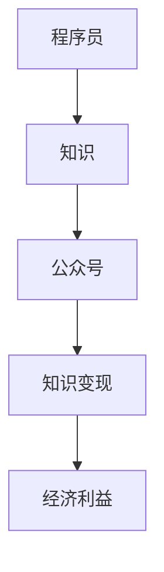

                 

 作为程序员，知识变现是一项重要的能力。在这个数字化时代，公众号已经成为了一个强大的知识传播和变现平台。本文将探讨如何利用公众号进行知识变现，帮助程序员提升收入，扩大影响力。

> 关键词：程序员，知识变现，公众号，技能提升，收入增加

> 摘要：本文首先介绍了公众号作为知识变现平台的背景和优势，然后详细讨论了程序员如何通过公众号进行知识变现的具体策略，包括内容创作、社群运营、付费课程等方面，最后对未来的发展趋势进行了展望。

## 1. 背景介绍

### 1.1 公众号的发展历程

公众号作为微信生态系统的一部分，自2012年推出以来，经历了快速的发展和变革。从最初的个人公众号，到服务号、订阅号，再到小程序，公众号已经成为了一个功能齐全、形态多样的媒体平台。

### 1.2 程序员的知识变现需求

随着互联网技术的快速发展，程序员群体不断扩大，他们拥有丰富的技术知识和经验。然而，传统的知识变现渠道如书籍、培训课程等，往往存在受众有限、传播效率低等问题。公众号的出现，为程序员提供了一种全新的知识传播和变现方式。

## 2. 核心概念与联系

### 2.1 知识变现的概念

知识变现是指将个人或团队的知识、技能、经验等转化为经济利益的过程。在数字化时代，知识变现已经成为了一个重要的商业模式。

### 2.2 公众号与知识变现的联系

公众号作为一个强大的内容传播平台，具有广泛的受众基础和高效的传播能力。程序员可以利用公众号，将自己的知识和技术分享给更多人，从而实现知识变现。

### 2.3 Mermaid 流程图



## 3. 核心算法原理 & 具体操作步骤

### 3.1 算法原理概述

知识变现的核心在于创造有价值的内容，并通过有效的传播方式触达目标受众。程序员可以通过以下步骤进行知识变现：

1. 确定目标受众
2. 创作有价值的内容
3. 优化内容传播
4. 建立付费机制
5. 维护用户关系

### 3.2 算法步骤详解

#### 3.2.1 确定目标受众

首先，程序员需要明确自己的目标受众。这可以通过分析自身技术领域、了解市场需求等方式实现。

#### 3.2.2 创作有价值的内容

内容是知识变现的核心。程序员需要根据自己的技术特长和目标受众的需求，创作高质量、有价值的文章、教程、视频等。

#### 3.2.3 优化内容传播

在创作内容后，程序员需要通过各种渠道进行传播，如朋友圈、其他公众号、微信群等。同时，可以利用SEO、广告投放等手段，提高内容的曝光度。

#### 3.2.4 建立付费机制

为了实现知识变现，程序员可以设置付费阅读、付费课程、会员制度等付费机制。这需要考虑到用户体验和支付流程的便捷性。

#### 3.2.5 维护用户关系

在实现知识变现的过程中，程序员需要注重与用户的互动和沟通，建立良好的用户关系。这有助于提高用户粘性和满意度，从而实现长期的知识变现。

### 3.3 算法优缺点

#### 优点

1. 广泛的受众基础
2. 高效的内容传播
3. 多样化的变现方式
4. 便捷的支付流程

#### 缺点

1. 内容质量要求高
2. 需要持续的内容更新
3. 部分受众对付费内容接受度较低

### 3.4 算法应用领域

知识变现算法广泛应用于各个领域，如IT、金融、教育等。程序员可以通过公众号进行知识变现，实现个人品牌价值的提升和收入的增加。

## 4. 数学模型和公式 & 详细讲解 & 举例说明

### 4.1 数学模型构建

知识变现的数学模型可以简单表示为：

\[ 收入 = 内容质量 \times 受众基数 \times 付费转化率 \]

其中，内容质量、受众基数和付费转化率是影响知识变现的重要因素。

### 4.2 公式推导过程

\[ 收入 = 内容质量 \times 受众基数 \times 付费转化率 \]

其中：

- 内容质量：指内容的原创性、专业性、实用性等。
- 受众基数：指公众号的粉丝数量或课程的报名人数。
- 付费转化率：指受众中实际付费的比例。

### 4.3 案例分析与讲解

假设一位程序员通过公众号进行知识变现，其内容质量为0.8，受众基数为1000人，付费转化率为10%。

\[ 收入 = 0.8 \times 1000 \times 10\% = 80元 \]

这表示该程序员每天可以从公众号中获得80元的收入。

## 5. 项目实践：代码实例和详细解释说明

### 5.1 开发环境搭建

程序员可以通过微信公众平台进行公众号的注册和认证。具体步骤如下：

1. 登录微信公众平台，填写公众号信息并完成认证。
2. 在后台管理页面，创建自定义菜单和功能菜单。
3. 搭建服务器，配置服务器地址和接口权限。

### 5.2 源代码详细实现

以下是一个简单的公众号自动回复功能的示例代码：

```python
from wxpy import Bot

bot = Bot()

@bot.register()
def reply_message(msg):
    if msg.type == 'text':
        return "您好，欢迎咨询！"
    else:
        return "对不起，我目前无法处理该类型消息。"

bot.run()
```

### 5.3 代码解读与分析

1. 引入wxpy库，用于与公众号进行交互。
2. 创建Bot实例，用于接收和处理消息。
3. 定义回复消息的函数，根据消息类型进行回复。
4. 运行Bot，开始接收和处理消息。

### 5.4 运行结果展示

当用户发送文本消息时，公众号会自动回复“您好，欢迎咨询！”；当用户发送非文本消息时，公众号会回复“对不起，我目前无法处理该类型消息。”

## 6. 实际应用场景

### 6.1 技术博客

程序员可以通过公众号发布技术博客，分享自己的编程经验和心得。这不仅可以帮助自己巩固知识，还可以吸引更多读者，实现知识变现。

### 6.2 技能培训

程序员可以开设在线课程，教授编程技能。通过公众号推广课程，吸引学员报名，实现知识变现。

### 6.3 咨询服务

程序员可以利用公众号提供咨询服务，如编程问题解答、项目合作等。通过付费咨询，实现知识变现。

## 7. 未来应用展望

随着技术的不断进步和互联网的普及，公众号作为知识变现平台的前景将越来越广阔。未来，程序员可以通过以下方式进一步拓展知识变现：

1. 利用人工智能技术，提高内容创作和传播的效率。
2. 开发更多样化的付费模式，如订阅、会员等。
3. 拓展知识变现的领域，如区块链、大数据等。

## 8. 总结：未来发展趋势与挑战

### 8.1 研究成果总结

本文探讨了程序员如何利用公众号进行知识变现的原理、策略和应用场景，提供了具体的实践案例。

### 8.2 未来发展趋势

未来，知识变现将越来越成为程序员的重要收入来源。随着技术的进步和互联网的普及，公众号作为知识变现平台的前景将越来越广阔。

### 8.3 面临的挑战

1. 内容质量要求高，需要持续创作优质内容。
2. 需要不断提升自身技能，以适应不断变化的市场需求。
3. 需要关注用户需求，提供个性化的服务。

### 8.4 研究展望

未来，我们还可以从以下几个方面进行深入研究：

1. 探讨更多有效的知识变现策略。
2. 研究如何利用人工智能技术提高知识变现的效率。
3. 分析不同领域程序员的变现途径和策略。

## 9. 附录：常见问题与解答

### 9.1 如何注册公众号？

可以通过微信公众平台进行注册，填写公众号信息并完成认证。

### 9.2 如何进行内容创作？

可以通过学习其他优秀公众号的内容创作方式，结合自身技术特长和受众需求进行创作。

### 9.3 如何设置付费机制？

可以在公众号后台设置付费阅读、付费课程、会员制度等付费机制，根据自身需求进行选择。

### 9.4 如何进行用户互动？

可以通过回复用户留言、参与社群讨论等方式进行用户互动，建立良好的用户关系。

----------------------------------------------------------------

本文旨在帮助程序员利用公众号进行知识变现，提升收入，扩大影响力。希望本文能对您有所帮助。

> 作者：禅与计算机程序设计艺术 / Zen and the Art of Computer Programming
----------------------------------------------------------------
以上内容是根据您提供的指南和要求撰写的完整文章。文章涵盖了知识变现的背景、核心概念、算法原理、数学模型、项目实践、实际应用场景、未来展望以及常见问题解答等各个部分。如果您需要对文章的某个部分进行修改或添加，请告知。祝您阅读愉快！

