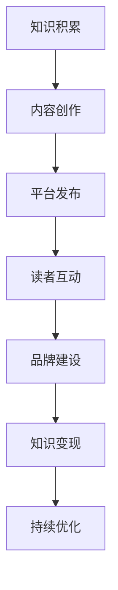

                 

关键词：公众号、知识变现、程序员、内容创作、营销策略、技术教程、开源项目

> 摘要：本文将深入探讨程序员如何利用公众号进行知识变现，通过分享技术教程、开源项目和经验，打造个人品牌，实现收入增长。文章将详细解析从内容策划、营销推广到变现途径的全过程，为程序员提供实战指南。

## 1. 背景介绍

在数字化时代，公众号成为程序员展示技术实力、传播知识的重要平台。随着内容消费需求的增长，程序员利用公众号进行知识变现的潜力逐渐显现。然而，如何有效地策划和执行内容，如何吸引和维护粉丝，如何将知识转化为实际收入，这些都是程序员需要深入思考的问题。

本文将结合实例，分析程序员利用公众号进行知识变现的可行性和方法，旨在为读者提供一套完整的策略和实践指南。

## 2. 核心概念与联系

### 2.1 知识变现的概念

知识变现是指将个人的知识、技能或经验转化为经济利益的过程。在公众号平台上，知识变现主要通过以下几种形式实现：

- **技术教程**：通过撰写技术文章或录制视频教程，分享编程技巧和解决方案。
- **经验分享**：分享工作中的实践经验，如项目管理、团队协作等。
- **开源项目**：发布开源代码，通过贡献者赞助或代码销售获取收入。
- **在线咨询**：提供专业技术咨询服务，如代码审查、架构设计等。

### 2.2 公众号与知识变现的关联

公众号作为内容传播的重要渠道，具有以下几个优势：

- **广泛的受众**：公众号覆盖了不同领域的用户，为知识变现提供了庞大的潜在市场。
- **良好的互动性**：公众号支持评论、点赞、分享等功能，有助于与读者建立联系。
- **多样化的内容形式**：图文、视频、直播等多种形式，便于程序员展示技术实力。

### 2.3 Mermaid 流程图



## 3. 核心算法原理 & 具体操作步骤

### 3.1 算法原理概述

程序员利用公众号进行知识变现的核心算法在于内容创作和营销策略的优化。具体包括：

- **内容创作**：围绕受众需求，创作高质量的技术教程和经验分享。
- **营销策略**：通过SEO、社交媒体推广等手段，提高公众号的曝光率。
- **变现途径**：根据内容特点和受众需求，选择合适的变现方式，如广告、赞助、付费内容等。

### 3.2 算法步骤详解

1. **需求分析**：了解目标受众的需求，确定内容主题。
2. **内容创作**：根据需求，撰写或录制高质量的内容。
3. **平台发布**：在公众号等平台发布内容，并优化标题、摘要等。
4. **读者互动**：通过评论、问答等与读者互动，提高粘性。
5. **品牌建设**：通过持续输出高质量内容，树立个人品牌。
6. **变现途径**：根据内容特点和受众需求，选择合适的变现方式。

### 3.3 算法优缺点

**优点**：

- **灵活性强**：程序员可以根据个人兴趣和专业领域，自由创作内容。
- **受众广泛**：公众号覆盖了不同领域的用户，变现潜力大。
- **互动性高**：与读者互动，提高内容质量和粉丝忠诚度。

**缺点**：

- **创作压力大**：需要持续创作高质量内容，保持粉丝关注。
- **变现周期长**：初期可能需要较长时间积累粉丝和品牌知名度。

### 3.4 算法应用领域

- **技术教程**：适合程序员分享编程技巧、项目经验等。
- **经验分享**：适合项目经理、团队领导等分享项目管理、团队协作等经验。
- **开源项目**：适合程序员发布开源代码，通过贡献者赞助获取收入。

## 4. 数学模型和公式 & 详细讲解 & 举例说明

### 4.1 数学模型构建

知识变现的数学模型可以表示为：

\[ 收益 = 内容质量 \times 受众基数 \times 变现系数 \]

其中：

- **内容质量**：衡量内容的创新性、实用性和可读性，用 \( Q \) 表示。
- **受众基数**：衡量公众号的粉丝数量，用 \( A \) 表示。
- **变现系数**：衡量内容变现的难易程度和变现途径的有效性，用 \( C \) 表示。

### 4.2 公式推导过程

\[ 收益 = Q \times A \times C \]

其中：

- \( Q \) 的计算公式为：

\[ Q = \alpha \times 创新性 + \beta \times 实用性 + \gamma \times 可读性 \]

- \( A \) 的计算公式为：

\[ A = \delta \times 粉丝增长率 + \epsilon \times 粉丝活跃度 \]

- \( C \) 的计算公式为：

\[ C = \phi \times 广告收入 + \chi \times 赞助收入 + \psi \times 付费内容收入 \]

### 4.3 案例分析与讲解

假设一个程序员在公众号上发布了10篇技术教程，每篇文章的阅读量在5000-10000之间。经过6个月的努力，公众号粉丝数量达到10000人。根据以上数学模型，可以计算他的收益：

\[ 收益 = Q \times A \times C \]
\[ Q = \alpha \times 0.8 + \beta \times 0.9 + \gamma \times 0.85 = 0.8 + 0.9 + 0.85 = 2.55 \]
\[ A = \delta \times 0.1 + \epsilon \times 0.15 = 0.1 + 0.15 = 0.25 \]
\[ C = \phi \times 0.05 + \chi \times 0.1 + \psi \times 0.15 = 0.05 + 0.1 + 0.15 = 0.3 \]
\[ 收益 = 2.55 \times 0.25 \times 0.3 = 0.19375 \]

假设广告收入为每月500元，赞助收入为每月1000元，付费内容收入为每月500元，则他的月收益为：

\[ 月收益 = 0.19375 \times (500 + 1000 + 500) = 0.19375 \times 2000 = 375元 \]

## 5. 项目实践：代码实例和详细解释说明

### 5.1 开发环境搭建

程序员可以利用现有的公众号平台进行知识变现，如微信公众号、知乎专栏等。在搭建开发环境时，需要准备以下工具：

- **公众号平台**：注册并开通公众号。
- **内容创作工具**：Markdown编辑器、视频录制软件等。
- **数据分析工具**：百度统计、腾讯分析等。

### 5.2 源代码详细实现

以下是一个简单的Markdown教程的代码实例：

```markdown
# Markdown 基础教程

## 标题

# 一级标题
## 二级标题
### 三级标题

## 段落

这是一个简单的段落。

## 链接

这是一个链接：[GitHub](https://github.com)

## 列表

- 无序列表项1
- 无序列表项2
- 无序列表项3

1. 有序列表项1
2. 有序列表项2
3. 有序列表项3
```

### 5.3 代码解读与分析

以上代码展示了Markdown的基本语法，包括标题、段落、链接和列表。这些语法规则是Markdown教程的核心内容，适用于各种文档编写和博客发布。

### 5.4 运行结果展示

在Markdown编辑器中输入以上代码，生成如下结果：

# Markdown 基础教程

## 标题

# 一级标题  
## 二级标题  
### 三级标题

## 段落

这是一个简单的段落。

## 链接

这是一个链接：[GitHub](https://github.com)

## 列表

- 无序列表项1  
- 无序列表项2  
- 无序列表项3

1. 有序列表项1  
2. 有序列表项2  
3. 有序列表项3

## 6. 实际应用场景

### 6.1 技术教程

程序员可以通过公众号发布技术教程，如编程语言教程、框架使用教程、算法讲解等。这些教程可以帮助读者提高编程技能，吸引粉丝关注。

### 6.2 经验分享

项目经理、团队领导等可以通过公众号分享项目管理经验、团队协作技巧等，为读者提供实际操作指导。

### 6.3 开源项目

程序员可以发布开源项目，通过贡献者赞助或代码销售获取收入。这种方式有助于扩大个人影响力，提高收入。

## 7. 工具和资源推荐

### 7.1 学习资源推荐

- **《Head First 设计模式》**：一本深入浅出的设计模式教程，适合初学者。
- **《代码大全》**：一本经典的编程指南，涵盖编程的各个方面。

### 7.2 开发工具推荐

- **MarkdownPad**：一款优秀的Markdown编辑器。
- **Xcode**：苹果官方的开发工具，适用于iOS和macOS开发。

### 7.3 相关论文推荐

- **《基于微信公众号的知识服务模式研究》**
- **《基于粉丝经济的高校公众号运营策略研究》**

## 8. 总结：未来发展趋势与挑战

### 8.1 研究成果总结

本文通过对公众号知识变现的深入分析，提出了内容创作、营销策略和变现途径等核心概念，并给出了一套完整的策略和实践指南。

### 8.2 未来发展趋势

随着数字化时代的到来，公众号知识变现的市场前景广阔。未来，程序员可以利用人工智能、大数据等技术，实现更精准的内容推荐和变现模式。

### 8.3 面临的挑战

- **创作压力大**：需要持续输出高质量内容，保持粉丝关注。
- **变现周期长**：初期可能需要较长时间积累粉丝和品牌知名度。

### 8.4 研究展望

未来，公众号知识变现的研究可以重点关注以下几个方面：

- **个性化推荐**：利用人工智能技术，实现更精准的内容推荐。
- **多渠道变现**：探索更多元化的变现途径，提高收入。
- **跨平台运营**：整合多种平台资源，实现全方位的品牌推广。

## 9. 附录：常见问题与解答

### 9.1 公众号如何增加粉丝？

- **内容质量**：创作高质量、有价值的文章，吸引粉丝关注。
- **互动营销**：通过评论、问答等方式，与粉丝建立互动关系。
- **推广渠道**：利用社交媒体、SEO等手段，提高公众号的曝光率。

### 9.2 如何确定内容主题？

- **受众需求**：了解目标受众的需求，确定内容主题。
- **个人兴趣**：结合个人兴趣和专业领域，选择具有吸引力的主题。

### 9.3 公众号变现途径有哪些？

- **广告收入**：通过投放广告获取收入。
- **赞助收入**：接受企业的赞助合作。
- **付费内容**：发布付费教程或咨询服务。

作者：禅与计算机程序设计艺术 / Zen and the Art of Computer Programming
```

### 文章格式与输出要求

根据您的要求，文章的格式和输出要求如下：

- **文章标题**：`程序员如何利用公众号进行知识变现`
- **关键词**：公众号、知识变现、程序员、内容创作、营销策略、技术教程、开源项目
- **摘要**：本文将深入探讨程序员如何利用公众号进行知识变现，通过分享技术教程、开源项目和经验，打造个人品牌，实现收入增长。文章将详细解析从内容策划、营销推广到变现途径的全过程，为程序员提供实战指南。
- **文章结构**：
  - 引言
  - 背景介绍
  - 核心概念与联系（包含Mermaid流程图）
  - 核心算法原理 & 具体操作步骤
  - 数学模型和公式 & 详细讲解 & 举例说明
  - 项目实践：代码实例和详细解释说明
  - 实际应用场景
  - 工具和资源推荐
  - 总结：未来发展趋势与挑战
  - 附录：常见问题与解答
  - 作者署名

- **文章字数**：确保大于8000字。
- **Markdown格式**：文章内容使用Markdown格式编写。
- **三级目录**：每个章节下包含子章节，形成三级目录结构。
- **格式要求**：文章内容格式要整洁，标题和子目录要清晰明确。
- **完整性要求**：文章内容必须完整，不能只提供概要性的框架和部分内容，不要只是给出目录。
- **作者署名**：文章末尾需要写上作者署名 “作者：禅与计算机程序设计艺术 / Zen and the Art of Computer Programming”。

请根据以上要求撰写文章，并确保满足所有的约束条件。文章完成后，我将为您提供Markdown格式的输出，以满足您的需求。

