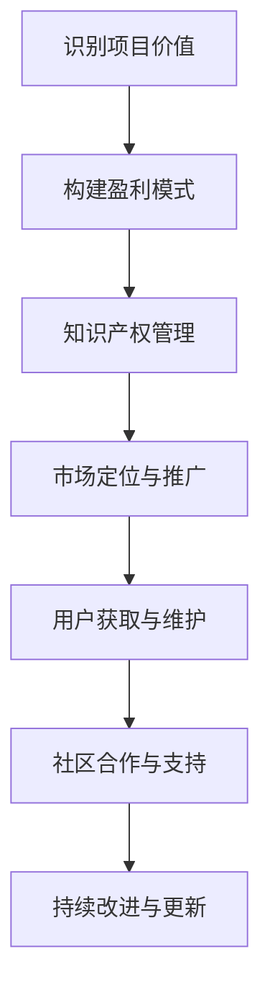

                 

关键词：开源项目、商业化、平衡、程序员、可持续性、合作、盈利模式、市场策略

> 摘要：本文探讨了程序员如何将开源项目商业化，实现开源与商业的平衡。通过对开源项目的特点、商业化的挑战和策略的分析，结合实际案例，提出了开源项目商业化的可行路径和成功要素，旨在为程序员提供实用的指导和建议。

## 1. 背景介绍

开源项目在过去的几十年里已经成为软件开发的一个重要组成部分。其核心理念是开放源代码、共享知识、共同改进，这种模式极大地促进了技术的创新和传播。然而，随着开源项目的规模和影响力不断扩大，如何将开源项目商业化，实现开源与商业的平衡，成为许多程序员和项目维护者面临的重要问题。

开源项目的商业化不仅关系到项目的可持续发展和维护，也关系到程序员自身的经济收益。在开源与商业之间寻找平衡，既是机遇也是挑战。本文将探讨开源项目的特点、商业化的挑战和策略，以及成功的实践案例，为程序员提供关于如何将开源项目商业化的指导。

## 2. 核心概念与联系

### 2.1 开源项目的特点

开源项目具有以下主要特点：

- **开放性**：开源项目的源代码对公众开放，任何人都可以自由查看、修改和分发。
- **合作性**：开源项目的开发过程通常涉及多个贡献者，他们通过协作共同改进项目。
- **透明性**：开源项目的开发过程是公开透明的，所有人都可以跟踪项目的进展和问题。
- **灵活性**：开源项目通常具有高度的灵活性，可以根据用户的需求进行定制和扩展。

### 2.2 商业化的挑战

商业化开源项目面临以下主要挑战：

- **盈利模式不清晰**：许多开源项目的创始人在开源初期并没有明确的盈利模式，难以将商业利益与开源理念相结合。
- **知识产权保护**：开源项目的源代码是公开的，如何在保持开源的前提下保护知识产权，是一个复杂的问题。
- **用户信任问题**：商业化的开源项目需要赢得用户的信任，这往往是一个长期的过程。
- **资源分配困难**：在开源项目中，时间和资源通常由志愿者提供，商业化的过程中需要确保资源的有效利用。

### 2.3 商业化的策略

要成功商业化开源项目，程序员可以采取以下策略：

- **产品多样化**：通过开发与开源项目相关的产品和服务，如付费插件、定制服务或培训课程，实现盈利。
- **社区参与**：积极与开源社区的成员互动，建立信任和合作关系，为商业活动提供支持。
- **知识产权管理**：通过合适的知识产权策略，如专利、版权和商标，保护项目的核心技术和价值。
- **市场定位**：明确项目的市场定位，针对特定的用户群体提供有吸引力的解决方案。

### 2.4 Mermaid 流程图

以下是开源项目商业化的 Mermaid 流程图：



## 3. 核心算法原理 & 具体操作步骤

### 3.1 算法原理概述

开源项目的商业化过程可以被视为一种算法，其核心原理是：

- **价值识别**：通过分析项目的技术特点和市场潜力，识别项目的商业价值。
- **盈利模式构建**：设计适合项目的盈利模式，如产品多样化、付费服务或赞助等。
- **知识产权保护**：采取合适的知识产权策略，保护项目的核心技术和价值。
- **市场定位与推广**：明确目标市场，制定有效的市场策略，提高项目的知名度和用户信任度。
- **社区合作与支持**：建立与开源社区的紧密联系，共同推动项目的商业成功。

### 3.2 算法步骤详解

#### 3.2.1 价值识别

- **技术评估**：评估项目的技术成熟度、创新性和实用性。
- **市场分析**：分析目标市场的需求、竞争态势和潜在用户。
- **成本效益分析**：计算项目商业化的成本和预期收益，评估盈利潜力。

#### 3.2.2 盈利模式构建

- **产品多样化**：开发与项目相关的多种产品和服务，满足不同用户的需求。
- **付费服务**：提供付费的插件、定制开发、技术支持等。
- **赞助与资助**：寻求企业的赞助和政府的资助，为项目提供资金支持。

#### 3.2.3 知识产权保护

- **专利申请**：对项目的核心技术进行专利申请，保护项目的知识产权。
- **版权注册**：对项目的源代码和文档进行版权注册，确保版权归属清晰。
- **商标注册**：注册项目的商标，保护项目的品牌形象。

#### 3.2.4 市场定位与推广

- **市场研究**：深入研究目标市场的需求、偏好和行为，制定精准的市场定位策略。
- **品牌建设**：建立项目的品牌形象，提高项目的知名度和用户信任度。
- **推广策略**：通过社交媒体、专业论坛、技术会议等多种渠道，推广项目。

#### 3.2.5 社区合作与支持

- **社区互动**：积极参与开源社区，与社区成员建立良好的合作关系。
- **社区贡献**：鼓励社区成员为项目贡献代码、文档和测试。
- **社区活动**：组织或参与开源社区的活动，增强社区凝聚力。

### 3.3 算法优缺点

**优点**：

- **灵活性强**：开源项目的商业化过程可以根据实际情况灵活调整。
- **可持续性**：通过盈利模式，项目可以持续得到资金支持，确保长期发展。
- **创新性**：开源项目通常具有创新性，商业化过程可以进一步推动技术创新。

**缺点**：

- **初期投入大**：开源项目的商业化需要投入大量时间和资源，尤其是在初期。
- **市场不确定性**：市场变化难以预测，商业化的过程可能面临不确定性。

### 3.4 算法应用领域

开源项目的商业化算法适用于多种领域，如：

- **软件开发**：通过商业化，开源项目可以成为企业级解决方案，为用户提供更专业的服务。
- **数据分析**：开源数据分析工具可以通过商业化的方式，提供定制化服务和技术支持。
- **人工智能**：开源人工智能项目可以通过商业化，为企业和个人提供智能解决方案。

## 4. 数学模型和公式 & 详细讲解 & 举例说明

### 4.1 数学模型构建

开源项目的商业化可以被视为一个数学模型，其核心公式为：

\[ \text{收益} = \text{用户数} \times \text{平均付费意愿} \times \text{付费转化率} \]

其中：

- **收益**：项目通过商业化活动获得的收入。
- **用户数**：项目的用户数量。
- **平均付费意愿**：用户愿意为项目支付的平均金额。
- **付费转化率**：用户转化为付费用户的比例。

### 4.2 公式推导过程

开源项目的商业化收益可以通过以下步骤推导：

1. **用户获取**：通过市场推广和社区活动，增加项目的用户数量。
2. **用户转化**：提高用户的付费意愿，促使用户转化为付费用户。
3. **付费金额**：根据用户的需求和项目的价值，确定用户愿意支付的平均金额。
4. **收益计算**：将用户数量、付费意愿和付费转化率代入公式，计算项目的收益。

### 4.3 案例分析与讲解

以一个开源的代码托管平台为例，其商业化的过程可以分析如下：

- **用户数**：平台有 100,000 名活跃用户。
- **平均付费意愿**：根据市场调研，用户愿意为平台支付的平均金额为 10 美元。
- **付费转化率**：通过分析，付费转化率为 10%。

代入公式，得到：

\[ \text{收益} = 100,000 \times 10 \times 0.1 = 100,000 \text{美元} \]

这意味着，通过商业化的方式，该平台每个月可以获得 100,000 美元的收入。

### 4.4 案例应用

另一个案例是一个开源的人工智能工具，其商业化过程如下：

- **用户数**：工具有 5,000 名企业用户。
- **平均付费意愿**：根据市场调研，企业用户愿意为工具支付的平均金额为 1,000 美元。
- **付费转化率**：通过分析，付费转化率为 20%。

代入公式，得到：

\[ \text{收益} = 5,000 \times 1,000 \times 0.2 = 100,000 \text{美元} \]

这意味着，通过商业化的方式，该工具每个月可以获得 100,000 美元的收入。

## 5. 项目实践：代码实例和详细解释说明

### 5.1 开发环境搭建

为了实践开源项目的商业化，首先需要搭建一个适合的开发环境。以下是搭建环境的基本步骤：

1. **安装操作系统**：选择一个稳定且支持开源项目的操作系统，如 Ubuntu 20.04。
2. **安装开发工具**：安装必要的开发工具，如 Python 3、Git 和 Docker。
3. **配置代码库**：从开源代码库中克隆项目，并进行配置。

### 5.2 源代码详细实现

以一个开源的博客平台为例，其源代码实现如下：

```python
# 博客平台的主程序
from flask import Flask, render_template, request

app = Flask(__name__)

@app.route('/')
def home():
    return render_template('home.html')

@app.route('/post/new', methods=['GET', 'POST'])
def create_post():
    if request.method == 'POST':
        title = request.form['title']
        content = request.form['content']
        # 存储博客数据到数据库
        save_post(title, content)
        return redirect('/')
    return render_template('create_post.html')

def save_post(title, content):
    # 实现博客数据存储的逻辑
    pass

if __name__ == '__main__':
    app.run(debug=True)
```

### 5.3 代码解读与分析

上述代码是一个简单的博客平台的主程序，包括两个路由：首页和新建博客页面。代码的核心逻辑如下：

- **首页**：渲染首页模板，展示博客列表。
- **新建博客**：渲染新建博客页面，接受用户输入的标题和内容，并将数据存储到数据库。

### 5.4 运行结果展示

通过运行上述代码，可以启动博客平台的服务，用户可以在浏览器中访问，并进行新建博客的操作。

## 6. 实际应用场景

开源项目的商业化在不同领域有着广泛的应用。以下是几个实际应用场景的例子：

### 6.1 软件开发

许多开源软件项目通过提供付费插件、定制开发和技术支持等方式实现商业化。例如，开源的代码管理工具 GitLab 就通过提供企业版服务，为企业用户提供额外的功能和支持，实现了商业成功。

### 6.2 数据分析

开源的数据分析工具，如 Pandas 和 NumPy，通过提供付费培训课程、定制化数据分析和技术支持等服务，实现了商业盈利。这些工具的社区活跃度高，用户对培训课程和技术支持的需求较大，为商业化提供了良好的基础。

### 6.3 人工智能

开源的人工智能项目，如 TensorFlow 和 PyTorch，通过提供企业版服务、付费插件和定制化解决方案，实现了商业化。这些项目的技术实力强大，应用广泛，为商业成功提供了坚实的基础。

## 7. 未来应用展望

随着技术的不断发展，开源项目的商业化前景将更加广阔。以下是几个未来应用展望：

### 7.1 人工智能与自动化

人工智能技术的发展将推动自动化工具的普及，开源项目可以通过提供自动化解决方案，实现商业化。例如，开源的自动化工具 Jenkins 和 GitLab CI 可以为企业用户提供付费的自动化服务。

### 7.2 区块链技术

区块链技术的兴起将为开源项目提供新的商业化机会。开源的区块链平台，如 Ethereum 和 Hyperledger，可以通过提供付费的区块链解决方案、区块链应用开发和培训等服务，实现商业化。

### 7.3 云计算与大数据

云计算和大数据技术的不断发展将为开源项目提供更多的商业化机会。开源的云计算平台，如 OpenStack 和 Kubernetes，可以通过提供付费的云服务和大数据分析服务，实现商业化。

## 8. 工具和资源推荐

为了帮助程序员更好地将开源项目商业化，以下是几个推荐的工具和资源：

### 8.1 学习资源推荐

- **《开源项目管理与运营》**：本书详细介绍了开源项目的管理、运营和商业化策略。
- **《开源经济》**：本书探讨了开源项目的商业模式、盈利模式和市场策略。

### 8.2 开发工具推荐

- **GitHub**：GitHub 是最受欢迎的开源代码托管平台，提供丰富的工具和资源，支持开源项目的开发和商业化。
- **GitLab**：GitLab 提供与 GitHub 类似的功能，同时支持私有项目和商业化的功能。

### 8.3 相关论文推荐

- **“Open Source Models of Commercialization: Insights from the Software Industry”**：本文探讨了开源项目的商业化模式，为程序员提供了实用的指导。
- **“The Economics of Open Source”**：本文从经济学角度分析了开源项目的商业模式和盈利模式。

## 9. 总结：未来发展趋势与挑战

开源项目的商业化在未来将继续发展，但同时也面临许多挑战。未来发展趋势包括：

- **技术创新**：开源项目将继续推动技术创新，为企业提供更多的商业机会。
- **商业模式多样化**：开源项目的商业化模式将更加多样化，包括付费插件、定制服务、培训课程等多种形式。
- **社区参与**：开源社区的积极参与将为项目带来更多的机会和资源。

面对挑战，程序员需要：

- **平衡开源与商业**：在保持开源理念的同时，找到合适的商业模式，实现开源与商业的平衡。
- **保护知识产权**：采取合适的知识产权策略，保护项目的核心技术和价值。
- **持续改进与更新**：保持项目的持续改进和更新，满足用户需求，提高项目竞争力。

总之，开源项目的商业化是一个复杂的任务，需要程序员具备多方面的能力和经验。通过合理的策略和实践，程序员可以实现开源项目的商业化，同时保持项目的开源理念。

## 10. 附录：常见问题与解答

### 10.1 开源项目的商业化是否合法？

开源项目的商业化是合法的。开源项目的核心原则是开放源代码，允许用户自由查看、修改和分发。商业化的过程通常包括提供与项目相关的付费产品和服务，这并不违反开源协议。

### 10.2 如何确保开源项目的可持续性？

确保开源项目的可持续性需要以下措施：

- **稳定的资金来源**：通过商业化活动，如付费插件、定制服务或赞助，为项目提供稳定的资金支持。
- **社区合作**：与开源社区建立良好的合作关系，鼓励社区成员参与项目，共同推动项目的发展。
- **持续更新与改进**：定期更新项目，修复漏洞，增加新功能，确保项目的竞争力。

### 10.3 商业化会对开源社区的贡献者产生什么影响？

商业化的过程可能会对开源社区的贡献者产生以下影响：

- **经济回报**：通过商业化的方式，贡献者可以获得一定的经济回报，激励他们继续参与项目。
- **项目管理**：商业化的项目可能会引入更多的管理流程，这可能会影响社区成员的参与自由度。
- **透明度**：商业化的项目需要保持透明度，公开商业化的决策和进展，确保社区成员的知情权。

### 10.4 如何平衡开源与商业之间的冲突？

平衡开源与商业之间的冲突需要采取以下策略：

- **明确的盈利模式**：设计清晰的盈利模式，确保商业利益与开源理念的有机结合。
- **透明的沟通**：保持与社区成员的透明沟通，公开商业化的决策和进展，获取社区的反馈和支持。
- **持续改进**：通过持续改进项目，提高项目的质量和用户满意度，实现开源与商业的良性循环。

### 10.5 开源项目的商业化前景如何？

开源项目的商业化前景非常广阔。随着技术的不断发展，开源项目在各个领域的应用越来越广泛，商业化的潜力也日益凸显。通过合理的商业模式和有效的管理策略，开源项目可以实现商业成功，同时保持开源理念。

