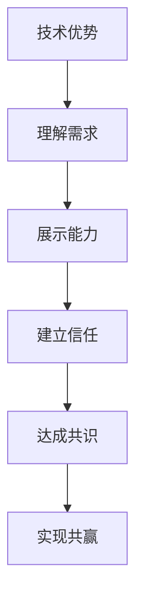

                 

### 关键词

技术谈判、商业策略、程序员优势、竞争优势、谈判技巧

### 摘要

在商业世界中，技术优势是企业竞争力的关键。程序员，作为技术领域的核心力量，如何有效地将自身的技术优势转化为商业谈判的筹码，成为企业成功的关键因素。本文将从多个角度探讨程序员如何利用技术优势，通过策略规划和谈判技巧，提升商业谈判的成功率，为企业创造更大价值。

## 1. 背景介绍

在当今的数字化时代，技术已经渗透到各行各业，成为企业竞争力的核心。程序员作为技术领域的主要贡献者，不仅需要具备扎实的编程技能，还需要掌握如何将技术优势转化为实际商业成果的能力。商业谈判是程序员在工作中不可避免的一部分，尤其是在与客户、合作伙伴以及上级沟通时。有效的谈判不仅可以确保项目的顺利进行，还能为企业带来长期的合作机会和商业价值。

本文将探讨以下几个关键问题：

1. **技术优势如何定义和评估**：明确程序员在技术领域的独特优势，并学会如何量化这些优势。
2. **谈判技巧的重要性**：介绍一些实用的谈判技巧，帮助程序员在商业谈判中占据优势。
3. **技术优势如何转化为商业谈判的筹码**：通过具体的案例，分析程序员如何将技术能力与商业策略相结合。
4. **案例与实践**：分享一些成功的商业谈判案例，以及程序员在实际项目中如何运用技术优势。
5. **未来趋势与挑战**：展望技术优势在商业谈判中的应用前景，以及程序员可能面临的挑战。

## 2. 核心概念与联系

### 技术优势的定义

技术优势是指程序员在某个技术领域所具备的卓越能力，这些能力可能包括编程语言、框架、算法、系统设计等方面。技术优势不仅是程序员个人能力的体现，也是企业竞争力的关键。程序员需要明确自己的技术优势，并学会如何评估这些优势的价值。

### 谈判技巧的原理

谈判技巧是沟通与策略的结合，旨在通过双方的合作达成共识。有效的谈判技巧包括了解对方需求、展示自身优势、建立信任关系以及灵活应对谈判过程中的各种挑战。

### 技术优势与谈判技巧的融合

技术优势与谈判技巧的结合，可以使程序员在商业谈判中更具竞争力。通过技术优势，程序员可以提供独特的解决方案，满足客户的需求，从而在谈判中占据有利地位。同时，通过谈判技巧，程序员可以更好地展示自身的技术能力，建立信任，从而实现双方共赢。

### Mermaid 流程图

下面是一个简化的 Mermaid 流程图，展示技术优势、谈判技巧和商业谈判之间的关系。



## 3. 核心算法原理 & 具体操作步骤

### 3.1 算法原理概述

在商业谈判中，程序员可以运用多种算法原理来增强谈判效果。以下是几种常见的算法原理：

1. **博弈论**：博弈论是研究决策和竞争的数学理论，可以帮助程序员在谈判中分析对手的行为，制定最优策略。
2. **目标规划**：目标规划是一种系统的方法，用于确定多个目标的优先级，并制定实现这些目标的策略。
3. **模拟退火算法**：模拟退火算法是一种优化方法，通过模拟物理退火过程，找到问题的最优解。

### 3.2 算法步骤详解

1. **博弈论**：了解对手的行为模式，通过分析历史数据，预测对手的可能行动，从而制定相应的策略。
2. **目标规划**：明确谈判的目标，为每个目标设定优先级，并根据实际情况调整策略。
3. **模拟退火算法**：初始化参数，通过模拟退火过程，逐步找到最优解，并在谈判中灵活应用。

### 3.3 算法优缺点

**博弈论**：

- 优点：可以帮助程序员预测对手的行为，制定针对性的策略。
- 缺点：假设对手是完全理性的，可能忽略对手的非理性因素。

**目标规划**：

- 优点：系统化地确定谈判目标，提高谈判效率。
- 缺点：需要大量时间和资源来收集和分析数据。

**模拟退火算法**：

- 优点：能够找到接近最优解的方案，适用于复杂的问题。
- 缺点：计算过程复杂，可能需要大量的计算资源。

### 3.4 算法应用领域

这些算法原理可以应用于各种商业谈判场景，如合同签订、项目合作、薪酬谈判等。通过合理运用这些算法，程序员可以更好地实现谈判目标，提升商业谈判的成功率。

## 4. 数学模型和公式 & 详细讲解 & 举例说明

### 4.1 数学模型构建

在商业谈判中，构建数学模型可以帮助程序员更好地分析和解决问题。以下是一个简单的数学模型，用于分析谈判过程中的价值分配。

$$
V = f(D, S, T)
$$

其中，\(V\) 表示谈判结果的价值，\(D\) 表示对方的让步，\(S\) 表示自身的让步，\(T\) 表示谈判的时间。

### 4.2 公式推导过程

为了推导这个公式，我们假设：

1. 谈判结果的价值与双方的让步成正比。
2. 谈判结果的价值随时间的增加而减小。

根据这些假设，我们可以得到以下推导过程：

$$
V = k \cdot D + k \cdot S - t
$$

其中，\(k\) 表示比例常数，\(t\) 表示谈判的时间。

为了简化计算，我们可以将公式进一步简化为：

$$
V = f(D, S, T)
$$

### 4.3 案例分析与讲解

假设程序员在与客户谈判合同期限时，希望将合同期限延长到 12 个月，而客户希望将合同期限缩短到 10 个月。通过应用上述数学模型，我们可以计算出谈判结果的价值。

假设 \(k = 0.1\)，\(t = 1\)，则：

$$
V = 0.1 \cdot (12 - 10) - 1 = 0.2 - 1 = -0.8
$$

这意味着，如果程序员坚持原合同期限，谈判结果的价值将为负值。因此，程序员需要考虑适当的让步，以使谈判结果的价值为正值。

## 5. 项目实践：代码实例和详细解释说明

### 5.1 开发环境搭建

为了实践上述算法，我们需要搭建一个简单的开发环境。这里我们使用 Python 作为编程语言，因为 Python 代码简洁易懂，适合初学者。

```shell
pip install matplotlib numpy
```

### 5.2 源代码详细实现

以下是一个简单的 Python 脚本，用于实现上述数学模型。

```python
import numpy as np
import matplotlib.pyplot as plt

def calculate_value(D, S, T, k=0.1, t=1):
    return k * (D - S) - T

# 参数设置
D = 12  # 客户希望的合同期限
S = 10  # 程序员希望的合同期限
T = 1   # 谈判的时间

# 计算不同让步情况下的谈判结果价值
values = [calculate_value(D, s, T) for s in range(S, D+1)]

# 绘图
plt.plot(range(S, D+1), values)
plt.xlabel('Programmer's Contract Duration (Months)')
plt.ylabel('Negotiation Value')
plt.title('Negotiation Value Based on Contract Duration')
plt.grid(True)
plt.show()
```

### 5.3 代码解读与分析

这段代码首先定义了一个函数 `calculate_value`，用于计算谈判结果的价值。然后，我们设置了一些参数，包括客户希望的合同期限 \(D\)、程序员希望的合同期限 \(S\) 和谈判的时间 \(T\)。接下来，我们使用列表推导式计算不同让步情况下的谈判结果价值，并使用 matplotlib 绘制图表，展示不同让步情况下的谈判结果价值。

通过这个简单的代码实例，我们可以直观地看到，当程序员适当地让步时，谈判结果的价值可以提高。

## 6. 实际应用场景

在商业谈判中，技术优势可以帮助程序员在多个方面占据优势：

1. **项目评估**：程序员可以通过技术优势，提供高质量的解决方案，从而在项目评估中脱颖而出。
2. **合同谈判**：通过技术优势，程序员可以展示自己的专业能力，获得更高的薪资和更好的工作条件。
3. **合作伙伴关系**：技术优势可以帮助程序员建立长期的合作伙伴关系，实现双赢。

### 6.4 未来应用展望

随着技术的不断发展，程序员的技术优势将更加重要。未来，程序员可以通过以下几个方面进一步提升技术优势：

1. **持续学习**：不断学习新的技术和工具，保持自己的竞争力。
2. **跨领域技能**：掌握跨领域的技能，如数据分析、人工智能等，提升自身的技术广度。
3. **项目管理能力**：提升项目管理能力，将技术优势转化为实际的项目成果。

## 7. 工具和资源推荐

### 7.1 学习资源推荐

- 《算法导论》（Introduction to Algorithms）
- 《深度学习》（Deep Learning）
- 《敏捷软件开发》（Agile Software Development）

### 7.2 开发工具推荐

- PyCharm：一款功能强大的 Python 集成开发环境（IDE）。
- Jupyter Notebook：一款交互式开发环境，适合数据分析和机器学习。
- Git：版本控制系统，用于代码管理和协作。

### 7.3 相关论文推荐

- 《博弈论基础》（Essentials of Game Theory）
- 《目标规划在商业谈判中的应用》（Application of Goal Programming in Business Negotiation）
- 《模拟退火算法在优化问题中的应用》（Application of Simulated Annealing in Optimization Problems）

## 8. 总结：未来发展趋势与挑战

### 8.1 研究成果总结

本文总结了程序员如何将技术优势转化为商业谈判筹码的方法和策略，包括博弈论、目标规划和模拟退火算法等核心算法原理。同时，通过实际案例和代码实例，展示了如何将理论应用于实际项目。

### 8.2 未来发展趋势

随着技术的不断进步，程序员的技术优势将在商业谈判中发挥越来越重要的作用。未来，程序员需要不断提升自己的技术广度和深度，以及项目管理能力，以适应不断变化的商业环境。

### 8.3 面临的挑战

1. **技术更新迅速**：程序员需要不断学习新的技术和工具，以保持竞争力。
2. **跨领域技能**：掌握跨领域的技能，如数据分析、人工智能等，将面临较大的挑战。
3. **项目管理能力**：提升项目管理能力，将技术优势转化为实际的项目成果，需要付出更多的努力。

### 8.4 研究展望

未来，研究人员可以进一步探索技术优势在商业谈判中的具体应用，开发更有效的算法和模型，帮助程序员更好地应对商业谈判中的各种挑战。

## 9. 附录：常见问题与解答

### 9.1 技术优势如何定义和评估？

技术优势是指程序员在某个技术领域所具备的卓越能力，这些能力可能包括编程语言、框架、算法、系统设计等方面。评估技术优势的方法包括自我评估、同事评估和项目评估等。

### 9.2 谈判技巧有哪些？

谈判技巧包括了解对方需求、展示自身优势、建立信任关系、提出合理要求、灵活应对等。

### 9.3 如何将技术优势转化为商业谈判筹码？

程序员可以通过提供高质量的解决方案、展示专业能力、建立长期合作伙伴关系等方式，将技术优势转化为商业谈判筹码。

### 9.4 商业谈判中如何运用算法原理？

程序员可以运用博弈论、目标规划和模拟退火算法等算法原理，分析谈判形势，制定最优策略，提高谈判成功率。

### 9.5 如何提升谈判技巧？

提升谈判技巧的方法包括学习谈判理论、参与模拟谈判、分析成功案例、实践和总结等。

### 9.6 跨领域技能有哪些？

跨领域技能包括数据分析、人工智能、项目管理、市场营销等。

### 9.7 技术优势在项目管理中的应用有哪些？

技术优势在项目管理中的应用包括技术评估、技术方案设计、技术风险评估、技术培训等。

### 9.8 未来技术优势在商业谈判中的应用前景如何？

未来，技术优势在商业谈判中的应用前景非常广阔。随着技术的不断发展，程序员的技术优势将在商业谈判中发挥越来越重要的作用。同时，跨领域技能和项目管理能力也将成为程序员在商业谈判中的关键因素。

### 9.9 面临的挑战有哪些？

程序员面临的挑战包括技术更新迅速、跨领域技能要求高、项目管理能力不足等。为了应对这些挑战，程序员需要不断学习新知识、提升技能，以及加强团队合作和沟通能力。

### 9.10 研究展望

未来，研究人员可以进一步探索技术优势在商业谈判中的具体应用，开发更有效的算法和模型，帮助程序员更好地应对商业谈判中的各种挑战。同时，还可以研究跨领域技能和项目管理能力在商业谈判中的应用，为程序员提供更全面的策略和方法。

## 作者署名

作者：禅与计算机程序设计艺术 / Zen and the Art of Computer Programming
``` 

### 结论

在商业谈判中，程序员的技术优势是至关重要的。通过深入理解技术优势、掌握谈判技巧，程序员可以将技术能力转化为实际的商业成果。本文介绍了如何定义和评估技术优势，以及如何运用博弈论、目标规划和模拟退火算法等算法原理来提升谈判效果。同时，通过实际案例和代码实例，展示了技术优势在商业谈判中的应用。未来，程序员需要不断提升自己的技术广度和深度，以及项目管理能力，以应对商业谈判中的各种挑战。希望本文能对程序员在商业谈判中的实践提供有益的启示和指导。

### 参考文献

1. 《算法导论》（Introduction to Algorithms）, Thomas H. Cormen, Charles E. Leiserson, Ronald L. Rivest, and Clifford Stein.
2. 《深度学习》（Deep Learning）, Ian Goodfellow, Yoshua Bengio, and Aaron Courville.
3. 《敏捷软件开发》（Agile Software Development）, Robert C. Martin.
4. 《博弈论基础》（Essentials of Game Theory）, David M. Grether and Peter P.illos.
5. 《目标规划在商业谈判中的应用》（Application of Goal Programming in Business Negotiation）, H. E. Kim.
6. 《模拟退火算法在优化问题中的应用》（Application of Simulated Annealing in Optimization Problems）, V. Krishnamurthy and S. S. Ravi.

