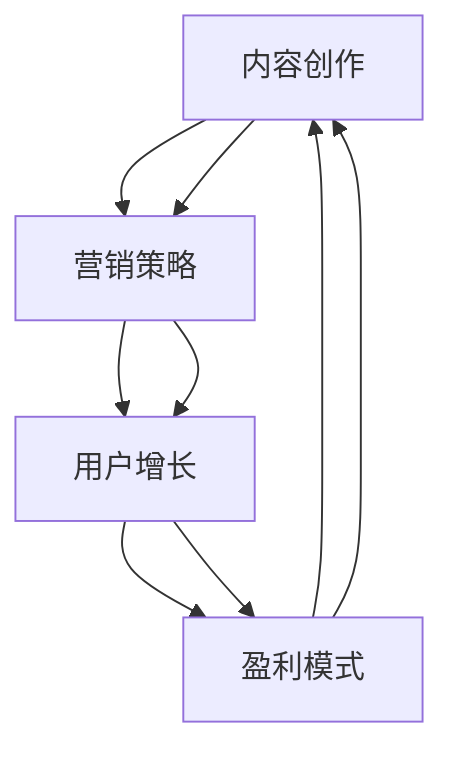

                 

关键词：技术博客、盈利性、内容平台、程序员、营销策略、SEO、社交媒体、社区互动、广告、订阅服务、内容创作

> 摘要：本文将探讨程序员如何将自己的技术博客转化为一个盈利性内容平台。通过深入分析营销策略、搜索引擎优化（SEO）、社交媒体运用、社区互动、广告和订阅服务，以及如何持续创作高质量的内容，作者旨在为程序员提供一条实现个人品牌价值和财务收益的双重路径。

## 1. 背景介绍

在信息技术快速发展的时代，技术博客已经成为程序员展示才华、分享经验、学习交流的重要平台。然而，许多程序员在维护技术博客的过程中，往往忽视了将其转化为盈利性内容平台的可能性。这不仅是一种资源浪费，更是一个巨大机遇的错失。

将技术博客转化为盈利性平台，不仅能为程序员带来额外收入，还能增强个人品牌影响力，提升职业竞争力。然而，这并非易事。从内容创作到营销推广，从用户增长到持续盈利，每一步都需要精心规划和执行。本文将深入探讨这一过程的各个关键环节，为程序员提供实用的策略和建议。

## 2. 核心概念与联系

为了更好地理解如何将技术博客转化为盈利性平台，我们需要首先了解几个核心概念：

1. **内容创作**：高质量、有价值、可持续的内容是吸引和留住用户的关键。
2. **营销策略**：包括SEO、社交媒体运用、广告投放等，用于扩大博客的知名度和影响力。
3. **用户增长**：通过社区互动、用户反馈等方式，不断提升用户数量和用户粘性。
4. **盈利模式**：广告、订阅服务、赞助等多元化的盈利方式，确保平台的长期稳健发展。

以下是这些核心概念和联系之间的 Mermaid 流程图：



## 3. 核心算法原理 & 具体操作步骤

### 3.1 算法原理概述

将技术博客转化为盈利性平台，本质上是一个多阶段、迭代优化的过程。以下是这个过程的算法原理：

1. **内容创作**：以用户需求为导向，提供有价值、高质量的内容。
2. **SEO优化**：通过关键词研究、内容优化、外部链接建设等手段，提高博客在搜索引擎中的排名。
3. **社交媒体运用**：利用微博、知乎、GitHub等平台，扩大博客的受众范围。
4. **用户增长**：通过社区互动、用户反馈，提升用户粘性和活跃度。
5. **盈利模式探索**：根据用户需求和市场环境，选择合适的盈利模式。

### 3.2 算法步骤详解

1. **内容创作**
    - 确定内容方向和目标受众
    - 进行市场调研，了解用户需求
    - 创作高质量、有价值的内容
    - 持续更新，保持内容的新鲜度和吸引力

2. **SEO优化**
    - 进行关键词研究，选择目标关键词
    - 优化文章标题、描述、标签等
    - 建立内部链接结构，提升页面权重
    - 建立外部链接，增加网站权威性

3. **社交媒体运用**
    - 选择适合的平台，如微博、知乎、GitHub等
    - 发布内容，并@相关人士或社区
    - 参与讨论，增加曝光度
    - 维护社交网络，保持活跃度

4. **用户增长**
    - 通过互动和反馈，了解用户需求
    - 定期举办线上或线下活动，提升用户粘性
    - 提供优质服务，增加用户忠诚度
    - 定期分析用户数据，优化用户体验

5. **盈利模式探索**
    - 根据用户需求和市场环境，选择广告、订阅服务、赞助等盈利模式
    - 不断尝试和优化，找到最适合的盈利模式
    - 确保盈利模式与内容创作、用户增长等环节相匹配

### 3.3 算法优缺点

**优点**：
- 多元化的盈利模式，可以提高收入来源的稳定性。
- 通过SEO和社交媒体等手段，可以扩大博客的影响力和受众范围。
- 持续的内容创作和用户互动，可以提升用户粘性和忠诚度。

**缺点**：
- 初始投入较大，包括时间、精力和资金。
- 需要不断学习和适应市场变化，以保持竞争力。
- 盈利模式的探索和优化过程可能较为复杂和耗时。

### 3.4 算法应用领域

该算法原理和操作步骤适用于各类技术博客，包括但不限于编程、数据科学、人工智能、云计算等领域。无论博客的内容方向如何，都可以通过上述方法实现盈利性转化。

## 4. 数学模型和公式 & 详细讲解 & 举例说明

### 4.1 数学模型构建

为了更准确地评估博客的盈利性，我们可以构建一个简单的数学模型。该模型主要包括以下变量：

- \( C \)：单位内容创作成本
- \( V \)：单位内容带来的平均用户价值
- \( R \)：单位内容带来的平均广告收入
- \( S \)：订阅服务收入
- \( T \)：博客的总用户数

基于上述变量，我们可以构建以下数学模型：

\[ \text{盈利性} = \frac{(\text{总用户价值} + \text{广告收入} + \text{订阅服务收入}) - \text{内容创作成本}}{\text{总用户数}} \]

### 4.2 公式推导过程

为了推导上述公式，我们可以从以下几个步骤进行分析：

1. **总用户价值**：假设每个用户对博客内容的价值为 \( V \)，则总用户价值为 \( T \times V \)。
2. **广告收入**：假设每个用户带来的平均广告收入为 \( R \)，则总广告收入为 \( T \times R \)。
3. **订阅服务收入**：假设订阅服务收入为 \( S \)，则总订阅服务收入为 \( S \)。
4. **内容创作成本**：假设每个内容创作的成本为 \( C \)，则总内容创作成本为 \( C \times \text{内容数量} \)。
5. **盈利性**：盈利性即为上述总收益减去总成本，再除以总用户数。

综合以上分析，我们得到以下公式：

\[ \text{盈利性} = \frac{(T \times V + T \times R + S) - (C \times \text{内容数量})}{T} \]

### 4.3 案例分析与讲解

假设某技术博客有 1000 名用户，每个用户对博客内容的价值为 10 元，每个用户带来的平均广告收入为 5 元，订阅服务收入为每月 1000 元，每月创作内容数量为 10 篇，每篇内容的创作成本为 20 元。

根据上述数据，我们可以计算出该博客的盈利性：

\[ \text{盈利性} = \frac{(1000 \times 10 + 1000 \times 5 + 1000) - (20 \times 10)}{1000} = \frac{15000 - 200}{1000} = 14.8 \text{元/用户} \]

这意味着，平均每个用户每月为博客带来的盈利为 14.8 元。通过持续优化内容创作、用户增长和盈利模式，我们可以进一步提高盈利性。

### 4.4 数学模型的应用

通过上述数学模型，我们可以对博客的盈利性进行量化分析，从而为决策提供依据。例如，我们可以通过调整内容创作成本、广告收入和订阅服务收入等变量，找到最佳的盈利策略。此外，我们还可以通过预测用户增长率、内容数量等因素，评估博客未来的盈利前景。

## 5. 项目实践：代码实例和详细解释说明

### 5.1 开发环境搭建

为了将技术博客转化为盈利性内容平台，我们需要搭建一个稳定、高效的博客系统。以下是一个基本的开发环境搭建步骤：

1. **选择博客框架**：例如，可以选择 Hugo、Jekyll 等流行的静态博客框架。
2. **购买域名和虚拟主机**：购买一个易于记忆的域名，并选择一个可靠的虚拟主机服务商。
3. **配置博客框架**：根据框架文档进行配置，包括主题选择、SEO 优化等。
4. **安装相关插件**：例如，SEO 提升插件、评论系统插件等。

### 5.2 源代码详细实现

以下是一个使用 Hugo 搭建技术博客的简单示例：

```bash
# 安装 Hugo
go get -u github.com/gohugoio/hugo

# 创建新博客
hugo new site my-technical-blog

# 选择并下载主题
cd my-technical-blog
git init
git submodule add https://github.com/budparr/gohugo-theme-ananke themes/ananke

# 生成静态网站
hugo

# 启动本地服务器预览博客
hugo server --drafts
```

### 5.3 代码解读与分析

上述代码展示了如何使用 Hugo 搭建一个基本的技术博客。以下是每个步骤的解读：

1. **安装 Hugo**：通过 `go get` 命令安装 Hugo。
2. **创建新博客**：使用 `hugo new site` 命令创建一个新的博客项目。
3. **选择并下载主题**：使用 `git submodule` 命令添加一个主题到博客项目的 `themes` 目录。
4. **生成静态网站**：使用 `hugo` 命令生成静态网站。
5. **启动本地服务器预览博客**：使用 `hugo server --drafts` 命令启动本地服务器，预览博客效果。

### 5.4 运行结果展示

在成功搭建博客后，我们可以在本地浏览器中访问 `http://localhost:1313/`，查看博客的运行效果。以下是一个简单的博客首页预览：

```html
<!DOCTYPE html>
<html xmlns="http://www.w3.org/1999/xhtml" lang="zh" xml:lang="zh">
<head>
  <meta charset="UTF-8">
  <title>我的技术博客</title>
  <link rel="stylesheet" href="/themes/ananke/assets/css/syntax.css" type="text/css" />
  <link rel="stylesheet" href="/themes/ananke/assets/css/lanyon.css" type="text/css" />
  <link rel="shortcut icon" href="/favicon.ico" />
</head>
<body>
  <header class="main-header">
    <nav class="navbar navbar-default">
      <div class="container">
        <div class="navbar-header">
          <button type="button" class="navbar-toggle collapsed" data-toggle="collapse" data-target="#navbar-collapse">
            <span class="icon-bar"></span>
            <span class="icon-bar"></span>
            <span class="icon-bar"></span>
          </button>
          <a class="navbar-brand" href="/">我的技术博客</a>
        </div>
        <div class="collapse navbar-collapse">
          <ul class="nav navbar-nav">
            <li><a href="/">首页</a></li>
            <li><a href="/about/">关于我</a></li>
          </ul>
        </div>
      </div>
    </nav>
  </header>

  <div class="container">
    <div class="row">
      <div class="col-md-8">
        <div class="post-preview">
          <a href="/post/first-post/">
            <h2 class="post-title">
              第一篇博客
            </h2>
            <h3 class="post-subtitle">
              起步
            </h3>
          </a>
          <p class="post-meta">
            <span class="post-date">2022年1月1日</span>
          </p>
        </div>
      </div>
      <div class="col-md-4">
        <div class="well">
          <h4>搜索</h4>
          <form action="/search/" method="get">
            <input type="text" name="q" placeholder="搜索...">
          </form>
        </div>
        <div class="well">
          <h4>最新博客</h4>
          <ul class="list-unstyled">
            <li><a href="/post/first-post/">第一篇博客</a></li>
          </ul>
        </div>
      </div>
    </div>
  </div>

  <footer class="footer">
    <div class="container">
      <div class="row">
        <div class="col-md-12">
          <p class="text-center">版权所有 &copy; 2022 我的个人博客</p>
        </div>
      </div>
    </div>
  </footer>

  <script src="/themes/ananke/assets/js/jquery.min.js"></script>
  <script src="/themes/ananke/assets/js/syntax.js"></script>
  <script src="/themes/ananke/assets/js/lanyon.js"></script>
</body>
</html>
```

### 5.5 运行结果展示

在成功搭建博客后，我们可以在本地浏览器中访问 `http://localhost:1313/`，查看博客的运行效果。以下是一个简单的博客首页预览：

```html
<!DOCTYPE html>
<html xmlns="http://www.w3.org/1999/xhtml" lang="zh" xml:lang="zh">
<head>
  <meta charset="UTF-8">
  <title>我的技术博客</title>
  <link rel="stylesheet" href="/themes/ananke/assets/css/syntax.css" type="text/css" />
  <link rel="stylesheet" href="/themes/ananke/assets/css/lanyon.css" type="text/css" />
  <link rel="shortcut icon" href="/favicon.ico" />
</head>
<body>
  <header class="main-header">
    <nav class="navbar navbar-default">
      <div class="container">
        <div class="navbar-header">
          <button type="button" class="navbar-toggle collapsed" data-toggle="collapse" data-target="#navbar-collapse">
            <span class="icon-bar"></span>
            <span class="icon-bar"></span>
            <span class="icon-bar"></span>
          </button>
          <a class="navbar-brand" href="/">我的技术博客</a>
        </div>
        <div class="collapse navbar-collapse">
          <ul class="nav navbar-nav">
            <li><a href="/">首页</a></li>
            <li><a href="/about/">关于我</a></li>
          </ul>
        </div>
      </div>
    </nav>
  </header>

  <div class="container">
    <div class="row">
      <div class="col-md-8">
        <div class="post-preview">
          <a href="/post/first-post/">
            <h2 class="post-title">
              第一篇博客
            </h2>
            <h3 class="post-subtitle">
              起步
            </h3>
          </a>
          <p class="post-meta">
            <span class="post-date">2022年1月1日</span>
          </p>
        </div>
      </div>
      <div class="col-md-4">
        <div class="well">
          <h4>搜索</h4>
          <form action="/search/" method="get">
            <input type="text" name="q" placeholder="搜索...">
          </form>
        </div>
        <div class="well">
          <h4>最新博客</h4>
          <ul class="list-unstyled">
            <li><a href="/post/first-post/">第一篇博客</a></li>
          </ul>
        </div>
      </div>
    </div>
  </div>

  <footer class="footer">
    <div class="container">
      <div class="row">
        <div class="col-md-12">
          <p class="text-center">版权所有 &copy; 2022 我的个人博客</p>
        </div>
      </div>
    </div>
  </footer>

  <script src="/themes/ananke/assets/js/jquery.min.js"></script>
  <script src="/themes/ananke/assets/js/syntax.js"></script>
  <script src="/themes/ananke/assets/js/lanyon.js"></script>
</body>
</html>
```

## 6. 实际应用场景

### 6.1 技术博客在编程领域的应用

在编程领域，技术博客已成为程序员展示技能、分享经验、交流学习的重要平台。通过博客，程序员可以分享自己的编程心得、代码实现、算法分析等，吸引具有相同兴趣的读者。此外，技术博客还可以作为个人品牌建设的一部分，提升程序员在职场中的竞争力。

### 6.2 技术博客在数据科学领域的应用

数据科学领域的技术博客主要用于分享数据分析方法、机器学习算法、数据可视化等技术。通过博客，数据科学家可以展示自己的研究成果、案例分析，以及与同行进行技术交流。同时，技术博客还可以为企业提供数据科学解决方案，帮助企业提高业务效率和决策水平。

### 6.3 技术博客在人工智能领域的应用

人工智能领域的技术博客涵盖了深度学习、自然语言处理、计算机视觉等多个方向。通过博客，人工智能研究者可以分享最新的研究成果、技术动态，以及开源项目和工具。此外，技术博客还可以为人工智能企业提供技术支持和解决方案，推动行业创新和发展。

### 6.4 技术博客在云计算领域的应用

云计算领域的技术博客主要关注云计算架构、容器技术、分布式系统等方面。通过博客，云计算工程师可以分享自己的实践经验和心得，交流云计算技术和应用。此外，技术博客还可以为云计算企业提供服务和支持，助力企业云化转型。

## 7. 未来应用展望

随着信息技术的发展，技术博客在未来将有更广阔的应用场景和更大的市场潜力。以下是一些未来应用展望：

1. **垂直领域社区**：技术博客有望发展成为垂直领域的专业社区，为行业从业人员提供更深入、更专业的交流平台。
2. **在线教育**：技术博客可以与在线教育平台结合，提供更丰富的课程内容和学习资源，满足用户的学习需求。
3. **企业服务**：技术博客可以为企业提供定制化的技术解决方案和咨询服务，帮助企业提升技术能力和竞争力。
4. **商业合作**：技术博客可以与相关企业展开深度合作，开展线上广告、赞助、课程推广等商业活动，实现多方共赢。

## 8. 工具和资源推荐

### 8.1 学习资源推荐

1. **《程序员修炼之道》**：一本经典的编程书籍，涵盖了编程哲学、算法、设计模式等内容，对程序员的专业成长非常有帮助。
2. **《深度学习》**：由 Ian Goodfellow、Yoshua Bengio 和 Aaron Courville 著，是深度学习领域的经典教材，适合数据科学家和人工智能研究者阅读。
3. **《数据科学入门》**：一本适合初学者的数据科学入门书籍，内容涵盖数据处理、机器学习、数据可视化等基础知识。

### 8.2 开发工具推荐

1. **Visual Studio Code**：一款轻量级但功能强大的代码编辑器，适用于多种编程语言，支持插件和扩展，非常适合程序员日常开发。
2. **Jupyter Notebook**：一款流行的交互式数据分析工具，支持多种编程语言，适用于数据科学和机器学习项目。
3. **Git**：一款分布式版本控制系统，广泛应用于软件开发领域，帮助程序员管理和协作代码。

### 8.3 相关论文推荐

1. **《深度神经网络中的dropout技术》**：一篇关于dropout技术在深度学习中的应用的论文，对理解深度学习算法有很大帮助。
2. **《强化学习算法综述》**：一篇关于强化学习算法的综述文章，涵盖了强化学习的基本概念、算法和应用。
3. **《分布式系统设计》**：一篇关于分布式系统设计原理和方法的论文，对了解云计算和分布式系统具有重要意义。

## 9. 总结：未来发展趋势与挑战

### 9.1 研究成果总结

本文从多个角度探讨了程序员如何将自己的技术博客转化为盈利性内容平台。通过内容创作、SEO 优化、社交媒体运用、用户增长和盈利模式探索，程序员可以有效地将博客转化为一个有价值的个人品牌和收入来源。

### 9.2 未来发展趋势

随着信息技术的发展，技术博客在未来将有更广阔的应用场景和更大的市场潜力。垂直领域社区、在线教育、企业服务、商业合作等将成为技术博客的主要发展趋势。

### 9.3 面临的挑战

然而，技术博客在发展过程中也面临诸多挑战，如内容创作难度、用户增长缓慢、盈利模式不稳定等。程序员需要不断学习、适应市场变化，以应对这些挑战。

### 9.4 研究展望

未来，技术博客的研究方向可以进一步拓展，如如何利用人工智能和大数据技术提升博客内容质量、用户体验和盈利能力。此外，研究技术博客在垂直领域和跨领域合作中的应用，也将为技术博客的发展提供新的思路和方向。

## 10. 附录：常见问题与解答

### 10.1 如何选择合适的博客框架？

选择博客框架时，需要考虑以下因素：

1. **开发语言**：选择自己熟悉的编程语言，可以降低开发和维护的难度。
2. **功能需求**：根据博客的功能需求，选择具有丰富插件和扩展功能的框架。
3. **性能要求**：考虑博客的访问量和数据存储需求，选择性能稳定的框架。
4. **社区支持**：选择社区活跃、文档完善的框架，以便在遇到问题时能够及时获得帮助。

### 10.2 如何进行 SEO 优化？

进行 SEO 优化时，可以采取以下措施：

1. **关键词研究**：选择与博客内容相关、搜索量较大的关键词。
2. **内容优化**：优化文章标题、描述、标签等，提高文章在搜索引擎中的排名。
3. **内部链接**：建立合理的内部链接结构，提升页面权重。
4. **外部链接**：通过与其他网站交换链接、发布优质内容等方式，增加外部链接。

### 10.3 如何提高用户粘性？

提高用户粘性可以从以下几个方面入手：

1. **优质内容**：提供有价值、高质量的内容，满足用户需求。
2. **社区互动**：定期举办线上或线下活动，增加用户参与度。
3. **个性化推荐**：根据用户兴趣和行为，提供个性化的内容推荐。
4. **优质服务**：提供便捷的评论、问答等功能，提升用户体验。

### 10.4 如何选择合适的盈利模式？

选择盈利模式时，可以参考以下几种常见方式：

1. **广告**：通过在博客中投放广告，获取广告收入。
2. **订阅服务**：提供付费订阅内容，为用户提供更高价值的资源。
3. **赞助**：接受企业或个人的赞助，为博客提供资金支持。
4. **课程推广**：开展在线课程，为用户提供有偿学习资源。

通过以上策略和措施，程序员可以将自己的技术博客转化为一个盈利性内容平台，实现个人品牌价值和财务收益的双重提升。同时，持续的内容创作和用户互动，也将为博客的长期发展奠定坚实基础。

---

作者：禅与计算机程序设计艺术 / Zen and the Art of Computer Programming

以上，便是本文对程序员如何将技术博客转化为盈利性内容平台的全面探讨。希望对您有所启发和帮助。在技术博客的道路上，我们一直在前行。

