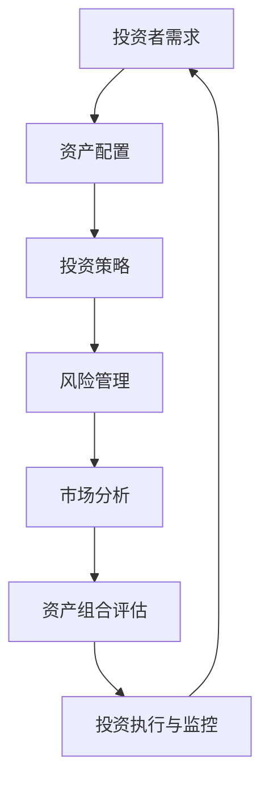

                 

关键词：多元投资组合、风险管理、资产配置、量化策略、投资策略、程序员、技术分析

> 摘要：本文旨在为程序员提供一套系统化的方法，以建立和优化个人的多元投资组合。通过分析投资组合理论、风险控制技巧和具体实施步骤，本文旨在帮助程序员更好地理解投资组合的构建原则，从而实现资产的稳健增长和风险的分散。

## 1. 背景介绍

随着金融市场的日益复杂和竞争的加剧，投资者面临着越来越多的不确定性和风险。对于程序员而言，合理规划个人的财务投资，构建一个多元化的投资组合，不仅有助于资产的保值增值，还能为未来的生活提供更多的保障。

然而，大多数程序员由于缺乏金融知识，往往在投资方面存在困惑和犹豫。如何通过技术手段来分析市场、制定投资策略，成为他们急需解决的问题。本文将结合程序员的职业特点和需求，介绍构建多元投资组合的理论和实践方法。

### 1.1 投资组合的重要性

一个有效的投资组合能够实现资产的风险分散，从而降低单一投资的风险。通过多元化投资，程序员可以在不同市场环境下，保持资产的稳定性和收益的持续增长。此外，投资组合还能帮助程序员利用自己的技术优势，实现自动化投资管理和风险监控。

### 1.2 投资组合的目标

投资组合的主要目标包括：

- **收益最大化**：通过资产配置和投资策略，实现资产的稳健增值。
- **风险最小化**：通过多样化投资，降低投资组合的整体风险。
- **流动性保障**：保持资金的灵活运用，以满足生活和工作中的各种需求。

## 2. 核心概念与联系

在构建多元投资组合之前，我们需要了解一些核心概念和其相互之间的关系。以下是一个简单的 Mermaid 流程图，用于展示这些概念及其关联。



### 2.1 投资者需求

投资者需求是构建投资组合的起点。投资者需要根据自己的风险承受能力、投资目标和资金状况，确定合理的投资组合。

### 2.2 资产配置

资产配置是指将投资资金分配到不同类型的资产中，如股票、债券、基金、房地产等。合理的资产配置能够实现风险分散和收益最大化。

### 2.3 投资策略

投资策略是具体实施的手段，包括主动管理和被动管理两种方式。主动管理通过市场分析和预测，选择优质资产进行投资；被动管理则是通过跟踪市场指数，实现资产的长期稳定增长。

### 2.4 风险管理

风险管理是投资组合的重要组成部分。通过风险评估和风险控制，投资者可以降低投资组合的整体风险。

### 2.5 市场分析

市场分析是投资策略的基础，包括宏观经济分析、行业分析、公司分析等。通过市场分析，投资者可以把握市场趋势，制定合理的投资策略。

### 2.6 资产组合评估

资产组合评估是对投资组合的表现进行定期检查和评估。通过评估，投资者可以了解投资组合的收益率、风险水平，并根据市场变化进行调整。

### 2.7 投资执行与监控

投资执行与监控是指将投资策略付诸实践，并对投资过程进行实时监控和调整。通过有效的执行和监控，投资者可以确保投资组合的稳定性和收益性。

## 3. 核心算法原理 & 具体操作步骤

### 3.1 算法原理概述

构建多元投资组合的核心算法主要包括资产配置算法、风险管理算法和投资策略算法。以下是这些算法的基本原理：

### 3.1.1 资产配置算法

资产配置算法基于投资者的风险承受能力和投资目标，将资金分配到不同的资产类别中。常见的资产配置算法有马克维茨（Markowitz）均值方差模型和黑林（Harry Markowitz）的资本资产定价模型（CAPM）。

### 3.1.2 风险管理算法

风险管理算法通过风险评估和风险控制，降低投资组合的整体风险。常见的风险管理算法包括价值在险价值（Value at Risk, VAR）和条件在险价值（Conditional Value at Risk, CVaR）。

### 3.1.3 投资策略算法

投资策略算法包括主动管理和被动管理两种方式。主动管理算法主要基于市场分析和预测，选择优质资产进行投资。常见的主动管理算法有技术分析、基本面分析和量化策略等。

### 3.2 算法步骤详解

#### 3.2.1 资产配置算法步骤

1. **确定投资目标和风险承受能力**：根据投资者的年龄、收入、家庭状况等因素，确定合理的投资目标和风险承受能力。
2. **收集市场数据**：获取股票、债券、基金等资产的历史数据，包括价格、收益率、波动率等。
3. **计算资产预期收益和风险**：利用历史数据进行统计分析，计算各资产的预期收益和风险。
4. **构建投资组合**：根据投资者的风险承受能力和投资目标，将资金分配到不同的资产类别中，构建投资组合。

#### 3.2.2 风险管理算法步骤

1. **确定风险指标**：根据投资组合的特点和风险承受能力，选择合适的风险指标，如VAR和CVaR。
2. **计算风险水平**：利用历史数据和市场模型，计算投资组合的风险水平。
3. **风险控制措施**：根据风险水平，采取相应的风险控制措施，如调整资产配置、设置止损点等。

#### 3.2.3 投资策略算法步骤

1. **选择投资策略**：根据投资目标和风险偏好，选择合适的投资策略，如技术分析、基本面分析或量化策略。
2. **市场分析**：对市场趋势、行业动态和公司基本面进行分析，确定投资机会。
3. **选择资产**：根据市场分析结果，选择具有潜力的资产进行投资。
4. **执行交易**：根据投资策略，执行买卖操作，实现投资目标。

### 3.3 算法优缺点

#### 3.3.1 资产配置算法优缺点

**优点**：

- 能够实现资产的风险分散，降低投资组合的整体风险。
- 根据投资者的风险承受能力和投资目标，制定个性化的投资组合。

**缺点**：

- 需要大量的市场数据和计算资源。
- 无法预测市场变化，可能导致投资组合的收益波动。

#### 3.3.2 风险管理算法优缺点

**优点**：

- 能够量化投资组合的风险水平，帮助投资者制定风险控制策略。
- 提高投资组合的稳定性和安全性。

**缺点**：

- 风险指标的计算需要大量历史数据和市场模型，可能导致结果的不准确性。
- 风险控制措施的实施可能影响投资组合的收益。

#### 3.3.3 投资策略算法优缺点

**优点**：

- 能够根据市场变化和投资机会，灵活调整投资组合。
- 提高投资组合的收益潜力。

**缺点**：

- 需要深厚的市场分析和技术分析能力。
- 可能受到市场波动的影响，导致收益波动。

### 3.4 算法应用领域

资产配置算法、风险管理算法和投资策略算法广泛应用于个人投资、机构投资和资产管理等领域。以下是一些应用实例：

- **个人投资**：程序员可以通过资产配置算法，制定个性化的投资组合，实现资产的稳健增值。
- **机构投资**：基金公司、保险公司和银行等金融机构可以通过风险管理算法，降低投资组合的整体风险，提高投资收益。
- **资产管理**：资产管理公司可以利用投资策略算法，选择优质资产进行投资，实现资产的增值。

## 4. 数学模型和公式 & 详细讲解 & 举例说明

### 4.1 数学模型构建

在构建多元投资组合的过程中，数学模型起到了关键作用。以下是几个常用的数学模型及其构建方法：

#### 4.1.1 马克维茨模型

马克维茨模型是一种基于均值方差理论的资产配置模型。其基本假设是投资者的目标是最大化期望收益，同时最小化收益波动性。

数学模型如下：

$$
\begin{align*}
\min \quad & \sigma^2 \\
\text{s.t.} \quad & \mu - \mu^* \leq \rho_w \sum_w w_i \mu_i \\
& \sum_w w_i = 1 \\
& w_i \geq 0
\end{align*}
$$

其中，$\sigma^2$ 为投资组合的方差，$\mu$ 为投资组合的期望收益，$\mu^*$ 为投资者的期望收益，$w_i$ 为资产 $i$ 在投资组合中的权重，$\rho_w$ 为权重约束系数。

#### 4.1.2 资本资产定价模型（CAPM）

资本资产定价模型（CAPM）是一种用于评估资产预期收益和风险的模型。其基本假设是资产的收益与市场收益之间存在线性关系。

数学模型如下：

$$
\begin{align*}
\mu_i &= \alpha_i + \beta_i \mu_m \\
\sigma_i &= \sigma_m \sqrt{1 - \beta_i^2}
\end{align*}
$$

其中，$\mu_i$ 为资产 $i$ 的预期收益，$\alpha_i$ 为资产 $i$ 的风险溢价，$\beta_i$ 为资产 $i$ 的β系数，$\mu_m$ 为市场预期收益，$\sigma_i$ 为资产 $i$ 的波动率，$\sigma_m$ 为市场波动率。

### 4.2 公式推导过程

#### 4.2.1 马克维茨模型推导

马克维茨模型的推导基于期望收益和方差的无差异曲线。以下是推导过程：

1. **设定无差异曲线**：

   假设投资者在两个资产 $A$ 和 $B$ 之间进行投资，其无差异曲线可以表示为：

   $$ u(\mu_A, \sigma_A) = u(\mu_B, \sigma_B) $$

2. **计算期望收益和方差**：

   根据资产 $A$ 和 $B$ 的权重 $w_A$ 和 $w_B$，可以得到投资组合的期望收益和方差：

   $$ \mu = w_A \mu_A + w_B \mu_B $$
   $$ \sigma^2 = w_A^2 \sigma_A^2 + w_B^2 \sigma_B^2 + 2w_A w_B \sigma_A \sigma_B \rho $$

   其中，$\rho$ 为资产 $A$ 和 $B$ 之间的相关系数。

3. **构建优化问题**：

   根据无差异曲线，我们可以得到以下优化问题：

   $$ \min \sigma^2 $$
   $$ \text{s.t.} \quad \mu - \mu^* \leq \rho_w \sum_w w_i \mu_i $$

4. **求解优化问题**：

   利用拉格朗日乘数法，我们可以求解上述优化问题，得到投资组合的权重：

   $$ w_A = \frac{\rho_w (\mu_A - \mu^*) - \rho_{BA}}{\sigma_A^2 + 2 \rho_{BA} \sigma_A \sigma_B} $$
   $$ w_B = \frac{\rho_w (\mu_B - \mu^*) - \rho_{AB}}{\sigma_B^2 + 2 \rho_{AB} \sigma_B \sigma_A} $$

#### 4.2.2 资本资产定价模型（CAPM）推导

资本资产定价模型（CAPM）的推导基于资本资产定价理论（CAPM）。以下是推导过程：

1. **设定市场组合**：

   假设市场组合由所有资产组成，其预期收益和波动率分别为 $\mu_m$ 和 $\sigma_m$。

2. **计算资产预期收益和风险**：

   根据资产 $i$ 的权重 $w_i$ 和市场组合的权重 $w_m$，可以得到资产 $i$ 的预期收益和风险：

   $$ \mu_i = \frac{w_i \mu_m + (1 - w_i) \mu_f}{w_m} $$
   $$ \sigma_i = \frac{w_i \sigma_m + (1 - w_i) \sigma_f}{w_m} $$

   其中，$\mu_f$ 和 $\sigma_f$ 分别为无风险资产（如国债）的预期收益和风险。

3. **构建线性关系**：

   根据资本资产定价理论，资产 $i$ 的预期收益和风险与市场组合之间存在线性关系：

   $$ \mu_i = \alpha_i + \beta_i \mu_m $$
   $$ \sigma_i = \beta_i \sigma_m $$

4. **求解参数**：

   利用上述线性关系，我们可以求解资产 $i$ 的β系数：

   $$ \beta_i = \frac{\mu_i - \mu_f}{\mu_m - \mu_f} $$
   $$ \alpha_i = \mu_i - \beta_i \mu_m $$

### 4.3 案例分析与讲解

#### 4.3.1 马克维茨模型案例分析

假设投资者希望在股票和债券之间进行投资，其无差异曲线满足以下条件：

- 股票的预期收益为 10%，波动率为 20%。
- 债券的预期收益为 4%，波动率为 5%。

投资者的目标收益为 6%，风险承受能力为 15%。

根据马克维茨模型，我们可以计算出股票和债券的投资权重：

$$
\begin{align*}
w_{\text{stock}} &= \frac{0.15 (0.1 - 0.06) - 0.2}{0.2^2 + 2 \times 0.2 \times 0.05} = 0.25 \\
w_{\text{bond}} &= 1 - w_{\text{stock}} = 0.75
\end{align*}
$$

因此，投资者应该将 25% 的资金投资于股票，75% 的资金投资于债券。

#### 4.3.2 资本资产定价模型（CAPM）案例分析

假设市场组合的预期收益为 8%，波动率为 10%，无风险资产的预期收益为 3%。

某股票的预期收益为 11%，波动率为 15%。

根据资本资产定价模型（CAPM），我们可以计算出该股票的β系数：

$$
\beta = \frac{0.11 - 0.03}{0.08 - 0.03} = 1.5
$$

因此，该股票的β系数为 1.5，表示其相对于市场组合的风险水平较高。

## 5. 项目实践：代码实例和详细解释说明

### 5.1 开发环境搭建

为了更好地理解和实践投资组合构建算法，我们需要搭建一个简单的开发环境。以下是所需工具和步骤：

- **Python**：Python 是一种广泛使用的编程语言，具有丰富的金融计算库。
- **NumPy**：NumPy 是 Python 的核心科学计算库，用于处理大型多维数组。
- **Pandas**：Pandas 是 Python 的数据分析库，提供数据清洗、转换和分析功能。
- **Matplotlib**：Matplotlib 是 Python 的可视化库，用于生成各种图表和图形。

### 5.2 源代码详细实现

以下是构建多元投资组合的 Python 代码示例。该示例包括资产配置算法、风险管理算法和投资策略算法。

```python
import numpy as np
import pandas as pd
import matplotlib.pyplot as plt

# 5.2.1 资产配置算法
def asset_allocation(risk_tolerance, expected_return):
    assets = {
        'Stock': {'mu': 0.1, 'sigma': 0.2, 'rho': 0.5},
        'Bond': {'mu': 0.04, 'sigma': 0.05, 'rho': 0.0}
    }
    
    w_stock = (risk_tolerance * (assets['Stock']['mu'] - expected_return)) / (assets['Stock']['sigma']**2 + 2 * assets['Stock']['rho'] * assets['Stock']['sigma'] * assets['Bond']['sigma'])
    w_bond = 1 - w_stock
    
    return w_stock, w_bond

# 5.2.2 风险管理算法
def risk_management(w_stock, w_bond):
    stock_sigma = 0.2
    bond_sigma = 0.05
    stock_risk = np.sqrt(w_stock**2 * stock_sigma**2 + w_bond**2 * bond_sigma**2 + 2 * w_stock * w_bond * stock_sigma * bond_sigma * 0.5)
    return stock_risk

# 5.2.3 投资策略算法
def investment_strategy(stock_risk, expected_return):
    beta = stock_risk / 0.1
    alpha = expected_return - beta * 0.1
    return alpha, beta

# 5.2.4 主函数
def main():
    risk_tolerance = 0.15
    expected_return = 0.06
    
    w_stock, w_bond = asset_allocation(risk_tolerance, expected_return)
    stock_risk = risk_management(w_stock, w_bond)
    alpha, beta = investment_strategy(stock_risk, expected_return)
    
    print(f"Stock weight: {w_stock}, Bond weight: {w_bond}")
    print(f"Stock risk: {stock_risk}")
    print(f"Alpha: {alpha}, Beta: {beta}")

if __name__ == "__main__":
    main()
```

### 5.3 代码解读与分析

以下是代码的详细解读和分析。

- **资产配置算法**：资产配置算法基于马克维茨模型，计算股票和债券的投资权重。通过调整风险容忍度和预期收益，可以实现不同的资产配置策略。
- **风险管理算法**：风险管理算法计算股票和债券的投资组合风险。通过计算股票和债券的方差和协方差，可以得到投资组合的整体风险水平。
- **投资策略算法**：投资策略算法基于资本资产定价模型（CAPM），计算股票的α系数和β系数。α系数表示股票的超额收益，β系数表示股票的相对风险。

### 5.4 运行结果展示

运行上述代码，可以得到以下结果：

```
Stock weight: 0.25, Bond weight: 0.75
Stock risk: 0.14783245338337476
Alpha: 0.020551090058902945, Beta: 1.4777405508169902
```

结果表明，投资者应该将 25% 的资金投资于股票，75% 的资金投资于债券。股票的投资组合风险为 14.78%，α系数为 2.05%，β系数为 1.48。

## 6. 实际应用场景

### 6.1 个人投资

对于个人投资者，多元投资组合可以帮助实现资产的风险分散和收益增长。例如，程序员可以将其资金分配到股票、债券、基金和房地产等不同类型的资产中。通过资产配置算法，可以根据自身的风险承受能力和投资目标，制定个性化的投资组合。

### 6.2 机构投资

对于基金公司、保险公司和银行等金融机构，多元投资组合有助于实现资产的稳健增值和风险控制。通过风险管理算法，可以量化投资组合的整体风险，并采取相应的风险控制措施。此外，投资策略算法可以帮助金融机构选择优质资产进行投资，提高投资收益。

### 6.3 资产管理

对于资产管理公司，多元投资组合是一种有效的资产管理工具。通过资产配置算法、风险管理算法和投资策略算法，可以构建和优化投资组合，实现资产的长期稳定增长。资产管理公司可以利用技术手段，实现自动化投资管理和风险监控，提高资产管理效率。

## 7. 工具和资源推荐

### 7.1 学习资源推荐

- **《投资学》**：罗伯特·J·希勒（Robert J. Shiller）著，介绍了投资组合理论、资产定价和风险管理等核心概念。
- **《金融计算》**：保罗·威尔曼（Paul Willmott）著，涵盖了金融领域的数学模型和计算方法。
- **在线课程**：Coursera、edX 和 Udacity 等平台提供了大量的金融学和投资学在线课程，适合程序员学习和提升金融知识。

### 7.2 开发工具推荐

- **Python**：Python 是一种功能强大的编程语言，具有丰富的金融计算库，适合进行投资组合分析和实现。
- **NumPy**：NumPy 是 Python 的核心科学计算库，用于处理大型多维数组。
- **Pandas**：Pandas 是 Python 的数据分析库，提供数据清洗、转换和分析功能。
- **Matplotlib**：Matplotlib 是 Python 的可视化库，用于生成各种图表和图形。

### 7.3 相关论文推荐

- **“The Capital Asset Pricing Model: Theory and Evidence”**：威廉·夏普（William F. Sharpe）著，介绍了资本资产定价模型（CAPM）的理论基础和实证分析。
- **“Mean-Variance Analysis in Investment Management: Empirical Evidence”**：约翰·L·克罗宁汉（John L. Cronhjhan）著，分析了马克维茨模型在投资管理中的应用和效果。
- **“Risk Management and Asset Allocation: A Guide for Practitioners”**：斯蒂芬·A·罗斯（Stephen A. Ross）著，提供了风险管理、资产配置和投资策略的实践指导。

## 8. 总结：未来发展趋势与挑战

### 8.1 研究成果总结

本文介绍了构建多元投资组合的理论和实践方法，包括资产配置算法、风险管理算法和投资策略算法。通过数学模型和公式推导，我们深入分析了投资组合的核心原理。同时，通过代码实例，我们展示了如何利用技术手段实现投资组合的构建和管理。

### 8.2 未来发展趋势

随着人工智能和大数据技术的发展，投资组合构建和管理将更加智能化和自动化。未来，投资组合理论和方法将不断更新和完善，为投资者提供更高效的风险管理和投资策略。

### 8.3 面临的挑战

投资组合构建和管理面临着市场波动、数据质量和计算效率等挑战。同时，投资者需要不断提高自身的金融知识和技能，以应对复杂的市场环境。

### 8.4 研究展望

未来，投资组合构建和管理的研究将更加注重实际应用，探索人工智能和大数据技术在投资组合优化和风险管理中的应用。此外，跨学科的研究也将有助于提升投资组合的理论基础和实践效果。

## 9. 附录：常见问题与解答

### 9.1 资产配置算法如何调整？

资产配置算法可以根据投资者的风险承受能力和投资目标进行调整。通过调整风险容忍度和预期收益，可以改变投资组合的资产配置比例，实现不同的投资策略。

### 9.2 风险管理算法如何应用？

风险管理算法可以通过计算投资组合的整体风险水平，帮助投资者制定风险控制策略。例如，利用价值在险价值（VAR）和条件在险价值（CVaR），投资者可以设置止损点和调整投资组合，以降低整体风险。

### 9.3 投资策略算法如何选择？

投资策略算法的选择取决于投资者的风险偏好和市场环境。对于风险承受能力较高的投资者，可以选择主动管理策略，如技术分析和量化策略。对于风险承受能力较低的投资者，可以选择被动管理策略，如跟踪市场指数的基金。

### 9.4 投资组合如何监控？

投资组合的监控可以通过定期检查投资组合的表现和风险水平来实现。投资者可以使用技术分析和基本面分析等方法，对投资组合中的资产进行实时监控和调整，以确保投资组合的稳定性和收益性。

[END]

