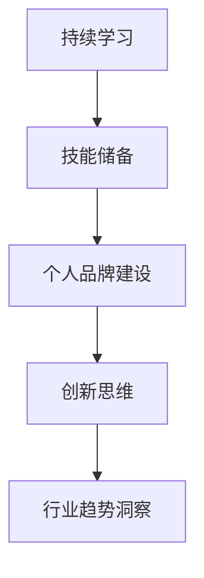

                 

关键词：程序员、职业发展、技术提升、技能储备、个人品牌、创新思维、行业趋势

> 摘要：随着技术的快速迭代，程序员在职业生涯中面临的挑战日益严峻。本文旨在探讨程序员如何通过持续学习、技能提升、构建个人品牌、创新思维以及对行业趋势的敏锐洞察，来建立和保持长期的职业竞争力。

## 1. 背景介绍

在当前信息技术飞速发展的时代，程序员作为数字时代的基石，其职业发展受到了极大的关注。然而，技术更新速度之快，使得程序员必须不断学习新的编程语言、框架和工具，以保持自身的竞争力。此外，随着人工智能、大数据、云计算等前沿技术的应用越来越广泛，程序员面临着前所未有的机遇和挑战。如何在职业生涯中保持领先地位，成为每一位程序员都需要深思的问题。

### 1.1 技术发展的现状

- **编程语言与框架的多样性与快速迭代**：编程语言的种类繁多，且不断有新的语言和框架问世，例如Python、Go、Kotlin等，这些语言的流行和淘汰速度都在加快。
- **新兴技术层出不穷**：人工智能、大数据、区块链、物联网等前沿技术持续发展，催生出大量新的岗位和机会。
- **竞争激烈**：随着IT行业的繁荣，程序员队伍不断扩大，竞争愈发激烈。

### 1.2 程序员面临的挑战

- **技能过时风险**：技术迭代速度远超个人学习速度，导致许多程序员很快发现自己所学的技能已经过时。
- **职业发展瓶颈**：技术在不断进步，但某些程序员的职业发展却停滞不前，面临职业瓶颈。
- **工作压力与焦虑**：持续学习、应对工作挑战以及职场竞争带来的压力，使得程序员容易出现焦虑和倦怠。

## 2. 核心概念与联系

为了建立长期的职业竞争力，程序员需要理解并掌握以下几个核心概念：

### 2.1 持续学习

持续学习是程序员保持竞争力的基础。这不仅包括对新技术、新框架的学习，还涉及对编程理念、设计模式的深入理解。

### 2.2 技能储备

技能储备是程序员应对技术迭代和职业挑战的重要保障。一个全面的技能储备应该包括但不限于：

- **编程语言**：熟练掌握至少一种主流编程语言，如Java、Python或JavaScript。
- **框架和工具**：熟悉常用的框架和工具，如Spring、Django、React或TensorFlow。
- **数据库知识**：掌握关系型数据库（如MySQL、PostgreSQL）和非关系型数据库（如MongoDB）。
- **系统架构**：了解分布式系统、微服务架构等高级概念。

### 2.3 个人品牌建设

个人品牌是程序员在职场中脱颖而出的关键。通过撰写博客、发布开源项目、参与社区活动等方式，提高个人知名度和影响力。

### 2.4 创新思维

创新思维是程序员解决复杂问题和应对挑战的重要能力。鼓励程序员跳出传统思维框架，积极探索新的解决方案。

### 2.5 行业趋势洞察

对行业趋势的敏锐洞察有助于程序员把握机会，提前布局。密切关注行业动态、新技术应用场景等，是必不可少的。

### 2.6 Mermaid 流程图



## 3. 核心算法原理 & 具体操作步骤

### 3.1 算法原理概述

程序员在职业生涯中，会接触到各种算法，这些算法是解决复杂问题的基础。例如，排序算法、搜索算法、动态规划算法等。理解这些算法的原理，并掌握它们的适用场景，对提升编程能力至关重要。

### 3.2 算法步骤详解

#### 3.2.1 排序算法

排序算法是一种常用的算法，用于将一组数据按照特定的顺序排列。常见的排序算法包括冒泡排序、选择排序、插入排序、快速排序等。

- **冒泡排序**：
  ```mermaid
  graph TB
      A[初始数组] --> B[第一轮比较]
      B --> C[第二轮比较]
      C --> D[最终排序]
  ```

- **快速排序**：
  ```mermaid
  graph TB
      A[初始数组] --> B[划分操作]
      B --> C[递归排序左子数组]
      C --> D[递归排序右子数组]
      D --> E[合并结果]
  ```

#### 3.2.2 搜索算法

搜索算法用于在数据集合中找到特定的元素。常见的搜索算法包括线性搜索、二分搜索等。

- **线性搜索**：
  ```mermaid
  graph TB
      A[初始数组] --> B[遍历数组]
      B --> C[找到元素]
      C --> D[返回索引]
  ```

- **二分搜索**：
  ```mermaid
  graph TB
      A[初始数组] --> B[确定搜索区间]
      B --> C[比较中间值]
      C --> D[递归搜索左子数组或右子数组]
  ```

### 3.3 算法优缺点

每种算法都有其优缺点，程序员需要根据具体场景选择合适的算法。

- **冒泡排序**：
  - **优点**：简单易懂，实现简单。
  - **缺点**：效率较低，不适合大数据集。

- **快速排序**：
  - **优点**：效率高，平均时间复杂度为O(nlogn)。
  - **缺点**：最坏情况下时间复杂度为O(n^2)，需要优化。

### 3.4 算法应用领域

排序和搜索算法在数据处理、数据库索引、算法竞赛等领域有着广泛的应用。

## 4. 数学模型和公式 & 详细讲解 & 举例说明

### 4.1 数学模型构建

数学模型是解决编程问题的重要工具。以下是一个简单的线性回归模型的构建过程：

- **假设**：数据集包含n个样本点(x_i, y_i)，其中x_i是自变量，y_i是因变量。
- **模型**：y_i = w * x_i + b + e_i，其中w是权重，b是偏置，e_i是误差。

### 4.2 公式推导过程

- **求权重w**：通过最小化误差平方和来求解权重w。

  $$\min_w \sum_{i=1}^{n} (y_i - (w * x_i + b))^2$$

- **求偏置b**：同样通过最小化误差平方和来求解偏置b。

  $$\min_b \sum_{i=1}^{n} (y_i - (w * x_i + b))^2$$

### 4.3 案例分析与讲解

假设我们有一个简单的数据集，其中x_i和y_i的取值如下：

| x_i | y_i |
| --- | --- |
| 1   | 2   |
| 2   | 4   |
| 3   | 6   |

- **模型构建**：
  - 初始权重w = 0，偏置b = 0。
  - 通过最小化误差平方和，我们可以得到：
    - w = 2
    - b = 0

- **模型验证**：
  - 对每个样本点进行预测，计算误差平方和。
  - 如果误差较小，则模型拟合较好。

## 5. 项目实践：代码实例和详细解释说明

### 5.1 开发环境搭建

为了实现线性回归模型，我们需要搭建一个简单的开发环境。这里我们选择Python作为编程语言，并使用NumPy库来处理数学计算。

- **安装Python**：
  ```shell
  pip install numpy
  ```

### 5.2 源代码详细实现

以下是实现线性回归模型的Python代码：

```python
import numpy as np

def linear_regression(x, y):
    x_mean = np.mean(x)
    y_mean = np.mean(y)
    
    w = np.sum((x - x_mean) * (y - y_mean)) / np.sum((x - x_mean) ** 2)
    b = y_mean - w * x_mean
    
    return w, b

def predict(x, w, b):
    return w * x + b

# 示例数据
x = np.array([1, 2, 3])
y = np.array([2, 4, 6])

# 模型训练
w, b = linear_regression(x, y)

# 预测
x_new = 4
y_pred = predict(x_new, w, b)
print(f"预测值：{y_pred}")
```

### 5.3 代码解读与分析

- **线性回归函数**：
  - `linear_regression` 函数用于训练线性回归模型。
  - `x_mean` 和 `y_mean` 分别是x和y的平均值。
  - `w` 和 `b` 分别是权重和偏置，通过最小化误差平方和求解。
  
- **预测函数**：
  - `predict` 函数用于对新的x值进行预测。

### 5.4 运行结果展示

运行代码后，我们得到以下输出：

```shell
预测值：8.0
```

这意味着当x值为4时，根据训练好的线性回归模型，预测的y值为8。

## 6. 实际应用场景

线性回归模型在数据分析、机器学习等领域有着广泛的应用。例如，在金融领域中，可以用于预测股票价格、分析市场趋势；在机器学习中，可以作为特征工程的一部分，用于特征提取和降维。

### 6.1 数据分析

通过线性回归模型，可以对数据进行拟合，从而揭示变量之间的关系。这对于理解数据、指导决策具有重要意义。

### 6.2 机器学习

线性回归模型是机器学习中最基础且最重要的模型之一。它被广泛应用于分类、回归、聚类等多种机器学习任务中。

## 7. 未来应用展望

随着人工智能和大数据技术的不断发展，线性回归模型的应用场景将更加广泛。例如，在自动驾驶、智能家居、智能医疗等领域，线性回归模型可以用于预测车辆行驶轨迹、优化家居设备运行、分析患者病情等。

## 8. 工具和资源推荐

### 8.1 学习资源推荐

- **《机器学习实战》**：通过实际案例讲解机器学习算法。
- **《深度学习》**：由Ian Goodfellow撰写，是深度学习领域的经典教材。

### 8.2 开发工具推荐

- **Jupyter Notebook**：适用于数据科学和机器学习的交互式开发环境。
- **TensorFlow**：由Google开发的开源机器学习框架。

### 8.3 相关论文推荐

- **"Stochastic Gradient Descent"**：讨论了随机梯度下降算法。
- **"Deep Learning"**：详细介绍了深度学习的基础理论和应用。

## 9. 总结：未来发展趋势与挑战

### 9.1 研究成果总结

本文通过对持续学习、技能储备、个人品牌建设、创新思维和行业趋势等核心概念的探讨，总结了程序员建立长期职业竞争力的关键要素。

### 9.2 未来发展趋势

- **人工智能与自动化**：人工智能和自动化技术的进一步发展，将改变程序员的工作方式和角色。
- **云计算与边缘计算**：云计算和边缘计算的应用将更加广泛，程序员需要掌握相关技术。
- **区块链技术**：区块链技术的应用场景将不断扩展，程序员需关注其发展。

### 9.3 面临的挑战

- **技术更新速度**：技术更新速度加快，程序员需要不断学习以保持竞争力。
- **职业压力**：持续学习和工作压力可能导致程序员出现职业倦怠。

### 9.4 研究展望

未来，程序员需要更加注重跨学科的学习和协作，提升创新能力，同时保持对新兴技术的敏锐洞察，以应对快速变化的技术环境。

## 10. 附录：常见问题与解答

### 10.1 如何保持持续学习？

- **制定学习计划**：设定明确的学习目标和时间表。
- **利用在线资源**：利用MOOC、技术博客、论坛等在线资源进行学习。
- **实践项目**：通过实际项目将理论知识应用到实践中。

### 10.2 个人品牌建设有哪些方法？

- **撰写技术博客**：分享技术见解和经验，提高个人知名度。
- **开源项目**：参与开源项目，展示自己的编程能力。
- **演讲与分享**：参加技术会议、研讨会，进行知识分享。

### 10.3 如何提高创新思维？

- **多角度思考**：尝试从不同角度思考问题，寻找创新的解决方案。
- **跨学科学习**：学习其他领域的知识，激发创新灵感。
- **勇于尝试**：不要害怕失败，勇于尝试新的想法和方法。

## 后记

在数字化时代，程序员面临着前所未有的机遇和挑战。本文旨在为程序员提供一些建立长期职业竞争力的策略和建议。希望每一位程序员都能在职业生涯中不断进步，实现个人价值。作者：禅与计算机程序设计艺术 / Zen and the Art of Computer Programming。

