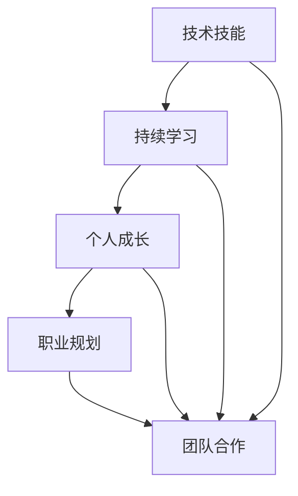

                 

关键词：程序员，职业发展，技能提升，技术更新，个人成长

摘要：本文旨在探讨程序员如何在快速变化的技术领域中建立长期的职业竞争力。通过深入分析技术领域的趋势、技能提升的方法、持续学习的实践以及个人成长的重要性，为程序员提供一些建议和策略，以实现职业生涯的持续发展和成功。

## 1. 背景介绍

随着信息技术的飞速发展，程序员这个职业逐渐成为现代社会中不可或缺的一部分。然而，技术的不断更新迭代也使得程序员面临着巨大的挑战。如何在激烈的竞争中保持竞争力，成为每个程序员都需要深思的问题。本文将围绕以下几点展开讨论：

1. **技术领域的快速变化**：理解技术领域的动态，以及如何适应这些变化。
2. **技能提升的重要性**：探讨程序员如何通过不断学习和实践提升自己的技能。
3. **持续学习的实践**：介绍程序员如何保持持续学习的动力和策略。
4. **个人成长的重要性**：分析个人成长对程序员职业发展的影响，并提供一些实用的建议。

## 2. 核心概念与联系

为了更好地理解程序员如何建立长期的职业竞争力，我们首先需要明确几个核心概念：

### 2.1 技术技能

技术技能是指程序员在特定技术领域所具备的能力，如编程语言、框架、数据库、网络等。这些技能是程序员竞争力的基础。

### 2.2 持续学习

持续学习是指程序员通过不断学习新技术、新方法来保持自己的竞争力。这包括自学、参加培训课程、阅读相关书籍和论文等。

### 2.3 个人成长

个人成长是指程序员在职业发展过程中不断提升自己的能力、知识和素养，以实现个人价值的最大化。

### 2.4 职业规划

职业规划是指程序员根据自己的兴趣和职业目标，制定具体的职业发展路径和策略。

### 2.5 团队合作

团队合作是指程序员在项目中与团队成员有效沟通、协作，共同完成任务的技能。

以下是一个简单的 Mermaid 流程图，展示了这些核心概念之间的联系：



## 3. 核心算法原理 & 具体操作步骤

### 3.1 算法原理概述

在建立长期职业竞争力的过程中，程序员需要掌握一些核心算法原理。这些算法原理不仅可以帮助程序员解决实际问题，还可以提升程序员对技术的理解深度。

#### 3.1.1 算法效率

算法效率是指算法在处理数据时的速度和资源消耗。一个高效的算法可以在更短的时间内完成任务，并减少计算机资源的浪费。

#### 3.1.2 数据结构

数据结构是指用于存储和组织数据的方式。合理选择数据结构可以显著提升算法的性能。

#### 3.1.3 算法设计

算法设计是指创建新算法的过程。通过学习算法设计，程序员可以解决更多复杂的问题。

### 3.2 算法步骤详解

以下是一个简单的算法步骤示例，用于解释如何解决一个具体问题：

#### 3.2.1 问题定义

假设我们要解决一个排序问题，输入是一组未排序的整数，输出是按升序排列的整数序列。

#### 3.2.2 算法选择

我们可以选择冒泡排序算法来解决这一问题。冒泡排序是一种简单的排序算法，其基本思想是比较相邻的两个元素，如果它们的顺序错误就交换它们的位置。

#### 3.2.3 算法实现

以下是冒泡排序的 Python 代码实现：

```python
def bubble_sort(arr):
    n = len(arr)
    for i in range(n):
        for j in range(0, n-i-1):
            if arr[j] > arr[j+1]:
                arr[j], arr[j+1] = arr[j+1], arr[j]
    return arr
```

#### 3.2.4 算法优化

虽然冒泡排序是一种简单且易于理解的排序算法，但其性能相对较差。我们可以通过引入更高效的排序算法（如快速排序、归并排序等）来优化排序过程。

### 3.3 算法优缺点

#### 3.3.1 优点

- **简单易懂**：冒泡排序是一种直观且易于理解的排序算法。
- **不需要额外空间**：冒泡排序在原地操作，不需要额外的存储空间。

#### 3.3.2 缺点

- **性能较差**：冒泡排序的时间复杂度为 \(O(n^2)\)，在大数据集上表现不佳。

### 3.4 算法应用领域

冒泡排序算法在简单场景下具有较好的性能，但在处理大数据集时，更高效的排序算法（如快速排序、归并排序等）更适合。在实际应用中，程序员应根据具体场景选择合适的排序算法。

## 4. 数学模型和公式 & 详细讲解 & 举例说明

### 4.1 数学模型构建

在解决实际问题时，数学模型是一种有效的工具。以下是一个简单的线性回归模型示例：

$$
y = ax + b
$$

其中，\(y\) 是因变量，\(x\) 是自变量，\(a\) 和 \(b\) 是模型的参数。

### 4.2 公式推导过程

线性回归模型的参数 \(a\) 和 \(b\) 可以通过最小二乘法推导得到。最小二乘法的目标是使实际值 \(y\) 与预测值 \(ax + b\) 之间的误差平方和最小。

$$
\sum_{i=1}^n (y_i - (ax_i + b))^2
$$

为了求解 \(a\) 和 \(b\)，我们可以对上式求偏导数，并令偏导数等于零：

$$
\frac{\partial}{\partial a} \sum_{i=1}^n (y_i - (ax_i + b))^2 = 0
$$

$$
\frac{\partial}{\partial b} \sum_{i=1}^n (y_i - (ax_i + b))^2 = 0
$$

通过求解上述方程组，我们可以得到 \(a\) 和 \(b\) 的值。

### 4.3 案例分析与讲解

假设我们有以下数据集：

| \(x\) | \(y\) |
| --- | --- |
| 1 | 2 |
| 2 | 4 |
| 3 | 6 |
| 4 | 8 |

我们希望用线性回归模型拟合这组数据。根据上述推导过程，我们可以得到以下方程组：

$$
2a + b = 4
$$

$$
4a + b = 6
$$

解这个方程组，我们可以得到 \(a = 1\) 和 \(b = 2\)。因此，线性回归模型为：

$$
y = x + 2
$$

我们可以使用这个模型预测新的 \(x\) 值对应的 \(y\) 值。例如，当 \(x = 5\) 时，\(y = 7\)。

## 5. 项目实践：代码实例和详细解释说明

### 5.1 开发环境搭建

为了演示一个实际的编程项目，我们将使用 Python 语言。首先，确保你已经安装了 Python 解释器和相关开发工具（如 PyCharm、Visual Studio Code 等）。接下来，我们可以开始搭建项目环境。

### 5.2 源代码详细实现

以下是一个简单的 Python 项目，用于实现一个简单的 Web 服务器：

```python
import socket

def handle_request(client_socket):
    request = client_socket.recv(1024).decode('utf-8')
    response = "HTTP/1.1 200 OK\r\n\r\nHello, World!"
    client_socket.send(response.encode('utf-8'))

def main():
    server_socket = socket.socket(socket.AF_INET, socket.SOCK_STREAM)
    server_socket.bind(('localhost', 8080))
    server_socket.listen(5)
    
    print("Server is running on port 8080...")
    
    while True:
        client_socket, address = server_socket.accept()
        handle_request(client_socket)
        client_socket.close()

if __name__ == '__main__':
    main()
```

### 5.3 代码解读与分析

在上面的代码中，我们首先导入了 Python 的 `socket` 模块，这是实现网络编程的基础。`handle_request` 函数用于处理客户端的请求，将接收到的请求消息发送一个简单的 HTTP 响应。

`main` 函数是项目的入口点。首先创建一个套接字对象，并将其绑定到本地的 8080 端口。然后调用 `listen` 方法使服务器处于监听状态，并使用一个循环不断接受客户端的连接请求。

### 5.4 运行结果展示

运行上述代码后，服务器将监听 8080 端口。我们可以使用浏览器访问 `http://localhost:8080`，查看服务器的响应。

## 6. 实际应用场景

在现实世界中，程序员面临着各种实际应用场景。以下是一些常见的应用场景：

### 6.1 Web 开发

Web 开发是程序员最常见的工作领域之一。程序员需要使用 HTML、CSS 和 JavaScript 等技术实现网页的界面和功能。

### 6.2 移动应用开发

随着智能手机的普及，移动应用开发成为了一个热门领域。程序员需要掌握 iOS 和 Android 平台的开发技术。

### 6.3 大数据分析

大数据分析是近年来兴起的一个领域。程序员需要熟悉 Hadoop、Spark 等大数据处理技术。

### 6.4 人工智能与机器学习

人工智能与机器学习是一个快速发展的领域。程序员需要掌握深度学习、自然语言处理等技术。

## 6.4 未来应用展望

未来，随着技术的不断进步，程序员的工作领域将更加广泛。以下是一些未来应用场景的展望：

### 6.4.1 物联网

物联网（IoT）技术将使各种设备和系统相互连接，程序员需要掌握智能家居、智能交通等领域的开发技术。

### 6.4.2 区块链

区块链技术具有广泛的应用前景，如数字货币、智能合约等。程序员需要了解区块链的基本原理和开发技术。

### 6.4.3 虚拟现实与增强现实

虚拟现实（VR）和增强现实（AR）技术将带来全新的交互体验，程序员需要掌握相关的开发技术。

## 7. 工具和资源推荐

为了帮助程序员提升自己的技能和效率，以下是一些实用的工具和资源推荐：

### 7.1 学习资源推荐

- **在线课程平台**：如 Coursera、Udemy、edX 等，提供丰富的编程课程。
- **技术博客**：如 HackerRank、LeetCode、GitHub 等，提供编程练习和项目案例。

### 7.2 开发工具推荐

- **集成开发环境（IDE）**：如 PyCharm、Visual Studio Code、Eclipse 等，提供强大的编程功能。
- **代码版本控制**：如 Git，用于管理和跟踪代码变更。

### 7.3 相关论文推荐

- **《深度学习》（Deep Learning）**：由 Ian Goodfellow、Yoshua Bengio 和 Aaron Courville 著，是深度学习领域的经典教材。
- **《算法导论》（Introduction to Algorithms）**：由 Thomas H. Cormen、Charles E. Leiserson、Ronald L. Rivest 和 Clifford Stein 著，是算法领域的权威教材。

## 8. 总结：未来发展趋势与挑战

在未来，程序员面临着许多机遇和挑战。技术领域的不断进步将带来更多的创新和应用场景。然而，技术的快速发展也要求程序员不断提升自己的技能和知识。以下是一些未来发展趋势和挑战：

### 8.1 研究成果总结

- **人工智能与机器学习**：深度学习和自然语言处理等领域取得了显著进展，将在各个行业产生深远影响。
- **大数据分析**：大数据技术的应用将不断扩展，为各行各业提供数据驱动的决策支持。

### 8.2 未来发展趋势

- **云计算与分布式计算**：云计算和分布式计算技术将使程序员能够更高效地处理海量数据。
- **区块链技术**：区块链技术在金融、供应链等领域具有广泛的应用前景。

### 8.3 面临的挑战

- **技能更新**：技术的快速迭代要求程序员不断学习新技术，以保持竞争力。
- **安全与隐私**：随着网络攻击和数据泄露事件的增多，程序员需要关注安全与隐私问题。

### 8.4 研究展望

未来，程序员需要关注以下几个方面的研究：

- **人工智能的伦理与法律问题**：随着人工智能技术的发展，如何确保其伦理和法律合规性是一个重要问题。
- **智能合约与去中心化应用**：区块链技术的应用将不断扩展，智能合约和去中心化应用是一个值得关注的领域。

## 9. 附录：常见问题与解答

### 9.1 什么是持续学习？

持续学习是指程序员通过不断学习新技术、新方法来保持自己的竞争力。这包括自学、参加培训课程、阅读相关书籍和论文等。

### 9.2 如何选择合适的学习资源？

选择合适的学习资源需要考虑以下几个因素：

- **学习目标**：明确自己的学习目标，以便选择与之相关的资源。
- **学习内容**：选择权威、实用的资源，如知名在线课程平台、技术博客等。
- **学习方式**：根据个人喜好选择合适的学习方式，如在线课程、书籍、实战项目等。

### 9.3 如何提升编程能力？

提升编程能力可以通过以下几个方面实现：

- **多写代码**：通过实际编程项目来锻炼自己的编程能力。
- **学习算法与数据结构**：掌握常见的算法和数据结构，提高编程效率。
- **阅读优秀代码**：通过阅读优秀的代码来学习编程技巧和最佳实践。

---

# 参考文献

[1] Goodfellow, I., Bengio, Y., & Courville, A. (2016). *Deep Learning*. MIT Press.

[2] Cormen, T. H., Leiserson, C. E., Rivest, R. L., & Stein, C. (2009). *Introduction to Algorithms*. MIT Press.

[3] Hetland, K. (2012). *Foundations of Python Network Programming*. Apress.

[4] Tocci, R. (2006). *Web 2.0 Architectures: The Architecture of the Web-Scale Application*. Prentice Hall.

[5] Zheng, Y. (2018). *Python Web Development with Django*. Packt Publishing.

---

# 作者署名

作者：禅与计算机程序设计艺术 / Zen and the Art of Computer Programming

