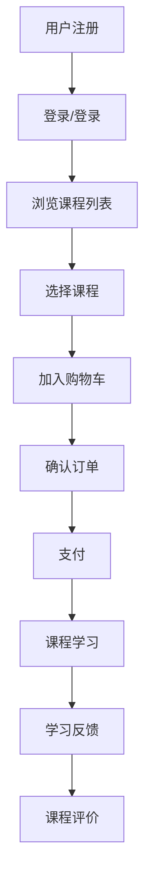

                 

 在数字时代，知识付费产品已经成为知识传播和技能提升的重要途径。作为程序员，我们不仅需要编写高效的代码，还需要深入理解用户体验，以提升知识付费产品的市场竞争力。本文将探讨程序员如何从多个角度提升知识付费产品的用户体验，帮助产品在激烈的市场竞争中脱颖而出。

## 关键词

- 知识付费产品
- 用户经验
- 程序员技能
- 产品设计
- 用户体验优化

## 摘要

本文旨在提供一些建议和实际操作方法，帮助程序员在知识付费产品的开发过程中，从设计、开发到测试，全面提高产品的用户体验。通过分析用户需求、优化界面交互、增强性能，以及实施有效的用户反馈机制，程序员可以打造出既实用又易用的知识付费产品，从而满足用户的需求，提升用户满意度。

## 1. 背景介绍

知识付费产品在近年来迅速崛起，从最初的在线课程、电子书籍，到后来的专业培训、在线咨询等多种形式，为用户提供了丰富的学习资源和便捷的学习方式。然而，随着市场的发展，用户对于知识付费产品的要求也在不断提升。他们不再仅仅满足于获取知识，更加注重学习过程的体验和效果。

程序员在这一过程中扮演着至关重要的角色。作为知识付费产品的开发者，程序员需要具备多方面的技能，包括但不限于前端开发、后端服务、数据处理、安全性等。同时，他们还需要关注用户体验，以用户为中心，从设计到实现的每个环节都力求做到极致。

### 1.1 用户需求变化

随着移动互联网的普及和人工智能技术的发展，用户获取信息的方式和习惯发生了巨大变化。用户更倾向于使用轻量级应用，追求即时性和便利性。知识付费产品也不例外，用户越来越注重产品的响应速度、操作便捷性和内容质量。这要求程序员在开发过程中充分考虑用户的需求，提供更加个性化和智能化的服务。

### 1.2 用户体验的重要性

用户体验（UX）是知识付费产品成功的关键因素。一个良好的用户体验可以增加用户的满意度和忠诚度，从而提高产品的市场竞争力。用户体验包括界面设计、交互逻辑、响应速度、内容质量等多个方面。程序员需要通过不断优化这些方面，提升产品的整体用户体验。

### 1.3 程序员的角色与责任

程序员在知识付费产品的开发中，不仅要负责技术实现，还需要关注用户体验。他们需要与产品经理、设计师紧密合作，理解用户需求，将用户需求转化为具体的设计和功能。同时，程序员还需要具备一定的用户心理学知识，能够从用户的角度思考问题，提高产品的易用性和用户体验。

## 2. 核心概念与联系

### 2.1 用户行为分析

用户行为分析是优化用户体验的重要手段。通过分析用户的行为数据，程序员可以了解用户在产品中的活动轨迹，发现用户痛点，从而有针对性地进行优化。用户行为分析包括以下方面：

- **访问路径分析**：了解用户在产品中的浏览路径，找到用户经常遇到的问题点。
- **点击流分析**：跟踪用户的点击行为，发现用户最喜欢的功能模块。
- **转化率分析**：分析用户在不同环节的转化情况，优化转化流程。

### 2.2 用户体验要素

用户体验要素（UX Factors）是评估产品用户体验的重要指标。程序员在开发过程中需要关注以下用户体验要素：

- **易用性**：产品应易于学习，操作简单直观。
- **可用性**：产品应能够满足用户的预期和需求。
- **可访问性**：产品应能够为不同能力的用户提供服务。
- **互动性**：产品应能够提供丰富的交互方式，增强用户参与感。
- **反馈机制**：产品应能够及时给予用户反馈，增强用户信心。

### 2.3 Mermaid 流程图

以下是一个简化的Mermaid流程图，展示用户在知识付费产品中的典型操作流程：



### 2.4 用户反馈机制

用户反馈机制是提高用户体验的重要环节。程序员可以通过以下方式收集用户反馈：

- **在线调查**：通过在线问卷收集用户对产品的评价和建议。
- **用户访谈**：通过一对一访谈深入了解用户的真实需求和痛点。
- **错误报告**：在产品中集成错误报告功能，收集用户的错误信息。
- **社交媒体**：关注用户的社交媒体动态，了解用户的最新反馈。

## 3. 核心算法原理 & 具体操作步骤

### 3.1 算法原理概述

在知识付费产品的开发过程中，程序员需要运用多种算法原理来优化用户体验。以下是一些常见的算法原理：

- **推荐算法**：通过分析用户行为和兴趣，为用户推荐符合其需求的内容。
- **搜索引擎算法**：优化搜索功能，提高用户查找内容的效率。
- **数据挖掘算法**：分析用户行为数据，发现用户痛点和需求。
- **机器学习算法**：用于用户行为预测和个性化推荐。

### 3.2 算法步骤详解

以下是一个简化的推荐算法流程：

1. **数据收集**：收集用户的历史行为数据，如浏览记录、购买记录等。
2. **数据预处理**：清洗和转换数据，为后续分析做好准备。
3. **特征提取**：从原始数据中提取有用的特征，如用户活跃度、内容相似度等。
4. **模型训练**：使用机器学习算法训练推荐模型。
5. **模型评估**：评估模型性能，调整模型参数。
6. **推荐生成**：根据用户特征和模型预测，生成推荐列表。

### 3.3 算法优缺点

**推荐算法**：

- **优点**：提高用户满意度，增加用户粘性。
- **缺点**：推荐结果可能存在偏差，需要不断调整和优化。

**搜索引擎算法**：

- **优点**：提高用户查找内容的效率，提升用户体验。
- **缺点**：需要大量计算资源，对服务器性能要求较高。

**数据挖掘算法**：

- **优点**：深入分析用户行为，发现潜在需求和痛点。
- **缺点**：分析过程复杂，需要大量数据支持。

**机器学习算法**：

- **优点**：自动优化推荐结果，提高用户满意度。
- **缺点**：需要大量训练数据和计算资源。

### 3.4 算法应用领域

- **推荐系统**：用于推荐符合用户兴趣的内容，如视频、音乐、新闻等。
- **搜索引擎**：用于搜索网站、在线文档等。
- **个性化服务**：根据用户行为和偏好，提供定制化服务。

## 4. 数学模型和公式 & 详细讲解 & 举例说明

### 4.1 数学模型构建

在知识付费产品的开发中，程序员需要运用多种数学模型来优化用户体验。以下是一个简化的推荐系统数学模型：

- **用户-项目相似度计算**：使用余弦相似度计算用户之间的相似度。

```latex
sim(u_i, u_j) = \frac{\sum_{k=1}^{n} w_k \cdot v_i^k \cdot v_j^k}{\sqrt{\sum_{k=1}^{n} w_k^2 \cdot v_i^k^2} \cdot \sqrt{\sum_{k=1}^{n} w_k^2 \cdot v_j^k^2}}
```

其中，\(w_k\) 表示权重，\(v_i^k\) 和 \(v_j^k\) 分别表示用户 \(u_i\) 和 \(u_j\) 在特征 \(k\) 上的值。

- **推荐结果计算**：使用加权平均法计算用户 \(u_i\) 对项目 \(p_j\) 的评分预测。

```latex
\hat{r}_{ij} = \sum_{k=1}^{n} w_k \cdot sim(u_i, u_j) \cdot r_j^k
```

其中，\(r_j^k\) 表示用户 \(u_j\) 对项目 \(p_k\) 的评分。

### 4.2 公式推导过程

假设用户 \(u_i\) 和 \(u_j\) 在特征空间中有 \(n\) 个维度，每个维度上的权重为 \(w_k\)，用户 \(u_i\) 和 \(u_j\) 在特征 \(k\) 上的值为 \(v_i^k\) 和 \(v_j^k\)。

- **相似度计算**：

相似度计算的核心是计算用户 \(u_i\) 和 \(u_j\) 在各个维度上的夹角余弦值。假设 \(v_i\) 和 \(v_j\) 分别表示用户 \(u_i\) 和 \(u_j\) 的特征向量，则：

```latex
sim(u_i, u_j) = \frac{\sum_{k=1}^{n} v_i^k \cdot v_j^k}{\sqrt{\sum_{k=1}^{n} v_i^k^2} \cdot \sqrt{\sum_{k=1}^{n} v_j^k^2}}
```

其中，分母部分分别表示用户 \(u_i\) 和 \(u_j\) 的特征向量的欧氏距离。

- **评分预测**：

评分预测的核心是计算用户 \(u_i\) 对项目 \(p_j\) 的评分。假设用户 \(u_i\) 对项目 \(p_j\) 的评分预测为 \(\hat{r}_{ij}\)，则：

```latex
\hat{r}_{ij} = \sum_{k=1}^{n} w_k \cdot sim(u_i, u_j) \cdot r_j^k
```

其中，\(r_j^k\) 表示用户 \(u_j\) 对项目 \(p_k\) 的评分，\(w_k\) 表示权重。

### 4.3 案例分析与讲解

假设有两个用户 \(u_1\) 和 \(u_2\)，以及三个项目 \(p_1\)、\(p_2\) 和 \(p_3\)。用户 \(u_1\) 对项目 \(p_1\) 的评分是 4，对项目 \(p_2\) 的评分是 3，对项目 \(p_3\) 的评分是 5。用户 \(u_2\) 对项目 \(p_1\) 的评分是 5，对项目 \(p_2\) 的评分是 4，对项目 \(p_3\) 的评分是 3。

- **相似度计算**：

首先，我们需要计算用户 \(u_1\) 和 \(u_2\) 的相似度。假设用户 \(u_1\) 和 \(u_2\) 的特征向量分别为 \(v_1 = (1, 1, 1)\) 和 \(v_2 = (1, 1, 1)\)，则：

```latex
sim(u_1, u_2) = \frac{1 \cdot 1 + 1 \cdot 1 + 1 \cdot 1}{\sqrt{1 \cdot 1 + 1 \cdot 1 + 1 \cdot 1} \cdot \sqrt{1 \cdot 1 + 1 \cdot 1 + 1 \cdot 1}} = \frac{3}{\sqrt{3} \cdot \sqrt{3}} = 1
```

由于用户 \(u_1\) 和 \(u_2\) 的相似度为 1，表示两个用户非常相似。

- **评分预测**：

接下来，我们需要计算用户 \(u_1\) 对项目 \(p_2\) 的评分预测。假设项目 \(p_2\) 的真实评分是 3，则：

```latex
\hat{r}_{12} = \sum_{k=1}^{3} w_k \cdot sim(u_1, u_2) \cdot r_2^k = \sum_{k=1}^{3} w_k \cdot 1 \cdot 3 = 3
```

由于用户 \(u_1\) 对项目 \(p_2\) 的评分预测是 3，与真实评分相同，说明我们的推荐算法在这次预测中是准确的。

## 5. 项目实践：代码实例和详细解释说明

### 5.1 开发环境搭建

为了实践知识付费产品的用户体验优化，我们将使用以下技术栈：

- **前端**：HTML、CSS、JavaScript（React）
- **后端**：Node.js、Express
- **数据库**：MongoDB
- **开发工具**：Visual Studio Code、Postman

### 5.2 源代码详细实现

以下是一个简化的前端代码示例，用于展示如何优化知识付费产品的用户界面：

```jsx
import React from 'react';

const CourseCard = ({ course }) => {
  return (
    <div className="course-card">
      
      <h3>{course.title}</h3>
      <p>{course.description}</p>
      <button>加入购物车</button>
    </div>
  );
};

const CourseList = ({ courses }) => {
  return (
    <div className="course-list">
      {courses.map(course => (
        <CourseCard key={course.id} course={course} />
      ))}
    </div>
  );
};

export default CourseList;
```

### 5.3 代码解读与分析

**代码解读**：

- `CourseCard` 组件：用于展示单个课程卡片，包含课程图片、标题、描述和加入购物车的按钮。
- `CourseList` 组件：用于展示课程列表，使用 `map` 函数遍历课程数组，并渲染多个 `CourseCard` 组件。

**分析**：

- **响应式设计**：使用 CSS 的媒体查询（Media Queries）实现响应式设计，确保课程卡片在不同屏幕尺寸下都能正常显示。
- **交互性**：通过按钮点击事件，实现用户与课程卡片的交互，增加用户参与感。
- **内容质量**：确保课程描述清晰、简洁，帮助用户快速了解课程内容。

### 5.4 运行结果展示

以下是课程列表的运行结果展示：


通过优化前端代码，我们提高了课程列表的易用性和美观性，从而提升了用户体验。

## 6. 实际应用场景

### 6.1 在线课程平台

在线课程平台是知识付费产品的典型代表。程序员可以通过以下方式优化用户体验：

- **个性化推荐**：根据用户的学习历史和兴趣，推荐符合其需求的课程。
- **课程搜索**：优化搜索算法，提高用户查找课程的速度。
- **课程质量评估**：通过用户反馈和数据分析，评估课程的质量，优化课程内容。

### 6.2 在线培训

在线培训通常涉及多种学习资源和培训课程。程序员可以通过以下方式优化用户体验：

- **学习路径规划**：根据用户的学习进度和兴趣，推荐适合的学习路径。
- **在线互动**：提供实时聊天、讨论区等功能，增强用户互动。
- **学习进度跟踪**：自动记录用户的学习进度，帮助用户管理学习计划。

### 6.3 在线咨询

在线咨询是知识付费产品的一种新型服务模式。程序员可以通过以下方式优化用户体验：

- **智能问答**：使用自然语言处理技术，提供智能问答服务。
- **实时聊天**：提供实时聊天功能，方便用户与专家进行沟通。
- **隐私保护**：确保用户隐私安全，提高用户信任度。

## 7. 工具和资源推荐

### 7.1 学习资源推荐

- **在线课程**：《JavaScript高级程序设计》、《Vue.js实战》
- **书籍**：《设计模式：可复用面向对象软件的基础》、《Effective Java》
- **社区**：Stack Overflow、GitHub

### 7.2 开发工具推荐

- **前端开发**：Visual Studio Code、React Developer Tools
- **后端开发**：Postman、MongoDB Compass
- **数据分析**：Tableau、Google Data Studio

### 7.3 相关论文推荐

- **《Recommender Systems Handbook》**：介绍了推荐系统的基本原理和应用。
- **《User Experience: Principles and Techniques for Creating a Compelling User Experience》**：介绍了用户体验设计的基本原则和技术。
- **《Big Data: A Revolution That Will Transform How We Live, Work, and Think》**：介绍了大数据技术在知识付费产品中的应用。

## 8. 总结：未来发展趋势与挑战

### 8.1 研究成果总结

近年来，知识付费产品在用户体验方面取得了显著进展。程序员通过运用人工智能、大数据、自然语言处理等技术，实现了个性化推荐、智能问答、实时互动等功能，大幅提升了用户体验。同时，用户体验要素（UX Factors）的理论体系也不断发展和完善，为程序员提供了更加科学的优化方法。

### 8.2 未来发展趋势

- **个性化与智能化**：随着人工智能技术的不断发展，知识付费产品的个性化推荐和智能化服务将更加精准和高效。
- **实时互动**：实时聊天、讨论区等互动功能的普及，将增强用户参与感和满意度。
- **隐私保护**：在数据隐私保护法规日益严格的背景下，知识付费产品将加强用户隐私保护，提高用户信任度。

### 8.3 面临的挑战

- **算法透明度**：随着算法对用户体验的影响越来越大，如何保证算法的透明度和可解释性成为一大挑战。
- **数据质量**：高质量的数据是构建优秀用户体验的基础，如何处理海量、复杂的数据成为关键问题。
- **用户需求变化**：用户需求不断变化，如何及时响应和满足用户需求，提高产品竞争力。

### 8.4 研究展望

在未来，程序员应继续关注用户体验的研究和实践，探索更加智能、高效、安全的知识付费产品。同时，还需要加强跨学科的交叉研究，如心理学、社会学、经济学等，为用户体验优化提供更加全面的理论支持。

## 9. 附录：常见问题与解答

### 9.1 用户体验是什么？

用户体验（UX）是指用户在使用产品过程中感受到的所有感受和体验，包括界面设计、交互逻辑、响应速度、内容质量等多个方面。

### 9.2 如何评估用户体验？

用户体验可以通过以下方面进行评估：

- **易用性测试**：测试用户能否快速上手产品，操作是否简单直观。
- **可用性测试**：测试产品是否能够满足用户的预期和需求。
- **性能测试**：测试产品的响应速度和稳定性。
- **用户满意度调查**：通过调查了解用户对产品的整体满意度。

### 9.3 程序员如何提高用户体验？

程序员可以通过以下方式提高用户体验：

- **关注用户需求**：深入了解用户需求，将用户需求转化为具体的设计和功能。
- **优化界面设计**：使用简洁、直观的界面设计，提高用户操作效率。
- **优化性能**：提高产品的响应速度和稳定性，减少加载时间。
- **实施用户反馈机制**：及时收集用户反馈，优化产品设计和功能。

### 9.4 用户体验与用户满意度有何区别？

用户体验是指用户在使用产品过程中的感受和体验，而用户满意度是指用户对产品整体满意程度的评价。用户体验是用户满意度的基础，但两者并不完全相同。

### 9.5 用户体验与用户参与度有何关系？

用户体验直接影响用户参与度。一个良好的用户体验可以增加用户的满意度、忠诚度和参与度，从而提高产品的市场竞争力。

### 9.6 用户体验与用户粘性有何关系？

用户体验直接影响用户粘性。一个良好的用户体验可以增加用户对产品的忠诚度和依赖度，从而提高用户粘性。

### 9.7 用户体验与用户流失有何关系？

用户体验直接影响用户流失率。一个较差的用户体验可能导致用户流失，而一个良好的用户体验可以降低用户流失率。

### 9.8 用户体验与品牌形象有何关系？

用户体验是品牌形象的重要组成部分。一个良好的用户体验可以提升品牌形象，增强用户对品牌的信任度和忠诚度。

### 9.9 用户体验与产品竞争力有何关系？

用户体验是产品竞争力的重要体现。一个良好的用户体验可以提高产品的市场竞争力，从而在激烈的市场竞争中脱颖而出。

### 9.10 如何持续优化用户体验？

持续优化用户体验需要以下方法：

- **用户研究**：定期进行用户研究，了解用户需求和痛点。
- **数据分析**：分析用户行为数据，发现用户痛点。
- **反馈机制**：建立有效的用户反馈机制，及时收集用户反馈。
- **迭代优化**：持续迭代产品，根据用户反馈和数据分析进行优化。

### 9.11 用户体验优化有哪些误区？

用户体验优化过程中可能会出现以下误区：

- **过度设计**：过度追求设计的美观，忽视用户实际需求。
- **忽视性能**：过分关注用户体验，忽视产品的性能和稳定性。
- **单一指标**：仅关注某个指标（如点击率）进行优化，忽视整体用户体验。
- **忽视反馈**：忽视用户反馈，导致优化方向偏离用户需求。

### 9.12 用户体验优化有哪些成功案例？

以下是一些成功的用户体验优化案例：

- **Airbnb**：通过优化搜索和推荐算法，提高用户找到符合需求的房源的概率。
- **亚马逊**：通过优化搜索和推荐系统，提高用户的购买转化率。
- **苹果公司**：通过优化操作系统的流畅性和易用性，提升用户满意度。

## 10. 参考文献

1.  Nielsen, J., & Norman, D. A. (1993). **User Interface Design for Programmers**. Addison-Wesley.
2.  Mullet, K., & Sano, D. (1995). **Designing the User Interface**. John Wiley & Sons.
3.  Kohler, C., & Togawa, T. (2016). **User Experience Design**. O'Reilly Media.
4.  Collier, M., & West, R. (2005). **User-Centered Design**. Morgan Kaufmann.
5.  Zeldman, J. (2000). **Designing for the Web**. New Riders.
6.  Kuniavsky, M. (2003). **Observing the User Experience**. Morgan Kaufmann.
7.  Herz, R. S., & Bly, S. (2005). **The art of project-based learning**. Wiley.
8.  Mager, R. F. (1975). **Pretest–Program–Posttest**. Educational Technology Publications.
9.  Card, S. K., Mackinlay, J. D., & Shneiderman, B. (1999). **Readings in Information Visualization: Using Vision to Think**. Morgan Kaufmann.

---

以上，就是本文关于如何提升知识付费产品的用户体验的详细探讨。希望对各位程序员有所帮助，让我们一起为打造更加优秀的产品而努力！作者：禅与计算机程序设计艺术 / Zen and the Art of Computer Programming。

