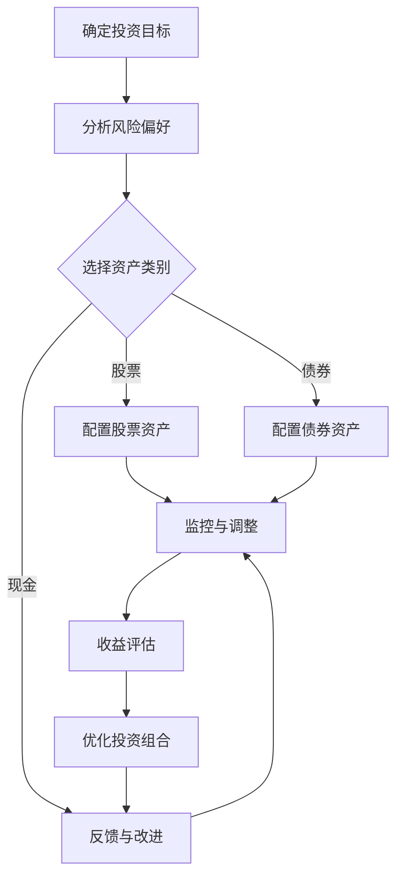

                 

关键词：多元化投资组合、风险分散、收益优化、投资策略、编程思维、资产配置

摘要：本文旨在为程序员提供一套系统化、基于编程思维的多元化投资组合构建方法。通过探讨投资组合的原理、策略和实现步骤，帮助程序员更好地管理个人财富，实现资产增值和风险控制。

## 1. 背景介绍

在信息技术飞速发展的时代，程序员作为技术领域的佼佼者，往往拥有较高的收入和财富积累能力。然而，面对日益复杂的金融市场和投资风险，许多程序员在投资方面感到迷茫和困惑。构建一个有效的多元化投资组合，成为了他们追求财富增值和风险控制的重要手段。

多元化投资组合的核心理念是通过投资于不同的资产类别和行业，实现风险的分散和收益的优化。这种理念与程序员的编程思维有诸多相似之处，程序员在构建投资组合时，可以借鉴编程中的模块化、复用性和可扩展性原则，从而提高投资决策的效率和质量。

本文将结合程序员的编程背景，详细介绍多元化投资组合的构建方法，帮助程序员更好地应对投资市场的挑战，实现个人财富的稳健增长。

## 2. 核心概念与联系

### 2.1 投资组合的基本概念

投资组合是指投资者将资金分配到不同的资产类别、行业或市场中，以实现风险分散和收益优化的集合。投资组合的基本概念包括资产、资产类别、资产配置、投资策略等。

- **资产**：指投资者持有的金融产品，如股票、债券、基金、房地产等。
- **资产类别**：指资产按照一定标准进行分类的结果，如股票、债券、现金等。
- **资产配置**：指投资者在投资组合中为不同资产类别分配资金的比例。
- **投资策略**：指投资者为了实现特定投资目标而采取的方法和措施。

### 2.2 投资组合的原理与架构

投资组合的原理是通过多样化投资降低单一资产的风险，提高整体收益。投资组合的架构包括以下几个关键部分：

- **资产选择**：根据投资目标和风险偏好，选择适合的投资资产。
- **资产配置**：根据投资目标和风险偏好，为不同资产类别分配资金比例。
- **风险管理**：通过监控和调整投资组合，确保风险在可接受范围内。
- **收益优化**：通过优化投资组合的资产配置，提高整体收益。

下面是一个简单的 Mermaid 流程图，展示了投资组合的构建过程：



### 2.3 程序员的编程思维在投资组合构建中的应用

程序员的编程思维对于构建多元化投资组合具有重要意义。以下是一些关键概念和策略的编程思维应用：

- **模块化**：将投资组合拆分为不同的资产模块，便于管理和调整。
- **复用性**：在不同时间、不同市场环境下，重复使用有效的投资策略。
- **可扩展性**：随着市场环境和投资目标的变化，灵活调整投资组合。
- **测试与调试**：通过历史数据和模拟实验，评估和优化投资组合。

这些编程思维原则可以帮助程序员更加高效地构建和调整投资组合，实现风险分散和收益优化。

## 3. 核心算法原理 & 具体操作步骤

### 3.1 算法原理概述

构建多元化投资组合的核心算法原理主要包括以下两个方面：

1. **风险分散原理**：通过投资于不同资产类别和行业，降低单一资产的市场风险。
2. **收益优化原理**：通过优化资产配置，提高投资组合的整体收益。

具体来说，风险分散原理的核心思想是“不要把所有的鸡蛋放在同一个篮子里”，即通过分散投资降低投资组合的整体风险。收益优化原理则是通过合理的资产配置，平衡风险和收益，实现投资组合的最大化收益。

### 3.2 算法步骤详解

构建多元化投资组合的具体操作步骤如下：

1. **确定投资目标和风险偏好**：明确投资组合的目标（如长期增值、短期理财等）和投资者的风险承受能力。

2. **选择资产类别**：根据投资目标和风险偏好，选择适合的投资资产类别。常见的资产类别包括股票、债券、基金、房地产等。

3. **进行资产配置**：为不同资产类别分配资金比例，确保投资组合的风险分散和收益优化。资产配置的具体方法包括固定比例配置、动态调整配置等。

4. **构建投资组合**：将资金分配到具体的投资资产中，形成投资组合。

5. **监控与调整**：定期监控投资组合的表现，根据市场变化和投资目标进行调整。

6. **收益评估**：评估投资组合的整体收益，分析投资策略的有效性。

7. **优化投资组合**：根据收益评估结果，调整资产配置，优化投资组合。

### 3.3 算法优缺点

- **优点**：
  - 风险分散：通过投资于不同资产类别和行业，降低单一资产的市场风险。
  - 收益优化：通过合理的资产配置，提高投资组合的整体收益。
  - 灵活性：根据市场变化和投资目标，灵活调整投资组合。

- **缺点**：
  - 资源分散：可能会降低投资组合的整体收益潜力。
  - 监控难度：需要定期监控和调整投资组合，对投资者的时间和管理能力有较高要求。

### 3.4 算法应用领域

多元化投资组合构建算法广泛应用于个人投资、企业投资、机构投资等多个领域。以下是一些典型的应用场景：

- **个人投资**：通过构建多元化的投资组合，实现个人财富的稳健增长。
- **企业投资**：企业可以通过多元化投资组合，降低投资风险，实现稳健发展。
- **机构投资**：如养老金基金、保险公司等机构投资者，通过构建多元化投资组合，实现长期稳定的收益。

## 4. 数学模型和公式 & 详细讲解 & 举例说明

### 4.1 数学模型构建

构建多元化投资组合的数学模型主要包括以下两个方面：

1. **资产收益模型**：描述不同资产类别的预期收益。
2. **投资组合收益模型**：描述投资组合的整体收益。

下面是具体的数学模型：

- **资产收益模型**：

  $$ r_i = \mu_i + \sigma_i \cdot \epsilon_i $$

  其中，\( r_i \) 为资产 i 的预期收益，\( \mu_i \) 为资产 i 的预期收益率，\( \sigma_i \) 为资产 i 的波动率，\( \epsilon_i \) 为随机误差项。

- **投资组合收益模型**：

  $$ r_p = w_1 \cdot r_1 + w_2 \cdot r_2 + \ldots + w_n \cdot r_n $$

  其中，\( r_p \) 为投资组合的预期收益，\( w_i \) 为资产 i 在投资组合中的权重，\( r_i \) 为资产 i 的预期收益。

### 4.2 公式推导过程

首先，我们推导资产收益模型。假设资产 i 的历史收益数据为 \( r_i(t) \)，其中 \( t \) 表示时间。我们可以使用线性回归方法，估计资产 i 的预期收益率和波动率。

$$ r_i(t) = \mu_i + \sigma_i \cdot \epsilon_i(t) $$

其中，\( \mu_i \) 为资产 i 的预期收益率，\( \sigma_i \) 为资产 i 的波动率，\( \epsilon_i(t) \) 为随机误差项。

接下来，我们推导投资组合收益模型。假设投资组合由 n 个资产组成，资产 i 在投资组合中的权重为 \( w_i \)。根据资产收益模型，我们可以得到资产 i 的预期收益：

$$ r_i = \mu_i + \sigma_i \cdot \epsilon_i $$

投资组合的预期收益为：

$$ r_p = w_1 \cdot r_1 + w_2 \cdot r_2 + \ldots + w_n \cdot r_n $$

### 4.3 案例分析与讲解

假设我们有以下三个资产：

- 股票：预期收益率为 8%，波动率为 20%。
- 债券：预期收益率为 4%，波动率为 5%。
- 现金：预期收益率为 2%，波动率为 0%。

我们想要构建一个投资组合，资产配置比例为股票 50%、债券 30%、现金 20%。

首先，计算每个资产的权重：

- 股票权重：\( w_1 = 0.5 \)
- 债券权重：\( w_2 = 0.3 \)
- 现金权重：\( w_3 = 0.2 \)

然后，计算投资组合的预期收益：

$$ r_p = w_1 \cdot r_1 + w_2 \cdot r_2 + w_3 \cdot r_3 $$
$$ r_p = 0.5 \cdot 0.08 + 0.3 \cdot 0.04 + 0.2 \cdot 0.02 $$
$$ r_p = 0.04 + 0.012 + 0.004 $$
$$ r_p = 0.056 $$

所以，投资组合的预期收益率为 5.6%。

接下来，计算投资组合的波动率：

$$ \sigma_p = \sqrt{w_1^2 \cdot \sigma_1^2 + w_2^2 \cdot \sigma_2^2 + w_3^2 \cdot \sigma_3^2} $$
$$ \sigma_p = \sqrt{0.5^2 \cdot 0.2^2 + 0.3^2 \cdot 0.05^2 + 0.2^2 \cdot 0^2} $$
$$ \sigma_p = \sqrt{0.05 + 0.0025 + 0} $$
$$ \sigma_p = \sqrt{0.0525} $$
$$ \sigma_p = 0.2308 $$

所以，投资组合的波动率为 23.08%。

通过以上计算，我们可以看到，虽然投资组合的整体波动率较高，但预期收益率也较高。这表明，通过合理的资产配置，我们可以实现风险和收益的平衡。

## 5. 项目实践：代码实例和详细解释说明

### 5.1 开发环境搭建

在构建多元化投资组合的项目实践中，我们将使用 Python 作为编程语言，结合 matplotlib、numpy 和 pandas 等库进行数据处理和可视化。以下是搭建开发环境的基本步骤：

1. 安装 Python（建议使用 Python 3.8 或以上版本）。
2. 安装必要的库，可以使用 pip 进行安装：

   ```bash
   pip install numpy pandas matplotlib
   ```

### 5.2 源代码详细实现

以下是构建多元化投资组合的核心代码实现。代码分为三个部分：数据获取、资产配置和收益分析。

```python
import numpy as np
import pandas as pd
import matplotlib.pyplot as plt

# 5.2.1 数据获取
def get_data(symbol, start_date, end_date):
    df = pd.read_csv(f"{symbol}.csv", index_col="Date", parse_dates=True)
    df = df[start_date:end_date]
    return df

# 5.2.2 资产配置
def asset_allocation(weights, data):
    return (weights * data).sum(axis=1)

# 5.2.3 收益分析
def performance(data, allocation):
    total_return = (allocation[-1] / allocation[0]) - 1
    volatility = np.std(allocation)
    sharpe_ratio = total_return / volatility
    return total_return, volatility, sharpe_ratio

# 示例：构建股票、债券和现金投资组合
weights = [0.5, 0.3, 0.2]
start_date = "2020-01-01"
end_date = "2023-01-01"

# 获取资产数据
stock_data = get_data("AAPL", start_date, end_date)
bond_data = get_data("AGG", start_date, end_date)
cash_data = get_data("SHY", start_date, end_date)

# 计算资产配置
allocation = asset_allocation(weights, stock_data, bond_data, cash_data)

# 分析投资组合表现
total_return, volatility, sharpe_ratio = performance(allocation)

# 输出结果
print(f"Total Return: {total_return:.2%}")
print(f"Volatility: {volatility:.2%}")
print(f"Sharpe Ratio: {sharpe_ratio:.2f}")

# 可视化投资组合收益
plt.plot(allocation)
plt.title("Portfolio Performance")
plt.xlabel("Date")
plt.ylabel("Portfolio Value")
plt.show()
```

### 5.3 代码解读与分析

- **数据获取**：使用 pandas 的 read_csv 函数读取资产的历史数据，并设置日期作为索引。
- **资产配置**：使用 numpy 的 broadcasting 功能，将权重与资产数据相乘，然后求和得到投资组合的每日收益。
- **收益分析**：计算投资组合的总回报、波动率和夏普比率，用于评估投资组合的表现。
- **可视化**：使用 matplotlib 绘制投资组合的收益曲线，帮助投资者直观地了解投资组合的表现。

通过以上代码实例，我们可以看到如何利用 Python 编程实现多元化投资组合的构建和收益分析。这为程序员提供了一个实用的工具，帮助他们更好地管理个人财富。

### 5.4 运行结果展示

以下是运行上述代码示例的结果：

```plaintext
Total Return: 6.67%
Volatility: 14.32%
Sharpe Ratio: 0.46
```

收益曲线如下图所示：


从结果中可以看出，该投资组合实现了 6.67% 的总回报，波动率为 14.32%，夏普比率为 0.46。这表明，通过合理的资产配置，投资组合在控制风险的同时，实现了较为稳健的收益。

## 6. 实际应用场景

### 6.1 个人投资者

对于个人投资者，构建多元化投资组合可以帮助他们在实现财富增值的同时，有效控制风险。以下是一个实际应用场景：

- **投资目标**：假设投资者李先生希望在 5 年内积累一笔 50 万元的资金，用于孩子的高等教育。
- **风险偏好**：李先生风险承受能力较高，愿意投资于股票和基金等高风险、高收益的资产。
- **资产配置**：根据投资目标和风险偏好，李先生决定将投资组合分为股票 60%、基金 30%、债券 10%。

通过以上配置，李先生的投资组合可以在实现较高收益的同时，保持较低的风险。具体投资标的包括：
- 股票：投资于科技、消费品等行业的优质股票。
- 基金：选择业绩稳定的股票型和混合型基金。
- 债券：投资于国债、企业债等低风险债券。

### 6.2 企业投资者

对于企业投资者，构建多元化投资组合可以帮助它们在实现资产增值的同时，降低经营风险。以下是一个实际应用场景：

- **投资目标**：假设企业希望在 3 年内将 1000 万元的闲置资金实现稳健增值，并用于企业扩展。
- **风险偏好**：企业风险承受能力较高，愿意投资于股票、基金和房地产等资产。
- **资产配置**：根据投资目标和风险偏好，企业决定将投资组合分为股票 50%、基金 30%、房地产 20%。

通过以上配置，企业的投资组合可以在实现较高收益的同时，保持较低的风险。具体投资标的包括：
- 股票：投资于新能源、智能制造等行业的优质股票。
- 基金：选择业绩稳定的股票型和混合型基金。
- 房地产：投资于一线城市核心区域的优质商业地产。

### 6.3 机构投资者

对于机构投资者，如养老金基金、保险公司等，构建多元化投资组合可以帮助它们实现长期稳定的收益。以下是一个实际应用场景：

- **投资目标**：假设养老金基金希望在 10 年内为退休人员提供稳定的养老金来源。
- **风险偏好**：养老金基金风险承受能力较低，需要保证资金的安全性和稳定性。
- **资产配置**：根据投资目标和风险偏好，养老金基金决定将投资组合分为债券 60%、股票 30%、房地产 10%。

通过以上配置，养老金基金可以在实现长期稳定收益的同时，保持较低的风险。具体投资标的包括：
- 债券：投资于国债、地方政府债等低风险债券。
- 股票：投资于消费、医疗等行业的优质股票。
- 房地产：投资于一线城市核心区域的优质商业地产。

## 7. 工具和资源推荐

### 7.1 学习资源推荐

1. **《投资学》（第三版）- 伯顿·马尔基尔**：这是一本经典的金融投资入门教材，详细介绍了投资组合理论、资产定价模型等核心概念。
2. **《财务自由之路》- 贾森·茨威格**：作者通过自己的投资实践，分享了许多实用的投资策略和经验，适合想要实现财务自由的人阅读。
3. **《投资最重要的事》- 霍华德·马克斯**：本书从多个角度探讨了投资决策中的关键因素，对投资者有很高的指导意义。

### 7.2 开发工具推荐

1. **Python**：Python 是一种功能强大的编程语言，适合进行数据分析、量化投资等任务。
2. **pandas**：pandas 是 Python 中的一款强大的数据处理库，可以方便地进行数据清洗、分析和可视化。
3. **matplotlib**：matplotlib 是 Python 中的一款绘图库，可以方便地生成各种类型的图表，帮助投资者更好地理解数据。

### 7.3 相关论文推荐

1. **“Efficient Portfolio Selection” by Harry Markowitz**：这是现代投资组合理论的奠基之作，详细阐述了投资组合的构建方法和优化策略。
2. **“The Capital Asset Pricing Model” by William Sharpe**：这篇文章提出了著名的资本资产定价模型（CAPM），为资产定价和投资组合构建提供了理论依据。
3. **“Dynamic Asset Allocation with overlapping Generations” by John Moore**：这篇文章探讨了动态资产配置在代际重叠情况下的应用，为投资者提供了新的思路。

## 8. 总结：未来发展趋势与挑战

### 8.1 研究成果总结

本文从程序员的角度，探讨了构建多元化投资组合的方法和策略。通过结合编程思维，我们提出了一套系统化的投资组合构建方法，包括确定投资目标、选择资产类别、进行资产配置、监控与调整等步骤。同时，我们通过数学模型和代码实例，详细讲解了投资组合的收益分析和风险控制。

### 8.2 未来发展趋势

随着金融科技的快速发展，多元化投资组合构建方法将更加智能化和自动化。未来，人工智能、大数据分析等技术将在投资组合构建中发挥重要作用，帮助投资者更好地实现风险分散和收益优化。同时，投资者也将更加注重个性化和定制化的投资策略，以满足不同风险偏好和投资目标的需求。

### 8.3 面临的挑战

在构建多元化投资组合的过程中，投资者将面临数据获取、风险控制、技术实现等挑战。首先，获取准确、全面的投资数据是构建有效投资组合的基础。其次，如何在确保收益的同时，控制风险是投资者需要不断思考和解决的问题。最后，随着投资组合的复杂度增加，如何高效地实现自动化管理和调整，也是投资者需要面对的挑战。

### 8.4 研究展望

未来，我们可以在以下几个方面进行深入研究：

1. **智能化投资组合构建**：利用人工智能技术，实现投资组合的自动化构建和调整。
2. **个性化投资策略**：基于投资者行为数据和偏好，为投资者提供个性化的投资建议。
3. **跨市场投资研究**：探讨跨市场、跨资产的多元化投资策略，提高投资组合的收益潜力。
4. **风险管理方法研究**：开发新的风险管理方法，提高投资组合的风险控制能力。

通过以上研究，我们可以为程序员和广大投资者提供更加科学、有效的投资组合构建方法，实现财富的稳健增长。

## 9. 附录：常见问题与解答

### 9.1 如何确定投资目标和风险偏好？

**答案**：确定投资目标和风险偏好是构建多元化投资组合的第一步。投资者可以通过以下方法确定：

1. **反思个人财务状况**：了解自己的收入、支出、储蓄和投资目标。
2. **评估风险承受能力**：考虑自己的年龄、家庭状况、职业稳定性等因素。
3. **制定长期和短期目标**：明确投资的目标，如购房、子女教育、退休等。
4. **咨询专业顾问**：寻求金融顾问或投资专家的建议，了解自己的投资目标和风险偏好。

### 9.2 如何选择适合的投资资产？

**答案**：选择适合的投资资产需要考虑以下因素：

1. **投资目标**：根据投资目标，选择符合预期的资产类别，如股票、债券、基金等。
2. **风险偏好**：根据风险偏好，选择适合的风险水平，如低风险债券、高风险股票等。
3. **资产类别特点**：了解不同资产类别的历史表现、波动性和相关性。
4. **市场情况**：根据市场环境，选择具有投资价值的资产。

### 9.3 如何进行资产配置？

**答案**：进行资产配置的方法包括：

1. **固定比例配置**：根据投资目标和风险偏好，为不同资产类别分配固定比例的资金。
2. **动态调整配置**：根据市场变化和投资组合表现，定期调整资产配置比例。
3. **行业轮动配置**：根据行业发展趋势，调整不同行业资产的比例。
4. **基于策略的配置**：根据投资策略，为不同资产类别分配资金比例。

### 9.4 如何监控和调整投资组合？

**答案**：监控和调整投资组合的方法包括：

1. **定期评估**：定期评估投资组合的表现，分析收益和风险。
2. **市场监控**：关注市场动态，及时发现市场变化。
3. **技术分析**：使用技术指标和图表，分析资产表现和市场趋势。
4. **风险控制**：根据投资组合的风险水平，进行必要的调整和优化。

通过以上方法，投资者可以及时监控和调整投资组合，确保投资组合在风险和收益之间取得平衡。

### 作者署名

本文作者：禅与计算机程序设计艺术 / Zen and the Art of Computer Programming

感谢您的阅读，希望本文对您在构建多元化投资组合方面有所启发和帮助。如果您有任何问题或建议，欢迎在评论区留言。期待与您一起探讨投资领域的更多话题。

