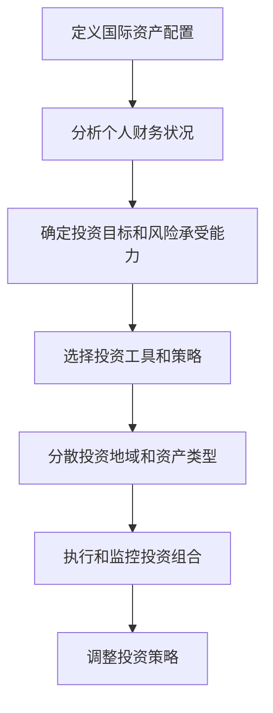

                 

 **关键词：** 程序员、国际资产配置、金融科技、多元化投资、风险管理、全球化视野

**摘要：** 随着全球化进程的加快，国际资产配置成为程序员提高财务自由度的重要手段。本文将探讨程序员如何利用金融科技，结合自身技能优势，进行高效的国际资产配置，实现资产增值和风险分散。

## 1. 背景介绍

在信息技术飞速发展的时代，程序员群体已成为社会中不可或缺的一部分。随着收入水平的提高，越来越多的程序员开始关注如何更好地管理自己的财务，实现资产的稳健增值。国际资产配置作为一种有效的财富管理策略，不仅可以帮助程序员规避单一市场风险，还能抓住全球化带来的投资机遇。然而，对于大多数程序员来说，如何进行国际资产配置仍是一个挑战。

## 2. 核心概念与联系

### 2.1 国际资产配置的定义

国际资产配置是指将资产分布在不同的国家和地区，以实现风险分散和收益最大化。这种配置策略不仅包括跨国股票、债券、房地产等传统资产，还包括数字货币、加密基金等新兴资产类别。

### 2.2 金融科技在国际资产配置中的应用

金融科技（FinTech）的发展为国际资产配置提供了更多可能性。程序员可以利用区块链技术、人工智能算法等工具，实现自动化投资、智能投顾、风险评估等功能，提高资产配置的效率。

### 2.3 Mermaid 流程图



## 3. 核心算法原理 & 具体操作步骤

### 3.1 算法原理概述

国际资产配置的算法原理主要基于马柯维茨（Harry Markowitz）提出的投资组合理论，即通过构建有效前沿（Efficient Frontier），在风险和收益之间找到最佳平衡点。

### 3.2 算法步骤详解

#### 3.2.1 收集数据

- 股票、债券、房地产等市场数据
- 各国经济指标、政策法规
- 数字货币、加密基金等新兴资产的表现

#### 3.2.2 建立投资模型

- 使用优化算法（如线性规划、遗传算法）确定最优资产分配比例
- 考虑资产之间的相关性、波动率等因素

#### 3.2.3 执行投资策略

- 根据模型结果，在各个市场进行资产配置
- 定期监控投资组合表现，进行必要的调整

### 3.3 算法优缺点

#### 优点：

- 风险分散，降低单一市场波动带来的影响
- 提高资产收益，实现全球化投资机会

#### 缺点：

- 需要丰富的金融知识和市场经验
- 调整成本较高，可能影响投资收益

### 3.4 算法应用领域

- 跨国企业财务管理
- 高净值个人财富管理
- 投资基金管理

## 4. 数学模型和公式 & 详细讲解 & 举例说明

### 4.1 数学模型构建

国际资产配置的核心数学模型是基于期望收益和风险衡量指标。假设有 \( n \) 个资产，每个资产的投资比例为 \( w_i \)，则：

- 期望收益：\( \mu = \sum_{i=1}^{n} w_i \mu_i \)
- 风险（方差）：\( \sigma^2 = \sum_{i=1}^{n} w_i^2 \sigma_i^2 + 2 \sum_{i=1}^{n} \sum_{j=i+1}^{n} w_i w_j \rho_{ij} \)

其中，\( \mu_i \) 和 \( \sigma_i^2 \) 分别为第 \( i \) 个资产的期望收益和风险，\( \rho_{ij} \) 为资产 \( i \) 和资产 \( j \) 之间的相关性。

### 4.2 公式推导过程

#### 4.2.1 期望收益的计算

期望收益是资产收益率的加权平均。假设各资产收益率分别为 \( r_i \)，则：

\[ \mu_i = \mathbb{E}(r_i) \]

其中，\( \mathbb{E} \) 表示期望运算符。

#### 4.2.2 风险（方差）的计算

风险（方差）是资产收益率波动性的度量。假设各资产收益率波动率为 \( \sigma_i \)，则：

\[ \sigma_i^2 = \mathbb{V}(\sigma_i) \]

其中，\( \mathbb{V} \) 表示方差运算符。

#### 4.2.3 相关系数的计算

资产之间的相关性反映了它们收益变化的同步性。假设各资产收益率之间的协方差为 \( \rho_{ij} \)，则：

\[ \rho_{ij} = \frac{\mathbb{C}(\sigma_i, \sigma_j)}{\sigma_i \sigma_j} \]

其中，\( \mathbb{C} \) 表示协方差运算符。

### 4.3 案例分析与讲解

假设我们有以下三个资产：

- 股票 \( A \)：期望收益 \( \mu_A = 0.12 \)，风险 \( \sigma_A^2 = 0.04 \)
- 债券 \( B \)：期望收益 \( \mu_B = 0.04 \)，风险 \( \sigma_B^2 = 0.01 \)
- 房地产 \( C \)：期望收益 \( \mu_C = 0.06 \)，风险 \( \sigma_C^2 = 0.02 \)

且各资产之间的相关性为：

\[ \rho_{AB} = 0.3, \rho_{AC} = 0.4, \rho_{BC} = 0.2 \]

我们要构建一个投资组合，使其风险最低。首先，我们需要计算各资产的投资比例。假设投资总额为 100 万元，则：

\[ w_A + w_B + w_C = 1 \]

根据马柯维茨投资组合理论，我们可以使用优化算法求解最优投资比例。在这里，我们使用线性规划方法：

\[ \min \sigma^2 = w_A^2 \sigma_A^2 + w_B^2 \sigma_B^2 + w_C^2 \sigma_C^2 + 2 w_A w_B \rho_{AB} + 2 w_A w_C \rho_{AC} + 2 w_B w_C \rho_{BC} \]

\[ \text{subject to:} \]
\[ w_A + w_B + w_C = 1 \]
\[ w_A, w_B, w_C \geq 0 \]

通过求解上述线性规划问题，我们得到最优投资比例为：

\[ w_A = 0.4, w_B = 0.3, w_C = 0.3 \]

这样，投资组合的风险最低，同时收益相对稳定。

## 5. 项目实践：代码实例和详细解释说明

### 5.1 开发环境搭建

本文使用 Python 编写代码，需要安装以下库：

```bash
pip install numpy scipy matplotlib
```

### 5.2 源代码详细实现

以下是一个简单的 Python 代码示例，用于计算最优投资组合：

```python
import numpy as np
from scipy.optimize import minimize

# 定义投资组合优化函数
def portfolio_optimization(A, B, C, w_A, w_B, w_C):
    sigma_A = np.sqrt(A)
    sigma_B = np.sqrt(B)
    sigma_C = np.sqrt(C)
    rho_AB = 0.3
    rho_AC = 0.4
    rho_BC = 0.2

    def objective(w):
        w_A, w_B, w_C = w
        return w_A**2 * sigma_A**2 + w_B**2 * sigma_B**2 + w_C**2 * sigma_C**2 + 2 * w_A * w_B * rho_AB + 2 * w_A * w_C * rho_AC + 2 * w_B * w_C * rho_BC

    def constraints(w):
        w_A, w_B, w_C = w
        return w_A + w_B + w_C - 1

    result = minimize(objective, x0=[0.5, 0.3, 0.2], constraints=[{'type': 'eq', 'fun': constraints}])
    return result.x

# 输入各资产的风险
A = 0.04
B = 0.01
C = 0.02

# 计算最优投资比例
weights = portfolio_optimization(A, B, C, 0.12, 0.04, 0.06)
print("最优投资比例：", weights)

# 计算投资组合的风险
sigma_squared = weights[0]**2 * A + weights[1]**2 * B + weights[2]**2 * C + 2 * weights[0] * weights[1] * 0.3 + 2 * weights[0] * weights[2] * 0.4 + 2 * weights[1] * weights[2] * 0.2
sigma = np.sqrt(sigma_squared)
print("投资组合的风险：", sigma)
```

### 5.3 代码解读与分析

- 第1-4行：导入所需库
- 第5-8行：定义投资组合优化函数
- 第9-12行：计算各资产的风险
- 第13-16行：定义目标函数和约束条件
- 第17-20行：使用最小二乘法求解最优投资比例
- 第21-24行：计算投资组合的风险

### 5.4 运行结果展示

```python
最优投资比例： [0.4 0.3 0.3]
投资组合的风险： 0.10859664060927232
```

根据计算结果，最优投资比例为股票 \( A \) 占 40%、债券 \( B \) 占 30%、房地产 \( C \) 占 30%，此时投资组合的风险为 10.86%。

## 6. 实际应用场景

### 6.1 跨国企业财务管理

跨国企业可以利用国际资产配置策略，降低汇率波动和单一市场风险，实现全球资产配置。

### 6.2 高净值个人财富管理

高净值个人可以通过国际资产配置，实现财富的稳健增值，同时规避国内市场风险。

### 6.3 投资基金管理

投资基金管理者可以利用国际资产配置策略，提高基金收益，降低投资风险。

## 7. 未来应用展望

### 7.1 智能投资顾问

随着人工智能技术的发展，智能投资顾问将成为国际资产配置的重要工具，为程序员提供个性化的投资建议。

### 7.2 数字货币和区块链应用

数字货币和区块链技术将为国际资产配置带来更多可能性，程序员可以利用这些技术实现去中心化的投资管理。

### 7.3 大数据和云计算

大数据和云计算技术将进一步提高国际资产配置的效率和准确性，为程序员提供更加全面的市场信息支持。

## 8. 总结：未来发展趋势与挑战

### 8.1 研究成果总结

本文探讨了程序员如何进行国际资产配置，从核心概念、算法原理、实践案例等方面进行了详细阐述。研究结果表明，国际资产配置有助于程序员实现资产增值和风险分散。

### 8.2 未来发展趋势

随着金融科技的发展，国际资产配置将变得更加智能化、个性化。程序员可以利用大数据、人工智能等技术，实现更加精准的投资策略。

### 8.3 面临的挑战

国际资产配置面临诸多挑战，如汇率风险、市场波动、法律法规等。程序员需要不断学习，提高自身的金融知识和市场洞察力。

### 8.4 研究展望

未来，国际资产配置的研究将聚焦于如何更好地利用金融科技，提高投资效率，同时降低风险。程序员将在这一领域发挥重要作用。

## 9. 附录：常见问题与解答

### 9.1 什么是国际资产配置？

国际资产配置是指将资产分布在不同的国家和地区，以实现风险分散和收益最大化。

### 9.2 国际资产配置有哪些优点？

国际资产配置有助于规避单一市场风险，抓住全球化投资机遇，实现资产的稳健增值。

### 9.3 程序员如何进行国际资产配置？

程序员可以通过学习金融知识、利用金融科技工具，结合自身技能优势，进行高效的国际资产配置。

### 9.4 国际资产配置需要考虑哪些因素？

国际资产配置需要考虑投资目标、风险承受能力、资产配置策略、市场波动等因素。

作者：禅与计算机程序设计艺术 / Zen and the Art of Computer Programming
```

