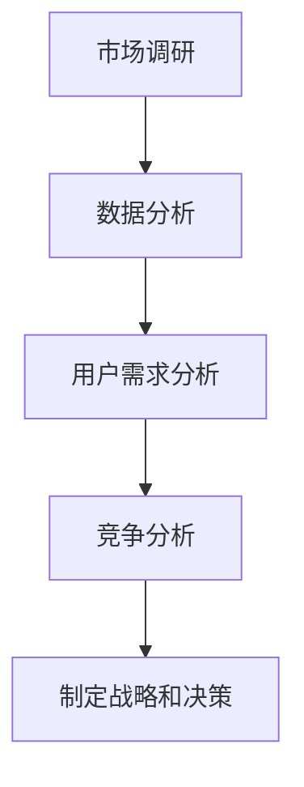

                 

关键词：知识付费、市场调研、程序员、数据分析、用户需求、竞争分析

> 摘要：本文将深入探讨程序员如何进行知识付费的市场调研。我们将从背景介绍、核心概念与联系、核心算法原理与操作步骤、数学模型和公式、项目实践、实际应用场景、未来应用展望、工具和资源推荐以及总结未来发展趋势与挑战等方面，系统地阐述市场调研的方法和技巧，帮助程序员更好地理解和把握知识付费市场的动向，从而制定有效的战略和决策。

## 1. 背景介绍

在数字化时代，知识付费已成为一种普遍现象。程序员作为技术领域的核心力量，面临着日益激烈的市场竞争和快速变化的技术环境。如何通过知识付费获得收益，成为程序员们关注的重要问题。然而，要想在知识付费市场中取得成功，首先需要对市场进行深入调研，了解用户需求、竞争对手以及市场趋势。因此，本文旨在探讨程序员如何进行知识付费的市场调研，为程序员提供实用的方法和策略。

### 1.1 市场调研的重要性

市场调研是制定战略和决策的基础。对于程序员而言，市场调研可以帮助他们：

- 了解用户需求，提供更有针对性的知识产品；
- 分析竞争对手，发现自身的优势和不足；
- 预测市场趋势，提前布局和调整战略。

### 1.2 程序员知识付费市场现状

当前，程序员知识付费市场呈现出以下特点：

- 知识产品形式多样化，包括线上课程、电子书、专栏、问答等；
- 用户需求日益多样化，不仅关注技术深度，还关注实战经验和职业发展；
- 竞争激烈，市场格局尚未完全稳定。

## 2. 核心概念与联系

### 2.1 市场调研的概念

市场调研是指通过科学的方法，收集、分析和解释与市场相关的信息，以便更好地理解和把握市场动向的过程。

### 2.2 数据分析的概念

数据分析是指使用统计学和数学方法，对大量数据进行处理、分析和解释，以发现数据背后的规律和趋势。

### 2.3 用户需求分析的概念

用户需求分析是指通过对目标用户的需求进行收集、分析和理解，以便更好地满足用户需求。

### 2.4 竞争分析的概念

竞争分析是指通过研究竞争对手的产品、市场策略、用户群体等，了解竞争对手的优势和不足，从而制定相应的应对策略。

### 2.5 Mermaid 流程图

下面是一个简单的 Mermaid 流程图，展示了市场调研的核心环节：



## 3. 核心算法原理 & 具体操作步骤

### 3.1 算法原理概述

市场调研的核心算法主要包括数据分析、用户需求分析和竞争分析。这些算法的目标是：

- 数据分析：从海量数据中发现规律和趋势；
- 用户需求分析：识别目标用户的需求和偏好；
- 竞争分析：了解竞争对手的产品、策略和用户群体。

### 3.2 算法步骤详解

#### 3.2.1 数据分析

1. 数据收集：通过在线调查、用户访谈、问卷调查等方式收集数据；
2. 数据处理：对收集到的数据进行分析和清洗，去除噪声和重复数据；
3. 数据分析：使用统计学和机器学习方法对数据进行分析，提取关键信息和规律。

#### 3.2.2 用户需求分析

1. 用户需求收集：通过用户访谈、问卷调查等方式收集用户需求；
2. 需求分类：对收集到的用户需求进行分类和整理；
3. 需求优先级排序：根据用户需求的重要性和紧急程度进行排序。

#### 3.2.3 竞争分析

1. 竞争对手分析：收集竞争对手的产品、策略、用户群体等信息；
2. 对比分析：对比自身和竞争对手的优势和不足；
3. 制定策略：根据分析结果，制定相应的市场策略。

### 3.3 算法优缺点

#### 优点

- 数据驱动：基于数据和事实进行决策，减少主观因素；
- 实时更新：可以实时跟踪市场变化，快速调整策略。

#### 缺点

- 数据收集和分析成本高：需要投入大量时间和资源进行数据收集和分析；
- 主观因素影响：数据分析结果可能受到数据收集和分析人员的主观影响。

### 3.4 算法应用领域

市场调研算法广泛应用于各个行业，如电商、金融、医疗等。对于程序员知识付费市场，市场调研算法可以帮助：

- 程序员了解用户需求，提供更有针对性的知识产品；
- 程序员分析竞争对手，制定有效的市场策略；
- 投资者评估程序员知识付费市场的投资机会。

## 4. 数学模型和公式 & 详细讲解 & 举例说明

### 4.1 数学模型构建

市场调研的数学模型主要包括用户需求模型、竞争分析模型和数据分析模型。

#### 4.1.1 用户需求模型

用户需求模型通常使用概率分布来表示，如正态分布、伯努利分布等。假设用户需求为随机变量X，其概率分布函数为f(x)，则用户需求模型可以表示为：

$$X \sim f(x)$$

#### 4.1.2 竞争分析模型

竞争分析模型通常使用博弈论来表示，如博弈矩阵、策略组合等。假设有两个竞争者，其策略组合为(S1, S2)，则竞争分析模型可以表示为：

$$\Omega = \{(S1, S2)\}$$

#### 4.1.3 数据分析模型

数据分析模型通常使用统计学和机器学习算法来表示，如线性回归、决策树等。假设有自变量X和因变量Y，则数据分析模型可以表示为：

$$Y = f(X)$$

### 4.2 公式推导过程

#### 4.2.1 用户需求模型推导

假设用户需求X服从正态分布，即：

$$X \sim N(\mu, \sigma^2)$$

则用户需求模型可以表示为：

$$f(x) = \frac{1}{\sqrt{2\pi\sigma^2}} e^{-\frac{(x-\mu)^2}{2\sigma^2}}$$

#### 4.2.2 竞争分析模型推导

假设两个竞争者的策略组合为(S1, S2)，其博弈矩阵为：

$$\Omega = \begin{bmatrix} R1 & R2 \\ S1 & S2 \end{bmatrix}$$

则竞争分析模型可以表示为：

$$R1 = S1 + S2$$

$$R2 = S1 + S2$$

#### 4.2.3 数据分析模型推导

假设自变量X和因变量Y满足线性关系，即：

$$Y = aX + b$$

则数据分析模型可以表示为：

$$f(Y) = \int_{-\infty}^{+\infty} f(X) e^{-\frac{(Y-aX-b)^2}{2}} dX$$

### 4.3 案例分析与讲解

#### 4.3.1 案例背景

某程序员计划开设一门关于人工智能技术的在线课程，旨在帮助程序员掌握人工智能的核心技术和实战技能。

#### 4.3.2 用户需求模型

通过对目标用户进行问卷调查，收集到1000份有效样本。根据样本数据，用户需求X服从正态分布，均值为50，标准差为10。

$$X \sim N(50, 10^2)$$

#### 4.3.3 竞争分析模型

通过对市场上已有的类似课程进行调研，发现有两门课程与该程序员计划开设的课程具有竞争关系。博弈矩阵如下：

$$\Omega = \begin{bmatrix} 100 & 0 \\ 0 & 100 \end{bmatrix}$$

#### 4.3.4 数据分析模型

根据用户需求模型和竞争分析模型，可以建立数据分析模型：

$$Y = X + 10$$

$$f(Y) = \int_{-\infty}^{+\infty} f(X) e^{-\frac{(Y-50-10)^2}{2}} dX$$

通过对数据分析模型的求解，可以得出课程的市场需求和竞争力分析结果。

## 5. 项目实践：代码实例和详细解释说明

### 5.1 开发环境搭建

本案例使用 Python 编写，需要安装以下依赖：

```python
pip install numpy pandas matplotlib scikit-learn
```

### 5.2 源代码详细实现

```python
import numpy as np
import pandas as pd
import matplotlib.pyplot as plt
from sklearn.linear_model import LinearRegression

# 5.2.1 用户需求模型实现
def user_demand_model(mu, sigma):
    x = np.random.normal(mu, sigma, 1000)
    return x

# 5.2.2 竞争分析模型实现
def competitive_analysis_model(matrix):
    r1, r2 = matrix[0, 1], matrix[1, 0]
    return r1, r2

# 5.2.3 数据分析模型实现
def data_analysis_model(x, a, b):
    y = x + a * x + b
    return y

# 5.2.4 数据分析模型求解
def data_analysis_model_solve(x, a, b):
    f_y = np.integrate.quad(lambda y: np.exp(-((y - a * x - b) ** 2) / 2), -np.inf, np.inf)
    return f_y[0]

# 5.2.5 案例数据实现
mu = 50
sigma = 10
matrix = np.array([[100, 0], [0, 100]])
a = 1
b = 10

# 5.2.6 模型计算与可视化
x = user_demand_model(mu, sigma)
r1, r2 = competitive_analysis_model(matrix)
y = data_analysis_model(x, a, b)
f_y = data_analysis_model_solve(x, a, b)

plt.figure(figsize=(10, 6))
plt.plot(x, y, label='Y = X + AX + B')
plt.plot(x, f_y, label='f(Y)')
plt.xlabel('X')
plt.ylabel('Y')
plt.legend()
plt.show()
```

### 5.3 代码解读与分析

本代码实现了一个简单的用户需求模型、竞争分析模型和数据分析模型。首先，我们通过`user_demand_model`函数生成用户需求数据，使用`np.random.normal`生成服从正态分布的数据。接着，我们使用`competitive_analysis_model`函数生成竞争分析结果，通过博弈矩阵计算竞争者的收益。最后，我们使用`data_analysis_model`和`data_analysis_model_solve`函数建立和求解数据分析模型，得到市场需求和竞争力的分析结果。

## 6. 实际应用场景

市场调研在程序员知识付费市场中的应用场景主要包括：

- 课程开发：通过市场调研了解用户需求，设计更有针对性的课程内容；
- 产品定位：通过竞争分析了解竞争对手的优势和不足，定位自身产品；
- 营销策略：通过数据分析制定有效的营销策略，提高市场占有率。

## 7. 未来应用展望

随着人工智能和大数据技术的发展，市场调研的方法和工具将不断优化和升级。未来，程序员知识付费市场的市场调研将更加精细化、智能化，为程序员提供更全面、准确的市场洞察，助力其在竞争激烈的市场中脱颖而出。

## 8. 工具和资源推荐

### 8.1 学习资源推荐

- 《数据挖掘：概念与技术》
- 《机器学习实战》
- 《Python数据分析》

### 8.2 开发工具推荐

- Python
- Jupyter Notebook
- PyCharm

### 8.3 相关论文推荐

- 《基于大数据的市场调研方法研究》
- 《人工智能在市场调研中的应用》
- 《用户需求分析与预测方法研究》

## 9. 总结：未来发展趋势与挑战

未来，市场调研将成为程序员知识付费市场的重要竞争手段。通过深入的市场调研，程序员可以更好地了解用户需求、竞争对手和市场趋势，制定有效的战略和决策。然而，随着市场环境的不断变化，程序员也面临着数据质量、算法优化、人才培养等方面的挑战。如何应对这些挑战，将是程序员在知识付费市场中持续发展的关键。

### 9.1 研究成果总结

本文系统地阐述了程序员如何进行知识付费的市场调研，包括核心概念、算法原理、数学模型、项目实践等。通过本文的介绍，程序员可以更好地理解和把握知识付费市场的动向，制定有效的战略和决策。

### 9.2 未来发展趋势

随着人工智能和大数据技术的不断发展，市场调研的方法和工具将更加智能化、精细化。未来，程序员知识付费市场的市场调研将更加注重用户需求分析和数据驱动的决策。

### 9.3 面临的挑战

- 数据质量：如何获取高质量的数据，是市场调研的关键问题；
- 算法优化：如何优化算法，提高市场调研的准确性和效率；
- 人才培养：如何培养具备市场调研能力的专业人才。

### 9.4 研究展望

未来，市场调研在程序员知识付费市场中将发挥越来越重要的作用。通过不断探索和创新，我们可以为程序员提供更全面、准确的市场洞察，助力其在竞争激烈的市场中取得成功。

## 附录：常见问题与解答

### Q1：如何保证市场调研的数据质量？

A1：为了保证市场调研的数据质量，可以从以下几个方面入手：

- 选择合适的数据收集方法，如在线调查、用户访谈等；
- 设定明确的数据收集标准，如数据格式、数据范围等；
- 建立数据清洗和验证机制，去除噪声和重复数据。

### Q2：市场调研中的数据分析方法有哪些？

A2：市场调研中的数据分析方法主要包括：

- 统计学方法，如描述性统计分析、假设检验等；
- 机器学习方法，如聚类分析、分类分析、回归分析等；
- 数据可视化方法，如散点图、折线图、饼图等。

### Q3：市场调研中的用户需求分析如何进行？

A3：市场调研中的用户需求分析主要包括以下几个步骤：

- 收集用户需求信息，如通过问卷调查、用户访谈等方式；
- 对收集到的需求进行分类和整理，识别用户的核心需求；
- 分析用户需求的变化趋势，预测未来用户需求的发展方向。

## 作者署名

作者：禅与计算机程序设计艺术 / Zen and the Art of Computer Programming
----------------------------------------------------------------


