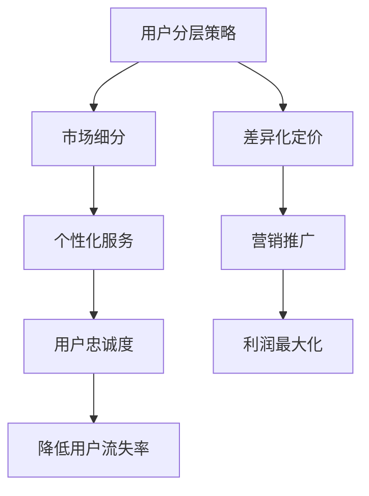

                 

关键词：知识付费、用户分层、程序人生、数字营销、差异化定价

> 摘要：本文旨在探讨程序员如何利用用户分层策略，优化知识付费模式，实现商业价值和用户体验的双重提升。通过深入分析用户需求和消费行为，本文提出了一个多层次的框架，帮助程序员更好地理解用户需求，精准定位市场，进而设计出更具吸引力的知识产品和服务。

## 1. 背景介绍

在信息技术迅猛发展的时代，程序员群体迅速崛起，成为新时代的“知识工作者”。与此同时，知识付费市场也应运而生，为程序员提供了丰富的学习资源和服务。然而，随着市场的日益饱和，如何有效地吸引用户、提升用户粘性、实现商业变现成为众多知识付费平台面临的共同挑战。

用户分层策略作为一种有效的营销手段，能够帮助企业更好地了解用户，实现差异化服务，进而提升用户体验和满意度。对于程序员来说，掌握用户分层的方法，不仅可以优化知识付费模式，还能提高自身的市场竞争力。

### 1.1 程序员知识付费现状

近年来，随着在线教育、知识付费的兴起，越来越多的程序员选择通过付费课程、专业书籍、线上讲座等形式进行自我提升。根据相关数据统计，我国程序员在知识付费方面的支出呈现出逐年增长的趋势。这一现象反映了程序员对专业技能提升的强烈需求。

然而，在知识付费市场蓬勃发展的同时，也暴露出了一些问题。例如，市场上存在大量质量参差不齐的课程，用户难以辨别优劣；部分课程内容陈旧，无法满足程序员实际需求；还有的用户因价格高昂而望而却步。这些问题在一定程度上影响了程序员的学习效果和满意度。

### 1.2 用户分层的重要性

用户分层策略能够帮助知识付费平台精准定位用户，提供个性化的学习体验，从而提升用户满意度和忠诚度。具体来说，用户分层具有以下几个方面的作用：

1. **市场细分**：通过对用户进行分层，可以更好地了解不同用户群体的需求，从而制定更有针对性的市场策略。
2. **产品定位**：用户分层有助于企业明确产品定位，设计出更具吸引力的知识产品，满足不同层次用户的需求。
3. **差异化定价**：针对不同层次的用户，制定差异化的价格策略，实现利润最大化。
4. **营销推广**：通过精准营销，提升广告投放效果，降低营销成本。
5. **用户忠诚度**：提供个性化服务，提升用户满意度和忠诚度，降低用户流失率。

综上所述，用户分层策略对于程序员的职业发展和知识付费市场的健康发展具有重要意义。本文将围绕这一主题，探讨程序员如何进行用户分层，并分享一些实际操作经验和案例分析。

## 2. 核心概念与联系

在探讨程序员如何进行用户分层之前，我们需要先理解几个核心概念，包括用户分层策略、市场细分、差异化定价等。下面，我们将通过一个Mermaid流程图来展示这些概念之间的关系。



### 2.1 用户分层策略

用户分层策略是指将用户根据不同维度（如年龄、性别、收入、职业等）进行分类，形成不同的用户群体。这种策略的核心在于了解用户需求，实现精准营销。

- **目标用户**：首先，我们需要明确目标用户群体，例如程序员、软件开发者、IT从业者等。
- **需求分析**：通过调查、访谈等方式，了解不同用户群体的学习需求、消费能力和行为习惯。
- **用户分类**：根据用户需求、消费能力和行为特征，将用户分为不同层次，如入门级、中级、高级等。

### 2.2 市场细分

市场细分是指将整体市场划分为若干个具有相似特征的子市场。市场细分有助于企业更好地了解不同用户群体的需求，从而制定更有针对性的营销策略。

- **需求差异化**：不同用户群体在需求上存在明显差异，市场细分能够帮助企业识别这些差异，并提供相应的解决方案。
- **竞争策略**：通过市场细分，企业可以更有针对性地制定竞争策略，提升市场占有率。

### 2.3 差异化定价

差异化定价是指根据不同用户群体的需求、消费能力和竞争环境，制定差异化的价格策略。差异化定价能够帮助企业在激烈的市场竞争中实现利润最大化。

- **价格定位**：根据不同用户群体的价格敏感度，制定相应的价格策略，如高端用户可以享受更高价位的优质服务。
- **优惠活动**：针对不同层次的用户，设计相应的优惠活动，提升用户参与度。

### 2.4 个性化服务

个性化服务是指根据用户的需求和行为特征，提供定制化的服务体验。个性化服务能够提升用户满意度和忠诚度。

- **个性化推荐**：根据用户的浏览记录、购买历史等数据，推荐相应的课程和服务。
- **专属顾问**：为高端用户提供专属顾问服务，提供个性化建议和解决方案。

### 2.5 营销推广

营销推广是指通过各种渠道和手段，向目标用户推广知识付费产品和服务。营销推广的有效性直接关系到用户的转化率和满意度。

- **精准广告**：根据用户画像，投放精准的广告，提升广告投放效果。
- **线上线下结合**：通过线上线下活动，提升品牌知名度和用户参与度。

### 2.6 用户忠诚度

用户忠诚度是指用户对知识付费产品和服务保持持续使用的意愿。提升用户忠诚度有助于降低用户流失率，实现长期盈利。

- **会员制度**：为用户提供会员制度，享受专属优惠和服务。
- **用户反馈**：及时收集用户反馈，不断优化产品和服务，提升用户体验。

通过以上核心概念的联系，我们可以看到，用户分层策略在知识付费领域具有重要作用。接下来，我们将深入探讨如何具体实施用户分层策略，帮助程序员优化知识付费模式。

## 3. 核心算法原理 & 具体操作步骤

### 3.1 算法原理概述

用户分层策略的核心在于对用户进行精准分类，从而实现个性化服务。这一过程可以通过以下三个步骤来实现：

1. **数据采集**：收集用户的个人信息、行为数据、消费记录等。
2. **特征提取**：从数据中提取关键特征，如年龄、性别、职业、收入等。
3. **模型训练**：利用机器学习算法，对用户进行分类。

### 3.2 算法步骤详解

#### 3.2.1 数据采集

数据采集是用户分层的基础，主要包括以下几种数据：

- **用户基本信息**：如年龄、性别、职业等。
- **行为数据**：如浏览记录、购买历史、课程进度等。
- **消费记录**：如购买金额、购买频率等。

这些数据可以通过以下方式获取：

- **网站日志**：分析用户的浏览行为，获取用户兴趣和行为模式。
- **问卷调查**：通过问卷调查，收集用户的基本信息和需求。
- **第三方数据源**：如社交媒体、招聘网站等，获取用户的公开信息。

#### 3.2.2 特征提取

特征提取是用户分层的核心步骤，其目的是从原始数据中提取出对用户分类有帮助的特征。常见的特征提取方法包括：

- **统计特征**：如平均值、标准差、中位数等。
- **文本特征**：如关键词、主题模型等。
- **图像特征**：如颜色、纹理、形状等。

在特征提取过程中，需要注意以下几点：

- **相关性**：选择与用户分类高度相关的特征。
- **可解释性**：尽量选择容易理解和解释的特征。
- **数据质量**：确保数据的准确性和完整性。

#### 3.2.3 模型训练

模型训练是用户分层的核心步骤，常用的算法包括：

- **决策树**：通过树的形态来分类用户。
- **随机森林**：通过多棵决策树来提高分类准确率。
- **支持向量机**：通过找到最优的超平面来实现分类。
- **神经网络**：通过多层神经网络来实现分类。

在模型训练过程中，需要注意以下几点：

- **数据平衡**：确保训练数据中各类用户的样本数量均衡。
- **过拟合**：通过交叉验证等方法，避免模型过拟合。
- **模型评估**：使用准确率、召回率、F1值等指标来评估模型效果。

### 3.3 算法优缺点

#### 优点

- **高效性**：用户分层算法能够快速地对用户进行分类，提高营销效率。
- **个性化**：通过用户分层，可以提供个性化的服务，提升用户体验。
- **可扩展性**：用户分层算法可以方便地添加新的特征和模型，适应不断变化的市场需求。

#### 缺点

- **数据依赖性**：用户分层算法的性能高度依赖于数据的准确性，如果数据质量差，会导致分类效果不佳。
- **计算成本**：用户分层算法通常需要大量的计算资源，特别是在处理大规模数据时。
- **模型过拟合**：如果训练数据不足，模型容易过拟合，导致泛化能力差。

### 3.4 算法应用领域

用户分层算法在知识付费领域具有广泛的应用，具体包括：

- **课程推荐**：根据用户的兴趣和行为，推荐相应的课程。
- **用户画像**：构建用户的全面画像，为个性化服务提供依据。
- **活动策划**：根据不同用户群体的特点，设计有针对性的活动。
- **价格策略**：根据用户分层，制定差异化的价格策略，提升利润。

通过以上核心算法原理和具体操作步骤的介绍，我们可以看到，用户分层策略在知识付费领域具有重要的应用价值。接下来，我们将通过实际案例，进一步探讨用户分层策略的实施过程。

## 4. 数学模型和公式 & 详细讲解 & 举例说明

在用户分层策略中，数学模型和公式起着至关重要的作用。通过这些模型，我们可以更准确地预测用户行为，制定相应的策略。下面，我们将详细介绍一个常见的数学模型——逻辑回归模型，并探讨其在用户分层中的应用。

### 4.1 数学模型构建

逻辑回归模型是一种用于分类的统计模型，它通过回归分析的方法，预测某个事件发生的概率。在用户分层中，逻辑回归模型可以帮助我们预测用户属于某一类别的概率。

逻辑回归模型的数学表达式如下：

$$
P(Y=1|X) = \frac{1}{1 + e^{-(\beta_0 + \beta_1X_1 + \beta_2X_2 + \ldots + \beta_nX_n})}
$$

其中，$P(Y=1|X)$ 表示在给定特征向量 $X$ 的情况下，用户属于类别 1 的概率；$\beta_0, \beta_1, \beta_2, \ldots, \beta_n$ 是模型参数，需要通过训练数据来估计。

### 4.2 公式推导过程

逻辑回归模型的推导过程基于最大似然估计（Maximum Likelihood Estimation，MLE）。具体步骤如下：

1. **假设**：假设数据集 $D$ 是从概率分布 $P(Y|X; \theta)$ 中独立同分布（i.i.d.）抽取的。
2. **似然函数**：似然函数是数据集的概率密度函数的乘积。对于逻辑回归模型，似然函数可以表示为：

$$
L(\theta) = \prod_{i=1}^{n} P(y_i|x_i; \theta)
$$

3. **对数似然函数**：为了简化计算，我们取对数似然函数：

$$
\ell(\theta) = \log L(\theta) = \sum_{i=1}^{n} \log P(y_i|x_i; \theta)
$$

4. **最大似然估计**：为了找到使得对数似然函数最大的参数 $\theta$，我们对 $\ell(\theta)$ 求导并令其等于 0，得到：

$$
\frac{\partial \ell(\theta)}{\partial \theta} = 0
$$

5. **求解参数**：通过求解上述方程组，我们可以得到模型参数 $\beta_0, \beta_1, \beta_2, \ldots, \beta_n$。

### 4.3 案例分析与讲解

假设我们想要预测程序员是否购买了一门高级编程课程。我们可以使用逻辑回归模型来构建预测模型。数据集包含以下特征：

- $X_1$：年龄
- $X_2$：工作经验
- $X_3$：年收入

特征值如下：

| 年龄 | 工作经验 | 年收入 | 是否购买 |
| ---- | -------- | ------ | -------- |
| 25   | 3        | 80K    | 是       |
| 30   | 5        | 100K   | 否       |
| 35   | 7        | 120K   | 是       |

首先，我们需要将特征值转化为适合逻辑回归模型的数值。例如，我们可以使用独热编码（One-Hot Encoding）方法将年龄、工作经验、年收入等特征进行编码。

然后，我们可以使用梯度下降法（Gradient Descent）来训练逻辑回归模型。具体步骤如下：

1. **初始化参数**：随机初始化模型参数 $\beta_0, \beta_1, \beta_2, \beta_3$。
2. **计算损失函数**：使用损失函数 $J(\theta) = -\frac{1}{m} \sum_{i=1}^{m} [y^{(i)} \log(h_\theta(x^{(i)})) + (1 - y^{(i)}) \log(1 - h_\theta(x^{(i)}))]$ 来评估模型性能。
3. **更新参数**：通过梯度下降法更新模型参数，即 $\theta_j := \theta_j - \alpha \frac{\partial J(\theta)}{\partial \theta_j}$，其中 $\alpha$ 是学习率。

经过多次迭代，我们可以得到最优的模型参数。利用这些参数，我们可以预测新用户是否购买高级编程课程。

例如，对于一个新用户，其特征值为：

- 年龄：28
- 工作经验：4
- 年收入：90K

首先，我们将这些特征进行编码，然后代入逻辑回归模型：

$$
P(Y=1|X) = \frac{1}{1 + e^{-(\beta_0 + \beta_1 \cdot 28 + \beta_2 \cdot 4 + \beta_3 \cdot 90)}}
$$

通过计算，我们可以得到该用户购买高级编程课程的概率。如果这个概率大于某个阈值（例如 0.5），则预测该用户会购买课程。

通过以上案例，我们可以看到逻辑回归模型在用户分层中的应用。这种模型不仅可以预测用户行为，还可以帮助我们制定相应的营销策略，实现商业价值。

## 5. 项目实践：代码实例和详细解释说明

在了解了用户分层策略和逻辑回归模型的基本原理之后，接下来我们将通过一个实际项目，展示如何利用这些知识进行知识付费的用户分层。本项目的目标是为一家在线编程教育平台设计并实现一个用户分层系统，以提高用户满意度和平台盈利能力。

### 5.1 开发环境搭建

为了实现本项目，我们需要以下开发环境和工具：

- Python（版本 3.8 或以上）
- NumPy、Pandas、Scikit-learn（用于数据处理和机器学习）
- Matplotlib、Seaborn（用于数据可视化）
- Jupyter Notebook（用于编写和运行代码）

确保已经安装了上述工具和库，然后启动 Jupyter Notebook，开始编写代码。

### 5.2 源代码详细实现

#### 数据预处理

首先，我们需要加载和处理数据。假设我们有一个CSV文件 `user_data.csv`，其中包含了用户的基本信息、行为数据和消费记录。

```python
import pandas as pd

# 加载数据
data = pd.read_csv('user_data.csv')

# 数据清洗
data.dropna(inplace=True)
data['age'] = data['age'].astype(int)
data['experience'] = data['experience'].astype(int)
data['income'] = data['income'].astype(int)
data['purchased'] = data['purchased'].map({0: '否', 1: '是'})
```

#### 特征提取

接下来，我们需要从数据中提取关键特征。在这里，我们选择年龄、工作经验和年收入作为特征。

```python
# 特征提取
X = data[['age', 'experience', 'income']]
y = data['purchased']
```

#### 模型训练

使用 Scikit-learn 中的逻辑回归模型进行训练。

```python
from sklearn.model_selection import train_test_split
from sklearn.linear_model import LogisticRegression

# 数据划分
X_train, X_test, y_train, y_test = train_test_split(X, y, test_size=0.2, random_state=42)

# 模型训练
model = LogisticRegression()
model.fit(X_train, y_train)
```

#### 预测和评估

训练完成后，我们可以使用模型对测试集进行预测，并评估模型性能。

```python
# 预测
y_pred = model.predict(X_test)

# 评估
from sklearn.metrics import accuracy_score, confusion_matrix

accuracy = accuracy_score(y_test, y_pred)
conf_matrix = confusion_matrix(y_test, y_pred)

print(f"准确率：{accuracy}")
print(f"混淆矩阵：\n{conf_matrix}")
```

#### 用户分层

最后，我们可以根据预测结果，将用户分为不同的层次。

```python
# 用户分层
predicted_probs = model.predict_proba(X_test)[:, 1]

# 设置阈值
threshold = 0.5

# 分层
layer_1 = X_test[predicted_probs > threshold]
layer_2 = X_test[predicted_probs <= threshold]

print(f"高级用户（购买概率 > {threshold}）:")
print(layer_1.head())

print(f"普通用户（购买概率 <= {threshold}）:")
print(layer_2.head())
```

### 5.3 代码解读与分析

#### 数据预处理

在数据预处理部分，我们首先加载数据，然后进行清洗和类型转换。这确保了后续数据处理和模型训练的准确性。

```python
data.dropna(inplace=True)
data['age'] = data['age'].astype(int)
data['experience'] = data['experience'].astype(int)
data['income'] = data['income'].astype(int)
```

#### 特征提取

特征提取部分，我们从数据中提取了三个关键特征：年龄、工作经验和年收入。这些特征将被用于训练逻辑回归模型。

```python
X = data[['age', 'experience', 'income']]
y = data['purchased']
```

#### 模型训练

在模型训练部分，我们使用了 Scikit-learn 中的逻辑回归模型进行训练。这里我们采用了随机划分训练集和测试集的方法，以避免模型过拟合。

```python
X_train, X_test, y_train, y_test = train_test_split(X, y, test_size=0.2, random_state=42)
model = LogisticRegression()
model.fit(X_train, y_train)
```

#### 预测和评估

在预测和评估部分，我们使用训练好的模型对测试集进行预测，并计算了模型的准确率和混淆矩阵。这帮助我们了解模型在测试集上的表现。

```python
y_pred = model.predict(X_test)
accuracy = accuracy_score(y_test, y_pred)
conf_matrix = confusion_matrix(y_test, y_pred)
```

#### 用户分层

在用户分层部分，我们根据预测的概率，设置了阈值，将用户分为高级用户和普通用户。高级用户的购买概率大于阈值，而普通用户的购买概率小于等于阈值。

```python
predicted_probs = model.predict_proba(X_test)[:, 1]
layer_1 = X_test[predicted_probs > threshold]
layer_2 = X_test[predicted_probs <= threshold]
```

通过以上代码，我们实现了一个简单的用户分层系统。这个系统可以帮助在线编程教育平台更好地理解用户需求，为高级用户提供更优质的服务，从而提升用户满意度和平台盈利能力。

## 6. 实际应用场景

在了解了用户分层策略的具体实施方法和代码实现之后，我们将探讨用户分层在实际知识付费场景中的应用，以及用户分层可能带来的挑战。

### 6.1 应用场景

#### 案例一：在线编程教育平台

在线编程教育平台可以通过用户分层来优化课程推荐和定价策略。具体来说：

1. **课程推荐**：根据用户的年龄、工作经验和收入等特征，平台可以推荐适合不同层次用户的课程。例如，对于高级用户，推荐更专业、更深入的课程；对于普通用户，推荐基础课程。
2. **定价策略**：平台可以针对不同层次的用户，制定差异化的价格策略。例如，对于高级用户，可以提供更高的优惠，鼓励其购买更高价位的课程。

#### 案例二：专业软件开发社区

专业软件开发社区可以通过用户分层来提升社区活跃度和用户参与度。具体来说：

1. **个性化内容**：根据用户的职业和兴趣，社区可以推荐个性化的内容，如技术文章、教程、讨论区等。
2. **活动策划**：社区可以根据不同层次的用户，策划有针对性的活动，如技术沙龙、在线讲座、代码挑战等。

### 6.2 挑战与应对

#### 数据质量

用户分层策略依赖于高质量的数据。如果数据存在噪声、缺失或偏差，将直接影响分层效果。因此，平台需要投入资源确保数据质量，如数据清洗、去重、补充缺失数据等。

#### 模型过拟合

在用户分层过程中，如果训练数据不足，模型容易过拟合，导致在实际应用中表现不佳。因此，平台需要采用交叉验证、正则化等方法，避免模型过拟合。

#### 用户隐私

用户分层涉及到用户隐私数据，如年龄、收入等。平台需要遵守相关法律法规，确保用户隐私得到保护。

#### 调整成本

用户分层策略需要根据市场变化和用户需求进行调整。这可能会带来一定的调整成本，如重新收集数据、重新训练模型等。因此，平台需要建立灵活的调整机制，以应对市场变化。

### 6.3 未来发展方向

随着人工智能技术的发展，用户分层策略将更加精准和高效。具体来说：

1. **大数据分析**：利用大数据技术，平台可以收集更多维度的用户数据，提高分层的准确性。
2. **深度学习**：深度学习模型可以更好地处理复杂数据，提升用户分层的性能。
3. **个性化推荐**：结合用户分层和个性化推荐技术，平台可以提供更加精准、个性化的服务。

通过不断优化用户分层策略，知识付费平台可以更好地满足用户需求，提升用户体验，实现商业价值。

## 7. 工具和资源推荐

为了更好地实施用户分层策略，我们需要借助一些工具和资源。以下是一些建议：

### 7.1 学习资源推荐

1. **在线课程**：
   - Coursera：《机器学习》
   - edX：《数据分析：Python编程》
   - Udemy：《用户画像与用户分层策略》
2. **书籍**：
   - 《Python机器学习》
   - 《深度学习》
   - 《统计学习方法》
3. **论文和报告**：
   - 《用户分层的数学模型与方法》
   - 《个性化推荐系统技术综述》
   - 《知识付费市场发展报告》

### 7.2 开发工具推荐

1. **数据分析工具**：
   - Jupyter Notebook：用于编写和运行代码
   - Pandas：数据处理库
   - NumPy：数学计算库
2. **机器学习库**：
   - Scikit-learn：机器学习算法库
   - TensorFlow：深度学习框架
   - PyTorch：深度学习框架
3. **可视化工具**：
   - Matplotlib：数据可视化库
   - Seaborn：基于 Matplotlib 的可视化库
   - Plotly：交互式数据可视化库

### 7.3 相关论文推荐

1. **《基于用户行为的用户分层模型研究》**：该论文提出了一种基于用户行为的用户分层模型，通过分析用户行为数据，实现对用户分层的有效方法。
2. **《知识付费平台用户分层策略与实践》**：该论文针对知识付费平台，探讨了如何通过用户分层策略，提升用户满意度和平台盈利能力。
3. **《个性化推荐系统在知识付费中的应用》**：该论文介绍了个性化推荐系统在知识付费领域的应用，通过结合用户分层和个性化推荐技术，提供更精准、个性化的服务。

通过以上工具和资源的推荐，我们可以更好地实施用户分层策略，优化知识付费模式。

## 8. 总结：未来发展趋势与挑战

在知识付费领域，用户分层策略作为一种有效的营销手段，正逐渐成为企业提升用户体验和商业价值的重要工具。未来，随着大数据、人工智能等技术的不断发展，用户分层策略将更加精准、高效，为知识付费平台带来更多的机遇。

### 8.1 研究成果总结

1. **用户分层策略**：通过数据分析和机器学习算法，实现对用户的精准分类，从而提供个性化的服务。
2. **差异化定价**：根据用户层次，制定差异化的价格策略，实现利润最大化。
3. **个性化推荐**：结合用户分层和推荐系统，提供精准的课程推荐，提升用户满意度。
4. **精准营销**：通过精准广告和活动策划，提升用户转化率和忠诚度。

### 8.2 未来发展趋势

1. **大数据分析**：随着数据量的增加，大数据分析技术将在用户分层中发挥更加重要的作用，帮助平台更准确地理解用户需求。
2. **深度学习**：深度学习模型将更好地处理复杂数据，提升用户分层的性能。
3. **实时推荐**：结合实时推荐技术，实现动态的用户分层和个性化推荐。
4. **跨平台融合**：知识付费平台将与其他平台（如社交媒体、电商平台等）融合，实现跨平台的用户分层和推荐。

### 8.3 面临的挑战

1. **数据质量**：用户分层依赖于高质量的数据，数据质量直接影响到分层效果。
2. **模型过拟合**：模型过拟合将导致在实际应用中表现不佳，需要采用交叉验证、正则化等方法来避免。
3. **用户隐私**：用户分层涉及到用户隐私数据，需要遵守相关法律法规，确保用户隐私得到保护。
4. **调整成本**：用户分层策略需要根据市场变化和用户需求进行调整，这可能会带来一定的调整成本。

### 8.4 研究展望

未来的研究可以关注以下几个方面：

1. **多维度用户特征**：探索更多维度的用户特征，提升用户分层的准确性。
2. **跨平台数据整合**：研究如何整合跨平台的数据，实现更全面的用户画像。
3. **动态调整策略**：研究如何实现动态调整策略，以适应不断变化的市场环境。
4. **隐私保护机制**：研究如何在保护用户隐私的前提下，实现有效的用户分层和推荐。

通过不断探索和优化，用户分层策略将在知识付费领域发挥更大的作用，为平台和用户带来更多的价值。

## 9. 附录：常见问题与解答

### 问题 1：如何确保用户分层的数据质量？

**解答**：确保用户分层的数据质量需要从以下几个方面入手：

1. **数据收集**：选择可靠的渠道收集用户数据，确保数据的真实性。
2. **数据清洗**：定期对数据进行清洗，去除重复、错误和不完整的数据。
3. **数据验证**：对数据进行验证，确保数据的一致性和准确性。
4. **数据存储**：使用专业的数据存储和管理工具，确保数据的安全和可靠性。

### 问题 2：如何避免模型过拟合？

**解答**：避免模型过拟合可以采取以下措施：

1. **交叉验证**：使用交叉验证方法来评估模型的泛化能力，避免过拟合。
2. **正则化**：在模型训练过程中，使用正则化技术，如 L1 或 L2 正则化，降低模型的复杂度。
3. **特征选择**：选择与目标变量高度相关的特征，避免使用太多无关的特征。
4. **减少训练数据量**：适当减少训练数据量，避免模型在训练数据上过拟合。

### 问题 3：用户分层策略是否适用于所有类型的知识付费产品？

**解答**：用户分层策略适用于大多数类型的知识付费产品，但具体效果取决于产品特点和用户需求。对于一些用户需求差异较小的产品，用户分层可能不会带来显著的效果。因此，在实施用户分层策略之前，需要仔细评估产品的适用性。

### 问题 4：如何处理用户隐私问题？

**解答**：处理用户隐私问题需要遵循以下原则：

1. **合规性**：确保用户数据处理符合相关法律法规，如《中华人民共和国网络安全法》。
2. **数据匿名化**：对敏感数据进行匿名化处理，确保用户无法被直接识别。
3. **用户同意**：在收集用户数据之前，获得用户的明确同意。
4. **安全措施**：采取严格的安全措施，如数据加密、访问控制等，保护用户数据安全。

通过以上措施，可以在确保用户隐私的前提下，有效实施用户分层策略。

