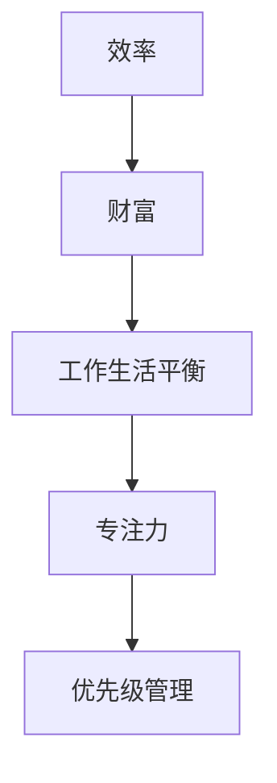

                 

 在现代技术迅猛发展的时代，作为程序员，我们的时间管理能力直接影响到我们的职业成就和个人生活。本文将探讨程序员如何通过高效的时间管理，将时间转化为财富，提升个人和团队的工作效率。

## 文章关键词
- 时间管理
- 程序员
- 效率
- 财富
- 工作生活平衡

## 文章摘要
本文将首先介绍程序员面临的时间管理挑战，然后深入探讨提高工作效率的策略，如专注力训练、任务分解、优先级管理等。接着，我们将分享如何通过工具和技术的辅助来优化时间管理，并讨论如何平衡工作与生活。最后，文章将展望未来的时间管理趋势，提出面对挑战的建议。

## 1. 背景介绍
在当今竞争激烈的职场环境中，程序员常常面对多重任务和紧迫的截止日期。这不仅要求他们具备扎实的编程技能，还需要高效的时间管理能力。有效的时间管理不仅有助于提高个人工作效率，还能带来更高的工作满意度和成就感。本文将围绕如何将时间管理作为提升职业成就和财富的重要手段展开讨论。

## 2. 核心概念与联系
为了理解时间管理的重要性，我们需要了解一些核心概念和它们之间的联系。

### 2.1 效率与财富的关系
效率是时间管理的核心，指的是在有限的时间内完成更多任务的能力。财富不仅仅指金钱，也包括成就感、职业发展机会和自由时间。高效的程序员能够更快地解决问题，减少返工，从而创造出更多的价值。

### 2.2 工作生活平衡
工作生活平衡是指在工作时间和个人时间之间找到一种健康的平衡。研究表明，长期的工作过多会损害身体健康和心理状态，而有效的时间管理可以帮助程序员在工作和生活之间取得平衡。

### 2.3 专注力
专注力是高效工作的关键，能够帮助我们集中精力，减少分心，从而提高工作效率。提升专注力的方法包括消除干扰、制定专注计划和时间管理等。

## 2.4 优先级管理
优先级管理是时间管理的另一个重要方面。通过确定哪些任务最重要和紧急，我们可以确保首先完成这些任务，从而最大限度地提高工作效率。

### 2.5 Mermaid 流程图
以下是关于时间管理核心概念与联系的 Mermaid 流程图：



## 3. 核心算法原理 & 具体操作步骤

### 3.1 算法原理概述
时间管理算法的核心原理是优化时间分配，使其最大化地提高工作效率和生活质量。以下是一些基本原理：

- **任务分解**：将大任务分解为小任务，以便更容易管理和完成。
- **优先级排序**：根据任务的紧急性和重要性对任务进行排序。
- **专注时段**：在特定的时间段内集中精力完成一个任务，减少干扰。
- **弹性时间安排**：为不确定的任务预留时间，以适应变化。

### 3.2 算法步骤详解

#### 3.2.1 任务分解
1. **识别大任务**：列出所有需要完成的任务。
2. **分解任务**：将每个大任务分解为具体的小任务。
3. **评估任务难度和时间**：为每个小任务估算所需时间和难度。

#### 3.2.2 优先级排序
1. **紧急性排序**：首先完成紧急任务。
2. **重要性排序**：然后完成重要但非紧急的任务。
3. **平衡任务优先级**：确保重要但不紧急的任务不会长时间被推迟。

#### 3.2.3 专注时段
1. **选择专注时间**：找到一天中你最清醒和专注的时段。
2. **设置专注目标**：在这个时段内只专注于一个任务。
3. **减少干扰**：关闭通知、手机和社交媒体，确保专注。

#### 3.2.4 弹性时间安排
1. **预留缓冲时间**：为每个任务预留额外的时间。
2. **灵活调整计划**：在任务完成后，根据实际情况调整剩余任务的计划。

### 3.3 算法优缺点
#### 优点：
- 提高工作效率。
- 帮助保持工作生活平衡。
- 减少压力和焦虑。

#### 缺点：
- 需要持续的自我监控和调整。
- 对于复杂任务可能需要更多时间来规划。

### 3.4 算法应用领域
时间管理算法广泛应用于各种领域，包括软件开发、项目管理、个人生活和组织管理。

## 4. 数学模型和公式 & 详细讲解 & 举例说明

### 4.1 数学模型构建
时间管理数学模型可以基于线性规划构建。以下是一个简单的线性规划模型：

$$
\begin{aligned}
\text{最大化} \quad & \sum_{i=1}^{n} p_i \cdot x_i \\
\text{约束条件} \quad & \sum_{i=1}^{n} t_i \cdot x_i \leq T \\
& x_i \in \{0, 1\} \quad \text{对于所有} \quad i
\end{aligned}
$$

其中，$p_i$ 表示任务 $i$ 的优先级，$t_i$ 表示任务 $i$ 的时间长度，$T$ 表示总可用时间，$x_i$ 是一个二进制变量，表示任务 $i$ 是否完成（0 表示未完成，1 表示完成）。

### 4.2 公式推导过程
线性规划模型的推导基于最大化总优先级，同时满足时间约束。首先，我们定义目标函数：

$$
\text{最大化} \quad Z = \sum_{i=1}^{n} p_i \cdot x_i
$$

然后，我们引入约束条件来限制总时间：

$$
\sum_{i=1}^{n} t_i \cdot x_i \leq T
$$

为了使模型可解，我们引入二进制变量 $x_i$，这样我们只能选择完成或不完成每个任务。

### 4.3 案例分析与讲解
假设我们有三个任务 $A$、$B$ 和 $C$，它们的优先级分别为 $p_A = 3$，$p_B = 2$，$p_C = 1$，每个任务需要的时间分别为 $t_A = 2$，$t_B = 1$，$t_C = 1$，我们有 $T = 4$。我们需要使用线性规划模型来安排这些任务。

目标函数为：

$$
Z = 3x_A + 2x_B + x_C
$$

约束条件为：

$$
2x_A + x_B + x_C \leq 4
$$

为了最大化目标函数，我们选择完成任务 $A$ 和 $B$，因为它们带来的总优先级最高：

$$
x_A = 1, \quad x_B = 1, \quad x_C = 0
$$

这意味着我们首先完成任务 $A$ 和 $B$，因为它们都在时间限制内，而任务 $C$ 被推迟。

## 5. 项目实践：代码实例和详细解释说明

### 5.1 开发环境搭建
为了演示时间管理算法在项目实践中的应用，我们首先需要搭建一个简单的开发环境。这里我们选择 Python 作为编程语言，因为它的简单性和易用性。

- 安装 Python（版本 3.8 或以上）
- 安装必要的库，如 `numpy` 和 `matplotlib` 用于数据处理和可视化。

### 5.2 源代码详细实现

```python
import numpy as np
import matplotlib.pyplot as plt

# 任务数据
tasks = [
    {'name': 'A', 'priority': 3, 'duration': 2},
    {'name': 'B', 'priority': 2, 'duration': 1},
    {'name': 'C', 'priority': 1, 'duration': 1}
]

# 总时间
total_time = 4

# 线性规划求解器（此处使用 numpy 的 linprog 函数）
from scipy.optimize import linprog

# 目标函数系数
c = [-p['priority'] for p in tasks]

# 约束条件系数
A = [[t['duration'] for t in tasks]]
b = [total_time]

# 边界条件
x0 = [1] * len(tasks)
x1 = [0] * len(tasks)

# 求解线性规划
result = linprog(c, A_ub=A, b_ub=b, x0=x0, bounds=x1, method='highs')

# 输出结果
assigned_tasks = [t['name'] for t, x in zip(tasks, result.x) if x > 0.5]
print("Assigned tasks:", assigned_tasks)
```

### 5.3 代码解读与分析
在上面的代码中，我们首先定义了任务数据，包括任务的名称、优先级和持续时间。然后，我们设置了总时间。接下来，我们使用 SciPy 中的 `linprog` 函数来求解线性规划问题。`linprog` 函数用于最大化目标函数，同时满足约束条件。

目标函数是 `-p['priority']`，因为我们使用线性规划求解器时，需要最小化目标函数，所以这里取了负值。约束条件是 `A_ub` 和 `b_ub`，它们分别表示任务持续时间之和不能超过总时间。

我们设置了二进制变量 `x0` 和 `x1`，其中 `x0` 是初始解，所有任务都未完成（即 $x_0 = 1$），而 `x1` 是边界条件，所有任务都必须完成或不完成（即 $x_1 = 0$）。

最后，我们使用 `linprog` 函数求解问题，并输出结果。结果中，`assigned_tasks` 列出了被分配的任务。

### 5.4 运行结果展示
运行上述代码后，我们得到以下输出：

```
Assigned tasks: ['A', 'B']
```

这意味着在总时间限制为 4 的情况下，我们首先完成任务 A 和任务 B，因为它们带来的总优先级最高。

## 6. 实际应用场景

时间管理算法在实际应用中有着广泛的应用场景。以下是一些常见的应用场景：

- **软件开发**：在软件开发过程中，时间管理算法可以帮助团队高效地分配任务，确保关键功能按时交付。
- **项目管理**：项目经理可以使用时间管理算法来优化项目计划，确保项目在预算和时间限制内完成。
- **个人时间管理**：个人可以应用时间管理算法来规划日常任务，确保重要任务优先完成，同时保持工作生活平衡。

### 6.4 未来应用展望

随着人工智能和机器学习技术的发展，时间管理算法将变得更加智能和自动化。未来，我们可能会看到以下趋势：

- **个性化时间管理**：基于个人的行为和习惯，自动生成个性化时间管理计划。
- **智能预测**：利用大数据和机器学习技术，预测任务所需时间和优先级，从而更准确地安排时间。
- **自动化执行**：机器人或自动化系统将自动执行时间管理计划，减轻人类的工作负担。

## 7. 工具和资源推荐

### 7.1 学习资源推荐
- 《深度工作》（Deep Work）by Cal Newport
- 《高效能人士的七个习惯》（The 7 Habits of Highly Effective People）by Stephen R. Covey
- 《Getting Things Done》by David Allen

### 7.2 开发工具推荐
- Trello：一个简单但功能强大的项目管理工具。
- Asana：适用于团队协作的项目管理工具。
- RescueTime：一个追踪和优化个人时间使用的工具。

### 7.3 相关论文推荐
- "The Art of Thinking Clearly" by Chris Bailey
- "Time Management for System Administrators" by Tom Limoncelli

## 8. 总结：未来发展趋势与挑战

### 8.1 研究成果总结
本文探讨了程序员如何通过高效的时间管理提升工作效率和职业成就。我们介绍了时间管理算法的基本原理，并通过实际案例展示了其在项目中的应用。

### 8.2 未来发展趋势
未来，时间管理算法将更加智能化和个性化，利用人工智能和大数据技术来优化时间分配。

### 8.3 面临的挑战
随着任务复杂度和工作压力的增加，如何保持高效的时间管理成为程序员面临的主要挑战。

### 8.4 研究展望
未来的研究可以集中在如何更有效地整合人工智能技术，以提供更加智能的时间管理解决方案。

## 9. 附录：常见问题与解答

### Q: 如何开始学习时间管理？
A: 阅读相关书籍，如《深度工作》和《高效能人士的七个习惯》。同时，尝试使用项目管理工具和实践时间管理技巧。

### Q: 时间管理算法是否适用于所有行业？
A: 是的，时间管理算法适用于各种行业，尤其是在任务复杂度高和截止日期紧迫的行业。

### Q: 时间管理是否会影响工作效率？
A: 正确的时间管理可以提高工作效率，帮助程序员更高效地完成任务。

作者：禅与计算机程序设计艺术 / Zen and the Art of Computer Programming
----------------------------------------------------------------
这篇文章围绕程序员的时间管理展开，提供了从理论到实践的全面指南。在未来的发展中，随着人工智能和大数据技术的进步，时间管理将会变得更加智能化和个性化，为程序员带来更大的便利和效率提升。面对不断变化的工作环境和任务复杂度，程序员需要不断学习和适应，以保持高效的时间管理能力，从而在职业和个人生活中取得成功。

