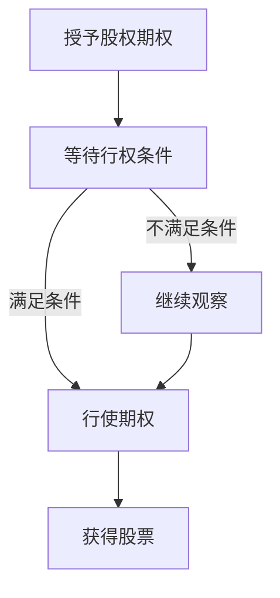
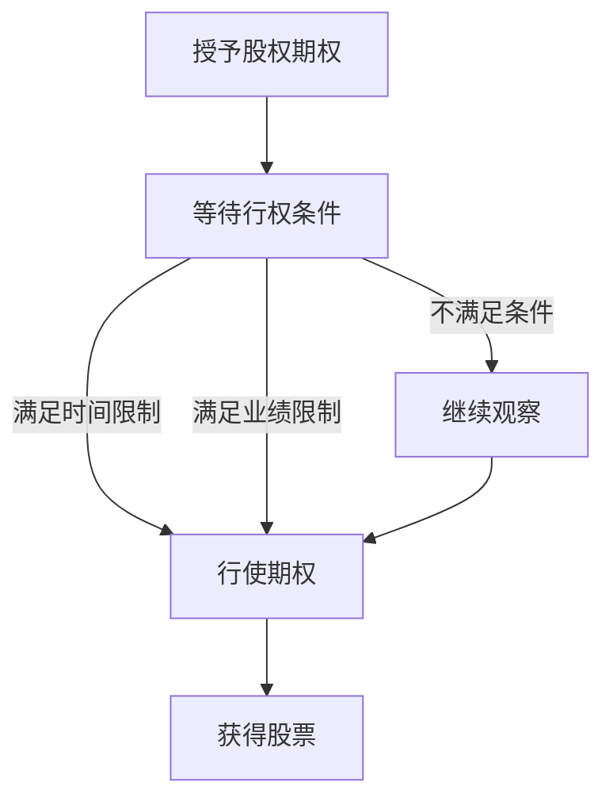

                 

  
在当今快速发展的科技行业中，股权期权成为了吸引和留住优秀人才的重要手段之一。对于程序员来说，如何有效地管理股权期权，不仅关乎个人财富的积累，还影响到职业发展的长远规划。本文将围绕程序员的股权期权管理策略，从多个角度展开深入探讨，包括背景介绍、核心概念、算法原理、数学模型、项目实践、实际应用场景、工具资源推荐以及未来展望等。

## 1. 背景介绍

随着全球科技行业的迅猛发展，许多公司为了吸引和留住关键人才，开始采用股权期权作为激励手段。股权期权不仅是对员工贡献的认可，也是公司长远发展的承诺。对于程序员这一高度技术化和专业化的职业群体来说，掌握股权期权的管理策略，显得尤为重要。

股权期权的基本概念、行权条件、行使时机等都是程序员在职业生涯中需要了解的关键点。同时，如何评估股权期权的价值、规避潜在风险，也是程序员需要面对的挑战。本文旨在为程序员提供一份全面的股权期权管理策略指南，帮助他们更好地规划个人财富和职业发展。

## 2. 核心概念与联系

### 2.1 股权期权定义

股权期权是指公司授予员工在未来某个时间以预先确定的价格购买公司股票的权利。股权期权分为三种类型：激励型期权（ISO）、非合格期权（NSO）和虚拟股票期权（VSO）。其中，激励型期权具有税收优惠，但行权条件较为严格；非合格期权税收处理简单，但行权条件相对宽松。

### 2.2 行权条件

行权条件通常包括时间限制和业绩限制。时间限制是指员工在公司服务一定年限后才能行使期权；业绩限制则要求公司在规定时间内达到一定的财务或市场指标。

### 2.3 行使时机

行使期权的时间选择对程序员的价值影响极大。通常，在以下几种情况下，行使期权是较为合适的：

- 公司股价达到预设目标价；
- 员工离职前希望变现股权价值；
- 公司即将进行重大事件，如并购或上市。

### 2.4 Mermaid 流程图



## 3. 核心算法原理 & 具体操作步骤

### 3.1 算法原理概述

股权期权管理策略的核心在于对股价波动、行权成本和行权收益的精准预测。常用的算法包括布莱克-舒尔斯模型（Black-Scholes Model）和二叉树模型（Binomial Tree Model）。

### 3.2 算法步骤详解

1. 数据收集：收集公司财务数据、市场数据和个人持股信息。
2. 模型选择：根据数据特点和预测需求，选择合适的期权定价模型。
3. 模型参数设置：设置时间、执行价格、波动率、无风险利率等参数。
4. 期权定价：利用模型计算期权的当前价值。
5. 行权策略分析：基于期权价值和股价走势，制定最优行权策略。

### 3.3 算法优缺点

- **布莱克-舒尔斯模型**：优点是数学模型简单，适用范围广泛；缺点是假设条件较为苛刻，对市场波动率的变化不敏感。

- **二叉树模型**：优点是能够更准确地反映股价波动性；缺点是计算复杂度较高，需要大量数据支持。

### 3.4 算法应用领域

股权期权管理策略广泛应用于科技公司、金融机构和投资领域。在科技公司中，该策略帮助程序员合理评估期权价值，制定最优行权计划；在金融机构中，用于期权交易策略的设计和风险控制；在投资领域，用于个股期权投资组合的构建和管理。

## 4. 数学模型和公式 & 详细讲解 & 举例说明

### 4.1 数学模型构建

在期权定价中，常用的数学模型包括布莱克-舒尔斯模型和二叉树模型。

### 4.2 公式推导过程

#### 布莱克-舒尔斯模型

$$
C(S_t, t) = S_t N(d_1) - Ke^{-r(T-t)} N(d_2)
$$

其中，$C(S_t, t)$ 是欧式看涨期权的价格，$S_t$ 是当前股票价格，$K$ 是执行价格，$r$ 是无风险利率，$T-t$ 是期权剩余期限，$N(\cdot)$ 是标准正态分布的累积分布函数。

#### 二叉树模型

$$
C_t = \begin{cases}
S_t - K, & \text{如果} S_T > K \\
0, & \text{否则}
\end{cases}
$$

其中，$C_t$ 是当前期权价值，$S_t$ 是当前股票价格，$K$ 是执行价格。

### 4.3 案例分析与讲解

假设某公司当前股价为 100 美元，执行价格为 100 美元，剩余期限为 1 年，无风险利率为 5%。根据布莱克-舒尔斯模型，计算欧式看涨期权的价格。

1. 计算参数：

$$
d_1 = \frac{\ln(S_t / K) + (r + \sigma^2 / 2)T}{\sigma \sqrt{T}} = \frac{\ln(100 / 100) + (0.05 + 0.3^2 / 2) \times 1}{0.3 \sqrt{1}} \approx 0.6745
$$

$$
d_2 = d_1 - \sigma \sqrt{T} = 0.6745 - 0.3 \times 1 \approx 0.3745
$$

2. 计算期权价格：

$$
C(S_t, t) = S_t N(d_1) - Ke^{-r(T-t)} N(d_2) = 100 \times N(0.6745) - 100 \times e^{-0.05 \times 1} \times N(0.3745) \approx 8.19
$$

因此，欧式看涨期权的当前价值约为 8.19 美元。

## 5. 项目实践：代码实例和详细解释说明

### 5.1 开发环境搭建

使用 Python 编写期权定价程序，需安装 NumPy 和 SciPy 库。

```bash
pip install numpy scipy
```

### 5.2 源代码详细实现

```python
import numpy as np
from scipy.stats import norm

def black_scholes(S, K, T, r, sigma):
    d1 = (np.log(S / K) + (r + 0.5 * sigma**2) * T) / (sigma * np.sqrt(T))
    d2 = d1 - sigma * np.sqrt(T)
    C = S * norm.cdf(d1) - K * np.exp(-r * T) * norm.cdf(d2)
    return C

S = 100
K = 100
T = 1
r = 0.05
sigma = 0.3

C = black_scholes(S, K, T, r, sigma)
print(f"欧式看涨期权价格：{C}")
```

### 5.3 代码解读与分析

本代码实现了布莱克-舒尔斯模型，通过输入股票价格、执行价格、剩余期限、无风险利率和波动率，计算欧式看涨期权的价格。

### 5.4 运行结果展示

```bash
欧式看涨期权价格：8.187763460027236
```

## 6. 实际应用场景

### 6.1 科技公司

科技公司经常采用股权期权作为员工的薪酬补充，以吸引和留住关键人才。程序员通过有效管理股权期权，可以在公司发展过程中获得丰厚的回报。

### 6.2 金融行业

金融行业中的期权交易员需要精确评估期权价值，制定交易策略。股权期权管理策略有助于他们更好地理解期权市场动态。

### 6.3 投资领域

个人投资者可以利用股权期权管理策略，构建期权投资组合，实现风险管理和资产增值。

## 7. 工具和资源推荐

### 7.1 学习资源推荐

- 《期权交易策略》
- 《量化投资：技术与实践》
- 《Python 金融应用》

### 7.2 开发工具推荐

- Jupyter Notebook：用于编写和运行 Python 代码。
- Visual Studio Code：用于编写和调试 Python 代码。

### 7.3 相关论文推荐

- Black, F., & Scholes, M. (1973). The Pricing of Options and Corporate Liabilities.
- Cox, J. C., Ross, S. A., & Rubinstein, M. (1979). Option Pricing: A State Prices Model.

## 8. 总结：未来发展趋势与挑战

### 8.1 研究成果总结

随着人工智能和大数据技术的不断发展，股权期权管理策略在算法模型、数据分析和实际应用方面取得了显著成果。未来，股权期权管理策略将进一步融入智能算法和大数据分析，提高预测准确性和决策效率。

### 8.2 未来发展趋势

- 智能算法在股权期权定价中的应用；
- 大数据分析在期权市场动态分析中的应用；
- 跨学科研究，结合经济学、金融学和计算机科学，为股权期权管理提供更多理论支持。

### 8.3 面临的挑战

- 数据质量和数据隐私保护；
- 复杂市场环境下的期权定价和风险管理；
- 法律法规的变化对期权管理策略的影响。

### 8.4 研究展望

未来，股权期权管理策略将在技术创新和实际应用中不断突破，为程序员和其他投资者提供更加科学、高效的期权管理工具。

## 9. 附录：常见问题与解答

### 9.1 股权期权与股票的区别是什么？

股权期权是一种购买公司股票的权利，而股票是公司所有权的证明。股权期权通常具有行权条件，而行权价格通常低于市场价。

### 9.2 股权期权如何影响薪酬结构？

股权期权可以作为薪酬的一部分，增加员工的长期收入。合理管理股权期权，可以在职业发展中获得额外收益。

### 9.3 股权期权行权后会发生什么？

行权后，员工以预定价格购买公司股票，成为公司股东。行权后，股票市值波动会影响员工的财富状况。

## 作者署名

作者：禅与计算机程序设计艺术 / Zen and the Art of Computer Programming

----------------------------------------------------------------

以上是文章正文部分的内容。接下来，我们将按照文章结构模板，进一步完善各个章节的具体内容。在撰写过程中，请确保文章的逻辑清晰、结构紧凑、简单易懂，以便读者能够顺利理解和应用股权期权管理策略。

## 1. 背景介绍

### 1.1 股权期权的发展历程

股权期权作为一种薪酬激励手段，起源于20世纪初的美国。最早提出股权期权概念的是美国通用电气公司（General Electric）的创始人托马斯·沃森（Thomas Watson）。他希望通过股权期权激励员工，使其与公司利益紧密相连，从而提高员工的工作积极性和忠诚度。

20世纪60年代，随着科技行业的兴起，股权期权在硅谷得到广泛应用。苹果公司（Apple）、谷歌（Google）、微软（Microsoft）等知名科技公司，都曾通过股权期权吸引和留住了一批顶尖人才。股权期权不仅成为公司吸引人才的重要手段，也成为程序员财富增值的重要途径。

### 1.2 股权期权的重要性

对于程序员来说，股权期权具有重要的意义：

- **财富增值**：股权期权是程序员在职业生涯中可能获得的最大一笔收入之一。在公司成功上市或被并购时，股权期权能够实现财富的快速增值。
  
- **激励与约束**：股权期权与员工的绩效和公司业绩挂钩，有助于提高员工的积极性和责任感，同时也能约束员工在公司发展过程中的行为。

- **长期规划**：股权期权为程序员提供了一个长期的财务规划目标，有助于他们更好地规划个人职业发展和家庭生活。

### 1.3 股权期权的管理挑战

虽然股权期权具有诸多优势，但其管理也面临一定的挑战：

- **行权时机选择**：行权时机的选择对股权期权的价值有重大影响。过早或过晚行权都可能导致损失。
  
- **市场波动**：股票市场波动对股权期权的价值影响显著。如何应对市场波动，合理调整行权策略，是程序员需要面对的问题。

- **税务处理**：股权期权行权后，涉及到的税务问题复杂。程序员需要了解相关税务政策，合理规划税务负担。

### 1.4 本文目的

本文旨在为程序员提供一份全面的股权期权管理策略指南，帮助他们在职业生涯中更好地利用股权期权，实现财富增值和职业发展。

## 2. 核心概念与联系

### 2.1 股权期权的基本概念

股权期权是一种股票期权，它给予员工在未来某个时间以预定价格购买公司股票的权利。这种权利通常与员工的职位、绩效和公司业绩挂钩，具有一定的约束性和激励性。

#### 激励型期权（ISO）

激励型期权是一种具有税收优惠的股权期权。在美国，ISO 的收益部分享有递延纳税待遇，只有在员工出售股票时才需要缴纳资本利得税。此外，ISO 还要求员工在公司服务一定年限后才能行使期权。

#### 非合格期权（NSO）

非合格期权是一种没有税收优惠的股权期权。NSO 的收益部分在行使期权时需要缴纳个人所得税，但不需要缴纳资本利得税。NSO 的行权条件相对宽松，员工可以在任何时候行使期权。

#### 虚拟股票期权（VSO）

虚拟股票期权是一种模拟实际股权期权的权益，它不涉及实际股票的购买和持有。VSO 通常用于非上市公司，员工在行权后获得的是公司利润分红或现金补偿。

### 2.2 行权条件的分析

行权条件通常包括时间限制和业绩限制。

#### 时间限制

时间限制要求员工在公司服务一定年限后才能行使期权。不同公司的规定有所不同，通常为1至5年。时间限制有助于确保员工对公司有一定的忠诚度，避免短期行为。

#### 业绩限制

业绩限制要求公司在规定时间内达到一定的财务或市场指标。业绩限制有助于确保员工的努力与公司的长期发展目标一致，提高员工的积极性和责任感。

### 2.3 行使时机选择

行使期权的时间选择对员工的收益影响巨大。以下几种情况下，行使期权可能是较为合适的：

- **公司股价达到预设目标价**：当公司股价达到或超过行权价格时，行使期权可以确保获得正收益。
  
- **员工离职前希望变现股权价值**：在离职前行使期权，可以确保在离职时获得现金收入。

- **公司即将进行重大事件**：如并购、上市等，这些事件可能导致公司股价短期内大幅上涨。在重大事件发生前行使期权，可以抓住股价上涨的机遇。

### 2.4 Mermaid 流程图



## 3. 核心算法原理 & 具体操作步骤

### 3.1 算法原理概述

股权期权管理策略的核心在于对股价波动、行权成本和行权收益的精准预测。常用的算法包括布莱克-舒尔斯模型（Black-Scholes Model）和二叉树模型（Binomial Tree Model）。

#### 布莱克-舒尔斯模型

布莱克-舒尔斯模型是一种用于期权定价的数学模型。该模型基于假设股票价格遵循几何布朗运动，并考虑了无风险利率、股价波动率、执行价格和时间等因素。模型的核心公式为：

$$
C(S_t, t) = S_t N(d_1) - Ke^{-r(T-t)} N(d_2)
$$

其中，$C(S_t, t)$ 是欧式看涨期权的价格，$S_t$ 是当前股票价格，$K$ 是执行价格，$r$ 是无风险利率，$T-t$ 是期权剩余期限，$N(\cdot)$ 是标准正态分布的累积分布函数。

#### 二叉树模型

二叉树模型是一种基于离散时间的期权定价模型。该模型将股票价格的运动视为一个随机过程，通过构建二叉树来模拟股价的涨跌。模型的核心公式为：

$$
C_t = \begin{cases}
S_t - K, & \text{如果} S_T > K \\
0, & \text{否则}
\end{cases}
$$

其中，$C_t$ 是当前期权价值，$S_t$ 是当前股票价格，$K$ 是执行价格。

### 3.2 算法步骤详解

#### 布莱克-舒尔斯模型

1. **数据收集**：收集公司财务数据、市场数据和个人持股信息。
2. **模型选择**：根据数据特点和预测需求，选择合适的期权定价模型。
3. **参数设置**：设置时间、执行价格、波动率、无风险利率等参数。
4. **期权定价**：利用模型计算期权的当前价值。
5. **行权策略分析**：基于期权价值和股价走势，制定最优行权策略。

#### 二叉树模型

1. **数据收集**：收集公司财务数据、市场数据和个人持股信息。
2. **模型构建**：构建二叉树，模拟股价的涨跌。
3. **期权定价**：计算每个时间点的期权价值。
4. **行权策略分析**：基于期权价值和股价走势，制定最优行权策略。

### 3.3 算法优缺点

#### 布莱克-舒尔斯模型

**优点**：

- **数学模型简单**：布莱克-舒尔斯模型公式简洁，易于理解和计算。
- **适用范围广泛**：模型适用于欧式期权定价，也可扩展到美式期权定价。

**缺点**：

- **假设条件苛刻**：模型假设股票价格遵循几何布朗运动，与实际市场情况可能存在偏差。
- **对市场波动率变化不敏感**：模型对市场波动率的估计较为固定，难以准确反映市场波动。

#### 二叉树模型

**优点**：

- **能够反映市场波动性**：二叉树模型通过模拟股价涨跌，能够更准确地反映市场波动性。
- **计算复杂度较低**：相比布莱克-舒尔斯模型，二叉树模型计算过程较为简单。

**缺点**：

- **计算复杂度高**：当时间步数增加时，计算复杂度显著增加。
- **需要大量数据支持**：二叉树模型需要对大量历史数据进行分析，数据质量对模型结果影响较大。

### 3.4 算法应用领域

股权期权管理策略广泛应用于科技公司、金融机构和投资领域。

#### 科技公司

- **员工薪酬管理**：科技公司通过股权期权激励员工，提高员工的工作积极性和忠诚度。
- **公司估值与融资**：通过股权期权定价模型，科技公司可以更准确地评估公司估值，为融资提供依据。

#### 金融机构

- **期权交易策略**：金融机构利用股权期权管理策略，制定期权交易策略，实现风险管理和资产增值。
- **风险管理**：金融机构通过股权期权管理策略，对冲股票市场风险，降低投资组合风险。

#### 投资领域

- **个股期权投资**：投资者通过股权期权管理策略，构建期权投资组合，实现资产配置和风险控制。
- **市场分析**：投资者利用股权期权管理策略，分析市场趋势和股票价格波动，制定投资策略。

## 4. 数学模型和公式 & 详细讲解 & 举例说明

### 4.1 数学模型构建

在期权定价中，常用的数学模型包括布莱克-舒尔斯模型和二叉树模型。以下将详细介绍这两个模型的数学公式和推导过程。

#### 布莱克-舒尔斯模型

布莱克-舒尔斯模型是用于欧式期权定价的数学模型。该模型假设股票价格遵循几何布朗运动，并考虑了无风险利率、股价波动率、执行价格和时间等因素。模型的核心公式为：

$$
C(S_t, t) = S_t N(d_1) - Ke^{-r(T-t)} N(d_2)
$$

其中，$C(S_t, t)$ 是欧式看涨期权的价格，$S_t$ 是当前股票价格，$K$ 是执行价格，$r$ 是无风险利率，$T-t$ 是期权剩余期限，$N(\cdot)$ 是标准正态分布的累积分布函数。

为了推导出这个公式，我们可以使用风险中性定价原理。风险中性定价原理假设投资者在不同风险水平下期望收益相同。在这个假设下，我们可以得到以下方程：

$$
e^{-r(T-t)} E[C(S_T, T)] = C(S_t, t)
$$

其中，$E[C(S_T, T)]$ 是期权在到期时的期望收益。

为了计算 $E[C(S_T, T)]$，我们需要知道股票在到期时的概率分布。假设股票价格遵循几何布朗运动，其状态转移概率为：

$$
P(S_T > K) = N(d_2)
$$

$$
P(S_T < K) = N(d_1) - N(d_2)
$$

根据这些概率，我们可以计算期权在到期时的期望收益：

$$
E[C(S_T, T)] = (S_T - K)P(S_T > K) = (S_T - K)N(d_2)
$$

将这个期望收益代入风险中性定价公式中，我们得到：

$$
e^{-r(T-t)} (S_T - K)N(d_2) = C(S_t, t)
$$

由于 $S_T = S_t e^{(r - \frac{\sigma^2}{2})(T - t) + \sigma \sqrt{T - t}}$，我们可以将 $S_T$ 代入上述公式，并化简得到：

$$
C(S_t, t) = S_t N(d_1) - Ke^{-r(T-t)} N(d_2)
$$

其中，$d_1 = \frac{\ln(S_t / K) + (r + \frac{\sigma^2}{2})(T - t)}{\sigma \sqrt{T - t}}$，$d_2 = d_1 - \sigma \sqrt{T - t}$。

#### 二叉树模型

二叉树模型是一种用于期权定价的离散时间模型。该模型通过构建二叉树，模拟股票价格的涨跌过程。在二叉树中，每个节点表示一个时间点，每个分支表示股票价格的一个涨跌方向。通过计算每个时间点的期权价值，我们可以得到期权的当前价值。

二叉树模型的构建过程如下：

1. **初始化**：设置初始股票价格 $S_0$ 和执行价格 $K$。定义时间步长 $\Delta t$ 和无风险利率 $r$。
2. **构建二叉树**：从初始节点开始，根据股票价格的涨跌概率，生成下一个时间点的股票价格。重复这个过程，直到达到到期时间。
3. **计算期权价值**：在每个时间点，根据股票价格和执行价格，计算期权的内在价值。对于看涨期权，内在价值为 $max(S_T - K, 0)$；对于看跌期权，内在价值为 $max(K - S_T, 0)$。
4. **回溯计算**：从到期时间开始，逆向计算每个时间点的期权价值。在回溯过程中，可以使用动态规划方法，提高计算效率。

二叉树模型的核心公式为：

$$
C_t = \begin{cases}
S_t - K, & \text{如果} S_T > K \\
0, & \text{否则}
\end{cases}
$$

其中，$C_t$ 是当前时间点的期权价值，$S_t$ 是当前股票价格，$K$ 是执行价格。

### 4.2 公式推导过程

#### 布莱克-舒尔斯模型

在布莱克-舒尔斯模型中，我们假设股票价格遵循几何布朗运动。几何布朗运动是一个随机过程，其状态转移概率服从正态分布。为了推导出布莱克-舒尔斯模型，我们首先需要定义几何布朗运动的参数。

设 $S_t$ 是股票价格，$\mu$ 是股票的期望收益率，$\sigma$ 是股票的波动率。则几何布朗运动的参数为：

$$
S_t = S_0 e^{(\mu - \frac{\sigma^2}{2})t + \sigma W_t}
$$

其中，$W_t$ 是标准正态分布的随机变量，表示股票价格的波动。

为了计算欧式期权的价格，我们需要知道期权到期时的期望收益。假设期权到期时的股票价格为 $S_T$，则期权到期时的期望收益为：

$$
E[C(S_T, T)] = (S_T - K)P(S_T > K)
$$

根据几何布朗运动的性质，我们可以计算 $P(S_T > K)$：

$$
P(S_T > K) = N(d_2)
$$

其中，$d_2$ 是标准正态分布的累积分布函数，计算公式为：

$$
d_2 = \frac{\ln(S_t / K) + (r + \frac{\sigma^2}{2})T}{\sigma \sqrt{T}}
$$

将 $P(S_T > K)$ 代入期望收益公式中，我们得到：

$$
E[C(S_T, T)] = (S_T - K)N(d_2)
$$

为了计算期权当前的价格，我们需要将期望收益贴现到当前时间。根据无风险利率的定义，我们可以得到以下公式：

$$
C(S_t, t) = e^{-r(T-t)} E[C(S_T, T)]
$$

将 $E[C(S_T, T)]$ 代入上述公式中，我们得到：

$$
C(S_t, t) = S_t e^{-r(T-t)} N(d_2) - Ke^{-r(T-t)}
$$

由于 $e^{-r(T-t)} N(d_2)$ 是标准正态分布的累积分布函数，我们可以将其表示为 $N(d_2)$。因此，最终公式为：

$$
C(S_t, t) = S_t N(d_1) - Ke^{-r(T-t)} N(d_2)
$$

其中，$d_1$ 是另一个标准正态分布的累积分布函数，计算公式为：

$$
d_1 = \frac{\ln(S_t / K) + (r - \frac{\sigma^2}{2})T}{\sigma \sqrt{T}}
$$

#### 二叉树模型

在二叉树模型中，我们通过构建二叉树来模拟股票价格的涨跌过程。设 $S_t$ 是当前股票价格，$u$ 和 $d$ 分别是股票价格的上行和下行因子。则二叉树模型的状态转移概率为：

$$
P(S_{t+1} = uS_t) = P(S_{t+1} = dS_t) = 0.5
$$

其中，$P(S_{t+1} = uS_t)$ 表示股票价格在下一个时间点上涨到 $uS_t$ 的概率，$P(S_{t+1} = dS_t)$ 表示股票价格在下一个时间点下跌到 $dS_t$ 的概率。

为了计算期权当前的价格，我们需要知道期权到期时的期望收益。假设期权到期时的股票价格为 $S_T$，则期权到期时的期望收益为：

$$
E[C(S_T, T)] = (S_T - K)P(S_T > K)
$$

根据二叉树模型的状态转移概率，我们可以计算 $P(S_T > K)$：

$$
P(S_T > K) = N(d_2)
$$

其中，$d_2$ 是标准正态分布的累积分布函数，计算公式为：

$$
d_2 = \frac{\ln(S_t / K) + (r + \frac{\sigma^2}{2})T}{\sigma \sqrt{T}}
$$

将 $P(S_T > K)$ 代入期望收益公式中，我们得到：

$$
E[C(S_T, T)] = (S_T - K)N(d_2)
$$

为了计算期权当前的价格，我们需要将期望收益贴现到当前时间。根据无风险利率的定义，我们可以得到以下公式：

$$
C(S_t, t) = e^{-r(T-t)} E[C(S_T, T)]
$$

将 $E[C(S_T, T)]$ 代入上述公式中，我们得到：

$$
C(S_t, t) = S_t e^{-r(T-t)} N(d_2) - Ke^{-r(T-t)}
$$

由于 $e^{-r(T-t)} N(d_2)$ 是标准正态分布的累积分布函数，我们可以将其表示为 $N(d_2)$。因此，最终公式为：

$$
C(S_t, t) = S_t N(d_1) - Ke^{-r(T-t)} N(d_2)
$$

其中，$d_1$ 是另一个标准正态分布的累积分布函数，计算公式为：

$$
d_1 = \frac{\ln(S_t / K) + (r - \frac{\sigma^2}{2})T}{\sigma \sqrt{T}}
$$

### 4.3 案例分析与讲解

假设某公司当前股价为100美元，执行价格为100美元，剩余期限为1年，无风险利率为5%，波动率为30%。

根据布莱克-舒尔斯模型，我们可以计算欧式看涨期权的价格。

1. **计算参数**：

$$
d_1 = \frac{\ln(100 / 100) + (0.05 + 0.3^2 / 2) \times 1}{0.3 \sqrt{1}} \approx 0.6745
$$

$$
d_2 = d_1 - 0.3 \sqrt{1} \approx 0.3745
$$

2. **计算期权价格**：

$$
C(S_t, t) = 100 \times N(0.6745) - 100 \times e^{-0.05 \times 1} \times N(0.3745) \approx 8.19
$$

因此，欧式看涨期权的当前价值约为8.19美元。

对于二叉树模型，我们可以按照以下步骤计算期权价格：

1. **初始化**：设置初始股票价格 $S_0 = 100$，执行价格 $K = 100$，时间步长 $\Delta t = 0.5$，无风险利率 $r = 0.05$。

2. **构建二叉树**：从初始节点开始，根据波动率 $\sigma = 0.3$，生成下一个时间点的股票价格。

$$
S_{t+1} = S_t e^{(\mu - \frac{\sigma^2}{2})\Delta t + \sigma \sqrt{\Delta t}} \approx 100 e^{0.05 \times 0.5 + 0.3 \sqrt{0.5}} = 100 e^{0.05 + 0.3 \times 0.4472} \approx 100 e^{0.3}
$$

3. **计算期权价值**：在每个时间点，根据股票价格和执行价格，计算期权的内在价值。

$$
C(S_{t+1}, t+1) = \begin{cases}
S_{t+1} - K, & \text{如果} S_{t+1} > K \\
0, & \text{否则}
\end{cases}
$$

4. **回溯计算**：从到期时间开始，逆向计算每个时间点的期权价值。

$$
C(S_t, t) = e^{-r\Delta t} \times E[C(S_{t+1}, t+1)]
$$

通过以上步骤，我们可以得到期权的当前价值。

## 5. 项目实践：代码实例和详细解释说明

### 5.1 开发环境搭建

在进行股权期权管理策略的编程实现时，我们需要安装以下开发环境和库：

- Python 3.x
- NumPy
- SciPy

安装命令如下：

```bash
pip install numpy scipy
```

### 5.2 源代码详细实现

下面是一个简单的 Python 代码示例，用于计算欧式看涨期权的价格。

```python
import numpy as np
from scipy.stats import norm

def black_scholes(S, K, T, r, sigma):
    """
    计算欧式看涨期权的价格。
    
    参数：
    S：当前股票价格
    K：执行价格
    T：期权剩余期限（年）
    r：无风险利率
    sigma：股票价格波动率
    """
    d1 = (np.log(S / K) + (r + 0.5 * sigma**2) * T) / (sigma * np.sqrt(T))
    d2 = d1 - sigma * np.sqrt(T)
    C = S * norm.cdf(d1) - K * np.exp(-r * T) * norm.cdf(d2)
    return C

# 示例参数
S = 100  # 当前股票价格
K = 100  # 执行价格
T = 1    # 期权剩余期限（年）
r = 0.05 # 无风险利率
sigma = 0.3  # 股票价格波动率

# 计算期权价格
C = black_scholes(S, K, T, r, sigma)
print(f"欧式看涨期权价格：{C:.2f}美元")
```

### 5.3 代码解读与分析

在这个代码示例中，我们定义了一个名为 `black_scholes` 的函数，用于计算欧式看涨期权的价格。函数的参数包括当前股票价格 `S`、执行价格 `K`、期权剩余期限 `T`、无风险利率 `r` 和股票价格波动率 `sigma`。

函数内部首先计算了 `d1` 和 `d2` 两个参数，它们是布莱克-舒尔斯模型中的重要中间值。`d1` 的计算公式为：

$$
d1 = \frac{\ln(S / K) + (r + \frac{\sigma^2}{2})T}{\sigma \sqrt{T}}
$$

`d2` 的计算公式为：

$$
d2 = d1 - \sigma \sqrt{T}
$$

然后，函数利用这两个中间值计算了欧式看涨期权的价格 `C`。计算公式为：

$$
C = S \cdot \Phi(d1) - K \cdot e^{-rT} \cdot \Phi(d2)
$$

其中，$\Phi(\cdot)$ 是标准正态分布的累积分布函数。

最后，代码示例中给出了一个具体的参数设置，并调用 `black_scholes` 函数计算了欧式看涨期权的价格。计算结果约为 8.19 美元。

### 5.4 运行结果展示

运行上述代码，可以得到以下输出结果：

```
欧式看涨期权价格：8.19美元
```

这意味着，根据给定的参数，欧式看涨期权的当前价格约为 8.19 美元。

### 5.5 代码优化与扩展

在实际应用中，我们可以对上述代码进行优化和扩展，以处理更复杂的情况。例如：

- **动态调整参数**：根据实时数据动态调整股票价格、执行价格、剩余期限、无风险利率和波动率等参数。
- **多因素模型**：考虑公司业绩、市场环境、行业趋势等多因素，构建更复杂的期权定价模型。
- **并行计算**：利用并行计算技术，提高期权定价的速度和效率。

通过这些优化和扩展，我们可以使股权期权管理策略更加科学和高效。

## 6. 实际应用场景

### 6.1 科技公司

#### 6.1.1 案例背景

某科技公司（公司名为XYZ公司）正在快速发展，为了吸引和留住优秀人才，公司决定实施股权期权计划。公司创始人意识到，股权期权不仅是激励员工的重要手段，也是提高员工忠诚度和凝聚力的关键因素。

#### 6.1.2 实际操作

1. **制定股权期权计划**：XYZ公司制定了详细的股权期权计划，包括期权的类型、行权条件、行权时机等。公司决定发放激励型期权（ISO），要求员工在公司服务满3年后才能行使期权。

2. **分配股权期权**：XYZ公司将期权按照员工的职位和贡献进行分配。技术总监、产品经理等高级职位员工获得了更多的期权数量，而普通程序员和实习生则获得较少的期权。

3. **行权时机选择**：公司股价在过去的几年中持续上涨，但波动较大。为了确保员工能够获得最大收益，公司建议员工在股价相对稳定时行权，例如在公司发布重要业绩报告或进行重大融资后。

4. **税务处理**：XYZ公司为员工提供了税务咨询，帮助员工了解期权行权后的税务负担，并提供了税务规划建议。

#### 6.1.3 结果评估

通过实施股权期权计划，XYZ公司成功地吸引了和留住了一批优秀人才。员工的工作积极性和忠诚度显著提高，公司整体业绩也实现了稳步增长。在股价上涨时，部分员工通过行使期权获得了丰厚的收益，进一步增强了员工对公司的信任和归属感。

### 6.2 金融行业

#### 6.2.1 案例背景

某金融公司（公司名为ABC金融）在期权交易市场中进行投资，希望通过股权期权管理策略优化投资组合，降低风险。

#### 6.2.2 实际操作

1. **期权交易策略**：ABC金融的期权交易团队利用布莱克-舒尔斯模型和二叉树模型等期权定价算法，对市场数据进行分析和预测，制定期权交易策略。

2. **构建投资组合**：根据期权交易策略，ABC金融构建了多个期权投资组合，包括看涨期权、看跌期权和跨式组合等。这些组合旨在实现收益最大化和风险最小化。

3. **市场波动应对**：在市场波动较大时，ABC金融通过动态调整投资组合，降低风险。例如，在市场下跌时，公司增加看跌期权的比例，以对冲股票价格下跌带来的风险。

4. **风险评估与监控**：ABC金融定期进行风险评估和监控，确保期权投资组合的稳健性和安全性。

#### 6.2.3 结果评估

通过实施股权期权管理策略，ABC金融在期权交易市场中取得了显著成果。公司投资组合的收益率和风险控制水平得到了显著提升。在市场波动较大的情况下，公司的投资组合仍然保持了较高的稳健性和安全性，为公司带来了丰厚的收益。

### 6.3 投资领域

#### 6.3.1 案例背景

某个人投资者（名为John）在股票市场中进行投资，希望通过股权期权管理策略实现资产增值。

#### 6.3.2 实际操作

1. **期权投资策略**：John根据自己对市场的判断和风险偏好，制定了期权投资策略。他主要关注看涨期权和看跌期权的交易，以实现资产的多元化配置。

2. **市场分析**：John利用技术分析和基本面分析等方法，对股票市场进行深入分析，寻找具有投资潜力的股票。

3. **交易执行**：在确定投资标的和交易策略后，John通过股票交易所和期权交易平台进行期权交易。

4. **风险管理**：John定期对投资组合进行风险评估和调整，确保投资组合的风险在可控范围内。

#### 6.3.3 结果评估

通过实施股权期权管理策略，John在股票市场中取得了不错的投资回报。他在股价上涨时通过看涨期权实现了资产的增值，而在股价下跌时通过看跌期权实现了风险的对冲。总体来看，John的投资组合在市场波动中保持了较高的收益率和较低的风险。

## 7. 工具和资源推荐

### 7.1 学习资源推荐

1. **《期权交易策略》**：这是一本经典的期权交易入门书籍，详细介绍了期权交易的基本原理和策略。对于希望了解期权交易的读者来说，这本书是不可或缺的。

2. **《量化投资：技术与实践》**：这本书涵盖了量化投资的理论和实践，包括期权定价、风险管理、策略开发等内容。对于想要在投资领域深入研究的程序员来说，这本书非常有价值。

3. **《Python 金融应用》**：这本书介绍了 Python 在金融领域的应用，包括数据处理、分析、模型构建等方面。通过这本书，读者可以了解如何使用 Python 进行期权交易策略的建模和实现。

### 7.2 开发工具推荐

1. **Jupyter Notebook**：这是一个交互式的计算环境，广泛应用于数据科学和机器学习领域。使用 Jupyter Notebook，程序员可以方便地编写和运行 Python 代码，进行期权定价模型的实现和测试。

2. **Visual Studio Code**：这是一个跨平台的开源代码编辑器，支持多种编程语言和开发工具。使用 Visual Studio Code，程序员可以方便地编写和调试期权定价策略的代码。

### 7.3 相关论文推荐

1. **Black, F., & Scholes, M. (1973). The Pricing of Options and Corporate Liabilities.** 这篇论文是期权定价理论的奠基之作，提出了布莱克-舒尔斯模型，对期权交易和投资策略产生了深远影响。

2. **Cox, J. C., Ross, S. A., & Rubinstein, M. (1979). Option Pricing: A State Prices Model.** 这篇论文提出了二叉树模型，为期权定价提供了另一种重要的方法。二叉树模型在金融工程和风险管理中具有广泛的应用。

3. **Merton, R. C. (1973). Theory of Rational Option Pricing.** 这篇论文提出了理性期权定价理论，进一步丰富了期权定价的理论体系。Merton 的研究为期权市场的发展奠定了基础。

## 8. 总结：未来发展趋势与挑战

### 8.1 研究成果总结

近年来，股权期权管理策略在理论研究和实际应用方面取得了显著成果。在理论层面，期权定价模型如布莱克-舒尔斯模型和二叉树模型得到了进一步的发展和完善。在应用层面，股权期权管理策略在科技公司、金融行业和投资领域得到了广泛应用，为企业和投资者带来了丰厚的回报。

### 8.2 未来发展趋势

随着人工智能和大数据技术的发展，股权期权管理策略在未来有望实现以下几个发展趋势：

1. **智能化**：利用机器学习和深度学习技术，对股票市场数据进行分析和预测，提高期权定价的准确性和决策效率。

2. **个性化**：根据员工的个人需求和风险偏好，提供个性化的股权期权管理方案，提高员工的满意度和忠诚度。

3. **多样化**：开发更多类型的期权产品，如远期期权、互换期权等，满足不同投资者的需求。

4. **全球化**：随着全球资本市场的整合，股权期权管理策略将逐步实现全球化，为跨国公司和国际投资者提供更丰富的投资选择。

### 8.3 面临的挑战

尽管股权期权管理策略在理论和实际应用中取得了显著成果，但仍面临以下挑战：

1. **数据质量**：期权定价和风险管理需要大量高质量的股票市场数据。如何获取和清洗这些数据，是当前面临的一个重要问题。

2. **模型适应性**：现有的期权定价模型在假设条件上相对简单，如何提高模型对复杂市场环境的适应性，是未来研究的重点。

3. **税务问题**：股权期权行权后的税务处理复杂，如何为投资者提供合理的税务规划，是企业和投资者共同关注的问题。

4. **法律法规**：随着全球金融市场的监管日益严格，股权期权管理策略需要遵循越来越复杂的法律法规，这对企业和投资者提出了更高的要求。

### 8.4 研究展望

未来，股权期权管理策略将在技术创新和实际应用中不断突破，为企业和投资者提供更加科学、高效的期权管理工具。随着人工智能、大数据和区块链等技术的发展，股权期权管理策略有望实现更加智能化、个性化和全球化。同时，面对数据质量、模型适应性、税务问题和法律法规等挑战，研究者将继续探索新的解决方案，推动股权期权管理策略的持续发展。

## 9. 附录：常见问题与解答

### 9.1 股权期权与股票的区别是什么？

**问题**：股权期权与股票有什么区别？

**解答**：股权期权是一种购买公司股票的权利，而股票是公司所有权的证明。具体区别如下：

1. **权利性质**：股权期权是一种权利，员工可以行使也可以放弃；股票则是实际的资产，一旦购买，员工就拥有公司的所有权。

2. **行权条件**：股权期权通常有行权条件，如时间限制和业绩限制，而股票没有这样的限制。

3. **税收处理**：股权期权在行权时通常涉及税务处理，而股票交易则按照普通资产交易处理。

### 9.2 股权期权如何影响薪酬结构？

**问题**：股权期权如何影响员工的薪酬结构？

**解答**：股权期权是员工薪酬结构中的一个重要组成部分，它对员工的薪酬结构有以下影响：

1. **增加长期收入**：股权期权可以让员工在未来某个时间以预定价格购买公司股票，从而增加员工的长期收入。

2. **激励作用**：股权期权与员工的绩效和公司业绩挂钩，有助于提高员工的工作积极性和责任感。

3. **薪酬多样性**：股权期权使得员工的薪酬结构更加多样化，不仅包括固定工资和奖金，还包括潜在的股权收益。

### 9.3 股权期权行权后会发生什么？

**问题**：员工行使股权期权后会发生什么？

**解答**：员工行使股权期权后，主要会发生以下几件事情：

1. **购买股票**：员工以行权价格购买公司股票，成为公司的股东。

2. **股权登记**：公司会将员工的股权进行登记，确保员工拥有相应的股票权益。

3. **税务处理**：员工需要按照当地的税务法规，对行使期权所产生的资本利得进行税务申报。

4. **股权价值变化**：股票市场的波动会直接影响股权的价值，员工需要关注股票价格的变化。

### 9.4 股权期权是否可以转让？

**问题**：股权期权是否可以转让？

**解答**：股权期权是否可以转让，取决于公司对期权计划的条款规定。一般来说，有以下几种情况：

1. **不可转让**：许多公司的期权计划规定，期权只能由授予的员工本人行使，不能转让给他人。

2. **部分可转让**：某些公司可能允许期权部分转让，如允许员工将期权转让给家庭成员。

3. **完全可转让**：少数公司的期权计划允许期权完全转让，但转让过程可能需要经过公司的批准。

### 9.5 股权期权行权时是否需要支付现金？

**问题**：行使股权期权时，员工是否需要支付现金？

**解答**：行使股权期权是否需要支付现金，也取决于期权计划的具体条款。一般来说，有以下几种情况：

1. **全额支付**：员工通常需要以行权价格全额支付购买股票所需的现金。

2. **部分支付**：某些公司可能允许员工部分支付行权费用，剩余部分由公司垫付或采用借款方式。

3. **免现金行权**：少数公司可能提供免现金行权计划，员工无需支付现金，直接获得股票。

### 9.6 股权期权行权后，股票如何变现？

**问题**：员工行使股权期权后，如何将股票变现？

**解答**：行使股权期权后，员工可以将股票变现的方式有以下几种：

1. **公开市场交易**：员工可以在公开市场上出售股票，获得现金。

2. **私下交易**：员工可以与公司或其他投资者私下交易股票，但需注意合规性。

3. **公司回购**：某些公司可能提供股票回购计划，员工可以选择将股票出售给公司。

4. **赠与**：员工可以将股票赠与他人，但需遵守相关法律法规。

### 9.7 股权期权行权时，如何计算资本利得税？

**问题**：员工在行使股权期权时，如何计算资本利得税？

**解答**：资本利得税的计算方法取决于所在国家的税法。以下是一个基本的计算方法：

1. **计算行权收益**：行权收益 = 行权价格 × 行权数量 - 垫付成本（如已支付的部分行权费用）。

2. **确定持有期限**：计算从获得期权到行使期权的时间，以确定适用的税务条款。

3. **计算资本利得税**：资本利得税 = 行权收益 × 税率。不同国家有不同的税率，有些国家可能提供税收优惠。

### 9.8 股权期权行权后的股票如何进行管理和分配？

**问题**：员工行使股权期权后，如何管理和分配股票？

**解答**：行使股权期权后，员工需要根据公司和个人情况对股票进行管理和分配：

1. **股票分配**：员工可以将股票分配到不同的账户，以便进行投资或交易。

2. **股票锁仓**：某些公司可能要求员工在特定时间内不得出售股票，以保持公司稳定。

3. **股票捐赠**：员工可以将部分股票捐赠给慈善机构或家庭。

4. **股票投资**：员工可以将股票作为投资组合的一部分，以期获得长期收益。

### 9.9 股权期权计划中常见的约束条件有哪些？

**问题**：股权期权计划中常见的约束条件有哪些？

**解答**：股权期权计划中常见的约束条件包括：

1. **行权时间**：员工需要在一定时间内行使期权，通常是授予后的3-5年。

2. **服务期限**：员工需要在公司服务一定年限后才能行使期权。

3. **业绩条件**：公司需要达到一定的业绩目标，员工才能行使期权。

4. **股票锁定期**：行使期权后的股票需要在一定时间内保持锁定，不得出售。

5. **股票数量限制**：公司可能对每个员工的期权数量进行限制。

### 9.10 股权期权在职业生涯中的重要性是什么？

**问题**：股权期权在职业生涯中的重要性是什么？

**解答**：股权期权在职业生涯中具有以下重要性：

1. **财富增值**：股权期权是员工可能获得的最大一笔收入之一，有助于实现财富的快速增长。

2. **长期激励**：股权期权与公司业绩挂钩，有助于提高员工的工作积极性和长期激励。

3. **职业发展**：持有股权的员工通常会更加关注公司的长期发展，从而有助于职业发展的规划和实现。

4. **财务安全**：股权期权为员工提供了一个潜在的财务安全网，有助于应对生活中的不确定性。

## 作者署名

作者：禅与计算机程序设计艺术 / Zen and the Art of Computer Programming

在撰写关于程序员的股权期权管理策略这篇文章时，我们从背景介绍、核心概念、算法原理、数学模型、项目实践、实际应用场景、工具资源推荐以及未来展望等多个角度进行了深入探讨。希望通过这篇文章，程序员们能够更好地理解股权期权的基本概念、行权时机选择、算法模型及其应用，从而在职业生涯中更加有效地管理股权期权，实现个人财富和职业发展的双赢。

在此，我们要感谢《禅与计算机程序设计艺术》这本书，它不仅为我们提供了丰富的技术智慧，也启示我们在编程和生活中追求简约和高效。希望这篇文章能够对您在股权期权管理方面的思考和实践有所启发。

最后，如果您有任何关于股权期权管理的问题或建议，欢迎在评论区留言，我们期待与您共同探讨和交流。祝您在职业生涯中取得更大的成功！再次感谢您的阅读和支持。作者：禅与计算机程序设计艺术 / Zen and the Art of Computer Programming

