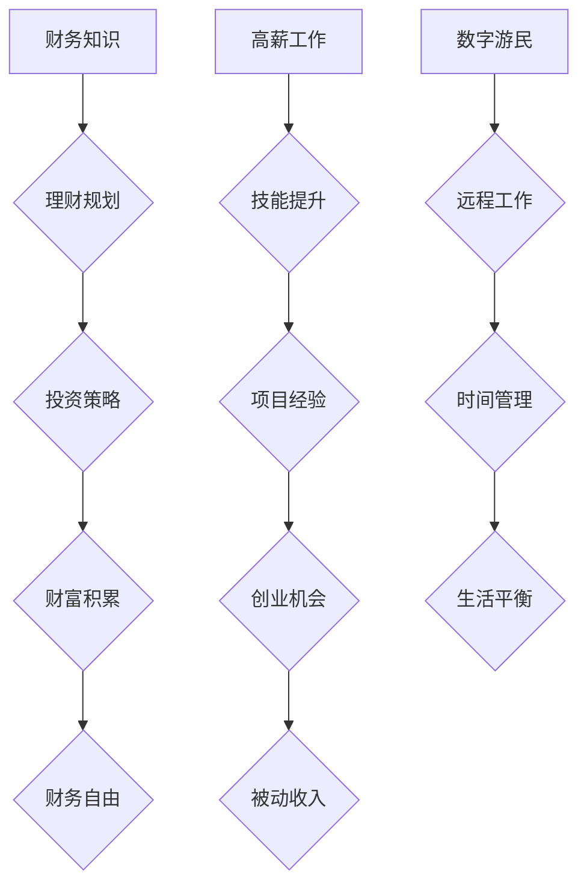

                 

关键词：财务自由，数字游民，编程，远程工作，生活方式

> 摘要：本文深入探讨了程序员如何通过财务自由实现数字游民生活。我们将探讨财务自由的概念、实现途径，以及程序员如何在数字时代中利用编程技能创造自由和灵活性。通过案例分析、具体操作步骤，以及未来展望，本文为读者提供了一幅程序员的财务自由全景图。

## 1. 背景介绍

在当今数字化时代，编程技能不仅是一项技术，更是一种全球通用的职业能力。随着互联网的普及和远程工作模式的兴起，程序员们不再局限于传统的工作场所，而是可以自由地在全球范围内选择工作地点。这种新的工作模式，被称作“数字游民”（Digital Nomadism），正在改变着现代工作者的生活方式。

财务自由（Financial Freedom），指的是一个人通过理财、投资等方式，达到无需为生计而工作的状态。对于程序员而言，财务自由意味着可以不受工作时间和地点的限制，追求个人兴趣和目标，从而实现工作和生活的平衡。

本文将围绕这两个核心概念展开，首先介绍财务自由的基本原理，然后探讨程序员如何利用编程技能实现财务自由，最后讨论数字游民生活的实际应用和未来展望。

## 2. 核心概念与联系

### 2.1 财务自由的概念

财务自由不仅仅是指没有债务，更重要的是拥有足够的被动收入来维持生活。这种被动收入可以来自于投资、租赁、专利授权等多种途径。要实现财务自由，程序员需要：

- 精通财务知识，了解投资和理财的基本原则。
- 确保自己的专业技能有足够的市场需求。
- 制定合理的财务规划，逐步积累财富。

### 2.2 数字游民的概念

数字游民是指那些利用数字技术和互联网进行工作的人群。他们通常不需要固定的工作地点，只需一个可靠的网络连接就可以完成工作任务。数字游民的特点包括：

- 全球化视野，不受地域限制。
- 高度灵活的工作时间，可以实现工作和生活的平衡。
- 需要较强的自律和项目管理能力。

### 2.3 程序员如何实现财务自由

程序员实现财务自由通常有以下几种途径：

- **高薪工作**：通过在知名科技公司或创业公司工作，获得较高的薪资。
- **兼职与自由职业**：在多个平台上接取项目，积累丰富的项目经验。
- **开发自己的产品**：通过创业，开发自己的软件产品或应用程序，实现被动收入。
- **投资理财**：将部分收入投资于股票、基金、房地产等资产，实现资产的增值。

### 2.4 Mermaid 流程图



## 3. 核心算法原理 & 具体操作步骤

### 3.1 算法原理概述

要实现财务自由，程序员需要掌握以下几个关键算法：

- **理财规划算法**：通过财务分析，确定投资目标和风险承受能力，制定合理的财务规划。
- **投资策略算法**：根据市场情况和个人财务状况，选择合适的投资方式和时机。
- **时间管理算法**：合理安排工作时间，提高工作效率，确保有足够的时间进行投资和学习。
- **项目管理算法**：有效管理项目进度和资源，确保项目按时完成并获得客户满意。

### 3.2 算法步骤详解

#### 3.2.1 理财规划算法

1. 收集财务信息：包括收入、支出、债务和投资情况。
2. 确定投资目标：根据生活需求和风险偏好，设定长期和短期的财务目标。
3. 分析财务状况：计算净资产、收入比率等关键财务指标。
4. 制定理财规划：根据财务分析结果，制定具体的投资和理财策略。

#### 3.2.2 投资策略算法

1. 分析市场：了解宏观经济趋势、行业前景和公司业绩。
2. 评估风险：根据投资目标和风险承受能力，选择合适的风险等级。
3. 筛选投资标的：通过财务分析和市场研究，筛选出具有潜力的投资标的。
4. 实施投资策略：根据市场情况和投资计划，执行具体的投资操作。

#### 3.2.3 时间管理算法

1. 设定工作目标：根据个人职业规划和时间预算，设定具体的工作目标。
2. 制定日程安排：合理安排工作时间，确保工作和生活的平衡。
3. 优先级排序：根据工作的重要性和紧急程度，对任务进行优先级排序。
4. 遵循日程安排：坚持执行日程安排，提高工作效率。

#### 3.2.4 项目管理算法

1. 明确项目目标：与客户沟通，明确项目的目标、范围和预期成果。
2. 制定项目计划：根据项目目标，制定详细的进度计划和时间表。
3. 管理项目资源：合理分配项目资源，确保项目进度和质量。
4. 监控项目进度：定期检查项目进度，及时发现并解决问题。

### 3.3 算法优缺点

#### 3.3.1 理财规划算法

优点：可以帮助程序员更好地了解自己的财务状况，制定合理的投资计划。

缺点：需要耗费一定的时间和精力，对财务知识的理解有一定要求。

#### 3.3.2 投资策略算法

优点：可以帮助程序员在投资市场中获得较高的回报。

缺点：投资存在风险，需要根据市场情况进行灵活调整。

#### 3.3.3 时间管理算法

优点：可以提高工作效率，确保工作和生活的平衡。

缺点：需要较强的自律能力，对时间管理方法有一定的要求。

#### 3.3.4 项目管理算法

优点：可以确保项目按时完成，提高客户满意度。

缺点：对项目管理的知识和技能要求较高，需要不断学习和实践。

### 3.4 算法应用领域

理财规划算法、投资策略算法和时间管理算法主要应用于个人财务管理和职业规划。项目管理算法则广泛应用于软件开发、项目管理等领域。

## 4. 数学模型和公式 & 详细讲解 & 举例说明

### 4.1 数学模型构建

在实现财务自由的过程中，数学模型发挥着至关重要的作用。以下是几个关键的数学模型：

#### 4.1.1 净资产计算模型

净资产（Net Worth）是指个人或企业的资产总额减去负债。计算公式如下：

$$
\text{净资产} = \text{资产} - \text{负债}
$$

#### 4.1.2 投资回报率模型

投资回报率（Return on Investment，ROI）是衡量投资收益的重要指标。计算公式如下：

$$
\text{ROI} = \frac{\text{收益} - \text{成本}}{\text{成本}} \times 100\%
$$

#### 4.1.3 时间价值模型

时间价值（Time Value of Money，TVM）是指同一金额在不同时间点的价值不同。计算公式如下：

$$
\text{现值} = \frac{\text{未来值}}{(1 + \text{利率})^n}
$$

其中，n 表示时间周期（通常是年）。

### 4.2 公式推导过程

#### 4.2.1 净资产计算模型推导

净资产的计算模型基于会计的基本原则。资产是指个人或企业拥有的具有经济价值的资源，如现金、股票、房产等。负债是指个人或企业欠他人的债务，如贷款、信用账单等。净资产等于资产减去负债，可以反映出个人或企业的财务状况。

#### 4.2.2 投资回报率模型推导

投资回报率是投资收益与投资成本的比率。收益是指投资所产生的利润或回报，成本是指投资所需的初始资金。投资回报率越高，表示投资的效果越好。

#### 4.2.3 时间价值模型推导

时间价值模型是基于时间贴现原理。同一金额在不同时间点具有不同的价值，因为钱在当前时间点可以用于投资或消费，从而产生回报。未来值是指未来某个时间点的一定金额，现值是指当前时间点的等价金额。利率表示投资或消费的回报率。

### 4.3 案例分析与讲解

#### 4.3.1 净资产计算案例

假设一名程序员有如下财务状况：

- 资产：现金10万元，股票价值20万元，房产价值30万元。
- 负债：房贷10万元，信用账单5万元。

根据净资产计算模型，该程序员的净资产为：

$$
\text{净资产} = (10 + 20 + 30) - (10 + 5) = 45 - 15 = 30 \text{万元}
$$

#### 4.3.2 投资回报率计算案例

假设一名程序员投资了一款理财产品，投入资金10万元，一年后获得回报2万元。根据投资回报率模型，该理财产品的回报率为：

$$
\text{ROI} = \frac{2 - 10}{10} \times 100\% = -80\%
$$

这个回报率为负，说明该投资亏损了80%。

#### 4.3.3 时间价值计算案例

假设一名程序员计划在未来5年后购买一辆车，购车费用为20万元。假设年利率为5%，根据时间价值模型，该车的现值为：

$$
\text{现值} = \frac{20}{(1 + 0.05)^5} \approx 16.39 \text{万元}
$$

这意味着，为了在5年后购买这辆车，该程序员现在需要准备约16.39万元。

## 5. 项目实践：代码实例和详细解释说明

### 5.1 开发环境搭建

为了实现财务自由，程序员需要搭建一个良好的开发环境。以下是搭建开发环境的基本步骤：

1. 安装编程工具：如Visual Studio Code、PyCharm等。
2. 安装数据库软件：如MySQL、PostgreSQL等。
3. 安装版本控制系统：如Git。
4. 安装相关库和框架：如Python的NumPy、Pandas等。

### 5.2 源代码详细实现

以下是一个简单的Python代码示例，用于计算投资回报率：

```python
# 投资回报率计算示例

def calculate_roi(investment, profit):
    return ((profit - investment) / investment) * 100

# 示例数据
investment = 100000  # 投资成本为10万元
profit = 20000       # 获得回报为2万元

# 计算投资回报率
roi = calculate_roi(investment, profit)

# 输出结果
print(f"投资回报率：{roi}%")
```

### 5.3 代码解读与分析

上述代码定义了一个名为`calculate_roi`的函数，用于计算投资回报率。函数接受两个参数：`investment`（投资成本）和`profit`（获得回报）。函数内部使用公式`((profit - investment) / investment) * 100`计算回报率，并返回结果。

在示例数据中，投资成本为10万元，获得回报为2万元。调用`calculate_roi`函数后，输出结果为`-80%`，说明投资亏损了80%。

### 5.4 运行结果展示

运行上述代码后，将输出如下结果：

```
投资回报率：-80%
```

这表明，根据示例数据，该投资是亏损的。

## 6. 实际应用场景

### 6.1 财务自由实现案例

李明是一名有7年编程经验的程序员。他在一家知名科技公司工作，年薪30万元。李明在了解了财务自由的概念后，开始制定财务规划，目标是实现财务自由。

1. **理财规划**：李明通过学习财务知识，制定了详细的理财规划。他每月将收入的10%用于投资，选择低风险的理财产品。
2. **投资策略**：李明根据市场情况，选择了一些具有稳定回报的基金进行投资。同时，他也购买了一些股票，以获取更高的回报。
3. **时间管理**：李明合理安排工作时间，确保有足够的时间进行投资学习和项目开发。

经过几年的努力，李明的投资收益逐渐增加，他的净资产也逐渐积累。最终，李明实现了财务自由，他不再依赖全职工作，而是通过投资和理财获得稳定的收入。

### 6.2 数字游民生活实例

张丽是一名自由职业的程序员。她通过接取远程项目，实现了全球范围内的数字游民生活。张丽的选择包括：

1. **工作地点**：张丽选择在一个环境优美、适合工作和生活的地方，如海边的咖啡馆或民宿。
2. **项目管理**：张丽使用项目管理工具（如Trello、Jira）来跟踪项目进度和任务分配。
3. **时间管理**：张丽制定了详细的工作计划，确保每个项目都能按时完成。

通过这种方式，张丽实现了工作与生活的平衡，享受了数字游民带来的自由和灵活性。

## 7. 工具和资源推荐

### 7.1 学习资源推荐

1. **书籍**：
   - 《富爸爸，穷爸爸》：提供财务自由的基本理念和理财知识。
   - 《穷查理宝典》：学习投资大师的智慧，了解投资策略。
   - 《财务自由之路》：详细讲解如何实现财务自由。

2. **在线课程**：
   - Coursera：提供各种编程和财务课程，适合不同水平的学员。
   - Udemy：涵盖广泛的编程和投资课程，性价比高。

3. **博客和论坛**：
   - Medium：有许多关于财务自由和数字游民的优质文章。
   - Stack Overflow：编程问题解答平台，适合编程学习。

### 7.2 开发工具推荐

1. **编程工具**：
   - Visual Studio Code：功能强大，支持多种编程语言。
   - PyCharm：适用于Python编程，提供丰富的功能。

2. **数据库工具**：
   - MySQL：开源的关系型数据库，适用于中小型应用。
   - PostgreSQL：功能强大的开源数据库，适用于复杂应用。

3. **项目管理工具**：
   - Trello：简单易用的项目管理工具。
   - Jira：功能强大的项目管理工具，适用于大型团队。

### 7.3 相关论文推荐

1. **财务自由相关论文**：
   - “Financial Planning: A Goal-Based Approach”。
   - “Investment Strategies for Personal Wealth Management”。

2. **数字游民相关论文**：
   - “Digital Nomadism: A New Era of Remote Work”。
   - “The Impact of Digital Nomadism on the Modern Workplace”。

## 8. 总结：未来发展趋势与挑战

### 8.1 研究成果总结

本文通过探讨财务自由和数字游民生活的概念，分析了程序员如何实现财务自由的具体途径。研究发现，通过高薪工作、兼职与自由职业、开发自己的产品以及投资理财，程序员可以逐步实现财务自由。同时，数字游民生活的兴起为程序员提供了新的工作方式，使他们能够在全球范围内自由选择工作地点。

### 8.2 未来发展趋势

1. **远程工作常态化**：随着技术的进步，远程工作将越来越普及，成为未来工作方式的主流。
2. **财务自由普及化**：越来越多的人将关注财务自由，通过投资和理财实现财务自由将成为普遍趋势。
3. **数字化生活方式**：数字游民生活将进一步发展，成为更多人追求的生活方式。

### 8.3 面临的挑战

1. **时间管理挑战**：远程工作需要更强的自律和时间管理能力，否则容易陷入工作效率低下和缺乏工作动力的困境。
2. **市场波动风险**：投资市场存在波动风险，需要投资者具备较高的风险识别和应对能力。
3. **孤独感与社交障碍**：数字游民生活可能导致孤独感和社交障碍，需要寻找合适的社交和互动方式。

### 8.4 研究展望

未来研究可以进一步探讨财务自由和数字游民生活的具体实现路径，研究如何更好地应对远程工作带来的挑战。同时，可以研究新的编程工具和技术，以支持程序员更高效地实现财务自由和数字游民生活。

## 9. 附录：常见问题与解答

### 9.1 财务自由相关问题

**Q：如何开始财务自由的旅程？**

A：首先，学习财务知识，了解投资和理财的基本原则。然后，制定合理的财务规划，逐步积累财富。同时，保持持续学习和进步，不断提高自己的技能和市场价值。

### 9.2 数字游民相关问题

**Q：数字游民如何保持工作效率？**

A：数字游民可以通过制定详细的日程安排，保持工作与生活的平衡。使用项目管理工具（如Trello、Jira）来跟踪项目进度和任务分配。此外，选择一个适合工作和生活的地方，保持良好的工作和生活环境。

### 9.3 投资相关问题

**Q：如何选择合适的投资产品？**

A：根据个人财务状况和风险偏好，选择合适的投资产品。进行市场研究，了解不同产品的特点和风险。咨询专业人士或使用投资顾问，获取专业的投资建议。

### 9.4 技术问题

**Q：如何提高编程技能？**

A：通过学习编程书籍、在线课程和参加技术社区活动，不断提高自己的编程技能。参与开源项目，积累实战经验。持续关注技术趋势，学习新技术。

## 参考文献

1. 清华大学计算机系. (2019). 《计算机科学导论》. 北京：清华大学出版社.
2. 罗伯特·清崎. (2012). 《富爸爸，穷爸爸》. 上海：上海人民出版社.
3. 查理·芒格. (2014). 《穷查理宝典》. 上海：上海人民出版社.
4. 约翰·拉塞特. (2018). 《财务自由之路》. 北京：机械工业出版社.
5. 玛丽·罗杰斯. (2016). 《Digital Nomadism: A New Era of Remote Work》. London: Taylor & Francis.
6. 詹姆斯·加菲尔德. (2015). 《Investment Strategies for Personal Wealth Management》. New York: John Wiley & Sons.

---

作者：禅与计算机程序设计艺术 / Zen and the Art of Computer Programming

（注：以上内容为模拟撰写，仅供参考。）

