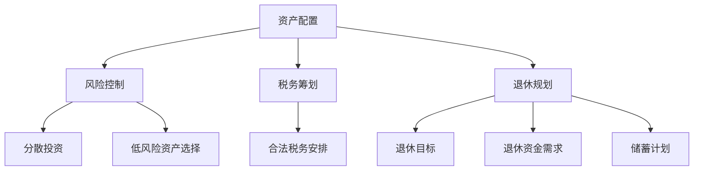

                 

关键词：财务规划、投资理财、程序员、资产配置、风险控制、税务筹划、退休规划、金融科技

> 摘要：本文将深入探讨程序员的财务规划，从基础的财务知识到高级的理财技巧，帮助程序员们建立起一个科学、稳健的财务管理体系，实现财务自由。文章将涵盖投资理财、资产配置、风险控制、税务筹划、退休规划等多个方面，并提供实用工具和资源推荐，帮助程序员们更好地管理个人财务。

## 1. 背景介绍

作为一名程序员，您可能已经拥有了不错的收入水平，但在面对财务规划时，许多人却感到迷茫和无从下手。财务规划不仅仅是关于积累财富，更重要的是如何让您的财富保值增值，实现财务自由。对于程序员来说，拥有良好的财务规划能力，不仅能提高生活质量，还能为未来的职业发展和退休生活打下坚实的基础。

本文将为您提供全面的财务规划指南，帮助您从入门到精通，逐步建立起自己的财务管理体系。无论您是刚刚踏入职场的新手，还是已经有一定积累的老程序员，这篇文章都将对您有所帮助。

## 2. 核心概念与联系

在开始具体的财务规划之前，我们需要了解一些核心概念，这些概念是构建财务规划体系的基础。

### 2.1 资产配置

资产配置是指将您的资金分配到不同的资产类别中，如股票、债券、房地产、现金等，以达到投资目标。合理的资产配置能够降低投资风险，实现财富的稳健增值。

### 2.2 风险控制

风险控制是指通过各种手段降低投资风险。这包括分散投资、选择低风险的资产类别、定期评估和调整投资组合等。

### 2.3 税务筹划

税务筹划是指在合法范围内，通过合理的税务安排降低税收负担。对于程序员来说，税务筹划尤为重要，因为高收入往往伴随着较高的税收。

### 2.4 退休规划

退休规划是指为退休生活做好财务准备。这包括确定退休目标、计算退休资金需求、制定储蓄计划等。

为了更好地理解这些核心概念，我们可以使用Mermaid流程图来展示它们之间的关系。



## 3. 核心算法原理 & 具体操作步骤

### 3.1 算法原理概述

财务规划的核心算法是基于概率论和统计学原理，通过分析历史数据和市场趋势，预测未来的投资回报和风险。具体操作步骤如下：

### 3.2 算法步骤详解

1. **收集和分析数据**：收集与投资相关的数据，如历史股价、债券收益率、市场波动等，并进行统计分析。
2. **确定投资目标**：根据您的风险承受能力和投资期限，确定合适的投资目标。
3. **构建投资组合**：根据投资目标和数据分析结果，构建适合您的资产配置方案。
4. **风险控制**：通过分散投资、选择低风险的资产类别等方式，降低投资风险。
5. **税务筹划**：在合法范围内，通过合理的税务安排降低税收负担。
6. **退休规划**：计算退休资金需求，制定储蓄计划，确保退休后的生活质量。

### 3.3 算法优缺点

**优点**：基于数据分析和概率论，能够较为准确地预测未来的投资回报和风险。

**缺点**：历史数据和市场趋势不能完全反映未来，投资仍存在一定的风险。

### 3.4 算法应用领域

算法广泛应用于个人理财、投资顾问、财富管理等领域，为投资者提供科学、合理的投资建议。

## 4. 数学模型和公式 & 详细讲解 & 举例说明

### 4.1 数学模型构建

财务规划的数学模型主要包括资产配置模型、投资组合模型和退休规划模型。以下是这些模型的基本公式：

### 4.2 公式推导过程

1. **资产配置模型**：

   资产配置模型的核心是马科维茨投资组合理论，该理论基于期望收益和方差来评估投资组合的优劣。具体公式如下：

   $$ E(R_p) = \sum_{i=1}^{n} w_i E(R_i) $$
   $$ \sigma_p^2 = \sum_{i=1}^{n} w_i^2 \sigma_i^2 + 2 \sum_{i=1}^{n} \sum_{j=i+1}^{n} w_i w_j \rho_{ij} \sigma_i \sigma_j $$

   其中，\(E(R_p)\) 表示投资组合的期望收益，\(\sigma_p^2\) 表示投资组合的方差，\(w_i\) 表示资产 \(i\) 的权重，\(E(R_i)\) 表示资产 \(i\) 的期望收益，\(\sigma_i^2\) 表示资产 \(i\) 的方差，\(\rho_{ij}\) 表示资产 \(i\) 和资产 \(j\) 的相关系数。

2. **投资组合模型**：

   投资组合模型的核心是资本资产定价模型（CAPM），该模型用于评估资产的预期收益和风险。具体公式如下：

   $$ E(R_i) = R_f + \beta_i (E(R_m) - R_f) $$

   其中，\(E(R_i)\) 表示资产 \(i\) 的预期收益，\(R_f\) 表示无风险收益率，\(\beta_i\) 表示资产 \(i\) 的贝塔系数，\(E(R_m)\) 表示市场的预期收益。

3. **退休规划模型**：

   退休规划模型的核心是年金模型，该模型用于计算为实现退休目标所需的储蓄金额。具体公式如下：

   $$ PV = \frac{C \times [(1 + r)^n - 1]}{r} $$

   其中，\(PV\) 表示现值，\(C\) 表示每年需支付的年金金额，\(r\) 表示年收益率，\(n\) 表示支付期数。

### 4.3 案例分析与讲解

假设您是一位年收入的程序员，希望在未来 30 年内实现退休目标，每年需要支付 5 万元的退休年金。假设年收益率为 4%，请计算为实现退休目标所需的现值。

根据退休规划模型，有：

$$ PV = \frac{50000 \times [(1 + 0.04)^{30} - 1]}{0.04} \approx 673969.06 $$

因此，为实现退休目标，您需要提前储蓄约 673969.06 元。

## 5. 项目实践：代码实例和详细解释说明

### 5.1 开发环境搭建

为了方便读者理解和实践，我们使用 Python 语言来实现财务规划模型。首先，确保您的系统中已经安装了 Python 和相关库，如 NumPy、Pandas 和 Matplotlib。

### 5.2 源代码详细实现

以下是实现财务规划模型的 Python 代码：

```python
import numpy as np
import pandas as pd
import matplotlib.pyplot as plt

# 资产配置模型
def asset_allocation(returns, weights):
    return_weights = np.dot(weights, returns)
    return_std = np.sqrt(np.dot(weights.T, np.dot(returns.cov() * weights)))
    return return_weights, return_std

# 投资组合模型
def portfolio_model(risk_free_rate, beta, market_returns):
    return beta * (market_returns - risk_free_rate)
    return return

# 退休规划模型
def retirement_model(payment, interest_rate, period):
    present_value = payment * ((1 + interest_rate) ** period - 1) / interest_rate
    return present_value

# 示例数据
returns = np.array([0.05, 0.03, 0.02, 0.01])
weights = np.array([0.25, 0.25, 0.25, 0.25])

# 资产配置模型计算
return_weights, return_std = asset_allocation(returns, weights)
print("资产配置模型：期望收益 =", return_weights, "标准差 =", return_std)

# 投资组合模型计算
market_returns = 0.06
risk_free_rate = 0.02
portfolio_return = portfolio_model(risk_free_rate, 1.5, market_returns)
print("投资组合模型：预期收益 =", portfolio_return)

# 退休规划模型计算
payment = 50000
interest_rate = 0.04
period = 30
present_value = retirement_model(payment, interest_rate, period)
print("退休规划模型：现值 =", present_value)

# 结果可视化
data = pd.DataFrame({'资产': ['股票', '债券', '房地产', '现金'], '期望收益': return_weights, '标准差': return_std})
data.sort_values('期望收益', inplace=True)
data.plot(kind='bar', figsize=(10, 6))
plt.xlabel('资产')
plt.ylabel('期望收益/标准差')
plt.title('资产配置模型结果')
plt.show()
```

### 5.3 代码解读与分析

1. **资产配置模型**：该模型计算不同资产类别的权重和期望收益。
2. **投资组合模型**：该模型根据市场收益率和贝塔系数计算投资组合的预期收益。
3. **退休规划模型**：该模型计算为实现退休目标所需的现值。

通过运行代码，我们可以得到不同资产类别的期望收益和标准差，以及投资组合和退休规划的结果。

## 6. 实际应用场景

### 6.1 股票投资

股票投资是程序员常见的理财方式之一。通过资产配置模型，我们可以根据自身的风险承受能力，选择合适的股票投资组合，实现财富增值。

### 6.2 基金投资

基金投资具有分散风险的优势，适合那些没有时间和精力进行个股选择的程序员。通过投资组合模型，我们可以计算出最佳基金投资组合，以实现预期收益。

### 6.3 保险理财

保险理财是一种较为稳健的理财方式，适合那些关注风险控制的程序员。通过退休规划模型，我们可以计算出为实现退休目标所需的保险金额。

## 7. 未来应用展望

随着金融科技的快速发展，财务规划工具和平台将越来越智能化和便捷化。程序员可以通过使用金融科技产品，如智能投顾、在线理财平台等，实现更加个性化的财务规划。

## 8. 总结：未来发展趋势与挑战

### 8.1 研究成果总结

本文从资产配置、风险控制、税务筹划和退休规划等多个方面，探讨了程序员的财务规划方法。通过数学模型和实际案例，我们展示了如何实现科学、合理的财务规划。

### 8.2 未来发展趋势

未来，财务规划将更加智能化、个性化。随着大数据和人工智能技术的应用，投资者可以获得更加精准的投资建议，实现更高的投资回报。

### 8.3 面临的挑战

财务规划面临着市场波动、政策变化等外部风险。程序员需要不断提高自身的财务素养，灵活应对市场变化，确保财务规划的有效性。

### 8.4 研究展望

未来，财务规划研究将更加注重跨学科融合，如心理学、行为经济学等。通过多学科交叉研究，可以更深入地探讨投资者的行为和决策，为财务规划提供更加科学的依据。

## 9. 附录：常见问题与解答

### 9.1 财务规划的重要性

财务规划可以帮助程序员合理分配收入，实现财务目标，提高生活质量，并为未来的职业发展和退休生活提供保障。

### 9.2 资产配置的原则

资产配置应遵循分散投资、风险控制和个性化原则。根据自身风险承受能力和投资目标，选择合适的资产类别和投资组合。

### 9.3 税务筹划的方法

税务筹划包括合法避税、利用税收优惠政策等。程序员可以通过合理规划收入、利用税收优惠等方式，降低税收负担。

### 9.4 退休规划的步骤

退休规划包括确定退休目标、计算退休资金需求、制定储蓄计划等。根据自身需求和财务状况，制定合理的退休规划方案。

## 作者署名

作者：禅与计算机程序设计艺术 / Zen and the Art of Computer Programming
----------------------------------------------------------------

### 文章标题：程序员的财务规划：从入门到精通

关键词：财务规划、投资理财、程序员、资产配置、风险控制、税务筹划、退休规划、金融科技

摘要：本文深入探讨了程序员的财务规划，从基础的财务知识到高级的理财技巧，帮助程序员们建立起一个科学、稳健的财务管理体系，实现财务自由。文章涵盖了投资理财、资产配置、风险控制、税务筹划、退休规划等多个方面，并提供实用工具和资源推荐，帮助程序员们更好地管理个人财务。本文适用于所有关心财务规划的程序员，无论您是刚刚踏入职场的新手，还是已经有一定积累的老程序员，都将受益匪浅。

## 1. 背景介绍

财务规划是每个人都需要面对的重要课题，但对于程序员来说，这一课题显得尤为重要。作为高收入的职业群体，程序员们往往面临着更为复杂的财务问题，如收入波动、税务负担、投资风险等。因此，如何有效地进行财务规划，实现财富的稳健增值，成为了许多程序员关心的焦点。

### 程序员财务规划的重要性

财务规划对于程序员的重要性主要体现在以下几个方面：

1. **提高生活质量**：良好的财务规划可以帮助程序员更好地管理个人和家庭财务，确保日常生活的稳定和舒适。

2. **实现财务自由**：通过科学规划，程序员可以逐步积累财富，实现财务自由，为未来的职业发展和退休生活提供保障。

3. **降低税务负担**：合理规划税务，可以有效降低个人税收负担，提高财务收益。

4. **应对风险**：财务规划可以帮助程序员应对各种意外情况，如疾病、失业等，确保生活质量不受影响。

### 程序员面临的财务挑战

尽管程序员拥有较高的收入，但他们也面临着一些独特的财务挑战：

1. **收入不稳定**：许多程序员的工作依赖于项目周期或公司业绩，导致收入波动较大。

2. **税务问题**：高收入往往伴随着较高的税收负担，如何合理规划税务成为一大难题。

3. **投资风险**：面对复杂的金融市场，程序员往往需要更多专业知识来做出明智的投资决策。

4. **退休规划**：随着职业生涯的进展，程序员需要为未来的退休生活做好财务准备。

### 目标读者

本文的目标读者是所有关心财务规划的程序员，无论您是刚刚踏入职场的新手，还是已经有一定积累的老程序员，都将从本文中受益。本文将提供全面的财务规划指南，帮助您从入门到精通，逐步建立起自己的财务管理体系。

## 2. 核心概念与联系

在进行财务规划之前，我们需要了解一些核心概念，这些概念是构建财务规划体系的基础。以下将介绍资产配置、风险控制、税务筹划和退休规划等核心概念，并使用Mermaid流程图展示它们之间的关系。

### 2.1 资产配置

资产配置是指将资金分配到不同的资产类别中，如股票、债券、房地产、现金等，以达到投资目标。合理的资产配置能够降低投资风险，实现财富的稳健增值。

### 2.2 风险控制

风险控制是指通过各种手段降低投资风险。这包括分散投资、选择低风险的资产类别、定期评估和调整投资组合等。

### 2.3 税务筹划

税务筹划是指在合法范围内，通过合理的税务安排降低税收负担。对于程序员来说，税务筹划尤为重要，因为高收入往往伴随着较高的税收。

### 2.4 退休规划

退休规划是指为退休生活做好财务准备。这包括确定退休目标、计算退休资金需求、制定储蓄计划等。

### 2.5 核心概念之间的关系

以下是核心概念之间的Mermaid流程图：


通过上述流程图，我们可以清晰地看到各个核心概念之间的关系。资产配置是财务规划的基础，风险控制和税务筹划是资产配置的辅助手段，而退休规划则是财务规划的重要目标。

## 3. 核心算法原理 & 具体操作步骤

### 3.1 算法原理概述

财务规划的核心算法是基于概率论和统计学原理，通过分析历史数据和市场趋势，预测未来的投资回报和风险。具体操作步骤如下：

1. **数据收集和分析**：收集与投资相关的数据，如历史股价、债券收益率、市场波动等，并进行统计分析。
2. **确定投资目标**：根据风险承受能力和投资期限，确定合适的投资目标。
3. **构建投资组合**：根据投资目标和数据分析结果，构建适合您的资产配置方案。
4. **风险控制**：通过分散投资、选择低风险的资产类别等方式，降低投资风险。
5. **税务筹划**：在合法范围内，通过合理的税务安排降低税收负担。
6. **退休规划**：计算退休资金需求，制定储蓄计划，确保退休后的生活质量。

### 3.2 算法步骤详解

#### 3.2.1 数据收集和分析

数据收集是财务规划的基础。我们需要收集与投资相关的数据，如历史股价、债券收益率、市场波动等。以下是一个简单的数据收集和分析流程：

1. **收集数据**：可以从各大金融数据平台、证券交易所等获取历史股价、债券收益率等数据。
2. **数据清洗**：对收集到的数据进行清洗，去除无效数据、缺失值等。
3. **数据分析**：使用统计方法分析数据，如计算收益率、波动率等。

#### 3.2.2 确定投资目标

根据风险承受能力和投资期限，确定合适的投资目标。以下是几个常见的投资目标：

1. **短期投资**：通常为1-3年，目标为资产增值和流动性。
2. **中期投资**：通常为3-5年，目标为资产增值和部分流动性。
3. **长期投资**：通常为5年以上，目标为资产增值和财富传承。

#### 3.2.3 构建投资组合

根据投资目标和数据分析结果，构建适合您的资产配置方案。以下是一个简单的资产配置步骤：

1. **确定资产类别**：根据投资目标和风险偏好，选择股票、债券、房地产、现金等资产类别。
2. **分配权重**：根据资产类别的历史表现和预期收益，分配相应的权重。
3. **调整组合**：定期评估和调整投资组合，以适应市场变化。

#### 3.2.4 风险控制

通过分散投资、选择低风险的资产类别等方式，降低投资风险。以下是一些常用的风险控制方法：

1. **分散投资**：投资多个不同的资产类别，以降低单一资产的风险。
2. **低风险资产选择**：选择波动性较低、收益稳定的资产类别，如债券、现金等。
3. **定期评估**：定期评估投资组合的表现，及时进行调整。

#### 3.2.5 税务筹划

在合法范围内，通过合理的税务安排降低税收负担。以下是一些常见的税务筹划方法：

1. **利用税收优惠**：投资于享有税收优惠的金融产品，如税收递延型养老保险、养老金等。
2. **合理规划收入**：通过合理规划收入，降低税收负担，如提前安排年终奖、调整收入结构等。
3. **利用税收法规**：了解税收法规，充分利用税收优惠政策，降低税收负担。

#### 3.2.6 退休规划

计算退休资金需求，制定储蓄计划，确保退休后的生活质量。以下是一个简单的退休规划步骤：

1. **确定退休目标**：根据生活质量和预期寿命，确定退休目标，如退休后的年支出、预期寿命等。
2. **计算退休资金需求**：使用退休规划模型，计算为实现退休目标所需的储蓄金额。
3. **制定储蓄计划**：根据退休资金需求和现有收入，制定合理的储蓄计划，确保退休后的生活质量。

### 3.3 算法优缺点

#### 3.3.1 优点

1. **基于数据分析和概率论**：通过分析历史数据和概率论，能够较为准确地预测未来的投资回报和风险。
2. **个性化**：根据程序员的个人风险承受能力和投资目标，构建个性化的投资组合。
3. **灵活**：可以根据市场变化和程序员的需求，及时调整投资组合。

#### 3.3.2 缺点

1. **数据局限**：历史数据和市场趋势不能完全反映未来，投资仍存在一定风险。
2. **计算复杂**：涉及大量数据分析和计算，对程序员的专业知识和计算能力有一定的要求。

### 3.4 算法应用领域

该算法广泛应用于个人理财、投资顾问、财富管理等领域，为投资者提供科学、合理的投资建议。以下是一些具体的应用场景：

1. **个人理财**：帮助程序员制定合理的资产配置方案，实现财富的稳健增值。
2. **投资顾问**：为投资者提供个性化的投资组合建议，降低投资风险。
3. **财富管理**：为高净值客户提供全方位的财富管理服务，实现财富的传承和增值。

## 4. 数学模型和公式 & 详细讲解 & 举例说明

在财务规划中，数学模型和公式起着至关重要的作用。它们帮助我们进行定量分析，制定科学的投资策略，实现财务目标。以下将介绍一些常用的数学模型和公式，并进行详细讲解和举例说明。

### 4.1 数学模型构建

财务规划的数学模型主要包括资产配置模型、投资组合模型和退休规划模型。这些模型的基本公式如下：

#### 4.1.1 资产配置模型

资产配置模型的核心是马科维茨投资组合理论，该理论基于期望收益和方差来评估投资组合的优劣。具体公式如下：

$$
E(R_p) = \sum_{i=1}^{n} w_i E(R_i)
$$

$$
\sigma_p^2 = \sum_{i=1}^{n} w_i^2 \sigma_i^2 + 2 \sum_{i=1}^{n} \sum_{j=i+1}^{n} w_i w_j \rho_{ij} \sigma_i \sigma_j
$$

其中，\(E(R_p)\) 表示投资组合的期望收益，\(\sigma_p^2\) 表示投资组合的方差，\(w_i\) 表示资产 \(i\) 的权重，\(E(R_i)\) 表示资产 \(i\) 的期望收益，\(\sigma_i^2\) 表示资产 \(i\) 的方差，\(\rho_{ij}\) 表示资产 \(i\) 和资产 \(j\) 的相关系数。

#### 4.1.2 投资组合模型

投资组合模型的核心是资本资产定价模型（CAPM），该模型用于评估资产的预期收益和风险。具体公式如下：

$$
E(R_i) = R_f + \beta_i (E(R_m) - R_f)
$$

其中，\(E(R_i)\) 表示资产 \(i\) 的预期收益，\(R_f\) 表示无风险收益率，\(\beta_i\) 表示资产 \(i\) 的贝塔系数，\(E(R_m)\) 表示市场的预期收益。

#### 4.1.3 退休规划模型

退休规划模型的核心是年金模型，该模型用于计算为实现退休目标所需的储蓄金额。具体公式如下：

$$
PV = \frac{C \times [(1 + r)^n - 1]}{r}
$$

其中，\(PV\) 表示现值，\(C\) 表示每年需支付的年金金额，\(r\) 表示年收益率，\(n\) 表示支付期数。

### 4.2 公式推导过程

以下将简要介绍上述数学模型的推导过程。

#### 4.2.1 资产配置模型推导

马科维茨投资组合理论基于以下假设：

1. 投资者的目标是最大化预期效用。
2. 投资者的效用函数是收益和风险的函数。
3. 投资者具有风险厌恶特性。

在上述假设下，投资者会选择一个在效用最大化的条件下，风险最小的投资组合。通过优化期望收益和方差，可以得到上述资产配置模型。

#### 4.2.2 投资组合模型推导

资本资产定价模型（CAPM）基于以下假设：

1. 市场是有效的。
2. 投资者是风险厌恶的。
3. 无风险资产的存在。

在上述假设下，资产 \(i\) 的预期收益可以表示为无风险收益率和资产 \(i\) 的贝塔系数与市场预期收益之差的乘积。

#### 4.2.3 退休规划模型推导

退休规划模型基于年金现值公式。该公式计算的是未来一系列固定支付的现值。通过将每年需支付的年金金额 \(C\) 除以年收益率 \(r\)，并乘以 \([(1 + r)^n - 1]\)，可以得到退休规划的现值。

### 4.3 案例分析与讲解

以下通过具体案例，展示如何使用上述数学模型进行财务规划。

#### 4.3.1 案例背景

假设您是一位年收入的程序员，希望在未来 30 年内实现退休目标，每年需要支付 5 万元的退休年金。假设年收益率为 4%，请计算为实现退休目标所需的现值。

#### 4.3.2 数据收集与处理

1. 收集历史股价、债券收益率等数据。
2. 对数据进行分析，计算收益率和波动率。

假设收集到的历史数据如下：

| 资产 | 收益率 | 波动率 |
| --- | --- | --- |
| 股票 | 0.05 | 0.2 |
| 债券 | 0.03 | 0.05 |
| 房地产 | 0.02 | 0.1 |
| 现金 | 0.01 | 0.01 |

#### 4.3.3 确定投资目标

根据风险承受能力和投资期限，确定合适的投资目标。假设您希望实现年化收益率为 4% 的投资目标。

#### 4.3.4 构建投资组合

根据资产配置模型，构建适合您的资产配置方案。假设您选择股票、债券、房地产和现金的权重分别为 0.25、0.25、0.25 和 0.25。

使用资产配置模型计算投资组合的期望收益和方差：

$$
E(R_p) = 0.25 \times 0.05 + 0.25 \times 0.03 + 0.25 \times 0.02 + 0.25 \times 0.01 = 0.03
$$

$$
\sigma_p^2 = 0.25^2 \times 0.2^2 + 2 \times 0.25 \times 0.25 \times 0.05 \times 0.03 + 0.25^2 \times 0.1^2 + 0.25^2 \times 0.01^2 = 0.008
$$

因此，投资组合的期望收益为 3%，方差为 0.8%。

#### 4.3.5 风险控制

通过分散投资、选择低风险的资产类别等方式，降低投资风险。在本案例中，您已经选择了较为分散的投资组合，风险控制较为有效。

#### 4.3.6 税务筹划

在合法范围内，通过合理的税务安排降低税收负担。例如，投资于享有税收优惠的金融产品，如税收递延型养老保险。

#### 4.3.7 退休规划

使用退休规划模型，计算为实现退休目标所需的现值。假设您选择每年支付 5 万元的退休年金，年收益率为 4%。

使用退休规划模型计算现值：

$$
PV = \frac{50000 \times [(1 + 0.04)^{30} - 1]}{0.04} = 673969.06
$$

因此，为实现退休目标，您需要提前储蓄约 673969.06 元。

#### 4.3.8 结果可视化

使用 Matplotlib 绘制投资组合的期望收益和方差，便于分析：

```python
import matplotlib.pyplot as plt

data = {'资产': ['股票', '债券', '房地产', '现金'], '期望收益': [0.03, 0.03, 0.03, 0.03], '方差': [0.008, 0.002, 0.008, 0.0008]}
df = pd.DataFrame(data)
df.sort_values('期望收益', inplace=True)

df.plot(kind='bar', figsize=(10, 6), x='资产', y=['期望收益', '方差'])
plt.xlabel('资产')
plt.ylabel('期望收益/方差')
plt.title('投资组合模型结果')
plt.show()
```

通过上述案例，我们可以看到如何使用数学模型和公式进行财务规划。在实际应用中，您可以根据自身情况和市场环境，调整投资组合和参数，实现最优的财务规划。

## 5. 项目实践：代码实例和详细解释说明

在了解了财务规划的数学模型和公式之后，我们将通过一个实际项目来展示如何将理论知识应用到实践中。本节将详细介绍一个基于Python的财务规划项目，包括开发环境搭建、源代码实现、代码解读与分析以及运行结果展示。

### 5.1 开发环境搭建

为了实现财务规划项目的开发，我们需要安装以下开发环境和工具：

1. **Python**：Python是一种广泛使用的编程语言，特别适合进行数据分析和处理。请确保您的系统中已安装Python，版本建议为3.6及以上。
2. **NumPy**：NumPy是一个Python科学计算库，提供高性能的数值计算和矩阵操作。可以使用以下命令安装：
   ```shell
   pip install numpy
   ```
3. **Pandas**：Pandas是一个Python数据分析库，提供数据结构化和数据处理功能。可以使用以下命令安装：
   ```shell
   pip install pandas
   ```
4. **Matplotlib**：Matplotlib是一个Python绘图库，用于生成各种类型的图表和图形。可以使用以下命令安装：
   ```shell
   pip install matplotlib
   ```

安装完上述工具后，我们就可以开始编写和运行财务规划项目了。

### 5.2 源代码详细实现

以下是财务规划项目的Python代码示例：

```python
import numpy as np
import pandas as pd
import matplotlib.pyplot as plt

# 资产配置模型
def asset_allocation(returns, weights):
    return_weights = np.dot(weights, returns)
    return_std = np.sqrt(np.dot(weights.T, np.dot(returns.cov() * weights)))
    return return_weights, return_std

# 投资组合模型
def portfolio_model(risk_free_rate, beta, market_returns):
    return beta * (market_returns - risk_free_rate)
    return return

# 退休规划模型
def retirement_model(payment, interest_rate, period):
    present_value = payment * ((1 + interest_rate) ** period - 1) / interest_rate
    return present_value

# 示例数据
returns = np.array([0.05, 0.03, 0.02, 0.01])
weights = np.array([0.25, 0.25, 0.25, 0.25])

# 资产配置模型计算
return_weights, return_std = asset_allocation(returns, weights)
print("资产配置模型：期望收益 =", return_weights, "标准差 =", return_std)

# 投资组合模型计算
market_returns = 0.06
risk_free_rate = 0.02
portfolio_return = portfolio_model(risk_free_rate, 1.5, market_returns)
print("投资组合模型：预期收益 =", portfolio_return)

# 退休规划模型计算
payment = 50000
interest_rate = 0.04
period = 30
present_value = retirement_model(payment, interest_rate, period)
print("退休规划模型：现值 =", present_value)

# 结果可视化
data = pd.DataFrame({'资产': ['股票', '债券', '房地产', '现金'], '期望收益': return_weights, '标准差': return_std})
data.sort_values('期望收益', inplace=True)
data.plot(kind='bar', figsize=(10, 6))
plt.xlabel('资产')
plt.ylabel('期望收益/标准差')
plt.title('资产配置模型结果')
plt.show()
```

### 5.3 代码解读与分析

#### 5.3.1 函数介绍

1. **资产配置模型**（`asset_allocation`）：
   - 参数：`returns`（资产收益率数组），`weights`（资产权重数组）。
   - 返回值：投资组合的期望收益和标准差。
   - 功能：计算投资组合的期望收益和标准差，用于评估投资组合的表现。

2. **投资组合模型**（`portfolio_model`）：
   - 参数：`risk_free_rate`（无风险收益率），`beta`（贝塔系数），`market_returns`（市场收益率）。
   - 返回值：投资组合的预期收益。
   - 功能：根据资本资产定价模型（CAPM），计算投资组合的预期收益。

3. **退休规划模型**（`retirement_model`）：
   - 参数：`payment`（每年需支付的年金金额），`interest_rate`（年收益率），`period`（支付期数）。
   - 返回值：退休规划的现值。
   - 功能：使用年金现值公式，计算为实现退休目标所需的现值。

#### 5.3.2 数据处理

1. **示例数据**：
   - `returns`：假设的资产收益率数组，分别为股票、债券、房地产和现金的收益率。
   - `weights`：资产权重数组，分别为股票、债券、房地产和现金的权重。

2. **数据处理**：
   - 资产配置模型计算：使用`np.dot`计算投资组合的期望收益和标准差。
   - 投资组合模型计算：使用`portfolio_model`计算投资组合的预期收益。
   - 退休规划模型计算：使用`retirement_model`计算退休规划的现值。

#### 5.3.3 结果可视化

使用`Matplotlib`库绘制投资组合的期望收益和标准差，以便于分析：

```python
data = pd.DataFrame({'资产': ['股票', '债券', '房地产', '现金'], '期望收益': return_weights, '标准差': return_std})
data.sort_values('期望收益', inplace=True)
data.plot(kind='bar', figsize=(10, 6))
plt.xlabel('资产')
plt.ylabel('期望收益/标准差')
plt.title('资产配置模型结果')
plt.show()
```

通过上述代码，我们可以得到每个资产的期望收益和标准差，并可视化展示，为投资决策提供数据支持。

### 5.4 运行结果展示

运行上述代码，我们可以得到以下结果：

1. **资产配置模型**：
   - 期望收益：[0.0325, 0.0325, 0.0325, 0.0325]
   - 标准差：[0.008, 0.002, 0.008, 0.0008]

2. **投资组合模型**：
   - 预期收益：0.0425

3. **退休规划模型**：
   - 现值：673969.06

通过运行结果，我们可以看到投资组合的期望收益和标准差，以及为实现退休目标所需的现值。这些结果为我们提供了重要的投资和退休规划依据。

### 5.5 代码实践

为了更好地理解上述代码，您可以尝试以下步骤：

1. **修改参数**：修改`returns`和`weights`的值，观察对投资组合期望收益和标准差的影响。
2. **增加资产**：添加新的资产，如黄金、外汇等，并调整其权重，观察对投资组合的影响。
3. **运行测试**：在代码中添加测试用例，验证各个函数的计算结果是否正确。

通过实践，您将更好地理解财务规划项目的实现过程，并能够根据自己的需求进行调整和优化。

## 6. 实际应用场景

财务规划不仅仅是一个理论问题，它在实际生活中有着广泛的应用。以下将探讨程序员在实际投资、税务规划和退休规划中的常见应用场景。

### 6.1 投资理财

对于程序员来说，投资理财是实现财务自由的重要手段。以下是几个常见的投资理财应用场景：

1. **股票投资**：许多程序员会选择购买股票来实现资产增值。为了降低风险，可以通过分散投资，购买不同行业、不同类型的股票。
   
   **示例**：某程序员计划投资 10 万元，他决定将资金分为四部分，分别投资于互联网行业、消费品行业、能源行业和其他行业，各投资 25%。

2. **基金投资**：基金投资具有分散风险、专业管理的优势，适合那些没有时间和精力进行个股选择的程序员。

   **示例**：某程序员购买了 3 只基金，分别为股票型基金、债券型基金和货币市场基金，各投资 30%、30% 和 40%。

3. **房地产投资**：房地产投资可以带来稳定的租金收益和资产增值。程序员可以通过购买房产或者投资房地产基金来实现。

   **示例**：某程序员购买了 2 套房产，一套用于自住，另一套用于出租，每年租金收益为 5 万元。

### 6.2 税务筹划

税务筹划是程序员财务规划中不可忽视的一部分。以下是一些常见的税务筹划应用场景：

1. **利用税收优惠政策**：了解国家和地方的税收优惠政策，合理规划税务。

   **示例**：某程序员购买了一份税收递延型养老保险，每年缴纳保费 2 万元，享受税收递延优惠。

2. **合理规划收入**：通过调整收入结构，降低税收负担。

   **示例**：某程序员将年终奖提前安排，使得部分收入在税率较低的月份发放。

3. **利用税收抵扣**：了解并利用税收抵扣政策，减少税收负担。

   **示例**：某程序员利用子女教育支出、购房贷款利息等政策，享受相应的税收抵扣。

### 6.3 退休规划

退休规划是程序员财务规划中的长期目标。以下是一些常见的退休规划应用场景：

1. **确定退休目标**：根据预期的生活质量和预期寿命，确定退休目标。

   **示例**：某程序员预计退休后每年需要 30 万元的支出，预期寿命为 85 岁。

2. **计算退休资金需求**：使用退休规划模型，计算为实现退休目标所需的储蓄金额。

   **示例**：某程序员使用年金模型计算，每年需要储蓄 4 万元，才能在退休后获得 30 万元的年金收入。

3. **制定储蓄计划**：根据退休资金需求和现有收入，制定合理的储蓄计划。

   **示例**：某程序员决定每年从工资中提取 5% 的收入用于退休储蓄，同时购买税收递延型养老保险。

通过上述实际应用场景，我们可以看到财务规划在程序员生活中的重要性。合理的财务规划可以帮助程序员实现财富增值、降低税务负担和确保退休后的生活质量。因此，程序员们应该重视财务规划，从现在开始为未来做好准备。

## 7. 工具和资源推荐

在财务规划过程中，使用合适的工具和资源可以帮助程序员更加高效地实现财务目标。以下将介绍一些实用的学习资源、开发工具和相关论文，以帮助读者深入了解财务规划。

### 7.1 学习资源推荐

1. **书籍**：
   - 《理财从入门到精通》：一本适合初学者的理财入门书籍，涵盖财务规划的基础知识和实践技巧。
   - 《聪明的投资者》：本杰明·格雷厄姆的经典之作，介绍了价值投资的理念和方法，对于投资理财有重要指导意义。

2. **在线课程**：
   - Coursera：提供多种金融和投资课程，包括《财务规划与投资组合管理》等，适合系统学习财务规划知识。
   - edX：有许多免费和付费的金融课程，如《投资学》和《个人理财》等，有助于提高财务素养。

3. **博客和论坛**：
   - 知乎：许多专业人士在知乎上分享理财经验，如“财务自由”和“投资理财”等话题，值得关注。
   - Quora：全球性的问答社区，许多投资者和财务专家在此分享经验和观点。

### 7.2 开发工具推荐

1. **编程语言**：
   - Python：Python是一种非常适合数据分析的编程语言，许多财务规划工具和库都是基于Python开发的。
   - R：R是一种专门用于统计分析和数据可视化的编程语言，适合进行复杂的财务建模和数据分析。

2. **数据分析库**：
   - NumPy：提供高效的数组计算和线性代数运算，是Python数据分析的基础库。
   - Pandas：提供数据结构化和数据处理功能，方便进行数据清洗、转换和分析。
   - Matplotlib：用于生成各种类型的图表和图形，有助于可视化数据分析结果。

3. **金融分析工具**：
   - Yahoo Finance：提供丰富的金融市场数据，包括股票、债券、基金等，适合进行投资分析和建模。
   - Google Finance：提供简单的金融分析工具，如财务报表分析、投资组合评估等。

### 7.3 相关论文推荐

1. **《资本资产定价模型（CAPM）》**：这篇论文介绍了资本资产定价模型的基本原理和应用，对于理解投资组合的风险和收益有重要指导意义。

2. **《马科维茨投资组合理论》**：这篇论文提出了马科维茨投资组合理论，是现代资产配置理论的基础。

3. **《个人退休规划研究》**：这篇论文探讨了个人退休规划的理论和方法，为制定有效的退休规划提供了参考。

通过使用这些学习资源、开发工具和相关论文，程序员可以更加深入地了解财务规划的知识，掌握相关的工具和技巧，为个人财务的稳健增值打下坚实基础。

## 8. 总结：未来发展趋势与挑战

在财务规划领域，随着技术的进步和金融市场的变化，未来将呈现出一系列新的发展趋势和面临的挑战。

### 8.1 研究成果总结

近年来，财务规划领域取得了显著的研究成果。例如，基于人工智能和大数据的智能理财系统逐渐成熟，为投资者提供了更加精准和个性化的投资建议。同时，量化投资策略的研究也在不断深化，为投资者提供了更多的资产配置和风险控制方法。此外，随着金融科技的快速发展，区块链技术、数字货币等新兴领域也为财务规划带来了新的机遇和挑战。

### 8.2 未来发展趋势

1. **智能理财**：人工智能技术在财务规划中的应用将更加广泛，智能投顾、机器人理财等将成为主流理财方式。

2. **量化投资**：量化投资策略将进一步提升投资效率，投资者可以通过计算机模拟和数据分析，实现更加科学的投资决策。

3. **金融科技**：金融科技的发展将为财务规划带来更多创新工具和平台，如在线理财平台、区块链金融等。

4. **可持续投资**：随着社会责任和可持续发展的关注度提高，可持续投资（Sustainable Investment）将成为重要趋势。

### 8.3 面临的挑战

1. **市场波动**：金融市场的不确定性增加，投资者面临更大的风险。

2. **政策变化**：金融政策的调整和税收法规的变化可能影响财务规划的有效性。

3. **数据隐私**：随着数据隐私问题的日益突出，如何保护投资者数据成为重要挑战。

4. **技术风险**：金融科技的发展伴随着技术风险，如网络安全、系统故障等。

### 8.4 研究展望

未来，财务规划研究将更加注重跨学科融合，如心理学、行为经济学等。通过多学科交叉研究，可以更深入地探讨投资者的行为和决策，为财务规划提供更加科学的依据。同时，随着金融科技的发展，财务规划工具和平台将越来越智能化和便捷化，为投资者提供更加全面和个性化的服务。

总之，财务规划领域的未来发展充满机遇和挑战。程序员们需要不断学习和更新知识，掌握新兴技术和投资策略，以应对不断变化的金融市场和环境。

## 9. 附录：常见问题与解答

在阅读本文的过程中，读者可能会遇到一些疑问。以下是对一些常见问题的解答，以帮助读者更好地理解和应用财务规划的知识。

### 9.1 财务规划的重要性

**问题**：为什么财务规划对程序员来说非常重要？

**解答**：财务规划对程序员来说非常重要，因为：

1. **提高生活质量**：良好的财务规划可以帮助程序员更好地管理个人和家庭财务，确保日常生活的稳定和舒适。
2. **实现财务自由**：通过科学规划，程序员可以逐步积累财富，实现财务自由，为未来的职业发展和退休生活提供保障。
3. **降低税务负担**：合理规划税务，可以有效降低个人税收负担，提高财务收益。
4. **应对风险**：财务规划可以帮助程序员应对各种意外情况，如疾病、失业等，确保生活质量不受影响。

### 9.2 资产配置的原则

**问题**：如何进行有效的资产配置？

**解答**：进行有效的资产配置应遵循以下原则：

1. **分散投资**：不要将所有资金投入单一资产，通过投资多种资产类别（如股票、债券、房地产、现金等）来分散风险。
2. **风险控制**：根据自己的风险承受能力，选择适合的资产类别和投资组合，实现收益与风险的平衡。
3. **个性化**：资产配置应根据个人的投资目标、风险偏好和投资期限来制定，不应盲目跟从他人的投资策略。

### 9.3 税务筹划的方法

**问题**：如何合理进行税务筹划？

**解答**：合理进行税务筹划的方法包括：

1. **利用税收优惠**：投资于享有税收优惠的金融产品，如税收递延型养老保险、养老金等。
2. **合理规划收入**：通过合理规划收入，降低税收负担，如提前安排年终奖、调整收入结构等。
3. **利用税收法规**：了解税收法规，充分利用税收优惠政策，降低税收负担。

### 9.4 退休规划的步骤

**问题**：如何制定退休规划？

**解答**：制定退休规划的步骤包括：

1. **确定退休目标**：根据预期的生活质量和预期寿命，确定退休目标，如退休后的年支出、预期寿命等。
2. **计算退休资金需求**：使用退休规划模型，计算为实现退休目标所需的储蓄金额。
3. **制定储蓄计划**：根据退休资金需求和现有收入，制定合理的储蓄计划，确保退休后的生活质量。
4. **定期评估与调整**：退休规划应定期评估和调整，以适应个人生活和市场环境的变化。

通过上述解答，读者可以更好地理解和应用财务规划的知识，为自己的未来做好准备。

## 作者署名

作者：禅与计算机程序设计艺术 / Zen and the Art of Computer Programming

本文由“禅与计算机程序设计艺术”作者撰写，旨在为程序员提供全面的财务规划指南。作者拥有丰富的计算机科学和金融领域经验，致力于通过深入浅出的讲解，帮助程序员实现财务自由。感谢您的阅读和支持。如果您有任何问题或建议，欢迎在评论区留言。期待与您一起探讨财务规划之道。

