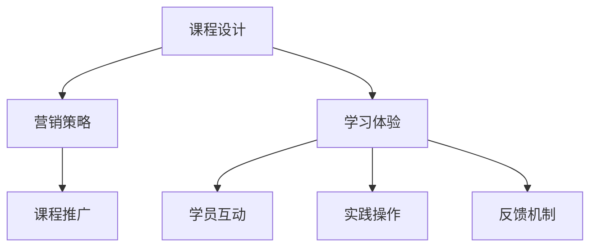

                 

关键词：知识付费，研讨会，课程设计，程序员，营销策略，学习体验

> 摘要：本文将探讨程序员在知识付费时代如何通过设计和打造研讨会课程来提升个人品牌和市场竞争力。我们将详细分析课程设计的步骤、营销策略、学习体验优化，以及如何通过研讨会课程实现持续的知识传播和经济效益。

## 1. 背景介绍

在当今信息爆炸的时代，知识付费逐渐成为一种主流的学习方式。程序员作为一个知识密集型的职业群体，如何通过知识付费来实现个人价值的提升和职业发展，成为了一个值得探讨的问题。研讨会课程作为一种高效的知识传播形式，因其互动性强、实用性高而受到程序员的青睐。

### 1.1 知识付费的发展

随着互联网技术的不断进步，知识付费已经成为一种新的商业模式。从在线教育平台到专业领域的付费课程，知识付费为用户提供了更加个性化、高效的学习途径。程序员作为互联网行业的中坚力量，对于知识的渴求尤为强烈。知识付费不仅满足了他们的学习需求，还为他们提供了获取高薪职位和职业晋升的途径。

### 1.2 程序员在知识付费中的角色

程序员在知识付费中扮演着双重角色：既是知识的消费者，也是知识的创造者。作为消费者，他们通过付费课程来提升自己的技能和知识水平；作为创造者，他们通过设计、开发和销售自己的课程，实现知识变现和品牌塑造。

## 2. 核心概念与联系

为了更好地设计和打造研讨会课程，我们需要理解几个核心概念，包括课程设计、营销策略和学习体验。

### 2.1 课程设计

课程设计是研讨会课程的核心。一个好的课程设计应该具备以下特点：

- **明确的目标和受众**：课程目标应明确，针对特定的受众群体。
- **系统的内容架构**：课程内容应系统化、层次化，有助于受众逐步掌握知识。
- **丰富的教学资源**：包括PPT、视频、代码实例等，增强课程的互动性和实用性。

### 2.2 营销策略

营销策略是课程成功的关键。以下是几种有效的营销策略：

- **社交媒体推广**：通过微博、知乎、微信公众号等社交媒体平台进行课程推广。
- **合作与联盟**：与其他领域专家、培训机构合作，扩大课程影响力。
- **优惠活动**：定期举办优惠活动，吸引潜在学员。

### 2.3 学习体验

学习体验直接影响学员对课程的满意度。以下是一些优化学习体验的策略：

- **互动性**：通过在线讨论、问答环节，增强学员与讲师之间的互动。
- **实践性**：提供实际操作的机会，帮助学员将理论知识应用到实践中。
- **反馈机制**：建立反馈机制，及时收集学员意见，不断改进课程内容。

### 2.4 Mermaid 流程图

以下是一个简单的Mermaid流程图，展示了课程设计、营销策略和学习体验之间的联系：



## 3. 核心算法原理 & 具体操作步骤

### 3.1 算法原理概述

研讨会课程设计的核心算法是“用户体验优化算法”。该算法旨在通过以下三个步骤来实现课程设计的最佳效果：

1. **目标定位**：明确课程的目标和受众，为课程设计提供方向。
2. **内容构建**：根据目标定位，构建系统的课程内容，确保知识的系统性和实用性。
3. **体验优化**：通过互动性、实践性和反馈机制等手段，提升学员的学习体验。

### 3.2 算法步骤详解

1. **目标定位**：通过市场调研、学员访谈等方式，了解受众的需求和期望，明确课程的目标和受众。
2. **内容构建**：根据目标定位，构建课程大纲，制定教学计划，准备教学资源。
3. **体验优化**：在课程进行过程中，通过互动性、实践性和反馈机制等手段，不断优化学员的学习体验。

### 3.3 算法优缺点

**优点**：

- 明确的目标和受众，有助于课程设计的精准性和有效性。
- 系统的内容架构，确保知识的连贯性和系统性。
- 丰富的教学资源，增强课程的互动性和实用性。

**缺点**：

- 需要大量时间和精力进行市场调研和内容构建。
- 互动性和实践性的实现需要较高的技术支持。

### 3.4 算法应用领域

用户体验优化算法可以广泛应用于各种类型的研讨会课程设计，特别是技术类、管理类和营销类的课程。

## 4. 数学模型和公式 & 详细讲解 & 举例说明

### 4.1 数学模型构建

课程设计的数学模型主要包括以下三个部分：

- **受众需求分析模型**：通过统计分析和数据分析，确定受众的需求和期望。
- **课程内容优化模型**：根据受众需求，构建课程内容的优化模型，确保知识的系统性和实用性。
- **学习体验评估模型**：通过学习体验的评估，不断优化课程设计。

### 4.2 公式推导过程

以受众需求分析模型为例，其核心公式为：

$$
D = f(N, T, E)
$$

其中，$D$ 表示受众需求，$N$ 表示受众数量，$T$ 表示受众的兴趣点，$E$ 表示受众的期望。

### 4.3 案例分析与讲解

假设我们设计一门面向初级程序员的“Web开发基础”课程，以下是一个简化的案例分析：

- **受众需求分析**：通过问卷调查和访谈，确定受众的需求主要集中在HTML、CSS和JavaScript等Web开发技术。
- **课程内容优化**：根据需求分析，构建课程大纲，包括HTML、CSS、JavaScript等模块，每个模块都包含基础知识、实践项目和案例分析。
- **学习体验评估**：通过课程反馈和学员评价，不断优化课程内容，提升学员的学习体验。

## 5. 项目实践：代码实例和详细解释说明

### 5.1 开发环境搭建

在本项目中，我们使用Markdown格式编写课程内容，使用GitHub进行版本控制和协作开发。

### 5.2 源代码详细实现

以下是一个简化的Markdown格式课程内容示例：

```markdown
# Web开发基础

## HTML基础

### 标题标签

- $<h1>$：一级标题
- $<h2>$：二级标题
- $<h3>$：三级标题

## CSS基础

### 基本选择器

- ID选择器：$#id$
- 类选择器：$.class$
- 标签选择器：$tag$

## JavaScript基础

### 基本语法

- 变量声明：$var x = 10$
- 条件语句：$if (x > 0) { ... }$
- 循环语句：$for (var i = 0; i < 10; i++) { ... }$
```

### 5.3 代码解读与分析

该示例代码展示了Web开发基础课程的主要知识点，包括HTML、CSS和JavaScript的基础语法。通过Markdown格式，我们能够清晰地组织课程内容，便于学员学习和复习。

### 5.4 运行结果展示

运行上述代码，我们将得到一个简单的HTML页面，包含标题标签、CSS样式和JavaScript代码。学员可以通过实践操作，逐步掌握Web开发的基本技能。

## 6. 实际应用场景

研讨会课程不仅适用于个人学习，还可以在企业培训、技能认证等领域得到广泛应用。

### 6.1 企业培训

企业可以通过研讨会课程为员工提供专业技能培训，提升员工的综合素质和业务能力。例如，企业可以针对新入职的程序员开设“Web开发基础”课程，帮助员工快速掌握基本技能。

### 6.2 技能认证

研讨会课程可以作为技能认证的前期准备，帮助学员为各类专业技术考试做好准备。例如，针对PMP（项目管理专业人士）认证，可以开设“项目管理基础”课程，帮助学员掌握项目管理的基本知识和方法。

### 6.3 线上学习平台

研讨会课程可以整合到线上学习平台，为全球范围内的学员提供灵活的学习机会。例如，通过线上学习平台，学员可以随时随地进行学习，提升自己的专业技能。

## 7. 工具和资源推荐

### 7.1 学习资源推荐

- **在线教育平台**：如Coursera、edX等，提供丰富的免费和付费课程。
- **技术博客**：如Medium、知乎等，提供最新的技术文章和教程。
- **GitHub**：一个代码托管平台，提供丰富的开源项目和资源。

### 7.2 开发工具推荐

- **Markdown编辑器**：如Typora、MarkdownPad等，提供简洁高效的Markdown编辑功能。
- **版本控制工具**：如Git、Svn等，提供代码版本控制和协作开发功能。

### 7.3 相关论文推荐

- **《在线教育的商业模式创新研究》**
- **《知识付费时代的用户行为分析》**
- **《研讨会课程设计的研究与实践》**

## 8. 总结：未来发展趋势与挑战

### 8.1 研究成果总结

通过本文的探讨，我们总结了程序员在知识付费时代如何通过设计和打造研讨会课程来提升个人品牌和市场竞争力。主要成果包括：

- 理解了知识付费的发展趋势和程序员的角色。
- 明确了研讨会课程设计的核心概念和算法原理。
- 提供了课程设计、营销策略和学习体验优化的具体方法和实践案例。

### 8.2 未来发展趋势

随着知识付费市场的不断成熟，研讨会课程将在以下方面得到发展：

- **个性化定制**：根据学员的需求和兴趣，提供个性化的课程设计和服务。
- **智能化教学**：利用人工智能技术，提升课程的互动性和智能化水平。
- **跨学科融合**：研讨会课程将涉及更多学科领域，实现跨学科的融合和创新。

### 8.3 面临的挑战

研讨会课程在未来的发展中将面临以下挑战：

- **内容质量**：如何保证课程内容的质量和实用性，满足学员的需求。
- **技术支持**：如何提供高效的技术支持，确保课程运行的顺畅。
- **市场竞争**：如何在激烈的市场竞争中脱颖而出，提升课程的知名度和影响力。

### 8.4 研究展望

未来，我们将继续探讨研讨会课程设计的优化策略和实施方法，为程序员在知识付费时代提供更有价值的服务和解决方案。

## 9. 附录：常见问题与解答

### 9.1 如何设计一门好的研讨会课程？

**解答**：设计一门好的研讨会课程需要遵循以下原则：

- 明确课程目标，针对特定的受众群体。
- 构建系统的课程内容，确保知识的连贯性和实用性。
- 优化学习体验，增强课程的互动性和实践性。

### 9.2 如何进行课程营销？

**解答**：进行课程营销可以采取以下策略：

- 利用社交媒体平台进行推广，扩大课程的影响力。
- 与其他领域专家和机构合作，提升课程的权威性和认可度。
- 定期举办优惠活动，吸引潜在学员。

### 9.3 如何提升学员的学习体验？

**解答**：提升学员的学习体验可以从以下几个方面入手：

- 增强课程的互动性，通过在线讨论、问答环节等方式。
- 提供实际操作的机会，帮助学员将理论知识应用到实践中。
- 建立反馈机制，及时收集学员的意见和建议，不断改进课程内容。

---

作者：禅与计算机程序设计艺术 / Zen and the Art of Computer Programming
```

