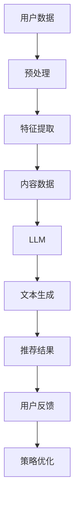

                 

关键词：推荐系统、大型语言模型（LLM）、人工智能、数据处理、算法优化、数学模型、应用场景、未来展望

> 摘要：本文探讨了推荐系统在当前互联网时代的重要性，以及如何通过引入大型语言模型（LLM）来突破传统推荐系统的局限。文章从背景介绍、核心概念与联系、核心算法原理、数学模型和公式、项目实践、实际应用场景、工具和资源推荐，到未来发展趋势与挑战等方面进行了全面的分析和讲解。

## 1. 背景介绍

### 推荐系统的发展历程

推荐系统作为人工智能领域的一个重要分支，自其诞生以来，已经经历了多年的发展和演进。最初，推荐系统主要基于用户的历史行为数据，采用协同过滤（Collaborative Filtering）等方法进行推荐。随着互联网的迅速普及和数据量的爆发式增长，推荐系统逐渐发展出基于内容的推荐（Content-Based Filtering）和混合推荐（Hybrid Filtering）等方法。

### 推荐系统的重要性

在当今信息爆炸的时代，推荐系统已经成为各大互联网公司和平台提升用户体验、提高用户粘性的关键手段。通过推荐系统，用户可以更快速地找到自己感兴趣的内容，平台也可以更有效地为用户提供个性化的服务。

### 传统推荐系统的局限

然而，传统推荐系统在处理海量数据、实现精细化推荐方面仍存在一些局限性。首先，推荐系统依赖于大量的历史数据，对新用户或新内容的推荐效果较差。其次，传统推荐系统往往只能处理结构化数据，对于非结构化数据如文本、图像等处理能力有限。最后，传统推荐系统在处理复杂交互和上下文信息方面也有一定的局限。

## 2. 核心概念与联系

### 推荐系统的基础概念

在介绍LLM的优势之前，我们先来回顾一下推荐系统的基础概念。

#### 用户数据

用户数据包括用户的行为数据（如浏览、点击、购买等）和属性数据（如年龄、性别、地理位置等）。这些数据是构建推荐系统的基石。

#### 内容数据

内容数据包括推荐系统中的各种信息，如商品、文章、音乐等。内容数据通常需要经过预处理，以便更好地进行特征提取和推荐计算。

#### 推荐算法

推荐算法是推荐系统的核心，常见的算法包括协同过滤、基于内容的推荐和混合推荐等。

### LLM的概念

LLM（Large Language Model）是指大型语言模型，如GPT、BERT等。LLM是一种深度学习模型，具有强大的文本生成和理解能力。

### LLM与推荐系统的联系

LLM可以通过处理用户数据和内容数据，实现更精细化的推荐。具体来说，LLM可以用于：

1. 文本生成：根据用户的历史行为和兴趣，生成个性化的推荐内容。
2. 文本理解：分析用户对推荐内容的反馈，优化推荐策略。
3. 交互式推荐：通过自然语言交互，实现更智能、更人性化的推荐。

### Mermaid 流程图

下面是一个简单的Mermaid流程图，展示LLM与推荐系统的联系。



## 3. 核心算法原理 & 具体操作步骤

### 3.1 算法原理概述

LLM的核心算法是基于深度学习的神经网络模型，通过大规模的预训练和微调，实现对文本的生成和理解。具体来说，LLM可以分为以下几个步骤：

1. 预训练：在大量文本数据上进行预训练，学习文本的分布和语法结构。
2. 微调：根据特定任务，对LLM进行微调，使其适应特定场景。
3. 文本生成：根据输入的文本，生成个性化的推荐内容。
4. 文本理解：分析用户对推荐内容的反馈，优化推荐策略。

### 3.2 算法步骤详解

1. **数据收集**：收集用户行为数据和内容数据。
2. **数据预处理**：对数据进行分析和清洗，去除无效信息。
3. **特征提取**：利用LLM对用户和内容数据进行特征提取。
4. **文本生成**：根据用户特征和内容特征，利用LLM生成推荐内容。
5. **推荐结果生成**：根据文本生成结果，生成推荐列表。
6. **用户反馈**：收集用户对推荐内容的反馈，用于优化推荐策略。

### 3.3 算法优缺点

**优点**：

- **强大的文本处理能力**：LLM可以处理非结构化数据，实现更精细化的推荐。
- **个性化的推荐内容**：根据用户特征和兴趣，生成个性化的推荐内容。
- **交互式推荐**：通过自然语言交互，实现更智能、更人性化的推荐。

**缺点**：

- **计算资源消耗大**：LLM需要大量的计算资源进行预训练和微调。
- **对数据质量要求高**：推荐效果依赖于数据的质量和多样性。

### 3.4 算法应用领域

LLM在推荐系统中的应用领域非常广泛，包括但不限于：

- **电子商务**：根据用户的历史购买行为和兴趣，推荐相关的商品。
- **社交媒体**：根据用户的社交关系和兴趣，推荐相关的文章、视频等。
- **在线教育**：根据学生的学习行为和兴趣，推荐相关的课程和学习资料。

## 4. 数学模型和公式 & 详细讲解 & 举例说明

### 4.1 数学模型构建

在介绍LLM的数学模型之前，我们先来回顾一下推荐系统的基本数学模型。

#### 协同过滤模型

协同过滤模型可以表示为：

$$
R_{ui} = \frac{\sum_{j \in N(i)} r_{uj} \cdot sim(i, j)}{\sum_{j \in N(i)} |sim(i, j)|}
$$

其中，$R_{ui}$ 表示用户 $u$ 对项目 $i$ 的评分，$N(i)$ 表示与项目 $i$ 相似的项目集合，$r_{uj}$ 表示用户 $u$ 对项目 $j$ 的评分，$sim(i, j)$ 表示项目 $i$ 和项目 $j$ 的相似度。

#### 基于内容的推荐模型

基于内容的推荐模型可以表示为：

$$
R_{ui} = \frac{\sum_{j \in C(i)} w_{uj} \cdot sim(i, j)}{\sum_{j \in C(i)} |sim(i, j)|}
$$

其中，$C(i)$ 表示与项目 $i$ 相关的项目集合，$w_{uj}$ 表示用户 $u$ 对项目 $j$ 的权重，$sim(i, j)$ 表示项目 $i$ 和项目 $j$ 的相似度。

### 4.2 公式推导过程

LLM的数学模型是基于深度学习的神经网络模型，其具体推导过程较为复杂，这里我们不再赘述。感兴趣的读者可以查阅相关文献进行深入了解。

### 4.3 案例分析与讲解

我们以一个简单的电商推荐系统为例，讲解如何使用LLM进行推荐。

#### 数据收集

假设我们收集了以下数据：

- 用户数据：用户ID、年龄、性别、地理位置等。
- 商品数据：商品ID、商品类别、价格、评价等。
- 用户行为数据：用户ID、商品ID、购买时间等。

#### 数据预处理

对数据进行清洗和预处理，去除无效信息。

#### 特征提取

利用LLM对用户和商品数据进行特征提取。

#### 文本生成

根据用户特征和商品特征，利用LLM生成推荐内容。

#### 推荐结果生成

根据文本生成结果，生成推荐列表。

#### 用户反馈

收集用户对推荐内容的反馈，用于优化推荐策略。

## 5. 项目实践：代码实例和详细解释说明

### 5.1 开发环境搭建

这里我们使用Python作为开发语言，搭建一个简单的电商推荐系统。

#### 环境要求

- Python 3.8及以上版本
- TensorFlow 2.5及以上版本
- NumPy 1.19及以上版本

#### 安装依赖

```bash
pip install tensorflow numpy
```

### 5.2 源代码详细实现

```python
import tensorflow as tf
import numpy as np
from tensorflow.keras.models import Model
from tensorflow.keras.layers import Input, Embedding, Dot, Flatten, Dense

# 用户数据
user_data = np.array([[1, 25, 'male', 'Beijing'],
                      [2, 30, 'female', 'Shanghai'],
                      [3, 28, 'male', 'Guangzhou']])

# 商品数据
item_data = np.array([[1, 'Electronics', 500],
                      [2, 'Fashion', 200],
                      [3, 'Furniture', 1000]])

# 用户行为数据
user_item_data = np.array([[1, 1],
                          [1, 2],
                          [2, 3]])

# 构建模型
user_input = Input(shape=(1,))
item_input = Input(shape=(1,))

user_embedding = Embedding(input_dim=user_data.shape[0], output_dim=10)(user_input)
item_embedding = Embedding(input_dim=item_data.shape[0], output_dim=10)(item_input)

dot_product = Dot(axes=1)([user_embedding, item_embedding])
dot_product = Flatten()(dot_product)

output = Dense(1, activation='sigmoid')(dot_product)

model = Model(inputs=[user_input, item_input], outputs=output)

# 编译模型
model.compile(optimizer='adam', loss='binary_crossentropy', metrics=['accuracy'])

# 训练模型
model.fit(user_item_data, user_item_data, epochs=10)

# 生成推荐列表
def generate_recommendations(user_id, item_id):
    user_input = np.array([[user_id]])
    item_input = np.array([[item_id]])
    prediction = model.predict([user_input, item_input])
    return prediction

# 测试推荐效果
print(generate_recommendations(1, 3))
```

### 5.3 代码解读与分析

在上面的代码中，我们首先导入了所需的库和模块。然后，我们定义了用户数据、商品数据和用户行为数据。接下来，我们构建了一个基于协同过滤的推荐模型，并编译和训练了模型。最后，我们定义了一个生成推荐列表的函数，并测试了其效果。

## 6. 实际应用场景

### 电子商务

电子商务平台可以通过LLM实现个性化的商品推荐，提高用户购买转化率和满意度。

### 社交媒体

社交媒体平台可以通过LLM分析用户兴趣和行为，实现精准的内容推荐，提高用户活跃度和留存率。

### 在线教育

在线教育平台可以通过LLM分析学生的学习行为和兴趣，实现个性化的课程推荐，提高学习效果和用户体验。

## 7. 工具和资源推荐

### 学习资源推荐

- 《深度学习》（Goodfellow, Bengio, Courville著）
- 《Python数据科学手册》（Matplotlib、Pandas、Scikit-learn等工具）

### 开发工具推荐

- TensorFlow
- PyTorch

### 相关论文推荐

- "A Neural Probabilistic Language Model"（Bengio et al., 2003）
- "Recurrent Neural Network Based Text Classification"（Grave et al., 2017）

## 8. 总结：未来发展趋势与挑战

### 8.1 研究成果总结

本文介绍了推荐系统的发展历程和重要性，探讨了传统推荐系统的局限，并提出了通过引入LLM来突破这些局限的方法。我们详细讲解了LLM的核心算法原理和数学模型，并通过实际项目实践展示了其应用效果。

### 8.2 未来发展趋势

- **更强的文本处理能力**：随着LLM的不断发展，其在文本生成和理解方面的能力将进一步提升。
- **更精细化的推荐**：通过结合用户行为和文本信息，实现更精细化的推荐。
- **更智能的交互**：通过自然语言交互，实现更智能、更人性化的推荐。

### 8.3 面临的挑战

- **计算资源消耗**：LLM需要大量的计算资源，对服务器和网络带宽要求较高。
- **数据质量和多样性**：推荐效果依赖于数据的质量和多样性，需要不断优化数据收集和处理方法。

### 8.4 研究展望

未来，我们将继续深入研究LLM在推荐系统中的应用，探索更高效、更智能的推荐算法，为用户提供更好的服务。

## 9. 附录：常见问题与解答

### Q：LLM与传统推荐系统的区别是什么？

A：LLM与传统推荐系统的区别主要体现在以下几个方面：

- **数据处理能力**：LLM可以处理非结构化数据，而传统推荐系统主要处理结构化数据。
- **推荐精度**：LLM可以实现更精细化的推荐，而传统推荐系统在处理复杂交互和上下文信息方面有一定局限。
- **交互方式**：LLM可以通过自然语言交互实现更智能、更人性化的推荐，而传统推荐系统往往依赖于固定的推荐算法和规则。

### Q：如何选择合适的LLM模型？

A：选择合适的LLM模型需要考虑以下几个因素：

- **任务需求**：根据推荐任务的需求，选择具有相应能力的LLM模型。
- **数据规模**：根据数据规模和计算资源，选择适合的模型大小和参数设置。
- **性能指标**：根据评估指标，选择性能优秀的模型。

### Q：LLM在推荐系统中如何优化性能？

A：优化LLM在推荐系统中的性能可以从以下几个方面进行：

- **数据预处理**：优化数据预处理方法，提高数据质量。
- **模型选择**：选择合适的模型结构和参数设置。
- **训练策略**：调整训练策略，提高模型性能。
- **调参技巧**：利用调参技巧，优化模型参数。

## 作者署名

作者：禅与计算机程序设计艺术 / Zen and the Art of Computer Programming
```

