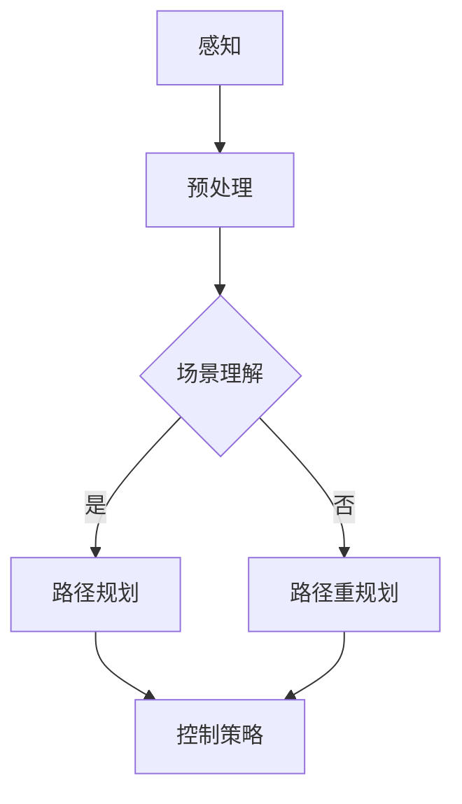

                 

关键词：端到端自动驾驶、自主决策、深度学习、传感器融合、路径规划、控制策略

> 摘要：本文将深入探讨端到端自动驾驶系统中的自主决策机制设计，包括核心概念、算法原理、数学模型、项目实践以及未来应用展望。通过详细的分析和实例讲解，旨在为读者提供一个全面、易懂的指导，以应对自动驾驶领域的复杂挑战。

## 1. 背景介绍

随着人工智能技术的飞速发展，自动驾驶技术已经成为全球关注的焦点。自动驾驶系统通过感知、决策、规划和控制四个主要环节，实现车辆的自主行驶。其中，自主决策机制是整个自动驾驶系统的核心，直接影响到车辆的行驶安全和效率。

传统的自动驾驶系统通常采用分层式架构，将感知、规划和控制任务分割为多个独立的模块。然而，这种方法在面对复杂、动态的交通环境时，容易出现响应迟缓、决策失误等问题。为了解决这些问题，端到端自动驾驶系统应运而生，通过将感知、规划和控制任务融合为一个统一的决策模块，实现了更高效、更安全的驾驶体验。

## 2. 核心概念与联系

### 2.1. 端到端自动驾驶

端到端自动驾驶系统通过深度学习等先进技术，将感知、规划和控制任务整合为一个连续的决策过程。这种系统可以直接从原始传感器数据中学习到驾驶行为，避免了传统方法中的层次分割，提高了系统的效率和鲁棒性。

### 2.2. 自主决策

自主决策是自动驾驶系统的核心，它涉及到车辆在行驶过程中对环境信息的感知、理解和响应。自主决策系统需要具备以下几个关键能力：

- **环境感知**：通过传感器（如摄像头、激光雷达、超声波传感器等）收集道路、车辆、行人等环境信息。
- **场景理解**：对收集到的信息进行预处理和融合，提取出关键特征，如道路标志、交通信号、车道线等。
- **路径规划**：根据当前环境和目标位置，生成一条安全、高效的行驶路径。
- **控制策略**：根据路径规划结果，控制车辆的速度和方向，实现自主驾驶。

### 2.3. Mermaid 流程图



## 3. 核心算法原理 & 具体操作步骤

### 3.1. 算法原理概述

端到端自动驾驶的自主决策算法主要基于深度学习技术，尤其是卷积神经网络（CNN）和循环神经网络（RNN）等。通过大量的驾驶数据训练，模型可以学会从传感器数据中提取特征，并生成相应的驾驶行为。

### 3.2. 算法步骤详解

1. **数据预处理**：对收集到的传感器数据进行预处理，包括去噪、缩放、归一化等操作，以便模型训练。
2. **模型训练**：使用预处理后的传感器数据，训练深度学习模型。模型需要能够提取道路、车辆、行人等特征，并生成驾驶行为。
3. **模型评估**：在测试数据集上评估模型性能，确保模型能够准确、稳定地生成驾驶行为。
4. **模型部署**：将训练好的模型部署到自动驾驶系统中，实现自主驾驶。

### 3.3. 算法优缺点

**优点**：

- **高效性**：端到端自动驾驶系统将感知、规划和控制任务整合为一个连续的决策过程，提高了系统的效率和响应速度。
- **鲁棒性**：通过大量数据训练，模型具有较好的鲁棒性，能够适应复杂、动态的交通环境。
- **灵活性**：模型可以根据不同场景和需求，灵活调整驾驶行为。

**缺点**：

- **训练成本高**：需要大量高质量、标注准确的驾驶数据，训练过程耗时且资源消耗大。
- **安全性问题**：在极端情况下，模型可能产生异常行为，需要进一步验证和优化。

### 3.4. 算法应用领域

端到端自动驾驶的自主决策算法广泛应用于自动驾驶汽车、无人机、机器人等领域。以下是一些具体的应用场景：

- **自动驾驶汽车**：在开放道路上实现无人驾驶，提高交通效率和安全性。
- **无人机**：在物流、搜救、监测等场景中实现自主飞行。
- **机器人**：在工业自动化、家庭服务等领域中实现自主导航和任务执行。

## 4. 数学模型和公式 & 详细讲解 & 举例说明

### 4.1. 数学模型构建

端到端自动驾驶的自主决策过程可以建模为一个序列到序列（sequence-to-sequence）的学习问题。设输入序列为\( X = [x_1, x_2, ..., x_T] \)，输出序列为\( Y = [y_1, y_2, ..., y_U] \)，其中\( T \)和\( U \)分别表示输入和输出的时间步数。模型的目标是通过学习输入序列\( X \)来预测输出序列\( Y \)。

### 4.2. 公式推导过程

设输入序列\( X \)的维度为\( D_X \)，输出序列\( Y \)的维度为\( D_Y \)。深度学习模型通常采用多层神经网络（NN）进行参数化，其中每层网络的输入和输出可以通过以下公式表示：

\[ z_{l+1} = \sigma(W_{l} \cdot a_l + b_l) \]

其中，\( z_{l+1} \)表示第\( l+1 \)层的激活值，\( a_l \)表示第\( l \)层的输入，\( W_l \)和\( b_l \)分别表示第\( l \)层的权重和偏置，\( \sigma \)表示激活函数，如ReLU或Sigmoid函数。

在序列到序列的学习中，输入和输出序列的维度通常是不同的，因此需要使用循环神经网络（RNN）或长短期记忆网络（LSTM）来处理变长的输入和输出序列。以下是一个简单的RNN模型：

\[ h_t = \text{LSTM}(h_{t-1}, x_t) \]

其中，\( h_t \)表示第\( t \)个时间步的隐藏状态，\( x_t \)表示第\( t \)个时间步的输入。通过重复这个过程，可以得到整个输入序列的隐藏状态序列。

### 4.3. 案例分析与讲解

假设我们使用LSTM模型来预测自动驾驶车辆的下一个驾驶行为。设输入序列\( X \)为过去5秒内的传感器数据，输出序列\( Y \)为下一个时间步的驾驶行为。以下是模型的训练过程：

1. **数据预处理**：对传感器数据进行归一化处理，并转换为张量格式。
2. **模型构建**：构建一个包含两个LSTM层的模型，每个LSTM层包含128个隐藏单元。
3. **模型训练**：使用训练数据集训练模型，优化模型的权重和偏置。
4. **模型评估**：使用测试数据集评估模型性能，确保模型能够准确预测驾驶行为。
5. **模型部署**：将训练好的模型部署到自动驾驶系统中，实现实时驾驶行为预测。

## 5. 项目实践：代码实例和详细解释说明

### 5.1. 开发环境搭建

为了实现端到端自动驾驶的自主决策，我们需要搭建一个合适的开发环境。以下是环境搭建的步骤：

1. **安装Python**：确保Python版本在3.6及以上。
2. **安装TensorFlow**：使用pip命令安装TensorFlow，版本建议在2.0及以上。
3. **安装其他依赖库**：安装NumPy、Matplotlib等常用库。

### 5.2. 源代码详细实现

以下是一个简单的端到端自动驾驶自主决策模型的实现代码：

```python
import tensorflow as tf
from tensorflow.keras.models import Sequential
from tensorflow.keras.layers import LSTM, Dense, TimeDistributed

# 定义模型
model = Sequential()
model.add(LSTM(units=128, return_sequences=True, input_shape=(5, input_dimension)))
model.add(LSTM(units=128))
model.add(Dense(units=output_dimension))

# 编译模型
model.compile(optimizer='adam', loss='mse')

# 训练模型
model.fit(X_train, Y_train, epochs=100, batch_size=32)

# 评估模型
loss = model.evaluate(X_test, Y_test)
print("Test loss:", loss)
```

### 5.3. 代码解读与分析

- **模型定义**：使用Sequential模型堆叠两个LSTM层和一个全连接层，用于预测驾驶行为。
- **编译模型**：使用Adam优化器和均方误差（MSE）损失函数编译模型。
- **训练模型**：使用训练数据集训练模型，设置训练轮次和批量大小。
- **评估模型**：使用测试数据集评估模型性能，输出测试损失。

### 5.4. 运行结果展示

运行上述代码后，模型会在训练过程中自动调整权重和偏置，以最小化损失函数。训练完成后，使用测试数据集评估模型性能，输出测试损失。如果模型性能良好，可以将其部署到自动驾驶系统中，实现实时驾驶行为预测。

## 6. 实际应用场景

端到端自动驾驶的自主决策机制在多个实际应用场景中展现出巨大的潜力：

- **智能交通**：通过实时感知和自主决策，提高交通效率和安全性，减少交通事故。
- **物流配送**：无人机和自动驾驶车辆可以实现自主导航和任务执行，降低人力成本。
- **工业自动化**：机器人在生产线上实现自主导航和任务执行，提高生产效率。
- **个人出行**：自动驾驶汽车为用户提供便捷、舒适的出行体验。

## 7. 工具和资源推荐

为了更好地研究和实践端到端自动驾驶的自主决策机制，以下是一些推荐的工具和资源：

- **学习资源**：《深度学习》（Goodfellow, Bengio, Courville 著）、《强化学习》（Sutton, Barto 著）等经典书籍。
- **开发工具**：TensorFlow、PyTorch等深度学习框架，MATLAB等科学计算软件。
- **相关论文**：《深度强化学习在自动驾驶中的应用》（Silver等，2016）、《端到端自动驾驶感知与决策》（Bojarski等，2016）等。

## 8. 总结：未来发展趋势与挑战

### 8.1. 研究成果总结

端到端自动驾驶的自主决策机制在近年来取得了显著的进展。通过深度学习等技术，模型在感知、规划和控制任务上表现出了较高的准确性和鲁棒性。同时，大量的实际应用案例也验证了该机制的有效性。

### 8.2. 未来发展趋势

未来，端到端自动驾驶的自主决策机制将继续发展，重点包括：

- **多模态感知**：结合多种传感器数据，提高环境感知能力。
- **实时决策**：降低决策延迟，提高系统响应速度。
- **个性化驾驶**：根据用户需求和交通环境，实现个性化驾驶体验。
- **跨领域应用**：将自动驾驶技术应用于无人机、机器人等更多领域。

### 8.3. 面临的挑战

尽管端到端自动驾驶的自主决策机制取得了显著进展，但仍面临以下挑战：

- **数据质量**：高质量、标注准确的驾驶数据是模型训练的关键，但获取这些数据仍具挑战性。
- **安全性**：在极端情况下，模型可能产生异常行为，需要确保系统安全性。
- **鲁棒性**：在复杂、动态的交通环境中，模型需要具备较高的鲁棒性。
- **法律法规**：自动驾驶技术的推广需要相应的法律法规支持，以确保道路交通安全。

### 8.4. 研究展望

未来，端到端自动驾驶的自主决策机制将朝着更加智能、安全、高效的方向发展。通过不断优化算法、提升数据质量、完善法律法规体系，自动驾驶技术将在智能交通、物流配送、工业自动化等领域发挥重要作用，为人类带来更加美好的出行体验。

## 9. 附录：常见问题与解答

### 9.1. 如何获取高质量的驾驶数据？

**解答**：获取高质量的驾驶数据可以通过以下途径：

- **开源数据集**：如KITTI、NuScenes等公开的数据集，包含丰富的传感器数据和标注信息。
- **自采集数据**：使用自动驾驶车辆在真实环境中采集数据，确保数据质量。
- **数据标注服务**：利用专业团队或标注平台，对采集到的数据进行标注。

### 9.2. 如何处理传感器数据中的噪声？

**解答**：处理传感器数据中的噪声可以通过以下方法：

- **数据预处理**：使用滤波算法（如卡尔曼滤波、中值滤波等）去除噪声。
- **数据增强**：通过旋转、缩放、裁剪等操作，增加数据的多样性和鲁棒性。
- **深度学习模型**：使用深度学习模型（如卷积神经网络、循环神经网络等）直接处理噪声数据。

### 9.3. 如何确保自动驾驶系统的安全性？

**解答**：确保自动驾驶系统的安全性可以从以下几个方面入手：

- **严格测试**：在开发过程中，对系统进行严格的测试和验证，确保在各种场景下都能稳定运行。
- **冗余设计**：在设计时，采用冗余设计，如双传感器系统、双控制模块等，确保系统在单点故障时仍能正常运行。
- **实时监控**：通过实时监控系统，对车辆状态进行监控和预警，确保在异常情况下及时采取措施。

### 9.4. 如何进行自动驾驶系统的部署？

**解答**：进行自动驾驶系统的部署可以分为以下几个步骤：

- **硬件选择**：根据系统需求，选择合适的硬件平台，如GPU、FPGA等。
- **软件开发**：根据硬件平台，开发相应的软件系统，包括驱动程序、算法实现等。
- **系统集成**：将硬件和软件系统集成，进行联调测试。
- **部署上线**：将系统部署到实际车辆中，进行测试和验证，确保系统运行稳定。

## 作者署名

作者：禅与计算机程序设计艺术 / Zen and the Art of Computer Programming

在本文中，我们深入探讨了端到端自动驾驶的自主决策机制设计。通过详细的分析、实例讲解和未来展望，旨在为读者提供一个全面、易懂的指导，以应对自动驾驶领域的复杂挑战。随着技术的不断发展，自动驾驶技术将在未来发挥更加重要的作用，为人类带来更加便捷、安全的出行体验。让我们共同期待这一美好愿景的实现！
----------------------------------------------------------------

