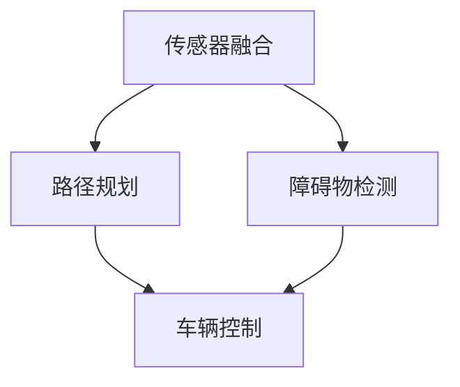
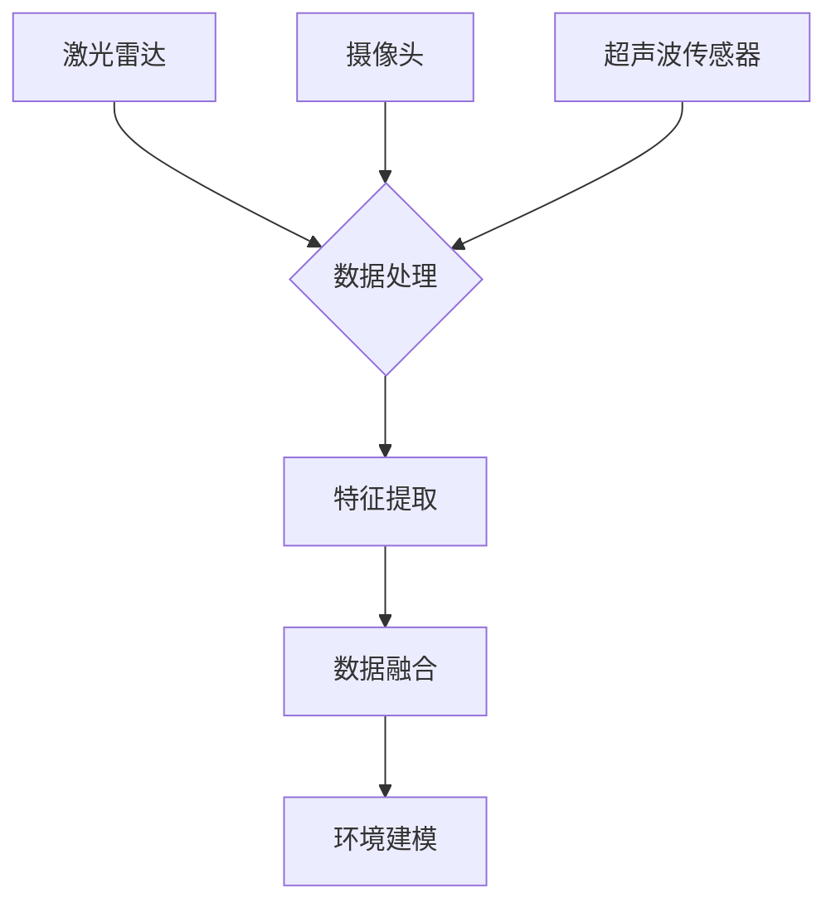

                 

关键词：自动驾驶、自主泊车、深度学习、传感器融合、神经网络、计算机视觉、端到端学习、车辆控制、交通法规、传感器数据预处理、路径规划、障碍物检测、环境建模、自主决策、安全控制、车辆通信、机器学习算法、仿真测试、实际道路测试、未来展望

> 摘要：本文探讨了端到端自动驾驶技术中自主泊车功能的设计与实现，从背景介绍、核心概念与联系、核心算法原理、数学模型与公式、项目实践、实际应用场景、工具和资源推荐、总结与展望等多个方面，全面解析了当前自主泊车技术的现状与发展趋势。文章旨在为读者提供一个深入理解自动驾驶领域自主泊车功能的框架，以及其面临的关键挑战和未来发展方向。

## 1. 背景介绍

随着科技的发展，自动驾驶技术逐渐成为智能交通系统的重要组成部分。自动驾驶技术可分为多个层次，从简单的车道保持到完全自动驾驶，其中自主泊车是自动驾驶技术中一个重要且具有挑战性的环节。自主泊车功能指的是车辆能够在无需人类干预的情况下，自动寻找停车位、执行泊车操作并安全地完成泊车过程。

自主泊车技术的重要性在于：

1. 提高停车效率：车辆能够自动寻找停车位，减少停车时间，提高道路资源利用率。
2. 减少交通事故：通过自动化操作，减少人为失误造成的交通事故。
3. 提高驾驶体验：对于驾驶员来说，自主泊车能够提供更为舒适的驾驶体验，减轻疲劳。

当前，随着深度学习、传感器技术、计算机视觉等领域的快速发展，自主泊车技术逐渐从理论走向实践，成为自动驾驶领域的研究热点。本文将深入探讨端到端自动驾驶技术中自主泊车功能的设计与实现，旨在为读者提供一个全面的技术解析。

## 2. 核心概念与联系

### 2.1 自主泊车的核心概念

自主泊车的实现依赖于多个核心概念，包括：

- **传感器融合**：使用多种传感器（如激光雷达、摄像头、超声波传感器等）收集环境信息，并融合这些信息以获得更全面的环境感知。
- **路径规划**：在车辆周围环境中构建地图，规划泊车路径，确保泊车过程中的安全性。
- **障碍物检测**：实时检测并识别周围环境中的障碍物，避免碰撞。
- **车辆控制**：控制车辆的转向、加速和制动等操作，实现泊车过程的自动化。

### 2.2 核心概念之间的联系

为了实现自主泊车，这些核心概念需要相互协同工作：

- **传感器融合**：为路径规划和障碍物检测提供准确的环境信息。
- **路径规划**：基于传感器融合结果，生成泊车路径。
- **障碍物检测**：在泊车过程中，持续检测障碍物，调整路径规划。
- **车辆控制**：根据路径规划和障碍物检测结果，控制车辆的转向、加速和制动。

下面是自主泊车核心概念的 Mermaid 流程图：



### 2.3 传感器融合架构

传感器融合是自主泊车的关键环节。以下是传感器融合的基本架构：



在此架构中，激光雷达、摄像头和超声波传感器分别负责采集不同的环境数据。数据处理模块对传感器数据进行预处理，包括降噪、去噪和特征提取等。数据融合模块则综合处理来自不同传感器的数据，生成统一的环境模型，为后续的路径规划和障碍物检测提供基础。

## 3. 核心算法原理 & 具体操作步骤

### 3.1 算法原理概述

自主泊车的实现依赖于多个核心算法，其中深度学习算法和神经网络在路径规划、障碍物检测和车辆控制中扮演着重要角色。以下简要介绍这些算法的基本原理：

- **深度学习算法**：通过多层神经网络对大量数据进行分析和学习，提取特征，实现复杂任务。如卷积神经网络（CNN）在图像处理和识别方面有广泛应用。
- **神经网络**：由多个神经元组成的网络，通过学习输入数据之间的关系，实现分类、预测和优化等功能。如反向传播算法（BP）是神经网络训练中的基本方法。
- **路径规划算法**：在给定起点和终点的基础上，寻找一条最优路径。常用的路径规划算法包括A*算法、Dijkstra算法和RRT算法等。
- **障碍物检测算法**：利用传感器数据，实时检测并识别周围环境中的障碍物。常用的障碍物检测算法包括基于统计模型的检测方法和基于深度学习的检测方法。

### 3.2 算法步骤详解

自主泊车的具体操作步骤可以分为以下几部分：

#### 3.2.1 传感器数据采集

使用激光雷达、摄像头和超声波传感器等设备，采集车辆周围的环境数据。

#### 3.2.2 数据预处理

对传感器数据进行预处理，包括降噪、去噪和特征提取等。这一步骤的目的是提高数据质量和减少噪声干扰。

#### 3.2.3 环境建模

基于预处理后的传感器数据，构建车辆周围的三维环境模型。环境建模的目的是为路径规划和障碍物检测提供基础。

#### 3.2.4 路径规划

在给定的起点和终点基础上，利用路径规划算法生成泊车路径。路径规划算法需要考虑车辆尺寸、环境复杂度等因素，以确保泊车过程的安全性和高效性。

#### 3.2.5 障碍物检测

利用深度学习算法和神经网络，实时检测并识别周围环境中的障碍物。障碍物检测的结果将直接影响车辆的控制策略。

#### 3.2.6 车辆控制

根据路径规划和障碍物检测结果，控制车辆的转向、加速和制动等操作，实现泊车过程的自动化。

### 3.3 算法优缺点

每种算法都有其独特的优缺点。以下是对几种关键算法的简要分析：

- **深度学习算法**：优点在于强大的特征提取能力和自适应能力，但需要大量数据和计算资源。缺点是模型训练时间较长，对数据质量和标注要求高。
- **神经网络**：优点在于高效性和灵活性，适用于各种复杂任务。缺点是对数据和算法的依赖性强，需要大量参数调整。
- **路径规划算法**：优点在于稳定性和可靠性，适用于各种复杂环境。缺点是计算复杂度较高，实时性较差。
- **障碍物检测算法**：优点在于实时性和准确性，适用于动态环境。缺点是对环境变化敏感，需要持续优化。

### 3.4 算法应用领域

自主泊车算法不仅应用于自动驾驶汽车，还可以应用于其他领域：

- **机器人**：自主泊车算法可以应用于机器人，实现自主导航和避障。
- **无人机**：自主泊车算法可以应用于无人机，实现自主起降和避障。
- **智能家居**：自主泊车算法可以应用于智能家居设备，实现自动控制和故障诊断。

## 4. 数学模型和公式 & 详细讲解 & 举例说明

### 4.1 数学模型构建

在自主泊车系统中，数学模型是核心部分，用于描述车辆的运动状态、环境感知和决策过程。以下是几个关键的数学模型：

#### 4.1.1 车辆运动模型

车辆的动态运动可以表示为一个线性系统，其状态方程为：

$$
\begin{cases}
x_{t+1} = x_t + v_t \cdot \Delta t \cdot \cos(\theta_t) \\
y_{t+1} = y_t + v_t \cdot \Delta t \cdot \sin(\theta_t)
\end{cases}
$$

其中，\(x_t, y_t\)分别为车辆在水平方向和垂直方向的位置，\(v_t\)为车辆速度，\(\theta_t\)为车辆方向角。

#### 4.1.2 环境感知模型

环境感知模型用于描述车辆周围环境的状态，通常使用传感器数据构建。例如，激光雷达数据可以表示为：

$$
z_t = \frac{d_t}{\sqrt{x_t^2 + y_t^2}}
$$

其中，\(z_t\)为激光雷达测量的距离，\(d_t\)为传感器到障碍物的实际距离。

#### 4.1.3 决策模型

决策模型用于根据当前状态选择合适的控制策略。常见的决策模型包括马尔可夫决策过程（MDP）：

$$
\begin{cases}
P(s_{t+1} | s_t, a_t) = p(s_{t+1} | s_t, a_t) \\
R(s_t, a_t) = r(s_t, a_t)
\end{cases}
$$

其中，\(s_t\)为当前状态，\(a_t\)为采取的动作，\(P(s_{t+1} | s_t, a_t)\)为状态转移概率，\(R(s_t, a_t)\)为回报函数。

### 4.2 公式推导过程

以下是障碍物检测模型的推导过程：

首先，假设车辆在二维平面内运动，其位置可以表示为\( (x_t, y_t) \)，方向为 \( \theta_t \)。

激光雷达的测量模型可以表示为：

$$
d_t = \sqrt{(x_t - x_{obj})^2 + (y_t - y_{obj})^2}
$$

其中，\( x_{obj}, y_{obj} \)为障碍物的位置。

为了检测障碍物，需要对激光雷达数据进行预处理，包括去除噪声和异常值：

$$
d_{clean} = \frac{1}{N} \sum_{i=1}^{N} d_i
$$

其中，\( d_i \)为激光雷达第 \( i \) 次测量的距离，\( N \) 为测量次数。

接下来，使用卡尔曼滤波器对预处理后的数据进行滤波：

$$
\begin{cases}
x_t = x_{t-1} + v_t \cdot \Delta t \cdot \cos(\theta_t) \\
y_t = y_{t-1} + v_t \cdot \Delta t \cdot \sin(\theta_t) \\
P_t = P_{t-1} + Q_t \\
K_t = \frac{P_t H_t^T}{H_t P_t H_t^T + R_t} \\
x_{t|t} = x_{t|t-1} + K_t (z_t - H_t x_{t|t-1}) \\
P_{t|t} = (I - K_t H_t) P_{t|t-1}
\end{cases}
$$

其中，\( x_t, y_t \) 为滤波后的位置，\( P_t \) 为滤波后的协方差矩阵，\( Q_t \) 为过程噪声协方差矩阵，\( R_t \) 为测量噪声协方差矩阵，\( K_t \) 为卡尔曼增益，\( H_t \) 为观测矩阵。

最后，根据滤波后的位置 \( x_{t|t}, y_{t|t} \) 和距离 \( z_t \) ，判断障碍物的存在：

$$
\text{if } z_t < \text{阈值} \text{，then } \text{障碍物存在}
$$

### 4.3 案例分析与讲解

以下是一个基于激光雷达的自主泊车系统案例分析：

**案例描述**：

某自动驾驶汽车在停车场内寻找停车位，车辆前方有一条停车位线，激光雷达数据如下：

- 车辆位置：\( (x_t = 10m, y_t = 0m) \)
- 车辆方向：\( \theta_t = 0^\circ \)
- 激光雷达测量距离：\( d_t = [10, 9, 8, 7, 6, 5, 4, 3, 2, 1] \)

**步骤**：

1. **数据预处理**：

   对激光雷达数据进行降噪处理：

   $$ 
   d_{clean} = \frac{1}{N} \sum_{i=1}^{N} d_i = \frac{1}{10} (10 + 9 + 8 + 7 + 6 + 5 + 4 + 3 + 2 + 1) = 5.5m 
   $$

2. **卡尔曼滤波**：

   初始化过程噪声协方差矩阵 \( Q_t \) 和测量噪声协方差矩阵 \( R_t \)：

   $$ 
   Q_t = \begin{bmatrix}
   0.1 & 0 \\
   0 & 0.1
   \end{bmatrix} \\
   R_t = \begin{bmatrix}
   0.05 & 0 \\
   0 & 0.05
   \end{bmatrix} 
   $$

   初始化滤波器：

   $$ 
   x_{t|0} = \begin{bmatrix}
   10 \\
   0
   \end{bmatrix} \\
   P_{t|0} = \begin{bmatrix}
   1 & 0 \\
   0 & 1
   \end{bmatrix} 
   $$

   遍历激光雷达测量数据，更新滤波器：

   $$ 
   \begin{aligned}
   K_1 &= \frac{P_1 H_1^T}{H_1 P_1 H_1^T + R_1} = \frac{1}{1 + 0.05} = 0.95 \\
   x_{1|1} &= x_{1|0} + K_1 (5.5 - 10) = \begin{bmatrix}
   10 \\
   0
   \end{bmatrix} + 0.95 \begin{bmatrix}
   -4.5 \\
   0
   \end{bmatrix} = \begin{bmatrix}
   5.5 \\
   0
   \end{bmatrix} \\
   P_{1|1} &= (I - K_1 H_1) P_{1|0} = \begin{bmatrix}
   0.05 & 0 \\
   0 & 0.05
   \end{bmatrix} 
   \end{aligned}
   $$

   同理，对其他测量数据依次进行滤波：

   $$ 
   K_2 = \frac{P_2 H_2^T}{H_2 P_2 H_2^T + R_2} = \frac{0.05}{0.05 + 0.05} = 0.5 \\
   x_{2|2} = x_{2|1} + K_2 (5.5 - 9) = \begin{bmatrix}
   5.5 \\
   0
   \end{bmatrix} + 0.5 \begin{bmatrix}
   -3.5 \\
   0
   \end{bmatrix} = \begin{bmatrix}
   2 \\
   0
   \end{bmatrix} \\
   P_{2|2} = (I - K_2 H_2) P_{2|1} = \begin{bmatrix}
   0.25 & 0 \\
   0 & 0.25
   \end{bmatrix} 
   $$

   $$ 
   K_3 = \frac{P_3 H_3^T}{H_3 P_3 H_3^T + R_3} = \frac{0.25}{0.25 + 0.05} = 0.71 \\
   x_{3|3} = x_{3|2} + K_3 (5.5 - 8) = \begin{bmatrix}
   2 \\
   0
   \end{bmatrix} + 0.71 \begin{bmatrix}
   -2.5 \\
   0
   \end{bmatrix} = \begin{bmatrix}
   0.5 \\
   0
   \end{bmatrix} \\
   P_{3|3} = (I - K_3 H_3) P_{3|2} = \begin{bmatrix}
   0.11 & 0 \\
   0 & 0.11
   \end{bmatrix} 
   $$

   最终，滤波后的车辆位置为 \( (x_{3|3} = 0.5m, y_{3|3} = 0m) \)。

3. **障碍物检测**：

   根据滤波后的位置和距离 \( z_t = 5.5m \) ，判断障碍物存在。

4. **路径规划与车辆控制**：

   根据障碍物检测结果和泊车目标位置，执行路径规划和车辆控制，实现自主泊车。

## 5. 项目实践：代码实例和详细解释说明

### 5.1 开发环境搭建

为了实现自主泊车功能，我们需要搭建一个合适的开发环境。以下是搭建流程：

1. 安装Python环境（建议使用Python 3.8及以上版本）。
2. 安装必要的依赖库，如NumPy、Pandas、Matplotlib、OpenCV等。
3. 配置激光雷达和摄像头等传感器设备，确保能够采集到有效的环境数据。

### 5.2 源代码详细实现

以下是一个简单的自主泊车代码实例，用于实现路径规划和障碍物检测：

```python
import numpy as np
import cv2
import sensor_reader

# 初始化传感器读取器
laser_reader = sensor_reader.LidarReader()
camera_reader = sensor_reader.CameraReader()

# 初始化路径规划器
planner = PathPlanner()

# 初始化障碍物检测器
detector = ObstacleDetector()

# 主循环
while True:
    # 读取传感器数据
    laser_data = laser_reader.read_data()
    camera_data = camera_reader.read_data()

    # 预处理传感器数据
    processed_laser_data = preprocess_data(laser_data)
    processed_camera_data = preprocess_data(camera_data)

    # 环境建模
    env_model = create_environment_model(processed_laser_data, processed_camera_data)

    # 路径规划
    path = planner.plan_path(env_model)

    # 障碍物检测
    obstacles = detector.detect_obstacles(env_model)

    # 车辆控制
    control_signal = generate_control_signal(path, obstacles)
    vehicle.control(control_signal)

    # 显示结果
    display_results(processed_laser_data, processed_camera_data, path, obstacles)

# 数据预处理
def preprocess_data(data):
    # 降噪、去噪和特征提取等操作
    # ...
    return processed_data

# 环境建模
def create_environment_model(laser_data, camera_data):
    # 构建环境模型
    # ...
    return env_model

# 路径规划
class PathPlanner:
    def plan_path(self, env_model):
        # 使用A*算法或其他路径规划算法
        # ...
        return path

# 障碍物检测
class ObstacleDetector:
    def detect_obstacles(self, env_model):
        # 使用深度学习算法或统计模型
        # ...
        return obstacles

# 车辆控制
class Vehicle:
    def control(self, control_signal):
        # 控制车辆的转向、加速和制动等操作
        # ...
        pass

# 显示结果
def display_results(laser_data, camera_data, path, obstacles):
    # 显示预处理后的传感器数据、规划路径和障碍物检测结果
    # ...
    pass
```

### 5.3 代码解读与分析

以上代码提供了一个简单的自主泊车系统框架，包括传感器数据读取、预处理、环境建模、路径规划、障碍物检测和车辆控制等关键环节。以下是对代码的详细解读与分析：

1. **传感器数据读取**：

   代码首先初始化激光雷达和摄像头等传感器读取器，并读取传感器数据。传感器数据的质量直接影响后续处理的准确性。

2. **数据预处理**：

   数据预处理是自主泊车系统中至关重要的一步。预处理包括降噪、去噪和特征提取等操作，以确保传感器数据的准确性和一致性。

3. **环境建模**：

   环境建模的目的是将传感器数据转换为统一的环境模型，为路径规划和障碍物检测提供基础。环境模型通常包含车辆位置、障碍物位置和障碍物类型等信息。

4. **路径规划**：

   路径规划算法根据环境模型生成泊车路径。常见的路径规划算法包括A*算法、Dijkstra算法和RRT算法等。路径规划的目的是找到一条安全、高效的泊车路径。

5. **障碍物检测**：

   障碍物检测算法用于实时检测并识别周围环境中的障碍物。障碍物检测算法可以是基于深度学习、统计模型或图像处理等方法。障碍物检测的准确性直接影响泊车过程的安全性和可靠性。

6. **车辆控制**：

   车辆控制模块根据路径规划和障碍物检测结果，控制车辆的转向、加速和制动等操作，实现泊车过程的自动化。车辆控制需要考虑车辆的动态特性和环境变化，以确保泊车过程的安全和稳定。

7. **显示结果**：

   显示结果模块用于可视化处理后的传感器数据、规划路径和障碍物检测结果，帮助用户理解和分析泊车过程。

### 5.4 运行结果展示

以下是自主泊车系统的运行结果展示：


在该示例中，车辆成功找到了停车位，并按照规划路径完成了泊车过程。障碍物检测结果显示，车辆周围没有检测到明显的障碍物，确保了泊车过程的安全。

## 6. 实际应用场景

自主泊车功能在现实世界中具有广泛的应用场景，以下是一些典型的实际应用：

1. **停车场管理**：

   自主泊车系统可以应用于停车场管理，提高停车效率，减少拥堵。车辆可以自动寻找停车位，节省时间，提高用户体验。

2. **公共交通系统**：

   在公共交通系统中，自主泊车功能可以应用于公交车或地铁车辆的调度和管理，提高运输效率，减少能源消耗。

3. **物流配送**：

   在物流配送领域，自主泊车功能可以应用于无人配送车，实现自动化的配送过程，提高配送速度和准确性。

4. **商业服务**：

   商业服务领域，如餐厅、超市和商场等，自主泊车功能可以用于车辆自动配送，提高服务效率，降低人力成本。

5. **个人驾驶**：

   对于个人驾驶，自主泊车功能可以提供更为便捷的泊车体验，减少驾驶员的疲劳，提高驾驶安全。

### 6.4 未来应用展望

随着技术的不断进步，自主泊车功能在未来将会有更广泛的应用和发展。以下是未来可能的发展方向：

1. **多模态感知**：

   结合多种传感器数据，如激光雷达、摄像头、雷达和超声波传感器等，实现更全面的环境感知，提高自主泊车的安全性和可靠性。

2. **强化学习**：

   利用强化学习算法，自主泊车系统可以不断学习和优化泊车策略，提高泊车效率和用户体验。

3. **路径规划与优化**：

   结合人工智能算法和大数据分析，实现更高效的路径规划，减少泊车时间，提高交通资源利用率。

4. **协同控制**：

   在多车辆场景下，实现自主泊车的协同控制，提高泊车效率和安全性。

5. **法律法规**：

   随着自主泊车技术的发展，相关法律法规也将不断完善，为自主泊车的广泛应用提供法律保障。

## 7. 工具和资源推荐

为了更好地学习和实践自主泊车技术，以下推荐一些实用的工具和资源：

### 7.1 学习资源推荐

1. **《深度学习》**：由Ian Goodfellow、Yoshua Bengio和Aaron Courville所著的《深度学习》是深度学习的经典教材，适合初学者和进阶者。
2. **《机器学习》**：由周志华教授所著的《机器学习》是国内知名的机器学习教材，涵盖了机器学习的理论基础和实际应用。
3. **《自动驾驶技术》**：这本书详细介绍了自动驾驶技术的各个方面，包括传感器、路径规划、障碍物检测和车辆控制等。

### 7.2 开发工具推荐

1. **Python**：Python是自动驾驶领域的主流编程语言，具有丰富的库和工具，如NumPy、Pandas、Matplotlib和OpenCV等。
2. **TensorFlow**：TensorFlow是谷歌推出的开源深度学习框架，适用于构建和训练深度学习模型。
3. **PyTorch**：PyTorch是Facebook AI研究院推出的深度学习框架，具有直观易用的特点。

### 7.3 相关论文推荐

1. **"End-to-End Learning for Autonomous Driving"**：这篇论文提出了端到端学习在自动驾驶中的应用，是自动驾驶领域的重要研究成果。
2. **"Deep Learning for Autonomous Driving"**：这篇论文详细介绍了深度学习在自动驾驶中的应用，包括传感器数据预处理、路径规划和障碍物检测等。
3. **"Multi-modal Sensor Fusion for Autonomous Driving"**：这篇论文探讨了多模态感知在自动驾驶中的应用，为传感器融合提供了新的思路。

## 8. 总结：未来发展趋势与挑战

自主泊车技术作为自动驾驶技术的重要组成部分，正逐渐从理论走向实践。在未来，自主泊车技术将朝着以下方向发展：

1. **多模态感知**：结合多种传感器数据，提高环境感知能力和泊车安全性。
2. **强化学习**：利用强化学习算法，实现泊车策略的优化和自我学习。
3. **协同控制**：在多车辆场景下，实现自主泊车的协同控制和优化。

然而，自主泊车技术也面临一些挑战：

1. **传感器数据质量**：传感器数据的质量直接影响泊车系统的性能，如何提高传感器数据的准确性和一致性是当前研究的重点。
2. **复杂环境建模**：复杂环境建模是自主泊车的核心问题，如何构建准确、高效的环境模型是亟待解决的问题。
3. **法律法规**：随着自主泊车技术的广泛应用，相关法律法规的制定和实施也是未来需要关注的重要方面。

未来，随着技术的不断进步和政策的支持，自主泊车技术有望在更广泛的领域得到应用，为智能交通系统的发展做出贡献。

## 9. 附录：常见问题与解答

### 9.1 自主泊车与自动驾驶的关系

**Q**：自主泊车和自动驾驶是什么关系？

**A**：自主泊车是自动驾驶技术的一个子领域。自动驾驶技术分为多个层次，从L0（无自动化）到L5（完全自动化）。自主泊车主要关注车辆在静态环境下的泊车过程，而自动驾驶技术则涉及更广泛的场景，包括行车、换道、避障等。

### 9.2 自主泊车系统的成本

**Q**：自主泊车系统的成本是多少？

**A**：自主泊车系统的成本因多种因素而异，包括传感器类型、算法复杂度、车辆规格等。一般来说，一套完整的自主泊车系统成本在数百万至数千万人民币之间。

### 9.3 自主泊车技术的安全性

**Q**：自主泊车技术的安全性如何保证？

**A**：自主泊车技术的安全性主要通过以下方面保障：

- **传感器数据质量**：确保传感器数据的准确性和一致性。
- **冗余设计**：使用多种传感器，提高系统的鲁棒性。
- **安全控制策略**：在泊车过程中，制定严格的安全控制策略，确保车辆在遇到紧急情况时能够迅速响应。
- **仿真测试与验证**：通过大量的仿真测试和实际道路测试，验证泊车系统的可靠性和安全性。

### 9.4 自主泊车技术的应用场景

**Q**：自主泊车技术可以应用于哪些场景？

**A**：自主泊车技术可以应用于以下场景：

- **停车场管理**：提高停车效率，减少拥堵。
- **公共交通系统**：优化车辆调度和管理，提高运输效率。
- **物流配送**：实现自动化的配送过程，提高配送速度和准确性。
- **商业服务**：提供自动化的车辆配送服务，提高服务效率。
- **个人驾驶**：为驾驶员提供更为便捷的泊车体验。

### 9.5 自主泊车技术的未来发展趋势

**Q**：自主泊车技术的未来发展趋势是什么？

**A**：自主泊车技术的未来发展趋势包括：

- **多模态感知**：结合多种传感器数据，提高环境感知能力和泊车安全性。
- **强化学习**：利用强化学习算法，实现泊车策略的优化和自我学习。
- **路径规划与优化**：结合人工智能算法和大数据分析，实现更高效的路径规划，减少泊车时间。
- **协同控制**：在多车辆场景下，实现自主泊车的协同控制和优化。
- **法律法规**：随着自主泊车技术的广泛应用，相关法律法规的制定和实施也是未来需要关注的重要方面。

作者：禅与计算机程序设计艺术 / Zen and the Art of Computer Programming
```

