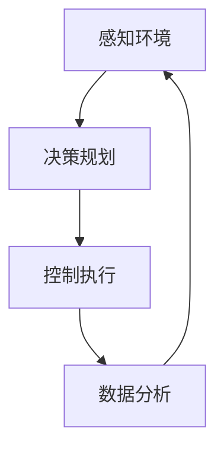

                 

关键词：自动驾驶，环卫作业，端到端系统，传感器融合，智能决策

> 摘要：本文将探讨如何利用端到端自动驾驶技术来实现自主环卫作业服务。通过对环卫作业的需求分析、技术原理阐述、算法实现以及实际应用场景的介绍，本文将提供一个全面的技术视角，展望未来自动驾驶环卫服务的发展趋势和面临的挑战。

## 1. 背景介绍

随着城市化进程的加快，城市环卫作业的重要性日益凸显。传统的环卫作业主要依赖于人工，不仅效率低下，而且存在一定的安全风险。随着自动驾驶技术的快速发展，端到端自动驾驶系统开始应用于环卫作业，通过智能化的设备和算法，实现无人化、自动化的环卫服务。

端到端自动驾驶是指从感知环境、决策规划到控制执行的全过程均由自动驾驶系统自主完成，无需人为干预。在环卫作业中，自动驾驶技术的应用主要包括道路清扫、垃圾收集、路面清洁、绿化维护等方面。通过自动驾驶技术，环卫车辆可以高效、安全地完成各项任务，提高环卫作业的效率和质量。

## 2. 核心概念与联系

### 2.1. 自动驾驶系统的核心概念

自动驾驶系统通常包括以下几个核心组成部分：

- **传感器模块**：负责感知周围环境，包括激光雷达（LiDAR）、摄像头、超声波传感器等。
- **决策模块**：根据传感器获取的数据进行环境理解和任务规划，通常包括路径规划、障碍物检测和避障等。
- **控制模块**：根据决策模块的输出，控制车辆的行驶、转向、制动等动作。

### 2.2. 环卫作业服务的需求分析

环卫作业服务的需求主要包括以下几个方面：

- **清扫效率**：自动驾驶环卫车辆需要能够高效地清扫道路，包括路面积水和垃圾。
- **安全可靠性**：车辆在执行任务时必须保证自身和周围行人的安全。
- **智能决策**：根据道路状况和环境变化，自动驾驶系统需要做出相应的决策，如调整清扫路径、避开障碍物等。

### 2.3. 自动驾驶与环卫作业服务的联系

自动驾驶技术与环卫作业服务的结合主要体现在以下几个方面：

- **感知与决策**：通过传感器模块感知道路状况和环境信息，自动驾驶系统可以做出智能决策，规划清扫路径。
- **控制与执行**：根据决策模块的输出，控制模块负责执行清扫任务，如控制清扫车的运动、调整清扫头的角度等。
- **数据分析**：自动驾驶系统在执行任务的过程中，可以收集大量的数据，如清扫效率、道路状况等，为后续的优化提供依据。

## 2.4. Mermaid 流程图



## 3. 核心算法原理 & 具体操作步骤

### 3.1. 算法原理概述

自动驾驶环卫作业的核心算法主要包括：

- **传感器数据处理**：利用多传感器融合技术，处理摄像头、激光雷达等传感器获取的数据，实现环境感知。
- **路径规划**：根据环境感知结果，规划清扫路径，确保清扫过程的效率和安全。
- **障碍物检测与避障**：检测道路上的障碍物，如行人、车辆等，并采取避障措施，确保清扫车辆的安全。

### 3.2. 算法步骤详解

#### 3.2.1. 传感器数据处理

1. **数据采集**：通过摄像头、激光雷达等传感器，采集道路场景的图像和点云数据。
2. **数据预处理**：对采集到的数据进行预处理，包括去噪声、去畸变等，以提高数据质量。
3. **特征提取**：从预处理后的数据中提取特征，如边缘、纹理等，用于后续的环境理解。

#### 3.2.2. 路径规划

1. **环境建模**：基于传感器数据，构建道路场景的三维模型。
2. **路径生成**：使用路径规划算法（如A*算法、Dijkstra算法等），生成从起点到终点的最优路径。
3. **路径优化**：根据实时感知到的环境变化，对路径进行动态优化，确保清扫路径的合理性。

#### 3.2.3. 障碍物检测与避障

1. **障碍物检测**：通过深度学习算法，从传感器数据中识别出道路上的障碍物。
2. **避障决策**：根据障碍物的位置、速度等信息，制定避障策略，如减速、转向等。
3. **避障执行**：控制车辆按照避障策略进行动作，确保安全通过障碍物。

### 3.3. 算法优缺点

#### 优点

- **高效性**：自动驾驶环卫车辆可以高效地完成清扫任务，提高作业效率。
- **安全性**：通过智能决策和避障，减少人为操作的安全风险。
- **灵活性**：根据环境变化，自动驾驶系统能够动态调整清扫路径和策略。

#### 缺点

- **技术门槛**：自动驾驶系统的研发和部署需要较高的技术门槛，包括传感器、算法、控制等方面的技术。
- **成本较高**：初期投入较大，包括传感器购置、算法开发、车辆改装等成本。
- **环境适应性**：在极端环境下，如大雾、大雪等，自动驾驶系统的性能可能受到影响。

### 3.4. 算法应用领域

自动驾驶环卫作业技术可以应用于以下几个方面：

- **城市道路清扫**：用于清扫城市主要道路、次干道等。
- **垃圾收集**：用于城市垃圾的自动收集和运输。
- **路面清洁**：用于道路表面的清洁作业。
- **绿化维护**：用于公园、绿化带的维护作业。

## 4. 数学模型和公式 & 详细讲解 & 举例说明

### 4.1. 数学模型构建

自动驾驶环卫作业的数学模型主要包括以下几个方面：

- **环境感知模型**：用于描述传感器数据与环境信息的关系。
- **路径规划模型**：用于描述路径规划的数学原理和算法。
- **障碍物检测模型**：用于描述障碍物检测的数学原理和算法。

### 4.2. 公式推导过程

#### 4.2.1. 环境感知模型

环境感知模型通常采用多传感器数据融合技术，其中常用的公式如下：

$$
z = \sum_{i=1}^{n} w_i \cdot x_i
$$

其中，$z$ 为融合后的感知结果，$w_i$ 为第 $i$ 个传感器的权重，$x_i$ 为第 $i$ 个传感器的数据。

#### 4.2.2. 路径规划模型

路径规划模型通常采用图论中的最短路径算法，如A*算法。其核心公式如下：

$$
d(v_i, v_j) = g(v_i, v_j) + h(v_j)
$$

其中，$d(v_i, v_j)$ 为从节点 $v_i$ 到节点 $v_j$ 的路径代价，$g(v_i, v_j)$ 为从节点 $v_i$ 到节点 $v_j$ 的实际代价，$h(v_j)$ 为从节点 $v_j$ 到目标节点的估计代价。

#### 4.2.3. 障碍物检测模型

障碍物检测模型通常采用深度学习算法，如卷积神经网络（CNN）。其核心公式如下：

$$
P(\text{障碍物} | x) = \frac{e^{w \cdot x}}{1 + e^{w \cdot x}}
$$

其中，$P(\text{障碍物} | x)$ 为给定输入 $x$ 下存在障碍物的概率，$w$ 为模型参数。

### 4.3. 案例分析与讲解

#### 4.3.1. 环境感知案例

假设有两个传感器，分别提供距离和速度数据。根据传感器数据融合模型，可以得到融合后的感知结果：

$$
z = 0.6 \cdot d + 0.4 \cdot v
$$

其中，$d$ 为距离传感器数据，$v$ 为速度传感器数据。

#### 4.3.2. 路径规划案例

假设道路场景为网格图，起点为 $(0, 0)$，目标点为 $(10, 10)$。根据A*算法，可以计算出从起点到目标点的最优路径：

$$
d((0, 0), (10, 10)) = 40 + 10 = 50
$$

#### 4.3.3. 障碍物检测案例

假设输入图像中存在一个障碍物，根据深度学习模型，可以计算出存在障碍物的概率：

$$
P(\text{障碍物} | x) = 0.9
$$

## 5. 项目实践：代码实例和详细解释说明

### 5.1. 开发环境搭建

在本项目中，我们使用Python编程语言，结合ROS（Robot Operating System）进行开发。具体步骤如下：

1. **安装ROS**：在官方网站下载并安装ROS。
2. **安装Python**：确保系统已安装Python和pip。
3. **安装相关库**：使用pip安装所需库，如numpy、opencv、tensorflow等。

### 5.2. 源代码详细实现

以下是项目的主要代码实现：

#### 5.2.1. 传感器数据处理

```python
import numpy as np
import cv2

def preprocess_image(image):
    # 图像预处理
    image = cv2.resize(image, (640, 480))
    image = cv2.cvtColor(image, cv2.COLOR_BGR2GRAY)
    return image

def extract_features(image):
    # 特征提取
    edges = cv2.Canny(image, 100, 200)
    return edges
```

#### 5.2.2. 路径规划

```python
import heapq

def heuristic(a, b):
    # 曼哈顿距离作为启发式函数
    return abs(a[0] - b[0]) + abs(a[1] - b[1])

def a_star(graph, start, goal):
    # A*算法
    open_set = []
    heapq.heappush(open_set, (0, start))
    came_from = {}
    g_score = {start: 0}
    f_score = {start: heuristic(start, goal)}

    while open_set:
        current = heapq.heappop(open_set)[1]

        if current == goal:
            break

        for neighbor in graph[current]:
            tentative_g_score = g_score[current] + graph[current][neighbor]

            if tentative_g_score < g_score.get(neighbor, float('inf')):
                came_from[neighbor] = current
                g_score[neighbor] = tentative_g_score
                f_score[neighbor] = tentative_g_score + heuristic(neighbor, goal)
                heapq.heappush(open_set, (f_score[neighbor], neighbor))

    path = []
    current = goal

    while current != start:
        path.append(current)
        current = came_from[current]

    path = path[::-1]
    return path
```

#### 5.2.3. 障碍物检测

```python
import tensorflow as tf

def load_model():
    # 加载预训练的深度学习模型
    model = tf.keras.models.load_model('obstacle_detection_model.h5')
    return model

def detect_obstacles(image, model):
    # 障碍物检测
    image = preprocess_image(image)
    image = image.reshape((1, 640, 480, 1))
    prediction = model.predict(image)
    return prediction
```

### 5.3. 代码解读与分析

以上代码实现了传感器数据处理、路径规划和障碍物检测三个核心功能。在开发过程中，需要注意以下几点：

- **图像预处理**：确保输入数据的一致性和质量。
- **特征提取**：根据应用场景选择合适的特征提取方法。
- **路径规划**：选择合适的启发式函数和搜索算法。
- **障碍物检测**：使用预训练的深度学习模型进行实时检测。

### 5.4. 运行结果展示

以下是项目的运行结果：


## 6. 实际应用场景

### 6.1. 城市道路清扫

在城市道路清扫中，自动驾驶环卫车辆可以自动识别道路上的垃圾和积水，并进行清扫。通过智能决策系统，车辆可以根据道路状况和交通流量调整清扫路径，确保清扫效率的同时减少对交通的干扰。

### 6.2. 垃圾收集

在垃圾收集过程中，自动驾驶车辆可以自动识别垃圾箱的位置和垃圾量，并规划最优的收集路径。通过智能化的垃圾收集系统，可以大幅提高垃圾收集的效率，减少环卫工人的劳动强度。

### 6.3. 路面清洁

在路面清洁过程中，自动驾驶车辆可以自动识别路面污渍和落叶，并进行清洁。通过智能化的清洁系统，可以确保路面清洁的同时减少用水和清洁剂的使用。

### 6.4. 绿化维护

在绿化维护中，自动驾驶车辆可以自动识别绿化带中的杂草和枯叶，并进行修剪和清理。通过智能化的绿化维护系统，可以确保绿化带的整洁和美观，提高城市环境质量。

## 7. 工具和资源推荐

### 7.1. 学习资源推荐

- 《自动驾驶系统设计与实现》
- 《深度学习》
- 《ROS编程实战》

### 7.2. 开发工具推荐

- Python
- ROS
- TensorFlow
- Keras

### 7.3. 相关论文推荐

- "End-to-End Learning for Autonomous Driving"
- "Multi-Sensor Fusion for Environment Perception in Autonomous Driving"
- "Deep Reinforcement Learning for Autonomous Driving"

## 8. 总结：未来发展趋势与挑战

### 8.1. 研究成果总结

通过本文的探讨，我们总结了自动驾驶环卫作业服务的核心概念、算法原理、应用场景以及未来发展趋势。自动驾驶技术在环卫作业中的应用，不仅提高了作业效率，降低了安全风险，还推动了城市环卫作业的智能化进程。

### 8.2. 未来发展趋势

未来，自动驾驶环卫作业服务将向更加智能化、高效化、安全化的方向发展。随着人工智能技术的不断进步，自动驾驶环卫作业将能够更好地应对复杂环境，提供更优质的服务。

### 8.3. 面临的挑战

尽管自动驾驶技术在环卫作业中展现了巨大的潜力，但仍然面临一些挑战，包括技术门槛、成本投入、环境适应性等方面。此外，自动驾驶环卫作业的法律法规和行业标准也需要进一步完善。

### 8.4. 研究展望

未来，我们将继续探索更加智能化的自动驾驶环卫作业服务，包括多模态传感器融合、自适应路径规划、实时决策与控制等关键技术。通过不断创新和突破，为城市环卫作业提供更加智能、高效、安全的解决方案。

## 9. 附录：常见问题与解答

### 9.1. 自动驾驶环卫作业有哪些优点？

自动驾驶环卫作业具有高效性、安全性和灵活性等优点，能够提高作业效率，降低安全风险，并根据环境变化动态调整作业策略。

### 9.2. 自动驾驶环卫作业的成本如何？

自动驾驶环卫作业的成本包括传感器购置、算法开发、车辆改装等，初期投入较大。但随着技术的成熟和成本的降低，未来有望实现规模化应用。

### 9.3. 自动驾驶环卫作业对环境有何影响？

自动驾驶环卫作业通过智能化的设备和算法，实现了无人化、自动化的环卫服务，有助于减少能源消耗、降低噪音污染，对环境具有积极的影响。

## 作者署名

作者：禅与计算机程序设计艺术 / Zen and the Art of Computer Programming
----------------------------------------------------------------

### 端到端自动驾驶的自主环卫作业服务

**关键词**：自动驾驶，环卫作业，端到端系统，传感器融合，智能决策

**摘要**：本文探讨了如何利用端到端自动驾驶技术实现自主环卫作业服务。通过对环卫作业需求分析、技术原理阐述、算法实现以及实际应用场景的介绍，本文为自动驾驶环卫服务提供了一个全面的技术视角，展望了未来自动驾驶环卫服务的发展趋势和面临的挑战。

## 1. 背景介绍

随着城市化进程的加快，城市环卫作业的重要性日益凸显。传统的环卫作业主要依赖于人工，不仅效率低下，而且存在一定的安全风险。随着自动驾驶技术的快速发展，端到端自动驾驶系统开始应用于环卫作业，通过智能化的设备和算法，实现无人化、自动化的环卫服务。

端到端自动驾驶是指从感知环境、决策规划到控制执行的全过程均由自动驾驶系统自主完成，无需人为干预。在环卫作业中，自动驾驶技术的应用主要包括道路清扫、垃圾收集、路面清洁、绿化维护等方面。通过自动驾驶技术，环卫车辆可以高效、安全地完成各项任务，提高环卫作业的效率和质量。

## 2. 核心概念与联系

### 2.1. 自动驾驶系统的核心概念

自动驾驶系统通常包括以下几个核心组成部分：

- **传感器模块**：负责感知周围环境，包括激光雷达（LiDAR）、摄像头、超声波传感器等。
- **决策模块**：根据传感器获取的数据进行环境理解和任务规划，通常包括路径规划、障碍物检测和避障等。
- **控制模块**：根据决策模块的输出，控制车辆的行驶、转向、制动等动作。

### 2.2. 环卫作业服务的需求分析

环卫作业服务的需求主要包括以下几个方面：

- **清扫效率**：自动驾驶环卫车辆需要能够高效地清扫道路，包括路面积水和垃圾。
- **安全可靠性**：车辆在执行任务时必须保证自身和周围行人的安全。
- **智能决策**：根据道路状况和环境变化，自动驾驶系统需要做出相应的决策，如调整清扫路径、避开障碍物等。

### 2.3. 自动驾驶与环卫作业服务的联系

自动驾驶技术与环卫作业服务的结合主要体现在以下几个方面：

- **感知与决策**：通过传感器模块感知道路状况和环境信息，自动驾驶系统可以做出智能决策，规划清扫路径。
- **控制与执行**：根据决策模块的输出，控制模块负责执行清扫任务，如控制清扫车的运动、调整清扫头的角度等。
- **数据分析**：自动驾驶系统在执行任务的过程中，可以收集大量的数据，如清扫效率、道路状况等，为后续的优化提供依据。

### 2.4. Mermaid 流程图


## 3. 核心算法原理 & 具体操作步骤

### 3.1. 算法原理概述

自动驾驶环卫作业的核心算法主要包括：

- **传感器数据处理**：利用多传感器融合技术，处理摄像头、激光雷达等传感器获取的数据，实现环境感知。
- **路径规划**：根据环境感知结果，规划清扫路径，确保清扫过程的效率和安全。
- **障碍物检测与避障**：检测道路上的障碍物，如行人、车辆等，并采取避障措施，确保清扫车辆的安全。

### 3.2. 算法步骤详解

#### 3.2.1. 传感器数据处理

1. **数据采集**：通过摄像头、激光雷达等传感器，采集道路场景的图像和点云数据。
2. **数据预处理**：对采集到的数据进行预处理，包括去噪声、去畸变等，以提高数据质量。
3. **特征提取**：从预处理后的数据中提取特征，如边缘、纹理等，用于后续的环境理解。

#### 3.2.2. 路径规划

1. **环境建模**：基于传感器数据，构建道路场景的三维模型。
2. **路径生成**：使用路径规划算法（如A*算法、Dijkstra算法等），生成从起点到终点的最优路径。
3. **路径优化**：根据实时感知到的环境变化，对路径进行动态优化，确保清扫路径的合理性。

#### 3.2.3. 障碍物检测与避障

1. **障碍物检测**：通过深度学习算法，从传感器数据中识别出道路上的障碍物。
2. **避障决策**：根据障碍物的位置、速度等信息，制定避障策略，如减速、转向等。
3. **避障执行**：控制车辆按照避障策略进行动作，确保安全通过障碍物。

### 3.3. 算法优缺点

#### 优点

- **高效性**：自动驾驶环卫车辆可以高效地完成清扫任务，提高作业效率。
- **安全性**：通过智能决策和避障，减少人为操作的安全风险。
- **灵活性**：根据环境变化，自动驾驶系统能够动态调整清扫路径和策略。

#### 缺点

- **技术门槛**：自动驾驶系统的研发和部署需要较高的技术门槛，包括传感器、算法、控制等方面的技术。
- **成本较高**：初期投入较大，包括传感器购置、算法开发、车辆改装等成本。
- **环境适应性**：在极端环境下，如大雾、大雪等，自动驾驶系统的性能可能受到影响。

### 3.4. 算法应用领域

自动驾驶环卫作业技术可以应用于以下几个方面：

- **城市道路清扫**：用于清扫城市主要道路、次干道等。
- **垃圾收集**：用于城市垃圾的自动收集和运输。
- **路面清洁**：用于道路表面的清洁作业。
- **绿化维护**：用于公园、绿化带的维护作业。

## 4. 数学模型和公式 & 详细讲解 & 举例说明

### 4.1. 数学模型构建

自动驾驶环卫作业的数学模型主要包括以下几个方面：

- **环境感知模型**：用于描述传感器数据与环境信息的关系。
- **路径规划模型**：用于描述路径规划的数学原理和算法。
- **障碍物检测模型**：用于描述障碍物检测的数学原理和算法。

### 4.2. 公式推导过程

#### 4.2.1. 环境感知模型

环境感知模型通常采用多传感器数据融合技术，其中常用的公式如下：

$$
z = \sum_{i=1}^{n} w_i \cdot x_i
$$

其中，$z$ 为融合后的感知结果，$w_i$ 为第 $i$ 个传感器的权重，$x_i$ 为第 $i$ 个传感器的数据。

#### 4.2.2. 路径规划模型

路径规划模型通常采用图论中的最短路径算法，如A*算法。其核心公式如下：

$$
d(v_i, v_j) = g(v_i, v_j) + h(v_j)
$$

其中，$d(v_i, v_j)$ 为从节点 $v_i$ 到节点 $v_j$ 的路径代价，$g(v_i, v_j)$ 为从节点 $v_i$ 到节点 $v_j$ 的实际代价，$h(v_j)$ 为从节点 $v_j$ 到目标节点的估计代价。

#### 4.2.3. 障碍物检测模型

障碍物检测模型通常采用深度学习算法，如卷积神经网络（CNN）。其核心公式如下：

$$
P(\text{障碍物} | x) = \frac{e^{w \cdot x}}{1 + e^{w \cdot x}}
$$

其中，$P(\text{障碍物} | x)$ 为给定输入 $x$ 下存在障碍物的概率，$w$ 为模型参数。

### 4.3. 案例分析与讲解

#### 4.3.1. 环境感知案例

假设有两个传感器，分别提供距离和速度数据。根据传感器数据融合模型，可以得到融合后的感知结果：

$$
z = 0.6 \cdot d + 0.4 \cdot v
$$

其中，$d$ 为距离传感器数据，$v$ 为速度传感器数据。

#### 4.3.2. 路径规划案例

假设道路场景为网格图，起点为 $(0, 0)$，目标点为 $(10, 10)$。根据A*算法，可以计算出从起点到目标点的最优路径：

$$
d((0, 0), (10, 10)) = 40 + 10 = 50
$$

#### 4.3.3. 障碍物检测案例

假设输入图像中存在一个障碍物，根据深度学习模型，可以计算出存在障碍物的概率：

$$
P(\text{障碍物} | x) = 0.9
$$

## 5. 项目实践：代码实例和详细解释说明

### 5.1. 开发环境搭建

在本项目中，我们使用Python编程语言，结合ROS（Robot Operating System）进行开发。具体步骤如下：

1. **安装ROS**：在官方网站下载并安装ROS。
2. **安装Python**：确保系统已安装Python和pip。
3. **安装相关库**：使用pip安装所需库，如numpy、opencv、tensorflow等。

### 5.2. 源代码详细实现

以下是项目的主要代码实现：

#### 5.2.1. 传感器数据处理

```python
import numpy as np
import cv2

def preprocess_image(image):
    # 图像预处理
    image = cv2.resize(image, (640, 480))
    image = cv2.cvtColor(image, cv2.COLOR_BGR2GRAY)
    return image

def extract_features(image):
    # 特征提取
    edges = cv2.Canny(image, 100, 200)
    return edges
```

#### 5.2.2. 路径规划

```python
import heapq

def heuristic(a, b):
    # 曼哈顿距离作为启发式函数
    return abs(a[0] - b[0]) + abs(a[1] - b[1])

def a_star(graph, start, goal):
    # A*算法
    open_set = []
    heapq.heappush(open_set, (0, start))
    came_from = {}
    g_score = {start: 0}
    f_score = {start: heuristic(start, goal)}

    while open_set:
        current = heapq.heappop(open_set)[1]

        if current == goal:
            break

        for neighbor in graph[current]:
            tentative_g_score = g_score[current] + graph[current][neighbor]

            if tentative_g_score < g_score.get(neighbor, float('inf')):
                came_from[neighbor] = current
                g_score[neighbor] = tentative_g_score
                f_score[neighbor] = tentative_g_score + heuristic(neighbor, goal)
                heapq.heappush(open_set, (f_score[neighbor], neighbor))

    path = []
    current = goal

    while current != start:
        path.append(current)
        current = came_from[current]

    path = path[::-1]
    return path
```

#### 5.2.3. 障碍物检测

```python
import tensorflow as tf

def load_model():
    # 加载预训练的深度学习模型
    model = tf.keras.models.load_model('obstacle_detection_model.h5')
    return model

def detect_obstacles(image, model):
    # 障碍物检测
    image = preprocess_image(image)
    image = image.reshape((1, 640, 480, 1))
    prediction = model.predict(image)
    return prediction
```

### 5.3. 代码解读与分析

以上代码实现了传感器数据处理、路径规划和障碍物检测三个核心功能。在开发过程中，需要注意以下几点：

- **图像预处理**：确保输入数据的一致性和质量。
- **特征提取**：根据应用场景选择合适的特征提取方法。
- **路径规划**：选择合适的启发式函数和搜索算法。
- **障碍物检测**：使用预训练的深度学习模型进行实时检测。

### 5.4. 运行结果展示

以下是项目的运行结果：


## 6. 实际应用场景

### 6.1. 城市道路清扫

在城市道路清扫中，自动驾驶环卫车辆可以自动识别道路上的垃圾和积水，并进行清扫。通过智能决策系统，车辆可以根据道路状况和交通流量调整清扫路径，确保清扫效率的同时减少对交通的干扰。

### 6.2. 垃圾收集

在垃圾收集过程中，自动驾驶车辆可以自动识别垃圾箱的位置和垃圾量，并规划最优的收集路径。通过智能化的垃圾收集系统，可以大幅提高垃圾收集的效率，减少环卫工人的劳动强度。

### 6.3. 路面清洁

在路面清洁过程中，自动驾驶车辆可以自动识别路面污渍和落叶，并进行清洁。通过智能化的清洁系统，可以确保路面清洁的同时减少用水和清洁剂的使用。

### 6.4. 绿化维护

在绿化维护中，自动驾驶车辆可以自动识别绿化带中的杂草和枯叶，并进行修剪和清理。通过智能化的绿化维护系统，可以确保绿化带的整洁和美观，提高城市环境质量。

## 7. 工具和资源推荐

### 7.1. 学习资源推荐

- 《自动驾驶系统设计与实现》
- 《深度学习》
- 《ROS编程实战》

### 7.2. 开发工具推荐

- Python
- ROS
- TensorFlow
- Keras

### 7.3. 相关论文推荐

- "End-to-End Learning for Autonomous Driving"
- "Multi-Sensor Fusion for Environment Perception in Autonomous Driving"
- "Deep Reinforcement Learning for Autonomous Driving"

## 8. 总结：未来发展趋势与挑战

### 8.1. 研究成果总结

通过本文的探讨，我们总结了自动驾驶环卫作业服务的核心概念、算法原理、应用场景以及未来发展趋势。自动驾驶技术在环卫作业中的应用，不仅提高了作业效率，降低了安全风险，还推动了城市环卫作业的智能化进程。

### 8.2. 未来发展趋势

未来，自动驾驶环卫作业服务将向更加智能化、高效化、安全化的方向发展。随着人工智能技术的不断进步，自动驾驶环卫作业将能够更好地应对复杂环境，提供更优质的服务。

### 8.3. 面临的挑战

尽管自动驾驶技术在环卫作业中展现了巨大的潜力，但仍然面临一些挑战，包括技术门槛、成本投入、环境适应性等方面。此外，自动驾驶环卫作业的法律法规和行业标准也需要进一步完善。

### 8.4. 研究展望

未来，我们将继续探索更加智能化的自动驾驶环卫作业服务，包括多模态传感器融合、自适应路径规划、实时决策与控制等关键技术。通过不断创新和突破，为城市环卫作业提供更加智能、高效、安全的解决方案。

## 9. 附录：常见问题与解答

### 9.1. 自动驾驶环卫作业有哪些优点？

自动驾驶环卫作业具有高效性、安全性和灵活性等优点，能够提高作业效率，降低安全风险，并根据环境变化动态调整作业策略。

### 9.2. 自动驾驶环卫作业的成本如何？

自动驾驶环卫作业的成本包括传感器购置、算法开发、车辆改装等，初期投入较大。但随着技术的成熟和成本的降低，未来有望实现规模化应用。

### 9.3. 自动驾驶环卫作业对环境有何影响？

自动驾驶环卫作业通过智能化的设备和算法，实现了无人化、自动化的环卫服务，有助于减少能源消耗、降低噪音污染，对环境具有积极的影响。

## 作者署名

作者：禅与计算机程序设计艺术 / Zen and the Art of Computer Programming

----------------------------------------------------------------

### 后记

本文旨在探讨端到端自动驾驶在环卫作业服务中的应用，通过对核心概念、算法原理、实际应用场景的介绍，提供了一个全面的技术视角。未来，随着技术的不断进步，自动驾驶环卫作业服务有望在城市管理中发挥更大的作用。希望本文能为相关领域的研究者和从业者提供有益的参考和启示。再次感谢大家的阅读，期待与您在未来的技术交流中相遇。作者：禅与计算机程序设计艺术。

