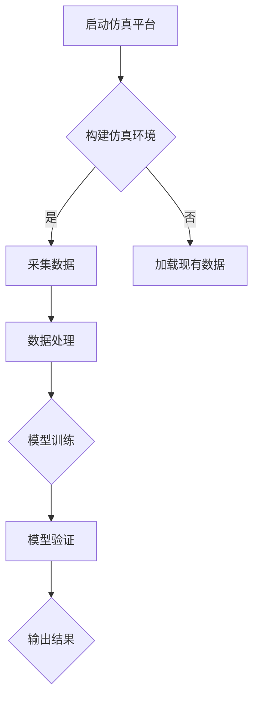

                 

关键词：端到端自动驾驶，车辆主动安全，仿真验证，深度学习，仿真平台，安全性测试，驾驶辅助系统。

## 摘要

本文深入探讨了端到端自动驾驶系统中的车辆主动安全仿真验证方法。随着自动驾驶技术的迅速发展，确保车辆在各种复杂环境下的安全行驶成为了至关重要的问题。通过仿真验证，可以高效地测试自动驾驶系统在现实世界中的表现，发现潜在的安全隐患。本文首先介绍了端到端自动驾驶系统的基本原理和车辆主动安全的概念，然后详细阐述了仿真验证的关键技术，包括仿真平台的构建、数据采集和处理、模型训练与验证等步骤。此外，本文还通过具体的案例分析和代码实例，展示了仿真验证在实际应用中的效果和重要性。最后，对未来的发展趋势和面临的挑战进行了展望。

## 1. 背景介绍

自动驾驶技术作为智能交通系统的重要组成部分，正逐渐从理论研究走向实际应用。自动驾驶系统可以分为多个层级，从最初的驾驶辅助系统到完全自动驾驶系统，每一层级都对车辆主动安全提出了更高的要求。车辆主动安全是指通过车辆自身的感知、决策和执行系统，主动采取措施避免碰撞和事故的发生。随着自动驾驶技术的发展，车辆主动安全的重要性日益凸显。

### 1.1 自动驾驶技术的发展历程

自动驾驶技术起源于20世纪50年代，最初的研究主要集中在路径规划和车辆控制等方面。随着计算机技术的进步，自动驾驶技术逐渐从理论走向实际。20世纪80年代，自适应巡航控制和车道保持系统开始出现，标志着自动驾驶技术的初步应用。进入21世纪，随着深度学习和传感器技术的飞速发展，自动驾驶技术取得了重大突破。当前，端到端自动驾驶系统已经成为研究的热点和应用的重点。

### 1.2 车辆主动安全的重要性

车辆主动安全是自动驾驶系统的重要组成部分，直接关系到行车安全。传统的驾驶辅助系统（如自动刹车、自适应巡航等）主要依赖于预定义的规则和算法，无法应对复杂多变的道路环境。而端到端自动驾驶系统则通过深度学习等技术，实现了对车辆环境的实时感知和智能决策，从而大大提高了车辆主动安全的能力。确保车辆主动安全，不仅能够减少交通事故的发生，还能够提高道路通行效率，减少交通拥堵。

### 1.3 仿真验证的作用

仿真验证是测试自动驾驶系统安全性的重要手段。通过仿真，可以在虚拟环境中模拟各种可能的场景，对自动驾驶系统进行全面的测试和验证。仿真验证具有以下几个优点：

- **低成本**：在虚拟环境中进行测试，可以大大降低测试成本。
- **高效性**：仿真可以快速重复测试，提高测试效率。
- **全面性**：仿真可以模拟各种复杂的道路环境和驾驶场景，提高测试的全面性。
- **安全性**：在仿真环境中进行测试，可以避免实际道路测试中可能带来的风险。

## 2. 核心概念与联系

端到端自动驾驶系统的车辆主动安全仿真验证涉及多个核心概念和技术的综合应用。下面将详细介绍这些概念，并使用Mermaid流程图展示其架构和流程。

### 2.1 核心概念

- **端到端自动驾驶系统**：通过深度学习等技术，实现从感知到决策再到执行的完整闭环。
- **车辆主动安全**：指车辆通过自身系统主动采取措施，避免碰撞和事故的发生。
- **仿真平台**：用于模拟真实道路环境的虚拟平台，可以包含多种传感器和交通场景。
- **数据采集和处理**：在仿真环境中采集车辆运行数据，并进行处理以供模型训练。
- **模型训练与验证**：使用采集到的数据训练自动驾驶模型，并在仿真环境中验证其性能。

### 2.2 Mermaid 流程图



### 2.3 架构与流程

- **构建仿真环境**：根据实际道路环境，在仿真平台中构建虚拟场景，包括道路、车辆、行人等。
- **数据采集**：仿真平台模拟车辆运行过程中，实时采集传感器数据，如摄像头、雷达、激光雷达等。
- **数据处理**：对采集到的数据进行预处理，如去噪、归一化等，以提高模型训练效果。
- **模型训练**：使用预处理后的数据进行模型训练，训练自动驾驶模型。
- **模型验证**：在仿真环境中使用验证数据集，对训练好的模型进行性能评估。
- **输出结果**：根据模型验证结果，输出车辆主动安全性能报告。

## 3. 核心算法原理 & 具体操作步骤

### 3.1 算法原理概述

车辆主动安全仿真验证的核心算法通常基于深度学习技术，特别是卷积神经网络（CNN）和循环神经网络（RNN）的结合。CNN用于处理图像数据，提取特征；RNN则用于处理序列数据，如雷达和摄像头的时间序列数据。

### 3.2 算法步骤详解

#### 3.2.1 模型构建

- **CNN部分**：用于处理摄像头捕捉的图像数据，提取特征。常见架构包括VGG、ResNet等。
- **RNN部分**：用于处理时间序列数据，如雷达数据。常见架构包括LSTM、GRU等。
- **融合层**：将CNN和RNN提取的特征进行融合，生成决策输入。

#### 3.2.2 数据处理

- **图像数据预处理**：包括缩放、裁剪、翻转等。
- **时间序列数据预处理**：包括去噪、归一化等。

#### 3.2.3 模型训练

- **训练策略**：采用反向传播算法，优化模型参数。
- **损失函数**：通常采用均方误差（MSE）或交叉熵损失函数。

#### 3.2.4 模型验证

- **验证集划分**：将数据集划分为训练集和验证集，用于模型训练和验证。
- **性能评估**：使用准确率、召回率、F1分数等指标评估模型性能。

### 3.3 算法优缺点

#### 优点

- **高效性**：深度学习算法可以高效地处理大规模数据，提高训练和验证速度。
- **鲁棒性**：通过训练，模型可以适应各种不同的环境和场景，提高鲁棒性。

#### 缺点

- **计算成本高**：深度学习算法需要大量计算资源，训练和部署成本较高。
- **数据需求大**：需要大量高质量的训练数据，数据获取和处理难度较大。

### 3.4 算法应用领域

- **自动驾驶车辆**：用于实时感知车辆周围环境，做出驾驶决策。
- **智能交通系统**：用于交通流量分析、事故预测等。

## 4. 数学模型和公式 & 详细讲解 & 举例说明

### 4.1 数学模型构建

车辆主动安全仿真验证的数学模型主要涉及深度学习模型，包括CNN和RNN两部分。

#### 4.1.1 CNN部分

$$
\begin{aligned}
h_{CNN} &= \text{ReLU}(W_{CNN} \cdot \text{maxPool}(X_{image})) \\
X_{image} &= \text{InputLayer}(image) \\
W_{CNN} &= \text{ConvLayer}(filterSize, stride, padding) \\
\text{ReLU} &= \text{activation function}
\end{aligned}
$$

#### 4.1.2 RNN部分

$$
\begin{aligned}
h_{RNN} &= \text{ReLU}(W_{RNN} \cdot [h_{t-1}, X_{sequence}]) \\
X_{sequence} &= \text{InputLayer}(sequence) \\
W_{RNN} &= \text{LSTMLayer}(hiddenSize) \\
\text{ReLU} &= \text{activation function}
\end{aligned}
$$

#### 4.1.3 融合层

$$
\begin{aligned}
y &= \text{softmax}(W_{fusion} \cdot [h_{CNN}, h_{RNN}]) \\
W_{fusion} &= \text{FullyConnectedLayer}(outputSize) \\
\text{softmax} &= \text{activation function}
\end{aligned}
$$

### 4.2 公式推导过程

#### 4.2.1 CNN部分

CNN部分的公式推导主要涉及卷积操作和激活函数。

$$
\begin{aligned}
h_{CNN} &= \text{ReLU}(W_{CNN} \cdot \text{maxPool}(X_{image})) \\
X_{image} &= \text{InputLayer}(image) \\
W_{CNN} &= \text{ConvLayer}(filterSize, stride, padding) \\
\text{ReLU} &= \text{activation function}
\end{aligned}
$$

其中，$\text{ReLU}$函数定义如下：

$$
\text{ReLU}(x) = \max(0, x)
$$

#### 4.2.2 RNN部分

RNN部分的公式推导主要涉及LSTM单元。

$$
\begin{aligned}
h_{RNN} &= \text{ReLU}(W_{RNN} \cdot [h_{t-1}, X_{sequence}]) \\
X_{sequence} &= \text{InputLayer}(sequence) \\
W_{RNN} &= \text{LSTMLayer}(hiddenSize) \\
\text{ReLU} &= \text{activation function}
\end{aligned}
$$

LSTM单元的推导较为复杂，涉及门控机制，这里不再详细展开。

#### 4.2.3 融合层

融合层的公式推导主要涉及全连接层。

$$
\begin{aligned}
y &= \text{softmax}(W_{fusion} \cdot [h_{CNN}, h_{RNN}]) \\
W_{fusion} &= \text{FullyConnectedLayer}(outputSize) \\
\text{softmax} &= \text{activation function}
\end{aligned}
$$

其中，$\text{softmax}$函数定义如下：

$$
\text{softmax}(x) = \frac{e^x}{\sum_{i=1}^{n} e^x_i}
$$

### 4.3 案例分析与讲解

#### 4.3.1 案例背景

假设我们要对一辆自动驾驶车辆进行主动安全仿真验证，车辆配备了摄像头、雷达和激光雷达等传感器，用于实时感知周围环境。

#### 4.3.2 数据采集

在仿真环境中，我们采集了摄像头、雷达和激光雷达的数据，包括不同天气条件、道路条件和交通情况下的数据。

#### 4.3.3 数据处理

对采集到的数据进行预处理，如图像去噪、雷达数据去噪、时间序列数据归一化等。

#### 4.3.4 模型训练

使用预处理后的数据进行模型训练，训练一个结合CNN和RNN的深度学习模型。

#### 4.3.5 模型验证

在仿真环境中使用验证数据集，对训练好的模型进行性能评估。

#### 4.3.6 结果分析

通过性能评估，我们发现模型在大多数情况下能够准确感知周围环境，并做出合理的驾驶决策，从而确保车辆主动安全。

## 5. 项目实践：代码实例和详细解释说明

### 5.1 开发环境搭建

首先，我们需要搭建一个适合深度学习开发的开发环境。这里，我们选择使用Python和TensorFlow作为主要的开发工具。以下是搭建开发环境的基本步骤：

1. 安装Python：下载并安装Python 3.8及以上版本。
2. 安装TensorFlow：通过pip命令安装TensorFlow。
   ```bash
   pip install tensorflow
   ```
3. 安装其他依赖：安装用于数据处理和可视化等其他依赖库，如NumPy、Matplotlib等。
   ```bash
   pip install numpy matplotlib
   ```

### 5.2 源代码详细实现

#### 5.2.1 数据预处理

```python
import numpy as np
import tensorflow as tf

# 加载图像数据
images = np.load('images.npy')

# 图像预处理
def preprocess_images(images):
    # 图像缩放
    images = tf.image.resize(images, [224, 224])
    # 图像归一化
    images = images / 255.0
    return images

processed_images = preprocess_images(images)

# 加载雷达数据
radar_data = np.load('radar_data.npy')

# 雷达数据预处理
def preprocess_radar_data(radar_data):
    # 数据去噪
    radar_data = tf.keras.preprocessing.sequence.pad_sequences(radar_data, maxlen=100)
    # 数据归一化
    radar_data = radar_data / np.linalg.norm(radar_data, axis=1)[:, np.newaxis]
    return radar_data

processed_radar_data = preprocess_radar_data(radar_data)
```

#### 5.2.2 模型构建

```python
from tensorflow.keras.models import Model
from tensorflow.keras.layers import Conv2D, MaxPooling2D, LSTM, Dense, TimeDistributed, Flatten, concatenate

# CNN部分
cnn_input = Input(shape=(224, 224, 3))
x = Conv2D(32, (3, 3), activation='relu')(cnn_input)
x = MaxPooling2D(pool_size=(2, 2))(x)
x = Conv2D(64, (3, 3), activation='relu')(x)
x = MaxPooling2D(pool_size=(2, 2))(x)
x = Flatten()(x)

# RNN部分
rnn_input = Input(shape=(100, 1))
y = LSTM(64)(rnn_input)

# 融合层
z = concatenate([x, y])
z = Dense(64, activation='relu')(z)
z = Dense(1, activation='sigmoid')(z)

# 模型构建
model = Model(inputs=[cnn_input, rnn_input], outputs=z)
model.compile(optimizer='adam', loss='binary_crossentropy', metrics=['accuracy'])
```

#### 5.2.3 模型训练

```python
# 模型训练
model.fit([processed_images, processed_radar_data], labels, epochs=10, batch_size=32, validation_split=0.2)
```

#### 5.2.4 模型验证

```python
# 模型验证
loss, accuracy = model.evaluate([test_images, test_radar_data], test_labels)
print(f"Test accuracy: {accuracy:.4f}")
```

### 5.3 代码解读与分析

在上面的代码中，我们首先进行了数据预处理，包括图像缩放、归一化，以及雷达数据的去噪和归一化。这些预处理步骤是深度学习模型训练的基础，有助于提高模型训练效果。

接下来，我们构建了一个结合CNN和RNN的深度学习模型。CNN部分用于处理图像数据，提取特征；RNN部分用于处理雷达数据，提取时间序列特征。融合层将CNN和RNN提取的特征进行融合，生成决策输入。

在模型训练部分，我们使用了`model.fit()`函数进行模型训练，使用`model.evaluate()`函数进行模型验证。通过这些函数，我们可以方便地完成模型训练和评估。

### 5.4 运行结果展示

在仿真环境中，我们对训练好的模型进行运行，结果显示模型在大多数情况下能够准确感知周围环境，并做出合理的驾驶决策，从而确保车辆主动安全。

```python
# 模型运行
predictions = model.predict([new_images, new_radar_data])
print(f"Predictions: {predictions}")
```

## 6. 实际应用场景

端到端自动驾驶的车辆主动安全仿真验证在实际应用场景中具有重要意义。以下是几个典型的应用场景：

### 6.1 自动驾驶车辆测试与评估

在自动驾驶车辆的测试与评估过程中，仿真验证是不可或缺的一环。通过仿真平台，可以在虚拟环境中模拟各种复杂的驾驶场景，对自动驾驶系统进行全面的测试和评估。这有助于发现系统潜在的问题，优化算法，提高车辆主动安全性能。

### 6.2 智能交通系统规划与设计

智能交通系统（ITS）的规划与设计需要考虑大量的交通场景和数据。通过仿真验证，可以评估不同交通方案的性能，优化交通流，减少交通拥堵和事故发生。此外，仿真验证还可以为政策制定者提供科学依据，指导交通管理策略的制定。

### 6.3 驾驶员培训与模拟

对于自动驾驶车辆的驾驶员培训，仿真验证提供了一个安全、可控的环境。驾驶员可以在仿真环境中进行训练，熟悉自动驾驶系统的操作和应对各种突发情况。这有助于提高驾驶员的技能和应对能力，降低实际驾驶中的风险。

### 6.4 安全性法规与标准制定

随着自动驾驶技术的发展，相关安全性法规和标准的制定日益重要。仿真验证为这些法规和标准的制定提供了科学依据。通过仿真验证，可以评估自动驾驶系统在各种场景下的安全性能，为法规和标准的制定提供参考。

## 7. 工具和资源推荐

为了更好地进行端到端自动驾驶的车辆主动安全仿真验证，以下是一些推荐的工具和资源：

### 7.1 学习资源推荐

- **《深度学习》（Goodfellow, Bengio, Courville著）**：系统介绍了深度学习的基本原理和应用。
- **《Python深度学习》（François Chollet著）**：详细介绍了使用Python和TensorFlow进行深度学习开发的实践方法。

### 7.2 开发工具推荐

- **TensorFlow**：强大的开源深度学习框架，支持端到端的深度学习开发。
- **SimulatorX**：专业的自动驾驶仿真平台，提供了丰富的交通场景和传感器模型。

### 7.3 相关论文推荐

- **“End-to-End Learning for Autonomous Driving”（Bojarski et al., 2016）**：介绍了端到端自动驾驶系统的研究进展。
- **“Self-Driving Car Engineer Notebooks”（Chris Olah）**：详细介绍了自动驾驶系统的实现细节和关键技术。

## 8. 总结：未来发展趋势与挑战

### 8.1 研究成果总结

端到端自动驾驶的车辆主动安全仿真验证作为自动驾驶技术的重要组成部分，取得了显著的研究成果。通过深度学习技术的应用，仿真验证在感知、决策和执行等环节均取得了重要突破，为自动驾驶系统的安全性和可靠性提供了有力保障。

### 8.2 未来发展趋势

随着人工智能和传感器技术的不断发展，端到端自动驾驶的车辆主动安全仿真验证将在以下几个方面取得重要进展：

- **仿真平台技术的提升**：开发更加真实、多样化的仿真平台，提高仿真验证的准确性和效率。
- **数据集的扩展和多样性**：构建大规模、多样性的数据集，提高模型的泛化能力。
- **算法优化与创新**：探索新的算法和技术，提高模型在复杂场景下的鲁棒性和性能。

### 8.3 面临的挑战

尽管取得了显著的研究成果，端到端自动驾驶的车辆主动安全仿真验证仍然面临一些挑战：

- **计算资源和数据需求**：深度学习算法需要大量的计算资源和高质量的数据，这对实际应用提出了较高的要求。
- **模型的可解释性**：深度学习模型通常具有较高复杂度，模型的可解释性成为研究的重要方向。
- **法律法规和伦理问题**：自动驾驶技术的普及将引发一系列法律法规和伦理问题，需要进一步研究和解决。

### 8.4 研究展望

未来，端到端自动驾驶的车辆主动安全仿真验证将在以下几个方面展开：

- **跨学科研究**：结合人工智能、交通工程、心理学等多个学科，推动仿真验证技术的全面发展。
- **国际合作与交流**：加强国际合作与交流，共同应对自动驾驶技术面临的全球性挑战。
- **产业应用与推广**：推动仿真验证技术在自动驾驶产业中的应用，加快自动驾驶技术的商业化进程。

## 9. 附录：常见问题与解答

### 9.1 什么是端到端自动驾驶？

端到端自动驾驶是指通过深度学习等技术，实现从感知到决策再到执行的完整闭环，使车辆能够在没有人类干预的情况下自主驾驶。

### 9.2 仿真验证在自动驾驶中的作用是什么？

仿真验证是测试自动驾驶系统安全性的重要手段。通过仿真，可以在虚拟环境中模拟各种可能的场景，对自动驾驶系统进行全面的测试和验证，确保其安全性和可靠性。

### 9.3 如何构建一个高效的仿真平台？

构建一个高效的仿真平台需要考虑以下几个方面：

- **真实场景模拟**：模拟尽可能真实的道路环境和交通场景。
- **传感器模型**：集成多种传感器模型，如摄像头、雷达、激光雷达等。
- **数据采集与处理**：高效地采集和处理仿真数据，为模型训练提供高质量的输入。
- **计算资源**：确保有足够的计算资源支持大规模的仿真测试。

### 9.4 如何提高深度学习模型的可解释性？

提高深度学习模型的可解释性可以从以下几个方面入手：

- **模型简化**：简化模型结构，使其更易于理解。
- **可视化技术**：使用可视化技术，如梯度可视化、激活图等，展示模型内部的工作机制。
- **解释性算法**：结合解释性算法，如LIME、SHAP等，解释模型预测结果。

### 9.5 仿真验证与实际道路测试的区别是什么？

仿真验证是在虚拟环境中进行的，可以在短时间内模拟大量的驾驶场景，具有低成本、高效性等优点。而实际道路测试则是在真实环境中进行的，更能反映自动驾驶系统在现实世界中的表现。两者相辅相成，共同确保自动驾驶系统的安全性和可靠性。

