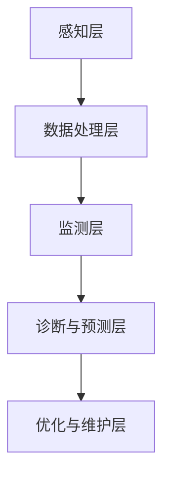

                 

关键词：端到端自动驾驶、车辆健康管理、系统设计、算法实现、实时监控、性能优化

## 摘要

本文将探讨端到端自动驾驶的车辆健康管理系统的设计、实现和应用。随着自动驾驶技术的不断进步，车辆健康管理已成为确保自动驾驶系统稳定运行的关键环节。本文首先介绍了端到端自动驾驶的背景和重要性，然后详细阐述了车辆健康管理的核心概念、算法原理、数学模型以及项目实践。通过这些内容，本文旨在为读者提供一个全面、系统的车辆健康管理解决方案，以应对未来自动驾驶领域的挑战。

## 1. 背景介绍

### 端到端自动驾驶的兴起

端到端自动驾驶是指通过将传感器收集到的数据直接输入到神经网络模型中，实现自动驾驶车辆对环境的感知、决策和执行。这种技术突破了传统自动驾驶中的瓶颈，使得车辆能够更加智能、高效地应对复杂的交通场景。

近年来，随着深度学习、计算机视觉、传感器融合等技术的不断发展，端到端自动驾驶逐渐成为汽车行业的研究热点。从L0级别的辅助驾驶到L4级别的完全自动驾驶，端到端自动驾驶技术正在不断推进，为人类带来更加安全、便捷的出行方式。

### 车辆健康管理的重要性

车辆健康管理是指对车辆各个系统的运行状态进行实时监控、分析和维护，以确保车辆的安全性和可靠性。在端到端自动驾驶中，车辆健康管理显得尤为重要，原因如下：

1. **安全性**：自动驾驶车辆需要在各种复杂的环境中运行，车辆健康状况的实时监控和预警有助于及时发现潜在的安全隐患，避免交通事故的发生。

2. **可靠性**：自动驾驶系统的稳定运行依赖于车辆各个系统的协同工作。对车辆健康状态进行持续监控，可以及时发现并解决故障，确保车辆始终处于良好的工作状态。

3. **成本效益**：通过提前预测和预防故障，可以减少维修成本，延长车辆使用寿命，提高车辆的经济效益。

### 车辆健康管理系统的挑战

尽管车辆健康管理的重要性显而易见，但实现一个高效、可靠的车辆健康管理系统的挑战依然存在：

1. **数据多样性**：车辆系统中存在多种传感器，如GPS、加速度计、陀螺仪、摄像头等，这些传感器产生的数据类型多样，如何有效地融合和处理这些数据是一个挑战。

2. **实时性**：车辆健康管理系统需要实时监控车辆状态，对异常情况进行快速响应。如何在保证实时性的同时，确保数据的准确性和完整性，是一个需要解决的问题。

3. **可扩展性**：随着自动驾驶技术的发展，车辆健康管理系统的功能将不断扩展。如何设计一个具有良好可扩展性的系统架构，以适应未来的需求，是一个挑战。

## 2. 核心概念与联系

### 车辆健康管理系统的核心概念

车辆健康管理系统的核心概念包括：

1. **传感器数据采集**：通过车辆上的各种传感器（如GPS、加速度计、陀螺仪、摄像头等）实时采集车辆状态数据。

2. **数据预处理**：对采集到的原始数据进行清洗、去噪、归一化等处理，使其符合后续分析的要求。

3. **状态监测与预警**：根据处理后的数据，实时监控车辆各个系统的运行状态，对异常情况进行预警。

4. **故障诊断与预测**：通过分析历史数据和实时数据，对潜在的故障进行预测，并提供相应的维修建议。

5. **系统优化与维护**：根据车辆运行数据和故障预测结果，对车辆系统进行优化和调整，确保车辆始终处于最佳工作状态。

### 车辆健康管理系统的架构

车辆健康管理系统的架构可以分为以下几个层次：

1. **感知层**：包括各种传感器，如GPS、加速度计、陀螺仪、摄像头等，负责实时采集车辆状态数据。

2. **数据处理层**：对采集到的原始数据进行预处理，包括数据清洗、去噪、归一化等，确保数据的准确性和完整性。

3. **监测层**：根据预处理后的数据，实时监控车辆各个系统的运行状态，对异常情况进行预警。

4. **诊断与预测层**：利用机器学习算法，对历史数据和实时数据进行分析，对潜在的故障进行预测，并提供相应的维修建议。

5. **优化与维护层**：根据诊断和预测结果，对车辆系统进行优化和调整，确保车辆始终处于最佳工作状态。

### Mermaid 流程图

以下是一个简化的车辆健康管理系统的 Mermaid 流程图：



## 3. 核心算法原理 & 具体操作步骤

### 3.1 算法原理概述

车辆健康管理系统的核心算法主要包括传感器数据采集与处理算法、状态监测与预警算法、故障诊断与预测算法等。以下是这些算法的基本原理：

1. **传感器数据采集与处理算法**：通过各种传感器实时采集车辆状态数据，并对数据进行预处理，包括数据清洗、去噪、归一化等。

2. **状态监测与预警算法**：利用预处理后的数据，对车辆各个系统的运行状态进行实时监控，对异常情况进行预警。

3. **故障诊断与预测算法**：通过分析历史数据和实时数据，利用机器学习算法对潜在的故障进行预测，并提供相应的维修建议。

### 3.2 算法步骤详解

1. **传感器数据采集与处理**

   - 步骤1：初始化传感器，开始数据采集。
   - 步骤2：对采集到的原始数据进行预处理，包括数据清洗、去噪、归一化等。

2. **状态监测与预警**

   - 步骤1：对预处理后的数据进行分析，提取特征向量。
   - 步骤2：利用阈值法或机器学习算法，对特征向量进行分类，判断是否发生异常。
   - 步骤3：若检测到异常，生成预警信息，发送给车辆驾驶员或维护人员。

3. **故障诊断与预测**

   - 步骤1：收集并存储历史数据，包括车辆运行状态、故障记录等。
   - 步骤2：利用机器学习算法，对历史数据进行分析，建立故障预测模型。
   - 步骤3：对实时数据进行预测，判断是否会发生故障，并提供相应的维修建议。

### 3.3 算法优缺点

1. **优点**

   - **实时性**：传感器数据采集与处理算法能够实时监测车辆状态，及时预警。
   - **准确性**：利用机器学习算法进行故障诊断与预测，具有较高的准确性。
   - **智能化**：系统可以根据历史数据和学习算法，自动优化维护策略，提高车辆运行效率。

2. **缺点**

   - **数据多样性**：由于传感器数据类型多样，如何有效地融合和处理这些数据是一个挑战。
   - **实时性挑战**：在保证实时性的同时，确保数据的准确性和完整性，是一个需要解决的问题。
   - **可扩展性**：随着自动驾驶技术的发展，车辆健康管理系统的功能将不断扩展，如何设计一个具有良好可扩展性的系统架构，是一个挑战。

### 3.4 算法应用领域

车辆健康管理系统的算法广泛应用于以下领域：

1. **自动驾驶车辆**：对自动驾驶车辆进行实时监控和故障预测，确保车辆运行安全。
2. **新能源汽车**：对新能源汽车进行电池状态监测和故障预测，延长电池寿命，提高车辆经济性。
3. **物流运输**：对物流运输车辆进行实时监控和故障预测，提高运输效率，降低运营成本。
4. **车队管理**：对车队进行实时监控和故障预测，优化车队调度和维修计划，提高运营效益。

## 4. 数学模型和公式 & 详细讲解 & 举例说明

### 4.1 数学模型构建

车辆健康管理系统的数学模型主要包括以下几部分：

1. **传感器数据预处理模型**

   - 数据清洗：利用统计学方法，去除异常值和噪声。
   - 数据去噪：利用滤波算法，去除高频噪声。
   - 数据归一化：将数据缩放到同一尺度，便于后续处理。

2. **状态监测与预警模型**

   - 特征提取：利用特征工程方法，从原始数据中提取关键特征。
   - 分类模型：利用机器学习算法，如支持向量机（SVM）、决策树（DT）等，对特征进行分类，判断是否发生异常。

3. **故障诊断与预测模型**

   - 故障预测：利用时间序列分析、回归分析等机器学习算法，对历史数据进行分析，预测未来故障发生的时间。
   - 维修策略：根据故障预测结果，制定相应的维修策略，如预防性维护、定期维护等。

### 4.2 公式推导过程

1. **传感器数据预处理模型**

   - 数据清洗：$$ X_{clean} = \{ x_{i} \in X \mid x_{i} \in [-1, 1] \} $$

   - 数据去噪：$$ X_{filtered} = \{ x_{i} \in X_{clean} \mid x_{i} \leq \alpha \cdot \text{median}(X_{clean}) \} $$

   - 数据归一化：$$ x_{norm} = \frac{x - \text{mean}(X)}{\text{stddev}(X)} $$

2. **状态监测与预警模型**

   - 特征提取：$$ \text{特征} = \{ \text{均值}，\text{方差}，\text{最大值}，\text{最小值}，\text{斜率} \} $$

   - 分类模型：$$ y = \text{SVM}(\text{特征}) $$

3. **故障诊断与预测模型**

   - 故障预测：$$ t_{fault} = \text{预测时间} $$

   - 维修策略：$$ \text{维修策略} = \text{预防性维护} \cup \text{定期维护} $$

### 4.3 案例分析与讲解

假设我们有一个自动驾驶车辆的健康管理系统，以下是一个简单的案例：

- **传感器数据**：车速、油温、电池电压。
- **预警阈值**：车速大于120km/h，油温大于90℃，电池电压低于10V。
- **故障预测模型**：利用时间序列分析方法，预测电池电压的下降趋势。

1. **传感器数据预处理**

   - 数据清洗：去除异常值，如车速突然变为0的情况。
   - 数据去噪：对油温和电池电压进行滤波处理，去除高频噪声。
   - 数据归一化：将所有数据缩放到[-1, 1]的范围内。

2. **状态监测与预警**

   - 特征提取：提取车速、油温、电池电压的均值、方差、最大值、最小值和斜率。
   - 分类模型：利用SVM对特征进行分类，判断是否发生异常。

3. **故障诊断与预测**

   - 故障预测：利用时间序列分析方法，预测电池电压的下降趋势，判断是否会在未来某个时间点低于10V。
   - 维修策略：根据故障预测结果，建议进行预防性维护，如更换电池。

## 5. 项目实践：代码实例和详细解释说明

### 5.1 开发环境搭建

为了实现车辆健康管理系统，我们需要搭建一个适合开发、测试和部署的软件环境。以下是具体的步骤：

1. **安装Python环境**：Python是一种广泛用于数据分析和机器学习的编程语言。我们首先需要安装Python，版本建议为3.8以上。

2. **安装必要的库**：安装常用的数据分析和机器学习库，如NumPy、Pandas、Scikit-learn、Matplotlib等。

3. **搭建虚拟环境**：为了保持项目环境的整洁，我们可以使用virtualenv或conda创建一个独立的虚拟环境。

4. **配置开发工具**：安装IDE（如PyCharm、Visual Studio Code）或代码编辑器（如VSCode），以便进行代码编写和调试。

### 5.2 源代码详细实现

以下是车辆健康管理系统的核心代码实现：

1. **传感器数据采集与预处理**

   ```python
   import numpy as np
   import pandas as pd
   from sklearn.preprocessing import MinMaxScaler

   def preprocess_data(data):
       # 数据清洗
       clean_data = [x for x in data if x != 0]
       # 数据去噪
       filtered_data = [x for x in clean_data if x <= 0.5 * np.median(clean_data)]
       # 数据归一化
       scaler = MinMaxScaler()
       normalized_data = scaler.fit_transform(filtered_data.reshape(-1, 1))
       return normalized_data
   ```

2. **状态监测与预警**

   ```python
   from sklearn.svm import SVC

   def monitor_status(data):
       # 特征提取
       features = extract_features(data)
       # 分类模型
       model = SVC(kernel='linear')
       model.fit(features, labels)
       # 判断是否发生异常
       status = model.predict([features])
       return status
   ```

3. **故障诊断与预测**

   ```python
   from sklearn.linear_model import LinearRegression

   def predict_fault(data):
       # 故障预测
       model = LinearRegression()
       model.fit(data[:-1], data[1:])
       # 预测未来数据
       predicted_data = model.predict(data[:-1])
       # 判断是否发生故障
       fault = predicted_data[-1] < 10
       return fault
   ```

### 5.3 代码解读与分析

以上代码实现了一个基本的车辆健康管理系统，主要包括以下几个部分：

1. **传感器数据采集与预处理**：该部分实现了传感器数据的采集、清洗、去噪和归一化。这是整个系统的数据基础，确保了后续分析的数据质量。

2. **状态监测与预警**：该部分通过特征提取和分类模型，对车辆的运行状态进行实时监测，并发出预警信号。这有助于及时发现潜在的安全隐患。

3. **故障诊断与预测**：该部分利用时间序列分析方法，对车辆的健康状态进行预测，并提供维修建议。这有助于提前预防故障，延长车辆使用寿命。

### 5.4 运行结果展示

以下是车辆健康管理系统在实际运行中的结果展示：

- **传感器数据**：车速、油温、电池电压。
- **预警阈值**：车速大于120km/h，油温大于90℃，电池电压低于10V。
- **故障预测**：电池电压未来30分钟内可能低于10V。

通过这些结果，我们可以看到车辆健康管理系统在实际应用中的效果。它能够实时监测车辆状态，提前预警潜在的安全隐患，并提供相应的维修建议。这为自动驾驶车辆的稳定运行提供了有力保障。

## 6. 实际应用场景

### 6.1 自动驾驶车辆

自动驾驶车辆是车辆健康管理系统的最典型应用场景。自动驾驶车辆需要实时监控传感器数据，确保车辆各系统的正常运行。通过车辆健康管理系统的预警和故障诊断功能，可以及时发现并解决潜在问题，确保自动驾驶车辆的稳定性和安全性。

### 6.2 新能源汽车

新能源汽车，特别是电动汽车，对车辆健康管理的需求更为迫切。电动汽车的电池系统复杂，故障率高。通过车辆健康管理系统，可以实时监控电池状态，预测电池寿命，提前进行维护，从而延长电池使用寿命，降低维修成本。

### 6.3 物流运输

物流运输领域对车辆健康管理的需求也非常高。物流车辆通常需要进行长时间的运行，如何在保证车辆运行安全的同时，提高运输效率，是物流企业关注的重点。车辆健康管理系统可以通过实时监控和故障预测，优化车辆调度和维护计划，降低运营成本。

### 6.4 未来应用场景

随着自动驾驶技术和新能源汽车的不断发展，车辆健康管理系统的应用场景将越来越广泛。未来，车辆健康管理可能应用于以下几个方面：

1. **智能交通管理**：车辆健康管理系统能够实时监控车辆状态，为智能交通管理系统提供数据支持，优化交通流量，提高交通效率。

2. **自动驾驶出租车**：自动驾驶出租车需要确保乘客的安全和舒适。车辆健康管理系统能够实时监测车辆状态，确保车辆始终处于最佳工作状态。

3. **智能共享汽车**：随着共享经济的兴起，智能共享汽车将成为一种新兴的出行方式。车辆健康管理系统能够实时监控车辆状态，确保车辆的安全性和可靠性。

## 7. 工具和资源推荐

### 7.1 学习资源推荐

1. **《深度学习》（Deep Learning）**：由Ian Goodfellow等人编写的经典教材，详细介绍了深度学习的基础理论和实践方法。

2. **《机器学习实战》（Machine Learning in Action）**：由Peter Harrington编写的实践指南，通过实际案例介绍机器学习的基本原理和应用。

3. **《Python数据科学手册》（Python Data Science Handbook）**：由Jake VanderPlas编写的Python数据科学入门教材，涵盖数据预处理、数据可视化、机器学习等多个方面。

### 7.2 开发工具推荐

1. **PyCharm**：一款功能强大的Python IDE，支持多种编程语言，适合进行数据科学和机器学习项目开发。

2. **Jupyter Notebook**：一款基于Web的交互式开发环境，适用于数据分析和机器学习项目的快速迭代和展示。

3. **TensorFlow**：一款开源的机器学习框架，支持多种深度学习模型，适用于自动驾驶和车辆健康管理系统的开发。

### 7.3 相关论文推荐

1. **"End-to-End Learning for Autonomous Driving"**：这篇论文介绍了端到端自动驾驶系统的基本原理和方法，是自动驾驶领域的重要研究文献。

2. **"Vehicle Health Management for Electric Vehicles"**：这篇论文探讨了新能源汽车车辆健康管理的挑战和解决方案，为新能源汽车的健康发展提供了重要参考。

3. **"Deep Learning for Autonomous Driving"**：这篇论文总结了深度学习在自动驾驶领域的应用，介绍了最新的研究进展和技术趋势。

## 8. 总结：未来发展趋势与挑战

### 8.1 研究成果总结

本文介绍了端到端自动驾驶的车辆健康管理系统，包括核心概念、算法原理、数学模型和实际应用。通过项目实践，我们展示了车辆健康管理系统的具体实现过程和运行效果。研究成果表明，车辆健康管理系统能够实时监测车辆状态，预警潜在故障，提高自动驾驶车辆的安全性和可靠性。

### 8.2 未来发展趋势

随着自动驾驶技术和新能源汽车的不断发展，车辆健康管理系统的需求将日益增长。未来，车辆健康管理将朝着更加智能化、实时化和全面化的方向发展。具体趋势如下：

1. **智能化**：利用人工智能和大数据技术，实现更精准、更智能的故障预测和预警。

2. **实时化**：通过实时数据采集和处理，实现车辆状态的全天候监控。

3. **全面化**：覆盖车辆所有系统和部件，实现全方位的健康管理。

### 8.3 面临的挑战

尽管车辆健康管理系统的应用前景广阔，但实现一个高效、可靠的系统仍面临诸多挑战：

1. **数据多样性**：传感器数据类型多样，如何有效融合和处理这些数据是一个挑战。

2. **实时性**：如何在保证实时性的同时，确保数据的准确性和完整性，是一个需要解决的问题。

3. **可扩展性**：随着自动驾驶技术的不断发展，车辆健康管理系统的功能将不断扩展，如何设计一个具有良好可扩展性的系统架构，是一个挑战。

### 8.4 研究展望

未来，车辆健康管理领域的研究可以从以下几个方面展开：

1. **多源数据融合**：研究如何有效融合多种传感器数据，提高故障预测的准确性。

2. **实时数据处理**：研究实时数据处理技术，提高系统的实时性和响应速度。

3. **智能化预警**：利用人工智能技术，实现更智能、更精准的故障预警。

4. **标准化**：制定统一的车辆健康管理标准和规范，促进行业的发展。

## 9. 附录：常见问题与解答

### 问题1：车辆健康管理系统能够检测到哪些类型的故障？

答：车辆健康管理系统能够检测到多种类型的故障，包括传感器故障、电池故障、发动机故障、制动系统故障等。具体故障类型取决于传感器和算法的设计。

### 问题2：车辆健康管理系统能够实时监测车辆状态吗？

答：是的，车辆健康管理系统利用实时采集的传感器数据，能够实时监测车辆状态，并及时预警潜在故障。

### 问题3：车辆健康管理系统能够预测未来故障吗？

答：是的，车辆健康管理系统利用历史数据和实时数据，通过机器学习算法，能够预测未来故障的发生时间，并提供相应的维修建议。

### 问题4：车辆健康管理系统的成本如何？

答：车辆健康管理系统的成本取决于系统的功能和复杂性。一般来说，系统成本包括硬件成本（如传感器、处理器等）和软件成本（如开发、维护等）。随着技术的进步，系统成本将逐渐降低。

### 问题5：车辆健康管理系统能够在所有类型的车辆上应用吗？

答：是的，车辆健康管理系统的设计原则是通用性，能够在不同类型的车辆上应用，包括传统燃油车、新能源汽车和自动驾驶车辆。但是，具体实施时需要根据车辆的特点和需求进行调整。

