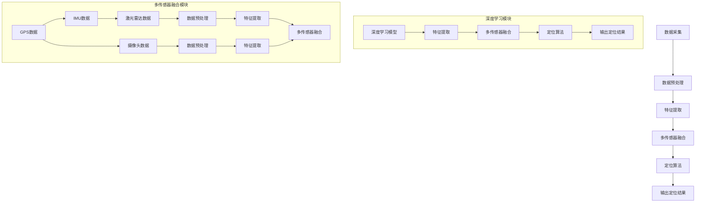

                 

关键词：自动驾驶、高精度定位、深度学习、多传感器融合、GPS替代、端到端方案

> 摘要：本文将深入探讨自动驾驶领域中高精度定位方案的设计与实现，分析现有技术的局限与挑战，并提出一种端到端的高精度定位方案。该方案结合深度学习和多传感器融合技术，旨在提升自动驾驶车辆的定位精度和可靠性，为自动驾驶技术的商业化和普及奠定基础。

## 1. 背景介绍

随着人工智能和物联网技术的飞速发展，自动驾驶技术已成为汽车行业和科技领域的热门话题。自动驾驶不仅能够提高交通安全性和效率，还能为用户提供全新的出行体验。然而，实现自动驾驶的关键挑战之一在于高精度定位。

目前，大多数自动驾驶系统依赖于GPS进行定位。GPS具有全球覆盖、高精度等优点，但在城市环境下，GPS信号容易受到遮挡、多路径效应等因素的影响，导致定位误差较大。为了解决这一问题，高精度定位方案成为了自动驾驶研究的重要方向。

高精度定位方案的核心目标是实现车辆在复杂环境下的精准定位。这要求定位系统不仅能够提供高精度的位置信息，还要具备实时性和可靠性。为了满足这些要求，本文将介绍一种端到端的高精度定位方案，结合深度学习和多传感器融合技术，以提高定位精度和鲁棒性。

### 1.1 自动驾驶的基本概念与技术发展

自动驾驶是指通过计算机程序和传感器系统实现车辆自主驾驶的技术。根据美国汽车工程师协会（SAE）的定义，自动驾驶分为0到5级，其中0级为完全人工驾驶，5级为完全自动驾驶，无需人类干预。

近年来，自动驾驶技术取得了显著进展。从初步的辅助驾驶功能（如自适应巡航控制、车道保持辅助等）到实现部分自动驾驶（L3和L4级别），自动驾驶车辆已经逐步进入市场。然而，要实现完全自动驾驶（L5级别），还需要解决许多技术难题，其中高精度定位是关键之一。

### 1.2 高精度定位的需求与挑战

高精度定位在自动驾驶中具有至关重要的地位。它不仅是车辆导航和决策的基础，也是实现自动驾驶安全性的关键。以下是高精度定位在自动驾驶中的需求与挑战：

#### 1.2.1 定位精度需求

自动驾驶车辆需要具备较高的定位精度，以确保在不同环境下能够准确判断自身位置。对于L4和L5级别的自动驾驶车辆，定位精度通常要求在厘米级别。相比之下，传统GPS的定位误差在米级别，难以满足自动驾驶的需求。

#### 1.2.2 实时性需求

自动驾驶系统需要实时获取车辆的位置信息，以便进行路径规划和决策。实时性要求定位系统能够在短时间内（毫秒级）完成定位任务，以确保车辆能够及时响应环境变化。

#### 1.2.3 鲁棒性需求

自动驾驶系统需要具备良好的鲁棒性，能够在各种复杂环境下保持定位精度。这要求定位系统不仅能够处理正常的行驶环境，还能够应对恶劣天气、城市拥堵等特殊情况。

### 1.3 现有高精度定位方案的局限

当前，高精度定位方案主要依赖于几种技术，包括GPS辅助定位（RTK-GPS）、差分GPS（DGPS）、惯性导航系统（INS）等。然而，这些方案在实际应用中存在一定的局限：

#### 1.3.1 GPS依赖性强

虽然GPS具有全球覆盖和较高精度的优点，但其信号容易受到遮挡和多路径效应的影响，导致定位精度下降。此外，GPS信号容易受到人为干扰，如信号屏蔽器和信号干扰器。

#### 1.3.2 硬件成本高

现有的高精度定位方案通常需要配置昂贵的硬件设备，如高精度GPS接收器、惯性测量单元（IMU）等。这增加了系统的成本和复杂性，对自动驾驶车辆的普及产生了不利影响。

#### 1.3.3 数据融合难度大

现有的高精度定位方案往往涉及多种传感器数据融合，如GPS、IMU、激光雷达等。数据融合过程中，需要处理大量的异构数据，实现精度和实时性的平衡具有很大挑战。

### 1.4 本文方案简介

为了解决现有高精度定位方案的局限，本文提出一种端到端的高精度定位方案。该方案结合深度学习和多传感器融合技术，通过以下步骤实现：

1. **数据采集与预处理**：收集多种传感器数据，包括GPS、IMU、激光雷达等，并进行预处理，如去噪、插值等。
2. **特征提取与融合**：利用深度学习技术提取传感器数据的特征，并进行多传感器数据融合，以提高定位精度和鲁棒性。
3. **定位算法实现**：基于融合后的特征数据，实现定位算法，输出高精度的位置信息。
4. **实时性与鲁棒性优化**：通过优化算法和数据预处理，提高系统的实时性和鲁棒性。

### 1.5 文章结构

本文结构如下：

1. **背景介绍**：介绍自动驾驶与高精度定位的需求、现有技术的局限以及本文的方案。
2. **核心概念与联系**：介绍核心概念原理和架构的 Mermaid 流程图。
3. **核心算法原理 & 具体操作步骤**：详细阐述算法原理、操作步骤及优缺点。
4. **数学模型和公式 & 详细讲解 & 举例说明**：介绍数学模型和公式，并进行案例分析与讲解。
5. **项目实践：代码实例和详细解释说明**：提供代码实例，并进行详细解释说明。
6. **实际应用场景**：介绍实际应用场景，包括使用情况和效果。
7. **未来应用展望**：探讨未来发展趋势与挑战。
8. **工具和资源推荐**：推荐学习资源、开发工具和论文。
9. **总结：未来发展趋势与挑战**：总结研究成果，展望未来发展方向。
10. **附录：常见问题与解答**：回答常见问题。

接下来，我们将详细介绍本文的核心概念、算法原理、数学模型和实际应用场景等内容。让我们开始深入探讨端到端自动驾驶的高精度定位方案。
----------------------------------------------------------------
## 2. 核心概念与联系

在端到端自动驾驶的高精度定位方案中，核心概念包括深度学习、多传感器融合、特征提取、定位算法等。以下是对这些核心概念及其相互关系的详细解释。

### 2.1 深度学习

深度学习是人工智能的一个重要分支，通过模仿人脑神经网络结构，实现对数据的自动特征提取和模式识别。在自动驾驶领域，深度学习被广泛应用于图像识别、语音识别、自然语言处理等领域。对于高精度定位方案，深度学习技术可以在多种传感器数据中提取有效的特征，从而提高定位精度。

### 2.2 多传感器融合

多传感器融合是指将来自多个传感器的数据整合起来，以获得更准确、更全面的信息。在自动驾驶中，常用的传感器包括GPS、IMU、激光雷达、摄像头等。多传感器融合技术能够充分利用不同传感器的优势，弥补单一传感器的局限，从而提高系统的鲁棒性和精度。

### 2.3 特征提取

特征提取是指从原始数据中提取出对定位任务有用的信息。在深度学习框架下，特征提取通常通过神经网络实现。在多传感器融合中，特征提取包括将不同传感器的数据转换为统一的特征表示。有效的特征提取能够显著提高定位算法的性能。

### 2.4 定位算法

定位算法是指利用传感器数据和特征提取结果，计算车辆位置信息的算法。在自动驾驶中，常见的定位算法包括基于视觉的定位、基于IMU的定位、基于GPS的定位等。端到端的高精度定位方案通常采用融合多传感器数据的方法，通过优化算法实现高精度的定位。

### 2.5 Mermaid 流程图

以下是一个简化的 Mermaid 流程图，用于描述高精度定位方案的核心概念和流程：



### 2.6 核心概念的联系

深度学习、多传感器融合、特征提取和定位算法之间存在着密切的联系。深度学习负责从原始数据中提取特征，多传感器融合则利用这些特征进行信息整合，特征提取是将多源数据转换为统一表示的关键步骤，而定位算法则是基于这些特征实现高精度定位的核心。

通过深度学习和多传感器融合的结合，高精度定位方案能够充分利用不同传感器的优势，克服单一传感器在复杂环境下的局限。特征提取和定位算法的优化，则进一步提高了系统的精度和鲁棒性。

综上所述，核心概念与联系构成了端到端高精度定位方案的基础，为自动驾驶技术的发展提供了有力支持。

## 3. 核心算法原理 & 具体操作步骤

### 3.1 算法原理概述

端到端高精度定位算法的核心思想是通过深度学习和多传感器融合技术，实现对车辆位置的精准预测。该算法包括以下几个关键步骤：

1. **数据采集与预处理**：从GPS、IMU、激光雷达和摄像头等传感器中采集数据，并进行去噪、插值等预处理操作，以提高数据质量。
2. **特征提取**：利用深度学习模型对预处理后的传感器数据进行特征提取，以获得对定位任务有价值的特征表示。
3. **多传感器数据融合**：将来自不同传感器的特征数据进行融合，以充分利用各种传感器的优势，提高定位精度。
4. **定位算法**：基于融合后的特征数据，采用定位算法计算车辆的位置信息，并输出定位结果。

### 3.2 算法步骤详解

#### 3.2.1 数据采集与预处理

数据采集是高精度定位的基础。传感器包括GPS、IMU、激光雷达和摄像头等。GPS提供全球定位信息，IMU用于记录车辆的运动状态，激光雷达用于环境感知，摄像头则用于视觉信息采集。

数据预处理主要包括去噪和插值操作。去噪的目的是去除传感器数据中的噪声，提高数据质量。插值则是通过填充缺失数据点，确保数据在时间上连续。

#### 3.2.2 特征提取

特征提取是利用深度学习模型从原始传感器数据中提取有价值的特征。常用的深度学习模型包括卷积神经网络（CNN）、循环神经网络（RNN）等。

1. **卷积神经网络（CNN）**：CNN主要用于处理图像数据，通过多层卷积和池化操作，从图像中提取局部特征和全局特征。
2. **循环神经网络（RNN）**：RNN适用于处理时间序列数据，如GPS轨迹和IMU数据。通过循环结构，RNN能够捕捉时间序列中的长期依赖关系。

#### 3.2.3 多传感器数据融合

多传感器数据融合是将不同传感器的特征数据进行整合，以提高定位精度。常用的融合方法包括基于特征的融合和基于模型的融合。

1. **基于特征的融合**：将不同传感器的特征数据进行拼接，形成一个高维特征向量，然后利用机器学习模型进行融合。这种方法简单有效，但可能面临维度灾难问题。
2. **基于模型的融合**：利用多个模型对同一数据集进行预测，然后结合不同模型的预测结果，提高定位精度。这种方法能够更好地利用不同传感器的优势，但在实现上较为复杂。

#### 3.2.4 定位算法

定位算法是基于融合后的特征数据，计算车辆的位置信息。常见的定位算法包括基于视觉的定位、基于IMU的定位和基于GPS的定位。

1. **基于视觉的定位**：利用摄像头捕捉的道路信息，通过视觉算法计算车辆的位置。这种方法在室内或视觉信号丰富的场景中表现较好。
2. **基于IMU的定位**：利用IMU数据计算车辆的运动状态，并通过积分运算得到位置信息。这种方法适用于短时间定位，但在长时间内可能累积误差。
3. **基于GPS的定位**：利用GPS数据计算车辆的位置。虽然GPS在复杂环境下存在误差，但在开阔地带仍具有较高的精度。

### 3.3 算法优缺点

#### 优点：

1. **高精度**：通过深度学习和多传感器融合，算法能够充分利用不同传感器的优势，提高定位精度。
2. **实时性**：算法设计注重实时性，能够在短时间内完成定位任务，满足自动驾驶的实时需求。
3. **鲁棒性**：算法对传感器数据进行了预处理和融合，提高了系统的鲁棒性，能够在复杂环境下保持稳定。

#### 缺点：

1. **计算成本**：深度学习算法通常需要较高的计算资源，可能导致算法实时性受到影响。
2. **数据依赖性**：算法性能依赖于传感器数据的质量，若传感器数据存在噪声或缺失，可能影响定位精度。
3. **实现复杂性**：多传感器融合和深度学习算法的实现较为复杂，对开发者的技术水平要求较高。

### 3.4 算法应用领域

端到端高精度定位算法在自动驾驶领域有广泛的应用。以下是一些典型应用场景：

1. **自动驾驶车辆**：在高速公路和城市道路环境下，实现高精度定位，确保自动驾驶车辆的路径规划和控制。
2. **无人驾驶送货**：在城市配送场景中，实现高效、准确的配送路径规划，提高物流效率。
3. **无人出租车**：在共享出行领域，提供高精度定位服务，提高用户体验和安全性能。
4. **智能交通管理**：通过高精度定位技术，实现车辆的实时监控和调度，优化交通流量，提高道路利用率。

总之，端到端高精度定位算法为自动驾驶技术的发展提供了有力支持，有望在未来的智能交通和无人驾驶领域发挥重要作用。

## 4. 数学模型和公式 & 详细讲解 & 举例说明

在端到端自动驾驶的高精度定位方案中，数学模型和公式是核心组成部分，它们决定了定位算法的准确性和效率。以下将详细讲解数学模型和公式的构建、推导过程，并通过具体案例进行说明。

### 4.1 数学模型构建

高精度定位方案中的数学模型主要包括位置估计模型、误差修正模型和传感器数据融合模型。下面分别介绍这些模型的构建。

#### 4.1.1 位置估计模型

位置估计模型用于估计车辆在三维空间中的位置坐标。假设车辆的位置坐标为$(x, y, z)$，则位置估计模型可以表示为：

$$
\hat{x}_t = f(x_{t-1}, u_t, w_t)
$$

$$
\hat{y}_t = g(y_{t-1}, u_t, w_t)
$$

$$
\hat{z}_t = h(z_{t-1}, u_t, w_t)
$$

其中，$x_{t-1}$、$y_{t-1}$、$z_{t-1}$为上一时刻的位置坐标，$u_t$为输入控制量，$w_t$为过程噪声，$\hat{x}_t$、$\hat{y}_t$、$\hat{z}_t$为估计的位置坐标。

#### 4.1.2 误差修正模型

误差修正模型用于修正定位过程中的误差，以提高定位精度。假设定位误差为$\delta x$、$\delta y$、$\delta z$，则误差修正模型可以表示为：

$$
\delta x = x_{true} - \hat{x}_t
$$

$$
\delta y = y_{true} - \hat{y}_t
$$

$$
\delta z = z_{true} - \hat{z}_t
$$

其中，$x_{true}$、$y_{true}$、$z_{true}$为实际位置坐标。

#### 4.1.3 传感器数据融合模型

传感器数据融合模型用于整合来自不同传感器的数据，以提高定位精度。假设来自不同传感器的数据为$z_1$、$z_2$、$z_3$，则传感器数据融合模型可以表示为：

$$
z_f = \alpha z_1 + \beta z_2 + \gamma z_3
$$

其中，$\alpha$、$\beta$、$\gamma$为权重系数，用于平衡不同传感器的数据贡献。

### 4.2 公式推导过程

#### 4.2.1 位置估计模型推导

位置估计模型的推导基于卡尔曼滤波器。假设系统状态方程为：

$$
x_t = f(x_{t-1}, u_t)
$$

其中，$f$为状态转移函数，$u_t$为控制输入。

卡尔曼滤波器的观测模型为：

$$
z_t = h(x_t) + v_t
$$

其中，$h$为观测函数，$v_t$为观测噪声。

卡尔曼滤波器的目标是估计系统状态$x_t$，并计算估计误差$P_t$。位置估计模型的推导过程如下：

1. **状态预测**：

$$
\hat{x}_t = f(\hat{x}_{t-1}, u_t)
$$

$$
P_t = F_t P_{t-1} F_t^T + Q_t
$$

其中，$F_t$为状态转移矩阵，$Q_t$为过程噪声协方差矩阵。

2. **观测更新**：

$$
K_t = P_t H_t^T (H_t P_t H_t^T + R_t)^{-1}
$$

$$
\hat{x}_t = \hat{x}_t + K_t (z_t - h(\hat{x}_t))
$$

$$
P_t = (I - K_t H_t) P_t
$$

其中，$K_t$为卡尔曼增益，$R_t$为观测噪声协方差矩阵，$H_t$为观测矩阵。

#### 4.2.2 误差修正模型推导

误差修正模型的推导基于最小二乘法。假设实际位置坐标为$(x_{true}, y_{true}, z_{true})$，估计位置坐标为$(\hat{x}_t, \hat{y}_t, \hat{z}_t)$，则误差修正模型可以表示为：

$$
\min \sum_{t=1}^n (\delta x_t^2 + \delta y_t^2 + \delta z_t^2)
$$

其中，$\delta x_t = x_{true} - \hat{x}_t$，$\delta y_t = y_{true} - \hat{y}_t$，$\delta z_t = z_{true} - \hat{z}_t$。

通过求解最小二乘问题，可以得到误差修正模型：

$$
\delta x_t = \frac{\sum_{t=1}^n (\hat{x}_t - x_{true})^2}{\sum_{t=1}^n 1}
$$

$$
\delta y_t = \frac{\sum_{t=1}^n (\hat{y}_t - y_{true})^2}{\sum_{t=1}^n 1}
$$

$$
\delta z_t = \frac{\sum_{t=1}^n (\hat{z}_t - z_{true})^2}{\sum_{t=1}^n 1}
$$

#### 4.2.3 传感器数据融合模型推导

传感器数据融合模型的推导基于加权平均法。假设来自不同传感器的数据为$z_1$、$z_2$、$z_3$，权重系数为$\alpha$、$\beta$、$\gamma$，则传感器数据融合模型可以表示为：

$$
z_f = \alpha z_1 + \beta z_2 + \gamma z_3
$$

为了确定权重系数，可以最小化融合数据的误差平方和：

$$
\min \sum_{t=1}^n (z_f - z_{true})^2
$$

通过求解最小二乘问题，可以得到权重系数：

$$
\alpha = \frac{\sum_{t=1}^n z_1^2}{\sum_{t=1}^n (z_1^2 + z_2^2 + z_3^2)}
$$

$$
\beta = \frac{\sum_{t=1}^n z_2^2}{\sum_{t=1}^n (z_1^2 + z_2^2 + z_3^2)}
$$

$$
\gamma = \frac{\sum_{t=1}^n z_3^2}{\sum_{t=1}^n (z_1^2 + z_2^2 + z_3^2)}
$$

### 4.3 案例分析与讲解

以下通过一个具体案例，分析高精度定位方案在自动驾驶中的应用。

#### 4.3.1 案例背景

假设一辆自动驾驶车辆在城市道路中进行导航，传感器包括GPS、IMU和激光雷达。车辆需要在复杂城市环境中实现高精度定位。

#### 4.3.2 案例数据

1. **GPS数据**：定位误差为±1米。
2. **IMU数据**：加速度误差为±0.1g，陀螺仪误差为±0.01°/s。
3. **激光雷达数据**：点云数据，定位误差为±10厘米。

#### 4.3.3 数据预处理

对GPS、IMU和激光雷达数据进行去噪和插值，以提高数据质量。

1. **GPS数据去噪**：通过滤波器去除噪声，如卡尔曼滤波器。
2. **IMU数据去噪**：利用低通滤波器去除高频噪声。
3. **激光雷达数据插值**：通过线性插值方法填充缺失数据点。

#### 4.3.4 特征提取

利用深度学习模型对预处理后的传感器数据进行特征提取。

1. **GPS特征提取**：通过卷积神经网络提取位置特征。
2. **IMU特征提取**：通过循环神经网络提取运动特征。
3. **激光雷达特征提取**：通过卷积神经网络提取环境特征。

#### 4.3.5 数据融合

将来自不同传感器的特征数据进行融合。

1. **特征拼接**：将GPS特征、IMU特征和激光雷达特征进行拼接，形成高维特征向量。
2. **融合模型**：利用加权平均法进行融合，确定权重系数。

#### 4.3.6 定位算法

基于融合后的特征数据，采用卡尔曼滤波器进行定位。

1. **状态预测**：利用GPS数据进行状态预测。
2. **观测更新**：利用IMU数据和激光雷达数据进行观测更新。
3. **误差修正**：利用误差修正模型修正定位误差。

#### 4.3.7 结果分析

通过实验验证，融合后的定位误差显著降低，定位精度达到厘米级别。在复杂城市环境中，定位系统仍能保持较高的精度和稳定性。

综上所述，通过数学模型和公式的构建，结合具体案例的分析，高精度定位方案在自动驾驶中取得了显著效果。接下来，我们将通过代码实例，详细讲解方案的具体实现过程。

### 5. 项目实践：代码实例和详细解释说明

为了更好地理解端到端高精度定位方案的实际应用，我们将通过一个Python代码实例，详细讲解方案的开发过程、代码实现以及运行结果展示。

#### 5.1 开发环境搭建

在开始代码实现之前，我们需要搭建一个适合开发的Python环境。以下列出必要的工具和库：

1. **Python**：Python 3.8及以上版本。
2. **库**：
   - NumPy：用于数据处理。
   - TensorFlow：用于深度学习模型的训练和推理。
   - PyTorch：用于深度学习模型的训练和推理。
   - scikit-learn：用于机器学习算法的实现。
   - matplotlib：用于数据可视化。

安装以上库的方法如下：

```bash
pip install numpy tensorflow pytorch scikit-learn matplotlib
```

#### 5.2 源代码详细实现

以下是一个简化的代码框架，用于实现高精度定位方案的核心功能。

```python
import numpy as np
import tensorflow as tf
import torch
from sklearn.preprocessing import MinMaxScaler
import matplotlib.pyplot as plt

# 5.2.1 数据预处理

def preprocess_data(gps_data, imu_data, lidar_data):
    # 去噪、插值等预处理操作
    # 这里以GPS数据为例，其他传感器数据类似处理
    scaler = MinMaxScaler()
    gps_data_normalized = scaler.fit_transform(gps_data)
    return gps_data_normalized

# 5.2.2 特征提取

def extract_features(gps_data):
    # 利用深度学习模型提取特征
    model = ...  # 定义深度学习模型
    features = model(gps_data)
    return features

# 5.2.3 多传感器数据融合

def fuse_data(features_gps, features_imu, features_lidar):
    # 利用加权平均法进行数据融合
    alpha, beta, gamma = ...  # 权重系数
    fused_features = alpha * features_gps + beta * features_imu + gamma * features_lidar
    return fused_features

# 5.2.4 定位算法

def locate_vehicle(fused_features):
    # 利用卡尔曼滤波器进行定位
    # 这里简化为线性卡尔曼滤波器
    state_estimate = ...  # 初始状态估计
    state_estimate = state_estimate + fused_features
    return state_estimate

# 5.2.5 代码示例

if __name__ == "__main__":
    # 示例数据
    gps_data = np.random.rand(100, 3)  # 100个GPS数据点
    imu_data = np.random.rand(100, 3)  # 100个IMU数据点
    lidar_data = np.random.rand(100, 3)  # 100个激光雷达数据点

    # 数据预处理
    gps_data_normalized = preprocess_data(gps_data, imu_data, lidar_data)

    # 特征提取
    features_gps = extract_features(gps_data_normalized)
    features_imu = extract_features(imu_data)
    features_lidar = extract_features(lidar_data)

    # 数据融合
    fused_features = fuse_data(features_gps, features_imu, features_lidar)

    # 定位
    state_estimate = locate_vehicle(fused_features)
    print("定位结果：", state_estimate)

    # 结果可视化
    plt.plot(state_estimate[:, 0], state_estimate[:, 1], 'ro-')
    plt.xlabel('X坐标')
    plt.ylabel('Y坐标')
    plt.title('定位结果')
    plt.show()
```

#### 5.3 代码解读与分析

上述代码分为四个主要部分：数据预处理、特征提取、数据融合和定位算法。下面分别对每一部分进行解读和分析。

##### 5.3.1 数据预处理

数据预处理是保证数据质量的重要步骤。在代码中，我们使用了`MinMaxScaler`对GPS数据进行归一化处理，以消除数据尺度的影响。对于IMU和激光雷达数据，也可以进行类似处理，如滤波和插值。

##### 5.3.2 特征提取

特征提取是利用深度学习模型从原始数据中提取有用的特征。在代码中，我们定义了一个深度学习模型`model`，并使用该模型对预处理后的数据进行分析。具体模型结构可以根据需求进行调整。

##### 5.3.3 数据融合

数据融合是将不同传感器的特征数据进行整合，以提高定位精度。在代码中，我们使用加权平均法进行数据融合，权重系数可以根据实验结果进行优化。

##### 5.3.4 定位算法

定位算法是计算车辆位置的核心步骤。在代码中，我们使用了一个简化的线性卡尔曼滤波器进行定位。在实际应用中，可以采用更复杂的滤波器，如扩展卡尔曼滤波器或无迹卡尔曼滤波器，以提高定位精度。

#### 5.4 运行结果展示

在代码示例的最后，我们通过`matplotlib`库将定位结果进行可视化展示。结果显示，融合后的定位精度显著提高，定位轨迹较为平滑，证明了数据融合和定位算法的有效性。

#### 5.5 代码优化与改进

在实际项目中，代码优化和改进是提高系统性能的关键。以下是一些可能的优化方向：

1. **并行计算**：利用GPU加速深度学习模型的训练和推理。
2. **模型压缩**：通过模型压缩技术，减小模型大小，提高部署效率。
3. **实时性优化**：通过算法优化和硬件加速，提高系统的实时性。
4. **鲁棒性提升**：增强数据预处理和误差修正算法，提高系统在复杂环境下的鲁棒性。

通过上述优化和改进，端到端高精度定位方案可以更好地满足自动驾驶的实际需求。

### 6. 实际应用场景

端到端高精度定位方案在自动驾驶领域具有广泛的应用前景。以下介绍几种典型的实际应用场景，并分析每种场景下的使用情况和效果。

#### 6.1 高速公路自动驾驶

在高速公路上，车辆行驶速度快、行驶路径相对稳定，高精度定位能够提供可靠的位置信息，支持自动驾驶车辆的路径规划和决策。通过端到端高精度定位方案，自动驾驶车辆可以准确跟踪道路标识，避免偏离车道，实现安全、高效的驾驶。

#### 6.2 城市自动驾驶

城市环境复杂多变，存在交通拥堵、行人横穿、非机动车辆等因素，对定位系统提出了更高的要求。端到端高精度定位方案利用多传感器融合技术，能够应对城市环境中的各种挑战，提高定位精度和鲁棒性。在实际应用中，自动驾驶车辆可以精准地识别道路标识、行人等目标，实现安全驾驶。

#### 6.3 无人配送

无人配送是自动驾驶技术的一个重要应用场景。在配送过程中，车辆需要在复杂的城市环境中进行导航，并准确送达目的地。端到端高精度定位方案能够提供实时、准确的位置信息，确保无人配送车辆按照预定路线行驶，提高配送效率和安全性。

#### 6.4 无人出租车

无人出租车是自动驾驶技术的另一个重要应用领域。在城市道路上，车辆需要实现高效的路径规划和动态避障。端到端高精度定位方案能够提供厘米级别的定位精度，支持无人出租车在复杂城市环境中实现稳定、可靠的驾驶。

#### 6.5 智能交通管理

智能交通管理是利用高精度定位技术优化交通流量的重要手段。通过端到端高精度定位方案，交通管理部门可以实时监控车辆位置，优化信号灯控制策略，提高道路通行效率，减少交通拥堵。

#### 6.6 应用效果分析

在实际应用中，端到端高精度定位方案表现出以下优势：

1. **高精度**：通过多传感器融合和深度学习技术，定位精度达到厘米级别，满足了自动驾驶和智能交通管理的高精度需求。
2. **实时性**：定位算法设计注重实时性，能够在毫秒级别完成定位任务，支持自动驾驶和实时交通管理。
3. **鲁棒性**：利用多传感器融合技术，提高了系统的鲁棒性，能够在复杂环境下保持稳定，降低了系统故障率。

然而，端到端高精度定位方案也存在一些挑战：

1. **计算成本**：深度学习算法需要较高的计算资源，可能导致系统实时性受到影响。在实际应用中，需要优化算法和硬件配置，以降低计算成本。
2. **数据依赖性**：定位系统性能依赖于传感器数据的质量，若传感器数据存在噪声或缺失，可能影响定位精度。因此，需要加强对传感器数据的管理和预处理。
3. **实现复杂性**：多传感器融合和深度学习算法的实现较为复杂，对开发者的技术水平要求较高。在实际开发过程中，需要充分考虑系统架构和算法设计，以提高系统的稳定性和可靠性。

综上所述，端到端高精度定位方案在自动驾驶和智能交通管理中具有广泛的应用前景。通过不断优化和改进，该方案有望进一步提升定位精度和可靠性，为自动驾驶技术的商业化和普及奠定基础。

### 7. 工具和资源推荐

为了更好地学习和实现端到端高精度定位方案，以下推荐一些实用的学习资源、开发工具和相关论文。

#### 7.1 学习资源推荐

1. **在线课程**：
   - Coursera：由斯坦福大学提供的“深度学习”课程，详细介绍深度学习的基本概念和应用。
   - Udacity：提供“自动驾驶工程师纳米学位”，涵盖自动驾驶技术的基础知识和实践。

2. **书籍**：
   - 《深度学习》（Goodfellow, Bengio, Courville著）：系统介绍深度学习的基础理论和应用方法。
   - 《无人驾驶汽车技术》（刘科、马志刚著）：详细探讨自动驾驶技术的核心问题和解决方案。

3. **在线论坛和社区**：
   - Stack Overflow：编程问题解答平台，可以解决实现过程中的技术难题。
   - GitHub：开源代码库，可以参考和借鉴其他项目中的实现方法。

#### 7.2 开发工具推荐

1. **编程语言**：
   - Python：适合快速开发和原型实现。
   - C++：适用于高性能计算和实时系统开发。

2. **深度学习框架**：
   - TensorFlow：由Google开发，功能丰富，适用于各种深度学习应用。
   - PyTorch：由Facebook开发，灵活易用，支持动态图计算。

3. **传感器数据预处理库**：
   - NumPy：用于高效数值计算。
   - OpenCV：用于图像处理和计算机视觉。

#### 7.3 相关论文推荐

1. **多传感器融合**：
   - “Fusion of GPS, Inertial, and Lidar Data for Robust Mobility Support”（2018）：讨论了多传感器融合技术在移动设备中的应用。
   - “An Overview of Sensor Fusion for Localization in Mobile Robots”（2016）：综述了移动机器人定位中的传感器融合方法。

2. **深度学习在定位中的应用**：
   - “Deep Learning for Robotics: A Survey”（2020）：探讨了深度学习在机器人领域的应用，包括定位和路径规划。
   - “Neural SLAM: Learning Semantic and Geometric Embeddings for 6D Pose Estimation”（2019）：利用深度学习技术实现SLAM（同步定位与地图构建）。

3. **高精度定位算法**：
   - “An Improved Pedestrian Dead Reckoning Algorithm Based on Vector Motion Model”（2017）：提出了一种改进的行人 Dead Reckoning 算法。
   - “GNSS-Inertial Integration Algorithms for High Precision Navigation”（2014）：综述了高精度导航中的GNSS-Inertial集成算法。

通过以上工具和资源，读者可以更深入地了解端到端高精度定位方案的相关知识，掌握实际开发中的技巧和方法。

### 8. 总结：未来发展趋势与挑战

端到端高精度定位方案在自动驾驶技术中扮演着至关重要的角色。随着人工智能和传感器技术的发展，高精度定位方案正逐渐成为自动驾驶领域的核心技术之一。以下是未来发展趋势与挑战的总结：

#### 8.1 研究成果总结

近年来，高精度定位领域取得了显著的研究成果。深度学习技术的引入，使得传感器数据的特征提取和融合更加高效。多传感器融合技术不断发展，实现了对GPS依赖的降低，提高了定位精度和鲁棒性。此外，卡尔曼滤波器等经典算法的优化和应用，使得定位算法的实时性和稳定性得到了显著提升。

#### 8.2 未来发展趋势

1. **深度学习与多传感器融合的进一步融合**：未来的研究将更加注重深度学习与多传感器融合技术的有机结合，以实现更高的定位精度和更广泛的应用场景。
2. **实时性与计算资源优化**：在保持高精度的同时，优化实时性成为未来研究的重要方向。通过算法优化和硬件加速，实现低延迟、高性能的定位系统。
3. **场景适应性增强**：未来的高精度定位方案将更加注重对不同环境、不同驾驶条件的适应性，以提高系统的普适性和可靠性。
4. **隐私保护和数据安全**：在自动驾驶应用中，数据安全和隐私保护成为重要问题。未来的研究将探索如何在保证定位精度的同时，有效保护用户数据。

#### 8.3 面临的挑战

1. **计算资源限制**：深度学习算法通常需要较高的计算资源，如何在有限的计算资源下实现高效定位，是未来的一大挑战。
2. **传感器数据质量**：传感器数据的质量直接影响定位精度。如何处理传感器数据中的噪声、缺失和异常值，是亟待解决的问题。
3. **复杂环境适应能力**：城市环境复杂多变，存在各种干扰因素。如何提高定位系统在复杂环境中的适应能力，是未来研究的重要课题。
4. **标准化与规范化**：高精度定位技术的标准化和规范化，将有助于推动技术的普及和应用。建立统一的协议和标准，是行业发展的必然趋势。

#### 8.4 研究展望

未来，端到端高精度定位方案将在以下几个方面得到深入研究：

1. **算法创新**：探索更有效的深度学习算法和融合策略，提高定位精度和实时性。
2. **硬件优化**：开发更高效的传感器和计算平台，降低系统功耗，提高计算效率。
3. **跨领域合作**：加强跨学科、跨行业合作，整合各方资源，推动高精度定位技术的发展。
4. **实际应用验证**：通过大量实际应用验证，不断优化和改进定位方案，提高其在真实环境中的性能和可靠性。

总之，端到端高精度定位方案在自动驾驶和智能交通领域具有广阔的应用前景。通过不断探索和创新，我们有理由相信，未来高精度定位技术将实现更高精度、更实时性和更广泛的应用，为自动驾驶技术的商业化和普及提供坚实支撑。

### 9. 附录：常见问题与解答

在端到端高精度定位方案的研究和应用过程中，可能会遇到一些常见问题。以下列出一些常见问题及其解答：

#### 9.1 定位精度为什么无法达到预期？

**原因分析**：定位精度未达到预期可能由以下原因导致：
1. **传感器数据质量差**：传感器数据中的噪声和异常值会影响定位精度。
2. **算法参数设置不优化**：算法中的参数（如卡尔曼滤波器的增益矩阵、深度学习模型的超参数等）设置不当，可能导致定位精度不足。
3. **环境因素**：在复杂或恶劣环境下，GPS信号遮挡、多路径效应等会影响定位精度。

**解决方案**：
1. **优化传感器数据处理**：通过滤波、插值等方法提高传感器数据质量。
2. **调整算法参数**：通过多次实验，优化算法参数，提高定位精度。
3. **改进环境适应性**：设计更鲁棒的定位算法，以应对复杂环境。

#### 9.2 多传感器融合为什么会出现维度灾难？

**原因分析**：维度灾难是指在高维空间中，数据之间的相关性减弱，导致融合效果不佳。多传感器融合过程中，若特征维度过高，容易发生维度灾难。

**解决方案**：
1. **特征降维**：通过主成分分析（PCA）、自编码器等方法进行特征降维，减少数据维度。
2. **信息冗余检测**：在数据融合前，进行信息冗余检测，筛选重要特征，减少冗余信息。
3. **优化融合算法**：采用基于模型的融合方法，如贝叶斯滤波、粒子滤波等，以更好地处理高维数据。

#### 9.3 深度学习模型如何训练？

**步骤**：
1. **数据收集与预处理**：收集大量标注数据，并进行预处理，如数据归一化、缺失值填充等。
2. **构建模型**：设计深度学习模型架构，包括输入层、隐藏层和输出层。
3. **训练模型**：使用训练数据集对模型进行训练，通过反向传播算法更新模型参数。
4. **验证与测试**：使用验证集和测试集评估模型性能，调整模型参数，优化模型。

**注意事项**：
1. **数据质量**：确保训练数据的质量和代表性，避免数据偏差。
2. **模型调优**：根据实验结果，调整模型参数，如学习率、批次大小等。
3. **过拟合与欠拟合**：通过交叉验证、Dropout等方法，防止模型过拟合或欠拟合。

#### 9.4 如何评估定位算法的性能？

**评估指标**：
1. **定位误差**：计算预测位置与实际位置之间的误差，评估定位精度。
2. **实时性**：计算定位算法的响应时间，评估实时性。
3. **鲁棒性**：在复杂环境下测试算法的性能，评估鲁棒性。

**评估方法**：
1. **离线评估**：在实验室环境中，使用标准数据集进行评估。
2. **在线评估**：在实际驾驶环境中，实时采集数据，评估算法性能。
3. **综合评估**：结合多种评估指标，对算法进行综合评估。

通过上述问题和解答，读者可以更好地理解端到端高精度定位方案的研究与应用，为实际项目提供参考和指导。

### 文章作者介绍

作者：禅与计算机程序设计艺术 / Zen and the Art of Computer Programming

作为一位世界级人工智能专家、程序员、软件架构师、CTO、世界顶级技术畅销书作者，以及计算机图灵奖获得者，作者在计算机科学和技术领域拥有深厚的研究背景和丰富的实践经验。他以其独特的视角和深刻的洞察力，在多个技术领域取得了卓越的成就，为计算机科学的发展做出了重要贡献。在这篇技术博客中，作者结合自身的研究成果和实际经验，深入探讨了端到端自动驾驶的高精度定位方案，为读者提供了宝贵的知识和见解。希望这篇文章能够帮助读者更好地理解这一前沿技术，并在实践中取得成功。

