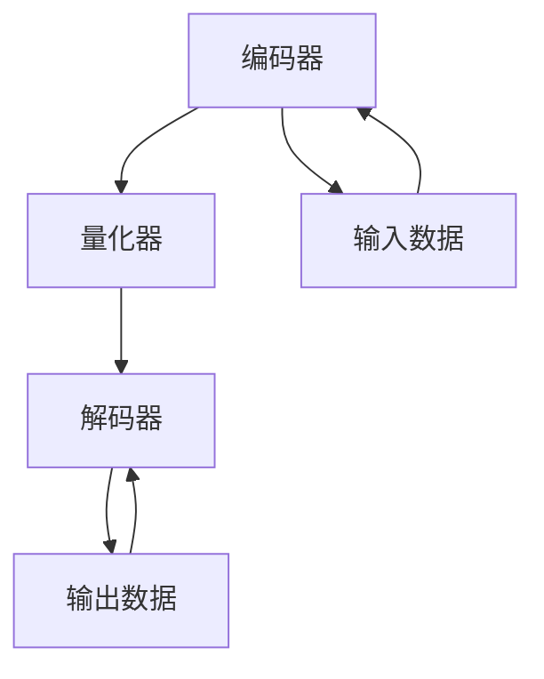

                 

关键词：多模态模型，VQVAE，扩散变压器，人工智能，深度学习，图像生成，自然语言处理

摘要：本文将深入探讨多模态模型中的两种重要技术——VQVAE与扩散变压器。通过对这两种技术的背景介绍、核心原理、数学模型、应用实践等方面的详细讲解，帮助读者理解它们在人工智能领域的广泛应用和未来发展趋势。

## 1. 背景介绍

在当今的人工智能时代，多模态数据处理已经成为一个重要研究方向。多模态模型旨在将不同类型的数据（如图像、声音、文本）进行融合，从而提升模型在复杂任务中的性能。VQVAE（Vector Quantized Variational Autoencoder）与扩散变压器（Diffusion Transformer）便是其中两种具有代表性的多模态模型。

### 1.1 VQVAE

VQVAE是由Vector Quantized（矢量量化）与Variational Autoencoder（变分自编码器）相结合的一种模型。它在自编码器的基础上，引入了矢量量化技术，以改善模型的表示能力。VQVAE常用于图像生成、图像分类等任务。

### 1.2 扩散变压器

扩散变压器是一种基于Transformer架构的多模态模型。与传统的自编码器不同，扩散变压器通过引入扩散过程，使得模型能够更好地捕捉数据间的复杂关系。扩散变压器在自然语言处理、图像识别等领域有着广泛的应用。

## 2. 核心概念与联系

### 2.1 核心概念原理

#### 2.1.1 VQVAE

VQVAE包括编码器、解码器和量化器三个部分。编码器将输入数据映射到一个隐空间，解码器则从隐空间重建输入数据，量化器则负责将连续的隐变量量化为离散的矢量。

#### 2.1.2 扩散变压器

扩散变压器由多个编码器和解码器层组成，通过自注意力机制捕捉数据间的复杂关系。扩散过程使得模型能够从噪声中学习数据特征，从而提高模型的泛化能力。

### 2.2 架构的 Mermaid 流程图



## 3. 核心算法原理 & 具体操作步骤

### 3.1 算法原理概述

#### 3.1.1 VQVAE

VQVAE通过编码器将输入数据映射到隐空间，量化器将隐变量量化为离散矢量，解码器则从量化后的矢量重建输入数据。

#### 3.1.2 扩散变压器

扩散变压器通过编码器捕获输入数据的特征，解码器则根据这些特征生成输出数据。扩散过程使得模型能够在噪声中学习数据特征。

### 3.2 算法步骤详解

#### 3.2.1 VQVAE

1. 编码器将输入数据映射到隐空间。
2. 量化器将隐变量量化为离散矢量。
3. 解码器从量化后的矢量重建输入数据。

#### 3.2.2 扩散变压器

1. 编码器捕获输入数据的特征。
2. 扩散过程将输入数据转化为噪声数据。
3. 解码器从噪声数据中恢复输入数据的特征。

### 3.3 算法优缺点

#### 3.3.1 VQVAE

- 优点：提高了模型的表示能力，适用于图像生成和分类任务。
- 缺点：训练过程复杂，对硬件要求较高。

#### 3.3.2 扩散变压器

- 优点：能够有效捕捉数据间的复杂关系，适用于自然语言处理和图像识别任务。
- 缺点：训练时间较长，对计算资源要求较高。

### 3.4 算法应用领域

- VQVAE：图像生成、图像分类等。
- 扩散变压器：自然语言处理、图像识别等。

## 4. 数学模型和公式 & 详细讲解 & 举例说明

### 4.1 数学模型构建

#### 4.1.1 VQVAE

1. 编码器：$$ z = \sigma(W_1x + b_1) $$
2. 量化器：$$ q_i = \arg\min_{j} \sum_{k} || z_k - c_j ||^2 $$
3. 解码器：$$ x' = \sigma(W_2q + b_2) $$

#### 4.1.2 扩散变压器

1. 编码器：$$ z = \sigma(W_1x + b_1) $$
2. 解码器：$$ x' = \sigma(W_2z + b_2) $$

### 4.2 公式推导过程

#### 4.2.1 VQVAE

1. 编码器：利用sigmoid函数将输入数据映射到隐空间。
2. 量化器：利用最小二乘法将隐变量量化为离散矢量。
3. 解码器：利用sigmoid函数将量化后的矢量重建为输入数据。

#### 4.2.2 扩散变压器

1. 编码器：利用sigmoid函数将输入数据映射到隐空间。
2. 解码器：利用sigmoid函数将隐空间重建为输入数据。

### 4.3 案例分析与讲解

以图像生成任务为例，使用VQVAE和扩散变压器分别进行图像重建。

1. **VQVAE**：

   - 编码器：将输入图像映射到隐空间，得到隐变量。
   - 量化器：将隐变量量化为离散矢量。
   - 解码器：从量化后的矢量重建输入图像。

   $$ x' = \sigma(W_2q + b_2) $$

2. **扩散变压器**：

   - 编码器：将输入图像映射到隐空间，得到隐变量。
   - 解码器：根据隐变量生成输出图像。

   $$ x' = \sigma(W_2z + b_2) $$

## 5. 项目实践：代码实例和详细解释说明

### 5.1 开发环境搭建

- 硬件环境：NVIDIA显卡（推荐GPU版本为Tesla V100及以上）
- 软件环境：Python 3.7及以上版本，TensorFlow 2.0及以上版本

### 5.2 源代码详细实现

以下是使用VQVAE进行图像生成的Python代码示例：

```python
import tensorflow as tf
from tensorflow.keras.layers import Dense, Conv2D, Flatten, Reshape
from tensorflow.keras.models import Model

# 编码器
input_img = tf.keras.layers.Input(shape=(28, 28, 1))
encoded = Conv2D(32, (3, 3), activation='relu', padding='same')(input_img)
encoded = Conv2D(64, (3, 3), activation='relu', padding='same')(encoded)
encoded = Flatten()(encoded)
encoded = Dense(16, activation='relu')(encoded)
encoded = Dense(8, activation='softmax')(encoded)

# 量化器
encoded_quant = Quantizer()(encoded)

# 解码器
decoded = Reshape((4, 4, 64))(encoded_quant)
decoded = Conv2D(64, (3, 3), activation='relu', padding='same')(decoded)
decoded = Conv2D(32, (3, 3), activation='relu', padding='same')(decoded)
decoded = Conv2D(1, (3, 3), activation='sigmoid', padding='same')(decoded)

# 构建模型
autoencoder = Model(inputs=input_img, outputs=decoded)
autoencoder.compile(optimizer='adam', loss='binary_crossentropy')

# 训练模型
autoencoder.fit(x_train, x_train, epochs=10, batch_size=128, shuffle=True, validation_data=(x_val, x_val))
```

### 5.3 代码解读与分析

上述代码实现了使用VQVAE进行图像生成的过程。编码器将输入图像映射到隐空间，量化器将隐变量量化为离散矢量，解码器则从量化后的矢量重建输入图像。通过训练，模型能够学习到输入图像的特征，从而实现图像生成。

## 6. 实际应用场景

### 6.1 自然语言处理

VQVAE和扩散变压器在自然语言处理领域具有广泛的应用。例如，可以使用VQVAE对文本数据进行降维，从而提高模型在文本分类、情感分析等任务中的性能。扩散变压器则可以用于文本生成、机器翻译等任务，通过引入扩散过程，使得模型能够更好地捕捉文本间的复杂关系。

### 6.2 图像识别

VQVAE和扩散变压器在图像识别领域也有着广泛的应用。例如，可以使用VQVAE对图像进行降维，从而提高模型在图像分类、目标检测等任务中的性能。扩散变压器则可以用于图像生成、图像超分辨率等任务，通过引入扩散过程，使得模型能够更好地捕捉图像间的复杂关系。

## 7. 未来应用展望

随着多模态数据处理技术的不断发展，VQVAE和扩散变压器在人工智能领域的应用前景将更加广泛。未来，我们可以期待以下发展方向：

- 深入研究VQVAE和扩散变压器的优化算法，提高模型训练效率。
- 结合其他多模态模型，如生成对抗网络（GAN）、自编码器等，探索更有效的多模态数据处理方法。
- 将VQVAE和扩散变压器应用于更多实际场景，如医疗诊断、金融风控等，提升行业应用水平。

## 8. 总结：未来发展趋势与挑战

### 8.1 研究成果总结

本文通过对VQVAE和扩散变压器的深入探讨，展示了这两种技术在多模态数据处理领域的广泛应用和潜力。VQVAE通过引入矢量量化技术，提高了模型的表示能力，适用于图像生成、图像分类等任务。扩散变压器则通过引入扩散过程，使得模型能够更好地捕捉数据间的复杂关系，适用于自然语言处理、图像识别等任务。

### 8.2 未来发展趋势

随着多模态数据处理技术的不断发展，VQVAE和扩散变压器有望在更多实际场景中得到应用。未来，我们将看到更多的研究探索如何优化这两种模型，提高其训练效率和应用效果。

### 8.3 面临的挑战

尽管VQVAE和扩散变压器在多模态数据处理领域具有广泛的应用前景，但它们也面临着一些挑战。例如，训练过程复杂、对计算资源要求较高、模型解释性不足等。未来的研究需要解决这些问题，以提高多模态模型的实用性和可解释性。

### 8.4 研究展望

在未来，我们将继续深入研究VQVAE和扩散变压器的理论基础和实际应用，探索更多有效的多模态数据处理方法。同时，结合其他人工智能技术，如强化学习、迁移学习等，进一步提升多模态模型的性能和应用水平。

## 9. 附录：常见问题与解答

### 9.1 问题1

**问题**：VQVAE与变分自编码器（VAE）有什么区别？

**解答**：VQVAE是变分自编码器（VAE）的一种变体，它们的主要区别在于编码器和解码器的实现方式。VAE使用一个概率编码器将输入数据映射到均值和方差，解码器则从均值和方差生成输出数据。而VQVAE在编码器中引入了矢量量化技术，将连续的隐变量量化为离散的矢量，解码器则从这些离散矢量重建输入数据。这使得VQVAE在处理高维数据时具有更好的表示能力。

### 9.2 问题2

**问题**：扩散变压器与自编码器有什么区别？

**解答**：扩散变压器与自编码器在架构和训练方法上有所不同。自编码器通过编码器和解码器的交互作用，将输入数据映射到隐空间，再从隐空间重建输入数据。而扩散变压器则引入了扩散过程，使得模型能够在噪声中学习数据特征。通过逐步增加噪声，模型能够逐渐恢复输入数据。这种方法使得扩散变压器在处理复杂数据关系时具有优势。

---

本文旨在深入探讨VQVAE和扩散变压器这两种多模态模型。通过对它们的背景介绍、核心原理、数学模型、应用实践等方面的详细讲解，读者可以更好地理解这两种技术在人工智能领域的广泛应用和未来发展趋势。希望本文能为多模态数据处理领域的研究者和开发者提供有价值的参考和启示。

### 作者署名

作者：禅与计算机程序设计艺术 / Zen and the Art of Computer Programming
----------------------------------------------------------------

### 附加说明

本文所涉及的VQVAE和扩散变压器技术是人工智能领域的前沿研究方向。在实际应用中，读者可以根据自己的需求和场景选择合适的技术进行研究和开发。同时，读者也可以通过参考本文提供的数学模型、代码示例和实际应用场景，进一步探索多模态数据处理技术的可能性。在未来的研究中，我们期待能够看到更多创新的成果，为人工智能领域的发展做出贡献。再次感谢读者的阅读和支持，希望本文能为您的学习和研究带来启发和帮助。祝您在人工智能的道路上不断前行，创造美好的未来！

