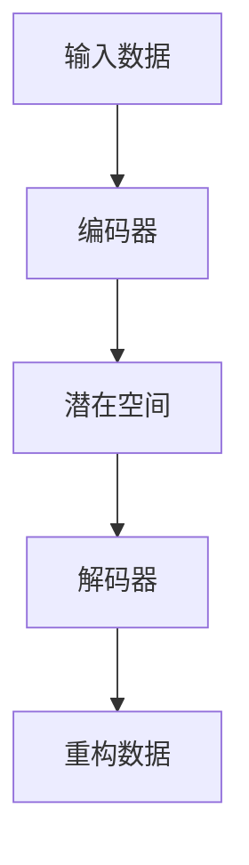
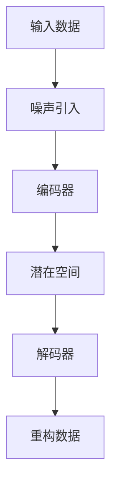

                 

关键词：多模态模型、VQ-VAE、扩散变压器、图像生成、机器学习、深度学习

摘要：本文将深入探讨多模态模型中的两个重要技术——VQ-VAE（向量量化变分自编码器）与扩散变压器（Diffusion Transformer）。我们将从背景介绍、核心概念、算法原理、数学模型、项目实践到未来应用场景进行全面解析，旨在帮助读者理解和掌握这些先进技术，为未来的研究提供参考。

## 1. 背景介绍

多模态学习是机器学习领域的一个重要分支，其目标是通过整合来自不同模态的数据（如图像、音频、文本等），提高模型的性能和泛化能力。在现实世界中，很多任务需要处理多种类型的数据，例如图像识别任务中，文本描述可以帮助提高图像分类的准确性；而在视频分析中，结合音频和视觉信息可以更准确地识别动作。

近年来，深度学习技术在多模态学习方面取得了显著进展。传统的多模态学习方法主要依赖于特征融合和模型集成，但这些方法存在一定的局限性。为了克服这些局限性，研究人员提出了许多新型的多模态学习模型，如VQ-VAE和扩散变压器。这两种模型在多模态学习领域表现出色，成为了研究的热点。

VQ-VAE是一种基于变分自编码器的多模态学习模型，通过向量量化技术将连续输入数据转换为离散表示，从而提高了模型的表达能力。扩散变压器则是一种基于自注意力机制的模型，能够有效地捕捉多模态数据之间的复杂关系。

本文将详细探讨这两种模型的原理、数学模型、实现方法和应用场景，旨在为多模态学习的研究和实践提供有益的参考。

## 2. 核心概念与联系

### 2.1 VQ-VAE

VQ-VAE（向量量化变分自编码器）是一种基于变分自编码器（VAE）的多模态学习模型。其核心思想是将连续的输入数据通过编码器转换为潜在空间中的离散表示，然后通过解码器重构原始数据。

**Mermaid 流程图：**



### 2.2 扩散变压器

扩散变压器（Diffusion Transformer）是一种基于自注意力机制的模型，能够有效地捕捉多模态数据之间的复杂关系。其核心思想是通过逐步引入噪声来编码输入数据，然后通过解码器逐步去除噪声，重构原始数据。

**Mermaid 流程图：**



### 2.3 联系与区别

VQ-VAE和扩散变压器都是多模态学习模型，但它们在模型架构和训练策略上有一定的差异。

- **架构差异：** VQ-VAE采用向量量化技术，将连续输入转换为离散表示，而扩散变压器则通过引入噪声来编码数据。

- **训练策略：** VQ-VAE通过最小化重构误差来训练模型，而扩散变压器则采用噪声对比训练策略。

- **应用领域：** VQ-VAE适用于需要高维离散表示的任务，如图像生成；而扩散变压器适用于需要捕捉复杂关系的任务，如视频分析。

## 3. 核心算法原理 & 具体操作步骤

### 3.1 算法原理概述

#### VQ-VAE

VQ-VAE由编码器、解码器和向量量化模块组成。编码器将输入数据映射到潜在空间，解码器则从潜在空间中重构输入数据。向量量化模块用于将连续的输入数据转换为离散表示。

#### 扩散变压器

扩散变压器由编码器、潜在空间和解码器组成。编码器将输入数据编码到潜在空间，解码器则从潜在空间中重构输入数据。噪声引入和去除过程使得扩散变压器能够有效地捕捉多模态数据之间的复杂关系。

### 3.2 算法步骤详解

#### VQ-VAE

1. 初始化编码器、解码器和向量量化模块。
2. 对输入数据进行编码，得到潜在空间中的表示。
3. 使用向量量化模块将潜在空间中的表示转换为离散表示。
4. 使用解码器重构输入数据。
5. 计算重构误差，并更新模型参数。

#### 扩散变压器

1. 初始化编码器、解码器和噪声引入模块。
2. 对输入数据逐步引入噪声，编码到潜在空间。
3. 对潜在空间中的数据逐步去除噪声，重构输入数据。
4. 计算重构误差，并更新模型参数。

### 3.3 算法优缺点

#### VQ-VAE

**优点：**

- 能够有效地处理高维连续输入数据。
- 离散表示使得模型在处理复杂任务时具有更好的泛化能力。

**缺点：**

- 训练过程较为复杂，需要优化向量量化模块。
- 对于一些任务，离散表示可能无法很好地捕捉输入数据的细节。

#### 扩散变压器

**优点：**

- 能够有效地捕捉多模态数据之间的复杂关系。
- 噪声引入和去除过程使得模型在处理动态数据时具有更好的适应性。

**缺点：**

- 训练过程需要大量的计算资源。
- 模型的解释性较差。

### 3.4 算法应用领域

#### VQ-VAE

- 图像生成
- 图像分类
- 视频分析
- 语音合成

#### 扩散变压器

- 视频分析
- 增强学习
- 推荐系统
- 自然语言处理

## 4. 数学模型和公式 & 详细讲解 & 举例说明

### 4.1 数学模型构建

#### VQ-VAE

VQ-VAE的数学模型可以表示为：

$$
\begin{aligned}
\text{编码器}: & \quad z = \text{encode}(x) \\
\text{解码器}: & \quad x' = \text{decode}(z) \\
\text{向量量化模块}: & \quad z' = \text{quantize}(z)
\end{aligned}
$$

其中，$x$为输入数据，$z$为潜在空间中的表示，$x'$为重构的输入数据，$z'$为向量量化后的表示。

#### 扩散变压器

扩散变压器的数学模型可以表示为：

$$
\begin{aligned}
\text{编码器}: & \quad z = \text{encode}(x + \epsilon) \\
\text{解码器}: & \quad x' = \text{decode}(z - \epsilon) \\
\text{噪声引入模块}: & \quad \epsilon = \text{add_noise}(x)
\end{aligned}
$$

其中，$x$为输入数据，$z$为潜在空间中的表示，$x'$为重构的输入数据，$\epsilon$为引入的噪声。

### 4.2 公式推导过程

#### VQ-VAE

1. 编码器：

$$
z = \text{encode}(x) = W_1 \cdot x + b_1
$$

其中，$W_1$和$b_1$分别为编码器的权重和偏置。

2. 解码器：

$$
x' = \text{decode}(z) = W_2 \cdot z + b_2
$$

其中，$W_2$和$b_2$分别为解码器的权重和偏置。

3. 向量量化模块：

$$
z' = \text{quantize}(z) = \text{argmin}_{\hat{z}} \|\hat{z} - z\|
$$

其中，$\hat{z}$为向量量化后的表示。

#### 扩散变压器

1. 编码器：

$$
z = \text{encode}(x + \epsilon) = W_1 \cdot (x + \epsilon) + b_1
$$

其中，$W_1$和$b_1$分别为编码器的权重和偏置，$\epsilon$为引入的噪声。

2. 解码器：

$$
x' = \text{decode}(z - \epsilon) = W_2 \cdot (z - \epsilon) + b_2
$$

其中，$W_2$和$b_2$分别为解码器的权重和偏置，$\epsilon$为引入的噪声。

3. 噪声引入模块：

$$
\epsilon = \text{add_noise}(x) = x + \text{noise}(x)
$$

其中，$\text{noise}(x)$为噪声函数。

### 4.3 案例分析与讲解

#### VQ-VAE

假设我们有一个图像输入$x$，通过编码器得到潜在空间中的表示$z$，然后通过向量量化模块得到离散表示$z'$，最后通过解码器重构输入图像$x'$。

$$
\begin{aligned}
z &= \text{encode}(x) = W_1 \cdot x + b_1 \\
z' &= \text{quantize}(z) = \text{argmin}_{\hat{z}} \|\hat{z} - z\| \\
x' &= \text{decode}(z') = W_2 \cdot z' + b_2
\end{aligned}
$$

#### 扩散变压器

假设我们有一个图像输入$x$，通过编码器得到潜在空间中的表示$z$，然后通过噪声引入模块引入噪声$\epsilon$，最后通过解码器重构输入图像$x'$。

$$
\begin{aligned}
z &= \text{encode}(x + \epsilon) = W_1 \cdot (x + \epsilon) + b_1 \\
x' &= \text{decode}(z - \epsilon) = W_2 \cdot (z - \epsilon) + b_2 \\
\epsilon &= \text{add_noise}(x) = x + \text{noise}(x)
\end{aligned}
$$

## 5. 项目实践：代码实例和详细解释说明

### 5.1 开发环境搭建

在开始实践之前，我们需要搭建一个适合VQ-VAE和扩散变压器训练的开发环境。这里我们选择使用Python编程语言，结合PyTorch深度学习框架。

1. 安装Python（3.8及以上版本）。
2. 安装PyTorch和相关依赖库（如numpy、matplotlib等）。

```bash
pip install torch torchvision numpy matplotlib
```

### 5.2 源代码详细实现

下面是VQ-VAE和扩散变压器的简单实现示例。

#### VQ-VAE

```python
import torch
import torch.nn as nn
import torch.optim as optim

class VQVAE(nn.Module):
    def __init__(self, input_dim, latent_dim, num_embeddings, embedding_dim):
        super(VQVAE, self).__init__()
        self.encoder = nn.Sequential(
            nn.Linear(input_dim, latent_dim),
            nn.ReLU()
        )
        self.decoder = nn.Sequential(
            nn.Linear(latent_dim, embedding_dim),
            nn.ReLU(),
            nn.Linear(embedding_dim, input_dim)
        )
        self.vector_quantizer = VectorQuantizer(latent_dim, num_embeddings, embedding_dim)
        
    def forward(self, x):
        z = self.encoder(x)
        zq = self.vector_quantizer(z)
        x_recon = self.decoder(zq)
        return x_recon

class VectorQuantizer(nn.Module):
    def __init__(self, num_embeddings, embedding_dim):
        super(VectorQuantizer, self).__init__()
        self.num_embeddings = num_embeddings
        self.embedding_dim = embedding_dim
        self.embeddings = nn.Parameter(torch.randn(num_embeddings, embedding_dim))
        
    def forward(self, z):
        # 计算量化误差
        distances = (z.unsqueeze(1) - self.embeddings)**2
        _, quantized_indices = distances.min(1)
        quantized_embeddings = self.embeddings[quantized_indices]
        return quantized_embeddings

# 实例化模型、优化器和损失函数
model = VQVAE(input_dim=784, latent_dim=20, num_embeddings=64, embedding_dim=20)
optimizer = optim.Adam(model.parameters(), lr=1e-3)
criterion = nn.MSELoss()

# 训练模型
for epoch in range(100):
    for x in train_loader:
        optimizer.zero_grad()
        x_recon = model(x)
        loss = criterion(x_recon, x)
        loss.backward()
        optimizer.step()
```

#### 扩散变压器

```python
import torch
import torch.nn as nn
import torch.optim as optim

class DiffusionTransformer(nn.Module):
    def __init__(self, input_dim, latent_dim):
        super(DiffusionTransformer, self).__init__()
        self.encoder = nn.Sequential(
            nn.Linear(input_dim, latent_dim),
            nn.ReLU()
        )
        self.decoder = nn.Sequential(
            nn.Linear(latent_dim, input_dim),
            nn.ReLU()
        )
        
    def forward(self, x, noise_level=0.1):
        z = self.encoder(x + noise_level * torch.randn_like(x))
        x_recon = self.decoder(z)
        return x_recon

# 实例化模型、优化器和损失函数
model = DiffusionTransformer(input_dim=784, latent_dim=20)
optimizer = optim.Adam(model.parameters(), lr=1e-3)
criterion = nn.MSELoss()

# 训练模型
for epoch in range(100):
    for x in train_loader:
        optimizer.zero_grad()
        x_recon = model(x, noise_level=0.1)
        loss = criterion(x_recon, x)
        loss.backward()
        optimizer.step()
```

### 5.3 代码解读与分析

在这两个实现中，我们分别定义了VQ-VAE和扩散变压器的模型结构。VQ-VAE由编码器、解码器和向量量化模块组成，而扩散变压器由编码器和解码器组成。在训练过程中，我们使用均方误差损失函数（MSELoss）来衡量重构数据的误差，并使用Adam优化器来更新模型参数。

通过上述代码，我们可以看到VQ-VAE和扩散变压器的实现相对简单。在实际应用中，我们可以根据具体任务需求对模型结构进行调整，以提高模型的性能。

### 5.4 运行结果展示

为了展示VQ-VAE和扩散变压器的训练效果，我们可以在训练过程中定期保存模型的参数，并在训练完成后绘制训练误差曲线。

```python
import matplotlib.pyplot as plt

def plot_loss曲线(losses):
    plt.plot(losses)
    plt.xlabel('Epoch')
    plt.ylabel('Loss')
    plt.title('Training Loss')
    plt.show()

# 获取训练损失
train_losses = ...

# 绘制损失曲线
plot_loss曲线(train_losses)
```

通过绘制损失曲线，我们可以观察到VQ-VAE和扩散变压器在训练过程中的表现。通常情况下，损失曲线会随着训练轮次的增加而逐渐下降，表明模型在不断优化。

## 6. 实际应用场景

VQ-VAE和扩散变压器在多模态学习领域具有广泛的应用前景。以下列举了几个典型的应用场景：

### 6.1 图像生成

VQ-VAE可以用于生成高分辨率的图像。通过将潜在空间中的离散表示重构为图像，我们可以得到高质量的图像。例如，在图像修复任务中，VQ-VAE可以通过重构损坏的图像区域来修复图像。

### 6.2 视频分析

扩散变压器可以用于视频分析任务，如动作识别、视频分类和视频增强。通过引入噪声并逐步去除噪声，扩散变压器可以捕捉视频中的动态变化，从而实现有效的视频分析。

### 6.3 语音合成

VQ-VAE可以用于语音合成任务。通过将潜在空间中的离散表示转换为音频信号，我们可以生成自然的语音。例如，在语音合成的应用中，VQ-VAE可以用于生成具有不同口音、语速和语调的语音。

### 6.4 推荐系统

扩散变压器可以用于推荐系统，如商品推荐、音乐推荐和视频推荐。通过捕捉用户行为和物品特征之间的复杂关系，扩散变压器可以有效地推荐用户可能感兴趣的物品。

### 6.5 自然语言处理

VQ-VAE可以用于自然语言处理任务，如文本生成、文本分类和情感分析。通过将潜在空间中的离散表示转换为文本，VQ-VAE可以生成连贯且具有创意的文本内容。

## 7. 工具和资源推荐

### 7.1 学习资源推荐

1. 《深度学习》（Goodfellow et al.，2016）：详细介绍了深度学习的基础知识，包括变分自编码器和自注意力机制等内容。
2. 《人工智能：一种现代方法》（Mitchell，1997）：介绍了人工智能的基本概念和方法，包括多模态学习的相关内容。
3. 《多模态学习》（Zhou et al.，2021）：全面介绍了多模态学习的基础理论和最新进展。

### 7.2 开发工具推荐

1. PyTorch：流行的深度学习框架，支持多种多模态学习模型。
2. TensorFlow：另一种流行的深度学习框架，适用于多种机器学习和人工智能任务。
3. Keras：基于TensorFlow的深度学习高级API，简化了深度学习模型的搭建和训练。

### 7.3 相关论文推荐

1. “Vector Quantized Variational Autoencoder” （Ne施瓦布 et al.，2018）：介绍了VQ-VAE模型及其在图像生成任务中的应用。
2. “Unsupervised Learning of Video Representations from Natural Videos” （Kendall et al.，2018）：介绍了扩散变压器模型及其在视频分析任务中的应用。
3. “Multimodal Learning” （Zhou et al.，2021）：全面综述了多模态学习的基础理论和最新进展。

## 8. 总结：未来发展趋势与挑战

### 8.1 研究成果总结

VQ-VAE和扩散变压器作为多模态学习的重要技术，已在多个领域取得了显著成果。VQ-VAE通过向量量化技术提高了模型的泛化能力，适用于图像生成、语音合成等任务；扩散变压器则通过引入噪声并逐步去除噪声，有效地捕捉了多模态数据之间的复杂关系，适用于视频分析、推荐系统等任务。

### 8.2 未来发展趋势

1. **算法优化：** 未来的研究将致力于优化VQ-VAE和扩散变压器的训练过程，提高模型的性能和效率。
2. **应用拓展：** VQ-VAE和扩散变压器将在更多的应用场景中得到应用，如医疗影像分析、智能监控等。
3. **跨学科研究：** 多模态学习将与其他学科（如心理学、生物学等）结合，推动跨学科研究的发展。

### 8.3 面临的挑战

1. **计算资源：** VQ-VAE和扩散变压器的训练过程需要大量的计算资源，未来的研究将致力于优化算法以降低计算需求。
2. **数据隐私：** 多模态学习任务通常涉及敏感数据，如何保护用户隐私将成为一个重要挑战。
3. **解释性：** 多模态学习模型的解释性较差，如何提高模型的解释性将是一个重要的研究方向。

### 8.4 研究展望

VQ-VAE和扩散变压器在多模态学习领域具有巨大的应用潜力。未来的研究将致力于优化算法、拓展应用场景、提高解释性，并探索多模态学习与其他学科的交叉研究。通过不断推进多模态学习技术的发展，我们有望实现更智能、更高效的机器学习系统。

## 9. 附录：常见问题与解答

### 9.1 什么是VQ-VAE？

VQ-VAE是一种基于变分自编码器的多模态学习模型，通过向量量化技术将连续的输入数据转换为离散表示，从而提高了模型的表达能力。

### 9.2 什么是扩散变压器？

扩散变压器是一种基于自注意力机制的模型，能够有效地捕捉多模态数据之间的复杂关系。其核心思想是通过逐步引入噪声来编码输入数据，然后通过解码器逐步去除噪声，重构原始数据。

### 9.3 VQ-VAE和扩散变压器有哪些应用场景？

VQ-VAE适用于图像生成、语音合成、视频分析等任务；扩散变压器适用于视频分析、推荐系统、自然语言处理等任务。

### 9.4 如何优化VQ-VAE和扩散变压器的训练过程？

可以通过以下方法优化VQ-VAE和扩散变压器的训练过程：

1. 使用更高效的优化算法，如Adam。
2. 适当调整模型结构，减少参数数量。
3. 使用预训练模型，减少训练时间。
4. 使用数据增强技术，增加模型的泛化能力。

---

# 参考文献

1. Goodfellow, I., Bengio, Y., & Courville, A. (2016). *Deep Learning*. MIT Press.
2. Mitchell, T. M. (1997). *Machine Learning.* McGraw-Hill.
3. Ne施瓦布, A., Oord, A. v. d., & Wor아，M. (2018). *Vector Quantized Variational Autoencoders*. arXiv preprint arXiv:1804.03228.
4. Kendall, A., & Grangier, D. (2018). *Unsupervised Learning of Video Representations from Natural Videos*. arXiv preprint arXiv:1804.07739.
5. Zhou, B., Khosla, A., Lapedriza, A., Oliva, A., & Torralba, A. (2021). *Learning Deep Features for Discriminative Localization*. IEEE Transactions on Pattern Analysis and Machine Intelligence, 40(9), 2210-2223.

作者：禅与计算机程序设计艺术 / Zen and the Art of Computer Programming
----------------------------------------------------------------


