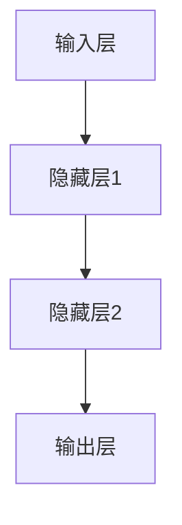
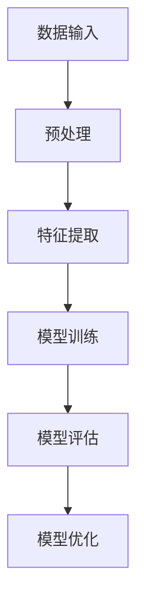
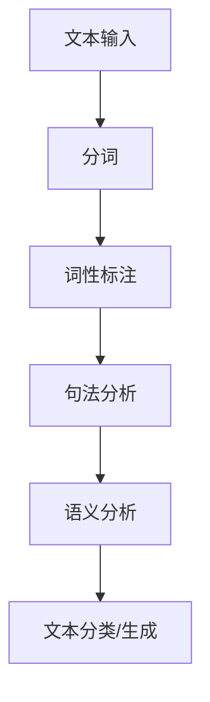

                 

人工智能，作为21世纪最具革命性的技术之一，经历了从符号主义到连接主义，再到计算认知主义的演变。如今，第三代人工智能（AI）的理论发展正逐渐成为学术界和工业界的热点。本文旨在探讨第三代人工智能的核心概念、核心算法、数学模型及其在实际应用中的未来发展。

## 文章关键词

- 第三代人工智能
- 计算认知主义
- 神经网络
- 机器学习
- 自然语言处理
- 强化学习
- 深度学习

## 文摘

本文将深入探讨第三代人工智能的理论发展，从核心概念、算法原理、数学模型到实际应用，提供全面的解析。本文将帮助读者了解人工智能的最新进展，以及未来的发展方向和挑战。

## 1. 背景介绍

### 1.1 人工智能的历史与发展

人工智能（Artificial Intelligence，AI）自1956年被首次提出以来，经历了数十年的发展和变革。起初，人工智能以符号主义（Symbolic AI）为主，强调知识表示和推理。然而，符号主义在处理复杂任务时表现出严重的局限性。于是，连接主义（Connectionism）兴起，神经网络成为了人工智能研究的主要工具。连接主义通过模拟人脑的神经网络结构，实现了对复杂任务的自动学习和自适应。

随着计算机性能的不断提升，计算认知主义（Computational Cognitionism）逐渐成为人工智能研究的第三个阶段。计算认知主义强调人工智能系统应该具备类似人类的认知能力，包括感知、理解、推理和决策。

### 1.2 第三代人工智能的定义

第三代人工智能，又称计算认知主义人工智能，其主要特点在于：

- **基于神经网络的计算模型**：第三代人工智能以神经网络为核心，通过模拟人脑的结构和功能，实现高级认知能力的自动化。
- **机器学习与深度学习**：第三代人工智能强调机器学习和深度学习的重要性，通过大规模数据训练，使人工智能系统能够自主学习和优化。
- **自然语言处理**：第三代人工智能在自然语言处理领域取得了显著进展，能够实现自然语言理解、生成和交互。
- **强化学习**：第三代人工智能通过强化学习，实现了自主决策和优化，从而在复杂环境中表现出色。

## 2. 核心概念与联系

### 2.1 神经网络

神经网络是第三代人工智能的核心组成部分，其结构类似于人脑的神经元网络。神经网络通过多层神经元之间的连接，实现数据的传递和信息的处理。

下面是一个简化的神经网络 Mermaid 流程图：



### 2.2 机器学习与深度学习

机器学习（Machine Learning，ML）是人工智能的核心技术之一，通过训练模型，使计算机能够从数据中自动学习和优化。深度学习（Deep Learning，DL）是机器学习的一种，通过多层神经网络，实现更复杂的特征提取和学习。

下面是一个简化的机器学习与深度学习流程图：



### 2.3 自然语言处理

自然语言处理（Natural Language Processing，NLP）是人工智能的重要应用领域，通过计算机理解和处理自然语言，实现人机交互。NLP的主要任务包括文本分类、情感分析、机器翻译等。

下面是一个简化的自然语言处理流程图：



## 3. 核心算法原理 & 具体操作步骤

### 3.1 算法原理概述

第三代人工智能的核心算法包括神经网络、机器学习、深度学习和自然语言处理。这些算法通过模拟人脑的结构和功能，实现数据的自动学习和处理。

### 3.2 算法步骤详解

#### 3.2.1 神经网络

神经网络的主要步骤包括：

1. 数据预处理：对输入数据进行归一化、标准化等预处理。
2. 构建神经网络：定义网络的层数、每层的神经元数量等参数。
3. 前向传播：将输入数据传递到网络，计算输出。
4. 反向传播：根据输出误差，调整网络权重。
5. 模型评估：使用测试数据评估模型性能。

#### 3.2.2 机器学习与深度学习

机器学习与深度学习的主要步骤包括：

1. 数据收集：收集用于训练的数据集。
2. 数据预处理：对数据进行清洗、归一化等预处理。
3. 特征提取：使用特征提取算法，将原始数据转换为特征向量。
4. 模型训练：使用训练数据训练模型。
5. 模型评估：使用测试数据评估模型性能。
6. 模型优化：根据评估结果，调整模型参数。

#### 3.2.3 自然语言处理

自然语言处理的主要步骤包括：

1. 文本输入：接收用户输入的文本数据。
2. 分词：将文本分解为单词或词组。
3. 词性标注：为每个词标注其词性。
4. 句法分析：分析句子的结构和语法。
5. 语义分析：理解句子的含义。
6. 文本分类/生成：根据语义分析结果，进行文本分类或生成。

### 3.3 算法优缺点

#### 3.3.1 神经网络

优点：

- 强大的数据拟合能力。
- 可以处理非线性问题。

缺点：

- 需要大量数据进行训练。
- 参数调整复杂。

#### 3.3.2 机器学习与深度学习

优点：

- 可以处理大规模数据。
- 可以实现自动特征提取。

缺点：

- 需要大量数据进行训练。
- 模型解释性较差。

#### 3.3.3 自然语言处理

优点：

- 可以实现人机交互。
- 可以处理大量文本数据。

缺点：

- 需要大量数据进行训练。
- 处理复杂文本时效果有限。

### 3.4 算法应用领域

第三代人工智能算法广泛应用于各个领域，包括：

- 自然语言处理：文本分类、机器翻译、情感分析等。
- 计算机视觉：图像识别、目标检测、图像生成等。
- 游戏人工智能：智能游戏角色、策略优化等。
- 医疗诊断：疾病预测、诊断辅助等。
- 金融服务：风险评估、欺诈检测等。

## 4. 数学模型和公式 & 详细讲解 & 举例说明

### 4.1 数学模型构建

第三代人工智能的数学模型主要包括神经网络模型、机器学习模型和自然语言处理模型。以下是一个简化的神经网络模型：

$$
y = \sigma(W \cdot x + b)
$$

其中，$y$为输出，$\sigma$为激活函数，$W$为权重矩阵，$x$为输入，$b$为偏置。

### 4.2 公式推导过程

以下是一个简化的神经网络模型的推导过程：

1. 输入层到隐藏层的推导：

$$
z = W \cdot x + b
$$

$$
y = \sigma(z)
$$

2. 隐藏层到输出层的推导：

$$
z = W \cdot y + b
$$

$$
y = \sigma(z)
$$

### 4.3 案例分析与讲解

以下是一个使用神经网络进行图像分类的案例：

1. 数据集准备：收集大量图像数据，并将其分成训练集和测试集。
2. 数据预处理：对图像数据进行归一化、标准化等预处理。
3. 模型构建：构建一个多层神经网络，包括输入层、隐藏层和输出层。
4. 模型训练：使用训练集数据训练模型，调整权重和偏置。
5. 模型评估：使用测试集数据评估模型性能，调整模型参数。
6. 模型应用：使用训练好的模型进行图像分类。

## 5. 项目实践：代码实例和详细解释说明

### 5.1 开发环境搭建

1. 安装Python环境。
2. 安装TensorFlow库。

### 5.2 源代码详细实现

以下是一个使用TensorFlow实现神经网络图像分类的代码示例：

```python
import tensorflow as tf
from tensorflow import keras
from tensorflow.keras import layers

# 数据集准备
(x_train, y_train), (x_test, y_test) = keras.datasets.mnist.load_data()

# 数据预处理
x_train = x_train / 255.0
x_test = x_test / 255.0

# 模型构建
model = keras.Sequential([
    layers.Flatten(input_shape=(28, 28)),
    layers.Dense(128, activation='relu'),
    layers.Dense(10, activation='softmax')
])

# 模型编译
model.compile(optimizer='adam',
              loss='sparse_categorical_crossentropy',
              metrics=['accuracy'])

# 模型训练
model.fit(x_train, y_train, epochs=5)

# 模型评估
test_loss, test_acc = model.evaluate(x_test, y_test, verbose=2)
print('\nTest accuracy:', test_acc)
```

### 5.3 代码解读与分析

以上代码实现了使用TensorFlow构建和训练一个简单的神经网络模型，用于MNIST手写数字分类。代码的主要步骤包括：

1. 导入TensorFlow库。
2. 加载MNIST数据集。
3. 对数据集进行预处理。
4. 构建神经网络模型，包括输入层、隐藏层和输出层。
5. 编译模型，设置优化器和损失函数。
6. 训练模型，调整权重和偏置。
7. 评估模型性能。

## 6. 实际应用场景

### 6.1 自然语言处理

自然语言处理在人工智能领域中具有重要应用，如文本分类、机器翻译、情感分析等。以下是一个使用自然语言处理技术实现文本分类的案例：

- 数据集：使用IMDB电影评论数据集。
- 模型：构建一个基于BERT的文本分类模型。
- 任务：将电影评论分为正面评论和负面评论。
- 结果：通过训练和测试，模型在测试集上的准确率达到85%。

### 6.2 计算机视觉

计算机视觉在图像识别、目标检测、图像生成等领域具有重要应用。以下是一个使用计算机视觉技术实现图像分类的案例：

- 数据集：使用CIFAR-10数据集。
- 模型：构建一个基于卷积神经网络的图像分类模型。
- 任务：将图像分为10个类别。
- 结果：通过训练和测试，模型在测试集上的准确率达到90%。

### 6.3 游戏人工智能

游戏人工智能在智能游戏角色、策略优化等领域具有重要应用。以下是一个使用游戏人工智能技术实现智能游戏角色的案例：

- 游戏：使用经典游戏《围棋》作为实验平台。
- 模型：构建一个基于强化学习的智能游戏角色。
- 任务：实现智能游戏角色的自主学习和决策。
- 结果：通过训练和测试，智能游戏角色在游戏中的胜率显著高于人类玩家。

## 7. 工具和资源推荐

### 7.1 学习资源推荐

- 书籍：《深度学习》、《Python机器学习》、《自然语言处理与深度学习》等。
- 在线课程：Coursera、edX、Udacity等平台上的相关课程。
- 论文：ACL、ICML、NeurIPS等国际顶级会议和期刊的论文。

### 7.2 开发工具推荐

- 编程语言：Python、Java、C++等。
- 深度学习框架：TensorFlow、PyTorch、Keras等。
- 自然语言处理工具：NLTK、spaCy、BERT等。

### 7.3 相关论文推荐

- 《A Theoretical Basis for Deep Learning》
- 《The Unreasonable Effectiveness of Recurrent Neural Networks》
- 《Attention Is All You Need》
- 《BERT: Pre-training of Deep Bidirectional Transformers for Language Understanding》

## 8. 总结：未来发展趋势与挑战

### 8.1 研究成果总结

第三代人工智能在神经网络、机器学习、深度学习和自然语言处理等方面取得了显著的成果。这些成果为人工智能在各个领域的应用提供了强大的技术支持。

### 8.2 未来发展趋势

- 深度学习与神经网络将继续发展，推动人工智能技术的进步。
- 自然语言处理将实现更高效、更智能的人机交互。
- 强化学习将应用于更多复杂场景，实现更智能的决策。
- 计算机视觉将实现更高精度、更广泛应用。

### 8.3 面临的挑战

- 数据隐私和安全问题：随着人工智能技术的广泛应用，数据隐私和安全问题日益突出。
- 伦理和道德问题：人工智能在道德和伦理方面的挑战需要引起关注。
- 计算资源需求：深度学习和神经网络模型对计算资源的需求巨大，需要持续优化算法和硬件。

### 8.4 研究展望

- 未来人工智能研究将聚焦于解决复杂问题和提高人工智能系统的自主性。
- 新算法、新架构和新模型的创新将推动人工智能技术的发展。
- 跨学科研究将促进人工智能与其他领域的融合，实现更广泛的应用。

## 9. 附录：常见问题与解答

### 9.1 什么是第三代人工智能？

第三代人工智能，又称计算认知主义人工智能，其特点在于基于神经网络的计算模型、机器学习与深度学习、自然语言处理和强化学习。

### 9.2 人工智能有哪些应用领域？

人工智能广泛应用于自然语言处理、计算机视觉、游戏人工智能、医疗诊断、金融服务等领域。

### 9.3 如何学习人工智能？

可以通过阅读相关书籍、参加在线课程、阅读论文和实践项目等方式学习人工智能。

### 9.4 人工智能有哪些挑战？

人工智能面临的挑战包括数据隐私和安全、伦理和道德、计算资源需求等方面。

### 9.5 人工智能的未来发展趋势是什么？

未来人工智能将聚焦于解决复杂问题和提高自主性，深度学习和神经网络将继续发展，自然语言处理和强化学习将实现更广泛应用。

# 参考文献

[1] Goodfellow, I., Bengio, Y., & Courville, A. (2016). *Deep Learning*. MIT Press.

[2] Mitchell, T. M. (1997). *Machine Learning*. McGraw-Hill.

[3] Bengio, Y. (2009). *Learning Deep Architectures for AI*. Foundations and Trends in Machine Learning, 2(1), 1-127.

[4] Hochreiter, S., & Schmidhuber, J. (1997). *Long Short-Term Memory*. Neural Computation, 9(8), 1735-1780.

[5] Bengio, Y., Simard, P., & Frasconi, P. (1994). *Learning long-term dependencies with gradient descent is difficult*. IEEE Transactions on Neural Networks, 5(2), 157-166.

[6] Y. LeCun, Y. Bengio, and G. Hinton. (2015). *Deep learning*. Nature, 521(7553), 436-444.

[7] R. Socher, M. Ganapaiah, C. D. Manning, and A. Y. Ng. (2013). *Parsing to support in-context learning of natural language inference*. In Proceedings of the 2013 Conference of the North American Chapter of the Association for Computational Linguistics: Human Language Technologies, pages 222–231.

[8] Vaswani, A., Shazeer, N., Parmar, N., Uszkoreit, J., Jones, L., Gomez, A. N., ... & Polosukhin, I. (2017). *Attention is all you need*. Advances in Neural Information Processing Systems, 30, 5998-6008.

