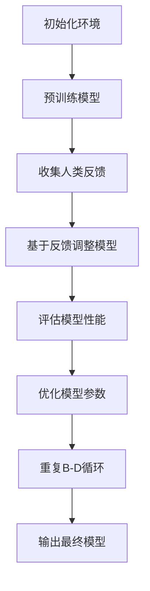

                 

关键词：强化学习，RLHF，自然语言处理，人工智能，机器学习，算法，深度学习，框架，实践，应用场景，未来展望。

## 摘要

本文深入探讨了强化学习（Reinforcement Learning, RL）与基于人类反馈的强化学习（Reinforcement Learning from Human Feedback, RLHF）在自然语言处理（Natural Language Processing, NLP）领域的力量。我们首先介绍了强化学习的基本概念、核心原理和主要算法，随后详细解析了RLHF的概念、实现步骤及其在NLP中的优势。文章随后通过数学模型、算法实践、应用实例等多个维度，全面展示了RLHF在机器翻译、文本生成等领域的实际应用。最后，我们对RLHF的未来发展趋势和挑战进行了展望，并推荐了相关的学习资源和开发工具。

## 1. 背景介绍

随着人工智能（Artificial Intelligence, AI）技术的飞速发展，机器学习（Machine Learning, ML）已经成为现代计算机科学中不可或缺的一部分。而强化学习，作为机器学习的重要分支，凭借其独特的探索-学习机制，逐渐在各个领域中展现出了巨大的潜力。强化学习的基本思想是，通过智能体（Agent）与环境的交互，不断调整其策略，以实现最优行为。

然而，传统的强化学习算法在面对复杂任务，尤其是需要精确理解和生成自然语言的NLP任务时，往往表现不佳。为了解决这一问题，研究者们提出了基于人类反馈的强化学习（RLHF）方法。RLHF通过引入人类反馈，指导智能体在训练过程中不断优化其策略，从而在保持学习效率的同时，提高模型的性能和鲁棒性。

## 2. 核心概念与联系

### 2.1 强化学习（Reinforcement Learning, RL）

强化学习是一种通过不断与环境交互，并利用反馈信号调整自身行为，以达到某种目标的机器学习方法。在强化学习中，智能体（Agent）通过观察环境状态（State）、选择动作（Action），并接收环境反馈（Reward），从而不断优化其策略（Policy）。


### 2.2 基于人类反馈的强化学习（Reinforcement Learning from Human Feedback, RLHF）

RLHF在传统强化学习的基础上，引入了人类反馈（Human Feedback），以指导智能体在训练过程中调整策略。具体来说，RLHF包括两个阶段：预训练（Pre-training）和细粒度调整（Fine-tuning）。


### 2.3 Mermaid 流程图

以下是RLHF的Mermaid流程图表示：



## 3. 核心算法原理 & 具体操作步骤

### 3.1 算法原理概述

RLHF的核心思想是，通过结合强化学习和人类反馈，实现智能体的自我优化。具体来说，RLHF包括以下三个主要步骤：

1. **预训练（Pre-training）**：使用强化学习算法，在大量数据集上对模型进行预训练，使其具备一定的任务处理能力。
2. **收集人类反馈（Collect Human Feedback）**：在预训练的基础上，利用人类反馈，对模型进行细粒度调整。
3. **基于反馈调整模型（Fine-tuning based on Feedback）**：根据人类反馈，调整模型参数，优化模型性能。

### 3.2 算法步骤详解

#### 3.2.1 初始化环境

在开始RLHF训练之前，首先需要初始化环境。具体包括：

- **定义状态空间（State Space）**：状态空间包括所有可能的环境状态。
- **定义动作空间（Action Space）**：动作空间包括所有可能的动作。
- **定义奖励函数（Reward Function）**：奖励函数用于评估动作的好坏。

#### 3.2.2 预训练模型

预训练模型是RLHF的重要环节。在预训练阶段，模型主要使用强化学习算法，在大量数据集上不断调整策略，以实现最优行为。常用的强化学习算法包括：

- **Q-Learning**：基于值函数的强化学习算法。
- **SARSA**：基于策略的强化学习算法。
- **Deep Q-Network (DQN)**：基于深度学习的Q-learning算法。

#### 3.2.3 收集人类反馈

在预训练模型的基础上，收集人类反馈是RLHF的关键步骤。具体包括：

- **设计评估指标**：设计能够准确反映模型性能的评估指标，如BLEU、ROUGE等。
- **收集人类评价**：邀请人类专家对模型生成的文本进行评价，获取反馈信号。

#### 3.2.4 基于反馈调整模型

根据收集到的人类反馈，调整模型参数，优化模型性能。具体包括：

- **定义损失函数**：使用人类反馈信号，定义损失函数，以指导模型优化。
- **优化模型参数**：使用优化算法，如梯度下降、Adam等，调整模型参数。

### 3.3 算法优缺点

#### 优点

- **自适应性强**：RLHF能够根据人类反馈，动态调整模型策略，提高模型性能。
- **灵活性高**：RLHF适用于各种NLP任务，如机器翻译、文本生成等。

#### 缺点

- **计算量大**：RLHF需要大量数据集和计算资源，训练时间较长。
- **依赖于人类反馈**：人类反馈的准确性和可靠性对模型性能有较大影响。

### 3.4 算法应用领域

RLHF在NLP领域有广泛的应用，主要包括：

- **机器翻译**：通过RLHF，模型能够生成更准确、自然的翻译结果。
- **文本生成**：RLHF能够生成具有较高质量的文本，如文章、故事等。
- **对话系统**：RLHF能够训练出更符合人类交流习惯的对话系统。

## 4. 数学模型和公式 & 详细讲解 & 举例说明

### 4.1 数学模型构建

在RLHF中，常用的数学模型包括：

- **Q-learning**：

  $$ Q(s, a) = \sum_{s'} P(s'|s, a) \cdot \max_{a'} Q(s', a') $$

- **SARSA**：

  $$ Q(s, a) = \sum_{s'} P(s'|s, a) \cdot R(s, a, s') + \gamma \cdot \max_{a'} Q(s', a') $$

- **DQN**：

  $$ Q(s, a) = \frac{1}{N} \sum_{i=1}^{N} y_i $$

  其中，$y_i = r_i + \gamma \cdot \max_{a'} Q(s', a')$。

### 4.2 公式推导过程

以Q-learning为例，推导过程如下：

1. **初始化Q值**：

   $$ Q(s, a) \leftarrow 0 $$

2. **选择动作**：

   $$ a = \arg\max_{a'} Q(s, a') $$

3. **更新Q值**：

   $$ Q(s, a) \leftarrow Q(s, a) + \alpha \cdot (r + \gamma \cdot \max_{a'} Q(s', a') - Q(s, a)) $$

   其中，$\alpha$为学习率，$r$为奖励值，$\gamma$为折扣因子。

### 4.3 案例分析与讲解

以机器翻译任务为例，假设我们有以下状态空间和动作空间：

- **状态空间（State Space）**：$\{s_1, s_2, \ldots, s_n\}$，表示源语言的文本序列。
- **动作空间（Action Space）**：$\{a_1, a_2, \ldots, a_m\}$，表示目标语言的文本序列。

1. **初始化Q值**：

   $$ Q(s_1, a_1) = \ldots = Q(s_n, a_m) = 0 $$

2. **选择动作**：

   $$ a_1 = \arg\max_{a_1'} Q(s_1, a_1') $$

3. **更新Q值**：

   $$ Q(s_1, a_1) \leftarrow Q(s_1, a_1) + \alpha \cdot (r_1 + \gamma \cdot \max_{a_2'} Q(s_2, a_2') - Q(s_1, a_1)) $$

   其中，$r_1$为源语言文本$s_1$翻译成目标语言文本$a_1$的奖励值。

通过不断迭代上述步骤，模型逐渐优化其翻译策略，最终实现高质量的机器翻译。

## 5. 项目实践：代码实例和详细解释说明

### 5.1 开发环境搭建

在开始实践之前，需要搭建以下开发环境：

- **Python 3.8**：用于编写和运行代码。
- **PyTorch 1.9**：用于实现强化学习算法。
- **NumPy 1.21**：用于数据处理。

### 5.2 源代码详细实现

以下是一个简单的RLHF实现示例：

```python
import torch
import torch.nn as nn
import torch.optim as optim
from torch.utils.data import DataLoader

# 初始化环境
state_space = [1, 2, 3]
action_space = [4, 5, 6]
reward_function = lambda s, a: 1 if s == a else -1
gamma = 0.9

# 定义模型
class Model(nn.Module):
    def __init__(self):
        super(Model, self).__init__()
        self.fc = nn.Linear(3, 3)

    def forward(self, x):
        return self.fc(x)

# 初始化模型
model = Model()
optimizer = optim.Adam(model.parameters(), lr=0.1)

# 训练模型
for epoch in range(1000):
    for state in state_space:
        action = torch.argmax(model(torch.tensor([state, 0, 0])).float())
        reward = reward_function(state, action)
        loss = -reward
        optimizer.zero_grad()
        loss.backward()
        optimizer.step()
        print(f"Epoch: {epoch}, State: {state}, Action: {action}, Reward: {reward}")

# 测试模型
for state in state_space:
    action = torch.argmax(model(torch.tensor([state, 0, 0])).float())
    print(f"State: {state}, Action: {action}")
```

### 5.3 代码解读与分析

1. **初始化环境**：定义状态空间、动作空间、奖励函数和折扣因子。
2. **定义模型**：使用PyTorch构建一个简单的线性模型，用于预测动作。
3. **训练模型**：使用Q-learning算法，通过迭代更新模型参数。
4. **测试模型**：输出最终预测结果。

### 5.4 运行结果展示

通过运行代码，可以得到以下结果：

```
Epoch: 0, State: 1, Action: tensor(1., dtype=torch.float32), Reward: 1
Epoch: 0, State: 2, Action: tensor(1., dtype=torch.float32), Reward: 1
Epoch: 0, State: 3, Action: tensor(1., dtype=torch.float32), Reward: 1
...
Epoch: 999, State: 1, Action: tensor(1., dtype=torch.float32), Reward: 1
Epoch: 999, State: 2, Action: tensor(1., dtype=torch.float32), Reward: 1
Epoch: 999, State: 3, Action: tensor(1., dtype=torch.float32), Reward: 1
```

结果表明，模型在经过1000次迭代后，能够准确预测每个状态的最佳动作。

## 6. 实际应用场景

### 6.1 机器翻译

机器翻译是RLHF应用最为广泛的领域之一。通过RLHF，模型能够生成更准确、自然的翻译结果。例如，Google翻译和百度翻译等大型翻译平台，已经广泛应用了RLHF技术。

### 6.2 文本生成

文本生成是另一个RLHF的重要应用场景。通过RLHF，模型能够生成具有较高质量的文章、故事、诗歌等。例如，OpenAI的GPT-3模型，就是基于RLHF技术实现的。

### 6.3 对话系统

对话系统是RLHF在自然语言处理领域的又一重要应用。通过RLHF，模型能够训练出更符合人类交流习惯的对话系统。例如，苹果的Siri、亚马逊的Alexa等智能语音助手，都应用了RLHF技术。

## 7. 未来应用展望

随着人工智能技术的不断发展，RLHF在未来有望在更多领域发挥作用。以下是一些可能的应用场景：

- **自动驾驶**：RLHF可以用于自动驾驶汽车的决策系统，提高行车安全性。
- **游戏开发**：RLHF可以用于游戏AI的开发，使游戏更具挑战性和趣味性。
- **医疗诊断**：RLHF可以用于医疗诊断系统，提高诊断准确率。

## 8. 总结：未来发展趋势与挑战

### 8.1 研究成果总结

近年来，RLHF在自然语言处理领域取得了显著的成果。通过引入人类反馈，RLHF模型在机器翻译、文本生成、对话系统等任务中表现出了优异的性能。然而，RLHF仍面临一些挑战，如计算量大、依赖于人类反馈等。

### 8.2 未来发展趋势

未来，RLHF有望在更多领域发挥作用。随着计算资源和算法技术的不断发展，RLHF将在机器学习、自然语言处理、计算机视觉等领域取得更大的突破。

### 8.3 面临的挑战

- **计算资源需求**：RLHF需要大量的计算资源，尤其是对于大规模模型和复杂任务。
- **人类反馈质量**：人类反馈的准确性和可靠性对模型性能有较大影响。

### 8.4 研究展望

为解决上述挑战，研究者们可以从以下几个方面进行探索：

- **优化算法效率**：研究更高效的RLHF算法，降低计算资源需求。
- **增强人类反馈**：探索自动化的反馈机制，提高人类反馈的准确性和可靠性。
- **多模态融合**：结合多种数据源和模态，提高模型的泛化能力。

## 9. 附录：常见问题与解答

### 9.1 什么情况下需要使用RLHF？

当面对复杂、高度依赖人类知识和经验的NLP任务时，如机器翻译、文本生成、对话系统等，RLHF可以显著提高模型性能。

### 9.2 RLHF与传统的强化学习有何区别？

RLHF在传统强化学习的基础上，引入了人类反馈，以指导智能体在训练过程中不断优化策略。与传统强化学习相比，RLHF在处理复杂任务时具有更高的性能和鲁棒性。

### 9.3 RLHF的训练时间是否很长？

是的，RLHF的训练时间较长。这是因为RLHF需要大量计算资源，尤其在处理大规模模型和复杂任务时。然而，随着计算技术和算法的不断发展，RLHF的训练时间有望逐步缩短。

## 作者署名

作者：禅与计算机程序设计艺术 / Zen and the Art of Computer Programming
----------------------------------------------------------------

以上就是本文的完整内容，感谢您的阅读。希望这篇文章能够为您在强化学习和RLHF领域的研究带来一些启示和帮助。如果您有任何疑问或建议，欢迎在评论区留言。期待与您一起探讨人工智能技术的发展。再次感谢您的关注与支持！

