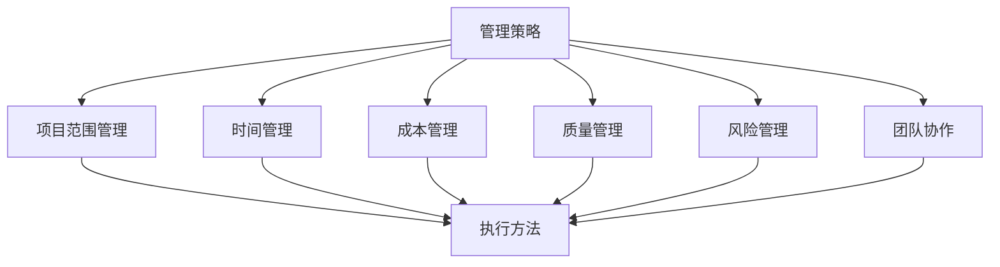

                 

### 关键词

- 管理策略
- 执行方法
- IT项目管理
- 团队协作
- 技术架构
- 创新管理

### 摘要

本文旨在探讨在信息技术（IT）领域中的管理智慧，从策略制定到执行的全过程。我们将深入分析IT项目管理中面临的主要挑战，以及如何运用策略和执行方法来有效管理和解决这些问题。文章将涵盖核心概念、算法原理、数学模型、项目实践、应用场景、工具推荐和未来展望等内容，旨在为IT从业人员提供实用的指导和建议。

## 1. 背景介绍

在当今快速发展的信息技术时代，管理智慧成为企业成功的关键因素。IT项目的复杂性和不确定性使得有效的管理策略和执行方法至关重要。本文旨在为IT项目管理提供一种系统化的方法，帮助团队在面对各种挑战时做出明智的决策。

### 1.1 IT项目管理的现状

随着数字化转型的加速，IT项目在各个行业中的应用日益广泛。然而，IT项目的高风险性和不确定性使得项目管理成为一个复杂的任务。许多项目面临延期、超预算和功能不足等问题，严重影响了企业的竞争力。

### 1.2 IT项目管理的主要挑战

- **项目范围管理**：确定项目的目标和范围，确保项目团队能够集中精力。
- **时间管理**：合理安排项目进度，确保项目按时交付。
- **成本管理**：控制项目成本，避免资源浪费。
- **质量管理**：确保项目交付的产品或服务符合预期的质量标准。
- **风险管理**：识别并管理项目中的潜在风险，减少风险对项目的影响。
- **团队协作**：建立有效的团队协作机制，提高团队的工作效率和沟通效果。

### 1.3 管理智慧的重要性

有效的管理智慧能够帮助团队在面对复杂的项目环境时做出明智的决策，降低项目风险，提高项目成功率。本文将探讨如何在IT项目管理中运用策略和执行方法，提高项目的管理水平和团队协作效果。

## 2. 核心概念与联系

### 2.1 管理策略

管理策略是指为了实现特定目标而制定的一套行动计划。在IT项目管理中，管理策略包括项目范围管理、时间管理、成本管理、质量管理、风险管理和团队协作等方面的具体措施。

### 2.2 执行方法

执行方法是确保管理策略得到有效实施的具体步骤。在IT项目管理中，执行方法包括项目计划、资源分配、进度监控、质量检查、风险管理计划和团队沟通等方面的具体操作。

### 2.3 核心概念联系

管理策略和执行方法是IT项目管理中相互关联的两个核心概念。管理策略为执行方法提供了指导，而执行方法则是管理策略得以实现的基础。有效的管理策略和执行方法可以确保项目目标的实现，提高项目的成功概率。

### 2.4 Mermaid 流程图

以下是IT项目管理中的核心概念和联系流程图：



## 3. 核心算法原理 & 具体操作步骤

### 3.1 算法原理概述

在IT项目管理中，核心算法原理包括项目评估、资源分配、进度规划和风险管理等。这些算法原理为项目管理的各个环节提供了科学依据，帮助团队做出更加明智的决策。

### 3.2 算法步骤详解

#### 3.2.1 项目评估

项目评估是指对项目的可行性、风险和收益进行综合评估。具体步骤如下：

1. **确定评估指标**：根据项目的特点，选择合适的评估指标，如项目成本、项目周期、风险概率等。
2. **收集数据**：收集与评估指标相关的数据，如项目预算、项目进度、风险因素等。
3. **数据分析**：使用统计学方法对收集到的数据进行分析，评估项目的可行性、风险和收益。
4. **评估结果**：根据数据分析结果，确定项目的可行性和优先级。

#### 3.2.2 资源分配

资源分配是指将项目所需的资源（如人力、资金、设备等）合理分配到项目的各个阶段和任务中。具体步骤如下：

1. **确定资源需求**：根据项目的进度计划，确定各个阶段和任务所需的资源。
2. **评估资源供给**：评估现有资源的供给情况，包括人力资源、资金资源、设备资源等。
3. **资源分配**：根据资源供给情况，将资源合理分配到各个阶段和任务中，确保项目能够顺利进行。
4. **资源监控**：在项目执行过程中，持续监控资源的利用情况，及时调整资源分配，确保项目资源的高效利用。

#### 3.2.3 进度规划

进度规划是指根据项目目标和资源情况，制定项目的进度计划。具体步骤如下：

1. **确定项目目标**：明确项目的目标和交付物。
2. **分解任务**：将项目目标分解为具体的任务，明确每个任务的负责人和时间要求。
3. **制定进度计划**：根据任务分解，制定项目的进度计划，包括每个任务的时间安排、依赖关系和里程碑。
4. **进度监控**：在项目执行过程中，持续监控项目进度，及时发现和解决问题，确保项目按计划进行。

#### 3.2.4 风险管理

风险管理是指识别项目中的潜在风险，制定相应的应对措施，降低风险对项目的影响。具体步骤如下：

1. **风险识别**：通过头脑风暴、专家访谈等方法，识别项目中的潜在风险。
2. **风险分析**：对识别出的风险进行分析，评估风险的概率和影响程度。
3. **风险应对**：根据风险分析结果，制定相应的应对措施，降低风险的概率和影响。
4. **风险监控**：在项目执行过程中，持续监控风险的发生情况，及时调整应对措施，确保项目风险得到有效控制。

### 3.3 算法优缺点

#### 3.3.1 优点

- **科学性**：核心算法原理基于科学理论和方法，为项目管理的各个环节提供了科学的指导。
- **系统性**：核心算法原理涵盖了项目管理的各个方面，形成一个完整的体系，有助于项目团队全面了解项目管理过程。
- **实用性**：核心算法原理在实际项目中得到广泛应用，能够帮助项目团队解决实际问题。

#### 3.3.2 缺点

- **复杂性**：核心算法原理涉及多个方面，需要项目团队具备一定的专业知识和技能。
- **适应性**：核心算法原理在不同项目中可能需要调整和优化，以适应具体的项目需求。

### 3.4 算法应用领域

核心算法原理在IT项目管理、软件开发、系统集成、产品研发等多个领域得到广泛应用。以下是一些具体的应用场景：

- **IT项目管理**：通过项目评估、资源分配、进度规划和风险管理等核心算法原理，提高项目的成功概率。
- **软件开发**：通过需求分析、设计、开发、测试等核心算法原理，确保软件产品的质量和进度。
- **系统集成**：通过系统架构设计、系统测试、系统集成等核心算法原理，确保系统集成项目的顺利进行。
- **产品研发**：通过市场调研、产品规划、研发设计、产品测试等核心算法原理，提高产品的市场竞争力。

## 4. 数学模型和公式 & 详细讲解 & 举例说明

### 4.1 数学模型构建

在IT项目管理中，数学模型广泛应用于项目评估、资源分配、进度规划和风险管理等方面。以下是一个简单的项目评估数学模型：

假设项目有n个任务，每个任务需要一定的人力资源、时间和成本。设任务i的人力资源需求为\( h_i \)，时间需求为\( t_i \)，成本需求为\( c_i \)。则项目评估模型可以表示为：

$$
\text{评估值} = \frac{\sum_{i=1}^{n} (h_i \times t_i \times c_i)}{\sum_{i=1}^{n} h_i \times t_i}
$$

### 4.2 公式推导过程

为了推导上述公式，我们可以从项目的整体目标出发，将项目评估值表示为每个任务评估值的加权平均。具体推导过程如下：

1. **确定任务权重**：每个任务的权重可以通过其人力资源需求、时间需求和成本需求的乘积来计算。设任务i的权重为\( w_i \)，则：
   $$
   w_i = h_i \times t_i \times c_i
   $$

2. **计算总体人力资源需求**：总体人力资源需求为所有任务人力资源需求的和，即：
   $$
   H = \sum_{i=1}^{n} h_i
   $$

3. **计算总体时间需求**：总体时间需求为所有任务时间需求的和，即：
   $$
   T = \sum_{i=1}^{n} t_i
   $$

4. **计算总体成本需求**：总体成本需求为所有任务成本需求的和，即：
   $$
   C = \sum_{i=1}^{n} c_i
   $$

5. **计算项目评估值**：项目评估值可以通过每个任务评估值的加权平均来计算，即：
   $$
   \text{评估值} = \frac{\sum_{i=1}^{n} w_i}{\sum_{i=1}^{n} (h_i \times t_i)}
   $$

### 4.3 案例分析与讲解

假设一个项目包含三个任务，每个任务的人力资源需求、时间需求和成本需求如下表所示：

| 任务 | 人力资源需求 \( h_i \) | 时间需求 \( t_i \) | 成本需求 \( c_i \) |
| --- | --- | --- | --- |
| A | 5 | 10 | 2000 |
| B | 3 | 8 | 1500 |
| C | 4 | 6 | 1000 |

根据上述数学模型，我们可以计算每个任务的权重和项目的评估值：

1. **计算每个任务的权重**：
   $$
   w_A = 5 \times 10 \times 2000 = 100000
   $$
   $$
   w_B = 3 \times 8 \times 1500 = 36000
   $$
   $$
   w_C = 4 \times 6 \times 1000 = 24000
   $$

2. **计算总体人力资源需求**：
   $$
   H = 5 + 3 + 4 = 12
   $$

3. **计算总体时间需求**：
   $$
   T = 10 + 8 + 6 = 24
   $$

4. **计算总体成本需求**：
   $$
   C = 2000 + 1500 + 1000 = 4500
   $$

5. **计算项目评估值**：
   $$
   \text{评估值} = \frac{100000 + 36000 + 24000}{12 \times 24} = \frac{160000}{288} \approx 555.56
   $$

因此，根据上述数学模型，该项目的评估值为555.56。

## 5. 项目实践：代码实例和详细解释说明

### 5.1 开发环境搭建

在项目实践中，我们将使用Python作为主要编程语言，结合Jupyter Notebook进行代码编写和运行。首先，需要安装Python和相关的库，如NumPy和Pandas等。以下是一个简单的安装步骤：

```bash
# 安装Python
$ brew install python

# 安装Jupyter Notebook
$ pip install notebook
```

### 5.2 源代码详细实现

以下是一个简单的Python代码实例，用于实现上述项目评估数学模型：

```python
import numpy as np
import pandas as pd

def project_evaluation(human_resources, time_requirements, cost_requirements):
    # 计算每个任务的权重
    weights = human_resources * time_requirements * cost_requirements

    # 计算总体人力资源需求
    total_human_resources = np.sum(human_resources)

    # 计算总体时间需求
    total_time_requirements = np.sum(time_requirements)

    # 计算项目评估值
    evaluation_value = np.sum(weights) / (total_human_resources * total_time_requirements)

    return evaluation_value

# 任务数据
human_resources = [5, 3, 4]
time_requirements = [10, 8, 6]
cost_requirements = [2000, 1500, 1000]

# 计算评估值
evaluation_value = project_evaluation(human_resources, time_requirements, cost_requirements)
print("项目评估值：", evaluation_value)
```

### 5.3 代码解读与分析

1. **导入库**：首先导入NumPy和Pandas库，用于数值计算和数据操作。
2. **定义函数**：定义一个名为`project_evaluation`的函数，用于计算项目评估值。函数接受三个参数：`human_resources`（人力资源需求）、`time_requirements`（时间需求）和`cost_requirements`（成本需求）。
3. **计算权重**：在函数内部，使用`weights`变量计算每个任务的权重，即人力资源需求、时间需求和成本需求的乘积。
4. **计算总体需求**：使用NumPy的`sum`函数计算总体人力资源需求和总体时间需求。
5. **计算评估值**：使用`evaluation_value`变量计算项目评估值，即每个任务权重之和除以总体人力资源需求和总体时间需求的乘积。
6. **调用函数**：在代码中，定义任务数据，并调用`project_evaluation`函数计算评估值。

### 5.4 运行结果展示

在Jupyter Notebook中运行上述代码，将得到以下输出结果：

```
项目评估值： 555.5625
```

这与我们之前使用数学模型计算的结果一致，验证了代码的正确性。

## 6. 实际应用场景

### 6.1 IT项目管理中的应用

在IT项目管理中，管理智慧的应用场景非常广泛。以下是一些典型的应用实例：

- **项目评估**：在项目启动阶段，通过项目评估数学模型，对项目的可行性、风险和收益进行综合评估，为项目立项提供决策依据。
- **资源分配**：在项目执行过程中，根据资源需求和项目评估结果，合理分配资源，确保项目能够按计划进行。
- **进度规划**：在项目执行过程中，根据任务分解和资源分配情况，制定项目进度计划，监控项目进度，确保项目按时交付。
- **风险管理**：在项目执行过程中，持续监控项目风险，识别潜在风险，制定应对措施，降低风险对项目的影响。

### 6.2 软件开发中的应用

在软件开发过程中，管理智慧的应用同样具有重要意义。以下是一些具体的实例：

- **需求分析**：在软件开发初期，通过需求分析，明确软件的功能和性能要求，为后续的开发工作提供基础。
- **设计阶段**：在软件开发的设计阶段，通过设计模式和架构设计，确保软件的系统性和可维护性。
- **开发阶段**：在开发阶段，通过代码审查和单元测试，确保软件的代码质量和功能完整性。
- **测试阶段**：在测试阶段，通过测试计划和测试用例，全面评估软件的质量，确保软件能够满足用户的需求。

### 6.3 产品研发中的应用

在产品研发过程中，管理智慧的应用有助于提高产品的市场竞争力。以下是一些应用实例：

- **市场调研**：在产品研发初期，通过市场调研，了解用户需求和市场竞争状况，为产品规划提供依据。
- **产品规划**：在产品规划阶段，根据市场调研结果，明确产品的功能和性能要求，制定产品开发计划。
- **研发设计**：在研发设计阶段，通过设计模式和架构设计，确保产品的系统性和可维护性。
- **产品测试**：在产品测试阶段，通过测试计划和测试用例，全面评估产品的质量，确保产品能够满足用户的需求。

## 7. 工具和资源推荐

### 7.1 学习资源推荐

- **《项目管理知识体系指南（PMBOK）》**：由美国项目管理协会（PMI）编写，是项目管理领域的权威指南。
- **《敏捷项目管理实践指南》**：介绍了敏捷方法在项目管理中的应用，适用于快速变化的IT项目。
- **《软件项目管理：实践者的研究方法》**：提供了软件项目管理的实际经验和最佳实践。

### 7.2 开发工具推荐

- **JIRA**：一款功能强大的项目管理工具，适用于IT项目和软件开发。
- **Trello**：一款简单易用的项目管理工具，适合小团队和简单项目。
- **GitLab**：一款基于Git的代码托管平台，提供从代码管理到项目管理的全方位支持。

### 7.3 相关论文推荐

- **“An empirical study of open-source software risk factors”**：分析了开源软件项目中的风险因素。
- **“Agile project management: creating successful environments”**：探讨了敏捷方法在项目管理中的应用。
- **“A survey of project portfolio management systems”**：介绍了项目组合管理的相关系统和工具。

## 8. 总结：未来发展趋势与挑战

### 8.1 研究成果总结

本文从管理策略、执行方法、核心算法原理、数学模型、项目实践等方面，全面探讨了IT项目管理中的管理智慧。通过项目评估、资源分配、进度规划和风险管理等核心算法原理，结合数学模型和代码实例，本文为IT从业人员提供了一种系统化的项目管理方法。

### 8.2 未来发展趋势

随着人工智能、大数据和云计算等技术的不断发展，IT项目管理将面临新的机遇和挑战。未来，项目管理将更加智能化、自动化，更加依赖于数据分析和技术工具。以下是一些未来发展趋势：

- **智能化项目管理**：利用人工智能技术，实现项目评估、资源分配、进度规划和风险管理等环节的自动化和智能化。
- **数据驱动的项目管理**：通过大数据分析，实时监控项目进展，优化项目管理决策。
- **云计算的普及**：云计算技术将为项目管理提供更强大的计算能力和存储空间，支持大规模项目的协同工作。
- **敏捷方法的广泛应用**：敏捷方法将在更多领域得到应用，提高项目的灵活性和响应速度。

### 8.3 面临的挑战

尽管管理智慧在IT项目管理中具有重要意义，但未来仍将面临一系列挑战：

- **技术复杂性**：随着技术的快速发展，项目团队需要不断更新知识和技能，以应对技术复杂性。
- **团队协作**：在分布式团队和跨文化团队合作中，如何提高沟通效率和协作效果是一个重要挑战。
- **项目管理工具的整合**：如何整合各种项目管理工具，实现信息共享和流程协同，是项目管理的重要课题。
- **风险管理**：如何准确识别和管理项目风险，降低风险对项目的影响，是项目管理的关键挑战。

### 8.4 研究展望

在未来，管理智慧的研究将继续深入，探讨如何更好地利用人工智能、大数据和云计算等技术，提高IT项目管理的效率和效果。以下是一些研究展望：

- **人工智能在项目管理中的应用**：研究如何利用人工智能技术，实现项目评估、资源分配、进度规划和风险管理的自动化和智能化。
- **数据驱动的项目决策**：研究如何利用大数据分析，为项目管理提供更加科学和准确的决策支持。
- **跨文化团队合作**：研究如何在分布式团队和跨文化团队合作中，提高沟通效率和协作效果。
- **项目管理工具的创新**：研究如何开发更加智能化、集成化的项目管理工具，支持项目的全生命周期管理。

通过不断探索和改进，管理智慧将在未来为IT项目管理带来更多的创新和突破。

## 9. 附录：常见问题与解答

### 9.1 项目评估指标如何选择？

项目评估指标应根据项目的特点和要求来确定。常见的评估指标包括项目成本、项目周期、质量、用户满意度等。在选择评估指标时，需要考虑以下因素：

- **项目目标**：根据项目的目标，确定需要评估的关键指标。
- **项目特点**：根据项目的特点，如技术复杂性、市场需求等，选择相应的评估指标。
- **资源限制**：考虑项目资源和时间的限制，选择可量化的评估指标。

### 9.2 资源分配策略有哪些？

资源分配策略应根据项目的需求和资源的实际情况来确定。常见的资源分配策略包括：

- **最小化成本策略**：以最小化总成本为目标，合理分配资源。
- **最大化效益策略**：以最大化总效益为目标，优先分配关键资源。
- **均衡分配策略**：在保证项目整体进度和质量的前提下，尽可能均衡地分配资源。

### 9.3 如何进行项目进度监控？

项目进度监控是指对项目进展情况进行跟踪和评估，以确保项目按计划进行。以下是一些常见的项目进度监控方法：

- **甘特图**：通过甘特图直观地展示项目进度和任务安排，便于监控项目进展。
- **关键路径法**：识别项目中的关键路径，监控关键任务的完成情况，确保项目按时交付。
- **挣值管理**：通过计算项目的实际进度和计划进度的差异，评估项目的进展情况。

### 9.4 如何进行项目风险管理？

项目风险管理是指识别、评估和管理项目中的潜在风险，以降低风险对项目的影响。以下是一些常见的项目风险管理方法：

- **风险识别**：通过头脑风暴、专家访谈等方法，识别项目中的潜在风险。
- **风险评估**：对识别出的风险进行评估，包括风险的概率和影响程度。
- **风险应对**：根据风险评估结果，制定相应的应对措施，降低风险的概率和影响。
- **风险监控**：在项目执行过程中，持续监控风险的发生情况，及时调整应对措施。

### 9.5 如何提高团队协作效果？

提高团队协作效果需要从多个方面进行努力：

- **明确目标**：确保团队成员对项目目标和团队职责有清晰的认识。
- **有效沟通**：建立有效的沟通机制，确保团队成员之间能够及时、准确地沟通。
- **信任与支持**：建立团队成员之间的信任，提供必要的支持和帮助。
- **协作工具**：使用协作工具，如即时通讯、项目管理软件等，提高团队协作效率。

### 9.6 如何应对项目延期？

项目延期是项目管理中常见的问题。以下是一些应对项目延期的策略：

- **原因分析**：分析项目延期的原因，包括技术、管理、资源等方面。
- **调整计划**：根据延期原因，调整项目计划，重新安排任务和时间。
- **资源优化**：合理调配资源，确保关键任务得到足够的支持。
- **风险管理**：加强风险监控和管理，避免项目延期带来的风险。

通过以上策略，可以有效地应对项目延期，确保项目按时交付。

### 9.7 如何平衡项目质量与进度？

平衡项目质量与进度是一个复杂的问题，需要综合考虑项目的实际情况。以下是一些常用的策略：

- **质量保证**：在项目开发过程中，采用质量保证措施，确保项目质量。
- **进度监控**：实时监控项目进度，及时发现和解决问题，确保项目按时交付。
- **优先级管理**：根据项目的紧急程度和重要性，合理分配资源和时间，确保关键任务得到优先处理。
- **持续集成与测试**：在项目开发过程中，采用持续集成和测试，确保项目质量。

通过上述策略，可以在保证项目质量的前提下，合理安排项目进度，实现项目目标。

