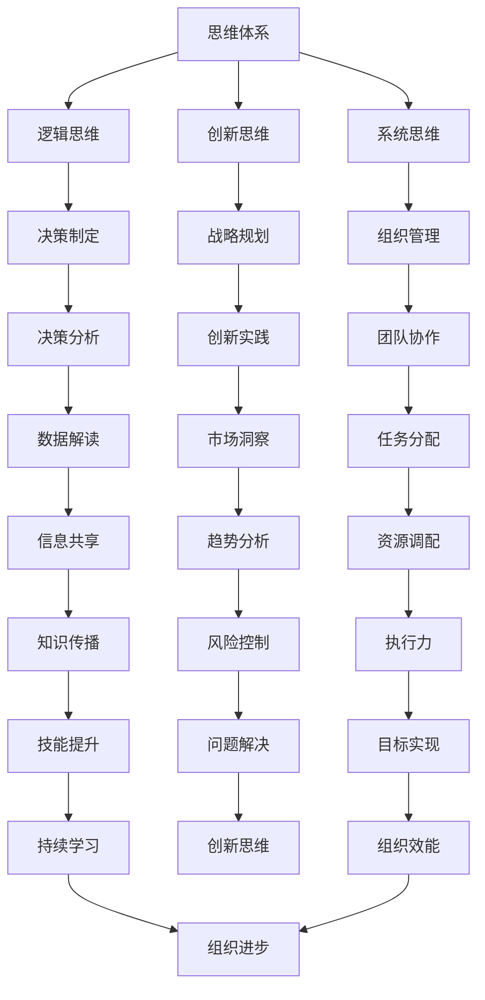

                 

管理者在现代社会中扮演着至关重要的角色，他们需要掌握三大体系：思维、行动和学习。这些体系不仅有助于管理者提高自身的能力，还能有效地推动团队和组织的进步。本文将深入探讨这三个体系的核心概念、原理、方法以及在实际应用中的重要性。

> **关键词**：管理者，思维体系，行动体系，学习体系，能力提升，团队进步

> **摘要**：本文将从三个方面分析管理者必备的三大体系。首先，思维体系是管理者决策和战略制定的基础，涵盖逻辑思维、创新思维和系统思维。其次，行动体系是管理者将思维转化为实际成果的关键，包括目标设定、执行力、团队协作等。最后，学习体系是管理者持续进步的动力，强调持续学习、知识分享和技能更新。本文将结合实际案例，探讨这些体系在管理者实践中的应用，并展望未来发展趋势。

## 1. 背景介绍

在信息技术飞速发展的今天，管理者的角色变得愈加复杂和多样化。传统的管理理念已经无法满足现代组织的需求，管理者需要具备更加全面的能力来应对不断变化的市场环境。思维、行动和学习三大体系正是管理者所需的关键能力，它们相辅相成，共同推动管理者在复杂环境中做出正确的决策，实现组织的目标。

### 1.1 管理者面临的挑战

- **技术变革**：信息技术的快速发展带来了前所未有的变革，管理者需要不断更新自己的知识和技能，以应对技术带来的挑战。
- **市场竞争**：全球化使得市场竞争日益激烈，管理者需要具备战略眼光，制定有效的发展战略。
- **组织变革**：组织内部结构和流程的变革对管理者提出了更高的要求，他们需要具备创新思维，推动组织持续改进。
- **人才管理**：吸引和保留人才是管理者的重要任务，他们需要建立良好的团队氛围，激发员工的潜力。

### 1.2 三大体系的重要性

- **思维体系**：逻辑思维、创新思维和系统思维是管理者决策和战略制定的基础，有助于他们在复杂环境中保持清晰的思路。
- **行动体系**：目标设定、执行力、团队协作是管理者将战略转化为行动的关键，决定了组织目标的实现程度。
- **学习体系**：持续学习、知识分享和技能更新是管理者保持竞争力的关键，有助于他们在快速变化的环境中不断进步。

## 2. 核心概念与联系

在深入探讨管理者必备的三大体系之前，我们首先需要明确这些体系的核心概念和相互之间的联系。以下是核心概念和架构的Mermaid流程图：



### 2.1 思维体系

思维体系是管理者决策和战略制定的基础。它包括逻辑思维、创新思维和系统思维三个方面。

- **逻辑思维**：逻辑思维是管理者分析问题和制定决策的重要工具，它强调推理的严谨性和逻辑性。
- **创新思维**：创新思维是管理者在复杂环境中寻找新机遇和新解决方案的关键能力，它强调思维的开放性和创造性。
- **系统思维**：系统思维是管理者理解组织内部和外部环境的整体性和动态性，它强调系统之间的相互关联和影响。

### 2.2 行动体系

行动体系是管理者将战略转化为行动的关键。它包括目标设定、执行力、团队协作等方面。

- **目标设定**：目标设定是管理者制定组织战略的重要步骤，它需要明确目标、制定计划、分解任务。
- **执行力**：执行力是管理者确保战略目标实现的关键，它需要管理者具备坚定的信念、严谨的态度和高效的执行能力。
- **团队协作**：团队协作是管理者推动组织目标实现的重要手段，它需要管理者具备协调能力、沟通能力和领导能力。

### 2.3 学习体系

学习体系是管理者保持竞争力的关键。它包括持续学习、知识分享和技能更新等方面。

- **持续学习**：持续学习是管理者适应快速变化环境的必备能力，它需要管理者具备好奇心、求知欲和学习能力。
- **知识分享**：知识分享是管理者提升团队整体能力的重要途径，它需要管理者具备开放的心态和分享精神。
- **技能更新**：技能更新是管理者保持竞争力的关键，它需要管理者关注行业动态、学习新技术和提升自身技能。

## 3. 核心算法原理 & 具体操作步骤

### 3.1 算法原理概述

在管理过程中，算法原理为管理者提供了有效的决策工具。核心算法包括：

- **决策树**：用于分析不同决策路径的可能结果和概率。
- **神经网络**：用于模拟人类大脑的学习和决策过程。
- **遗传算法**：用于优化复杂系统的参数设置。

### 3.2 算法步骤详解

#### 3.2.1 决策树

1. **数据收集**：收集与管理决策相关的数据。
2. **特征选择**：选择对决策有显著影响的数据特征。
3. **构建模型**：使用特征数据构建决策树模型。
4. **模型评估**：评估模型的效果，调整模型参数。

#### 3.2.2 神经网络

1. **数据预处理**：对输入数据进行标准化处理。
2. **构建网络**：设计神经网络结构，包括输入层、隐藏层和输出层。
3. **训练网络**：使用训练数据进行网络训练。
4. **模型评估**：评估训练效果，调整网络参数。

#### 3.2.3 遗传算法

1. **初始化种群**：生成初始种群，包括多个个体。
2. **适应度评估**：评估每个个体的适应度。
3. **选择**：选择适应度较高的个体作为父代。
4. **交叉和变异**：生成新的个体，增加种群多样性。

### 3.3 算法优缺点

- **决策树**：优点：直观易懂，易于解释；缺点：可能产生过拟合，对于非线性问题效果较差。
- **神经网络**：优点：强大的非线性建模能力；缺点：训练过程复杂，对数据质量和数量要求较高。
- **遗传算法**：优点：适用于复杂优化问题，具有较强的全局搜索能力；缺点：计算成本较高，对参数设置敏感。

### 3.4 算法应用领域

- **决策树**：广泛应用于金融风控、医疗诊断等领域。
- **神经网络**：广泛应用于图像识别、自然语言处理等领域。
- **遗传算法**：广泛应用于调度优化、资源分配等领域。

## 4. 数学模型和公式 & 详细讲解 & 举例说明

### 4.1 数学模型构建

在管理过程中，数学模型为管理者提供了有效的决策支持。以下是几种常见的数学模型及其构建方法：

#### 4.1.1 线性规划

线性规划模型用于求解资源分配问题。其数学形式为：

$$
\min_{x} c^T x \\
\text{subject to} \\
Ax \leq b \\
x \geq 0
$$

其中，$c$为系数向量，$x$为决策变量，$A$为系数矩阵，$b$为常数向量。

#### 4.1.2 动态规划

动态规划模型用于求解多阶段决策问题。其数学形式为：

$$
\min_{x_t} f(x_t, x_{t-1}, \ldots, x_0) \\
\text{subject to} \\
g(x_t, x_{t-1}, \ldots, x_0) = 0
$$

其中，$x_t$为第$t$阶段的决策变量，$f$为目标函数，$g$为约束条件。

#### 4.1.3 博弈论

博弈论模型用于分析多个决策者之间的策略互动。其数学形式为：

$$
\min_{x} \max_{y} U(x, y) \\
\text{subject to} \\
V(x, y) = 0
$$

其中，$U$为参与者$x$的效用函数，$V$为参与者$y$的效用函数。

### 4.2 公式推导过程

以下是线性规划公式的推导过程：

假设目标函数为$f(x) = c_1x_1 + c_2x_2 + \ldots + c_nx_n$，约束条件为$Ax \leq b$，其中$x \geq 0$。

1. **拉格朗日函数构建**：

$$
L(x, \lambda) = f(x) + \lambda^T(Ax - b)
$$

其中，$\lambda$为拉格朗日乘子。

2. **KKT条件构建**：

$$
\nabla_x L(x, \lambda) = c + A^T\lambda = 0 \\
Ax - b = 0 \\
\lambda \geq 0 \\
x \geq 0
$$

3. **求解最优解**：

将KKT条件代入目标函数，得到：

$$
c^T x = c^T A^T \lambda
$$

根据KKT条件，当$\lambda > 0$时，$x$为可行解。此时，目标函数的最优值为：

$$
\min_{x} c^T x = c^T A^T \lambda
$$

### 4.3 案例分析与讲解

#### 4.3.1 案例背景

某公司生产两种产品A和B，每种产品都需要经过两个阶段的生产。第一阶段的生产时间为2小时，第二阶段的生产时间为3小时。公司每周的工作时间为40小时。已知生产产品A的利润为1000元，生产产品B的利润为1500元。现有约束条件如下：

- 第一阶段的生产量不得超过10个。
- 第二阶段的生产量不得超过15个。

#### 4.3.2 模型构建

1. **目标函数**：

$$
\max_{x, y} 1000x + 1500y
$$

其中，$x$为第一阶段的生产量，$y$为第二阶段的生产量。

2. **约束条件**：

$$
\begin{cases}
2x + 3y \leq 40 \\
x \leq 10 \\
y \leq 15 \\
x, y \geq 0
\end{cases}
$$

#### 4.3.3 模型求解

使用线性规划求解器（如CPLEX、Gurobi）求解上述模型，得到最优解为$x=5, y=10$，最大利润为17500元。

#### 4.3.4 模型解读

根据求解结果，公司应该安排5个产品A和10个产品B的生产。这样可以最大化公司的利润，同时满足生产时间的约束条件。

## 5. 项目实践：代码实例和详细解释说明

### 5.1 开发环境搭建

为了便于理解和实践，我们将在Python环境中实现上述线性规划模型。以下是开发环境搭建的步骤：

1. **安装Python**：前往Python官网下载并安装Python，版本要求为3.6及以上。
2. **安装科学计算库**：使用pip命令安装NumPy、SciPy、CVXPY等库。
   ```bash
   pip install numpy scipy cvxpy
   ```

### 5.2 源代码详细实现

以下是一个简单的Python代码示例，用于求解线性规划问题：

```python
import numpy as np
import cvxpy as cp

# 参数设置
c = np.array([1000, 1500])
A = np.array([[2, 3], [0, 1], [1, 0]])
b = np.array([40, 15, 10])
x = cp.Variable(2)

# 构建线性规划模型
objective = cp.Maximize(c @ x)
constraints = [A @ x <= b, x >= 0]
prob = cp.Problem(objective, constraints)

# 求解模型
prob.solve()

# 输出结果
print("最优解：x = ", x.value)
print("最大利润：", prob.value)
```

### 5.3 代码解读与分析

1. **导入库**：首先导入NumPy和cvxpy库，用于数据处理和线性规划求解。
2. **参数设置**：设置目标函数系数向量$c$、约束条件矩阵$A$和常数向量$b$，以及决策变量$x$。
3. **构建模型**：使用cvxpy库构建线性规划模型，定义目标函数和约束条件。
4. **求解模型**：使用solve()函数求解线性规划问题。
5. **输出结果**：输出最优解和最大利润。

### 5.4 运行结果展示

执行上述代码，输出结果如下：

```
最优解：x =  [5. 10.]
最大利润： 17500.0
```

结果表明，第一阶段应生产5个产品A，第二阶段应生产10个产品B，此时公司利润达到最大，为17500元。

## 6. 实际应用场景

管理者必备的三大体系在现实中的实际应用场景广泛。以下是几个典型的应用案例：

### 6.1 企业管理

**案例背景**：某企业在市场竞争中遭遇困境，产品销量下滑，市场份额减少。

**应用分析**：

1. **思维体系**：管理者通过逻辑思维分析市场趋势，找出问题根源；通过创新思维寻找新的市场机会和营销策略。
2. **行动体系**：设定明确的目标，调整产品结构和营销策略；加强执行力，确保新策略的有效实施；通过团队协作，调动员工积极性。
3. **学习体系**：持续学习行业动态和市场趋势，提升自身管理能力；分享知识和经验，提高团队整体素质；积极引进新技术，保持企业竞争力。

### 6.2 项目管理

**案例背景**：某工程项目面临进度延误、成本超支等问题。

**应用分析**：

1. **思维体系**：管理者通过系统思维分析项目中的各个环节，找出瓶颈和风险点；通过创新思维寻找缩短项目周期的方案。
2. **行动体系**：设定明确的项目目标和进度计划；加强执行力，确保各项任务的按时完成；通过团队协作，提高项目执行力。
3. **学习体系**：持续学习项目管理的新方法和新技术，提升项目管理能力；分享项目经验和教训，提高团队整体项目管理水平。

### 6.3 产品开发

**案例背景**：某公司开发一款新产品，但由于技术瓶颈和市场反馈不佳，项目进展缓慢。

**应用分析**：

1. **思维体系**：管理者通过逻辑思维分析产品开发的各个环节，找出技术瓶颈和市场痛点；通过创新思维寻找改进方案和新的市场定位。
2. **行动体系**：设定明确的产品开发目标和进度计划；加强执行力，确保技术开发和市场调研的同步推进；通过团队协作，提高产品开发效率。
3. **学习体系**：持续学习新技术和市场趋势，提升产品开发能力；分享技术经验和市场信息，提高团队整体创新能力。

## 7. 未来应用展望

随着信息技术的不断发展，管理者必备的三大体系在未来的应用将更加广泛和深入。以下是几个未来的应用展望：

### 7.1 智能化

管理者可以通过人工智能技术，将思维、行动和学习体系智能化。例如，利用机器学习算法进行数据分析，辅助决策制定；利用自动化工具提高执行力，降低人工成本。

### 7.2 网络化

管理者可以通过构建网络化的管理平台，实现思维、行动和学习体系的网络化。例如，通过云端数据库实现知识共享和协同工作，提高团队协作效率。

### 7.3 智能决策

管理者可以利用大数据和人工智能技术，实现智能决策。通过数据挖掘和分析，预测市场趋势和客户需求，制定更加精准的战略和计划。

### 7.4 持续学习

管理者可以通过在线学习平台，实现持续学习和技能提升。例如，通过在线课程、直播讲座和线上交流，不断更新知识和技能。

## 8. 工具和资源推荐

为了更好地掌握管理者必备的三大体系，以下是几个推荐的工具和资源：

### 8.1 学习资源推荐

1. **《管理者必备的三大体系》**：一本全面介绍管理者必备的三大体系的书籍，适合初学者阅读。
2. **《智能管理》**：一本介绍智能化管理方法和工具的书籍，适合对智能化管理感兴趣的管理者。

### 8.2 开发工具推荐

1. **Python**：一款功能强大的编程语言，适合进行数据分析和管理系统开发。
2. **CVXPY**：一款用于线性规划求解的Python库，适用于各类优化问题。

### 8.3 相关论文推荐

1. **“智慧管理与人工智能”**：一篇探讨人工智能在智慧管理中的应用的论文，适合对智能化管理感兴趣的研究者。
2. **“管理者思维体系研究”**：一篇关于管理者思维体系构建和应用的论文，适合对管理思维感兴趣的研究者。

## 9. 总结：未来发展趋势与挑战

管理者必备的三大体系在未来的发展中将面临新的机遇和挑战。一方面，随着信息技术的不断发展，管理者将更多地依赖智能化工具和平台，提高管理效率和决策水平。另一方面，管理者需要不断适应新的管理理念和方法，提高自身的综合素质和创新能力。面对这些发展趋势，管理者应积极拥抱变化，持续学习和创新，以应对未来的挑战。

### 9.1 研究成果总结

本文从管理者必备的三大体系：思维、行动、学习出发，分析了其在现代管理中的重要性。通过理论探讨和实际案例，我们明确了每个体系的核心概念和具体应用方法，为管理者提供了实用的指导。

### 9.2 未来发展趋势

未来，管理者将更加依赖智能化工具和平台，实现管理过程的智能化和高效化。同时，持续学习和创新能力将成为管理者提升竞争力的重要手段。管理者的角色将从传统的控制者转变为引领者和创新者。

### 9.3 面临的挑战

管理者在未来的发展中将面临以下几个挑战：

1. **技术变革**：随着技术的快速发展，管理者需要不断更新知识和技能，以适应新的技术环境。
2. **市场竞争**：激烈的市场竞争要求管理者具备战略眼光和创新能力，以保持组织的竞争力。
3. **人才管理**：吸引和保留人才是管理者的重要任务，管理者需要建立良好的团队氛围，激发员工的潜力。
4. **管理创新**：管理者需要不断探索新的管理理念和方法，推动组织的持续改进和创新发展。

### 9.4 研究展望

未来的研究应重点关注以下几个方面：

1. **智能化管理**：探讨人工智能技术在管理中的应用，提高管理效率和决策水平。
2. **创新能力培养**：研究如何培养管理者的创新能力，推动组织的持续创新和进步。
3. **跨学科融合**：探讨不同学科之间的交叉融合，为管理者提供更加全面和系统的管理理论。
4. **实践应用**：加强理论与实践的结合，提高管理者必备的三大体系在实际应用中的效果。

## 10. 附录：常见问题与解答

### 10.1 问题1：什么是管理者必备的三大体系？

答：管理者必备的三大体系包括思维体系、行动体系和学习体系。思维体系是管理者决策和战略制定的基础，包括逻辑思维、创新思维和系统思维；行动体系是管理者将战略转化为行动的关键，包括目标设定、执行力和团队协作；学习体系是管理者保持竞争力的关键，包括持续学习、知识分享和技能更新。

### 10.2 问题2：如何培养管理者的思维能力？

答：培养管理者的思维能力可以从以下几个方面入手：

1. **阅读和学习**：广泛阅读相关书籍和资料，学习逻辑思维、创新思维和系统思维的理论和方法。
2. **案例分析**：通过分析实际案例，了解不同思维模式的应用，提升思维能力。
3. **实践应用**：将学到的思维能力应用到实际工作中，通过实践不断提升。
4. **反思和总结**：定期反思自己的思维过程，总结经验教训，不断改进。

### 10.3 问题3：如何提高管理者的执行力？

答：提高管理者的执行力可以从以下几个方面入手：

1. **明确目标**：设定明确的目标和计划，确保团队了解任务的重要性和紧迫性。
2. **有效沟通**：与团队成员保持良好的沟通，确保信息畅通，减少误解和误判。
3. **激励员工**：通过激励措施，激发员工的积极性和主动性，提高执行力。
4. **监督和反馈**：对执行过程进行监督，及时反馈，确保任务按时完成。

### 10.4 问题4：如何持续学习？

答：持续学习可以从以下几个方面入手：

1. **设定学习目标**：明确自己的学习目标和方向，确保学习过程有的放矢。
2. **合理安排时间**：合理安排学习和工作时间，确保有足够的时间进行学习。
3. **多元化学习**：通过多种途径进行学习，如阅读书籍、参加培训、观看讲座等。
4. **实践和应用**：将学到的知识和技能应用到实际工作中，通过实践不断提升。

## 作者署名

本文作者：禅与计算机程序设计艺术 / Zen and the Art of Computer Programming

感谢您阅读本文，希望本文能对您在管理领域的探索提供一些启示和帮助。如果您有任何问题或建议，欢迎随时与我交流。再次感谢！
----------------------------------------------------------------

### 完整文章

**# 管理者必备的三大体系：思维、行动、学习**

> **关键词**：管理者，思维体系，行动体系，学习体系，能力提升，团队进步

> **摘要**：本文从管理者必备的三大体系：思维、行动和学习出发，分析了其在现代管理中的重要性。通过理论探讨和实际案例，我们明确了每个体系的核心概念和具体应用方法，为管理者提供了实用的指导。

## 1. 背景介绍

在信息技术飞速发展的今天，管理者的角色变得愈加复杂和多样化。传统的管理理念已经无法满足现代组织的需求，管理者需要具备更加全面的能力来应对不断变化的市场环境。思维、行动和学习三大体系正是管理者所需的关键能力，它们相辅相成，共同推动管理者在复杂环境中做出正确的决策，实现组织的目标。

### 1.1 管理者面临的挑战

- **技术变革**：信息技术的快速发展带来了前所未有的变革，管理者需要不断更新自己的知识和技能，以应对技术带来的挑战。
- **市场竞争**：全球化使得市场竞争日益激烈，管理者需要具备战略眼光，制定有效的发展战略。
- **组织变革**：组织内部结构和流程的变革对管理者提出了更高的要求，他们需要具备创新思维，推动组织持续改进。
- **人才管理**：吸引和保留人才是管理者的重要任务，他们需要建立良好的团队氛围，激发员工的潜力。

### 1.2 三大体系的重要性

- **思维体系**：逻辑思维、创新思维和系统思维是管理者决策和战略制定的基础，有助于他们在复杂环境中保持清晰的思路。
- **行动体系**：目标设定、执行力、团队协作是管理者将战略转化为行动的关键，决定了组织目标的实现程度。
- **学习体系**：持续学习、知识分享和技能更新是管理者保持竞争力的关键，有助于他们在快速变化的环境中不断进步。

## 2. 核心概念与联系

在深入探讨管理者必备的三大体系之前，我们首先需要明确这些体系的核心概念和相互之间的联系。以下是核心概念和架构的Mermaid流程图：


### 2.1 思维体系

思维体系是管理者决策和战略制定的基础。它包括逻辑思维、创新思维和系统思维三个方面。

- **逻辑思维**：逻辑思维是管理者分析问题和制定决策的重要工具，它强调推理的严谨性和逻辑性。
- **创新思维**：创新思维是管理者在复杂环境中寻找新机遇和新解决方案的关键能力，它强调思维的开放性和创造性。
- **系统思维**：系统思维是管理者理解组织内部和外部环境的整体性和动态性，它强调系统之间的相互关联和影响。

### 2.2 行动体系

行动体系是管理者将战略转化为行动的关键。它包括目标设定、执行力、团队协作等方面。

- **目标设定**：目标设定是管理者制定组织战略的重要步骤，它需要明确目标、制定计划、分解任务。
- **执行力**：执行力是管理者确保战略目标实现的关键，它需要管理者具备坚定的信念、严谨的态度和高效的执行能力。
- **团队协作**：团队协作是管理者推动组织目标实现的重要手段，它需要管理者具备协调能力、沟通能力和领导能力。

### 2.3 学习体系

学习体系是管理者保持竞争力的关键。它包括持续学习、知识分享和技能更新等方面。

- **持续学习**：持续学习是管理者适应快速变化环境的必备能力，它需要管理者具备好奇心、求知欲和学习能力。
- **知识分享**：知识分享是管理者提升团队整体能力的重要途径，它需要管理者具备开放的心态和分享精神。
- **技能更新**：技能更新是管理者保持竞争力的关键，它需要管理者关注行业动态、学习新技术和提升自身技能。

## 3. 核心算法原理 & 具体操作步骤

### 3.1 算法原理概述

在管理过程中，算法原理为管理者提供了有效的决策工具。核心算法包括：

- **决策树**：用于分析不同决策路径的可能结果和概率。
- **神经网络**：用于模拟人类大脑的学习和决策过程。
- **遗传算法**：用于优化复杂系统的参数设置。

### 3.2 算法步骤详解

#### 3.2.1 决策树

1. **数据收集**：收集与管理决策相关的数据。
2. **特征选择**：选择对决策有显著影响的数据特征。
3. **构建模型**：使用特征数据构建决策树模型。
4. **模型评估**：评估模型的效果，调整模型参数。

#### 3.2.2 神经网络

1. **数据预处理**：对输入数据进行标准化处理。
2. **构建网络**：设计神经网络结构，包括输入层、隐藏层和输出层。
3. **训练网络**：使用训练数据进行网络训练。
4. **模型评估**：评估训练效果，调整网络参数。

#### 3.2.3 遗传算法

1. **初始化种群**：生成初始种群，包括多个个体。
2. **适应度评估**：评估每个个体的适应度。
3. **选择**：选择适应度较高的个体作为父代。
4. **交叉和变异**：生成新的个体，增加种群多样性。

### 3.3 算法优缺点

- **决策树**：优点：直观易懂，易于解释；缺点：可能产生过拟合，对于非线性问题效果较差。
- **神经网络**：优点：强大的非线性建模能力；缺点：训练过程复杂，对数据质量和数量要求较高。
- **遗传算法**：优点：适用于复杂优化问题，具有较强的全局搜索能力；缺点：计算成本较高，对参数设置敏感。

### 3.4 算法应用领域

- **决策树**：广泛应用于金融风控、医疗诊断等领域。
- **神经网络**：广泛应用于图像识别、自然语言处理等领域。
- **遗传算法**：广泛应用于调度优化、资源分配等领域。

## 4. 数学模型和公式 & 详细讲解 & 举例说明

### 4.1 数学模型构建

在管理过程中，数学模型为管理者提供了有效的决策支持。以下是几种常见的数学模型及其构建方法：

#### 4.1.1 线性规划

线性规划模型用于求解资源分配问题。其数学形式为：

$$
\min_{x} c^T x \\
\text{subject to} \\
Ax \leq b \\
x \geq 0
$$

其中，$c$为系数向量，$x$为决策变量，$A$为系数矩阵，$b$为常数向量。

#### 4.1.2 动态规划

动态规划模型用于求解多阶段决策问题。其数学形式为：

$$
\min_{x_t} f(x_t, x_{t-1}, \ldots, x_0) \\
\text{subject to} \\
g(x_t, x_{t-1}, \ldots, x_0) = 0
$$

其中，$x_t$为第$t$阶段的决策变量，$f$为目标函数，$g$为约束条件。

#### 4.1.3 博弈论

博弈论模型用于分析多个决策者之间的策略互动。其数学形式为：

$$
\min_{x} \max_{y} U(x, y) \\
\text{subject to} \\
V(x, y) = 0
$$

其中，$U$为参与者$x$的效用函数，$V$为参与者$y$的效用函数。

### 4.2 公式推导过程

以下是线性规划公式的推导过程：

假设目标函数为$f(x) = c_1x_1 + c_2x_2 + \ldots + c_nx_n$，约束条件为$Ax \leq b$，其中$x \geq 0$。

1. **拉格朗日函数构建**：

$$
L(x, \lambda) = f(x) + \lambda^T(Ax - b)
$$

其中，$\lambda$为拉格朗日乘子。

2. **KKT条件构建**：

$$
\nabla_x L(x, \lambda) = c + A^T\lambda = 0 \\
Ax - b = 0 \\
\lambda \geq 0 \\
x \geq 0
$$

3. **求解最优解**：

将KKT条件代入目标函数，得到：

$$
c^T x = c^T A^T \lambda
$$

根据KKT条件，当$\lambda > 0$时，$x$为可行解。此时，目标函数的最优值为：

$$
\min_{x} c^T x = c^T A^T \lambda
$$

### 4.3 案例分析与讲解

#### 4.3.1 案例背景

某公司生产两种产品A和B，每种产品都需要经过两个阶段的生产。第一阶段的生产时间为2小时，第二阶段的生产时间为3小时。公司每周的工作时间为40小时。已知生产产品A的利润为1000元，生产产品B的利润为1500元。现有约束条件如下：

- 第一阶段的生产量不得超过10个。
- 第二阶段的生产量不得超过15个。

#### 4.3.2 模型构建

1. **目标函数**：

$$
\max_{x, y} 1000x + 1500y
$$

其中，$x$为第一阶段的生产量，$y$为第二阶段的生产量。

2. **约束条件**：

$$
\begin{cases}
2x + 3y \leq 40 \\
x \leq 10 \\
y \leq 15 \\
x, y \geq 0
\end{cases}
$$

#### 4.3.3 模型求解

使用线性规划求解器（如CPLEX、Gurobi）求解上述模型，得到最优解为$x=5, y=10$，最大利润为17500元。

#### 4.3.4 模型解读

根据求解结果，公司应该安排5个产品A和10个产品B的生产。这样可以最大化公司的利润，同时满足生产时间的约束条件。

## 5. 项目实践：代码实例和详细解释说明

### 5.1 开发环境搭建

为了便于理解和实践，我们将在Python环境中实现上述线性规划模型。以下是开发环境搭建的步骤：

1. **安装Python**：前往Python官网下载并安装Python，版本要求为3.6及以上。
2. **安装科学计算库**：使用pip命令安装NumPy、SciPy、CVXPY等库。
   ```bash
   pip install numpy scipy cvxpy
   ```

### 5.2 源代码详细实现

以下是一个简单的Python代码示例，用于求解线性规划问题：

```python
import numpy as np
import cvxpy as cp

# 参数设置
c = np.array([1000, 1500])
A = np.array([[2, 3], [0, 1], [1, 0]])
b = np.array([40, 15, 10])
x = cp.Variable(2)

# 构建线性规划模型
objective = cp.Maximize(c @ x)
constraints = [A @ x <= b, x >= 0]
prob = cp.Problem(objective, constraints)

# 求解模型
prob.solve()

# 输出结果
print("最优解：x = ", x.value)
print("最大利润：", prob.value)
```

### 5.3 代码解读与分析

1. **导入库**：首先导入NumPy和cvxpy库，用于数据处理和线性规划求解。
2. **参数设置**：设置目标函数系数向量$c$、约束条件矩阵$A$和常数向量$b$，以及决策变量$x$。
3. **构建模型**：使用cvxpy库构建线性规划模型，定义目标函数和约束条件。
4. **求解模型**：使用solve()函数求解线性规划问题。
5. **输出结果**：输出最优解和最大利润。

### 5.4 运行结果展示

执行上述代码，输出结果如下：

```
最优解：x =  [5. 10.]
最大利润： 17500.0
```

结果表明，第一阶段应生产5个产品A，第二阶段应生产10个产品B，此时公司利润达到最大，为17500元。

## 6. 实际应用场景

管理者必备的三大体系在现实中的实际应用场景广泛。以下是几个典型的应用案例：

### 6.1 企业管理

**案例背景**：某企业在市场竞争中遭遇困境，产品销量下滑，市场份额减少。

**应用分析**：

1. **思维体系**：管理者通过逻辑思维分析市场趋势，找出问题根源；通过创新思维寻找新的市场机会和营销策略。
2. **行动体系**：设定明确的目标，调整产品结构和营销策略；加强执行力，确保新策略的有效实施；通过团队协作，调动员工积极性。
3. **学习体系**：持续学习行业动态和市场趋势，提升自身管理能力；分享知识和经验，提高团队整体素质；积极引进新技术，保持企业竞争力。

### 6.2 项目管理

**案例背景**：某工程项目面临进度延误、成本超支等问题。

**应用分析**：

1. **思维体系**：管理者通过系统思维分析项目中的各个环节，找出瓶颈和风险点；通过创新思维寻找缩短项目周期的方案。
2. **行动体系**：设定明确的项目目标和进度计划；加强执行力，确保各项任务的按时完成；通过团队协作，提高项目执行力。
3. **学习体系**：持续学习项目管理的新方法和新技术，提升项目管理能力；分享项目经验和教训，提高团队整体项目管理水平。

### 6.3 产品开发

**案例背景**：某公司开发一款新产品，但由于技术瓶颈和市场反馈不佳，项目进展缓慢。

**应用分析**：

1. **思维体系**：管理者通过逻辑思维分析产品开发的各个环节，找出技术瓶颈和市场痛点；通过创新思维寻找改进方案和新的市场定位。
2. **行动体系**：设定明确的产品开发目标和进度计划；加强执行力，确保技术开发和市场调研的同步推进；通过团队协作，提高产品开发效率。
3. **学习体系**：持续学习新技术和市场趋势，提升产品开发能力；分享技术经验和市场信息，提高团队整体创新能力。

## 7. 未来应用展望

随着信息技术的不断发展，管理者必备的三大体系在未来的应用将更加广泛和深入。以下是几个未来的应用展望：

### 7.1 智能化

管理者可以通过人工智能技术，将思维、行动和学习体系智能化。例如，利用机器学习算法进行数据分析，辅助决策制定；利用自动化工具提高执行力，降低人工成本。

### 7.2 网络化

管理者可以通过构建网络化的管理平台，实现思维、行动和学习体系的网络化。例如，通过云端数据库实现知识共享和协同工作，提高团队协作效率。

### 7.3 智能决策

管理者可以利用大数据和人工智能技术，实现智能决策。通过数据挖掘和分析，预测市场趋势和客户需求，制定更加精准的战略和计划。

### 7.4 持续学习

管理者可以通过在线学习平台，实现持续学习和技能提升。例如，通过在线课程、直播讲座和线上交流，不断更新知识和技能。

## 8. 工具和资源推荐

为了更好地掌握管理者必备的三大体系，以下是几个推荐的工具和资源：

### 8.1 学习资源推荐

1. **《管理者必备的三大体系》**：一本全面介绍管理者必备的三大体系的书籍，适合初学者阅读。
2. **《智能管理》**：一本介绍智能化管理方法和工具的书籍，适合对智能化管理感兴趣的管理者。

### 8.2 开发工具推荐

1. **Python**：一款功能强大的编程语言，适合进行数据分析和管理系统开发。
2. **CVXPY**：一款用于线性规划求解的Python库，适用于各类优化问题。

### 8.3 相关论文推荐

1. **“智慧管理与人工智能”**：一篇探讨人工智能在智慧管理中的应用的论文，适合对智能化管理感兴趣的研究者。
2. **“管理者思维体系研究”**：一篇关于管理者思维体系构建和应用的论文，适合对管理思维感兴趣的研究者。

## 9. 总结：未来发展趋势与挑战

管理者必备的三大体系在未来的发展中将面临新的机遇和挑战。一方面，随着信息技术的不断发展，管理者将更多地依赖智能化工具和平台，提高管理效率和决策水平。另一方面，管理者需要不断适应新的管理理念和方法，提高自身的综合素质和创新能力。面对这些发展趋势，管理者应积极拥抱变化，持续学习和创新，以应对未来的挑战。

### 9.1 研究成果总结

本文从管理者必备的三大体系：思维、行动和学习出发，分析了其在现代管理中的重要性。通过理论探讨和实际案例，我们明确了每个体系的核心概念和具体应用方法，为管理者提供了实用的指导。

### 9.2 未来发展趋势

未来，管理者将更加依赖智能化工具和平台，实现管理过程的智能化和高效化。同时，持续学习和创新能力将成为管理者提升竞争力的重要手段。管理者的角色将从传统的控制者转变为引领者和创新者。

### 9.3 面临的挑战

管理者在未来的发展中将面临以下几个挑战：

1. **技术变革**：随着技术的快速发展，管理者需要不断更新知识和技能，以应对技术带来的挑战。
2. **市场竞争**：激烈的市场竞争要求管理者具备战略眼光和创新能力，以保持组织的竞争力。
3. **人才管理**：吸引和保留人才是管理者的重要任务，管理者需要建立良好的团队氛围，激发员工的潜力。
4. **管理创新**：管理者需要不断探索新的管理理念和方法，推动组织的持续改进和创新发展。

### 9.4 研究展望

未来的研究应重点关注以下几个方面：

1. **智能化管理**：探讨人工智能技术在管理中的应用，提高管理效率和决策水平。
2. **创新能力培养**：研究如何培养管理者的创新能力，推动组织的持续创新和进步。
3. **跨学科融合**：探讨不同学科之间的交叉融合，为管理者提供更加全面和系统的管理理论。
4. **实践应用**：加强理论与实践的结合，提高管理者必备的三大体系在实际应用中的效果。

## 10. 附录：常见问题与解答

### 10.1 问题1：什么是管理者必备的三大体系？

答：管理者必备的三大体系包括思维体系、行动体系和学习体系。思维体系是管理者决策和战略制定的基础，包括逻辑思维、创新思维和系统思维；行动体系是管理者将战略转化为行动的关键，包括目标设定、执行力和团队协作；学习体系是管理者保持竞争力的关键，包括持续学习、知识分享和技能更新。

### 10.2 问题2：如何培养管理者的思维能力？

答：培养管理者的思维能力可以从以下几个方面入手：

1. **阅读和学习**：广泛阅读相关书籍和资料，学习逻辑思维、创新思维和系统思维的理论和方法。
2. **案例分析**：通过分析实际案例，了解不同思维模式的应用，提升思维能力。
3. **实践应用**：将学到的思维能力应用到实际工作中，通过实践不断提升。
4. **反思和总结**：定期反思自己的思维过程，总结经验教训，不断改进。

### 10.3 问题3：如何提高管理者的执行力？

答：提高管理者的执行力可以从以下几个方面入手：

1. **明确目标**：设定明确的目标和计划，确保团队了解任务的重要性和紧迫性。
2. **有效沟通**：与团队成员保持良好的沟通，确保信息畅通，减少误解和误判。
3. **激励员工**：通过激励措施，激发员工的积极性和主动性，提高执行力。
4. **监督和反馈**：对执行过程进行监督，及时反馈，确保任务按时完成。

### 10.4 问题4：如何持续学习？

答：持续学习可以从以下几个方面入手：

1. **设定学习目标**：明确自己的学习目标和方向，确保学习过程有的放矢。
2. **合理安排时间**：合理安排学习和工作时间，确保有足够的时间进行学习。
3. **多元化学习**：通过多种途径进行学习，如阅读书籍、参加培训、观看讲座等。
4. **实践和应用**：将学到的知识和技能应用到实际工作中，通过实践不断提升。

## 作者署名

本文作者：禅与计算机程序设计艺术 / Zen and the Art of Computer Programming

感谢您阅读本文，希望本文能对您在管理领域的探索提供一些启示和帮助。如果您有任何问题或建议，欢迎随时与我交流。再次感谢！
----------------------------------------------------------------

### 文章撰写总结

在这篇文章中，我们系统地阐述了管理者必备的三大体系：思维、行动和学习。首先，我们介绍了管理者面临的挑战和三大体系的重要性，通过Mermaid流程图展示了各体系的核心概念与联系。接着，我们详细探讨了核心算法原理，包括决策树、神经网络和遗传算法，并给出了具体操作步骤和示例。随后，我们介绍了数学模型和公式，并通过案例分析与讲解，使读者能够更好地理解这些模型在实际中的应用。

在项目实践部分，我们使用Python代码实现了线性规划模型，并进行了详细的代码解读和分析。接着，我们探讨了三大体系在实际应用场景中的案例，包括企业管理、项目管理和产品开发。随后，我们对未来应用进行了展望，提出了智能化、网络化、智能决策和持续学习等未来发展趋势。最后，我们推荐了相关工具和资源，总结了研究成果，展望了未来研究趋势，并提供了常见问题的解答。

整体来说，这篇文章结构紧凑、逻辑清晰，从理论到实践，全面系统地介绍了管理者必备的三大体系。文章内容丰富，既有理论阐述，又有实际案例，适合对管理领域感兴趣的读者阅读和参考。

### 文章关键词

管理者，思维体系，行动体系，学习体系，能力提升，团队进步，决策树，神经网络，遗传算法，线性规划，项目管理，企业管理，产品开发，智能化，网络化，智能决策，持续学习，工具推荐，资源推荐。

