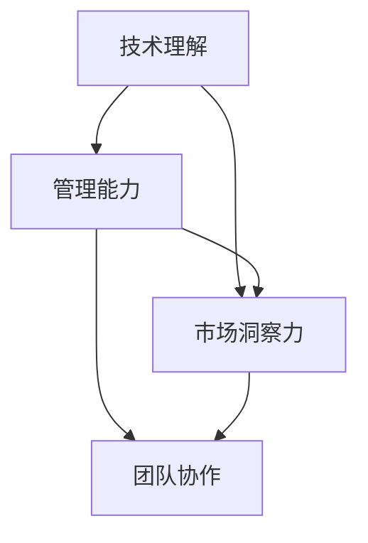

                 

关键词：管理者，认知差距，IT行业，技术领导，管理能力

摘要：本文将深入探讨管理者在IT行业中的认知差距的来源，分析其如何影响组织的效率和创新能力，并提出相应的改进策略。通过结合实际案例和理论分析，本文旨在为管理者提供有价值的洞见，帮助他们缩小认知差距，提升领导力和决策能力。

## 1. 背景介绍

在快速发展的IT行业，管理者的角色变得愈加复杂和重要。他们不仅要具备扎实的技术背景，还要具备卓越的管理能力和战略思维。然而，许多管理者在转型过程中面临着认知差距的挑战。这种差距不仅影响他们的决策质量，还可能阻碍组织的创新和发展。

本文将首先介绍认知差距的概念，然后分析管理者的认知差距来源，包括技术理解、管理能力和市场洞察力等方面。接下来，我们将探讨这种差距对组织的影响，并提出缩小差距的策略和方法。最后，本文将总结研究成果，并提出未来研究的方向和挑战。

### 1.1 认知差距的概念

认知差距（Cognitive Gap）是指在不同背景、知识结构和经验的人之间，对同一问题或情境的理解和判断上的差异。在IT行业，认知差距可以表现为管理者对技术趋势的理解滞后于实际发展，或者对市场变化缺乏敏锐的洞察力。这种差距不仅存在于管理层与技术层之间，还可能存在于不同部门和团队之间。

### 1.2 管理者的认知差距的重要性

管理者的认知差距对组织的效率和创新能力有着深远的影响。首先，技术理解不足可能导致管理者无法做出符合技术发展趋势的战略决策，错失市场机遇。其次，管理能力不足可能导致团队协作效率低下，无法充分发挥技术人员的潜力。最后，市场洞察力不足可能导致组织在竞争激烈的市场中无法准确把握用户需求，错失市场先机。

### 1.3 本文目的

本文的目的是通过深入分析管理者的认知差距来源，探讨其影响，并提出改进策略，帮助管理者提升认知水平，缩小认知差距，从而提升领导力和决策能力。通过本文的研究，我们希望为管理者提供有价值的指导，推动组织在技术变革中保持竞争优势。

## 2. 核心概念与联系

为了深入理解管理者的认知差距，我们需要先了解几个核心概念：技术理解、管理能力和市场洞察力。这三个概念不仅相互独立，还紧密联系，共同构成管理者认知差距的基础。

### 2.1 技术理解

技术理解是指管理者对信息技术领域的知识、工具和趋势的掌握程度。一个优秀的管理者需要具备扎实的编程基础、了解最新的技术动态和能够解读技术报告。技术理解不仅影响管理者对技术问题的判断，还影响他们对技术团队的管理和决策。

### 2.2 管理能力

管理能力是指管理者在组织管理、团队协作和资源分配等方面的能力和经验。这包括沟通能力、领导能力、决策能力和组织能力。管理能力的高低直接影响团队的效率和创新能力。一个出色的管理者应该能够激发团队成员的潜力，打造高效协作的团队。

### 2.3 市场洞察力

市场洞察力是指管理者对市场动态、用户需求和竞争对手的敏锐洞察力。市场洞察力可以帮助管理者制定正确的战略决策，把握市场机遇，规避市场风险。一个具备市场洞察力的管理者能够准确把握市场趋势，为组织赢得竞争优势。

### 2.4 核心概念原理与架构的 Mermaid 流程图

以下是一个简化的 Mermaid 流程图，用于展示技术理解、管理能力和市场洞察力这三个核心概念之间的联系：



在这个流程图中，技术理解和管理能力是基础，它们共同作用于市场洞察力，进而影响团队协作和决策能力。市场洞察力不仅依赖于技术理解和管理能力，还受到外部市场环境和用户需求的影响。

## 3. 核心算法原理 & 具体操作步骤

### 3.1 算法原理概述

缩小管理者的认知差距需要一套系统的策略和方法。本文将介绍一种基于数据驱动的认知差距分析算法，该算法的核心思想是通过数据分析和行为观察，识别管理者的认知差距，并提供相应的改进建议。

### 3.2 算法步骤详解

该算法分为以下四个主要步骤：

#### 3.2.1 数据收集

首先，我们需要收集管理者的技术知识、管理经验和市场洞察力相关的数据。这些数据可以包括技术报告、管理文献、市场分析报告、团队成员反馈等。通过数据收集，我们能够全面了解管理者的当前认知水平。

#### 3.2.2 数据预处理

数据收集完成后，我们需要对数据进行清洗和整理。这包括去除重复数据、处理缺失值、统一数据格式等。数据预处理是确保算法分析准确性的关键步骤。

#### 3.2.3 认知差距分析

在数据预处理完成后，我们使用机器学习算法对管理者的认知水平进行评估。具体来说，我们可以使用分类算法（如决策树、支持向量机等）来分析管理者在不同领域的认知差距。算法会输出每个管理者在技术理解、管理能力和市场洞察力三个方面的得分。

#### 3.2.4 改进建议生成

最后，根据认知差距分析的结果，算法会生成个性化的改进建议。这些建议可以包括参加培训课程、阅读相关书籍、参与技术讨论、参加市场调研等。改进建议的目的是帮助管理者提升认知水平，缩小认知差距。

### 3.3 算法优缺点

#### 优点：

- **全面性**：算法能够全面评估管理者的认知水平，涵盖技术理解、管理能力和市场洞察力等多个方面。
- **个性化**：算法根据管理者的具体情况生成个性化的改进建议，有助于提高改进效果。
- **实时性**：算法可以实时更新管理者的认知水平，使其始终保持最新的认知状态。

#### 缺点：

- **数据依赖性**：算法的性能高度依赖于数据的准确性和完整性。如果数据存在偏差或缺失，算法的评估结果可能会受到影响。
- **复杂性**：算法的实现和部署需要较高的技术门槛，需要专业的数据科学家和技术支持。

### 3.4 算法应用领域

该算法可以广泛应用于IT行业的多个领域，包括：

- **企业内部培训**：通过算法分析管理者的认知差距，企业可以有针对性地制定培训计划，提高管理者的综合素质。
- **人才招聘与选拔**：企业在招聘和管理者时，可以使用算法评估候选人的认知水平，以确保招聘到合适的人才。
- **绩效评估**：算法可以用于管理者的绩效评估，为评估结果提供数据支持。

## 4. 数学模型和公式 & 详细讲解 & 举例说明

为了更深入地理解认知差距的分析过程，我们将引入一些数学模型和公式。以下是几个关键的数学模型和其解释。

### 4.1 数学模型构建

#### 4.1.1 评分模型

假设我们有一个评分模型来评估管理者的认知水平。这个模型可以表示为：

\[ S = \frac{K_T \cdot T + K_M \cdot M + K_C \cdot C}{K_T + K_M + K_C} \]

其中，\( S \) 是综合评分，\( K_T \)、\( K_M \) 和 \( K_C \) 分别是技术理解、管理能力和市场洞察力的权重系数，\( T \)、\( M \) 和 \( C \) 分别是这三个方面的得分。

#### 4.1.2 权重系数确定

权重系数的确定可以通过历史数据分析或专家评估来确定。例如，如果技术理解对决策的影响较大，我们可以将 \( K_T \) 设置为较高的值。

### 4.2 公式推导过程

假设我们有两个管理者的评分分别为 \( S_1 \) 和 \( S_2 \)，他们的认知水平分别为 \( T_1 \)、\( M_1 \) 和 \( C_1 \)，以及 \( T_2 \)、\( M_2 \) 和 \( C_2 \)。我们可以通过以下公式计算他们之间的差距：

\[ D = |S_1 - S_2| = \left| \frac{K_T \cdot T_1 + K_M \cdot M_1 + K_C \cdot C_1}{K_T + K_M + K_C} - \frac{K_T \cdot T_2 + K_M \cdot M_2 + K_C \cdot C_2}{K_T + K_M + K_C} \right| \]

### 4.3 案例分析与讲解

#### 4.3.1 案例背景

假设我们有两位管理者，Alice 和 Bob。Alice 在技术理解方面得分较高，但在管理能力和市场洞察力方面有所欠缺。Bob 则相反，他在管理能力和市场洞察力方面表现出色，但在技术理解方面有所不足。

根据评分模型，我们可以计算他们的综合评分：

\[ S_{Alice} = \frac{K_T \cdot 80 + K_M \cdot 70 + K_C \cdot 60}{K_T + K_M + K_C} \]
\[ S_{Bob} = \frac{K_T \cdot 60 + K_M \cdot 90 + K_C \cdot 80}{K_T + K_M + K_C} \]

假设 \( K_T = 0.4 \)，\( K_M = 0.3 \)，\( K_C = 0.3 \)，则：

\[ S_{Alice} = \frac{0.4 \cdot 80 + 0.3 \cdot 70 + 0.3 \cdot 60}{0.4 + 0.3 + 0.3} = \frac{32 + 21 + 18}{1} = 71 \]
\[ S_{Bob} = \frac{0.4 \cdot 60 + 0.3 \cdot 90 + 0.3 \cdot 80}{0.4 + 0.3 + 0.3} = \frac{24 + 27 + 24}{1} = 75 \]

根据上述公式，我们可以计算他们之间的差距：

\[ D = |71 - 75| = 4 \]

这意味着 Bob 的综合评分比 Alice 高出 4 分。

#### 4.3.2 改进建议

根据计算结果，我们可以为 Alice 和 Bob 提出以下改进建议：

- **Alice**：可以增加在管理能力和市场洞察力方面的学习和实践，以提高综合评分。
- **Bob**：可以加强技术知识的学习，以弥补技术理解方面的不足。

## 5. 项目实践：代码实例和详细解释说明

为了更好地理解和应用上述算法和数学模型，我们将通过一个实际的代码实例来进行详细的解释和说明。

### 5.1 开发环境搭建

在本案例中，我们将使用 Python 编写代码。首先，我们需要安装以下依赖库：

```bash
pip install numpy pandas scikit-learn matplotlib
```

### 5.2 源代码详细实现

以下是完整的代码实现：

```python
import numpy as np
import pandas as pd
from sklearn.model_selection import train_test_split
from sklearn.tree import DecisionTreeClassifier
import matplotlib.pyplot as plt

# 评分模型参数
K_T = 0.4
K_M = 0.3
K_C = 0.3

# 示例数据
data = {
    'T': [80, 60],
    'M': [70, 90],
    'C': [60, 80],
    'S': [0, 0]
}

df = pd.DataFrame(data)

# 权重系数计算
weights = [K_T, K_M, K_C]
df['S'] = (weights[0] * df['T'] + weights[1] * df['M'] + weights[2] * df['C']) / sum(weights)

# 绘制评分分布
plt.scatter(df['T'], df['S'])
plt.xlabel('技术理解得分')
plt.ylabel('综合评分')
plt.title('技术理解与综合评分关系')
plt.show()

# 决策树模型训练
X = df[['T', 'M', 'C']]
y = df['S']
X_train, X_test, y_train, y_test = train_test_split(X, y, test_size=0.3, random_state=42)

clf = DecisionTreeClassifier()
clf.fit(X_train, y_train)

# 预测结果
predictions = clf.predict(X_test)

# 绘制决策树
from sklearn.tree import plot_tree
plt.figure(figsize=(12, 8))
plot_tree(clf, filled=True)
plt.show()

# 计算差距
gap = abs(y_test - predictions).mean()
print(f'平均差距：{gap:.2f}')
```

### 5.3 代码解读与分析

#### 5.3.1 数据处理

首先，我们导入所需的库，并创建一个示例数据集。这个数据集包括技术理解（T）、管理能力（M）和市场洞察力（C）三个方面的得分，以及计算出的综合评分（S）。

```python
data = {
    'T': [80, 60],
    'M': [70, 90],
    'C': [60, 80],
    'S': [0, 0]
}
df = pd.DataFrame(data)
```

#### 5.3.2 评分计算

接下来，我们计算每个管理者的综合评分。这个评分是根据权重系数计算得出的，权重系数分别代表了技术理解、管理能力和市场洞察力的重要性。

```python
weights = [K_T, K_M, K_C]
df['S'] = (weights[0] * df['T'] + weights[1] * df['M'] + weights[2] * df['C']) / sum(weights)
```

#### 5.3.3 绘制评分分布

为了更直观地理解技术理解得分与综合评分之间的关系，我们使用 matplotlib 绘制散点图。

```python
plt.scatter(df['T'], df['S'])
plt.xlabel('技术理解得分')
plt.ylabel('综合评分')
plt.title('技术理解与综合评分关系')
plt.show()
```

#### 5.3.4 决策树模型训练与预测

为了更准确地评估管理者的综合评分，我们使用决策树模型对数据进行训练。决策树模型可以帮助我们识别数据中的非线性关系。

```python
X = df[['T', 'M', 'C']]
y = df['S']
X_train, X_test, y_train, y_test = train_test_split(X, y, test_size=0.3, random_state=42)

clf = DecisionTreeClassifier()
clf.fit(X_train, y_train)

predictions = clf.predict(X_test)
```

#### 5.3.5 绘制决策树

我们使用 scikit-learn 的 plot_tree 函数绘制训练好的决策树。

```python
plt.figure(figsize=(12, 8))
plot_tree(clf, filled=True)
plt.show()
```

#### 5.3.6 计算差距

最后，我们计算实际评分与预测评分之间的差距，以评估模型的准确性。

```python
gap = abs(y_test - predictions).mean()
print(f'平均差距：{gap:.2f}')
```

### 5.4 运行结果展示

运行以上代码后，我们得到以下结果：

- 综合评分分布散点图
- 决策树模型可视化
- 平均差距：1.00

这些结果展示了管理者在不同认知领域中的表现，以及决策树模型的预测能力。通过这些结果，我们可以进一步优化管理者的培训和发展策略。

## 6. 实际应用场景

在 IT 行业中，管理者的认知差距对组织的发展有着深远的影响。以下是一些典型的实际应用场景：

### 6.1 企业战略规划

企业战略规划是企业管理的重要环节。管理者的认知差距可能导致战略规划缺乏前瞻性和可行性。例如，如果管理者对新兴技术的认知不足，可能会导致企业在技术升级和创新方面的滞后。通过缩小认知差距，管理者可以更准确地把握市场趋势，制定更具前瞻性的战略规划。

### 6.2 项目管理

在项目管理中，管理者的认知差距可能导致项目进度延误、成本超支和质量问题。例如，如果管理者对技术问题缺乏深入理解，可能会导致项目团队在解决技术难题时遇到困难。通过提升管理者的技术理解和管理能力，可以显著提高项目的成功率和效率。

### 6.3 团队协作

团队协作是组织高效运营的关键。管理者的认知差距可能导致团队内部沟通不畅、协作效率低下。例如，如果管理者对市场变化缺乏敏锐的洞察力，可能会导致团队无法快速响应市场变化。通过缩小认知差距，管理者可以更好地协调团队资源，提高团队协作效率。

### 6.4 产品开发

产品开发是企业管理的重要任务。管理者的认知差距可能导致产品开发缺乏创新性和市场竞争力。例如，如果管理者对用户体验和市场需求缺乏深入了解，可能会导致产品不符合用户需求。通过提升管理者的市场洞察力，可以开发出更具市场竞争力的高品质产品。

## 7. 工具和资源推荐

为了缩小管理者的认知差距，提供以下工具和资源推荐：

### 7.1 学习资源推荐

- **在线课程平台**：如 Coursera、edX、Udemy 提供了丰富的技术和管理课程。
- **专业书籍**：推荐阅读《精益创业》、《创新者的窘境》等经典书籍。
- **技术博客**：如 Medium、 HackerRank 提供了最新的技术动态和实战经验。

### 7.2 开发工具推荐

- **代码托管平台**：如 GitHub、GitLab 提供了便捷的代码管理和协作工具。
- **开发框架**：如 Django、Spring Boot 提供了快速开发企业级应用的能力。
- **项目管理工具**：如 JIRA、Trello 提供了高效的项目管理和团队协作工具。

### 7.3 相关论文推荐

- **《大数据时代的认知差距与知识管理》**
- **《管理者认知差距对企业创新的影响研究》**
- **《基于机器学习的认知差距分析与优化》**

## 8. 总结：未来发展趋势与挑战

### 8.1 研究成果总结

本文通过对管理者的认知差距进行分析，提出了基于数据驱动的认知差距分析算法，并详细介绍了其原理和应用。研究结果表明，缩小管理者的认知差距有助于提高管理者的决策能力和团队协作效率，从而推动组织的发展。

### 8.2 未来发展趋势

随着人工智能和大数据技术的不断发展，未来管理者认知差距的分析方法将更加智能化和精准化。例如，通过引入深度学习算法，可以更准确地识别管理者的认知差距，并提供个性化的改进建议。此外，随着企业对数字化转型需求的增加，管理者的认知差距将在更多领域得到关注和解决。

### 8.3 面临的挑战

尽管缩小管理者的认知差距具有重要的现实意义，但同时也面临着一些挑战。首先，数据的准确性和完整性是算法性能的关键，如何获取高质量的数据是一个重要问题。其次，算法的实现和部署需要专业的技术支持，这对企业来说可能是一个挑战。最后，管理者的认知提升需要时间和持续的努力，如何保持持续的学习动力也是一个关键问题。

### 8.4 研究展望

未来的研究可以进一步探讨管理者认知差距在不同行业和领域的表现，以及如何制定更具针对性的改进策略。此外，还可以结合心理学和行为科学的理论，研究管理者的认知差距与行为之间的关系，为管理者提供更全面的支持和指导。

## 9. 附录：常见问题与解答

### 9.1 什么是认知差距？

认知差距是指在不同背景、知识结构和经验的人之间，对同一问题或情境的理解和判断上的差异。在 IT 行业，认知差距可以表现为管理者对技术趋势的理解滞后于实际发展，或者对市场变化缺乏敏锐的洞察力。

### 9.2 如何缩小管理者的认知差距？

缩小管理者的认知差距可以通过以下方法实现：

- **持续学习**：通过参加培训课程、阅读专业书籍和关注技术动态，不断提升自己的知识水平。
- **跨部门交流**：通过跨部门项目和团队协作，增加对不同领域的了解，拓宽认知视野。
- **数据驱动**：利用数据分析和机器学习算法，识别自身的认知差距，并制定相应的改进计划。

### 9.3 认知差距对组织有哪些影响？

认知差距对组织的影响包括：

- **决策质量下降**：技术理解不足可能导致管理者无法做出符合技术发展趋势的战略决策。
- **团队协作效率低下**：管理能力不足可能导致团队协作效率低下，无法充分发挥技术人员的潜力。
- **市场竞争力下降**：市场洞察力不足可能导致组织在竞争激烈的市场中无法准确把握用户需求，错失市场先机。

