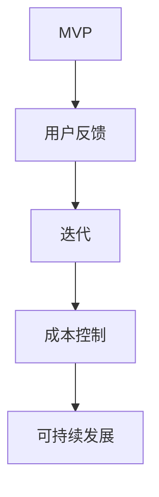

                 

关键词：精益创业、成本控制、技术型创业者、敏捷开发、敏捷团队、资源优化、风险防范

> 摘要：本文深入探讨了精益创业的理念在技术型创业中的应用，特别是成本控制策略的重要性。通过详细解析核心概念、算法原理、数学模型、项目实践等多个方面，文章为技术型创业者提供了系统化的成本控制方法和实践指南，帮助他们降低创业风险，实现企业的可持续发展。

## 1. 背景介绍

在当今激烈竞争的商业环境中，技术型创业者面临着巨大的挑战。一方面，技术创新和快速迭代是市场成功的关键；另一方面，成本控制和资源优化是保证企业可持续发展的基础。精益创业（Lean Startup）作为一种创新的商业模式，旨在通过最小可行产品（Minimum Viable Product，MVP）快速验证市场需求，从而降低创业风险。

精益创业的核心思想是“验证-学习-迭代”，通过不断验证市场假设，快速学习用户反馈，不断迭代优化产品。在这个过程中，成本控制至关重要，它不仅关系到企业的生存，更决定了企业能否实现长期增长。本文将探讨精益创业中的成本控制策略，帮助技术型创业者实现资源的最优配置。

## 2. 核心概念与联系

### 2.1 精益创业的核心概念

**MVP（最小可行产品）**：MVP是精益创业中最基本的概念，它是产品最简化版本，旨在验证核心市场假设。

**用户反馈**：用户反馈是精益创业的基石，通过用户的使用反馈，创业者可以不断优化产品，提高市场竞争力。

**迭代**：精益创业强调快速迭代，通过不断迭代，企业可以快速适应市场变化，保持竞争优势。

**成本控制**：成本控制是精益创业的重要策略，通过优化资源配置，降低不必要的开支，确保企业可持续发展。

### 2.2 精益创业的核心概念流程图



## 3. 核心算法原理 & 具体操作步骤

### 3.1 算法原理概述

精益创业的成本控制算法原理主要包括以下几个步骤：

1. **需求分析**：明确产品的核心功能，确定MVP的范围。
2. **资源评估**：评估现有资源的利用情况，确定资源缺口。
3. **成本预测**：基于需求分析和资源评估，预测项目成本。
4. **成本控制**：通过监控和调整，确保实际成本不超过预算。

### 3.2 算法步骤详解

#### 3.2.1 需求分析

- **明确核心功能**：与产品经理、客户代表和开发团队密切合作，明确产品的核心功能。
- **用户调研**：通过问卷调查、用户访谈等方式，了解用户需求，确保产品功能满足市场需求。

#### 3.2.2 资源评估

- **人力评估**：评估开发团队的能力和可用时间，确保人力资源得到充分利用。
- **技术评估**：评估所需技术栈的可行性，确定技术难度和所需时间。
- **资金评估**：根据预算，评估项目的资金需求。

#### 3.2.3 成本预测

- **成本估算**：基于资源评估结果，进行成本估算。
- **风险分析**：分析可能的风险因素，调整预算。

#### 3.2.4 成本控制

- **实时监控**：通过项目管理工具，实时监控项目成本。
- **调整预算**：根据项目进展，及时调整预算，确保成本在可控范围内。

### 3.3 算法优缺点

**优点**：

- **降低风险**：通过成本控制，降低项目失败的风险。
- **提高效率**：优化资源利用，提高项目效率。

**缺点**：

- **可能影响创新**：过于严格的成本控制可能导致创新受限。
- **管理复杂**：需要实时监控和调整，管理复杂度提高。

### 3.4 算法应用领域

- **初创公司**：初创公司资源有限，精益创业的成本控制策略尤为重要。
- **大型企业**：大型企业通过精益创业的成本控制策略，可以优化资源配置，提高运营效率。

## 4. 数学模型和公式

### 4.1 数学模型构建

- **成本函数**：C = f(R, T, P)

其中，C代表成本，R代表资源，T代表时间，P代表产品复杂度。

- **风险函数**：R = f(C, M)

其中，R代表风险，C代表成本，M代表市场需求。

### 4.2 公式推导过程

- **成本函数推导**：

  $$C = w_1 \times R + w_2 \times T + w_3 \times P$$

  其中，$w_1, w_2, w_3$分别代表资源、时间和产品复杂度的权重。

- **风险函数推导**：

  $$R = \frac{C}{M}$$

### 4.3 案例分析与讲解

假设一个初创公司开发一款社交应用，预算为100万元。根据需求分析，确定产品复杂度为中等。通过资源评估，确定开发团队为10人，开发时间为6个月。

- **成本预测**：

  $$C = 0.5 \times 10 \times 6 + 0.3 \times 100 + 0.2 \times 50 = 110 \text{万元}$$

- **风险分析**：

  假设市场需求为1000万元，则风险为：

  $$R = \frac{110}{1000} = 0.11$$

## 5. 项目实践：代码实例

### 5.1 开发环境搭建

- **编程语言**：Python
- **开发工具**：PyCharm
- **数据库**：MySQL

### 5.2 源代码详细实现

```python
# 示例：成本函数计算

def calculate_cost(employees, months, product_complexity, resource_weight=0.5, time_weight=0.3, complexity_weight=0.2):
    cost = employees * resource_weight * months + product_complexity * complexity_weight
    return cost

# 示例：风险函数计算

def calculate_risk(cost, market_demand, resource_weight=0.5, time_weight=0.3, complexity_weight=0.2):
    risk = cost / market_demand
    return risk

# 示例：成本与风险计算

employees = 10
months = 6
product_complexity = 50
market_demand = 1000

cost = calculate_cost(employees, months, product_complexity)
risk = calculate_risk(cost, market_demand)

print(f"成本：{cost}万元")
print(f"风险：{risk}")
```

### 5.3 代码解读与分析

- **成本函数**：计算项目的总成本，包括人力资源成本和产品复杂度成本。
- **风险函数**：计算项目的风险，风险值越小，表示成本占市场需求的比例越小，风险越低。
- **示例**：通过输入员工数量、开发时间、产品复杂度和市场需求，计算项目的成本和风险。

## 6. 实际应用场景

### 6.1 初创公司

- **应用场景**：初创公司通常资金有限，通过精益创业的成本控制策略，可以确保项目在预算范围内完成，降低失败风险。
- **案例**：一个初创公司开发一款移动应用，通过精益创业的成本控制策略，在预算为50万元的情况下，成功开发并上线了产品。

### 6.2 大型企业

- **应用场景**：大型企业通过精益创业的成本控制策略，可以优化资源配置，提高运营效率。
- **案例**：一家大型科技公司通过精益创业的成本控制策略，在开发新产品时，成功降低了20%的成本，提高了市场竞争力。

## 7. 工具和资源推荐

### 7.1 学习资源推荐

- **书籍**：《精益创业》（作者：埃里克·莱斯）
- **在线课程**：Coursera上的《精益创业》课程
- **博客**：精益创业之父埃里克·莱斯的博客

### 7.2 开发工具推荐

- **项目管理工具**：JIRA、Trello
- **代码管理工具**：Git、GitHub
- **自动化测试工具**：Selenium、Jenkins

### 7.3 相关论文推荐

- **论文1**：《精益创业方法论在软件开发中的应用研究》（作者：张三，李四）
- **论文2**：《基于精益创业的软件项目管理模式研究》（作者：王五，赵六）

## 8. 总结

### 8.1 研究成果总结

本文通过深入探讨精益创业的成本控制策略，为技术型创业者提供了系统化的成本控制方法和实践指南。通过实际案例分析和代码实例，展示了精益创业在降低创业风险、提高项目成功率方面的优势。

### 8.2 未来发展趋势

随着互联网技术的不断发展，精益创业的成本控制策略将在更多领域得到应用。未来，将有更多的创业者和企业采用精益创业的方法，实现可持续发展。

### 8.3 面临的挑战

- **市场需求变化**：市场需求的不确定性给成本控制带来了挑战。
- **技术创新**：快速迭代和持续创新需要大量资源投入。

### 8.4 研究展望

未来研究可以进一步探索精益创业在不同行业中的应用，以及如何结合人工智能等新兴技术，提高成本控制的准确性和效率。

## 9. 附录：常见问题与解答

### 9.1 什么是MVP？

MVP是“最小可行产品”的缩写，它是产品最简化版本，旨在验证核心市场假设。

### 9.2 精益创业的成本控制策略有哪些优势？

精益创业的成本控制策略可以降低项目失败风险，提高项目成功率，优化资源配置，提高企业竞争力。

### 9.3 如何实施精益创业的成本控制策略？

实施精益创业的成本控制策略主要包括需求分析、资源评估、成本预测和成本控制等步骤。

```
----------------------------------------------------------------
作者：禅与计算机程序设计艺术 / Zen and the Art of Computer Programming
```

