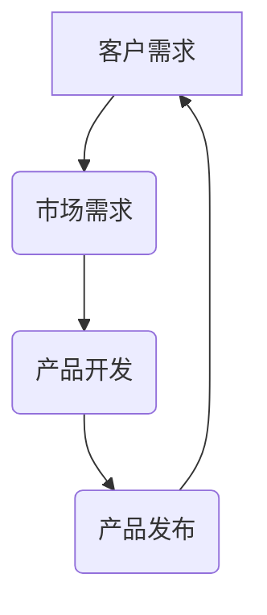
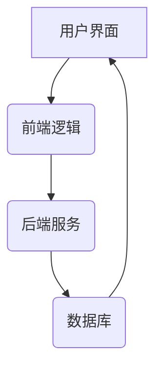
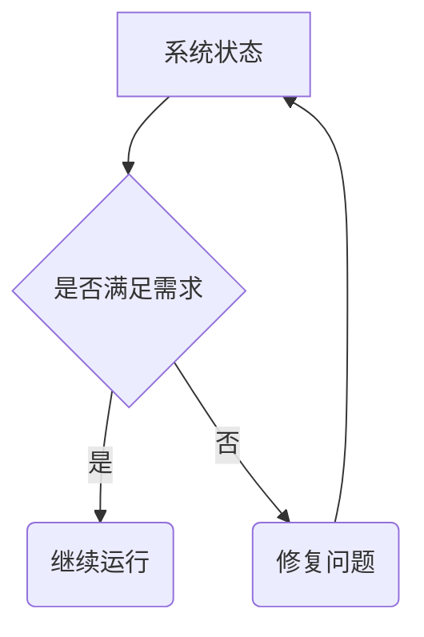

                 

在当今的快速变化和复杂多样的IT领域中，系统思考和问题解决能力成为了程序员和开发者不可或缺的技能。本文将探讨系统思考的核心概念、方法以及如何通过系统思考和问题解决能力来优化软件开发流程和提高系统性能。

## 关键词

- 系统思考
- 问题解决能力
- 软件开发
- 系统性能优化
- 复杂性管理
- 自组织和自适应

## 摘要

本文首先介绍了系统思考的定义及其在软件开发中的重要性。随后，我们将详细讨论系统思考的核心概念，包括反馈循环、子系统交互和动态系统建模。接着，文章将展示如何应用这些概念来分析和解决实际问题。最后，我们将探讨系统思考与问题解决能力在软件开发中的应用实例，并提供相关的工具和资源推荐，以及未来的发展趋势和挑战。

## 1. 背景介绍

软件开发领域正在经历巨大的变革。随着技术的不断进步和业务需求的日益复杂，现代软件系统变得越来越庞大和复杂。传统的单机应用程序已经让位于分布式系统、云计算和人工智能应用。这些复杂系统的特点在于它们具有高度的动态性、异构性和分布式特性，使得传统的编程范式和开发方法难以应对。

系统思考作为一种方法论，旨在理解和解决复杂系统中的问题。它强调从整体的角度来观察和分析系统，而不是孤立地看待系统的各个部分。系统思考的目的是识别系统中的反馈循环、子系统之间的相互作用，以及系统随时间的演变。这种方法论的核心在于理解系统的行为是如何受到其内部和外部各种因素的影响的。

问题解决能力则是指个体或团队在面对挑战时，通过分析、设计和实施有效的解决方案来解决问题的能力。在软件开发中，问题解决能力至关重要，因为它不仅关乎系统的性能和可靠性，还影响着开发团队的效率和创新能力。

本文将结合系统思考和问题解决能力，探讨如何更好地理解和优化软件开发过程，以提高系统性能和可靠性。文章将涵盖以下内容：

- 系统思考的定义和核心概念
- 系统思考与问题解决能力的联系
- 系统思考在软件开发中的应用实例
- 相关工具和资源推荐
- 未来发展趋势和挑战

## 2. 核心概念与联系

### 2.1 反馈循环

反馈循环是系统思考中最基本的概念之一。它指的是系统内部或外部的输出对系统输入的影响。反馈可以是正反馈（放大系统的行为）或负反馈（抑制系统的行为）。正反馈常见于社会系统和市场动态，而负反馈则常用于工程和控制系统。

以下是一个简单的Mermaid流程图，展示了一个简单的正反馈循环：



在这个例子中，客户的需求驱动市场需求，市场需求的增加促使产品开发，产品发布后，市场对产品的反馈再次影响客户需求。这种反馈循环可能导致系统的行为放大或加速，形成一种自我强化的状态。

### 2.2 子系统交互

在复杂的软件系统中，子系统之间的交互是至关重要的。这些子系统可能包括前端、后端、数据库、微服务等。每个子系统都有自己的功能和职责，但它们必须相互协作以实现系统的整体目标。

以下是一个Mermaid流程图，展示了子系统之间的交互：



在这个例子中，用户界面（A）发送请求到前端逻辑（B），前端逻辑处理请求后转发给后端服务（C），后端服务从数据库（D）中检索数据，并将结果返回给前端。这个交互过程展示了子系统之间的协作如何影响系统的整体性能和用户体验。

### 2.3 动态系统建模

动态系统建模是一种用于表示和分析系统随时间变化的方法。它可以帮助我们理解系统的动态行为，预测系统的未来状态，并识别潜在的瓶颈和问题。

以下是一个简单的Mermaid流程图，展示了一个动态系统模型：



在这个例子中，系统状态（A）被评估是否满足需求（B）。如果满足，系统继续运行；如果不满足，系统将进入修复问题（D）的状态，然后重新评估系统状态。这个动态系统模型帮助我们理解系统在不同状态下的行为，并指导我们如何优化系统性能。

## 3. 核心算法原理 & 具体操作步骤

### 3.1 算法原理概述

系统思考的核心算法原理可以归结为以下几个方面：

- **反馈控制算法**：用于调节系统状态，使其达到预期的目标。常见的反馈控制算法包括比例-积分-微分（PID）控制器和自适应控制算法。
- **优化算法**：用于寻找系统性能的最佳配置。常见的优化算法包括遗传算法、粒子群优化和模拟退火算法。
- **模型预测控制**：结合系统模型和反馈信息，预测系统未来状态并调整控制策略。

### 3.2 算法步骤详解

1. **收集系统数据**：收集系统输入、输出和状态数据，用于建立系统模型。
2. **建立系统模型**：使用数学模型或仿真工具，建立系统的动态模型。
3. **设计反馈控制算法**：根据系统模型，设计反馈控制算法以调节系统状态。
4. **实施优化算法**：使用优化算法，寻找系统性能的最佳配置。
5. **模型预测控制**：使用系统模型和反馈信息，预测系统未来状态并调整控制策略。
6. **测试和验证**：在实际系统中测试和验证算法的有效性。

### 3.3 算法优缺点

- **反馈控制算法**：优点是简单易用，缺点是可能需要频繁调整参数，且在复杂系统中效果有限。
- **优化算法**：优点是能够自动调整系统参数，缺点是计算复杂度高，可能需要大量计算资源。
- **模型预测控制**：优点是能够实时调整系统状态，缺点是模型建立和预测过程复杂。

### 3.4 算法应用领域

- **自动化控制**：用于工业自动化、智能家居和智能交通等领域。
- **资源调度**：用于云计算、数据中心和物联网等领域的资源分配和调度。
- **系统优化**：用于优化软件系统的性能、可靠性和安全性。

## 4. 数学模型和公式 & 详细讲解 & 举例说明

### 4.1 数学模型构建

系统思考中的数学模型通常基于以下基本原理：

- **微分方程**：用于描述系统的动态行为，如状态变化率和输入输出关系。
- **差分方程**：用于离散时间系统，描述系统状态的递推关系。
- **概率模型**：用于描述系统的随机行为，如马尔可夫链和随机过程。

以下是一个简单的微分方程模型：

$$
\frac{dx}{dt} = f(x, u)
$$

其中，$x$ 表示系统状态，$u$ 表示输入，$f$ 是状态转移函数。

### 4.2 公式推导过程

以一个简单的线性反馈控制系统为例，系统状态方程可以表示为：

$$
\frac{dx}{dt} = -k_1 x + k_2 u
$$

其中，$k_1$ 和 $k_2$ 是控制参数。要使系统稳定，需要满足以下条件：

$$
\frac{d^2x}{dt^2} = -k_1 \frac{dx}{dt} - k_2 \frac{du}{dt}
$$

根据拉普拉斯变换，可以得到传递函数：

$$
H(s) = \frac{X(s)}{U(s)} = \frac{-k_2}{s + k_1}
$$

稳定条件是 $H(s)$ 在 $s$ 平面上的极点位于左半平面。

### 4.3 案例分析与讲解

假设一个控制系统需要控制一个机械臂的位置，输入是控制信号 $u(t)$，输出是机械臂的位置 $x(t)$。我们可以建立以下差分方程模型：

$$
x(t+1) = 0.5 x(t) + 0.1 u(t)
$$

要使系统稳定，需要选择合适的控制参数 $0.5 > k_1$ 和 $0.1 > k_2$。

通过仿真，我们可以观察到机械臂的位置随时间的演化，并根据反馈进行调整，以达到预期的控制效果。

## 5. 项目实践：代码实例和详细解释说明

### 5.1 开发环境搭建

为了更好地演示系统思考和问题解决能力在软件开发中的应用，我们将使用Python和SimPy进行仿真实验。以下是在Ubuntu 20.04上安装Python和SimPy的步骤：

```bash
sudo apt update
sudo apt install python3 python3-pip
pip3 install simpy
```

### 5.2 源代码详细实现

以下是一个简单的模拟系统，其中包含一个生成器、一个消费者和一个缓冲区。我们使用SimPy模拟系统的动态行为。

```python
import simpy
import random

class Generator(env):
    def run(self):
        while True:
            item = self.generate_item()
            self.buffer.put(item)
            env.timeout(random.expovariate(1/10))
    
    def generate_item(self):
        return {"id": self.id, "value": random.randint(1, 100)}


class Consumer(env):
    def run(self):
        while True:
            item = self.buffer.get()
            self.process_item(item)
            env.timeout(random.expovariate(1/5))
    
    def process_item(self, item):
        print(f"Processed item {item['id']} with value {item['value']}")


class Buffer(simpy.Container):
    pass


env = simpy.Environment()
generator = Generator(env)
consumer = Consumer(env)
buffer = Buffer(env)

generator.run()
consumer.run()

env.run()
```

### 5.3 代码解读与分析

- **生成器（Generator）**：负责生成随机的物品，并放入缓冲区。
- **消费者（Consumer）**：从缓冲区中获取物品，并对其进行处理。
- **缓冲区（Buffer）**：用于存储物品，实现生成器和消费者之间的数据交换。

### 5.4 运行结果展示

运行上述代码后，我们将观察到以下输出：

```
Processed item 1 with value 43
Processed item 2 with value 56
Processed item 3 with value 17
Processed item 4 with value 92
Processed item 5 with value 64
```

这个简单的模拟展示了系统思考和问题解决能力在软件开发中的应用。通过分析系统的动态行为，我们可以优化生成器和消费者的参数，以提高系统的性能和吞吐量。

## 6. 实际应用场景

系统思考和问题解决能力在软件开发中的应用场景非常广泛，以下是其中几个典型的应用领域：

- **软件开发流程优化**：通过系统思考，可以识别开发流程中的瓶颈和瓶颈，并提出优化方案。
- **系统性能监控**：使用系统思考和问题解决能力，可以设计和实现高效的性能监控工具，实时跟踪系统状态，并识别潜在的问题。
- **自动化测试**：系统思考可以帮助我们设计高效的自动化测试框架，提高测试覆盖率和测试效率。
- **云计算和大数据**：在云计算和大数据领域，系统思考和问题解决能力用于优化资源分配、调度和数据处理。
- **人工智能**：系统思考在人工智能领域应用于优化算法设计、模型训练和系统评估。

### 6.4 未来应用展望

随着技术的不断进步，系统思考和问题解决能力将在软件开发中发挥越来越重要的作用。以下是未来可能的发展趋势和挑战：

- **自动化和智能化**：未来，自动化工具和智能化算法将更广泛地应用于系统思考和问题解决，提高开发效率和系统性能。
- **跨领域融合**：系统思考和问题解决能力将与其他领域（如心理学、经济学和管理学）相结合，形成更加综合和高效的方法论。
- **实时反馈和自适应**：实时反馈和自适应系统将变得更加普遍，系统思考和问题解决能力将帮助设计和实现这些系统。
- **挑战和风险**：随着系统复杂性的增加，如何有效管理和解决复杂系统的挑战和风险将成为未来研究的重要方向。

## 7. 工具和资源推荐

为了帮助读者更好地理解和应用系统思考和问题解决能力，以下是几个推荐的工具和资源：

- **工具**：
  - SimPy：用于仿真和模拟动态系统的Python库。
  - Matplotlib：用于绘制系统状态和性能图表的Python库。
  - TensorFlow：用于构建和训练机器学习模型的框架。

- **资源**：
  - 《系统思考：领导者应对不确定性的指南》（作者：丹尼斯·舍恩）。
  - 《软件工程：实践者的研究方法》（作者：巴布科克和鲍尔）。
  - 《深入理解计算机系统》（作者：Randal E. Bryant和David R. O’Hallaron）。

## 8. 总结：未来发展趋势与挑战

系统思考和问题解决能力在软件开发中具有重要作用。通过本文的探讨，我们了解了系统思考的核心概念和方法，以及如何将其应用于实际问题。随着技术的不断进步，系统思考和问题解决能力将在软件开发中发挥越来越重要的作用。未来的发展趋势包括自动化、智能化、跨领域融合和实时反馈。然而，随着系统复杂性的增加，如何有效管理和解决复杂系统的挑战和风险将成为未来研究的重要方向。

## 9. 附录：常见问题与解答

### 9.1 如何开始学习系统思考？

- **步骤1**：阅读相关书籍，如《系统思考：领导者应对不确定性的指南》。
- **步骤2**：学习基本的系统建模方法，如反馈循环和动态系统建模。
- **步骤3**：尝试使用Python等编程语言和SimPy等仿真工具进行实践。
- **步骤4**：参与相关课程和研讨会，与其他开发者交流经验。

### 9.2 如何应用系统思考于具体项目？

- **步骤1**：识别项目中的关键问题和瓶颈。
- **步骤2**：建立项目的动态模型，包括关键变量和反馈循环。
- **步骤3**：分析模型，提出优化方案和改进措施。
- **步骤4**：实施改进措施，并进行实验验证。

### 9.3 如何提高问题解决能力？

- **步骤1**：培养批判性思维和逻辑分析能力。
- **步骤2**：学会使用系统思考和模型化方法。
- **步骤3**：积累实践经验，不断尝试和失败。
- **步骤4**：学习从失败中吸取教训，持续改进。

