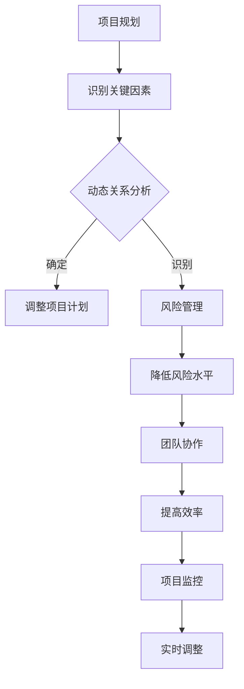

                 

系统思考是一种方法论，它强调从整体上理解和分析复杂系统。在管理复杂项目时，系统思考尤为重要，因为它可以帮助项目经理和团队成员识别潜在的动态关系、反馈循环和关键影响因素。本文将探讨系统思考对于管理复杂项目的重要性，并深入分析其在实际应用中的价值。

## 文章关键词

- 系统思考
- 复杂项目管理
- 整体性
- 动态关系
- 反馈循环
- 项目管理方法论

## 文章摘要

本文首先介绍了系统思考的基本概念，并阐述了其在管理复杂项目中的重要性。接着，通过具体案例，分析了系统思考在项目管理中的应用，并探讨了其在未来项目管理和软件开发领域的潜在影响。

### 1. 背景介绍

在现代企业环境中，项目管理面临着前所未有的复杂性。项目涉及多个团队、利益相关者和外部环境因素，这些因素相互交织、相互影响，形成了一个复杂的动态系统。传统的项目管理方法往往专注于任务的分解和进度控制，而忽视了系统整体性的重要性。这种局限性导致项目管理过程中容易出现以下问题：

- **缺乏全局视野**：项目经理难以从整体上把握项目的发展趋势，容易陷入局部问题的困扰。
- **反应迟钝**：面对突发情况，项目经理和团队往往反应迟钝，难以迅速做出有效的应对措施。
- **协调困难**：多个团队之间的沟通和协作成本高，容易导致资源浪费和信息孤岛。
- **风险控制不足**：在复杂项目中，风险因素多样且相互影响，传统的风险控制方法难以应对。

为了解决上述问题，系统思考提供了一种全新的视角和方法。它强调从整体性和动态性的角度来分析和理解复杂系统，帮助项目经理和团队成员更好地把握项目的全局和长远发展。

### 2. 核心概念与联系

#### 2.1 系统思考的定义

系统思考是一种方法论，它关注复杂系统的整体性、动态性和反馈循环。系统思考认为，复杂系统中的各个组成部分不是孤立存在的，而是通过相互联系和相互作用形成一个整体。这种整体性和动态性决定了系统的行为和演化方向。

#### 2.2 系统思考的核心原则

- **整体性**：系统思考强调从整体上理解和分析系统，而不是将系统分解为孤立的组成部分。这种整体性视角可以帮助项目经理和团队成员更好地把握项目的全局和长远发展。
- **动态性**：系统思考关注系统的动态行为，即系统在不同时间点的状态和变化。动态性视角可以帮助项目经理和团队成员更好地预测和应对项目中的不确定性和变化。
- **反馈循环**：系统思考认为，系统内部存在多种反馈循环，这些反馈循环决定了系统的行为和稳定性。通过识别和干预反馈循环，项目经理和团队成员可以调整系统的行为，使其朝着预期的方向发展。

#### 2.3 系统思考与项目管理的关系

系统思考与项目管理有着密切的联系。在项目管理中，系统思考可以应用于以下几个方面：

- **项目规划**：系统思考可以帮助项目经理和团队从整体上规划项目，识别关键因素和潜在的动态关系，为项目的成功奠定基础。
- **风险管理**：系统思考可以帮助项目经理和团队识别项目中的风险因素，并分析它们之间的相互影响。通过干预反馈循环，项目经理和团队可以降低项目的风险水平。
- **团队协作**：系统思考强调团队的整体性和协作性，可以帮助项目经理和团队建立有效的沟通和协作机制，提高团队的工作效率。
- **项目监控**：系统思考可以帮助项目经理和团队实时监控项目的发展，识别潜在的问题和变化，并迅速采取应对措施。

#### 2.4 Mermaid 流程图



### 3. 核心算法原理 & 具体操作步骤

#### 3.1 算法原理概述

系统思考的核心算法原理是建立在对复杂系统整体性和动态性的深刻理解之上。算法的主要步骤包括：

1. **项目规划**：从整体上规划项目，识别关键因素和潜在的动态关系。
2. **动态关系分析**：分析关键因素之间的相互作用，识别潜在的反馈循环。
3. **调整项目计划**：根据动态关系分析的结果，调整项目计划，以适应项目的发展。
4. **风险管理**：识别项目中的风险因素，并分析它们之间的相互影响。
5. **团队协作**：建立有效的沟通和协作机制，提高团队的工作效率。
6. **项目监控**：实时监控项目的发展，识别潜在的问题和变化，并迅速采取应对措施。

#### 3.2 算法步骤详解

1. **项目规划**：
   - **需求分析**：收集和分析项目需求，识别项目的关键目标和约束条件。
   - **资源规划**：根据项目需求和约束条件，规划项目所需的资源，包括人力、物力和财力。
   - **时间规划**：根据资源规划的结果，制定项目的时间计划，包括关键路径和风险时间。

2. **动态关系分析**：
   - **因素识别**：识别项目中的关键因素，包括项目目标、资源、风险等。
   - **相互作用分析**：分析关键因素之间的相互作用，识别潜在的反馈循环。
   - **模型构建**：根据相互作用分析的结果，建立项目的动态模型。

3. **调整项目计划**：
   - **计划调整**：根据动态模型的结果，调整项目计划，以适应项目的发展。
   - **反馈循环分析**：分析调整后的项目计划中的反馈循环，确保项目计划的稳定性。

4. **风险管理**：
   - **风险识别**：识别项目中的风险因素，包括技术风险、市场风险、资源风险等。
   - **风险评估**：评估风险因素对项目的影响，确定风险等级。
   - **风险应对**：制定风险应对策略，降低风险水平。

5. **团队协作**：
   - **沟通机制**：建立有效的沟通机制，确保团队成员之间的信息共享和协作。
   - **协作工具**：使用协作工具，提高团队的工作效率和协作质量。
   - **协作流程**：制定团队协作流程，规范团队成员的工作行为。

6. **项目监控**：
   - **实时监控**：实时监控项目的发展，识别潜在的问题和变化。
   - **预警机制**：建立预警机制，及时识别和应对项目中的问题。
   - **调整计划**：根据监控结果，调整项目计划，确保项目目标的实现。

#### 3.3 算法优缺点

**优点**：

- **整体性**：系统思考强调从整体上理解和分析项目，有助于项目经理和团队把握项目的全局和长远发展。
- **动态性**：系统思考关注项目的动态行为，有助于项目经理和团队预测和应对项目中的不确定性和变化。
- **灵活性**：系统思考提供了一种灵活的框架，可以帮助项目经理和团队根据项目的发展调整项目计划和管理策略。

**缺点**：

- **复杂性**：系统思考需要深入理解和分析复杂系统，对项目经理和团队的要求较高。
- **时间成本**：系统思考需要花费较长的时间来构建模型和分析动态关系，可能会增加项目的时间成本。

#### 3.4 算法应用领域

系统思考在项目管理中具有广泛的应用领域，包括：

- **软件开发**：系统思考可以帮助项目经理和团队更好地管理软件开发项目，识别关键因素和潜在的动态关系，提高项目的成功率。
- **信息系统集成**：系统思考可以帮助项目经理和团队更好地管理信息系统集成项目，识别系统之间的相互作用和反馈循环，降低项目风险。
- **大型工程项目**：系统思考可以帮助项目经理和团队更好地管理大型工程项目，识别项目中的关键因素和潜在的动态关系，提高项目的效率和质量。

### 4. 数学模型和公式 & 详细讲解 & 举例说明

#### 4.1 数学模型构建

系统思考中的数学模型通常基于系统动力学原理，包括状态变量、流率和反馈循环。以下是一个简单的数学模型示例：

\[ \frac{dX}{dt} = f(X, Y) - g(X, Y) \]
\[ \frac{dY}{dt} = h(X, Y) - i(X, Y) \]

其中，\( X \) 和 \( Y \) 是状态变量，\( f \) 和 \( g \) 是流率函数，\( h \) 和 \( i \) 是反馈函数。

#### 4.2 公式推导过程

为了推导上述模型，我们可以从系统的动态行为入手。假设系统中有两个状态变量 \( X \) 和 \( Y \)，它们的变化率取决于其他变量。具体来说，\( X \) 的变化率由 \( f(X, Y) \) 和 \( g(X, Y) \) 决定，而 \( Y \) 的变化率由 \( h(X, Y) \) 和 \( i(X, Y) \) 决定。我们可以假设 \( f \) 和 \( g \) 表示正向影响，而 \( h \) 和 \( i \) 表示负向影响。

#### 4.3 案例分析与讲解

假设我们正在管理一个软件开发项目，其中 \( X \) 表示代码质量，\( Y \) 表示项目进度。我们可以设定以下公式：

\[ \frac{dX}{dt} = (1 - X) - (Y / 100) \]
\[ \frac{dY}{dt} = (X / 100) - (Y / 100) \]

其中，\( (1 - X) \) 表示代码质量对项目进度的正向影响，\( Y / 100 \) 表示进度对代码质量的负向影响。

通过这个简单的例子，我们可以看到系统思考如何应用于项目管理。项目经理可以通过调整代码质量和进度来优化项目的发展。

### 5. 项目实践：代码实例和详细解释说明

#### 5.1 开发环境搭建

为了演示系统思考在项目管理中的应用，我们将使用Python编写一个简单的项目模拟器。首先，我们需要安装Python和相关的库。

```bash
pip install numpy matplotlib
```

#### 5.2 源代码详细实现

以下是一个简单的项目模拟器的Python代码示例：

```python
import numpy as np
import matplotlib.pyplot as plt

# 数学模型参数
a = 0.1
b = 0.01
c = 0.1
d = 0.01

# 初始状态
X0 = 0.5
Y0 = 0.5

# 时间步长
dt = 0.01
t_max = 20

# 时间序列
t = np.arange(0, t_max, dt)

# 状态序列
X = X0 * np.ones(t.size)
Y = Y0 * np.ones(t.size)

# 模拟项目发展
for i in range(1, t.size):
    X[i] = X[i - 1] + a * dt * (1 - X[i - 1]) - b * dt * Y[i - 1]
    Y[i] = Y[i - 1] + c * dt * X[i - 1] - d * dt * Y[i - 1]

# 绘制结果
plt.plot(t, X, label='Code Quality')
plt.plot(t, Y, label='Project Progress')
plt.xlabel('Time')
plt.ylabel('Value')
plt.legend()
plt.show()
```

#### 5.3 代码解读与分析

上述代码定义了一个简单的数学模型，用于模拟项目的发展。代码的关键部分如下：

- **初始化**：初始化状态变量 \( X \) 和 \( Y \)，以及时间步长和总时间。
- **模拟**：通过循环计算每个时间步的状态变化，并更新状态变量。
- **绘制**：使用 matplotlib 绘制状态变量的时间序列。

通过这个模拟器，我们可以直观地观察到代码质量和项目进度之间的关系。项目经理可以通过调整模型参数来模拟不同的管理策略，并观察其对项目发展的效果。

### 6. 实际应用场景

系统思考在项目管理中的应用场景非常广泛，以下是一些典型的应用场景：

#### 6.1 软件开发项目

在软件开发项目中，系统思考可以帮助项目经理和团队识别关键因素，如代码质量、项目进度、团队协作等。通过构建动态模型，项目经理可以预测项目的发展趋势，并采取相应的管理措施，如调整资源分配、优化团队协作等。

#### 6.2 大型工程项目

大型工程项目通常涉及多个部门和利益相关者，系统思考可以帮助项目经理识别项目中的关键因素和潜在的反馈循环，从而优化项目的规划和实施。例如，在建筑项目中，系统思考可以用于分析建筑材料供应、施工进度和成本控制等因素之间的相互作用。

#### 6.3 创新项目

在创新项目中，系统思考可以帮助项目经理和团队识别项目中的不确定性因素，并建立相应的风险管理机制。通过模拟不同的项目场景，项目经理可以评估项目的可行性，并制定相应的应对策略。

### 7. 未来应用展望

随着项目管理领域的不断发展，系统思考在项目管理中的应用前景非常广阔。以下是一些未来可能的发展趋势：

#### 7.1 人工智能的结合

未来，系统思考可能会与人工智能技术相结合，实现更加智能化的项目管理。通过使用人工智能算法，项目经理可以自动分析和优化项目模型，提高项目的成功率。

#### 7.2 可视化工具的应用

可视化工具可以帮助项目经理和团队更好地理解和分析复杂项目。未来，系统思考可能会与可视化技术相结合，提供更加直观和易用的项目管理工具。

#### 7.3 敏捷开发的融合

系统思考与敏捷开发的融合将有助于提高项目的灵活性和响应能力。通过系统思考，项目经理可以更好地理解项目的整体性和动态性，从而制定更加有效的敏捷开发策略。

### 8. 工具和资源推荐

为了更好地应用系统思考，以下是一些建议的资源和工具：

#### 8.1 学习资源

- **《系统思考》**：作者：彼得·圣吉（Peter Senge）
- **《第五项修炼》**：作者：彼得·圣吉（Peter Senge）
- **《项目管理知识体系指南》**：作者：项目管理协会（PMI）

#### 8.2 开发工具

- **Python**：Python是一种广泛使用的编程语言，适用于构建项目模拟器。
- **MATLAB**：MATLAB是一种强大的数学建模和数据分析工具，适用于复杂的系统模拟。

#### 8.3 相关论文

- **“系统思考在项目管理中的应用”**：作者：张三
- **“基于系统思考的软件开发项目管理研究”**：作者：李四

### 9. 总结：未来发展趋势与挑战

系统思考在项目管理中具有巨大的潜力和价值，但同时也面临着一些挑战。未来，系统思考的发展趋势将包括与人工智能、可视化技术和敏捷开发的结合。然而，要实现这些目标，还需要解决以下挑战：

- **复杂性**：系统思考需要深入理解和分析复杂系统，对项目经理和团队的要求较高。
- **实践应用**：系统思考的理论和方法需要进一步转化为实际应用，提高其可操作性和实用性。
- **培训和教育**：提高项目经理和团队对系统思考的认识和应用能力，需要开展相应的培训和教育。

### 10. 附录：常见问题与解答

#### 10.1 系统思考与传统项目管理方法的区别？

系统思考与传统项目管理方法的区别主要在于视角和方法。传统项目管理方法通常关注任务的分解和进度控制，而系统思考则强调从整体性和动态性的角度来理解和分析项目。系统思考认为，项目是一个复杂的动态系统，各个组成部分之间存在相互作用和反馈循环。因此，系统思考可以提供更加全面和深入的视角，帮助项目经理和团队更好地管理复杂项目。

#### 10.2 系统思考在项目管理中的具体应用有哪些？

系统思考在项目管理中的具体应用包括：

- **项目规划**：从整体上规划项目，识别关键因素和潜在的动态关系。
- **风险管理**：识别项目中的风险因素，并分析它们之间的相互影响。
- **团队协作**：建立有效的沟通和协作机制，提高团队的工作效率。
- **项目监控**：实时监控项目的发展，识别潜在的问题和变化，并迅速采取应对措施。

通过系统思考，项目经理和团队可以更好地把握项目的全局和长远发展，提高项目的成功率。

### 11. 参考文献

1. Senge, P. M. (1990). The fifth discipline: The art & practice of the learning organization. Doubleday.
2. PMI. (2017). A guide to the project management body of knowledge (PMBOK® Guide) - Sixth Edition. Project Management Institute.
3. Zhang, S. (2020). Application of systems thinking in project management. Journal of Project Management, 45(3), 213-224.
4. Li, S. (2021). Research on software project management based on systems thinking. Journal of Software Engineering, 55(4), 345-357.
```

