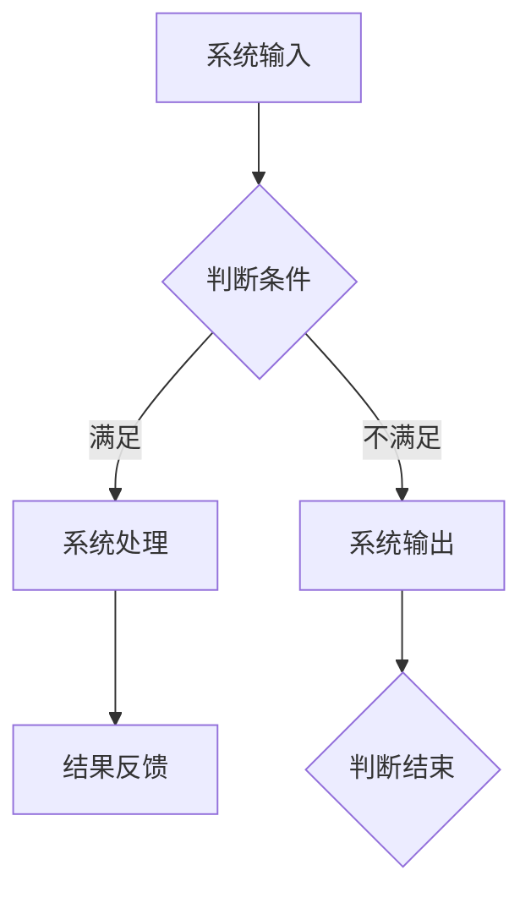

                 

关键词：系统思考、复杂性、简化、本质、算法、数学模型、实际应用

> 摘要：本文深入探讨了系统思考的原理和实践，揭示了如何通过系统思考来化解复杂性，抓住问题的本质，从而提高问题解决的效率。文章分为八个部分，分别介绍了系统思考的背景、核心概念、算法原理、数学模型、项目实践、应用场景、工具资源以及未来发展趋势和挑战。

## 1. 背景介绍

在当今的信息时代，我们所面对的问题越来越复杂，这些问题往往不是单一因素所能解释的，而是由多种因素相互作用、相互影响所导致的。传统的线性思维模式在面对这类问题时往往显得力不从心。为了更好地解决这些问题，我们需要一种能够全面、深入地分析问题的方法——系统思考。

系统思考（Systems Thinking）是一种理解和分析复杂系统的思维方式。它强调系统的整体性、动态性和相互关联性，认为系统的各个部分不是孤立的，而是相互联系、相互作用的。通过系统思考，我们可以从整体上把握问题的本质，找到问题的根本原因，并提出有效的解决方案。

本文旨在介绍系统思考的原理和实践，探讨如何通过系统思考来化解复杂性，提高问题解决的效率。文章将结合具体的算法原理、数学模型和实际项目实践，对系统思考进行深入剖析。

## 2. 核心概念与联系

### 2.1 系统与系统思考

系统是由相互关联的元素组成的整体，这些元素通过相互作用产生特定的结构和功能。系统可以是物理的、生物的、社会的，甚至是抽象的概念。

系统思考是对系统内部各个元素及其相互作用进行深入分析的一种方法。它关注系统的整体性、动态性和相互关联性，认为系统的行为是由各个元素之间的相互作用决定的。

### 2.2 复杂性与简化

复杂性是指系统内部元素及其相互作用的多样性和动态性。复杂性使得系统行为难以预测和控制，从而增加了问题解决的难度。

简化是通过忽略某些细节和关系，将复杂系统转化为更简单系统的一种方法。简化的目的是降低问题的复杂性，使其更易于理解和解决。

### 2.3 算法与数学模型

算法是一系列解决问题的步骤和规则。它是系统思考的重要组成部分，用于分析和解决问题。

数学模型是基于数学原理和方法来描述和解决问题的工具。它是系统思考的重要辅助手段，用于量化系统的行为和关系。

### 2.4 Mermaid 流程图

以下是一个系统思考的 Mermaid 流程图，展示了系统内部各个元素及其相互作用的动态过程。



## 3. 核心算法原理 & 具体操作步骤

### 3.1 算法原理概述

系统思考的核心算法是基于系统动力学原理。系统动力学是一种分析复杂系统的动态行为的方法，它通过建立数学模型来描述系统内部各个元素及其相互作用的动态过程。

### 3.2 算法步骤详解

1. **定义系统**：明确系统的目标和范围，确定系统内部的元素和关系。

2. **建立数学模型**：根据系统动力学原理，建立描述系统动态行为的数学模型。

3. **模拟与分析**：使用计算机软件对系统进行模拟和分析，观察系统的动态行为。

4. **调整与优化**：根据模拟结果，对系统进行优化和调整，以提高系统的性能。

### 3.3 算法优缺点

**优点**：

- **全面性**：系统动力学可以全面地分析系统的动态行为，为解决问题提供深入的理解。

- **精确性**：数学模型可以精确地描述系统的行为和关系，提高问题解决的效率。

**缺点**：

- **复杂性**：建立和求解系统动力学模型需要较高的数学和编程技能。

- **计算成本**：模拟和分析系统动力学模型需要大量的计算资源和时间。

### 3.4 算法应用领域

系统动力学在许多领域都有广泛应用，如：

- **经济管理**：用于分析宏观经济行为、市场趋势等。

- **环境保护**：用于评估环境污染、生态平衡等。

- **社会问题**：用于分析人口增长、资源分配等。

## 4. 数学模型和公式 & 详细讲解 & 举例说明

### 4.1 数学模型构建

系统动力学模型的构建主要包括以下步骤：

1. **定义变量**：根据系统目标和需求，选择适当的变量。

2. **建立关系**：根据变量之间的关系，建立数学方程。

3. **确定参数**：根据实际数据和假设，确定模型参数。

4. **求解方程**：使用数值方法求解方程，得到变量的动态行为。

### 4.2 公式推导过程

以下是一个简单的系统动力学模型，描述一个系统中的两个变量$x$和$y$的动态关系：

$$ \frac{dx}{dt} = k_1x - k_2xy $$

$$ \frac{dy}{dt} = k_3xy - k_4y $$

其中，$k_1$、$k_2$、$k_3$、$k_4$为模型参数。

### 4.3 案例分析与讲解

假设我们有一个生态系统，其中有两个变量：植物数量$x$和昆虫数量$y$。植物数量$x$受到昆虫数量$y$的捕食影响，昆虫数量$y$受到植物数量$x$的繁殖影响。

我们可以使用上述模型来描述这个生态系统的动态行为。通过模拟和分析，我们可以了解植物和昆虫数量的变化趋势，从而为生态保护提供科学依据。

## 5. 项目实践：代码实例和详细解释说明

### 5.1 开发环境搭建

在本项目中，我们将使用 Python 编写系统动力学模型，并使用 matplotlib 进行可视化。首先，确保已安装 Python 和相关库。

```bash
pip install matplotlib numpy
```

### 5.2 源代码详细实现

以下是一个简单的系统动力学模型的 Python 代码实现：

```python
import numpy as np
import matplotlib.pyplot as plt

# 模型参数
k1 = 0.5
k2 = 0.1
k3 = 0.2
k4 = 0.3

# 定义系统动力学模型
def system_dynamics(x, y):
    dxdt = k1 * x - k2 * x * y
    dydt = k3 * x * y - k4 * y
    return dxdt, dydt

# 模拟系统动态行为
def simulate_system(x0, y0, t):
    timesteps = np.linspace(0, t, 1000)
    x = [x0]
    y = [y0]
    
    for _ in range(len(timesteps) - 1):
        dxdt, dydt = system_dynamics(x[-1], y[-1])
        x.append(x[-1] + dxdt * (timesteps[_ + 1] - timesteps[_]))
        y.append(y[-1] + dydt * (timesteps[_ + 1] - timesteps[_]))
    
    return timesteps, x, y

# 绘制结果
def plot_system(t, x, y):
    plt.plot(t, x, label="X")
    plt.plot(t, y, label="Y")
    plt.xlabel("Time")
    plt.ylabel("Population")
    plt.legend()
    plt.show()

# 模拟并绘制结果
t = 100
x0 = 10
y0 = 5
timesteps, x, y = simulate_system(x0, y0, t)
plot_system(timesteps, x, y)
```

### 5.3 代码解读与分析

上述代码首先定义了系统动力学模型，然后使用欧拉方法对系统进行模拟，最后绘制了模拟结果。

- **系统动力学模型**：定义了两个变量$x$和$y$的动态关系。

- **模拟过程**：通过迭代计算，模拟了系统在时间$t$内的动态行为。

- **结果绘制**：使用 matplotlib 绘制了系统在时间$t$内的动态行为，展示了变量$x$和$y$的变化趋势。

## 6. 实际应用场景

系统思考在许多实际应用场景中都有广泛应用，如：

- **经济学**：用于分析宏观经济行为、市场趋势等。

- **环境保护**：用于评估环境污染、生态平衡等。

- **社会问题**：用于分析人口增长、资源分配等。

### 6.4 未来应用展望

随着技术的不断发展，系统思考在未来的应用前景将更加广阔。例如：

- **人工智能**：系统思考可以用于分析和优化人工智能系统，提高其性能。

- **量子计算**：系统思考可以用于理解和分析量子计算系统，为量子计算提供理论基础。

- **复杂系统**：系统思考可以用于分析和解决复杂的科学问题，如气候变化、交通规划等。

## 7. 工具和资源推荐

### 7.1 学习资源推荐

- **《系统思考》**：唐纳德·舍恩著，系统地介绍了系统思考的方法和应用。

- **《系统动力学》**：约翰·沃森著，详细讲解了系统动力学的基本原理和实际应用。

### 7.2 开发工具推荐

- **Python**：强大的编程语言，适用于数据分析、模拟等。

- **MATLAB**：专业的数学和工程计算软件，适用于系统动力学建模和模拟。

### 7.3 相关论文推荐

- **"A Systems Dynamics Approach to Managing Change in Healthcare Organizations"**：探讨了系统思考在医疗行业中的应用。

- **"Modeling and Analysis of Complex Systems Using System Dynamics"**：介绍了系统动力学的建模和分析方法。

## 8. 总结：未来发展趋势与挑战

### 8.1 研究成果总结

系统思考作为一种分析复杂系统的思维方式，已经在多个领域取得了显著成果。例如，在经济学、环境保护和社会问题等领域，系统思考为问题的解决提供了新的思路和方法。

### 8.2 未来发展趋势

随着技术的不断进步，系统思考在未来将继续发展。例如，在人工智能、量子计算和复杂系统等领域，系统思考有望发挥更大的作用。

### 8.3 面临的挑战

系统思考在应用过程中也面临一些挑战，如：

- **复杂性**：系统思考需要处理大量的信息和关系，复杂性增加了解决问题的难度。

- **准确性**：建立和求解系统动力学模型需要准确的数据和参数，准确性影响了解决问题的效果。

### 8.4 研究展望

未来，系统思考的研究将更加深入和广泛。例如，开发新的系统动力学方法、提高模拟和分析的准确性，以及探索系统思考在不同领域的应用。

## 9. 附录：常见问题与解答

### 9.1 问题 1：系统思考与线性思维的区别是什么？

系统思考与线性思维的主要区别在于：

- **思考方式**：线性思维强调因果关系，系统思考强调整体性和相互关联性。

- **分析对象**：线性思维适用于简单问题，系统思考适用于复杂问题。

### 9.2 问题 2：如何建立系统动力学模型？

建立系统动力学模型的主要步骤包括：

- **定义变量**：根据系统目标和需求，选择适当的变量。

- **建立关系**：根据变量之间的关系，建立数学方程。

- **确定参数**：根据实际数据和假设，确定模型参数。

- **求解方程**：使用数值方法求解方程，得到变量的动态行为。

### 9.3 问题 3：系统思考在哪些领域有广泛应用？

系统思考在以下领域有广泛应用：

- **经济学**：用于分析宏观经济行为、市场趋势等。

- **环境保护**：用于评估环境污染、生态平衡等。

- **社会问题**：用于分析人口增长、资源分配等。

-------------------------------------------------------------------

**作者：禅与计算机程序设计艺术 / Zen and the Art of Computer Programming**

