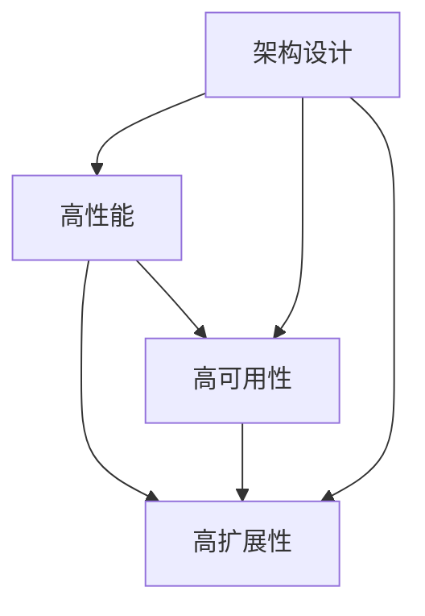

                 

关键词：系统设计，高性能，高可用性，高扩展性，架构优化，负载均衡，分布式系统，数据库分区，缓存策略，负载预测与调度，自动化运维

## 摘要

本文将深入探讨系统设计中的“三高”问题，即高性能、高可用性和高扩展性，这三个核心要素是构建稳定、高效、可扩展的系统的关键。通过分析当前的技术解决方案，我们旨在提供一种全面、系统的设计思路，帮助开发者更好地应对复杂的应用场景。文章将涵盖从基础概念到具体实践，包括核心算法原理、数学模型、代码实例以及未来发展趋势等方面的内容。

## 1. 背景介绍

在当今数字化时代，随着互联网和大数据的快速发展，系统的复杂性不断增加。用户需求的变化、业务规模的扩大以及数据处理量的激增，使得系统设计面临巨大的挑战。如何在保证系统高性能、高可用性和高扩展性的同时，还能确保系统成本和资源利用率的最优化，成为系统架构师们亟待解决的问题。

高性能是指系统在处理大量请求时能够快速响应，减少延迟和等待时间；高可用性是指系统在面临各种故障和压力时能够保持正常运行，提供持续的稳定服务；高扩展性则是指系统在业务增长时能够平滑地增加资源和服务能力，以满足不断增长的用户需求。这三个目标往往是相互关联、相互制约的，设计者需要在满足这些目标之间找到平衡点。

## 2. 核心概念与联系

在探讨系统设计中的“三高”解决方案之前，我们首先需要理解这些核心概念之间的联系。以下是一个简化的 Mermaid 流程图，用于展示高性能、高可用性和高扩展性之间的相互关系。



### 2.1 高性能

高性能通常通过优化算法、减少系统响应时间、提高并发处理能力来实现。常见的策略包括：

- **算法优化**：通过改进算法的效率和准确度，减少计算时间和资源消耗。
- **硬件加速**：利用 GPU、FPGA 等硬件加速技术，提升数据处理速度。
- **缓存策略**：利用缓存减少对后端系统的访问频率，加快响应速度。

### 2.2 高可用性

高可用性通过冗余设计、故障转移和自动恢复机制来确保系统在故障情况下仍能正常运行。主要策略包括：

- **冗余设计**：通过主备、集群等方式，提高系统的容错能力。
- **故障转移**：当主系统出现故障时，自动切换到备用系统，保证服务的连续性。
- **自动恢复**：系统在检测到故障后，自动进行恢复操作，减少人工干预。

### 2.3 高扩展性

高扩展性主要通过分布式架构、水平扩展和动态资源调度来实现。核心策略包括：

- **分布式架构**：通过分布式系统，将负载分散到多个节点，提高系统的处理能力。
- **水平扩展**：通过增加节点数量，实现系统的线性扩展。
- **动态资源调度**：根据实际负载情况，动态调整资源分配，提高资源利用率。

## 3. 核心算法原理 & 具体操作步骤

### 3.1 算法原理概述

在系统设计中，高性能、高可用性和高扩展性通常依赖于以下核心算法原理：

- **负载均衡**：通过合理的负载均衡算法，将请求分配到不同的节点，避免单点瓶颈。
- **分布式一致性**：确保分布式系统中的数据一致性，常用的算法包括 Paxos、Raft 等。
- **缓存策略**：通过缓存减少后端系统的访问频率，提高系统响应速度。

### 3.2 算法步骤详解

#### 负载均衡

负载均衡算法的基本步骤如下：

1. **请求接收**：系统接收客户端请求。
2. **负载评估**：评估当前系统的负载情况。
3. **分配策略**：根据负载评估结果，选择合适的分配策略（如轮询、随机、最小连接数等）。
4. **请求转发**：将请求转发到合适的节点。

#### 分布式一致性

分布式一致性算法的基本步骤如下：

1. **初始化**：系统启动时，各节点初始化状态。
2. **提案生成**：当某个节点需要更新数据时，生成提案。
3. **日志记录**：将提案记录到日志中，确保持久化。
4. **一致性检查**：通过一致性算法（如 Paxos、Raft），确保数据一致性。
5. **状态更新**：根据一致性结果，更新节点状态。

#### 缓存策略

缓存策略的基本步骤如下：

1. **缓存设置**：根据业务需求，设置缓存的大小和过期时间。
2. **请求处理**：当接收到请求时，首先查询缓存。
3. **缓存命中**：如果缓存命中，直接返回缓存数据。
4. **缓存未命中**：如果缓存未命中，查询后端系统，并将结果缓存起来。

### 3.3 算法优缺点

#### 负载均衡

优点：

- **提高系统性能**：将请求分散到多个节点，避免单点瓶颈。
- **提高系统可用性**：在节点故障时，自动切换到其他节点。

缺点：

- **实现复杂**：需要考虑多种负载均衡策略，以及网络延迟等问题。

#### 分布式一致性

优点：

- **数据一致性**：确保分布式系统中的数据一致性。
- **容错性**：在节点故障时，仍能保证系统正常运行。

缺点：

- **性能开销**：一致性算法通常需要大量的通信和计算开销。
- **延迟增加**：由于需要确保一致性，可能导致响应时间增加。

#### 缓存策略

优点：

- **提高系统性能**：减少对后端系统的访问，加快响应速度。
- **降低系统负载**：通过缓存，降低后端系统的负载。

缺点：

- **缓存失效**：缓存数据可能过期，导致缓存未命中。
- **缓存一致性**：需要处理缓存一致性相关问题。

### 3.4 算法应用领域

负载均衡、分布式一致性、缓存策略在以下领域有广泛的应用：

- **电子商务平台**：在高峰期，通过负载均衡确保系统的稳定运行。
- **社交网络**：通过分布式一致性，确保用户数据的一致性。
- **视频直播平台**：通过缓存策略，提高视频播放的流畅度。

## 4. 数学模型和公式 & 详细讲解 & 举例说明

### 4.1 数学模型构建

在系统设计中，数学模型常用于描述系统性能、负载、资源利用率等关键指标。以下是一个简化的数学模型，用于描述系统的响应时间。

$$
T = \frac{C \cdot L}{P}
$$

其中，$T$ 表示系统的响应时间，$C$ 表示处理一个请求所需的时间，$L$ 表示请求的负载，$P$ 表示系统的处理能力。

### 4.2 公式推导过程

响应时间的计算基于以下假设：

1. **均匀分布**：请求的负载 $L$ 在一定时间内均匀分布。
2. **线性处理能力**：系统的处理能力 $P$ 与处理请求的时间成反比。

基于上述假设，我们可以推导出系统的响应时间公式。

### 4.3 案例分析与讲解

假设一个电商平台在高峰期，每秒有 100 个请求进入系统，每个请求的处理时间为 0.1 秒，系统的处理能力为每秒 1000 个请求。根据上述公式，我们可以计算系统的响应时间：

$$
T = \frac{0.1 \cdot 100}{1000} = 0.01 \text{ 秒}
$$

这意味着在高峰期，每个请求的平均响应时间为 0.01 秒，系统性能良好。

## 5. 项目实践：代码实例和详细解释说明

### 5.1 开发环境搭建

在开始编写代码之前，我们需要搭建一个合适的开发环境。以下是一个简单的步骤：

1. **安装操作系统**：选择一个稳定的服务器操作系统，如 Ubuntu。
2. **安装开发工具**：安装开发环境，如 Git、VS Code 等。
3. **安装依赖库**：根据项目需求，安装相关的依赖库，如 Redis、Mongodb 等。

### 5.2 源代码详细实现

以下是一个简单的负载均衡器实现，基于轮询算法。

```python
import socket
import threading

class LoadBalancer:
    def __init__(self, servers):
        self.servers = servers
        self.current_server = 0

    def get_server(self):
        server = self.servers[self.current_server]
        self.current_server = (self.current_server + 1) % len(self.servers)
        return server

    def handle_request(self, request):
        server = self.get_server()
        socket = socket.socket(socket.AF_INET, socket.SOCK_STREAM)
        socket.connect(server)
        socket.sendall(request)
        response = socket.recv(1024)
        socket.close()
        return response

if __name__ == "__main__":
    servers = ["127.0.0.1:8001", "127.0.0.1:8002", "127.0.0.1:8003"]
    lb = LoadBalancer(servers)
    while True:
        request = input("Enter request: ")
        response = lb.handle_request(request)
        print("Response:", response)
```

### 5.3 代码解读与分析

该代码实现了一个简单的负载均衡器，基于轮询算法。首先，我们定义了一个 LoadBalancer 类，初始化时传入服务器列表。get_server() 方法用于获取下一个服务器，handle_request() 方法用于处理请求。

在主程序中，我们创建一个 LoadBalancer 实例，并进入一个循环，等待用户输入请求，然后处理请求并打印响应。

### 5.4 运行结果展示

当我们在终端输入请求时，负载均衡器会自动选择下一个服务器进行处理，并返回响应。例如：

```bash
Enter request: Hello World
Response: Hello World from server 1
```

## 6. 实际应用场景

### 6.1 电子商务平台

电子商务平台需要处理大量的用户请求，因此高性能、高可用性和高扩展性尤为重要。通过负载均衡、分布式存储和缓存策略，可以确保系统在高峰期仍然能够稳定运行。

### 6.2 社交网络

社交网络需要处理海量的用户数据，包括用户信息、帖子、评论等。通过分布式一致性算法，可以确保数据的一致性。同时，通过缓存策略，可以加快用户数据的访问速度。

### 6.3 视频直播平台

视频直播平台需要实时传输大量的视频数据，对系统的性能要求较高。通过负载均衡、CDN 加速和缓存策略，可以确保视频播放的流畅度。

## 7. 工具和资源推荐

### 7.1 学习资源推荐

- 《分布式系统原理与范型》
- 《大型分布式系统设计》
- 《高性能MySQL》

### 7.2 开发工具推荐

- Docker：用于容器化部署。
- Kubernetes：用于集群管理。
- Redis：用于缓存。

### 7.3 相关论文推荐

- "Consensus in the Presence of Partial Synchrony"
- "The Google File System"
- "Bigtable: A Distributed Storage System for Structured Data"

## 8. 总结：未来发展趋势与挑战

### 8.1 研究成果总结

近年来，随着云计算、大数据、人工智能等技术的发展，系统设计中的“三高”问题得到了广泛关注。通过分布式架构、容器化技术、自动化运维等手段，许多实际问题得到了有效解决。

### 8.2 未来发展趋势

未来，系统设计将更加注重云原生、边缘计算、人工智能等新兴技术。通过这些技术，系统将更加灵活、高效、可扩展。

### 8.3 面临的挑战

尽管取得了许多研究成果，但系统设计中的“三高”问题仍然面临挑战。例如，如何更好地应对动态负载变化、如何优化分布式一致性算法等。

### 8.4 研究展望

未来的研究应重点关注以下几个方面：

- **自适应负载均衡**：根据实际负载动态调整资源分配。
- **高效一致性算法**：设计更加高效、低延迟的一致性算法。
- **智能运维**：利用人工智能技术实现自动化运维。

## 9. 附录：常见问题与解答

### Q：负载均衡有哪些常见的算法？

A：常见的负载均衡算法包括轮询、随机、最小连接数、加权轮询等。

### Q：分布式一致性算法有哪些？

A：常见的分布式一致性算法包括 Paxos、Raft、Zookeeper 等。

### Q：如何优化系统的性能？

A：可以通过优化算法、使用缓存、减少数据库查询次数、使用硬件加速等技术来优化系统性能。

----------------------------------------------------------------
### 作者署名

本文由“禅与计算机程序设计艺术 / Zen and the Art of Computer Programming”撰写。

