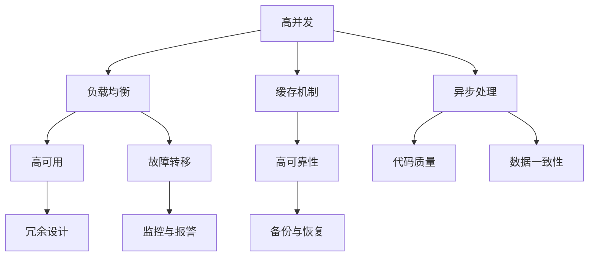

                 

关键词：系统设计，高并发，高可用，高可靠性，解决方案，架构优化，性能提升

> 摘要：本文深入探讨了系统设计中面临的三大挑战——“三高”问题，即高并发、高可用和高可靠性，并解析了一系列针对性的解决方案。通过详尽的案例分析和实践，本文旨在为系统架构师和开发者提供实用的指导，帮助他们更好地应对复杂系统环境下的技术难题。

## 1. 背景介绍

在现代信息技术快速发展的背景下，系统设计面临着越来越复杂的需求和挑战。高并发、高可用和高可靠性，即通常所说的“三高”，是系统设计中最为关键的三项指标。这些指标不仅关系到系统的性能，更直接影响到用户的体验和企业的竞争力。

- **高并发**：指系统能够在短时间内处理大量用户的请求，保证系统的响应速度和流畅性。
- **高可用**：指系统在长时间内保持正常运行，尽可能减少系统宕机和中断的时间。
- **高可靠性**：指系统在运行过程中具备较强的容错能力和稳定性，确保数据的安全和完整性。

### 1.1 高并发的挑战

随着互联网的普及和业务的增长，系统需要处理的海量请求使得高并发成为一个不可忽视的问题。高并发带来的挑战包括：
- 网络延迟和阻塞
- 资源争用和竞争
- 数据库瓶颈

### 1.2 高可用的挑战

高可用性要求系统在面对各种故障和异常时能够保持稳定运行。挑战包括：
- 硬件故障和系统崩溃
- 网络中断和数据丢失
- 安全漏洞和攻击

### 1.3 高可靠性的挑战

高可靠性涉及到系统的稳定性和数据安全性。主要挑战包括：
- 软件缺陷和代码质量
- 数据一致性
- 备份与恢复机制

## 2. 核心概念与联系

为了更好地理解和解决“三高”问题，我们需要了解几个核心概念，并探讨它们之间的相互关系。

### 2.1 高并发

高并发涉及到系统的负载能力和资源调度。其核心概念包括：
- **负载均衡**：通过分配请求到不同的服务器，避免单点瓶颈。
- **缓存机制**：将频繁访问的数据存储在内存中，减少数据库的负载。
- **异步处理**：将耗时长的操作异步化，避免阻塞主线程。

### 2.2 高可用

高可用性需要确保系统在异常情况下能够迅速恢复。核心概念包括：
- **冗余设计**：通过备份和冗余组件确保系统在部分故障时仍能正常运行。
- **故障转移**：当主系统发生故障时，自动切换到备用系统。
- **监控与报警**：实时监控系统的运行状态，及时发现并处理异常。

### 2.3 高可靠性

高可靠性涉及到系统的稳定性和数据安全。核心概念包括：
- **代码质量**：通过严格的代码审查和自动化测试，提高软件的稳定性。
- **数据一致性**：确保数据的完整性和一致性，防止数据丢失和错误。
- **备份与恢复**：定期备份数据，并制定有效的恢复策略。

### 2.4 Mermaid 流程图

以下是一个简化的Mermaid流程图，展示了高并发、高可用和高可靠性之间的相互关系。



## 3. 核心算法原理 & 具体操作步骤

### 3.1 算法原理概述

在系统设计中，针对“三高”问题，我们通常会采用以下核心算法原理来解决问题：

- **负载均衡算法**：如轮询算法、最小连接算法、源地址哈希算法等，用于合理分配请求。
- **缓存算法**：如最近最少使用（LRU）、最少访问时间（LFU）等，用于优化数据存储和访问。
- **分布式算法**：如一致性哈希、Paxos算法、Raft算法等，用于实现数据的分布式存储和一致性。

### 3.2 算法步骤详解

#### 3.2.1 负载均衡算法

1. **初始化**：设置负载均衡器，确定算法类型（如轮询算法）。
2. **请求分发**：根据算法规则，将请求分配到不同的服务器。
3. **状态监控**：监控各个服务器的负载情况，动态调整请求分配策略。

#### 3.2.2 缓存算法

1. **缓存设置**：确定缓存的大小和缓存策略。
2. **数据存储**：将频繁访问的数据存储在缓存中。
3. **缓存替换**：根据缓存算法（如LRU），定期替换缓存中的数据。

#### 3.2.3 分布式算法

1. **数据分割**：将数据分割成多个部分，分布存储在不同的服务器上。
2. **一致性维护**：通过一致性算法（如Paxos），保证数据的分布式一致性。
3. **故障恢复**：当部分服务器故障时，通过冗余数据自动恢复。

### 3.3 算法优缺点

#### 负载均衡算法

**优点**：
- **提高系统性能**：均衡负载，避免单点瓶颈。
- **增强系统可用性**：故障转移，减少系统宕机时间。

**缺点**：
- **复杂度高**：需要维护服务器状态，实时调整策略。
- **开销较大**：增加网络通信和计算开销。

#### 缓存算法

**优点**：
- **提高访问速度**：减少数据库访问，提高系统响应速度。
- **降低数据库负载**：缓存热点数据，减轻数据库压力。

**缺点**：
- **缓存一致性**：需要确保缓存与数据库数据的一致性。
- **缓存命中率**：缓存命中率影响系统性能。

#### 分布式算法

**优点**：
- **高可用性**：分布式存储，提高系统容错能力。
- **扩展性**：易于扩展，支持大规模数据处理。

**缺点**：
- **一致性挑战**：分布式一致性较难保证。
- **复杂度高**：需要处理分布式算法的复杂性。

### 3.4 算法应用领域

- **负载均衡算法**：适用于大型互联网应用，如电商平台、视频直播平台等。
- **缓存算法**：适用于高访问量的Web应用，如社交媒体、搜索引擎等。
- **分布式算法**：适用于大数据处理、分布式存储、区块链等领域。

## 4. 数学模型和公式 & 详细讲解 & 举例说明

在解决“三高”问题时，数学模型和公式起到了关键作用。以下将介绍一些常用的数学模型和公式，并进行详细讲解和举例说明。

### 4.1 数学模型构建

#### 4.1.1 负载均衡模型

负载均衡模型的核心目标是确定请求分配策略，以最小化系统响应时间和最大化资源利用率。一个简单的负载均衡模型可以表示为：

$$
\text{响应时间} = \frac{\sum_{i=1}^{n} \text{服务器} \_ i \text{的响应时间} \times \text{请求比例}}{n}
$$

其中，\(n\)表示服务器的数量，每个服务器的响应时间和请求比例可以根据具体情况进行调整。

#### 4.1.2 缓存模型

缓存模型的核心目标是优化数据访问，减少数据库负载。一个简单的缓存模型可以表示为：

$$
\text{缓存命中率} = \frac{\text{命中缓存请求次数}}{\text{总请求次数}}
$$

通过调整缓存的大小和缓存策略，可以提高缓存命中率，从而提高系统性能。

#### 4.1.3 分布式一致性模型

分布式一致性模型的核心目标是保证数据在不同服务器之间的同步。一个简单的分布式一致性模型可以表示为：

$$
\text{一致性} = \text{P}(\text{所有服务器数据一致}) = \text{P}(\text{服务器} \_ i \text{数据一致}) \times \text{P}(\text{服务器} \_ i \text{数据同步})
$$

通过一致性算法，如Paxos或Raft，可以确保数据在不同服务器之间的同步和一致性。

### 4.2 公式推导过程

#### 4.2.1 负载均衡模型推导

假设有\(n\)个服务器，每个服务器的响应时间分别为\(t\_1, t\_2, ..., t\_n\)，请求比例分别为\(p\_1, p\_2, ..., p\_n\)（即每个服务器的请求占比）。则每个服务器的平均响应时间为：

$$
t' = \frac{\sum_{i=1}^{n} t\_i \times p\_i}{n}
$$

整个系统的响应时间为：

$$
\text{响应时间} = t'
$$

因此，负载均衡模型的公式可以表示为：

$$
\text{响应时间} = \frac{\sum_{i=1}^{n} t\_i \times p\_i}{n}
$$

#### 4.2.2 缓存模型推导

假设缓存的大小为\(C\)，缓存命中率为\(H\)，总请求次数为\(R\)。则：

$$
\text{命中缓存请求次数} = R \times H
$$

缓存命中率的计算公式为：

$$
\text{缓存命中率} = \frac{\text{命中缓存请求次数}}{\text{总请求次数}} = \frac{R \times H}{R} = H
$$

因此，缓存模型的公式可以表示为：

$$
\text{缓存命中率} = \frac{\text{命中缓存请求次数}}{\text{总请求次数}}
$$

#### 4.2.3 分布式一致性模型推导

假设有\(n\)个服务器，每个服务器的数据一致性概率为\(P\_i\)，同步概率为\(S\_i\)。则：

$$
\text{一致性概率} = \text{P}(\text{所有服务器数据一致}) = \text{P}(\text{服务器} \_ i \text{数据一致}) \times \text{P}(\text{服务器} \_ i \text{数据同步}) = P\_i \times S\_i
$$

由于一致性概率是各个服务器一致性概率的乘积，因此分布式一致性模型的公式可以表示为：

$$
\text{一致性} = \text{P}(\text{所有服务器数据一致}) = \text{P}(\text{服务器} \_ i \text{数据一致}) \times \text{P}(\text{服务器} \_ i \text{数据同步}) = P\_i \times S\_i
$$

### 4.3 案例分析与讲解

#### 4.3.1 负载均衡案例

假设有一个电商平台，其服务器数量为5，每个服务器的响应时间分别为2秒、3秒、4秒、2.5秒和3.5秒，请求比例分别为0.2、0.2、0.2、0.2和0.2。则根据负载均衡模型，可以计算出整个系统的平均响应时间为：

$$
\text{响应时间} = \frac{2 \times 0.2 + 3 \times 0.2 + 4 \times 0.2 + 2.5 \times 0.2 + 3.5 \times 0.2}{5} = \frac{0.4 + 0.6 + 0.8 + 0.5 + 0.7}{5} = 1.6 \text{秒}
$$

这个结果表示，通过合理的负载均衡策略，该电商平台可以保证系统的平均响应时间为1.6秒，从而提升用户体验。

#### 4.3.2 缓存案例

假设一个社交媒体平台的缓存大小为1GB，缓存命中率为0.9。根据缓存模型，可以计算出缓存命中的请求次数为：

$$
\text{命中缓存请求次数} = \text{总请求次数} \times \text{缓存命中率} = R \times 0.9
$$

如果总请求次数为100万次，则缓存命中的请求次数为：

$$
\text{命中缓存请求次数} = 1000000 \times 0.9 = 900000
$$

这表示，通过缓存机制，该社交媒体平台可以减少对数据库的访问次数，从而提高系统性能。

#### 4.3.3 分布式一致性案例

假设一个分布式数据库系统由5个节点组成，每个节点的数据一致性概率为0.95，同步概率为0.98。根据分布式一致性模型，可以计算出系统的整体一致性概率为：

$$
\text{一致性概率} = 0.95 \times 0.98 = 0.931
$$

这表示，通过分布式一致性算法，该分布式数据库系统可以确保整体一致性概率达到93.1%，从而保证数据的安全性和完整性。

## 5. 项目实践：代码实例和详细解释说明

为了更好地理解“三高”问题的解决方案，下面将提供一个实际项目的代码实例，并进行详细的解释说明。

### 5.1 开发环境搭建

在本案例中，我们将使用Python语言进行开发，主要依赖以下库：

- Flask：用于构建Web应用。
- gunicorn：用于部署Web应用。
- Redis：用于缓存机制。
- etcd：用于服务发现和配置管理。

首先，我们需要安装所需的库：

```bash
pip install flask gunicorn redis etcd
```

### 5.2 源代码详细实现

#### 5.2.1 Flask应用

以下是一个简单的Flask应用，用于处理HTTP请求：

```python
from flask import Flask, request, jsonify

app = Flask(__name__)

@app.route('/api/data', methods=['GET'])
def get_data():
    # 从Redis缓存中获取数据
    cache = request.args.get('cache')
    if cache:
        data = get_data_from_cache(cache)
        if data:
            return jsonify(data)
    
    # 从数据库中获取数据
    data = get_data_from_db()
    # 将数据存储到Redis缓存中
    store_data_to_cache(data)
    return jsonify(data)

def get_data_from_cache(cache_key):
    # 从Redis缓存中获取数据
    return cache_key

def store_data_to_cache(data):
    # 将数据存储到Redis缓存中
    pass

def get_data_from_db():
    # 从数据库中获取数据
    return {"data": "example_data"}

if __name__ == '__main__':
    app.run()
```

#### 5.2.2 gunicorn部署

使用gunicorn部署Flask应用：

```bash
gunicorn -w 4 -k gthread app:app
```

其中，`-w 4`表示启动4个工作进程，`-k gthread`表示使用多线程处理请求。

#### 5.2.3 Redis缓存

使用Redis缓存存储和获取数据：

```python
import redis

# 连接Redis服务器
redis_client = redis.StrictRedis(host='localhost', port=6379, db=0)

def get_data_from_cache(cache_key):
    # 从Redis缓存中获取数据
    return redis_client.get(cache_key)

def store_data_to_cache(data):
    # 将数据存储到Redis缓存中
    cache_key = data["key"]
    redis_client.set(cache_key, json.dumps(data))
```

### 5.3 代码解读与分析

#### 5.3.1 Flask应用

该Flask应用提供了一个 `/api/data` 接口，用于获取数据。首先会检查请求参数中是否有 `cache` 字段，如果有，则尝试从Redis缓存中获取数据。如果没有找到缓存数据，则从数据库中获取数据，并将数据存储到Redis缓存中。

#### 5.3.2 gunicorn部署

使用gunicorn部署Flask应用，可以通过增加工作进程数和线程数来提高并发处理能力。在多核CPU环境下，适当增加工作进程和线程数可以显著提升系统性能。

#### 5.3.3 Redis缓存

Redis缓存用于存储和获取频繁访问的数据，从而减少数据库访问次数，提高系统性能。通过设置合理的缓存策略，可以进一步提高缓存命中率。

### 5.4 运行结果展示

在运行该应用后，可以使用浏览器或Postman等工具访问 `/api/data` 接口，查看返回的数据。通过调整缓存策略和并发处理能力，可以观察系统的性能表现。

## 6. 实际应用场景

在现实世界的系统中，“三高”问题无处不在。以下是一些实际应用场景，以及相应的解决方案：

### 6.1 大型电商平台

**挑战**：高并发、高可用、高可靠性
**解决方案**：采用分布式架构、负载均衡、缓存机制、数据库分库分表、冗余备份等手段。

### 6.2 社交媒体平台

**挑战**：高并发、数据一致性、高可靠性
**解决方案**：采用分布式缓存（如Redis）、分布式数据库（如MongoDB）、一致性算法（如Paxos或Raft）、分布式文件存储（如HDFS）等。

### 6.3 物流管理系统

**挑战**：高并发、数据实时性、高可靠性
**解决方案**：采用分布式消息队列（如Kafka）、分布式缓存（如Redis）、分布式数据库（如MySQL集群）、冗余备份等。

### 6.4 金融系统

**挑战**：高并发、高可用、数据安全性
**解决方案**：采用分布式架构、负载均衡、缓存机制、分布式数据库（如Oracle RAC）、分布式缓存（如Redis）、安全隔离机制等。

### 6.5 云计算平台

**挑战**：资源高效利用、高并发、高可用
**解决方案**：采用容器化技术（如Docker）、容器编排（如Kubernetes）、分布式存储（如Ceph）、负载均衡等。

### 6.6 物联网平台

**挑战**：高并发、数据安全性、设备管理
**解决方案**：采用物联网操作系统（如Windows IoT、Linux IoT）、边缘计算、区块链技术、分布式数据库（如MongoDB）等。

## 7. 工具和资源推荐

为了更好地理解和实践系统设计中的“三高”解决方案，以下推荐了一些学习资源、开发工具和相关论文：

### 7.1 学习资源推荐

- **书籍**：《大规模分布式存储系统：原理解析与架构实战》、《分布式系统概念与原理》
- **在线课程**：Coursera的《分布式系统设计与实现》、edX的《云计算基础》
- **教程**：廖雪峰的Python教程、鸟哥的Linux私房菜

### 7.2 开发工具推荐

- **负载均衡**：Nginx、HAProxy
- **缓存**：Redis、Memcached
- **数据库**：MySQL、MongoDB、Cassandra
- **消息队列**：Kafka、RabbitMQ
- **容器化**：Docker、Kubernetes
- **持续集成/持续部署**：Jenkins、GitLab CI

### 7.3 相关论文推荐

- **《大规模分布式存储系统：原理解析与架构实战》**：详细介绍了分布式存储系统的架构和实现。
- **《分布式系统概念与原理》**：系统阐述了分布式系统的基本概念和原理。
- **《云计算基础》**：涵盖了云计算的核心技术和应用场景。
- **《大规模数据处理技术》**：介绍了大数据处理的技术和方法。

## 8. 总结：未来发展趋势与挑战

### 8.1 研究成果总结

通过本文的深入探讨，我们可以总结出以下研究成果：

- **负载均衡**：负载均衡技术是解决高并发问题的核心手段，通过合理的负载均衡算法，可以有效提升系统的响应速度和资源利用率。
- **缓存机制**：缓存机制是提高系统性能的关键，通过缓存热点数据，可以显著减少数据库访问次数，提高系统响应速度。
- **分布式算法**：分布式算法在保证数据一致性和系统可用性方面发挥着重要作用，通过分布式存储和一致性算法，可以实现大规模数据处理和系统容错。
- **高可用性**：高可用性设计是保障系统稳定运行的基础，通过冗余设计、故障转移和监控报警，可以确保系统在面对各种异常情况时能够快速恢复。

### 8.2 未来发展趋势

未来，系统设计中的“三高”解决方案将继续朝着以下几个方向发展：

- **人工智能**：结合人工智能技术，实现更加智能的负载均衡和缓存策略，提高系统性能和可靠性。
- **云计算与边缘计算**：随着云计算和边缘计算的普及，分布式系统将更加广泛地应用于各种场景，实现资源的弹性分配和高效利用。
- **区块链**：区块链技术将为系统设计带来新的可能性，通过分布式账本和智能合约，实现数据的安全性和一致性。
- **容器化与微服务**：容器化技术和微服务架构将推动系统设计的模块化和分布式化，提高系统的灵活性和可维护性。

### 8.3 面临的挑战

然而，面对“三高”问题，系统设计仍然面临着一系列挑战：

- **复杂性**：随着系统规模的扩大，系统设计的复杂性不断增加，如何高效地管理和维护分布式系统成为一大挑战。
- **数据一致性**：在分布式环境中，确保数据的一致性和完整性是一项艰巨的任务，如何实现高效的数据一致性和分布式事务成为关键问题。
- **性能优化**：在保证高并发和高可用性的同时，如何进一步提升系统性能，满足日益增长的业务需求，是系统设计者需要不断探索的领域。
- **安全与隐私**：随着网络安全威胁的日益严峻，如何在保障数据安全和用户隐私的前提下，实现系统的稳定运行和高效服务，成为系统设计的重要课题。

### 8.4 研究展望

展望未来，系统设计中的“三高”解决方案将在以下几个方面展开深入研究：

- **智能化**：通过引入人工智能技术，实现自适应的负载均衡、缓存策略和分布式算法，提高系统的智能化水平。
- **标准化**：推动分布式系统设计和管理标准化，制定统一的架构规范和接口标准，降低系统设计和维护的复杂性。
- **安全性与隐私保护**：加强系统设计的安全性，采用加密、隐私保护等技术，确保数据的安全和用户的隐私。
- **高效性与可扩展性**：优化系统性能，提高系统的可扩展性和可维护性，以满足不断增长的业务需求。

## 9. 附录：常见问题与解答

### 9.1 什么是负载均衡？

负载均衡是将多个请求分配到不同的服务器，以避免单点瓶颈，提高系统的响应速度和资源利用率。常见的负载均衡算法包括轮询算法、最小连接算法和源地址哈希算法等。

### 9.2 什么是缓存机制？

缓存机制是将频繁访问的数据存储在内存中，以减少数据库访问次数，提高系统响应速度。常见的缓存算法包括最近最少使用（LRU）和最少访问时间（LFU）等。

### 9.3 什么是分布式算法？

分布式算法是在分布式系统中，确保数据一致性和系统可用性的算法。常见的分布式算法包括一致性哈希、Paxos算法和Raft算法等。

### 9.4 如何保证高可用性？

保证高可用性的方法包括冗余设计、故障转移和监控报警等。冗余设计通过备份和冗余组件确保系统在部分故障时仍能正常运行；故障转移在主系统发生故障时，自动切换到备用系统；监控报警实时监控系统的运行状态，及时发现并处理异常。

### 9.5 什么是高可靠性？

高可靠性是指系统在运行过程中具备较强的容错能力和稳定性，确保数据的安全和完整性。实现高可靠性的方法包括代码质量、数据一致性和备份与恢复等。

### 9.6 如何优化系统性能？

优化系统性能的方法包括负载均衡、缓存机制、分布式算法和高可用性设计等。通过合理地分配请求、缓存热点数据、确保数据一致性和系统稳定性，可以提高系统性能。

### 9.7 什么是微服务架构？

微服务架构是将应用程序分解为多个独立的服务，每个服务负责一个特定的业务功能。微服务架构可以提高系统的灵活性和可扩展性，降低维护难度。

### 9.8 什么是容器化技术？

容器化技术是将应用程序及其依赖打包成一个独立的容器，容器之间相互隔离，互不干扰。常见的容器化技术包括Docker和Kubernetes等。

### 9.9 什么是边缘计算？

边缘计算是在网络边缘（如物联网设备、边缘服务器等）进行的计算，以减少数据传输延迟和带宽消耗。边缘计算适用于物联网、实时分析和智能设备等场景。

### 9.10 什么是区块链技术？

区块链技术是一种分布式数据库技术，通过加密和共识算法确保数据的安全性和不可篡改性。区块链技术适用于数字货币、智能合约和分布式存储等场景。```markdown
----------------------------------------------------------------

以上就是本文的完整内容。希望本文能帮助您更好地理解和应对系统设计中的“三高”问题。在未来的系统设计和开发过程中，不断探索和创新，将“三高”解决方案应用到实际项目中，将有助于构建高效、稳定和可靠的系统。

---

**作者：禅与计算机程序设计艺术 / Zen and the Art of Computer Programming**

