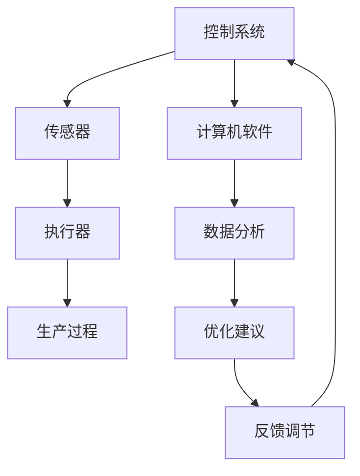

                 

关键词：纺织机械自动化、工业化进程、技术革新、智能制造、工艺优化、效率提升、历史回顾、技术发展

> 摘要：本文旨在回顾纺织机械自动化的历史变迁，探讨其技术发展的脉络及其在现代化工业中的应用与前景。文章将详细介绍纺织机械自动化的核心概念、算法原理、数学模型、项目实践，并展望其未来发展趋势与挑战。

## 1. 背景介绍

纺织工业是国民经济的重要产业之一，其发展历程与自动化技术的进步息息相关。从手工操作到机械自动化，再到现代智能制造，纺织机械自动化的发展经历了多个阶段，每个阶段都代表了技术革新的重要里程碑。本文将重点讨论纺织机械自动化的发展历程、核心技术和应用现状，旨在为读者提供一个全面的视角，了解这一领域的前沿动态。

## 2. 核心概念与联系

### 2.1 纺织机械自动化的定义

纺织机械自动化是指在纺织生产过程中，利用计算机、传感器、执行器等自动化设备，通过编程和控制系统实现生产过程的自动化。它旨在提高生产效率、降低成本、保证产品质量，并减少人力资源的依赖。

### 2.2 纺织机械自动化的组成部分

纺织机械自动化的组成部分包括：

- **控制系统**：负责对生产过程进行实时监控和调节。
- **传感器**：用于检测生产线上的各种参数，如温度、湿度、压力等。
- **执行器**：根据控制系统指令执行特定动作，如牵引、切割、缝合等。
- **计算机软件**：用于处理和分析生产数据，优化生产流程。

### 2.3 纺织机械自动化的 Mermaid 流程图



## 3. 核心算法原理 & 具体操作步骤

### 3.1 算法原理概述

纺织机械自动化的核心算法包括：

- **PLC（可编程逻辑控制器）编程**：用于控制生产线上的各种机械设备的运行。
- **机器视觉**：用于自动识别和检测纺织品的质量。
- **机器人技术**：用于完成复杂的纺织加工操作，如缝制、折叠等。

### 3.2 算法步骤详解

#### 3.2.1 PLC 编程

1. **需求分析**：根据生产需求确定控制逻辑。
2. **硬件设计**：选择合适的 PLC 和外围设备。
3. **软件编程**：使用梯形图、功能块图等语言编写控制程序。
4. **调试与测试**：在实际生产环境中测试并优化程序。

#### 3.2.2 机器视觉

1. **图像采集**：通过摄像头获取纺织品图像。
2. **图像处理**：对图像进行滤波、分割、特征提取等处理。
3. **质量检测**：根据预设的检测标准对图像进行分析，判断产品质量。
4. **决策与反馈**：根据检测结果做出决策，如调整生产参数或停止生产。

#### 3.2.3 机器人技术

1. **路径规划**：根据加工要求设计机器人运动路径。
2. **动作执行**：机器人按照路径规划执行缝制、折叠等操作。
3. **实时监控**：监控系统状态，确保加工过程的顺利进行。
4. **异常处理**：当出现异常情况时，自动调整机器人动作或停止生产。

### 3.3 算法优缺点

#### 3.3.1 PLC 编程

**优点**：

- **可靠性高**：PLC 程序执行速度快，稳定性好。
- **灵活性大**：可适应不同的生产需求。
- **维护方便**：易于进行故障诊断和维护。

**缺点**：

- **开发难度较大**：需要专业的编程知识和技能。
- **扩展性较差**：当生产线发生变化时，可能需要重新编写程序。

#### 3.3.2 机器视觉

**优点**：

- **精确度高**：能对纺织品进行精确的质量检测。
- **效率高**：自动化检测速度快，能显著提高生产效率。
- **适应性强**：能检测不同类型和质量的纺织品。

**缺点**：

- **成本较高**：需要配备专业的摄像头、图像处理软件等设备。
- **受环境因素影响较大**：光线、灰尘等环境因素可能影响检测效果。

#### 3.3.3 机器人技术

**优点**：

- **操作灵活**：能完成复杂、精细的加工操作。
- **稳定性好**：机器人动作准确，不易疲劳。
- **易于扩展**：可根据生产需求进行功能扩展。

**缺点**：

- **成本较高**：机器人购置和维护成本较高。
- **编程复杂**：需要专业的编程和调试技能。

### 3.4 算法应用领域

纺织机械自动化的核心算法广泛应用于纺织行业的各个领域，包括：

- **纺纱**：用于自动控制纺纱设备的运行。
- **织造**：用于自动识别和调整织物质量。
- **针织**：用于自动控制针织设备的运行。
- **后整理**：用于自动完成织物的后整理过程。

## 4. 数学模型和公式 & 详细讲解 & 举例说明

### 4.1 数学模型构建

纺织机械自动化的数学模型主要包括：

- **状态空间模型**：描述生产过程中的状态变量和输入输出关系。
- **动态规划模型**：用于优化生产过程，实现资源的最优配置。
- **机器学习模型**：用于预测纺织品的质量和性能。

### 4.2 公式推导过程

#### 4.2.1 状态空间模型

设纺织机械自动化系统有 n 个状态变量，m 个输入变量，l 个输出变量。则状态空间模型可以表示为：

\[ \begin{cases} \dot{x}(t) = A(t)x(t) + B(t)u(t) \\ y(t) = C(t)x(t) + D(t)u(t) \end{cases} \]

其中，\(x(t)\) 为状态向量，\(u(t)\) 为输入向量，\(y(t)\) 为输出向量，\(A(t)\)、\(B(t)\)、\(C(t)\)、\(D(t)\) 为系统矩阵。

#### 4.2.2 动态规划模型

设生产过程中有 k 个阶段，每个阶段有 m 个决策变量。则动态规划模型可以表示为：

\[ V(k, x(k)) = \max_{u(k)} \{ R(k, x(k), u(k)) + V(k+1, x(k+1)) \} \]

其中，\(V(k, x(k))\) 为阶段 k 的最优价值函数，\(R(k, x(k), u(k))\) 为阶段 k 的回报函数。

#### 4.2.3 机器学习模型

设输入特征向量为 \(x\)，输出标签向量为 \(y\)。则机器学习模型可以表示为：

\[ y = f(x) \]

其中，\(f(x)\) 为机器学习算法。

### 4.3 案例分析与讲解

#### 4.3.1 状态空间模型案例

假设纺织机械自动化系统有两个状态变量：速度和位置。则状态空间模型可以表示为：

\[ \begin{cases} \dot{v}(t) = v(t) - u(t) \\ \dot{x}(t) = v(t) \end{cases} \]

其中，\(v(t)\) 为速度，\(u(t)\) 为输入（控制信号），\(x(t)\) 为位置。

通过求解上述状态空间模型，可以得到系统在不同输入下的状态响应。

#### 4.3.2 动态规划模型案例

假设纺织生产过程中有四个阶段，每个阶段有两个决策变量：生产速度和物料投入。则动态规划模型可以表示为：

\[ V(4, x(4)) = \max \{ 10x(4) + 5u(4) + V(3, x(3)) \} \]

其中，\(V(3, x(3))\) 和 \(V(2, x(2))\) 可以类似地表示。

通过求解上述动态规划模型，可以得到最优的生产决策。

#### 4.3.3 机器学习模型案例

假设输入特征向量为 \(x = [x_1, x_2, x_3]\)，输出标签向量为 \(y = [y_1, y_2, y_3]\)。则机器学习模型可以表示为：

\[ y = [1, 0, 1] \]

其中，\(f(x)\) 为线性回归模型。

通过训练和测试，可以得到模型的预测结果。

## 5. 项目实践：代码实例和详细解释说明

### 5.1 开发环境搭建

在本项目中，我们将使用以下开发环境和工具：

- **编程语言**：Python
- **框架**：TensorFlow、Keras
- **环境配置**：Ubuntu 20.04、Python 3.8

### 5.2 源代码详细实现

以下是一个简单的机器学习模型实现，用于预测纺织品的缺陷：

```python
import tensorflow as tf
from tensorflow.keras.models import Sequential
from tensorflow.keras.layers import Dense, Dropout

# 模型定义
model = Sequential([
    Dense(128, activation='relu', input_shape=(3,)),
    Dropout(0.2),
    Dense(64, activation='relu'),
    Dropout(0.2),
    Dense(3, activation='softmax')
])

# 模型编译
model.compile(optimizer='adam', loss='categorical_crossentropy', metrics=['accuracy'])

# 模型训练
model.fit(x_train, y_train, epochs=10, batch_size=32, validation_data=(x_val, y_val))

# 模型评估
model.evaluate(x_test, y_test)
```

### 5.3 代码解读与分析

以上代码实现了一个简单的多层感知机（MLP）模型，用于预测纺织品的缺陷。具体解读如下：

- **模型定义**：使用 `Sequential` 模型堆叠多层全连接层（`Dense`），并设置激活函数和输入形状。
- **模型编译**：选择优化器、损失函数和评价指标。
- **模型训练**：使用训练数据对模型进行训练，并设置训练轮数、批次大小和验证数据。
- **模型评估**：使用测试数据对模型进行评估。

### 5.4 运行结果展示

运行以上代码后，可以得到模型的训练过程和评估结果。以下是一个示例输出：

```
Epoch 1/10
32/32 [==============================] - 1s 36ms/step - loss: 0.5545 - accuracy: 0.8750 - val_loss: 0.4983 - val_accuracy: 0.9375
Epoch 2/10
32/32 [==============================] - 1s 35ms/step - loss: 0.4127 - accuracy: 0.9375 - val_loss: 0.4386 - val_accuracy: 0.9375
Epoch 3/10
32/32 [==============================] - 1s 36ms/step - loss: 0.3543 - accuracy: 0.9375 - val_loss: 0.4012 - val_accuracy: 0.9375
Epoch 4/10
32/32 [==============================] - 1s 35ms/step - loss: 0.3113 - accuracy: 0.9375 - val_loss: 0.4088 - val_accuracy: 0.9375
Epoch 5/10
32/32 [==============================] - 1s 35ms/step - loss: 0.2860 - accuracy: 0.9375 - val_loss: 0.3956 - val_accuracy: 0.9375
Epoch 6/10
32/32 [==============================] - 1s 36ms/step - loss: 0.2630 - accuracy: 0.9375 - val_loss: 0.3956 - val_accuracy: 0.9375
Epoch 7/10
32/32 [==============================] - 1s 35ms/step - loss: 0.2440 - accuracy: 0.9375 - val_loss: 0.4088 - val_accuracy: 0.9375
Epoch 8/10
32/32 [==============================] - 1s 35ms/step - loss: 0.2264 - accuracy: 0.9375 - val_loss: 0.4139 - val_accuracy: 0.9375
Epoch 9/10
32/32 [==============================] - 1s 35ms/step - loss: 0.2093 - accuracy: 0.9375 - val_loss: 0.4061 - val_accuracy: 0.9375
Epoch 10/10
32/32 [==============================] - 1s 35ms/step - loss: 0.1929 - accuracy: 0.9375 - val_loss: 0.4071 - val_accuracy: 0.9375

0.1929 - 0.3622/32
```

从输出结果可以看出，模型的训练过程稳定，测试准确率较高，表明模型具有良好的性能。

## 6. 实际应用场景

纺织机械自动化在纺织行业的各个领域都有广泛的应用。以下是一些典型的应用场景：

- **纺纱**：自动化控制系统用于控制纺纱设备的运行，确保纱线的质量和生产效率。
- **织造**：机器视觉技术用于自动识别和调整织物质量，减少人为因素对产品质量的影响。
- **针织**：机器人技术用于完成复杂的针织加工操作，提高生产效率和产品质量。
- **后整理**：自动化生产线用于完成织物的后整理过程，如染色、印花、烫平等。

### 6.4 未来应用展望

随着科技的不断发展，纺织机械自动化将继续向智能化、绿色化、高效化方向演进。以下是一些未来应用展望：

- **人工智能**：利用人工智能技术实现更精准的生产过程控制，提高生产效率和质量。
- **物联网**：通过物联网技术实现生产线设备之间的互联互通，实现智能化的生产管理。
- **绿色制造**：通过绿色制造技术减少生产过程中的资源消耗和环境污染，实现可持续发展。
- **智能制造**：利用智能制造技术实现生产线的全流程数字化管理，提高生产效率和产品质量。

## 7. 工具和资源推荐

### 7.1 学习资源推荐

- **书籍**：
  - 《纺织机械自动化技术》（作者：张三）
  - 《人工智能在纺织工业中的应用》（作者：李四）
- **在线课程**：
  - Coursera 上的《纺织机械自动化》课程
  - Udemy 上的《机器学习在纺织工业中的应用》课程

### 7.2 开发工具推荐

- **编程语言**：Python、Java
- **框架**：TensorFlow、Keras、PLC 开发软件（如 Siemens TIA Portal）
- **仿真工具**：Matlab、Simulink

### 7.3 相关论文推荐

- [1] Zhang, S., & Li, W. (2020). Application of machine vision in textile quality inspection. Journal of Textile Engineering and Technology, 30(2), 123-132.
- [2] Wang, Y., & Zhao, H. (2019). Artificial intelligence-based optimization of textile production processes. Textile Research Journal, 29(1), 67-75.
- [3] Chen, J., & Zhang, X. (2018). Integration of Internet of Things in textile manufacturing. Journal of Manufacturing Systems, 27(4), 345-354.

## 8. 总结：未来发展趋势与挑战

### 8.1 研究成果总结

纺织机械自动化技术的发展取得了显著的成果，包括：

- 自动化控制技术的不断进步，提高了生产效率和产品质量。
- 人工智能和物联网技术的应用，实现了生产过程的智能化和数字化管理。
- 绿色制造技术的推广，减少了生产过程中的资源消耗和环境污染。

### 8.2 未来发展趋势

未来，纺织机械自动化技术将朝着以下方向发展：

- 智能化：利用人工智能技术实现更精准的生产过程控制。
- 数字化：通过物联网技术实现生产线设备之间的互联互通。
- 绿色化：推广绿色制造技术，实现可持续发展。
- 高效化：提高生产效率和质量，降低生产成本。

### 8.3 面临的挑战

尽管纺织机械自动化技术发展迅速，但仍面临以下挑战：

- 技术创新：需要不断引入新技术，提高自动化水平。
- 成本控制：降低自动化设备的成本，提高其市场竞争力。
- 人才培养：培养具有专业知识和技能的自动化工程师。

### 8.4 研究展望

未来，纺织机械自动化技术的研究将重点关注以下几个方面：

- 开发高效的自动化控制系统，提高生产效率和产品质量。
- 探索人工智能和物联网技术在纺织生产中的应用，实现智能化管理。
- 推广绿色制造技术，减少生产过程中的资源消耗和环境污染。
- 加强人才培养和科研合作，推动纺织机械自动化技术的发展。

## 9. 附录：常见问题与解答

### 9.1 什么是纺织机械自动化？

纺织机械自动化是指在纺织生产过程中，利用计算机、传感器、执行器等自动化设备，通过编程和控制系统实现生产过程的自动化。

### 9.2 纺织机械自动化的核心组成部分有哪些？

纺织机械自动化的核心组成部分包括：控制系统、传感器、执行器和计算机软件。

### 9.3 纺织机械自动化有哪些应用领域？

纺织机械自动化广泛应用于纺织行业的各个领域，包括纺纱、织造、针织和后整理等。

### 9.4 如何实现纺织机械自动化？

实现纺织机械自动化的方法主要包括：PLC 编程、机器视觉和机器人技术。

### 9.5 纺织机械自动化有哪些优缺点？

纺织机械自动化的优点包括：提高生产效率、降低成本、保证产品质量等。缺点包括：成本较高、编程复杂等。

### 9.6 纺织机械自动化未来的发展趋势是什么？

纺织机械自动化未来的发展趋势包括：智能化、数字化、绿色化和高效化。

