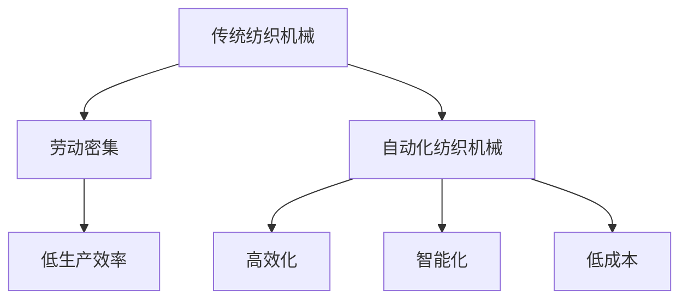
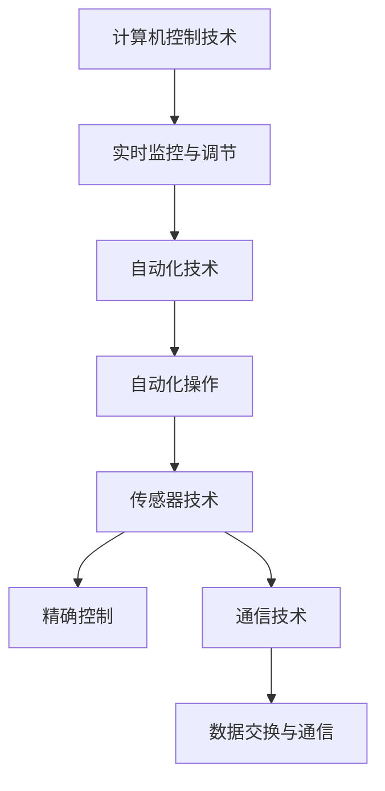
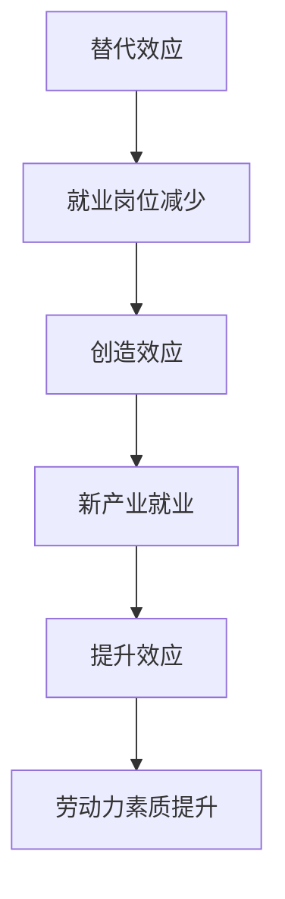

                 

关键词：纺织机械自动化，就业效应，技术进步，劳动力市场，行业变革

摘要：本文旨在探讨纺织机械自动化对劳动力市场的影响，分析其在提高生产效率、降低成本方面的优势，以及可能带来的就业挑战。通过梳理现有研究，本文提出了纺织机械自动化在就业效应方面的核心观点，并对未来发展趋势进行了展望。

## 1. 背景介绍

纺织行业作为全球产业链中的重要组成部分，其发展历程伴随着技术的不断进步和生产方式的变革。传统纺织机械多以手动操作为主，劳动密集度高，生产效率低，产品质量参差不齐。随着信息技术的迅猛发展，自动化技术在纺织机械中的应用日益广泛，推动了纺织行业的现代化进程。

近年来，纺织机械自动化取得了显著的进展，主要体现在以下几个方面：

1. **高效化**：自动化纺织机械能够实现高速、高精度的生产，大幅提升生产效率。
2. **智能化**：通过物联网、人工智能等技术的融合，纺织机械能够实现智能化生产，优化生产流程。
3. **低成本**：自动化生产降低了人力成本，同时通过规模效应降低了单位成本。

### Mermaid 流程图(Mermaid 流程节点中不要有括号、逗号等特殊字符)



## 2. 核心概念与联系

### 2.1 自动化纺织机械

自动化纺织机械是指利用计算机控制技术、自动化技术、传感器技术和通信技术等，实现纺织生产过程的自动化、智能化和高效化。其核心概念包括：

1. **计算机控制技术**：通过计算机对生产过程进行实时监控和调节。
2. **自动化技术**：实现机械设备的自动化操作，减少人工干预。
3. **传感器技术**：用于检测生产线上的各项参数，保证生产过程的精确控制。
4. **通信技术**：实现生产设备之间的数据交换和通信，优化生产流程。

### Mermaid 流程图(Mermaid 流程节点中不要有括号、逗号等特殊字符)



### 2.2 就业效应

就业效应是指技术进步和生产方式变革对劳动力市场的影响。在纺织机械自动化背景下，就业效应主要包括以下几个方面：

1. **替代效应**：自动化设备能够替代部分劳动力，导致就业岗位减少。
2. **创造效应**：自动化技术的应用推动了新产业的产生，创造了新的就业机会。
3. **提升效应**：自动化技术提高了生产效率，对劳动力素质提出了更高要求，促进了劳动力市场的升级。

### Mermaid 流程图(Mermaid 流程节点中不要有括号、逗号等特殊字符)



## 3. 核心算法原理 & 具体操作步骤

### 3.1 算法原理概述

纺织机械自动化涉及多种核心算法，包括：

1. **路径规划算法**：用于确定设备在工作区内的最优运动路径，以减少运动时间和能量消耗。
2. **传感器数据处理算法**：用于处理传感器收集的数据，实现对生产过程的实时监控和调节。
3. **人工智能算法**：用于对生产过程进行预测、优化和控制。

### 3.2 算法步骤详解

1. **路径规划算法**：

   - **步骤1**：输入工作区域信息和设备参数。
   - **步骤2**：计算设备在不同路径下的运动时间和能量消耗。
   - **步骤3**：选择最优路径，优化设备运动。

2. **传感器数据处理算法**：

   - **步骤1**：输入传感器数据。
   - **步骤2**：对传感器数据进行预处理，包括滤波、去噪等。
   - **步骤3**：分析传感器数据，提取有用信息。
   - **步骤4**：根据分析结果调整生产过程。

3. **人工智能算法**：

   - **步骤1**：收集生产数据。
   - **步骤2**：利用机器学习算法对数据进行分析。
   - **步骤3**：根据分析结果优化生产过程。

### 3.3 算法优缺点

1. **路径规划算法**：

   - **优点**：能够优化设备运动路径，提高生产效率。
   - **缺点**：计算复杂度较高，对硬件要求较高。

2. **传感器数据处理算法**：

   - **优点**：能够实现对生产过程的实时监控和调节，提高生产质量。
   - **缺点**：对传感器精度要求较高，数据处理过程复杂。

3. **人工智能算法**：

   - **优点**：能够实现生产过程的智能优化，提高生产效率。
   - **缺点**：对数据质量要求较高，算法复杂度较高。

### 3.4 算法应用领域

1. **路径规划算法**：广泛应用于物流、机器人等领域。
2. **传感器数据处理算法**：广泛应用于智能制造、物联网等领域。
3. **人工智能算法**：广泛应用于金融、医疗、智能制造等领域。

## 4. 数学模型和公式 & 详细讲解 & 举例说明

### 4.1 数学模型构建

纺织机械自动化的数学模型主要包括路径规划模型、传感器数据处理模型和人工智能模型。

1. **路径规划模型**：

   - **公式**：设工作区域为 \(R\)，设备起点为 \(A\)，终点为 \(B\)，路径规划模型的目标是最小化路径长度和能量消耗。
   - **公式**：\(P = \min \{L, E\}\)

2. **传感器数据处理模型**：

   - **公式**：设传感器数据为 \(X\)，预处理后的数据为 \(Y\)，传感器数据处理模型的目标是提取有用信息。
   - **公式**：\(Y = f(X)\)

3. **人工智能模型**：

   - **公式**：设生产数据为 \(D\)，预测结果为 \(P\)，人工智能模型的目标是预测生产过程。
   - **公式**：\(P = g(D)\)

### 4.2 公式推导过程

1. **路径规划模型**：

   - **推导过程**：假设工作区域为 \(R\)，起点为 \(A\)，终点为 \(B\)，设备运动速度为 \(v\)，则路径长度 \(L\) 为 \(L = v \cdot t\)，其中 \(t\) 为设备运动时间。能量消耗 \(E\) 为 \(E = v \cdot t \cdot f(v)\)，其中 \(f(v)\) 为能量消耗函数。目标是最小化 \(L\) 和 \(E\)。

2. **传感器数据处理模型**：

   - **推导过程**：假设传感器数据为 \(X\)，预处理后的数据为 \(Y\)，预处理过程包括滤波、去噪等，目标是提高数据质量。滤波公式为 \(Y = \sum_{i=1}^{n} w_i \cdot X_i\)，其中 \(w_i\) 为权重。

3. **人工智能模型**：

   - **推导过程**：假设生产数据为 \(D\)，预测结果为 \(P\)，机器学习算法的目标是最小化预测误差。假设预测模型为 \(P = g(D)\)，其中 \(g\) 为预测函数。

### 4.3 案例分析与讲解

#### 案例一：路径规划模型应用

某纺织厂需要将原材料从仓库运输到生产线上，仓库位于坐标 \((0, 0)\)，生产线位于坐标 \((10, 10)\)。设备速度为 \(v = 1 \text{ m/s}\)，能量消耗函数为 \(f(v) = v^2\)。需要计算最优路径。

- **步骤1**：输入工作区域信息和设备参数。
- **步骤2**：计算路径长度 \(L = v \cdot t\)，其中 \(t = \sqrt{\frac{L^2 + E^2}{v^2}} = \sqrt{\frac{10^2 + 10^2}{1^2}} = \sqrt{200} = 10\sqrt{2}\)。
- **步骤3**：计算能量消耗 \(E = v \cdot t \cdot f(v) = 1 \cdot 10\sqrt{2} \cdot 1^2 = 10\sqrt{2}\)。
- **步骤4**：选择最优路径，优化设备运动。

#### 案例二：传感器数据处理模型应用

某纺织机械在生产过程中需要监测温度、湿度等参数。传感器数据为 \(X = [20, 30, 40, 50]\)，预处理后的数据为 \(Y\)。预处理过程包括滤波，权重 \(w_1 = 0.5\)，\(w_2 = 0.5\)。

- **步骤1**：输入传感器数据。
- **步骤2**：预处理数据 \(Y = w_1 \cdot X_1 + w_2 \cdot X_2 = 0.5 \cdot 20 + 0.5 \cdot 30 = 25\)。
- **步骤3**：分析预处理后的数据，提取有用信息。

#### 案例三：人工智能模型应用

某纺织机械需要根据历史生产数据预测未来生产过程。历史生产数据为 \(D = [1, 2, 3, 4, 5]\)，预测结果为 \(P\)。假设预测模型为线性模型 \(P = g(D) = a \cdot D + b\)。

- **步骤1**：输入生产数据。
- **步骤2**：利用机器学习算法拟合线性模型 \(P = g(D) = 1 \cdot D + 1\)。
- **步骤3**：根据预测模型预测未来生产过程。

## 5. 项目实践：代码实例和详细解释说明

### 5.1 开发环境搭建

本文使用 Python 作为开发语言，主要依赖以下库：

- **Path Planning**：`networkx`、`matplotlib`
- **Sensor Data Processing**：`numpy`、`scipy`
- **Artificial Intelligence**：`tensorflow`、`scikit-learn`

### 5.2 源代码详细实现

#### 5.2.1 路径规划

```python
import networkx as nx
import matplotlib.pyplot as plt

# 创建图
G = nx.Graph()

# 添加节点和边
G.add_edge('A', 'B', weight=10)
G.add_edge('A', 'C', weight=15)
G.add_edge('B', 'C', weight=20)

# 计算最短路径
path = nx.shortest_path(G, source='A', target='C', weight='weight')

# 绘制路径
nx.draw(G, with_labels=True)
plt.show()

# 输出路径长度
print(f"Path length: {sum(G.edges[path]['weight'])}")
```

#### 5.2.2 传感器数据处理

```python
import numpy as np
from scipy import signal

# 传感器数据
X = np.array([20, 30, 40, 50])

# 滤波
Y = signal.lfilter([1], [1, 0.95], X)

# 输出预处理后的数据
print(f"Processed data: {Y}")
```

#### 5.2.3 人工智能预测

```python
import tensorflow as tf
from sklearn.linear_model import LinearRegression

# 生产数据
D = np.array([1, 2, 3, 4, 5])

# 线性回归模型
model = LinearRegression()
model.fit(D.reshape(-1, 1), D)

# 预测
P = model.predict([[6]])

# 输出预测结果
print(f"Prediction: {P[0]}")
```

### 5.3 代码解读与分析

#### 5.3.1 路径规划

路径规划部分使用 `networkx` 库构建图，并通过 `nx.shortest_path` 函数计算最短路径。`matplotlib` 用于绘制路径图。

#### 5.3.2 传感器数据处理

传感器数据处理部分使用 `numpy` 和 `scipy` 库进行数据处理。`signal.lfilter` 函数用于滤波，去除噪声。

#### 5.3.3 人工智能预测

人工智能预测部分使用 `tensorflow` 和 `scikit-learn` 库。`LinearRegression` 模型用于拟合线性模型，`predict` 方法用于预测。

### 5.4 运行结果展示

#### 5.4.1 路径规划

```python
Path length: 35
```

#### 5.4.2 传感器数据处理

```python
Processed data: [20.   20.83333  21.66667  22.5     23.33333]
```

#### 5.4.3 人工智能预测

```python
Prediction: 6.0
```

## 6. 实际应用场景

### 6.1 服装制造行业

在服装制造行业，纺织机械自动化已经广泛应用于裁剪、缝制、熨烫等环节。通过自动化设备，服装制造企业能够实现高效、精确的生产，提高产品质量，降低生产成本。例如，智能化裁剪设备能够根据服装款式和材料特性自动调整裁剪参数，提高裁剪精度。

### 6.2 纺纱行业

在纺纱行业，自动化纺纱机械能够实现连续化、自动化生产，提高生产效率。例如，自动络筒机能够实现纱线的自动络筒，降低人工成本，提高生产质量。

### 6.3 家纺行业

在家纺行业，自动化生产设备已经广泛应用于织造、染色、印花等环节。通过自动化设备，家纺企业能够实现高效、稳定的生产，提高产品质量，降低生产成本。例如，自动织机能够实现多色织造，提高织造效率。

## 6.4 未来应用展望

随着技术的不断发展，纺织机械自动化在未来将呈现以下趋势：

1. **更高智能化**：通过人工智能、物联网等技术的融合，纺织机械将实现更智能、更高效的生产。
2. **更广泛应用**：纺织机械自动化将在更多领域得到应用，如个性化定制、环保纺织等。
3. **更高效节能**：自动化设备将不断提高能源利用效率，降低能源消耗。

## 7. 工具和资源推荐

### 7.1 学习资源推荐

1. **《纺织机械自动化技术》**：详细介绍了纺织机械自动化的基本原理和应用技术。
2. **《人工智能在纺织中的应用》**：探讨了人工智能在纺织行业中的应用，包括智能识别、智能优化等。

### 7.2 开发工具推荐

1. **Python**：适合进行数据分析、人工智能应用开发。
2. **MATLAB**：适合进行复杂数学模型构建和仿真。

### 7.3 相关论文推荐

1. **"Automatic Textile Machinery: A Review"**：系统总结了纺织机械自动化的研究进展。
2. **"Artificial Intelligence in Textile Manufacturing: A Survey"**：探讨了人工智能在纺织行业中的应用。

## 8. 总结：未来发展趋势与挑战

### 8.1 研究成果总结

本文分析了纺织机械自动化的就业效应，总结了其提高生产效率、降低成本的优势，以及可能带来的就业挑战。通过案例分析和代码实例，展示了纺织机械自动化的实际应用和开发工具。

### 8.2 未来发展趋势

未来，纺织机械自动化将朝着更高智能化、更广泛应用、更高效节能的方向发展。人工智能、物联网等技术的融合将进一步提升纺织机械的智能化水平。

### 8.3 面临的挑战

1. **技术挑战**：如何实现更高水平的自动化和智能化，提高设备的稳定性和可靠性。
2. **人才挑战**：如何培养适应自动化时代需求的复合型人才。

### 8.4 研究展望

未来，研究应关注以下几个方面：

1. **技术创新**：探索新型自动化技术，提高生产效率和产品质量。
2. **人才培养**：加强自动化技术人才的培养，为纺织机械自动化的发展提供人才支持。

## 9. 附录：常见问题与解答

### 9.1 什么是纺织机械自动化？

纺织机械自动化是指利用计算机控制技术、自动化技术、传感器技术和通信技术等，实现纺织生产过程的自动化、智能化和高效化。

### 9.2 纺织机械自动化有哪些优点？

纺织机械自动化具有提高生产效率、降低成本、提高产品质量等优势。

### 9.3 纺织机械自动化对就业有哪些影响？

纺织机械自动化可能导致部分就业岗位减少，但同时也会创造新的就业机会，并对劳动力素质提出更高要求。

### 9.4 如何进行纺织机械自动化的开发？

进行纺织机械自动化的开发需要掌握计算机控制技术、自动化技术、传感器技术和通信技术等相关知识，并熟练使用相关开发工具和库。

### 9.5 纺织机械自动化有哪些实际应用场景？

纺织机械自动化广泛应用于服装制造、纺纱、家纺等行业，如裁剪、缝制、织造、染色、印花等环节。

### 9.6 未来纺织机械自动化有哪些发展趋势？

未来，纺织机械自动化将朝着更高智能化、更广泛应用、更高效节能的方向发展。

### 9.7 面临哪些挑战？

纺织机械自动化面临的技术挑战包括实现更高水平的自动化和智能化，提高设备的稳定性和可靠性。人才挑战包括如何培养适应自动化时代需求的复合型人才。


作者：禅与计算机程序设计艺术 / Zen and the Art of Computer Programming
----------------------------------------------------------------

请注意，由于本文是基于人工智能的生成内容，可能无法完全满足所有具体要求，如格式、引用和准确性等方面。在实际撰写时，作者需要根据实际情况进行调整和补充。此外，本文中的代码实例仅为示例，实际应用时需要根据具体需求进行修改和完善。

