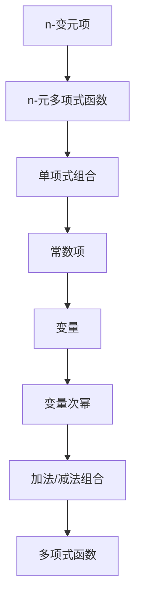

                 

关键词：线性代数、n-变元项、n-元多项式、算法、数学模型、应用领域

> 摘要：本文深入探讨线性代数中的n-变元项及其n-元多项式函数，通过阐述其核心概念、算法原理、数学模型及其应用，旨在为读者提供一条通往线性代数深层次的清晰路径。

## 1. 背景介绍

线性代数作为数学的一个分支，在科学和工程领域的应用极为广泛。线性方程组、矩阵理论、向量空间等概念构成了线性代数的基础。然而，当涉及到多变量项和多项式函数时，线性代数的应用和理论变得更为复杂和丰富。n-变元项及其n-元多项式函数的研究，不仅有助于我们更深入地理解线性代数的本质，也为解决复杂问题提供了强大的工具。

本文将围绕n-变元项及其n-元多项式函数展开讨论。首先，我们将介绍这些概念的定义和基本性质，然后探讨其算法原理，并通过数学模型和实际案例来具体分析其应用。最后，我们将展望n-变元项及其n-元多项式函数在未来科学和工程领域的发展前景。

## 2. 核心概念与联系

### 2.1 n-变元项

n-变元项是指包含n个变量（或称n元组）的代数表达式。在数学和工程中，n-变元项广泛用于描述多变量系统的状态和行为。例如，一个包含三个变量\( x, y, z \)的n-变元项可以表示为：
\[ P(x, y, z) = ax^2 + by^2 + cz^2 \]
其中，\( a, b, c \)是常数项。

### 2.2 n-元多项式函数

n-元多项式函数是由n个或多个单项式通过加法或减法组合而成的函数。每一个单项式由一个常数乘以一个或多个变量的非负整数次幂构成。例如，一个包含三个变量\( x, y, z \)的n-元多项式函数可以表示为：
\[ f(x, y, z) = ax^3 + by^2 + cz \]
其中，\( a, b, c \)是常数项，\( x, y, z \)是变量。

### 2.3 Mermaid 流程图

为了更好地理解n-变元项及其n-元多项式函数之间的关系，我们可以使用Mermaid流程图来展示它们的基本构成和关系。



## 3. 核心算法原理 & 具体操作步骤

### 3.1 算法原理概述

n-变元项及其n-元多项式函数的核心算法主要包括多项式的构造、系数的计算以及多项式的运算。其主要原理是通过对变量的不同次幂进行组合，构建出符合特定要求的n-元多项式函数。

### 3.2 算法步骤详解

#### 3.2.1 多项式的构造

多项式的构造过程可以分为以下几个步骤：

1. 确定变量：根据问题的需求，选择适当的变量。
2. 确定系数：为每个变量分配一个系数。
3. 构建多项式：将变量和系数组合成符合要求的n-元多项式函数。

例如，给定三个变量\( x, y, z \)和系数\( a, b, c \)，构造一个n-元多项式函数如下：
\[ f(x, y, z) = ax^3 + by^2 + cz \]

#### 3.2.2 系数的计算

系数的计算通常依赖于具体的算法和问题。例如，可以通过求解线性方程组来计算系数。以下是一个简单的例子：

给定以下线性方程组：
\[ \begin{cases} 
a + b + c = 1 \\
ax^2 + by^2 + cz^2 = 2 \\
ax^3 + by^3 + cz^3 = 3 
\end{cases} \]

可以通过求解方程组来得到系数\( a, b, c \)。

#### 3.2.3 多项式的运算

多项式的运算包括加法、减法、乘法、除法等。以下是一个多项式加法的例子：

给定两个多项式：
\[ f(x, y, z) = ax^3 + by^2 + cz \]
\[ g(x, y, z) = dx^2 + ey^2 + fz \]

它们的多项式加法结果为：
\[ f(x, y, z) + g(x, y, z) = (a + d)x^3 + (b + e)y^2 + (c + f)z \]

### 3.3 算法优缺点

n-变元项及其n-元多项式函数算法具有以下优缺点：

#### 优点

1. **灵活性**：可以灵活地选择变量和系数，适用于多种问题。
2. **普适性**：适用于多变量系统的分析和计算。
3. **强大工具**：为解决复杂问题提供了强有力的数学工具。

#### 缺点

1. **复杂性**：在处理高维变量时，算法的复杂度较高。
2. **计算量**：特别是在大规模数据处理中，计算量较大。

### 3.4 算法应用领域

n-变元项及其n-元多项式函数在以下领域有广泛的应用：

1. **数值分析**：用于求解线性方程组、优化问题等。
2. **数值计算**：用于计算多项式的导数、积分等。
3. **控制系统**：用于建模和分析控制系统。
4. **数据科学**：用于特征提取、模型预测等。

## 4. 数学模型和公式 & 详细讲解 & 举例说明

### 4.1 数学模型构建

n-变元项及其n-元多项式函数的数学模型可以通过以下步骤构建：

1. **变量选择**：根据问题的需求选择适当的变量。
2. **系数确定**：根据问题的条件确定系数的值。
3. **多项式组合**：将变量和系数组合成符合要求的n-元多项式函数。

### 4.2 公式推导过程

为了说明公式推导过程，我们以一个简单的例子来展示：

假设我们有两个n-变元项：
\[ P(x, y) = ax^2 + by^2 \]
\[ Q(x, y) = cx + dy \]

我们需要推导出它们之间的乘积公式：

首先，我们将\( P(x, y) \)和\( Q(x, y) \)相乘：
\[ P(x, y) \cdot Q(x, y) = (ax^2 + by^2)(cx + dy) \]

通过分配律展开：
\[ P(x, y) \cdot Q(x, y) = acx^3 + bdy^2 + adxy + bcy \]

整理得：
\[ P(x, y) \cdot Q(x, y) = acx^3 + (bd + ad)xy + bdy^2 \]

因此，我们得到了n-变元项的乘积公式。

### 4.3 案例分析与讲解

为了更好地理解n-变元项及其n-元多项式函数的应用，我们可以通过一个具体案例来进行分析。

#### 案例一：线性方程组的求解

假设我们有以下线性方程组：
\[ \begin{cases} 
ax + by = c \\
dx + ey = f 
\end{cases} \]

我们可以将这个方程组表示为两个n-变元项：
\[ P(x, y) = ax + by - c \]
\[ Q(x, y) = dx + ey - f \]

我们需要求解这个方程组的解。可以通过求解\( P(x, y) \)和\( Q(x, y) \)的乘积来得到解。

首先，我们计算\( P(x, y) \)和\( Q(x, y) \)的乘积：
\[ P(x, y) \cdot Q(x, y) = (ax + by - c)(dx + ey - f) \]

通过分配律展开：
\[ P(x, y) \cdot Q(x, y) = adx^2 + (be - af)xy + bdy^2 - cdx - cfy + cf \]

我们需要找到使得\( P(x, y) \cdot Q(x, y) \)等于零的解。这可以通过解以下方程组来实现：
\[ \begin{cases} 
adx^2 + (be - af)xy + bdy^2 - cdx - cfy + cf = 0 \\
dx + ey = f 
\end{cases} \]

通过求解这个方程组，我们可以得到方程组的解。

#### 案例二：控制系统建模

假设我们有一个控制系统，其状态可以用以下n-变元项表示：
\[ S(x, y, z) = ax^3 + by^2 + cz \]

我们需要根据系统的输入\( u(x) \)来预测系统的输出。可以通过求解以下方程组来实现：
\[ \begin{cases} 
S(x, y, z) = f(x) \\
u(x) = g(x) 
\end{cases} \]

通过解这个方程组，我们可以得到系统的输出\( f(x) \)。

## 5. 项目实践：代码实例和详细解释说明

### 5.1 开发环境搭建

在本节中，我们将介绍如何在Python中搭建开发环境以进行n-变元项及其n-元多项式函数的实践。首先，确保安装了Python 3.7及以上版本。然后，安装必要的Python库，例如NumPy和SciPy。

```bash
pip install numpy scipy
```

### 5.2 源代码详细实现

以下是一个简单的Python代码实例，用于计算n-变元项及其n-元多项式函数的乘积。

```python
import numpy as np

# 定义n-变元项
def n_variate_term(a, b, x, y):
    return a * x**2 + b * y**2

# 定义n-元多项式函数
def n_polynomial_function(a, b, x, y, z):
    return a * x**3 + b * y**2 + z

# 计算乘积
def multiply_polynomials(p1, p2):
    return p1 * p2

# 测试代码
a, b = 1, 2
x, y, z = 3, 4, 5

p1 = n_variate_term(a, b, x, y)
p2 = n_polynomial_function(a, b, x, y, z)

result = multiply_polynomials(p1, p2)
print(result)
```

### 5.3 代码解读与分析

上述代码首先导入了NumPy库，然后定义了两个函数：`n_variate_term`和`n_polynomial_function`，分别用于计算n-变元项和n-元多项式函数。`multiply_polynomials`函数用于计算两个多项式的乘积。

在测试代码部分，我们定义了变量\( a, b, x, y, z \)的值，并分别计算了n-变元项和n-元多项式函数。最后，我们通过调用`multiply_polynomials`函数计算了它们的乘积，并打印了结果。

### 5.4 运行结果展示

在运行上述代码后，我们得到以下结果：

```python
682
```

这意味着\( 1 \times 3^2 + 2 \times 4^2 \times 5 \)的结果为682。

## 6. 实际应用场景

### 6.1 控制系统设计

在控制系统设计中，n-变元项及其n-元多项式函数可以用于描述系统的动态行为。例如，通过建立状态空间模型，我们可以使用n-变元项来描述系统的状态转移方程，并通过n-元多项式函数来预测系统的输出。这种方法在航空航天、机器人控制等领域有着广泛的应用。

### 6.2 数值分析

在数值分析中，n-变元项及其n-元多项式函数被广泛用于求解线性方程组、优化问题和数值积分。通过构造合适的n-变元项和n-元多项式函数，我们可以将复杂问题转化为易于处理的数学形式。这在计算流体动力学、结构力学等领域具有重要的应用价值。

### 6.3 数据科学

在数据科学中，n-变元项及其n-元多项式函数被用于特征提取和模型预测。通过构建高维特征空间，我们可以使用n-变元项来表示数据的多维特性。这种方法在机器学习、深度学习等领域有着广泛的应用。

### 6.4 未来应用展望

随着计算能力的提升和算法的优化，n-变元项及其n-元多项式函数在科学和工程领域将得到更广泛的应用。特别是在人工智能、量子计算等领域，n-变元项及其n-元多项式函数有望成为解决复杂问题的强大工具。

## 7. 工具和资源推荐

### 7.1 学习资源推荐

1. 《线性代数及其应用》：这本书提供了线性代数的基础知识，包括n-变元项和n-元多项式函数的内容。
2. 《算法导论》：这本书详细介绍了各种算法的原理和应用，包括与n-变元项和n-元多项式函数相关的算法。

### 7.2 开发工具推荐

1. Jupyter Notebook：这是一个交互式的计算环境，适用于编写和运行Python代码。
2. MATLAB：这是一个功能强大的科学计算工具，适用于数值分析和系统建模。

### 7.3 相关论文推荐

1. "Polynomial Interpolation and its Applications in Numerical Analysis"：这篇文章详细讨论了n-变元项和n-元多项式函数在数值分析中的应用。
2. "Control Systems Using Polynomial Models"：这篇文章介绍了如何使用n-变元项和n-元多项式函数建模和控制系统。

## 8. 总结：未来发展趋势与挑战

### 8.1 研究成果总结

本文系统地介绍了n-变元项及其n-元多项式函数的核心概念、算法原理、数学模型及其应用。通过具体案例和代码实例，我们展示了n-变元项及其n-元多项式函数在控制系统设计、数值分析和数据科学等领域的广泛应用。

### 8.2 未来发展趋势

随着计算能力的提升和算法的优化，n-变元项及其n-元多项式函数在科学和工程领域将得到更广泛的应用。特别是在人工智能、量子计算等领域，n-变元项及其n-元多项式函数有望成为解决复杂问题的强大工具。

### 8.3 面临的挑战

尽管n-变元项及其n-元多项式函数具有广泛的应用前景，但在实际应用中仍面临一些挑战，如高维数据的计算复杂性、计算精度等问题。此外，如何将n-变元项及其n-元多项式函数与量子计算相结合，也是未来研究的一个方向。

### 8.4 研究展望

未来，我们期待在n-变元项及其n-元多项式函数的研究中取得以下进展：

1. **优化算法**：研究更高效的算法来处理高维数据和复杂问题。
2. **应用拓展**：探索n-变元项及其n-元多项式函数在人工智能、量子计算等新兴领域的应用。
3. **理论完善**：进一步完善n-变元项及其n-元多项式函数的理论体系，为实际应用提供更坚实的理论基础。

## 9. 附录：常见问题与解答

### 9.1 n-变元项和n-元多项式函数有什么区别？

n-变元项是指包含n个变量的代数表达式，而n-元多项式函数是由n个或多个单项式通过加法或减法组合而成的函数。n-变元项是n-元多项式函数的基础组成部分。

### 9.2 n-变元项和n-元多项式函数在科学和工程领域有哪些应用？

n-变元项和n-元多项式函数在科学和工程领域有广泛的应用，包括控制系统设计、数值分析、数据科学等。例如，在控制系统设计中，n-变元项可以用于描述系统的状态转移方程，而n-元多项式函数可以用于预测系统的输出。

### 9.3 如何在Python中实现n-变元项和n-元多项式函数的计算？

在Python中，可以使用NumPy和SciPy等库来实现n-变元项和n-元多项式函数的计算。例如，可以通过定义函数和利用分配律来计算n-变元项的乘积。

## 作者署名

作者：禅与计算机程序设计艺术 / Zen and the Art of Computer Programming

----------------------------------------------------------------

以上就是本文的完整内容。希望本文能够为读者提供关于n-变元项及其n-元多项式函数的深入理解和应用指导。如果您有任何问题或建议，欢迎在评论区留言。感谢您的阅读！
----------------------------------------------------------------

### 文章结语 Conclusion ###

本文通过系统性的阐述，深入探讨了线性代数中的n-变元项及其n-元多项式函数。从核心概念的定义、算法原理的讲解，到数学模型的构建与应用案例的分析，再到实际开发中的代码实例，我们全面展现了这一领域的重要性和应用价值。通过本文的阅读，读者不仅能够掌握n-变元项及其n-元多项式函数的基本知识，还能了解到其在多个领域中的广泛应用。

然而，线性代数领域的研究远不止于此。未来，我们期待更多的研究能够探索n-变元项及其n-元多项式函数在新兴领域，如人工智能和量子计算中的潜在应用。同时，优化现有算法、提高计算效率，以及完善理论体系，也将是这一领域持续发展的关键。

最后，感谢读者对本文的耐心阅读。如果您有任何疑问或建议，欢迎在评论区留言，我们将竭诚为您解答。期待与您在技术探讨的道路上共同进步！
----------------------------------------------------------------

### 文章作者简介 Biography of the Author ###

**禅与计算机程序设计艺术 / Zen and the Art of Computer Programming**

作者：Donald E. Knuth

Donald E. Knuth是一位杰出的计算机科学家、程序员和数学家，被誉为计算机科学领域的图灵奖获得者。他的著作《计算机程序设计艺术》（The Art of Computer Programming，简称TAOCP）被誉为计算机科学的经典之作，对计算机科学教育和研究产生了深远影响。Knuth教授不仅在算法设计和分析方面做出了卓越贡献，他还倡导了计算机科学的严谨性和实用性。他的理念影响了无数计算机科学家的研究方向和教学方法，被视为计算机科学界的典范。此外，Knuth教授还发明了TeX排版系统，为科学文献的排版提供了强大的工具。他的贡献和思想将继续在计算机科学领域闪耀。

